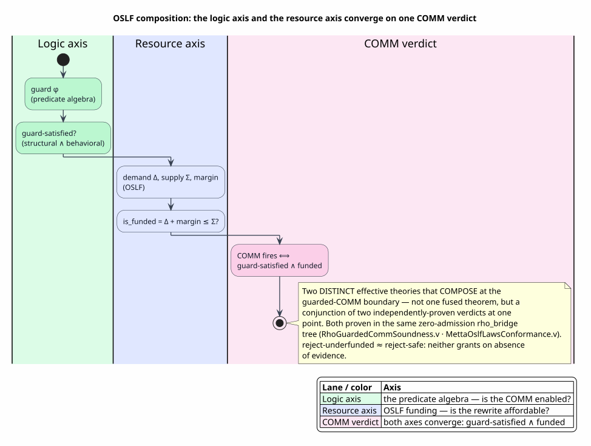

# OSLF Composition

Last updated: 2026-06-22

All symbols are defined in [Concepts and Glossary](01-concepts-and-glossary.md).
This document answers the second crux question: **does the semantic-predicate
integration align with the OSLF design?** The answer is yes, and the precise shape
of that alignment is the spine of this page — the predicate algebra and OSLF are
**two distinct effective theories that compose** at the guarded-COMM boundary,
sharing one design philosophy but answering two different questions.

## 1. Two questions, one COMM

A guarded communication in the Rho backend must satisfy *two independent demands*
before it may fire:

1. **Is it enabled?** — does the guard hold? This is the *logic axis*: the
   effective Boolean algebra of [02](02-effective-boolean-algebra.md)–[05](05-algebra-pyramid-and-decidability.md),
   classifying and (at run time, [08](08-runtime-comm-enforcement.md)) gating the
   predicate.
2. **Is it funded?** — is there enough resource budget for the rewrite to fire?
   This is the *resource axis*: **OSLF**, the Ordered Linear-Substructural Funding
   discipline.

Neither subsumes the other. A guard can hold on an underfunded rewrite (enabled but
unaffordable); a rewrite can be funded with a failing guard (affordable but
disabled). The COMM fires only when **both** hold:

`COMM fires ⟺ guard-satisfied ∧ funded`



PlantUML source: [figures/09-oslf-composition.puml](figures/09-oslf-composition.puml).

## 2. The two theories, defined

### 2.1 GSLT — the syntax/law side

**GSLT** (Generalized Syntax/Law Theory) views a language definition as syntax +
equations + rewrites + operational laws, and identifies **Dovetail's saturation as
its reduction relation**. A language's rewrite rules, equations, and guards are the
laws; saturating them in Dovetail's e-graph *is* running the calculus. The
mechanized presentation `MettaGsltPresentation.v` proves the language's
decompositions are sound, complete, and characterizing (`decompositions_sound`,
`decompositions_complete`, `decompositions_characterization`). GSLT is the *what
may rewrite* theory.

### 2.2 OSLF — the funding side

**OSLF** (Ordered Linear-Substructural Funding) is the resource discipline deciding
*which* of those rewrites may actually fire, given a cost budget. Its core judgment
is the funding predicate:

`is_funded(Δ, Σ, margin) = Δ + margin ≤ Σ`

— a rewrite whose demand is `Δ` is funded when the available supply `Σ` covers it
with a safety `margin`. OSLF is the resource-logic reading of
[Stay & Meredith, 2016](references.md#stay-meredith-2016) ("logic as a distributive
law"). Its four laws are mechanized in `MettaOslfLawsConformance.v`, with the
capstone `metta_resource_logic_is_oslf_sound`:

| OSLF law | Statement | Theorem |
|---|---|---|
| sound | funded iff `Σ ≥ Δ + margin` (both directions) | `law_sound` |
| reject-underfunded | a positive demand against zero supply at zero margin is refused | `law_reject_underfunded` |
| supply-monotone | increasing supply never turns a funded verdict unfunded | `law_supply_monotone` |
| decidable | the funding judgment is total — a verdict always exists | `law_decidable` |

OSLF is the *what may fire, affordably* theory. The Rust realization is the
resource-logic adapter in `rholang-adapter/src/gslt.rs`; the deeper engine-side
treatment is `docs/design/dovetail-engine/oslf-gslt-native-fold-reduction.md`,
which casts Dovetail as the foundational OSLF/GSLT engine.

## 3. Why they are the same *kind* of theory

The alignment the question asks about is real and structural: the predicate algebra
and OSLF are built on the **same four design principles**, which is why they compose
cleanly rather than merely coexisting.

| Principle | Predicate algebra (logic axis) | OSLF (resource axis) |
|---|---|---|
| **Fail-closed** | an `Unknown`-quality obligation blocks the flip ([07](07-language-to-rholang-integration.md)); a behavioral guard is reject-safe | `reject-underfunded`: a demand with no covering supply is refused, never speculatively granted |
| **Tier / monotone** | the decidability-tier lattice is a join-semilattice; combination is a homomorphism ([05 §6](05-algebra-pyramid-and-decidability.md)) | `supply-monotone`: more supply never revokes funding |
| **Decidable verdict** | classical EBA satisfiability is decidable; `Sat3` makes the semi-decidable case *total* by admitting `DontKnow` | `law_decidable`: the funding judgment is total |
| **Evidence-carrying** | each obligation carries a quality grade, not a bare yes/no | funding carries the demand/supply/margin, not a bare yes/no |

The sharpest correspondence is `reject-underfunded ≈ reject-safe`. OSLF refuses a
rewrite it cannot prove affordable; the reject-safe algebra refuses a COMM it cannot
prove enabled. Both choose the conservative direction — never grant on absence of
evidence — and for the same reason: a false *grant* (firing an unaffordable rewrite,
or committing on an unproven guard) is unsound, while a false *refusal* is merely
incomplete. The two axes are different projections of one fail-closed philosophy.

## 4. How they compose at the boundary

The composition is not a single fused theorem — that would conflate the axes — but a
*conjunction of two independently-proven verdicts at one point*. The logic axis is
mechanized by `RhoGuardedCommSoundness.v`:

`comm_fires(σ) = name_match(σ) ∧ structural_eval(σ) ∧ behavioral_eval(σ)`

(`comm_fires_iff`, `rho_complement_no_commit`, `rho_guard_true_commits`). The
resource axis is mechanized by `MettaOslfLawsConformance.v` (`law_sound`,
`metta_resource_logic_is_oslf_sound`). Both proofs live in the **same
zero-admission `rho_bridge` tree** ([10](10-formal-verification-and-tests.md)), and
the run-time backend evaluates both before a COMM commits:

> **Algorithm `GuardedFundedCommit` — the two-axis gate.**
> *Input:* a candidate COMM with substitution `σ`, guard `g`, demand `Δ`, supply
> `Σ`, margin.
> *Output:* `commit` or `rest` (leave inputs available).
>
> ```
> GuardedFundedCommit(σ, g, Δ, Σ, margin):
>   if not name_match(σ):           return rest      ▷ channels must meet
>   if not guard_holds(g, σ):       return rest      ▷ LOGIC axis — §1.1
>   if not is_funded(Δ, Σ, margin): return rest      ▷ RESOURCE axis — OSLF
>   return commit                                    ▷ both axes satisfied
> ```
>
> `guard_holds` is realized by the run-time mechanism of
> [08](08-runtime-comm-enforcement.md) (RSpace match / `where` / native join) —
> *not* by re-running the algebra. `is_funded` is the OSLF judgment `Δ + margin ≤ Σ`.
> The two checks are independent and order-insensitive in their verdict (both must
> pass), so the gate is the conjunction `guard-satisfied ∧ funded`.

The flip gate of [07 §5](07-language-to-rholang-integration.md) sits *above* this:
no language reaches a live COMM on the Rho backend unless every guard obligation was
covered with non-`Unknown` quality. So at run time the `GuardedFundedCommit` gate
only ever faces obligations that the substrate already certified coverable — the
logic axis was *classified* at compile time and is merely *enforced* here, while the
resource axis is *evaluated* here against the live budget.

## 5. The honest nuance

It would be an overstatement to say "the predicate framework *is* OSLF" or that one
theory contains the other. The precise claim is:

> **The semantic-predicate integration aligns with the OSLF design as a
> *complementary composing axis*.** OSLF governs the resource/funding dimension of
> *which rewrites fire*; the predicate algebra governs the logic/enablement
> dimension of *which COMMs are permitted*. They share a fail-closed, tier-monotone,
> decidable, evidence-carrying design — which is exactly *why* they compose into a
> single `guard-satisfied ∧ funded` verdict — but they are distinct effective
> theories with distinct judgments, each independently mechanized in the same
> zero-admission `rho_bridge` tree.

That nuance is the useful one for an architect: the two axes can be reasoned about,
tested, and proven *separately*, and their composition at the COMM boundary is a
plain conjunction. Adding a new predicate theory does not touch OSLF; changing the
funding margin does not touch the algebra. The alignment is in the shared
discipline, and the cleanliness is in the separation.

## 6. Cross-references

- The logic axis end to end: [07 — Language-to-Rholang Integration](07-language-to-rholang-integration.md)
  (classification) and [08 — Runtime COMM Enforcement](08-runtime-comm-enforcement.md)
  (enforcement).
- The mechanized basis for both axes and how they share the `rho_bridge` tree:
  [10 — Formal Verification and Tests](10-formal-verification-and-tests.md).
- The engine-side OSLF/GSLT treatment (Dovetail as the foundational engine):
  `docs/design/dovetail-engine/oslf-gslt-native-fold-reduction.md` and the
  [Dovetail suite](../dovetail/README.md).
- The resource-logic origin: [Stay & Meredith, 2016](references.md#stay-meredith-2016).
