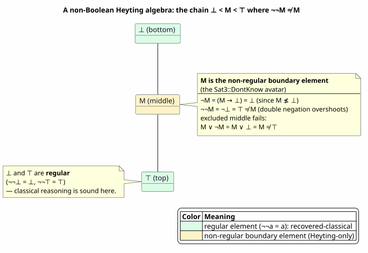
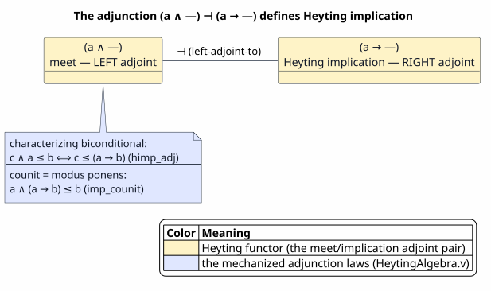
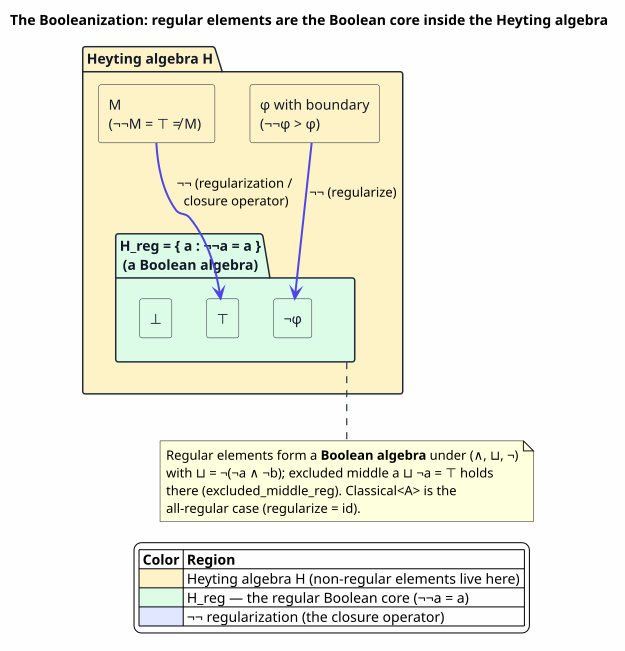
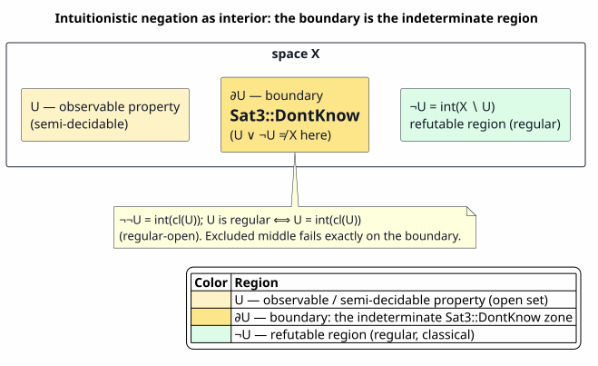
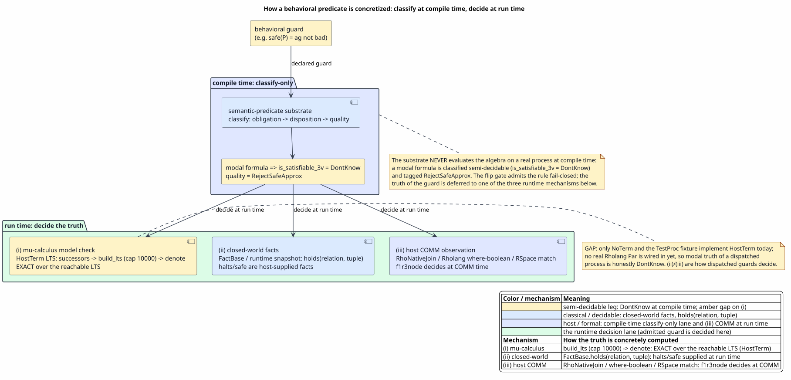
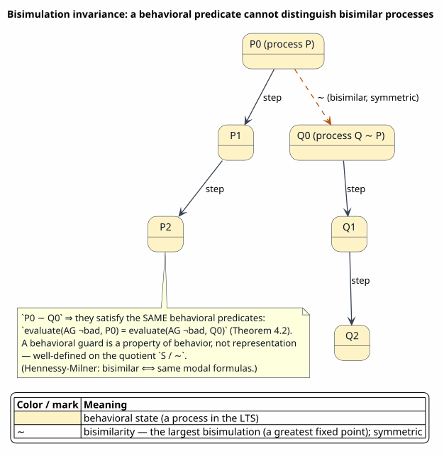
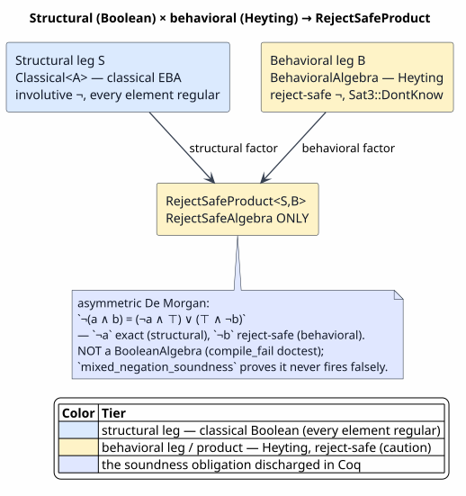
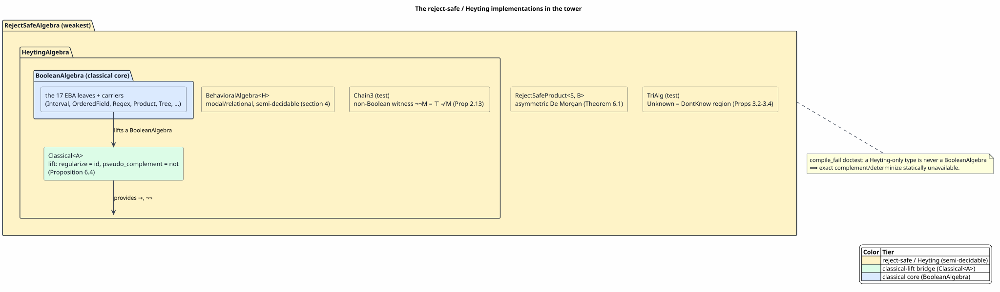

# Heyting Algebras for Behavioral Constraints

Last updated: 2026-06-23

All symbols are defined in [Concepts and Glossary](01-concepts-and-glossary.md).
This is the theoretical treatise behind a claim that
[05 — Algebra Pyramid and Decidability](05-algebra-pyramid-and-decidability.md)
states as engineering: the tower `RejectSafeAlgebra ⊂ HeytingAlgebra ⊂ BooleanAlgebra`.
Document 05 summarizes *that* the behavioral tier is a Heyting algebra; this document
**argues why a Heyting algebra is the mathematically correct — not merely convenient
— home for behavioral guards**, why that is non-obvious, **how the truth of a
behavioral predicate is concretely computed**, how it **completes** Boolean algebra
for full structural-behavioral predicate types, how **bisimulation** makes behavioral
predicates well-defined, and why it **aligns with OSLF**.

This document is **self-contained**: every result it relies on is stated as a
Definition, Lemma, Proposition, or Theorem and proved here in ordinary mathematical
prose, each proof closed with `∎`. The Coq names that mechanize these results are
given only as **citations** (e.g. "mechanized in `HeytingAlgebra.v` as `neg_triple`"),
never as the substance — so a reader who has never opened the Coq sources can still
follow every argument. The consolidated proof-to-Coq cross-reference is §10.

> ⚠ **Citation caveat.** `Sat3` and `Esakia` are **not** Coq objects. `Sat3` is the
> Rust enum in `algebra_tower.rs`; Esakia duality and the Brouwer–Heyting–Kolmogorov
> reading are discussed here as *theory* — the intellectual basis — with literature
> citations, never as a mechanized lemma. Two further results — the 3-element chain
> counter-model (Proposition 2.13) and bisimulation invariance (Theorem 5.4) — are
> **classical mathematics proved here in prose**, not Coq lemmas; their provenance is
> marked at each. Every other result is mechanized; the Coq witness is named in §10.

## 1. The thesis, and why it is non-intuitive

Heyting algebras were born in three places that have nothing to do with concurrency
or resources: **intuitionistic logic** (Heyting's 1930 algebraization of Brouwer's
intuitionism, [Heyting, 1930](references.md#heyting-1930)); **topology** (the lattice
of open sets `O(X)` of any space is a Heyting algebra — the canonical model of
intuitionistic propositional logic, [Johnstone, 1982](references.md#johnstone-1982));
and **topos theory** (the subobject classifier of any topos carries a Heyting
structure, [Mac Lane & Moerdijk, 1992](references.md#maclane-moerdijk-1992)). None of
these is a resource logic. OSLF, by contrast, is an ordered linear-substructural
*funding* discipline ([09](09-oslf-composition.md)). Importing a Heyting algebra to
govern behavioral guards *inside a resource logic* therefore crosses two unrelated
traditions, and a reader is right to demand an argument rather than an analogy.



PlantUML source: [figures/12-heyting-hasse.puml](figures/12-heyting-hasse.puml).

> **Thesis.** The natural logic of *observable / provable behavioral properties*
> over a transition system is **intuitionistic**, and its algebra is therefore a
> **Heyting algebra** — not by stylistic preference but because behavioral predicates
> are *semi-decidable*, and semi-decidability is exactly the structure that
> intuitionistic logic, via the Brouwer–Heyting–Kolmogorov reading, axiomatizes.
> Classical Boolean logic is the *special case* recovered on the decidable
> (structural) fragment — the regular elements. Hence Heyting **completes** Boolean
> for a predicate type that must carry both structural and behavioral guards.

The two classical assumptions that fail are **excluded middle** `a ∨ ¬a = ⊤` and
**involutive complement** `¬¬a = a`. Both encode determinacy — "every proposition is
settled true or false." A semi-decidable predicate is precisely one for which
determinacy is not available *as evidence*. The argument proceeds: §2 the
mathematics (with proofs); §3 the evidence argument (BHK and topology) and the
three-valued model where excluded middle provably fails; §4 **how a behavioral
predicate's truth is concretely computed**, with worked examples; §5 bisimulation as
the well-definedness of behavioral predicates; §6 the completion; §7 the OSLF
affinity; §8 a worked logical example; §9–§10 the mechanized account.

## 2. The mathematics of Heyting algebras

**Definition 2.1 (Bounded lattice).** A *bounded lattice* `(H, ∧, ∨, ⊤, ⊥)` has
commutative, associative, idempotent meet `∧` and join `∨` satisfying the absorption
laws `a ∧ (a ∨ b) = a` and `a ∨ (a ∧ b) = a`, with greatest element `⊤` (so
`a ∧ ⊤ = a`) and least element `⊥` (so `a ∨ ⊥ = a`). The induced partial order is
`a ≤ b :⟺ a ∧ b = a`; then `∧` is the greatest lower bound (`a ∧ b ≤ a`,
`a ∧ b ≤ b`, and `c ≤ a ∧ c ≤ b ⟹ c ≤ a ∧ b`). Mechanized in `HeytingAlgebra.v`
(`le_refl`, `le_antisym`, `le_trans`, `meet_glb_l`, `meet_glb_r`, `meet_greatest`).

**Definition 2.2 (Heyting algebra).** A *Heyting algebra* is a bounded lattice with a
binary **Heyting implication** `→` characterized by the **adjunction**

`c ∧ a ≤ b ⟺ c ≤ (a → b)`   for all `a, b, c`.

Equivalently, the meet functor is left adjoint to implication, `(a ∧ —) ⊣ (a → —)`.
The **pseudo-complement** is `¬a := a → ⊥`. Mechanized in `HeytingAlgebra.v` as the
record field `himp_adj` (with `hneg` for `¬`).



PlantUML source: [figures/12-adjunction.puml](figures/12-adjunction.puml).

The adjunction is the whole content: implication is exactly as strong as it must be.
Its two immediate consequences are modus ponens and a sharpening.

**Lemma 2.3 (counit / modus ponens).** `a ∧ (a → b) ≤ b`.

*Proof.* Instantiate the adjunction (Definition 2.2) at `c := a → b`. The right side
`(a → b) ≤ (a → b)` holds by reflexivity of `≤`. The forward `(⟸)` direction then
gives `(a → b) ∧ a ≤ b`, which is `a ∧ (a → b) ≤ b` by commutativity of `∧`. `∎`
(Mechanized as `imp_counit`.)

**Lemma 2.4 (sharpening).** `a ∧ (a → b) = a ∧ b`.

*Proof.* By antisymmetry. `(≤)` `a ∧ (a → b) ≤ a` (meet lower bound) and
`a ∧ (a → b) ≤ b` (Lemma 2.3), so `a ∧ (a → b) ≤ a ∧ b` since `∧` is the greatest
lower bound. `(≥)` `a ∧ b ≤ a`, and `a ∧ b ≤ (a → b)` because, by the adjunction,
`(a ∧ b) ≤ (a → b) ⟺ (a ∧ b) ∧ a ≤ b`, and `(a ∧ b) ∧ a = a ∧ b ≤ b`; hence
`a ∧ b ≤ a ∧ (a → b)`. `∎` (Mechanized as `imp_meet`.)

**Lemma 2.5 (non-contradiction in the lattice).** `a ∧ ¬a = ⊥`.

*Proof.* Take `b := ⊥` in Lemma 2.4: `a ∧ ¬a = a ∧ (a → ⊥) = a ∧ ⊥ = ⊥`. `∎`
(Mechanized as `meet_neg`. Note: the *classical* law `non_contradiction` lives in
`EffectiveBooleanAlgebra.v`; this is its Heyting analogue.)

### 2.1 The laws that distinguish Heyting from Boolean

The contrast with a Boolean algebra is the following. Each Heyting row is proved in
this section; each Boolean row is the classical law mechanized in
`EffectiveBooleanAlgebra.v` (`excluded_middle`, `double_neg`, `de_morgan_conj`,
`non_contradiction`).

| Law | Boolean algebra | Heyting algebra |
|---|---|---|
| non-contradiction `a ∧ ¬a = ⊥` | holds | holds (Lemma 2.5) |
| **excluded middle** `a ∨ ¬a = ⊤` | holds | **fails in general** (Proposition 2.13); recovered only as `a ⊔ ¬a = ⊤` for the De Morgan join `⊔` (Theorem 2.12) |
| **double negation** `¬¬a = a` | holds | **only `a ≤ ¬¬a`** (Lemma 2.6); the converse fails (Proposition 2.13) |
| triple negation `¬¬¬a = ¬a` | trivial | holds (Lemma 2.8) |
| `¬¬` idempotent `¬¬¬¬a = ¬¬a` | trivial | holds (Corollary 2.9) |
| De Morgan `¬(a ∨ b) = ¬a ∧ ¬b` | holds | holds |
| De Morgan `¬(a ∧ b) = ¬a ∨ ¬b` | holds (both ways) | **one direction only** |

The **asymmetry of the two De Morgan laws is load-bearing**: `¬(a ∨ b) = ¬a ∧ ¬b`
survives intuitionistically, but `¬(a ∧ b) = ¬a ∨ ¬b` does not. That is *exactly why*
the mixed-guard complement of §6 must use a padded, double-`⊤` asymmetric form rather
than a plain `¬a ∨ ¬b`.

### 2.2 Double negation is a closure operator

**Lemma 2.6 (extensive).** `a ≤ ¬¬a`.

*Proof.* `¬¬a = (¬a → ⊥)`. By the adjunction, `a ≤ (¬a → ⊥) ⟺ a ∧ ¬a ≤ ⊥`. By
Lemma 2.5, `a ∧ ¬a = ⊥ ≤ ⊥`. Hence `a ≤ ¬¬a`. `∎` (Mechanized as `dneg_extensive`.)

**Lemma 2.7 (negation is antitone).** `a ≤ b ⟹ ¬b ≤ ¬a`.

*Proof.* `¬b ≤ ¬a = (a → ⊥) ⟺ a ∧ ¬b ≤ ⊥`, by the adjunction. From `a ≤ b` we get
`a ∧ ¬b ≤ b ∧ ¬b = ⊥` (Lemma 2.5 at `b`). Hence `a ∧ ¬b ≤ ⊥`, so `¬b ≤ ¬a`. `∎`
(Mechanized as `neg_antitone`.) Applying it twice gives **monotonicity of `¬¬`**:
`a ≤ b ⟹ ¬¬a ≤ ¬¬b` (`dneg_mono`).

**Lemma 2.8 (triple negation).** `¬¬¬a = ¬a`.

*Proof.* `(≤)` Apply Lemma 2.7 (antitone) to `a ≤ ¬¬a` (Lemma 2.6):
`¬(¬¬a) ≤ ¬a`, i.e. `¬¬¬a ≤ ¬a`. `(≥)` Lemma 2.6 at `¬a`: `¬a ≤ ¬¬(¬a) = ¬¬¬a`.
Antisymmetry gives equality. `∎` (Mechanized as `neg_triple`.)

**Corollary 2.9 (`¬¬` is idempotent).** `¬¬¬¬a = ¬¬a`.

*Proof.* Apply Lemma 2.8 to the element `¬a`: `¬¬¬(¬a) = ¬(¬a)`, i.e.
`¬¬¬¬a = ¬¬a`. `∎` (Mechanized as `dneg_idempotent`.)

Lemmas 2.6, 2.7 (twice), and Corollary 2.9 say `¬¬` is **extensive**, **monotone**,
and **idempotent** — the three defining properties of a **closure operator**. Its
soundness payoff is the next lemma.

**Lemma 2.10 (reject-safe soundness).** `¬¬a = ⊥ ⟹ a = ⊥`.

*Proof.* By Lemma 2.6, `a ≤ ¬¬a`. If `¬¬a = ⊥` then `a ≤ ⊥`; with `⊥ ≤ a`,
antisymmetry gives `a = ⊥`. `∎` (Mechanized as `dneg_eq_bot_implies_bot`.) Read
operationally: a sound complement that comes back unsatisfiable can only have started
from something already unsatisfiable — it never drops a satisfiable predicate.

### 2.3 The regular elements: the Booleanization

The fixed points of the closure operator are the **regular elements**
`H_reg := { a : ¬¬a = a }`. They are exactly where classical reasoning is sound.

**Lemma 2.11 (the regular core).** (1) every `¬a` is regular; (2) `⊥` and `⊤` are
regular; (3) `H_reg` is closed under `∧`; (4) on `H_reg`, `¬` is involutive.

*Proof.*
(1) `¬¬(¬a) = ¬¬¬a = ¬a` by Lemma 2.8, so `¬a ∈ H_reg` (`neg_regular`).
(2) First, `¬⊤ = ⊥` and `¬⊥ = ⊤`. For `¬⊤`: `¬⊤ ∧ ⊤ = ¬⊤` (meet with `⊤`) and
`¬⊤ ∧ ⊤ = ⊤ ∧ ¬⊤ = ⊥` (Lemma 2.5 at `⊤`), so `¬⊤ = ⊥` (`neg_top`). For `¬⊥`:
`⊤ ≤ (⊥ → ⊥) ⟺ ⊤ ∧ ⊥ ≤ ⊥`, i.e. `⊥ ≤ ⊥`, true; with `¬⊥ ≤ ⊤` this gives
`¬⊥ = ⊤` (`neg_bot`). Then `¬¬⊥ = ¬⊤ = ⊥` and `¬¬⊤ = ¬⊥ = ⊤`, so both are regular
(`regular_bot`, `regular_top`).
(3) Let `a, b ∈ H_reg`. From `a ∧ b ≤ a` and monotonicity of `¬¬`,
`¬¬(a ∧ b) ≤ ¬¬a = a`; symmetrically `≤ ¬¬b = b`; the greatest-lower-bound property
gives `¬¬(a ∧ b) ≤ a ∧ b`. With Lemma 2.6 (`a ∧ b ≤ ¬¬(a ∧ b)`), antisymmetry yields
`¬¬(a ∧ b) = a ∧ b` (`regular_meet`).
(4) `a ∈ H_reg` *is* the statement `¬¬a = a` (`neg_involutive_on_regular`). `∎`

**Theorem 2.12 (Booleanization; Glivenko).** Define the **De Morgan join**
`a ⊔ b := ¬(¬a ∧ ¬b)`. Then excluded middle holds for `⊔`:

`a ⊔ ¬a = ⊤`   for every `a`,

and `(H_reg, ∧, ⊔, ¬, ⊥, ⊤)` is a Boolean algebra — the *Booleanization* of `H`.

*Proof.* For the excluded-middle identity, `a ⊔ ¬a = ¬(¬a ∧ ¬¬a)`. Now `¬a ∧ ¬¬a` is
`x ∧ ¬x` for `x := ¬a`, which is `⊥` by Lemma 2.5. Hence `a ⊔ ¬a = ¬⊥ = ⊤` (using
`¬⊥ = ⊤` from Lemma 2.11(2)); this holds for all `a`, mechanized as
`excluded_middle_reg`. For the Boolean-algebra structure: by Lemma 2.11 the regular
elements are closed under `∧` and `¬`, contain `⊥, ⊤`, and `¬` is involutive on them;
`⊔` is their join (the least regular upper bound, by De Morgan). Glivenko's theorem
([Johnstone, 1982](references.md#johnstone-1982)) states precisely that the regular
elements of a Heyting algebra, with `(∧, ⊔, ¬)`, form a Boolean algebra — the
distributive and complement laws follow from involutivity of `¬` on `H_reg` together
with Lemmas 2.5–2.11. `∎`



PlantUML source: [figures/12-booleanization.puml](figures/12-booleanization.puml).

The slogan: *the regular elements are exactly where classical reasoning is sound; the
gap `¬¬a` above `a` is the indeterminate region.* In code, lifting a classical
algebra with `Classical<A>` makes `regularize = id` (`algebra_tower.rs`) — every
element is regular, the all-classical special case.

That excluded middle and double negation genuinely fail in a Heyting algebra is not
folklore to be asserted; here is a witness.

**Proposition 2.13 (a Heyting algebra where `¬¬M ≠ M`).** Let `C₃` be the
three-element chain `⊥ < M < ⊤` with `∧ = min`, `∨ = max`, and implication
`a → b := ⊤` if `a ≤ b`, else `a → b := b`. Then `C₃` is a Heyting algebra in which
`¬M = ⊥`, `¬¬M = ⊤ ≠ M`, and `M ∨ ¬M = M ≠ ⊤`. So both involutive complement and
excluded middle fail.

*Proof.* Every chain is a bounded distributive lattice, so Definition 2.1 holds with
`⊥, ⊤` the endpoints. It remains to verify the adjunction `c ∧ a ≤ b ⟺ c ≤ (a → b)`
for the given `→`, for all `a, b, c ∈ C₃`.
- If `a ≤ b`, then `a → b = ⊤`, so `c ≤ (a → b)` holds for every `c`; and
  `c ∧ a = min(c, a) ≤ a ≤ b`, so the left side also holds for every `c`. Both sides
  are always true — equivalent.
- If `a > b`, then `a → b = b`. We must show `min(c, a) ≤ b ⟺ c ≤ b`. `(⟸)` if
  `c ≤ b` then `min(c, a) ≤ c ≤ b`. `(⟹)` suppose `min(c, a) ≤ b`. Because `a > b` in
  the chain, whenever `c > b` we have `min(c, a) > b` (the two values above `b`,
  namely `c` and `a`, both exceed `b`, so their minimum does too), contradicting the
  hypothesis; hence `c ≤ b`. Concretely the pairs with `a > b` are `(M, ⊥)`,
  `(⊤, ⊥)`, `(⊤, M)`, and in each `min(c, a) ≤ b ⟺ c ≤ b` by direct enumeration of
  the three values of `c`.
So `C₃` is a Heyting algebra. Now `¬M = M → ⊥`; since `M > ⊥`, `M → ⊥ = ⊥`, giving
`¬M = ⊥`. Then `¬¬M = ¬⊥ = ⊥ → ⊥ = ⊤` (since `⊥ ≤ ⊥`), so `¬¬M = ⊤ ≠ M`. And
`M ∨ ¬M = M ∨ ⊥ = M ≠ ⊤`. `∎`

> **Provenance (non-mechanized).** `C₃` is realized as the Rust model `Chain3` in
> `prattail/src/algebra_tower.rs`; it is **not** a Coq object. The abstract Heyting
> laws of §2 (mechanized in `HeytingAlgebra.v`) hold of `C₃` by instantiation, and the
> three-valued model `TriModel` of §3.3 is its mechanized two-valued shadow.

### 2.4 The topological and Kripke models

The intuition for `observable ⇒ open ⇒ intuitionistic` is the **topological model**.
In the lattice of open sets `O(X)` of a space `X`, `∧ = ∩`, `∨ = ∪`, `⊤ = X`,
`⊥ = ∅`, and negation is the **interior of the set-complement**, `¬U = int(X ∖ U)`.
Then `¬¬U = int(cl(U))` is the *regularization* of `U`, and `U` is regular exactly
when it is a **regular-open** set (`U = int(cl(U))`). Excluded middle `U ∪ ¬U = X`
fails precisely when `U` has nonempty boundary — and the boundary `∂U` is the
topological avatar of "indeterminate."



PlantUML source: [figures/12-negation-as-interior.puml](figures/12-negation-as-interior.puml).

Equivalently, the **Kripke model**: intuitionistic truth is a *monotone (persistent)*
valuation over a poset of states of knowledge — once true, true under more
information. This is the exact analog of a closed-world fact base that only *grows*
(`behavioral_algebra.rs` adds facts, never retracts; the reachable transition set only
grows). The duality-theoretic underpinning is **Esakia duality** (Heyting algebras are
dual to Esakia spaces, the Heyting analog of Stone duality for Boolean algebras,
[Esakia, 2019](references.md#esakia-2019)) — stated here as the conceptual frame
only; no `Esakia` lemma is mechanized.

## 3. Why behavioral = semi-decidable = intuitionistic

This is the central argument. Behavioral predicates — reachability, modal/temporal
safety and liveness over a labeled transition system (LTS) — are **semi-decidable**: a
bounded search can *witness* truth but a failed search is *not* a proof of falsehood.
This is concrete in the code:

- `BehavioralAlgebra::is_satisfiable_3v` (defined in §4.1) returns `Sat3::DontKnow`
  for any modal formula, because modal satisfiability is semi-decidable without a full
  μ-calculus satisfiability engine; the model-checking direction (`evaluate` against a
  *given* process) is exact but bounded by `MAX_REACH_STATES`, and the truncation is
  reject-safe (missing edges only shrink modal satisfaction sets).
- relational satisfiability searches the assignment space and returns `DontKnow` on
  budget exhaustion (`DEFAULT_SEARCH_BUDGET`).

So the third truth value is *structural*, not sloppy: it is the honest report of an
incomplete search. Asserting `¬φ` from "no witness found within budget" would convert
*don't-know* into *false* — the unsound complement the tower forbids
([05 §1](05-algebra-pyramid-and-decidability.md)).

### 3.1 The Brouwer–Heyting–Kolmogorov reading

Under the BHK interpretation ([Troelstra & van Dalen, 1988](references.md#troelstra-vandalen-1988)),
a proposition is interpreted by its **proofs / evidence**:

- a proof of `a ∧ b` is a pair of proofs; of `a ∨ b`, a tagged proof of one side; of
  `a → b`, a method transforming proofs of `a` into proofs of `b`;
- a proof of `¬a := a → ⊥` is **a method turning any proof of `a` into a
  contradiction** — *refuting evidence*, strictly stronger than "we failed to find a
  witness for `a`."

For semi-decidable behavioral predicates this reading is *literal*: "we have a
witness" is a proof of `φ`; "we have a refutation" is a proof of `¬φ`; and an
inconclusive bounded search has **neither**, so neither `φ` nor `¬φ` is assertible and
`φ ∨ ¬φ` is not a theorem. **That is the failure of excluded middle, derived from
first principles about evidence** — which is why the Heyting application is correct,
not an ad-hoc contrivance. The natural logic of observable behavioral properties is
intuitionistic, and its Lindenbaum–Tarski algebra is a Heyting algebra.

### 3.2 The correspondence, made precise

| Intuitionistic / topological notion | Behavioral-substrate realization |
|---|---|
| open set / observable property | semi-decidable behavioral predicate (a witness is a finite observation) |
| `¬U = int(X ∖ U)` (negation as interior) | reject-safe `pseudo_complement`: assert the complement only on *refuting* evidence |
| boundary `∂U` (where `U ∪ ¬U ≠ X`) | the `Sat3::DontKnow` region — bounded search inconclusive |
| regular-open `U = int(cl(U))` (`¬¬U = U`) | the decidable / structural fragment — classical reasoning recovered |
| persistent (monotone) Kripke valuation | the closed-world fact base / reachable LTS that only grows |
| `no proof ⇒ no assertion` | reject-safety: never grant on absence of evidence ([05 Def 2.1](05-algebra-pyramid-and-decidability.md)) |

### 3.3 A three-valued model where excluded middle provably fails

The failure of excluded middle is not just a chain phenomenon (Proposition 2.13); it
is mechanized in a small two-valued *model* — a concrete carrier with an explicit
evaluation, so the failure is exhibited rather than asserted.

**Definition 3.1 (the three-valued model).** Let `Tri = { TSat, TUnsat, TUnknown }`
with a two-valued *evaluation* and a three-valued *negation*:

`eval(TSat) = true`,  `eval(TUnsat) = eval(TUnknown) = false`;
`neg(TSat) = TUnsat`,  `neg(TUnsat) = TSat`,  `neg(TUnknown) = TUnknown`.

(`TUnknown` is the `Sat3::DontKnow` avatar: it evaluates `false` — assertion requires
positive evidence — and is a fixed point of negation.) Mechanized in
`BehavioralNegation.v` as `Module TriModel` (`tri_eval`, `tri_neg`).

**Proposition 3.2 (excluded middle fails).** There is a point `p` at which neither
`p` nor `neg p` evaluates true: `eval(p) = false` and `eval(neg p) = false`.

*Proof.* Take `p = TUnknown`. Then `eval(TUnknown) = false`, and
`eval(neg TUnknown) = eval(TUnknown) = false`. `∎` (Mechanized as
`excluded_middle_fails`.)

**Proposition 3.3 (no classical complement).** There is a point at which
`eval(p) ∨ eval(neg p) = false` — the disjunction "`p` or not-`p`" is not valid.

*Proof.* At `p = TUnknown`, `eval(p) ∨ eval(neg p) = false ∨ false = false`. `∎`
(Mechanized as `no_classical_complement`.)

**Proposition 3.4 (negation is reject-safe).** For every `p`,
`eval(neg p) = true ⟹ eval(p) = false`: a positive verdict on the negation forces a
negative verdict on the original.

*Proof.* By cases on `p`. If `p = TSat`: `neg p = TUnsat`, `eval(TUnsat) = false ≠
true`, so the premise is false and the implication holds vacuously. If `p = TUnsat`:
`neg p = TSat`, `eval(TSat) = true`, and the conclusion `eval(TUnsat) = false` holds.
If `p = TUnknown`: `neg p = TUnknown`, `eval(TUnknown) = false ≠ true`, vacuous. All
three constructors are covered. `∎` (Mechanized as `tri_neg_sound`.)

This zero-admission model realizes the abstract failure *and* discharges the abstract
hypotheses of the `MixedNegation` development used in §6, proving them consistent.

> **Where the non-classicality actually lives.** In the *idealized* algebra the
> non-classicality is visible as `¬¬a ≠ a` (the `C₃` model of Proposition 2.13:
> `¬¬M = ⊤ ≠ M`). In the *running* `BehavioralAlgebra`, the syntactic
> `pseudo_complement` smart constructor (Definition 4.7) collapses `¬¬φ` to `φ`, so
> the intuitionistic character is **not** carried by a syntactically non-involutive
> `¬`. It is carried by the **three-valued, snapshot-relative, budget-bounded
> denotation**: `is_satisfiable_3v` (Definition 4.6) returns `DontKnow` exactly on the
> boundary, and the closed-world fact base only grows. The two presentations are the
> same logic seen two ways — the algebraic `¬¬a ≠ a` of `C₃`/`TriModel`, and the
> operational `Sat3::DontKnow` of the live algebra. A reader must not expect to *see*
> `¬¬φ ≠ φ` by printing a behavioral formula; the indeterminacy shows up when the
> predicate is *decided*, not when it is *built*.

## 4. Concretizing behavior: how the truth of a behavioral predicate is computed

§2–§3 argue that behavioral logic *is* intuitionistic. But a guard must ultimately
return a verdict: to decide `safe(P) = ag(¬bad)` you must *materialize the behavior of
`P`* in some concrete object and compute against it. This section defines the
operators precisely (so nothing below is used undefined), then gives the **three
mechanisms** by which behavior is concretized, with worked examples — and states
honestly which is wired to real processes today.

### 4.1 Definitions: the behavioral algebra

All definitions are grounded in `prattail/src/behavioral_algebra.rs`.

**Definition 4.1 (the LTS model).** A **host term type** `S` provides a *labeled
transition system* (LTS) via two operations: `successors : S → list(action × S)` —
the one-step edges, backed by the host's reduction relation — and
`label : S → string` — the state's atomic-proposition label. (In code, the trait
`HostTerm`.) From a root `t`, the **reachable LTS** is built by breadth-first search
over `successors`, assigning each distinct state an index; exploration stops once
`MAX_REACH_STATES = 10000` states are reached. Truncation is **reject-safe**: dropping
states and edges can only *shrink* possibility/`μ` sets, never create a spurious
witness.

**Definition 4.2 (the fact base).** The *relational* fragment is decided closed-world
against a **`FactBase`** — a finite map from relation name to a set of string tuples,
with membership test `holds(name, tuple)` and `active_domain` = the set of all
constants appearing in any tuple (the universe a quantifier ranges over).

**Definition 4.3 (the formula language).** A **behavioral formula** is built from the
constructors below; `⟦φ⟧` denotes its satisfying set of LTS states.

| Constructor | Meaning | Denotation `⟦·⟧ ⊆ states` |
|---|---|---|
| `⊤`, `⊥` | true / false everywhere | all states / `∅` |
| `Atom s` | the current state's `label` equals `s` | `{ i : label(stateᵢ) = s }` |
| `⟨a⟩φ` (`Diamond`) | some `a`-labeled successor satisfies `φ` | `{ i : ∃ (act, j) ∈ succ(i). a matches act ∧ j ∈ ⟦φ⟧ }` |
| `[a]φ` (`BoxAll`) | all `a`-labeled successors satisfy `φ` | `{ i : ∀ (act, j) ∈ succ(i). a matches act ⟹ j ∈ ⟦φ⟧ }` |
| `μX.φ` (`Mu`) | least fixpoint (liveness) | least fixpoint of `T ↦ ⟦φ⟧[X := T]` |
| `νX.φ` (`Nu`) | greatest fixpoint (safety) | greatest fixpoint of `T ↦ ⟦φ⟧[X := T]` |
| `φ ∧ ψ`, `φ ∨ ψ`, `¬φ` | conjunction, disjunction, snapshot-relative negation | `⟦φ⟧ ∩ ⟦ψ⟧`, `⟦φ⟧ ∪ ⟦ψ⟧`, complement |
| `Relation`, `Forall`, `Exists` | closed-world Datalog atom / quantifiers | as in `FactBase` |

An **action pattern** `a` is `Any` (matches every action, written `⟨-⟩`/`[-]`), `Tau`
(the internal step), or `Named n`. The domain element fed to evaluation is a
**`BehavioralWorld<S> = { term : S, env }`** — the host term (for the modal fragment)
plus a variable environment (for the relational fragment).

**Definition 4.4 (the derived CTL operators).** The eight branching-time operators are
*sugar* over the fixpoint constructors (`⟨-⟩⊤` abbreviates "can take a step"):

| Operator | Meaning | Definition |
|---|---|---|
| `ax φ` | all successors satisfy `φ` (vacuous at a deadlock) | `[-]φ` |
| `ex φ` | some successor satisfies `φ` | `⟨-⟩φ` |
| `ef φ` | `φ` is reachable on some run | `μX.(φ ∨ ⟨-⟩X)` |
| `ag φ` | `φ` holds in every state of every run (safety/invariance) | `νX.(φ ∧ [-]X)` |
| `af φ` | `φ` holds eventually on every maximal run | `μX.(φ ∨ ([-]X ∧ ⟨-⟩⊤))` |
| `eg φ` | some maximal run keeps `φ` throughout | `νX.(φ ∧ (⟨-⟩X ∨ [-]⊥))` |
| `au(φ, ψ)` | on every maximal run, `φ` until `ψ` | `μX.(ψ ∨ (φ ∧ [-]X ∧ ⟨-⟩⊤))` |
| `eu(φ, ψ)` | some run has `φ` until `ψ` | `μX.(ψ ∨ (φ ∧ ⟨-⟩X))` |

The `⟨-⟩⊤` / `[-]⊥` guards encode the *maximal-run* (deadlock) convention. Linear-time
fairness (e.g. `GF p`) is deliberately **out of scope** for this branching algebra; it
routes to the separate Büchi engine (`crate::buchi`, `crate::ltl`).

**Definition 4.5 (evaluation / model checking).** `evaluate(φ, world) → bool` is
two-valued, exact-but-bounded model checking. If `φ` is non-modal it is the
closed-world `FactBase` check on `world.env`. Otherwise it builds the reachable LTS
from `world.term` (Definition 4.1) and computes `⟦φ⟧` by structural recursion, where
`μX.φ` iterates from `∅` upward and `νX.φ` from the all-states set downward until the
state set stabilizes — convergence is guaranteed in at most `|states| + 1` rounds
because each operator is monotone over the finite lattice of state subsets. The
verdict is "root index `0 ∈ ⟦φ⟧`." The fixpoint metatheory this relies on — that those
least/greatest fixpoints exist (Knaster–Tarski), that the iteration converges in
`≤ |states| + 1` rounds, that the model check is exact, and that the CTL operators of
Definition 4.4 mean what their names claim — is developed and proved in
[15 — The Modal μ-Calculus](15-mu-calculus.md).

**Definition 4.6 (three-valued satisfiability).** `is_satisfiable_3v(φ) → Sat3`
returns one of `Sat`, `Unsat`, `DontKnow`. For any *modal* `φ` it returns `DontKnow`
(modal satisfiability is semi-decidable — there is no μ-calculus SAT engine). For a
*relational* `φ` it searches assignments over the active domain up to
`DEFAULT_SEARCH_BUDGET = 100000`: the first satisfying assignment yields `Sat`;
exhausting all assignments yields `Unsat` **only if every sub-evaluation was exact**,
otherwise `DontKnow` (a bounded quantifier domain may have truncated, so absence of a
witness is not a proof of unsatisfiability).

**Definition 4.7 (reject-safe negation).** `pseudo_complement` maps `⊤ ↦ ⊥`,
`⊥ ↦ ⊤`, `¬¬φ ↦ φ` (a syntactic collapse), and otherwise `φ ↦ ¬φ`. The algebra
`BehavioralAlgebra<S>` implements `RejectSafeAlgebra` and `HeytingAlgebra` but
deliberately **not** `BooleanAlgebra`, with `implies(a, b) = or(pseudo_complement(a),
b)`. Its decidability tier (mechanized as `BehavioralTierClassificationSound.v`) is
`T1` for `⊤`/`⊥`, `T3` (semi-decidable) for any modal formula, and `T2`
(runtime-decidable) for the purely relational fragment ([05 §6](05-algebra-pyramid-and-decidability.md)).

### 4.2 The three concretization mechanisms

A behavioral predicate's truth is computed by one of three mechanisms, selected by the
guard's *fragment* and the *backend*.



PlantUML source: [figures/12-behavior-concretization.puml](figures/12-behavior-concretization.puml).

**(i) μ-calculus model checking over a `HostTerm` LTS.** Where a concrete reducible
term exists, its behavior *is* its reachable LTS (Definition 4.1), and `evaluate`
(Definition 4.5) decides any modal/temporal formula **exactly** over that (possibly
truncated) LTS. This is the direct realization of "behavioral truth = a property of
the transition system."

**(ii) Closed-world relational facts.** A relational state-proposition — the canonical
example is GuardedRho's `halts(P)` / `safe(P)`, declared `relation halts(Proc)` in the
language's `logic` block and **populated externally by host or user code** — is
concretized as tuple membership in a closed-world snapshot: a `FactBase`
(Definition 4.2), or at run time a thread-local fact snapshot consulted by the
runtime predicate evaluator. Here "behavior" is supplied as a *fact*, not computed by
reduction; `is_satisfiable_3v` over the active domain is exact.

**(iii) Host observation at COMM time.** For the production Rholang backend the
behavioral guard is **not** evaluated by the substrate at all. The compile-time
substrate only *classifies* the guard (`obligation → disposition → quality`
`RejectSafeApprox`, [07](07-language-to-rholang-integration.md)); at run time the
f1r3node host decides it at the communication boundary — a Rholang `where` boolean
over already-reduced data, RSpace structural matching, or a host-routed
`RhoNativeJoin` ([08](08-runtime-comm-enforcement.md)). A failed guard leaves the
datum resting and commits nothing.

> **Honest gap (documented, not hidden).** The model checker of mechanism (i) is fully
> implemented and exact, but in the current repository the only `HostTerm` instances
> are `NoTerm` (a single state, no edges — used by the production *relational* leg) and
> the test fixture `TestProc`. **No real Rholang process (`rhoapi::Par`) is wired into
> the model checker yet.** Consequently, for a dispatched behavioral guard, behavior is
> concretized today as a host-supplied *fact* (mechanism ii) or a host *observation*
> (mechanism iii); modal satisfiability of an as-yet-unreduced process is honestly
> `Sat3::DontKnow`. The `successors()` = host-reduction seam is the intended bridge for
> wiring real processes into mechanism (i).

### 4.3 Worked examples

**Example A — model checking a concrete LTS (mechanism i).** Take the LTS of the
`TestProc` fixture: states `{0, 1, 2}`, edges `0 —step→ 1 —step→ 2`, with
`label(2) = done` (and empty labels elsewhere). So `⟦Atom done⟧ = {2}`.

*Is `done` reachable?* Compute `ef(Atom done) = μX.(done ∨ ⟨-⟩X)` by iterating the
operator `Φ(T) = ⟦done⟧ ∪ { i : i has some successor in T }` from `∅`:

| round | `T` |
|---|---|
| 0 | `∅` |
| 1 | `{2}` (just `⟦done⟧`) |
| 2 | `{1, 2}` (state `1` steps to `2`) |
| 3 | `{0, 1, 2}` (state `0` steps to `1`) |
| 4 | `{0, 1, 2}` — fixed point |

Root `0 ∈ ⟦ef(Atom done)⟧`, so `evaluate(ef(Atom done), 0) = true`: `done` is
reachable.

*Is `¬done` an invariant?* Compute `ag(¬done) = νX.(¬done ∧ [-]X)` by iterating
`Ψ(T) = ⟦¬done⟧ ∩ { i : every successor of i is in T }` from the all-states set, where
`⟦¬done⟧ = {0, 1}`:

| round | `T` |
|---|---|
| 0 | `{0, 1, 2}` |
| 1 | `{0, 1}` (drop `2`: not in `⟦¬done⟧`) |
| 2 | `{0}` (drop `1`: its only successor `2 ∉ T`) |
| 3 | `∅` (drop `0`: its successor `1 ∉ T`) |
| 4 | `∅` — fixed point |

Root `0 ∉ ⟦ag(¬done)⟧`, so `evaluate(ag(¬done), 0) = false`: invariance fails, exactly
because `done` is reachable. These are the real `modal_eventually_done` /
`ctl_temporal_operators` tests.

**Example B — a relational guard, and the modal gap (mechanism ii).** Build a
`FactBase` containing the single fact `halts(p)`. The guard `halts(p)` is the
relational atom `Relation("halts", [p])`. Then `is_satisfiable_3v(halts(p)) = Sat`
(the fact is present) and `evaluate(halts(p), world) = true`. This is how GuardedRho's
`halts` actually gets its truth — a host-supplied fact, not a reduction.

Now contrast a *modal* guard, say `⟨-⟩(Atom done)` ("can step to `done`"), evaluated
against `NoTerm` (the production behavioral leg's term — a single state with no
edges). Model checking gives `⟦Atom done⟧ = ∅` (no state is labeled `done`) and no
successors, so `evaluate = false`; and `is_satisfiable_3v = DontKnow` by
Definition 4.6 (modal satisfiability is not attempted). This is the production
mixed-guard B-leg case (`prattail/tests/mixed_guard_bleg.rs`): the relational part is
exact, the modal part is honestly `DontKnow`.

**Example C — host enforcement at COMM time (mechanism iii).** Consider the dispatched
Rholang program

```text
for (@x <- @"c" where x > 0) { @"OUT"!(x) } | @"c"!(-3)
```

The behavioral part of the guard is the Rholang `where` boolean `x > 0`, decided **by
the f1r3node host at COMM time** over the already-reduced datum. Here `x = -3` fails
`x > 0`, so the receive does not commit: `-3` stays resting on `@"c"` and nothing is
emitted on `@"OUT"`. A later `@"c"!(7)` would satisfy the guard and commit. The
semantic-predicate substrate never ran the behavioral algebra — it only classified the
guard at compile time. This is the operational side of the no-commit-on-false contract
([08](08-runtime-comm-enforcement.md)).

## 5. Bisimulation: behavioral predicates are observational

A behavioral predicate is a property of *behavior*, not *representation*. Two processes
that are observationally indistinguishable must satisfy the same behavioral guards —
otherwise a guard would depend on syntactic accidents the calculus deems irrelevant.
The equivalence that captures "observationally indistinguishable" is **bisimulation**,
and bisimulation-invariance is the **well-definedness condition** for behavioral
predicates.

**Definition 5.1 (bisimulation).** Over an LTS `(S, →)`, a relation `R ⊆ S × S` is a
**bisimulation** when, for all `(p, q) ∈ R`: (zig) every step `p →ᵃ p′` is matched by
a step `q →ᵃ q′` with `(p′, q′) ∈ R`, and (zag) symmetrically every `q →ᵃ q′` is
matched by some `p →ᵃ p′` with `(p′, q′) ∈ R`. States `p` and `q` are **bisimilar**,
written `p ∼ q`, when some bisimulation relates them. Mechanized in
`RegisterEquivalence.v` as `is_bisimulation` and `bisimilar` (the *exists-a-bisimulation*
form, over a register-automaton LTS whose states are configurations).

**Lemma 5.2 (reflexivity).** `p ∼ p` for every `p`.

*Proof.* The diagonal `Δ = { (p, p) : p ∈ S }` is a bisimulation: given `(p, p) ∈ Δ`,
any step `p →ᵃ p′` is matched by the *same* step `p →ᵃ p′` with `(p′, p′) ∈ Δ`, and
symmetrically; so both conditions of Definition 5.1 hold. Since `(p, p) ∈ Δ`, we have
`p ∼ p`. `∎` (Mechanized as `self_bisimilar`.)

**Lemma 5.3 (refinement fixed point).** Let `F` be the refinement operator that sends
a relation `R` to the set of pairs `(p, q) ∈ R` that *also* satisfy the zig and zag
matching conditions with targets in `R`. If `R` is a fixed point, `F(R) = R`, then `R`
is a bisimulation.

*Proof.* `F(R) = R` means every `(p, q) ∈ R` lies in `F(R)`, i.e. satisfies the zig
and zag conditions with targets again in `R`. That is exactly the defining property of
a bisimulation (Definition 5.1). `∎` (Mechanized as `fixed_point_is_bisimulation`; the
partition-refinement search is bounded by `bisim_space_bound`.)

The repository realizes this on both sides. The compile-time implementation is
`prattail/src/bisimulation.rs`, described in its own module documentation as "the
compile-time layer of the Heyting-SFA bisimilarity": it computes the **coarsest
bisimulation refining an initial coloring** by partition refinement over a behavioral
LTS, with `Lts::bisimilar(s, t, initial_colors)` deciding `s ∼ t`.



PlantUML source: [figures/12-bisimulation-invariance.puml](figures/12-bisimulation-invariance.puml).

### 5.1 Hennessy–Milner: modal logic *is* the bisimulation-invariant logic

The link between behavioral *logic* and bisimulation is the **Hennessy–Milner
theorem**: over an image-finite LTS, two states satisfy the same modal formulas if and
only if they are bisimilar ([Hennessy & Milner, 1985](references.md#hennessy-milner-1985)).
Its model-theoretic companion is the **van Benthem characterization**: modal logic is
exactly the bisimulation-invariant fragment of first-order logic
([van Benthem, 1983](references.md#van-benthem-1983)). The direction we need — that
bisimilar processes agree on every behavioral predicate — is the following.

**Theorem 5.4 (behavioral predicates are bisimulation-invariant).** Let `∼` respect
atomic labels (`p ∼ q ⟹ label(p) = label(q)`). For every behavioral formula `φ` built
from the constructors of Definition 4.3 (hence for every derived CTL operator
`ag, ef, au, …` of Definition 4.4), if `p ∼ q` then `evaluate(φ, p) = evaluate(φ, q)`.
Consequently a behavioral guard is well-defined on the bisimulation quotient `S / ∼` —
it is a property of the *process up to behavior*, not of its representation.

*Proof.* Since `evaluate` decides "root `∈ ⟦φ⟧`", it suffices to show that every
`⟦φ⟧` is **`∼`-closed**: if `p ∈ ⟦φ⟧` and `p ∼ q` then `q ∈ ⟦φ⟧`. We prove this by
induction on the structure of `φ`, interpreting any free fixpoint variable `X` by a
`∼`-closed set (the inductive invariant).

- `φ = ⊤` / `⊥`: `⟦⊤⟧ = S` and `⟦⊥⟧ = ∅` are `∼`-closed trivially.
- `φ = Atom s`: `p ∈ ⟦Atom s⟧ ⟺ label(p) = s`. As `p ∼ q ⟹ label(p) = label(q)`, the
  membership transfers; `⟦Atom s⟧` is `∼`-closed.
- `φ = ψ₁ ∧ ψ₂` / `ψ₁ ∨ ψ₂` / `¬ψ`: by the induction hypothesis each `⟦ψᵢ⟧` is
  `∼`-closed; intersection, union, and complement (over `S`) of `∼`-closed sets are
  `∼`-closed, so `⟦φ⟧` is too.
- `φ = ⟨a⟩ψ`: suppose `p ∈ ⟦⟨a⟩ψ⟧` and `p ∼ q`. Then there is a step `p →ᵃ p′` with
  `p′ ∈ ⟦ψ⟧`. By the zig condition (Definition 5.1) there is `q →ᵃ q′` with `p′ ∼ q′`;
  by the induction hypothesis `⟦ψ⟧` is `∼`-closed, so `q′ ∈ ⟦ψ⟧`; hence
  `q ∈ ⟦⟨a⟩ψ⟧`. The converse (`q ∈ ⟦⟨a⟩ψ⟧ ⟹ p ∈ ⟦⟨a⟩ψ⟧`) uses the zag condition
  symmetrically.
- `φ = [a]ψ`: suppose `p ∈ ⟦[a]ψ⟧` and `p ∼ q`. Let `q →ᵃ q′` be any `a`-successor of
  `q`. By the zag condition there is `p →ᵃ p′` with `p′ ∼ q′`; since `p ∈ ⟦[a]ψ⟧`,
  `p′ ∈ ⟦ψ⟧`; by the induction hypothesis `q′ ∈ ⟦ψ⟧`. As `q′` was arbitrary,
  `q ∈ ⟦[a]ψ⟧`. The converse uses zig.
- `φ = μX.ψ` / `νX.ψ`: `⟦φ⟧` is the least (resp. greatest) fixpoint of the monotone
  operator `Φ(T) = ⟦ψ⟧[X := T]`, computed as the limit of the approximants `Φⁿ(∅)`
  (resp. `Φⁿ(S)`). Each approximant is `∼`-closed: `Φ⁰` is `∅` or `S` (`∼`-closed),
  and if `T` is `∼`-closed then so is `Φ(T)` by the boolean/modal cases above (with
  `X` interpreted by the `∼`-closed `T`). Arbitrary unions and intersections of
  `∼`-closed sets are `∼`-closed, so the limit — the fixpoint `⟦φ⟧` — is `∼`-closed.

All constructors are covered, so every `⟦φ⟧` is `∼`-closed, giving
`evaluate(φ, p) = evaluate(φ, q)`. The derived CTL operators are defined from these
constructors (Definition 4.4), so invariance extends to them, and `φ` factors through
`S / ∼`. `∎`

> **Provenance (non-mechanized).** Theorem 5.4 is the bisimilar-implies-same-modal-formulas
> direction of the **Hennessy–Milner theorem** for image-finite transition systems
> ([Hennessy & Milner, 1985](references.md#hennessy-milner-1985)); the converse needs
> image-finiteness. The Coq development `RegisterEquivalence.v` mechanizes the
> bisimulation *primitives* (Lemmas 5.2 and 5.3), which are its computational
> substrate; the invariance theorem itself is the classical result proved above, not a
> separately mechanized Coq lemma. This is "processes are bisimilar iff they satisfy
> the same formulae," the project's stated behavioral-equivalence result
> (`docs/papers/plan.md`).

### 5.2 Why this lands inside the Heyting frame, not beside it

Bisimulation is not a separate concern bolted onto the intuitionistic story — it *is*
the intuitionistic story read on the model side:

- **Bisimulations are the p-morphisms (bounded morphisms) of Kripke/intuitionistic
  semantics.** Intuitionistic validity is preserved by the very maps that preserve
  bisimulation; a behavioral predicate respecting `∼` is the order-theoretic analog of
  an *open* (observable) property in §2.4. Observability, openness, and
  bisimulation-invariance are three names for one condition.
- **`∼` is a greatest fixed point — the same shape as the behavioral semantics.** The
  safety operator `ag φ` is `νX.(φ ∧ [-]X)` (Definition 4.4), a greatest fixed point;
  and bisimilarity is the greatest bisimulation (Lemma 5.3). Both are coinductive:
  "holds unless finitely refuted." This is why a behavioral predicate's indeterminacy
  (§3) and a process's behavioral identity (`∼`) are computed by the same
  partition-refinement / fixpoint machinery, and why `bisimulation.rs` is literally the
  *Heyting-SFA* bisimilarity layer.
- **Bisimulation-invariance carves the behavioral fragment from the structural one.**
  Structural (Boolean) predicates *may* distinguish bisimilar processes — they are
  about syntax and shape, and `¬¬a = a` for them. Behavioral (Heyting) predicates *must
  not* — they live on `S / ∼`, where `¬¬a ≠ a` reflects the semi-decidability of
  observing behavior. So bisimulation-invariance is exactly the boundary between the
  regular (structural, classical) elements and the genuinely-Heyting (behavioral) ones
  of §6.

## 6. How Heyting completes Boolean for structural-behavioral types

Structural predicates (`BehavioralPred::AcMatch`) are decided exactly — classical
Boolean, every element regular. Behavioral predicates (`BehavioralAlgebra`) are
semi-decidable — Heyting, `¬¬a ≠ a` in general (Proposition 2.13), well-defined only up
to bisimulation (§5). A real guard is typically *both* ("matches pattern `P` ∧ sender
`halts`" — [05 §5](05-algebra-pyramid-and-decidability.md)); neither fragment alone is
the whole predicate type.



PlantUML source: [figures/12-mixed-product.puml](figures/12-mixed-product.puml).

The completion is `RejectSafeProduct<S, B>` with `S` a classical structural leg
(typically `Classical<A>`-wrapped) and `B` a reject-safe behavioral leg. It is
`RejectSafeAlgebra` **only** — never `BooleanAlgebra` (a `compile_fail` doctest in
`algebra_tower.rs` enforces it). Its pseudo-complement is the **asymmetric De Morgan**

`¬(a ∧ b) = (¬a ∧ ⊤) ∨ (⊤ ∧ ¬b)`,

with `¬a` exact (structural) and `¬b` reject-safe (behavioral). The *shape* is forced
by §2.1: the intuitionistic `¬(a ∧ b) = ¬a ∨ ¬b` does not hold, so the complement pads
each leg with `⊤` and disjoins. That this padded complement is sound — it never fires
on a satisfiable product — is the following theorem.

**Theorem 6.1 (the mixed complement is reject-safe).** Let a *structural* leg supply
`evalS`, `negS`, `topS` with the **classical** law `evalS(negS p, d) = ¬evalS(p, d)`
and `evalS(topS, d) = true`, and a *behavioral* leg supply `evalB`, `negB`, `topB`
with the **reject-safe** law `evalB(negB p, d) = true ⟹ evalB(p, d) = false` and
`evalB(topB, d) = true`. Define the product and its asymmetric complement

`mprod(ps, pb)(ds, db) = evalS(ps, ds) ∧ evalB(pb, db)`,
`mneg(ps, pb)(ds, db) = (evalS(negS ps, ds) ∧ evalB(topB, db)) ∨ (evalS(topS, ds) ∧ evalB(negB pb, db))`.

Then `mneg(ps, pb)(ds, db) = true ⟹ mprod(ps, pb)(ds, db) = false`. Equivalently, the
guarded action *cannot fire* when its complement holds.

*Proof.* Assume `mneg = true`. Using the top laws `evalB(topB, db) = true` and
`evalS(topS, ds) = true`, the two `⊤`-padded conjunctions simplify and `mneg` reduces
to `evalS(negS ps, ds) ∨ evalB(negB pb, db)`. Split the disjunction:
- **Left:** `evalS(negS ps, ds) = true`. By the classical structural law,
  `evalS(negS ps, ds) = ¬evalS(ps, ds)`, so `evalS(ps, ds) = false`, whence
  `mprod = false ∧ evalB(pb, db) = false`.
- **Right:** `evalB(negB pb, db) = true`. By the reject-safe behavioral law,
  `evalB(pb, db) = false`, whence `mprod = evalS(ps, ds) ∧ false = false`.
In both cases `mprod = false`. `∎` (Mechanized in `BehavioralNegation.v` as
`mixed_negation_soundness`, with corollary `mixed_guard_no_false_fire`; the run-time
mirror — that a guarded COMM commits iff names match and the product guard holds, and
that the complement never commits — is `RhoGuardedCommSoundness.v`'s `comm_fires_iff`,
`mixed_negation_soundness`, and `rho_complement_no_commit`. The behavioral leg's
`weak_dneg` is exactly the reject-safe one-directional double negation that
distinguishes it from the structural leg's classical `double_neg`.)

### 6.1 In what sense Heyting *completes* Boolean

The relationship is **subsumes-and-extends**: every Boolean algebra *is* a Heyting
algebra (with `a → b = ¬a ∨ b`, every element regular), and the regular elements of any
Heyting algebra form a Boolean algebra (Theorem 2.12). So Heyting completes Boolean in
the precise sense that (i) it contains Boolean as the all-regular special case, and
(ii) it adds exactly the structure the non-regular (semi-decidable) elements need, with
Boolean recoverable on the regular sublattice. The code realizes (i) as `Classical<A>`
(`regularize = id`) and (ii) as `BehavioralAlgebra: HeytingAlgebra`. That the base edge
of the tower is sound — that a classical algebra always satisfies the weaker reject-safe
contract — is the following.

**Proposition 6.2 (every classical EBA is reject-safe).** An effective Boolean algebra
whose negation is classical (`eval(neg p, d) = ¬eval(p, d)`) satisfies the reject-safe
laws: in particular `eval(neg p, d) = true ⟹ eval(p, d) = false`, together with the
shared conjunction, disjunction, and satisfiability-soundness laws.

*Proof.* The conjunction/disjunction homomorphism and the `sat`/`wit` soundness laws
are common to both contracts. For reject-safe negation: if `eval(neg p, d) = true`
then `¬eval(p, d) = true`, so `eval(p, d) = false`. `∎` (Mechanized as
`eba_implies_reject_safe` in `EffectiveBooleanAlgebra.v`.)

The formal bridge between the tiers and the regular core is the **tier ↔ regularity
correspondence**.

**Proposition 6.3 (tier ↔ regularity, and the combination homomorphism).** Order the
decidability tiers `T1 < T2 < T3 < T4`, with soundness flag `tsound` true on
`T1, T2, T3` and false on `T4`, and completeness flag `tcomplete` true on `T1, T2` and
false on `T3, T4`. Map `tier_regularity(T1) = tier_regularity(T2) = Reg`,
`tier_regularity(T3) = Boundary`, `tier_regularity(T4) = Closed`. Then:

1. `tier_regularity(t) = Reg ⟺ tsound(t) ∧ tcomplete(t)`;
   `= Boundary ⟺ tsound(t) ∧ ¬tcomplete(t)`; `= Closed ⟺ ¬tsound(t)`.
2. For the combinator `tier_max` (which returns the higher-indexed tier),
   `tsound(tier_max(a, b)) = tsound(a) ∧ tsound(b)` and likewise for `tcomplete`.

*Proof.* (1) Finite case analysis over the four tiers, reading off `tsound`,
`tcomplete`, and `tier_regularity` from their definitions. (2) Both `tsound` and
`tcomplete` are *antitone* in the tier index (true for small tiers, then false), so the
value at the larger of `a, b` equals the conjunction of the values at `a` and `b`;
exhausting the `4 × 4` tier pairs confirms it. `∎` (Mechanized as `tier_regularity_reg`,
`tier_regularity_boundary`, `tier_regularity_closed`, `tier_max_sound_hom`,
`tier_max_complete_hom` in `GuardTierCertificate.v`.)

The reading: `Reg` (T1/T2) is the exact Boolean core; `Boundary` (T3) is the
`Sat3::DontKnow` region — the `¬¬a` gap above `a`; `Closed` (T4) is the
refutable/trusted class. Combining a Boolean leg with a Heyting leg yields the weaker
(Heyting) guarantee: *a product is exactly as classical as its **most** behavioral
component.*

### 6.2 The reject-safe / Heyting implementations catalog



PlantUML source: [figures/12-tower-implementations.puml](figures/12-tower-implementations.puml).

The tower is not abstract: every tier is inhabited by a concrete Rust implementation,
all in `prattail/src/algebra_tower.rs` (the behavioral leg in
`prattail/src/behavioral_algebra.rs`). The catalog below is the at-a-glance map. The
**negation semantics** column names *which* complement each implementation carries —
the single fact that determines its tier — and the **stated-and-proved in** column
points at the result of this document that establishes it (each already proved above;
nothing here is re-proved except the new `Classical<A>` Proposition that follows).

| Implementation | File | Tier | Negation semantics | Stated-and-proved in |
|---|---|---|---|---|
| `Classical<A>` | `algebra_tower.rs` | `HeytingAlgebra` + `RejectSafeAlgebra` | involutive / exact: `pseudo_complement = ¬_A`, `regularize = id` | **Proposition 6.4 below** |
| `BehavioralAlgebra<H>` | `behavioral_algebra.rs` | `HeytingAlgebra` (**not** `BooleanAlgebra`) | three-valued reject-safe: `is_satisfiable_3v` returns `DontKnow` for modal formulas | §4 (Definitions 4.1–4.7; the three concretization mechanisms of §4.2) |
| `RejectSafeProduct<S, B>` | `algebra_tower.rs` | `RejectSafeAlgebra` only | asymmetric De Morgan `¬(a ∧ b) = (¬a ∧ ⊤) ∨ (⊤ ∧ ¬b)` | Theorem 6.1 (the `compile_fail` doctest enforces it is **not** a `BooleanAlgebra`) |
| `Chain3` (test model) | `algebra_tower.rs` | `HeytingAlgebra`, provably not Boolean | relative pseudo-complement on the chain `⊥ < M < ⊤`; `¬¬M = ⊤ ≠ M` | Proposition 2.13 |
| `TriAlg` (test model) | `algebra_tower.rs` | `RejectSafeAlgebra` only | three-valued; `pseudo_complement(Unknown) = Unknown` (the `Sat3::DontKnow` region) | Propositions 3.2–3.4 (its mechanized analogue is `TriModel`) |

The first three are the **production** algebras (the classical leg, the behavioral leg,
and their mixed product); the last two are **minimal test witnesses** that the
middle and lowest tiers are genuinely larger than Boolean. The one result the catalog
adds is the soundness of the base edge — that the classical lift sits faithfully inside
both interfaces at once.

**Proposition 6.4 (`Classical<A>` is a faithful classical lift).** For any Boolean
algebra `A`, the lift `Classical<A>` satisfies the `HeytingAlgebra` and
`RejectSafeAlgebra` laws with every element regular (`regularize` is the identity),
`pseudo_complement = ¬_A` (the genuine involutive complement), `implies(a, b) = ¬a ∨ b`,
and `is_satisfiable_3v` never returns `DontKnow`.

*Proof.* In a Boolean algebra every element is regular — `¬¬a = a` (the classical
double-negation law, §2.1 / `EffectiveBooleanAlgebra.v` `double_neg`) — so
`regularize = id` is sound and the regular sublattice is all of `A`. The relative
pseudo-complement `a → b = ¬a ∨ b` is the Heyting implication on a Boolean algebra (it
satisfies the adjunction because `c ∧ a ≤ b ⟺ c ≤ ¬a ∨ b` classically), and excluded
middle `a ∨ ¬a = ⊤` holds. Reject-safe soundness holds because the classical complement
is reject-safe — a classical EBA satisfies the weaker reject-safe contract
(Proposition 6.2, `eba_implies_reject_safe`). Finally `A`'s satisfiability is decidable,
so `is_satisfiable_3v = Sat3::from_decidable(sat)` yields only `Sat` / `Unsat`, never
`DontKnow`. `∎`

The test model `TriAlg` (`algebra_tower.rs`) is the Rust mirror of the `TriModel` of
§3.3 — a one-point reject-safe algebra whose `Unknown` realizes the `Sat3::DontKnow`
region; it and `Chain3` are the minimal witnesses that the middle / lowest tiers are
strictly larger than Boolean.

## 7. The OSLF affinity

Constructive logic is the natural logic of *resources* and of *provability*, and that
is why the predicate algebra composes with OSLF. Substructural logics (no weakening or
contraction) are the proof theory of resource-sensitive reasoning, whose natural
fragment is intuitionistic; the BHK reading is itself a reading of constructive
provability. Both traditions reject "true because not-false."

The sharpest correspondence — `reject-underfunded ≈ reject-safe`
([09 §3](09-oslf-composition.md)) — now has its *logical* explanation. The reject-safe
pseudo-complement asserts `¬φ` only on refuting evidence (§3.1); OSLF's funding judgment
refuses a rewrite only when supply provably fails to cover demand. Both are
**fail-closed**, for the same constructive reason, and the funding judgment is itself a
decidable, monotone, fail-closed predicate.

**Proposition 7.1 (OSLF funding is fail-closed and decidable).** Define
`is_funded(Δ, Σ, margin) := (Δ + margin ≤ Σ)` over the natural numbers. Then:

1. (sound) `is_funded(Δ, Σ, margin) = true ⟺ Δ + margin ≤ Σ`;
2. (reject-underfunded) `0 < Δ ⟹ is_funded(Δ, 0, 0) = false`;
3. (supply-monotone) `is_funded(Δ, Σ, margin) = true ⟹ is_funded(Δ, Σ + 1, margin) = true`;
4. (decidable) `is_funded(Δ, Σ, margin) = true ∨ is_funded(Δ, Σ, margin) = false`.

*Proof.* (1) `is_funded` is the boolean reflection of `≤` on `ℕ`, which is decidable
and reflects the order. (2) `is_funded(Δ, 0, 0) = (Δ + 0 ≤ 0) = (Δ ≤ 0)`; if `0 < Δ`
then `Δ ≤ 0` is false. (3) From `Δ + margin ≤ Σ` and `Σ ≤ Σ + 1` (monotonicity of `+`
on `ℕ`), `Δ + margin ≤ Σ + 1`. (4) `≤` on `ℕ` is decidable, so its boolean reflection
is total. `∎` (Mechanized as `law_sound`, `law_reject_underfunded`,
`law_supply_monotone`, `law_decidable` in `MettaOslfLawsConformance.v`; the capstone
`metta_resource_logic_is_oslf_sound` conjoins the four.)

This explains *why* the two axes of [09](09-oslf-composition.md) compose into a plain
conjunction `guard-satisfied ∧ funded`: both are constructive and fail-closed for the
same reason, each monotone in its "more evidence" order (more facts never retract a
witness; more supply never revokes funding, Proposition 7.1(3)), each decidable with an
honest bottom (`Sat3::DontKnow`; the funding judgment is total). A resource logic and an
evidence logic are both constructive logics, so their `∧` is well-behaved. The honest
nuance of [09 §5](09-oslf-composition.md) stands: the predicate algebra is not OSLF and
neither contains the other; the alignment is the shared constructive discipline, the
cleanliness is the separation. The unifier is the constructive stance — *assertion
requires construction*; a false grant (firing an unaffordable rewrite, or committing on
an unproven guard) is **unsound**, whereas a false refusal is merely **incomplete**, and
intuitionistic logic is precisely the logic that prefers incompleteness to unsoundness.

## 8. Worked logical example

Take the invariance guard `safe(P) := ag(¬bad(P)) = νX.(¬bad ∧ [-]X)` — the real `ag`
operator of Definition 4.4, with `bad` a state proposition (`Atom`). Evaluation is
greatest-fixpoint model checking over the reachable LTS of `P` (Definition 4.5),
exactly as computed in Example A of §4.3.

- **Why `¬¬safe(P) ≠ safe(P)` operationally.** A bounded check of `safe(P)` explores
  the reachable LTS up to `MAX_REACH_STATES`. Finding no `bad` within the explored
  region returns true *for that snapshot*, but if the LTS is truncated (or `bad` is
  reachable only beyond the cap) the modal `is_satisfiable_3v(safe(P))` is honestly
  `Sat3::DontKnow`. The double pseudo-complement `¬¬safe(P)` ("`safe(P)` is not
  refuted") is *weaker* than `safe(P)` ("invariance is verified"): a bounded check that
  did not refute safety is not a proof of safety. Algebraically this is `a ≤ ¬¬a`
  (Lemma 2.6) with the converse unavailable off the regulars; operationally it is the
  gap between "no counterexample found within budget" (`¬¬safe`, the boundary /
  `DontKnow` region) and "invariance established" (`safe`, a regular / decidable
  witness).
- **Why `safe(P) ∨ ¬safe(P)` is not assertible.** To assert the disjunction
  constructively we must assert a disjunct: exhibit a run reaching `bad` (a witness for
  `¬safe`, i.e. `ef bad`) or *prove* no run ever reaches `bad` (`safe`). A bounded model
  check that neither found a `bad`-reaching run nor exhausted the state space yields
  **neither**, and `Sat3` propagates it as `DontKnow` — the failure of excluded middle
  of Proposition 3.2, made operational. Contrast the *structural* guard `x > 0`, which
  is decidable and does satisfy excluded middle — the recovered-classical, regular case
  (Example C, where the host decides it exactly at COMM time).
- **Bisimulation closes the loop.** If `P ∼ Q` then `safe(P) = safe(Q)` (Theorem 5.4):
  the guard is a property of behavior, so the indeterminacy above is a fact about the
  *behavior* `[P]_∼`, not about how `P` is written.

The payoff: the indeterminacy is not a defect of the checker but the honest logical
content of a semi-decidable, bisimulation-invariant property, and the reject-safe
discipline (Theorem 6.1) is what keeps a `DontKnow` from ever firing a COMM
([08](08-runtime-comm-enforcement.md), [05 Theorem 5.1](05-algebra-pyramid-and-decidability.md)).

## 9. The mechanized account

Every result of §2–§7 that is mechanized is collected here against its Coq witness.
The two non-mechanized results — Proposition 2.13 (the `C₃` counter-model) and
Theorem 5.4 (bisimulation invariance) — are classical mathematics proved in prose
above, with provenance noted at each; the entries below are the Coq *building blocks*
that surround them. All theories are zero-admission; build with
`make -C formal check-capped FORMAL_CAPPED_TARGET=rocq-symbolic-algebra` (and
`=rocq-rho-bridge` for the run-time mirror rows). The `Sat3`/`Esakia` caveat of the
front-matter applies: those names are Rust / theory, not Coq.

| Result (here) | Coq witness | File |
|---|---|---|
| Defs 2.1, 2.2; Lemmas 2.3, 2.4 (adjunction, counit, sharpening) | `le_*`, `meet_glb_*`, `meet_greatest`, `himp_adj`, `imp_counit`, `imp_meet` | `HeytingAlgebra.v` |
| Lemmas 2.5–2.10 (`¬¬` closure operator, reject-safe soundness) | `meet_neg`, `neg_antitone`, `dneg_extensive`, `dneg_mono`, `neg_triple`, `dneg_idempotent`, `dneg_eq_bot_implies_bot` | `HeytingAlgebra.v` |
| Lemma 2.11, Theorem 2.12 (Booleanization) | `neg_regular`, `neg_top`, `neg_bot`, `regular_bot`, `regular_top`, `regular_meet`, `neg_involutive_on_regular`, `bjoin`, `excluded_middle_reg` | `HeytingAlgebra.v` |
| classical laws contrasted in §2.1 | `excluded_middle`, `non_contradiction`, `double_neg`, `de_morgan_conj` | `EffectiveBooleanAlgebra.v` |
| Def 3.1; Propositions 3.2–3.4 (excluded middle fails; reject-safe negation) | `TriModel`: `tri_eval`, `tri_neg`, `excluded_middle_fails`, `no_classical_complement`, `tri_neg_sound` | `BehavioralNegation.v` |
| Defs 4.1–4.7 (behavioral operators, model, evaluation, tier) | `HostTerm`, `FactBase`, `build_lts`, `denote`, `evaluate`, `is_satisfiable_3v`, `pseudo_complement` (Rust); tier soundness | `prattail/src/behavioral_algebra.rs`; `BehavioralTierClassificationSound.v` |
| §4.1/§6 the `behavioral_pred → BehavioralFormula` lowering: `AcMatch` to the structural leg (fail-closed), the relational core faithful, the tier preserved | `lower_acmatch_none`, `lower_relational_some`, `lower_tier_sound`, `lower_non_modal` | `BehavioralLoweringSound.v` |
| Lemmas 5.2, 5.3 (bisimulation reflexive, fixed point) | `is_bisimulation`, `bisimilar`, `self_bisimilar`, `fixed_point_is_bisimulation` | `RegisterEquivalence.v` |
| §5.2 the certified bisimulation partition relates only bisimilar states (the `N06-ISO` category-dedup that supersedes `alternating`) | `certified_partition_relates_only_bisimilar`, `bisimilar_refl` | `BisimulationWiringSound.v` |
| Theorem 6.1 (mixed complement reject-safe) | `mixed_negation_soundness`, `mixed_guard_no_false_fire`, `weak_dneg` | `BehavioralNegation.v` |
| Theorem 6.1, run-time mirror | `comm_fires_iff`, `product_eval_sound`, `mixed_negation_soundness`, `rho_complement_no_commit`, `rho_guard_true_commits` | `RhoGuardedCommSoundness.v` |
| Proposition 6.2 (EBA implies reject-safe) | `RejectSafeLaws`, `eba_implies_reject_safe` | `EffectiveBooleanAlgebra.v` |
| Proposition 6.3 (tier ↔ regularity, homomorphism) | `tier_regularity_reg`, `tier_regularity_boundary`, `tier_regularity_closed`, `tier_max_sound_hom`, `tier_max_complete_hom` | `GuardTierCertificate.v` |
| Proposition 7.1 (OSLF funding laws) | `law_sound`, `law_reject_underfunded`, `law_supply_monotone`, `law_decidable`, `metta_resource_logic_is_oslf_sound` | `MettaOslfLawsConformance.v` |

The Hennessy–Milner correspondence for GSLT/MeTTaIL (Theorem 5.4's "bisimilar iff same
formulas") is the project's stated behavioral-equivalence result
(`docs/papers/plan.md`); `RegisterEquivalence.v`'s mechanized bisimulation and
`bisimulation.rs`'s Heyting-SFA bisimilarity are its computational substrate.

## 10. Cross-references

- The tower this document deepens, and the reject-safe `compile_fail` safety property:
  [05 — Algebra Pyramid and Decidability](05-algebra-pyramid-and-decidability.md).
- The classical EBA that Heyting subsumes:
  [02 — Effective Boolean Algebra](02-effective-boolean-algebra.md).
- How the behavioral guard is enforced at run time (mechanism iii of §4.2):
  [08 — Runtime COMM Enforcement](08-runtime-comm-enforcement.md).
- The two-axis composition this document argues for:
  [09 — OSLF Composition](09-oslf-composition.md).
- The full proof ledger and the `Sat3`/`Esakia` caveat:
  [10 — Formal Verification and Tests](10-formal-verification-and-tests.md).
- Glossary entries for **Regular element**, `Sat3`, `RejectSafeAlgebra`,
  `HeytingAlgebra`, `Classical<A>`, `RejectSafeProduct`:
  [01 — Concepts and Glossary](01-concepts-and-glossary.md).
- Literature: the Heyting / intuitionistic / topology / duality / bisimulation entries
  in [References](references.md), plus
  [Stay & Meredith, 2016](references.md#stay-meredith-2016) for OSLF.
