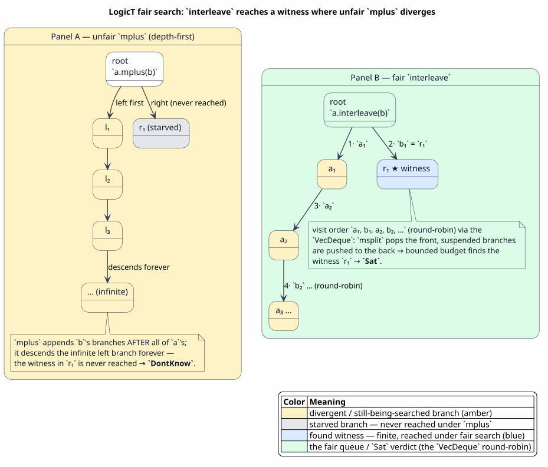
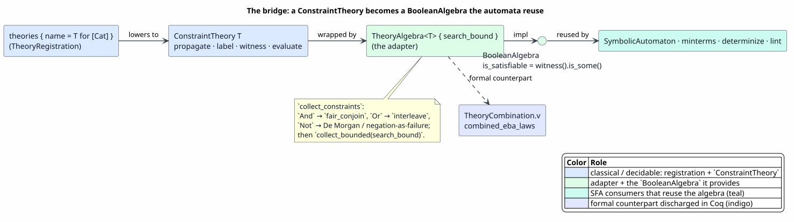
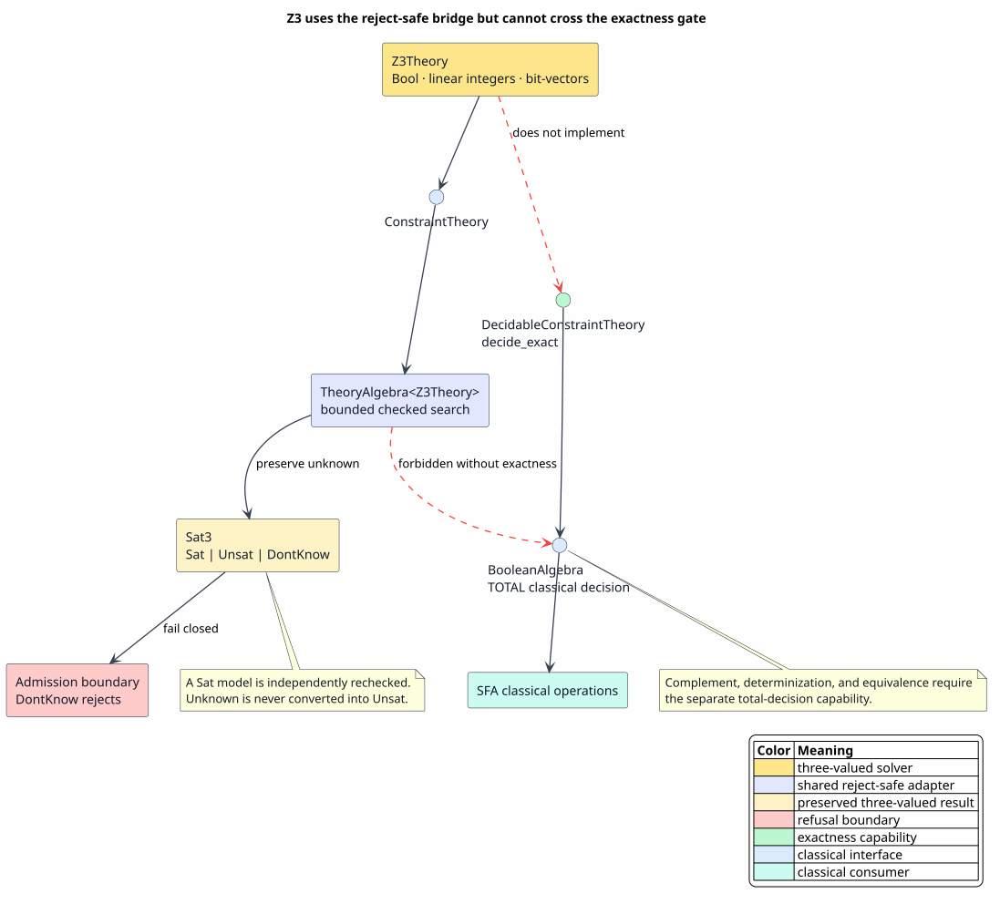
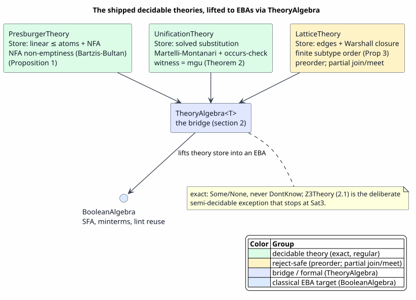
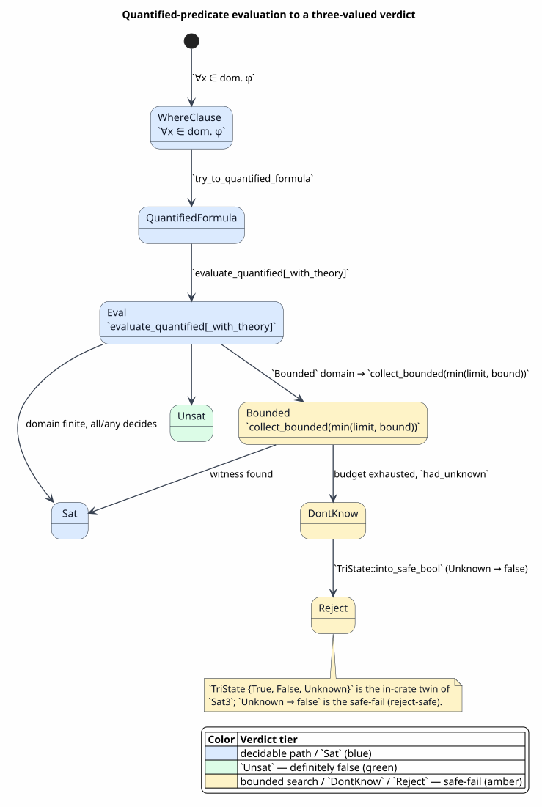
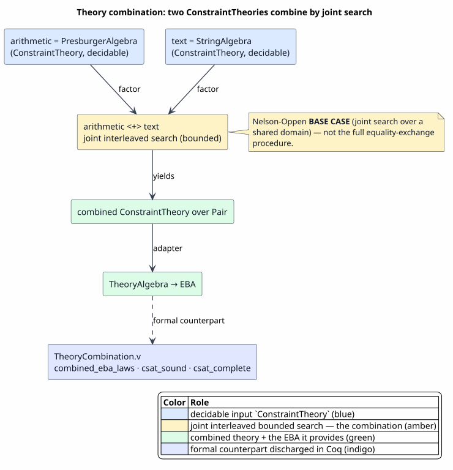

# The Constraint-Theory Engine: LogicT Under the Substrate

Last updated: 2026-06-23

All symbols are defined in [Concepts and Glossary](01-concepts-and-glossary.md).
The algebra documents ([02](02-effective-boolean-algebra.md)–[05](05-algebra-pyramid-and-decidability.md))
treat predicates abstractly; this document is the **engine underneath** them —
**LogicT**, the backtracking logic-monad and constraint-theory framework
(`prattail/src/logict.rs`) that actually *evaluates* quantified predicates,
*combines* theories, and *adapts* a domain solver into an effective Boolean algebra
the automata reuse. It is the integration narrative; the full API and algorithm
reference is `prattail/docs/design/constraint-theories/logict-framework.md`, to
which this page links for depth.

## 1. What LogicT is, and why fair backtracking

LogicT is the Rust realization of the Haskell-lineage **backtracking logic monad**
([Kiselyov, Shan, Friedman & Sabry, 2005](references.md#kiselyov-2005)). A search
for satisfying assignments is a *stream of answers* produced lazily; the engine is
`LogicStream<T>`, a backtracking stream whose one primitive is

`msplit : LogicStream<T> → Option<(T, LogicStream<T>)>`

— "produce the next answer and the rest of the search," from which every other
operation derives. The operations that matter for guard evaluation are the **fair**
ones:

| Operation | Role |
|---|---|
| `mplus` | unfair disjunction (depth-first concatenation) |
| `interleave` | **fair** disjunction — round-robin merge, so a late answer is never starved by an infinite early branch |
| `fair_conjoin` | **fair** bind (`≫-`) — map each answer to a sub-search and interleave the results |
| `once` / `ifte` | hard cut and soft cut (committed choice) |
| `gnot` | negation as finite failure (closed-world) |
| `collect_bounded(limit)` | the bounded-search harness — at most `limit` `msplit` steps |



PlantUML source: [figures/13-logict-backtracking.puml](figures/13-logict-backtracking.puml).

Fairness is the whole point for a guard engine. A behavioral or theory guard induces
a search tree that may have an infinite early branch and a shallow witness in a late
branch. Unfair `mplus` descends the infinite branch forever and never reaches the
witness — it would report `Sat3::DontKnow` where an answer exists. Fair `interleave`
round-robins the branches, so a bounded budget (`collect_bounded`) is spent
breadth-first and the shallow witness is found. **This is precisely why the bounded
search can return `Sat` where naive depth-first would diverge into `DontKnow`** —
and the reason the engine uses an explicit `VecDeque` of branches rather than
continuation-passing.

## 2. The bridge: `ConstraintTheory` → `TheoryAlgebra` → effective Boolean algebra

The substrate's automata are written *once* against the `BooleanAlgebra` trait
([02 §3](02-effective-boolean-algebra.md)). LogicT supplies the adapter that lets a
domain-specific solver plug into that interface without touching the automata.



PlantUML source: [figures/13-theory-algebra-bridge.puml](figures/13-theory-algebra-bridge.puml).

A **`ConstraintTheory`** (the trait in `logict.rs`) is a domain solver: a `Store`, a
`propagate(store, constraint) → Option<Store>` step, an `is_consistent` check, a
`witness(store) → Option<Assignment>`, an `evaluate(constraint, assignment) → bool`,
and a `label(store) → LogicStream<Constraint>` enumerator. A *decidable* theory
returns `LogicStream::empty()` from `label` (propagation alone decides); a theory
that needs search returns a fair stream.

**`TheoryAlgebra<T: ConstraintTheory>`** wraps a theory plus a `search_bound` and
`impl`s `BooleanAlgebra` with `Predicate = TheoryPred<T>` (a `True | False | Atom |
And | Or | Not` tree) and `Domain = T::Assignment`. Its `is_satisfiable` is
`witness(...).is_some()`, where `witness` runs `collect_constraints` — `And` via
`fair_conjoin`, `Or` via `interleave`, `Not` by De Morgan push-down to negation-as-
failure — then `collect_bounded(search_bound)`, then `theory.witness` (falling back
to `label` + `propagate`), validating each candidate with `evaluate`. The payoff
sentence:

> **Once a domain implements `ConstraintTheory`, it is a `BooleanAlgebra` for free —
> hence a `SymbolicAutomaton`, minterms, determinization, and the overlap/subsumption
> analysis of [03](03-symbolic-automata-sfa.md) and [07](07-language-to-rholang-integration.md)
> apply unchanged.** This is how a `theories { name = T for [Cat] }` registration
> ([06 §2.1.3](06-guard-syntax-and-extensions.md)) becomes a usable guard algebra.

This lift holds for every domain whose satisfiability is **decidable**. One
shipped backend is deliberately held *back* from it, because its satisfiability
is only **semi-decidable** — the Z3/SMT oracle of §2.1.

The three shipped theories — `PresburgerTheory`, `UnificationTheory`,
`LatticeTheory` — return an empty `label` (decidable: propagation only, the
`search_bound` is irrelevant), except `UnificationTheory`'s extended custom-match,
whose non-empty `label` engages the fair search bounded by `search_bound` (the
`LT01` lint guards it). `PresburgerAlgebra` additionally has a *direct*
`BooleanAlgebra` path (NFA-backed, [02 §5](02-effective-boolean-algebra.md)) for
speed, distinct from the bridge.

### 2.1 The Z3/SMT backend — a `ConstraintTheory` that deliberately stops there



PlantUML source: [figures/13-smt-sat3-leg.puml](figures/13-smt-sat3-leg.puml).

The payoff above has **one deliberate exception**. `Z3Theory`
(`prattail/src/logict_smt.rs`, feature `smt`, default-off — it dynamically links
the system `libz3`) is a `ConstraintTheory` over `bool`, linear integer
arithmetic, and fixed-width bit-vectors, but it is **never** lifted to a
`TheoryAlgebra<Z3Theory>` and **never** becomes a `BooleanAlgebra`. The reason is
soundness, not convenience.

A general SMT query has three outcomes — `Sat`, `Unsat`, and `unknown` — and
`unknown` is irreducibly semi-decidable. The generic bridge of §2 decides
satisfiability by `witness(...).is_some()`, a **two-valued** test; routing Z3
through it would collapse `unknown → witness None → is_satisfiable false`,
silently reporting a wrong **`Unsat`** (the exact defect in the upstream
lling-llang hoist this backport corrects). So the backend is exposed **only**
through a three-valued surface — `logict_smt::is_satisfiable_3v` and
`checked_witness`, returning `Sat3 = Sat | Unsat | DontKnow`
([05 §3](05-algebra-pyramid-and-decidability.md)) — and a Z3 `unknown` maps to
`DontKnow`, **never** to `Unsat`. `DontKnow` then meets the same reject-safe
collapse the rest of the engine uses (`Unknown → false`, §5). In the bridge
figure above, this is the amber Z3 leg that branches off `ConstraintTheory` to a
`Sat3` exit and stops — it never reaches the `BooleanAlgebra` node.

Two further disciplines keep it sound:

- **Verified deciders stay primary.** Z3 is a **secondary gap-filler**, consulted
  only where a verified decider — the Presburger NFA
  ([02 §5](02-effective-boolean-algebra.md)), the interval, or the ordered-field
  algebra — itself returns `DontKnow` on a mixed numeric/bit-vector guard the
  hand-rolled leaves cannot express. It is **never** routed into the classical SFA
  consumers (complement, determinization, equivalence) that require a *total*
  Boolean algebra.
- **Every witness is certificate-checked.** A reported `Sat` model is
  re-`evaluate`d before it is believed, so the oracle can never fabricate a
  satisfying assignment (`Z3WitnessChecked.v` — `checked_witness_sound`,
  `checked_witness_no_fabrication`, mechanized zero-admission,
  [10 §2.1](10-formal-verification-and-tests.md)).

The first consumer is **refinement-subtyping entailment**:
`RefinementTypeSystem::predicate_entails`
(`prattail/src/type_system/refinement.rs`) decides `premise ⟹ conclusion` over
mixed numeric/bit-vector refinements by asking Z3 whether `premise ∧ ¬conclusion`
is unsatisfiable — `Unsat ⇒ entailment holds`, `Sat ⇒ it does not`, and
`DontKnow ⇒ do not claim entailment` (the reject-safe default; the non-`smt`
build computes the same judgement without Z3). `GuardTierCertificate` classifies a
Z3-decided guard at tier `T3`, degrading to `T4` on an `unknown`
([05 §6](05-algebra-pyramid-and-decidability.md)).

The two disciplines above are each a theorem, not a slogan. To state them, fix the
backend's shape.

**The backend, defined.** `Z3Theory { timeout_ms }` implements `ConstraintTheory` with
`Constraint = SmtConstraint` — a solver-context-free constraint AST over Booleans, linear
integer arithmetic, and fixed-width bit-vectors — and `Store = SmtStore { asserts, status }`
carrying a three-valued `status: Sat3`. `propagate` asserts the new constraint and solves,
returning `None` **only** on a proven `Unsat`; both a `Sat` and an `unknown` answer return
`Some(store)`, recording `Sat3::Sat` or `Sat3::DontKnow`. `witness` produces a model only on
`Sat3::Sat`; `label` is empty, because propagation is the entire oracle. The only sanctioned
entry points are `is_satisfiable_3v(theory, c) -> Sat3` and
`checked_witness(theory, c) -> Option<SmtModel>`.

**Proposition (Z3 must not become a `TheoryAlgebra`).** Routing `Z3Theory` through the §2
bridge — whose satisfiability test is the two-valued `witness(...).is_some()` — would report
a *false* `Unsat` for a possibly-satisfiable guard; the unique sound exposure is the
three-valued surface that keeps a Z3 `unknown` as `Sat3::DontKnow`.

*Proof.* The bridge computes `is_satisfiable(p) = witness(p).is_some()`. A Z3 `unknown`
yields no model, so `witness(p) = None`, so the bridge returns `is_satisfiable(p) = false`
— it declares `p` unsatisfiable although `p` may be satisfiable. The classical SFA consumers
the bridge feeds — complement, determinization, and language equivalence — are sound only
over a *total* Boolean algebra (decidable, with an involutive complement and excluded
middle), so a spurious `Unsat` propagates into a fabricated classical verdict. The
store-level routing is the only one that avoids this: `propagate` returns `None` *only* on a
proven `Unsat`, so an `unknown` stays `Some(store)` with `status = DontKnow`, the
conservative over-approximation "possibly satisfiable." The downstream collapse
`Sat3::into_safe_bool` then maps `DontKnow` to `false` *as a refusal*, forcing the caller to
treat the undecided guard as not-established rather than as proven-unsatisfiable. Hence
`Z3Theory` is exposed only as a `Sat3` oracle and is never given a `BooleanAlgebra` instance
— there is, by construction, no `impl BooleanAlgebra for Z3Theory` and no
`TheoryAlgebra<Z3Theory>` anywhere in the tree. ∎

**Proposition (certificate-checked witnesses are sound and non-fabricating).** Let
`checked_witness(c)` return `Some m` exactly when the solver supplies a candidate model `m`
and the independent pure evaluator re-confirms it — `eval_constraint(c, m) = true` — and
`None` otherwise. Then: (sound) a returned witness implies `c` is satisfiable; (evaluates)
the returned model genuinely satisfies `c`; and (no fabrication) when the solver supplies no
candidate, no witness is invented.

*Proof.* By case analysis on the candidate. If there is no candidate, `checked_witness(c)`
reduces definitionally to `None`, so no model is ever invented — *no fabrication*. If the
candidate is `m`, the result is `Some m` precisely when `eval_constraint(c, m) = true`; in
that case `m` is an explicit satisfying assignment, so `∃ m. eval_constraint(c, m) = true`
— `c` is satisfiable (*sound*) — and the returned model is that very `m` (*evaluates*). The
two rejected cases (`eval_constraint(c, m) = false`, or no candidate) both yield `None`,
never a believed-but-unchecked model. ∎

This is mechanized zero-admission in `Z3WitnessChecked.v` — stated abstractly over the
constraint and model types and a pure `eval` — as `checked_witness_sound`,
`checked_witness_evaluates`, and `checked_witness_no_fabrication`
([10 §2.1](10-formal-verification-and-tests.md)). The Rust `checked_witness` is the exact
image: on `Sat3::Sat` it re-runs `eval_constraint(c, &m)` on the solver's model before
believing it, and returns `None` on `Sat3::Unsat` or `Sat3::DontKnow`.

**Worked example.** Consider a refinement-subtyping obligation over a mixed integer /
bit-vector guard — `{v : Int | v ≥ 0 ∧ lowbit(v) = 0}` must entail `{v : Int | v ≥ 0}`.
`predicate_entails` asks Z3 whether `premise ∧ ¬conclusion`, here
`(v ≥ 0 ∧ lowbit(v) = 0) ∧ ¬(v ≥ 0)`, is unsatisfiable. No `v` is simultaneously `≥ 0` and
`< 0`, so Z3 answers `Unsat`; the entailment holds and the subtype is admitted — and had Z3
instead returned a `Sat` model, `checked_witness` would re-run `eval_constraint` on it before
the engine believed the non-entailment. Now take a guard Z3 cannot settle within `timeout_ms`
(a nonlinear bit-vector mix): Z3 returns `unknown`, which becomes `Sat3::DontKnow`;
`predicate_entails` then declines to claim entailment (the reject-safe default — the
non-`smt` build reaches the same judgement without Z3), and `GuardTierCertificate` tiers the
guard `T3`, degrading to `T4` on the `unknown` ([05 §6](05-algebra-pyramid-and-decidability.md)).
At no point is a `Sat` model trusted without the re-check, and at no point is `unknown`
coerced to `Unsat`.

### 2.2 The shipped decidable theories



PlantUML source: [figures/13-theory-catalog.puml](figures/13-theory-catalog.puml).

Where §2.1 is the one backend held *back* from the bridge, this subsection is its
positive counterpart: the **three shipped, unconditionally compiled
`ConstraintTheory` implementations** that *do* pass through the `TheoryAlgebra<T>`
bridge of §2 and become full `BooleanAlgebra`s — `PresburgerTheory`,
`UnificationTheory`, and `LatticeTheory`. All three live in the compile-time
analysis pipeline (selected by the predicate-dispatch plan), all three are **exact**
— each judgement is a definite `Some`/`None`, never a `DontKnow` — and all three are
*decidable*, so each returns `LogicStream::empty()` from `label`: propagation alone
settles satisfiability and the `search_bound` of the bridge is never consulted. That
each becomes a `BooleanAlgebra` via `TheoryAlgebra<T>` is the bridge of §2, stated and
proved as [05 Theorem 7.6](05-algebra-pyramid-and-decidability.md) (`combined_eba_laws`);
the present subsection does **not** re-prove the bridge — it establishes only that each
theory's own propagation is a *decision procedure* for its domain, which is exactly the
decidability hypothesis the bridge consumes.

#### 2.2.1 `PresburgerTheory` — linear integer arithmetic by a remainder automaton

`PresburgerTheory` (`prattail/src/presburger.rs`) decides quantifier-free linear
integer arithmetic. Its `Constraint` is a **`LinearConstraint`** — a single linear
inequality `Σ aᵢ·xᵢ ≤ b` carried as a coefficient list `[(i, aᵢ)]` with a right-hand
constant `b`. Its `Store` is the **conjunction** of all atoms propagated so far,
together with a cached decision **NFA** over the alphabet `{0,1}ᵏ` (one bit per
variable per position, read least-significant-bit-first). `propagate(store, c)`
appends the atom `c`, raises the store's variable count `k` to cover any new index,
and **rebuilds** the NFA as the intersection of the per-constraint automata
(`intersect_nfa`), returning `None` exactly when that intersection recognizes the
empty language. `witness(store)` is the **shortest accepting path** of the cached NFA,
found by breadth-first search and decoded LSB-first into a tuple of non-negative
integers; `is_consistent` is NFA non-emptiness; and `label` is empty.

**Proposition 1 (the Presburger store decides bounded-window satisfiability).** Fix a
bit width `w` (default `w = 16`). The store's NFA recognizes exactly the integer
tuples in the bounded window `{0, …, 2ʷ − 1}ᵏ` that satisfy the accumulated
conjunction `⋀ⱼ (Σᵢ aᵢⱼ·xᵢ ≤ bⱼ)`. Consequently `is_consistent(store)` holds iff the
NFA is non-empty, and `witness(store)` decodes an accepting path into a satisfying
tuple of that window.

*Proof.* Consider first a single atom `Σᵢ aᵢ·xᵢ ≤ b`. The Bartzis–Bultan **remainder
automaton** has states `(position, remainder)`: it begins at `(0, b)`, and on reading
the position-`j` bit vector `(d₁, …, dₖ) ∈ {0,1}ᵏ` it moves
`remainder ↦ ⌊(remainder − Σᵢ aᵢ·dᵢ) / 2⌋` (floored division, the carry computation),
advancing the position by one. A run of `w` steps consumes the LSB-first binary
encodings of `x₁, …, xₖ ∈ {0, …, 2ʷ − 1}`, and the standard place-value identity for
the running remainder gives `remainder_after_w = b − Σᵢ aᵢ·xᵢ`; the automaton accepts
iff this final remainder is `≥ 0`, which is precisely `Σᵢ aᵢ·xᵢ ≤ b`. So the
single-atom NFA recognizes exactly the window tuples satisfying that atom. For the
conjunction, NFA **intersection** recognizes the intersection of the per-atom
languages, which is the set of tuples satisfying every atom at once — the conjunction.
Non-emptiness is reachability of an accepting state in a finite automaton, decided by
the breadth-first search of `is_nonempty`; when it succeeds, the BFS already records a
shortest accepting path, whose LSB-first digit decode is a concrete window tuple, sound
by the same place-value identity. ∎

The honest caveat is that this decider is sound and complete only over the bounded
**unsigned** window `{0, …, 2ʷ − 1}ᵏ`; it is not the unbounded decision procedure for
`⟨ℤ, +, ≤⟩`. **Full ℤ decidability is the classical backing**: Presburger's original
quantifier-elimination result ([Presburger, 1929](references.md#presburger-1929)) and
the automata-theoretic method that mechanizes it
([Büchi, 1960](references.md#buchi-1960); [Bartzis & Bultan, 2003](references.md#bartzis-bultan-2003)).
The mechanized Boolean fragment of this theory is treated in
[02 §5.1](02-effective-boolean-algebra.md) (`PresburgerBooleanAlgebra.v`).

#### 2.2.2 `UnificationTheory` — first-order unification by Martelli–Montanari

`UnificationTheory` (`prattail/src/unification.rs`) decides first-order syntactic
unifiability. Its `Constraint` is a **`UnificationEquation`** — a term equation
`s ≐ t` over the free first-order term algebra `Var(x) | Const(c) | App{head, args}`.
Its `Store` holds a **solved substitution** `σ` together with a queue of
not-yet-decomposed equations. `propagate(store, eq)` runs the **Martelli–Montanari**
algorithm `unify` over `σ` and all queued equations plus `eq`, returning
`Some(solved store)` on success and `None` on failure. `witness(store)` returns the
solved substitution — the most general unifier (mgu) — once the equation queue is
empty;
`is_consistent` re-runs `unify` to confirm solvability; and `label` is **unconditionally
empty** — propagation alone is the decision procedure, with no labeling search. The
algorithm dispatches on the two oriented sides via six rules:

| Rule | Trigger | Action |
|---|---|---|
| **delete** | `Var(x) ≐ Var(x)`, or `Const(c) ≐ Const(c)` | discard the trivial equation |
| **decompose** | `App{f, args₁} ≐ App{f, args₂}` with `\|args₁\| = \|args₂\|` | equate corresponding arguments pairwise |
| **eliminate** | `Var(x) ≐ t` (or oriented `t ≐ Var(x)`) with `x ∉ t` | bind `x ↦ t` and back-substitute into `σ` |
| **conflict (head)** | `App{f, …} ≐ App{g, …}`, `f ≠ g` | fail (`None`) |
| **conflict (arity)** | same head, `\|args₁\| ≠ \|args₂\|` | fail (`None`) |
| **conflict (const / kind)** | `Const(a) ≐ Const(b)`, `a ≠ b`; or `Const ≐ App` | fail (`None`) |
| **occurs-check** | `Var(x) ≐ t`, `x ∈ t`, `t ≠ Var(x)` | fail (`None`) |

**Theorem 2 (`UnificationTheory` decides unifiability and returns the mgu).** For any
finite set of equations, `propagate` yields `Some` iff the set is unifiable, and on
success `witness` is a most general unifier — unique up to renaming of variables.

*Proof.* Each rule preserves the solution set: **delete** removes an equation every
substitution already satisfies; **decompose** rests on the freeness of the term
algebra (`f(u̅) = f(v̅) ⟺ u̅ = v̅`); **eliminate** replaces `Var(x) ≐ t` by the binding
`x ↦ t`, whose solutions are exactly the solutions of the original equation that also
respect that binding. Hence the solution set is an invariant of `unify`. Termination
follows from the well-founded measure `(number of unsolved variables, total term
size)`, ordered lexicographically: **eliminate** strictly drops the unsolved-variable
count (one variable becomes bound everywhere), and **decompose**/**delete** keep that
count fixed while strictly shrinking total term size; the **conflict** and
**occurs-check** rules halt immediately. The **occurs-check** rejects `x ≐ f(x)` and
its nested forms, so the produced substitution is a finite acyclic map — no infinite
rational trees. A halt via any conflict or the occurs-check witnesses that no unifier
exists (the offending equation has empty solution set), so `None` is returned exactly
when the set is non-unifiable. When `unify` empties the queue, the resulting `σ` is in
solved form `{x₁ ↦ t₁, …, xₙ ↦ tₙ}` with each `xᵢ` absent from every `tⱼ`; this is the
most general unifier, since any unifier factors through it, and the mgu is unique up to
a renaming of variables. ∎

This is exactly Robinson's unification theorem realized by the efficient
rule-based presentation ([Robinson, 1965](references.md#robinson-1965);
[Martelli & Montanari, 1982](references.md#martelli-montanari-1982)). There is **no
custom-match or search branch** in this theory: `label` returns
`LogicStream::empty()` unconditionally, so the fair search of §1 is never engaged on
its behalf.

#### 2.2.3 `LatticeTheory` — the finite subtype order by transitive closure

`LatticeTheory` (`prattail/src/lattice_theory.rs`) decides a finite subtype order. Its
`Constraint` is a **`SubtypeConstraint`** — an order edge `sub ≤ sup` over a finite
universe of `TypeId`s. Its `Store` holds the direct edges, their
**reflexive-transitive closure**, least-upper-bound / greatest-lower-bound caches, and
the list of detected cycles. `propagate(store, c)` inserts the edge `c` and recomputes
the closure by **Warshall's algorithm** in `O(n³)` over `n = |universe|`; it **always
returns `Some`**, because a cycle `a ≤ b ≤ a` is read as a type *equivalence*, never as
a contradiction. Accordingly `is_consistent` is always `true`; `witness` returns the
**identity assignment** mapping each universe index to its own `TypeId`; and `label` is
empty. Order queries are answered by `is_subtype(a, b)` against the closure, and
`join`/`meet` against the LUB/GLB caches.

**Proposition 3 (the lattice store decides the finite subtype order).** Over a finite
universe, the store's closure is exactly the reflexive-transitive closure of the
declared edges; `is_subtype(a, b)` holds iff `(a, b)` is in that closure; and
`join(a, b)` / `meet(a, b)` are the least upper bound / greatest lower bound of `a` and
`b` whenever such bounds exist in the universe.

*Proof.* Warshall's algorithm computes the transitive closure of a finite binary
relation: after seeding the closure with the direct edges and the reflexive pairs
`(t, t)` for every `t` in the universe, the triple loop adds `(i, j)` whenever `(i, k)`
and `(k, j)` are present for some intermediate `k`, and on termination the closure is
closed under reflexivity and transitivity and contains no spurious pair — exactly the
reflexive-transitive closure. Each order query `is_subtype(a, b)` is then a membership
test `(a, b) ∈ closure` (with `a = b` short-circuiting by reflexivity), so it is decided
by a single lookup. For `join(a, b)`, the procedure enumerates the finite set of common
upper bounds `{ c : (a, c) ∈ closure ∧ (b, c) ∈ closure }` and selects a least element —
one below every other common upper bound under the closure; `meet(a, b)` is the order
dual over common lower bounds. Both are finite minimizations/maximizations, returning a
result exactly when the corresponding bound set is non-empty and has an extremum. ∎

Three honest caveats. The structure is a finite **preorder**, not a partial order:
antisymmetry is deliberately not enforced, so a declared cycle collapses into an
equivalence class and `is_consistent` is therefore always `true`. The `join`/`meet`
operations are **partial** — they return `None` when no common upper/lower bound exists
(the universe need carry no top or bottom). And the trait's store-free `evaluate`
certifies only reflexivity (`sub = sup`), returning `false` for any non-reflexive pair
because it has no closure in hand; the genuine order test is `is_subtype` against the
store's closure, not `evaluate`. The construction follows the standard transitive-closure
and subtyping treatments ([Warshall, 1962](references.md#warshall-1962);
[Pierce, 2002](references.md#pierce-tapl-2002), ch. 15).

All three theories reach the SFA/minterm machinery of [03](03-symbolic-automata-sfa.md)
through the `TheoryAlgebra<T>` bridge of §2; `Z3Theory` (§2.1) is the deliberate
semi-decidable exception that never crosses the bridge and stops at `Sat3`.

### 2.3 The feature-gated optional backends

Z3 is not the only backend kept out of the default build. The production build links no
solver and enables no optional dependency: every backend in this subsection is **off by
default**, and each is held to a snapshot or agreement gate so that enabling it leaves the
default analysis output byte-identical. They fall in two groups — the one external-dependency
*solver* (Z3, §2.1), and the **OSLF staged analysis engines** wired behind Cargo features for
the rollout. Each is marked as either a *genuine decision procedure* (it decides a real
property of the grammar) or mere *routing* (it re-dispatches an engine that is already
compiled, adding no new algebra).

| Backend | Feature (default off) | External dep | Decides / provides | Live vs `.0`-inert | Soundness gate | Documented in |
|---|---|---|---|---|---|---|
| `Z3Theory` (SMT solver) | `smt` | `libz3` | SMT over Bool / LIA / bit-vectors, as a `Sat3` oracle | live gap-filler | re-checked witness + `Z3WitnessChecked.v` | §2.1 above |
| `AnyAlgebra` carrier route *(routing)* | `any-algebra-carrier` | `mettail-ast` | re-routes guard analysis through the uniform recursive carrier | `.0`-inert | byte-identity snapshot | [02 §6](02-effective-boolean-algebra.md) |
| structural tree automaton | `sym-tree-structural` | `mettail-ast` (implied) | `SymbolicTreeAutomaton` structural disjointness / subtyping | live analysis | falls back to `Overlapping`; pre-image snapshot | [03](03-symbolic-automata-sfa.md), [04](04-symbolic-transducers-sft-stft.md) |
| symbolic tree transducer | `oslf-transducer` | `mettail-ast` (implied) | cast totality and pre-image via `SymbolicTreeTransducer` | live analysis | agreement vs the category automaton | [04](04-symbolic-transducers-sft-stft.md) |
| bisimulation LTS | `oslf-bisimulation` | `mettail-ast` (implied) | coarsest bisimulation by partition refinement | `.0`-inert | self-certifying `is_bisimulation`; snapshot | [12 §5](12-heyting-behavioral-logic.md) |
| letprop-to-PATA emptiness | `oslf-letprop` | `mettail-ast` (implied) | recursive-predicate emptiness via a Zielonka parity tree automaton — the modal-μ-calculus decider | live on synthetic predicates | Rocq-aligned `PataEmptiness.v`; snapshot | [15](15-mu-calculus.md) |
| Hindley–Milner sort pass | `oslf-hindley-milner` | `mettail-ast` (implied) | base-sort consistency by unification | live analysis | parity snapshot | §2.2.2 (unification) above, [03](03-symbolic-automata-sfa.md) |
| behavioral lowering *(routing)* | `oslf-behavioral-lowering` | `mettail-ast` (implied) | lowers the runtime carrier to a `BehavioralFormula` | `.0`-inert | proven-canonical mapping; eval-agreement | [12 §4](12-heyting-behavioral-logic.md), [14](14-quantification.md) |
| `OrderedFieldAlgebra<i128>` | *(no feature; completeness)* | — | a bounded discrete EBA over `i128` | test-only | inherits the §5.5 exactness theorem | [02 §5.5](02-effective-boolean-algebra.md) |

Two cautions complete the picture. First, the conformance capability labels — `buchi`,
`alternating`, `vpa`, `parity-tree-automata`, `register-automata`, `probabilistic`,
`multi-tape`, `multiset-automata`, `two-way-transducer` — are **not** algebra gates: their
automaton engines compile unconditionally, and the flags only assert test-suite capability.
Second, `any-algebra-carrier` and `oslf-behavioral-lowering` introduce no new algebra — they
re-route or lower an algebra that already exists (`AnyAlgebra`, `BehavioralFormula`), which is
why they are `.0`-inert and snapshot-gated. The genuine optional decision machinery is the Z3
solver (§2.1), the symbolic tree automaton / transducer / PATA-emptiness / bisimulation /
Hindley–Milner engines, and the `i128` completeness algebra; everything else optional is
debug, bench, or capability-label scaffolding.

## 3. Quantified-predicate evaluation

A `∀x ∈ dom. φ` or `∃x ∈ dom. φ` guard ([06 §2.3.1](06-guard-syntax-and-extensions.md))
is where the engine most visibly meets the predicate substrate. The full treatment of
how `∀`/`∃` are modeled — the three realizations, the `∀≡¬∃¬` duality, the domain model,
and decidability — is [14 — Quantification](14-quantification.md); this section is the
LogicT engine's evaluation path.



PlantUML source: [figures/13-quantified-eval.puml](figures/13-quantified-eval.puml).

The path, with exact symbols:

> **Algorithm `EvaluateQuantifiedGuard`.**
> ```
> where-clause source:  ∀ y ∈ nodes. entails(reachable(x,y), safe(y))
>   │  predicate_pratt.rs  (the where-clause sublanguage)
>   ▼
> BehavioralPred::Quantified { quantifier: ForAll, var: "y", domain, body }
>   │  BehavioralPred::try_to_quantified_formula()   [ast/src/language/model.rs]
>   ▼
> logict::QuantifiedFormula::forall("y", QuantifiedDomain, body)
>   │  at evaluation time
>   ▼
> evaluate_quantified(formula, env, relation_query, domain_enumerate, bound) -> bool
>   │  (theory-guided when a ConstraintTheory is registered)
>   ▼
> evaluate_quantified_with_theory(formula, theory, …) -> TriState { True, False, Unknown }
>   │  TriState::into_safe_bool()    (Unknown → false — the safe-fail collapse)
>   ▼
> Sat3 verdict (Sat | Unsat | DontKnow)  →  decidability tier  →  quality
> ```

`TriState { True, False, Unknown }` is the in-crate twin of `Sat3`
([05 §3](05-algebra-pyramid-and-decidability.md)): Kleene `∧`/`∨`/`¬`, with
`into_safe_bool` collapsing `Unknown → false`. `evaluate_quantified_with_theory`
*produces* `Unknown`: a `ForAll` returns `Unknown` when no `False` counterexample was
found but at least one sub-evaluation was `Unknown` (the `had_unknown` accumulator);
an empty domain is `True` for `∀` and `False` for `∃`. The `Unknown → false` collapse
is the sound choice — it rejects rather than wrongly admitting, the run-time mirror
of the reject-safe posture of [05 §2.1](05-algebra-pyramid-and-decidability.md) and
the Heyting / Kleene three-valued logic of [12](12-heyting-behavioral-logic.md).

> **Accuracy: where the monad is literal and where it is semantic.** Here
> `domain_enumerate` is the Rust callback that materializes a quantifier domain into a
> finite list of candidate tuples, and `multiset_partitions` is the Rust function that
> lazily streams the ways to split a bag across a set of classes (used by the
> collection algebra). The two-valued `evaluate_quantified` recurses over the
> materialized tuples from `domain_enumerate` with `all`/`any` and a `Bounded` domain's
> `min(limit, default_bound)` truncation — it does not construct a `LogicStream` per
> quantifier. The logic monad backs `TheoryAlgebra::witness` and `multiset_partitions`
> *literally* (fair search), and backs the quantifier evaluator *semantically*: the
> closed-world `∀x. φ ≡ ¬∃x. ¬φ` identity is the `gnot` equivalence, and the bounded
> enumeration mirrors `collect_bounded`. The fairness of §1 matters at the `witness`
> layer beneath a theory-guided quantifier, not in the plain enumeration.

## 4. Theory combination — the Nelson–Oppen base case

Two decidable theories over a shared enumerable domain combine into one EBA by
**joint search**: the LogicT realization interleaves their constraint streams and
labels under the bounded budget.



PlantUML source: [figures/13-theory-combination.puml](figures/13-theory-combination.puml).

**Result (stated; proved elsewhere).** *Two decidable constraint theories over a
shared **enumerable** domain combine into one effective Boolean algebra by exhaustive
joint search; `csat` is exact precisely because the domain enumeration is exhaustive.*
This is the **joint-search base case** of [Nelson & Oppen, 1979](references.md#nelson-oppen-1979)
— *not* the full infinite-domain equality-exchange procedure (which exchanges only
equalities over a shared signature under the stably-infinite, disjoint-signature, and
convexity hypotheses) — and the documentation says so rather than implying it. The
result, with its `eval`-homomorphism and `csat`/`cwit` soundness-and-completeness laws,
is stated and proved as
[05 — Algebra Pyramid and Decidability, Theorem 7.6](05-algebra-pyramid-and-decidability.md)
(mechanized as `combined_eba_laws`, with `csat_sound`, `csat_complete`, `cwit_sound`,
`cwit_total`, in `TheoryCombination.v`); this page does not re-prove it. The proposed
`arithmetic <+> text` syntax ([06 §3.8](06-guard-syntax-and-extensions.md)) is the
surface for it.

## 5. Enforcement of predicated types

The engine is where a quantified or theory guard earns its **tier** and **quality**,
which the fail-closed gate ([07 §5](07-language-to-rholang-integration.md)) acts on:

| How the LogicT evaluation terminates | Tier | Quality |
|---|---|---|
| finite-relation quantifier / decidable theory (propagation decides; `label = empty`) | T1 / T2 | `ExactDecidable` |
| bounded quantifier or `search_bound`-limited labeling that returned a definite verdict | T3 | `BoundedDecidable` |
| `evaluate_quantified_with_theory → Unknown` (budget exhausted, `had_unknown`), or `collect_bounded` truncated without a witness (`LT01`) | maps to `Sat3::DontKnow` | fail-closed unless asserted (`#[tier(t4)]` / `@[quality(trusted)]`) |
| Z3/SMT gap-filler (feature `smt`, §2.1) decides via `is_satisfiable_3v` + a certificate-checked witness; `Sat`/`Unsat` are definite, an `unknown` is `DontKnow` | T3 (T4 on `unknown`) | `BoundedDecidable` (reject-safe on `DontKnow`) |

Two places turn the engine's "don't know" into a *rejection*, never a false
admission: `into_safe_bool` (`Unknown → false`) and the bridge's
`is_satisfiable = witness().is_some()`. Both are the operational realization of the
reject-safe discipline ([05 §5](05-algebra-pyramid-and-decidability.md)). The
governing soundness result — *the asymmetric mixed De Morgan complement
`(¬a ∧ ⊤) ∨ (⊤ ∧ ¬b)` of a structural-times-behavioral guard accepts an element only
if the true product `a ∧ b` rejects it, so a guarded action can never fire when its
complement holds* — is stated and proved as
[12 — Heyting Behavioral Logic, Theorem 6.1](12-heyting-behavioral-logic.md)
(mechanized as `mixed_negation_soundness` in `BehavioralNegation.v`, with the run-time
mirror `rho_complement_no_commit` in `RhoGuardedCommSoundness.v`); this page does not
re-prove it. The two rejection sites connect directly to `classify_quality` — the
Rust classifier (defined in [07 §4.3](07-language-to-rholang-integration.md)) that maps
a guard's obligation and disposition to a quality grade — whose
`behavioral → reject-safe` rule the flip gate then acts on alongside its block on
`Unknown`. The decidability-tier lattice
([05 §6](05-algebra-pyramid-and-decidability.md), the tier ↔ regularity correspondence
of [12 — Heyting Behavioral Logic, Proposition 6.3](12-heyting-behavioral-logic.md),
mechanized as `GuardTierCertificate.v`) is the formal frame;
`collect_bounded(search_bound)` plus the `LT01` lint is the resource meter that decides
which tier a given guard lands in.

## 6. Accuracy corrections

Two divergences between the idealized description and the live code, recorded for a
reader tracing the integration:

1. **A codegen-to-API drift in the quantifier shorthand.** The macro codegen
   (`ast/src/language/model.rs`, `macros/src/gen/runtime/wpda_codegen/refinement.rs`)
   emits constructor shorthands `nforall` / `nexists` / `natom` / `nand` / `nor` /
   `nnot` / `nimplies` / `nn` / `nmultiset_partitions`. **None of these resolve in
   `prattail/src/`** — the real public API is `QuantifiedFormula::{forall, exists,
   atom, and, or, not, implies}`, `evaluate_quantified`, and `multiset_partitions`.
   This document uses the real API; the shorthand layer is a codegen reference that
   does not correspond to a present `prattail` symbol.
2. **Three different `QuantifiedDomain` shapes.** The AST `BehavioralPred::Quantified`
   carries `domain: Option<Ident>` plus a separate `bound: Option<usize>`; the runtime
   `BehavioralPred` carries `domain: Option<QuantifiedDomain>` with variants
   `Named | Bounded(usize) | Enumerated`; the `logict::QuantifiedDomain` is
   `Relation(String) | Bounded { relation, limit }`. A reader should not assume one
   type; the lowering bridges them.

## 7. The mechanized and reference account

Each named result below is **stated and proved in its proof-home document**; this
table is the citation index, not a second proof site. The Coq names appear only as the
mechanizing witnesses of the cited theorems.

| Claim | Stated-and-proved in | Coq witness |
|---|---|---|
| theory combination is an EBA (Nelson–Oppen joint-search base case) | [05 — Theorem 7.6](05-algebra-pyramid-and-decidability.md) | `combined_eba_laws`, `csat_sound`, `csat_complete`, `cwit_sound`, `cwit_total` (`TheoryCombination.v`) |
| the mixed-guard complement is reject-safe (a covered theory guard never false-fires) | [12 — Theorem 6.1](12-heyting-behavioral-logic.md) | `mixed_negation_soundness` (`BehavioralNegation.v`); run-time mirror `rho_complement_no_commit` (`RhoGuardedCommSoundness.v`) |
| the tier ↔ regularity / decidability frame the engine populates | [12 — Proposition 6.3](12-heyting-behavioral-logic.md) ([05 §6](05-algebra-pyramid-and-decidability.md) summary) | `tier_max_sound_hom`, `tier_regularity_reg`, `tier_regularity_boundary`, `tier_regularity_closed` (`GuardTierCertificate.v`) |
| the Z3/SMT witness is certificate-checked, never fabricated — the soundness fence on the `Sat3`-only backend (§2.1) | [10 §2.1](10-formal-verification-and-tests.md) | `checked_witness_sound`, `checked_witness_no_fabrication` (`Z3WitnessChecked.v`) |
| the consolidated proof ledger for all three rows above | [10 §2.1](10-formal-verification-and-tests.md) | — |
| the bounded-search lint | `prattail/docs/diagnostics/logict/LT01.md` | `logict-search-bound-exceeded` |
| full API + algorithms (`msplit`, `interleave`, `fair_conjoin`, `witness`, `evaluate_quantified`) | `prattail/docs/design/constraint-theories/logict-framework.md` | — |

The engine is cited from [Kiselyov et al., 2005](references.md#kiselyov-2005)
(the LogicT monad and its fair operators) and [Hemann & Friedman, 2013](references.md#hemann-friedman-2013)
(the relational-programming lineage), with the combination grounded in
[Nelson & Oppen, 1979](references.md#nelson-oppen-1979).

## 8. Cross-references

- The abstract algebra the engine realizes: [02 — Effective Boolean Algebra](02-effective-boolean-algebra.md)
  (the `TheoryAlgebra` instance and the `BooleanAlgebra` trait it implements).
- The tiers, `Sat3`, reject-safety, and the closure family it feeds:
  [05 — Algebra Pyramid and Decidability](05-algebra-pyramid-and-decidability.md).
- The guard syntax that builds the formulas: [06 — Guard Syntax and Extensions](06-guard-syntax-and-extensions.md)
  (quantifiers §2.3.1 / §3.1, theory combination §3.8).
- The classification and fail-closed gate the engine feeds:
  [07 — Language-to-Rholang Integration](07-language-to-rholang-integration.md).
- The three-valued / Kleene logic the `TriState` realizes:
  [12 — Heyting Behavioral Logic](12-heyting-behavioral-logic.md).
- The deep engine reference and the proof matrix:
  `prattail/docs/design/constraint-theories/logict-framework.md` and
  [10 — Formal Verification and Tests](10-formal-verification-and-tests.md).
