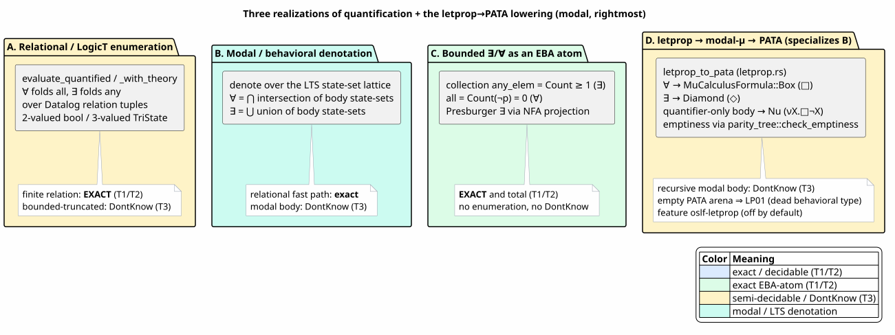
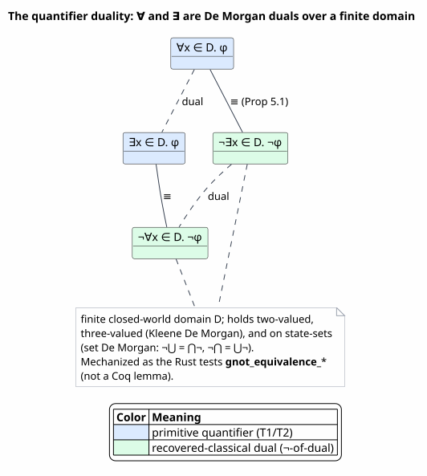
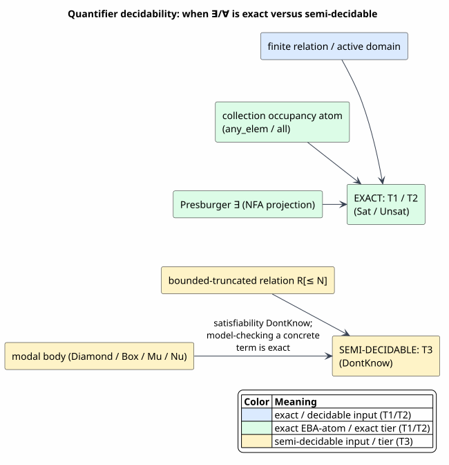
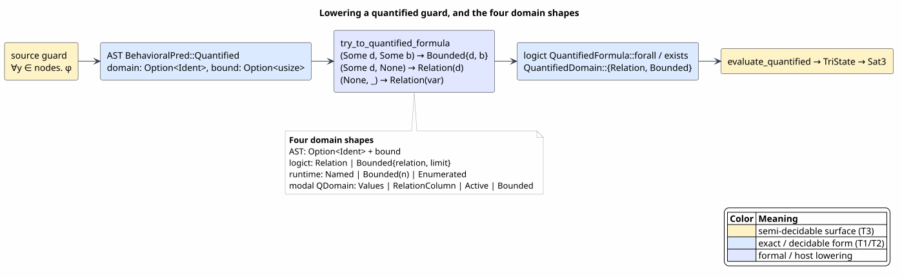

# Quantification: Existential and Universal Predicates over Relational, Modal, and Bounded Domains

Last updated: 2026-06-22

All symbols are defined in [Concepts and Glossary](01-concepts-and-glossary.md).
This document is the **proof-home for quantification** in the semantic-predicate
substrate: how existential (`∃`) and universal (`∀`) guards are *modeled*, *evaluated*,
and *decided*. Quantification touches several other documents — the surface syntax is
[06](06-guard-syntax-and-extensions.md), the LogicT engine is
[13](13-constraint-theory-engine.md), the behavioral algebra is
[12](12-heyting-behavioral-logic.md), the collection algebra is
[05](05-algebra-pyramid-and-decidability.md) — and this document unifies them: it
states the data model, defines each evaluation semantics before using it, proves the
`∀ ≡ ¬∃¬` duality, and settles when a quantifier is **exactly decidable** versus
**semi-decidable**.

> ⚠ **Caveat.** `Sat3` is the Rust enum in `algebra_tower.rs`, not a Coq object. The
> duality `∀x.φ ≡ ¬∃x.¬φ` is a classical theorem, proved here in prose; its mechanized
> witness in this repository is a pair of **Rust tests** (`gnot_equivalence_*`), not a
> Coq lemma — it is cited as such. Mechanized *Coq* results (the collection/tree EBA
> laws, the tier soundness) are named only as parenthetical citations; the proofs live
> in their proof-home documents. Math is written in backticks throughout.

## 1. Three realizations, at a glance

A quantifier `∀x ∈ D. φ` / `∃x ∈ D. φ` binds a variable `x`, ranges it over a **domain**
`D`, and aggregates the truth of the **body** `φ` across `D`. The substrate models this
**three** ways, chosen by what the body is and where the guard lives:

| Realization | Where | Domain | Aggregation | Decidability |
|---|---|---|---|---|
| **A. Relational / LogicT enumeration** | `prattail/src/logict.rs`, run-time `runtime/src/behavioral_pred.rs` | tuples of a Datalog relation (the closed-world active domain), optionally bounded | `∀` folds with `all`, `∃` with `any`; three-valued via `TriState` | exact on a finite relation (`T1`/`T2`); **semi-decidable** (`DontKnow`) on a bounded-truncated domain (`T3`) |
| **B. Modal / behavioral denotation** | `prattail/src/behavioral_algebra.rs` | a relational domain inside a behavioral formula over an LTS | `⟦∀x∈D.φ⟧ = ⋂_{v∈D} ⟦φ[x:=v]⟧`, `⟦∃x∈D.φ⟧ = ⋃_{v∈D} ⟦φ[x:=v]⟧` over the state-set lattice | relational fragment exact; a modal body makes satisfiability `DontKnow` (`T3`) |
| **C. Bounded ∃/∀ as an EBA atom** | `prattail/src/collection_algebra.rs`, `prattail/src/presburger.rs` | the elements of one finite collection value, or the integers of a Presburger NFA | an occupancy/count atom (collection); NFA existential projection (Presburger) | **exact and total** — a decidable effective Boolean algebra (`T1`/`T2`) |

The unifying intuition: **`∃`/`∀` is decidable exactly when its domain is finitely
materialized**. Closed-world relational quantifiers are finite because the active
domain (§2) is finite; collection quantifiers are finite because a collection value has
finitely many elements; Presburger quantifiers are finite-state because integer
relations are recognized by automata. A quantifier becomes *semi-decidable* only when a
domain is deliberately **bounded-truncated** to keep search tractable — then the honest
answer on exhaustion is `Sat3::DontKnow`, never a guessed `false`.



PlantUML source: [figures/14-three-realizations.puml](figures/14-three-realizations.puml).

## 2. The domain model

A quantifier is only as decidable as its domain is finite. The substrate's domains all
reduce to a finite materialization.

**Definition 2.1 (active domain).** For a fact base `F` (a finite set of relation
tuples), the **active domain** `adom(F)` is the set of all constants that appear in any
tuple of any relation of `F`. A relational quantifier `∀x ∈ R. φ` / `∃x ∈ R. φ` ranges
`x` over the first column of relation `R` (a subset of `adom(F)`); an *unrestricted*
relational quantifier ranges over `adom(F)` itself. Because `F` is finite, `adom(F)` is
finite, so the quantifier is a finite conjunction (`∀`) or disjunction (`∃`). This is
the **closed-world** (active-domain) semantics of relational calculus
([Abiteboul, Hull & Vianu, 1995](references.md#abiteboul-hull-vianu-1995)); it is what
makes a relational `∀`/`∃` decidable rather than a quantifier over an infinite universe.
In code, `FactBase::active_domain` (`behavioral_algebra.rs`) collects exactly this set.

**Definition 2.2 (domain forms).** A quantifier domain is one of:

- a **relation** `R` — range over the tuples of a Datalog relation (the common case);
- a **bounded** domain `R[≤N]` — range over at most `N` tuples of `R`, truncating the
  rest; this is the **semi-decidable** form (truncation can hide a witness);
- an **explicit value set** `{a, b, c}` (enumerated) or a **relation column**
  `(R, i)` — range over a literal set or the `i`-th column of `R`;
- the **active domain** itself — range over `adom(F)`.

The exact Rust types that realize these four forms — and the lowering that bridges them
— are §8.

## 3. Realization A: relational / LogicT enumeration

This is the engine path of [13](13-constraint-theory-engine.md): a first-order formula
evaluated by enumerating a Datalog relation and folding the body's truth.

**Definition 3.1 (quantified formula).** A `QuantifiedFormula` (`logict.rs`) is built
from atomic relation queries `R(args)` (with `args` each a bound variable or a constant)
by the connectives `∧`, `∨`, `¬`, `⇒` and the binders `∀x ∈ D. φ` and `∃x ∈ D. φ`,
where the domain `D` is a `QuantifiedDomain` — either `Relation(R)` (finite, exact) or
`Bounded { relation: R, limit: N }` (semi-decidable). The builders are
`QuantifiedFormula::forall` / `exists`; `free_vars` excludes a bound `x` from the body's
free set (a binder adds `x` to the bound set before recursing).

**Definition 3.2 (two-valued evaluation).** `evaluate_quantified` decides a formula
against two caller callbacks — `relation_query(R, args) → bool` (closed-world tuple
membership) and `domain_enumerate(R) → list of tuples` — and a budget `bound`:

> **Algorithm `EvaluateQuantified`** (`logict.rs`).
> ```
> evaluate_quantified(φ, env, relation_query, domain_enumerate, bound):
>   match φ:
>     Atom(R, args)      → relation_query(R, resolve(args, env))
>     And(a, b)          → evaluate(a) && evaluate(b)          # short-circuit
>     Or(a, b)           → evaluate(a) || evaluate(b)
>     Not(a)             → !evaluate(a)
>     Implies(a, b)      → !evaluate(a) || evaluate(b)
>     ForAll(x, D, body) → enumerate(D).all(|t|  evaluate(body, env[x := t.first()]))
>     Exists(x, D, body) → enumerate(D).any(|t|  evaluate(body, env[x := t.first()]))
>
> enumerate(D):
>   match D:
>     Relation(R)            → domain_enumerate(R)
>     Bounded { R, limit }   → domain_enumerate(R).take(min(limit, bound))
> ```

Two facts of this algorithm are load-bearing and easy to mis-state. First, the variable
is bound to the **first column** of each enumerated tuple (`t.first()`) — multi-column
relations are projected onto their first coordinate. Second, a `Bounded` domain
truncates eagerly to `min(limit, bound)` tuples via `take` over a materialized vector —
the evaluator does **not** route quantifiers through the backtracking `LogicStream`
monad; the monad backs only the lower-level `TheoryAlgebra::witness` search
([13 §2](13-constraint-theory-engine.md)). The monad's connection to quantification is
*semantic* — the closed-world duality of §5 — not a per-quantifier stream.

**Definition 3.3 (three-valued / Kleene evaluation).** When a `ConstraintTheory` can
refine an atom to a definite `False`, `evaluate_quantified_with_theory` returns a
`TriState ∈ { True, False, Unknown }` under the **Kleene** (strong three-valued) order.
The quantifier rules:

- `∀x ∈ ∅. φ = True` and `∃x ∈ ∅. φ = False` (the empty-domain conventions);
- `∀` scans the domain, **short-circuits to `False`** on the first `False` body, and
  records `had_unknown` on any `Unknown`; the result is `False` if any body was `False`,
  else `Unknown` if any was `Unknown`, else `True`;
- `∃` scans, **short-circuits to `True`** on the first `True` body, records
  `had_unknown`; the result is `True` if any body was `True`, else `Unknown` if any was
  `Unknown`, else `False`.

Equivalently, writing `⨅` for the Kleene meet and `⨆` for the Kleene join (with
`True > Unknown > False` collapsed to the Kleene information order), the denotation is

`⟦∀x ∈ D. φ⟧ = ⨅_{e ∈ D} ⟦φ⟧[x := e]`,   `⟦∃x ∈ D. φ⟧ = ⨆_{e ∈ D} ⟦φ⟧[x := e]`,

with the empty meet `= True` and empty join `= False`. `TriState::into_safe_bool` later
collapses `Unknown` to a rejecting `false` — the reject-safe discipline of
[12 §3](12-heyting-behavioral-logic.md).

**The budget, attributed correctly.** `evaluate_quantified` and
`evaluate_quantified_with_theory` take the budget as an **explicit `bound: usize`
argument** (the tests pass `1000`); `logict.rs` defines no global budget constant. The
constant `DEFAULT_SEARCH_BUDGET = 100000` lives in `behavioral_algebra.rs` and governs
realization B's relational satisfiability search (§4), where exceeding it yields
`Sat3::DontKnow`.

## 4. Realization B: modal / behavioral denotation

In the behavioral algebra ([12 §4](12-heyting-behavioral-logic.md)) a quantifier may sit
inside a modal formula over a labeled transition system (LTS). There the denotation is
not a fold to a bool but a **set of LTS states**.

**Definition 4.1 (behavioral quantifier denotation).** A `BehavioralFormula::Forall`
/ `Exists { var, domain, body }` (`behavioral_algebra.rs`) has the domain `QDomain` —
an explicit value set, a relation column `(R, i)`, the `Active` domain, or a `Bounded`
inner domain. Over the reachable LTS, the `denote` function computes the satisfying
state-set as the intersection (for `∀`) or union (for `∃`) of the body's state-sets as
the bound variable ranges over the domain values `D`:

`⟦∀x ∈ D. φ⟧ = ⋂_{v ∈ D} ⟦φ[x := v]⟧`,   `⟦∃x ∈ D. φ⟧ = ⋃_{v ∈ D} ⟦φ[x := v]⟧`,

where the `∀`-accumulator is seeded with the universe of all states (the identity for
`⋂`) and the `∃`-accumulator with `∅`. This is the exact `denote` code: `∀` folds the
running set with `intersection`, `∃` with `union`, restoring the binding after the loop.

A behavioral formula is dispatched by `has_modal()`: a purely **relational** formula
(no `Diamond`/`BoxAll`/`Mu`/`Nu`/`Atom`) takes the fast path `eval`, which folds `∀`
with `all` and `∃` with `any` over the domain values and is exact (or `DontKnow` only on
budget/truncation); a formula with any **modal** subformula is model-checked by `denote`
over the reachable LTS. Satisfiability of a modal formula is `Sat3::DontKnow` (modal
satisfiability is semi-decidable); the model-checking direction against a concrete term
is exact ([12 §3, §4](12-heyting-behavioral-logic.md)). When `is_satisfiable_3v`
existentially closes the free variables over `adom(F)`, it returns `DontKnow` if the
assignment count `|adom(F)|^{|free|}` exceeds `DEFAULT_SEARCH_BUDGET` or a bounded
domain truncated.

Realizations A and B agree on the relational fragment — `∀` is a finite conjunction,
`∃` a finite disjunction over the active domain — and differ only in *codomain*: A folds
to a (three-valued) bool, B intersects/unions state-sets. The duality of §5 holds in
both because both are De Morgan dual aggregations.

## 5. The duality `∀x ∈ D. φ ≡ ¬∃x ∈ D. ¬φ`

The single most important quantifier law is the De Morgan duality. It holds for every
realization over a finite domain, and it is what lets the substrate carry only one
primitive aggregation and derive the other.

**Proposition 5.1 (quantifier duality).** Over a finite domain `D`, for every body `φ`,

`∀x ∈ D. φ  ≡  ¬∃x ∈ D. ¬φ`   and   `∃x ∈ D. φ  ≡  ¬∀x ∈ D. ¬φ`,

in each of the substrate's three semantics — the two-valued fold, the Kleene
three-valued fold, and the state-set denotation.

*Proof.* Write `D = { e₁, …, eₙ }` (finite, `n ≥ 0`).

*Two-valued (boolean).* By Definition 3.2, `∀x ∈ D. φ` is the finite conjunction
`⋀ᵢ ⟦φ⟧[x := eᵢ]` and `∃x ∈ D. φ` the finite disjunction `⋁ᵢ ⟦φ⟧[x := eᵢ]`. Boolean De
Morgan over `n` operands gives `⋀ᵢ bᵢ = ¬⋁ᵢ ¬bᵢ`; instantiating `bᵢ = ⟦φ⟧[x := eᵢ]`
yields `∀x ∈ D. φ = ¬⋁ᵢ ¬⟦φ⟧[x := eᵢ] = ¬∃x ∈ D. ¬φ`. The empty case (`n = 0`) checks
directly: `∀x ∈ ∅. φ = ⊤` and `¬∃x ∈ ∅. ¬φ = ¬⊥ = ⊤`.

*Three-valued (Kleene).* By Definition 3.3 the folds are `⨅ᵢ ⟦φ⟧[x := eᵢ]` and
`⨆ᵢ ⟦φ⟧[x := eᵢ]` under the Kleene connectives, whose negation fixes `Unknown` and
swaps `True`/`False`. Kleene `∧`/`∨`/`¬` satisfy De Morgan (verified on the nine value
pairs: `¬(a ∧ b) = ¬a ∨ ¬b` for `a, b ∈ {True, Unknown, False}`), and De Morgan lifts
from the binary connective to the `n`-ary fold by induction on `n` (base `n = 0`:
`⨅ = True`, `¬⨆ ¬ = ¬False = True`; step: `⨅_{i≤k+1} = ⟦φ⟧[x := e_{k+1}] ∧ ⨅_{i≤k} =
¬(¬⟦φ⟧[x := e_{k+1}] ∨ ¬⨅_{i≤k}) = ¬⨆_{i≤k+1} ¬`). Hence the duality holds three-valued.

*State-set (denotation).* By Definition 4.1, `⟦∀x ∈ D. φ⟧ = ⋂ᵢ Sᵢ` and
`⟦∃x ∈ D. φ⟧ = ⋃ᵢ Sᵢ` with `Sᵢ = ⟦φ[x := eᵢ]⟧ ⊆ U` (the finite universe of LTS states).
Set De Morgan gives `⋂ᵢ Sᵢ = U ∖ ⋃ᵢ (U ∖ Sᵢ)`, i.e.
`⟦∀x ∈ D. φ⟧ = ¬⋃ᵢ ¬⟦φ[x := eᵢ]⟧ = ⟦¬∃x ∈ D. ¬φ⟧`, where `¬` is set complement in `U`
(the behavioral negation on regular state-sets). The second identity is the same with
`∀`/`∃` and `⋂`/`⋃` swapped. `∎`

The mechanized witness in this repository is a pair of **Rust tests** — `logict.rs`'s
`gnot_equivalence_forall_not_exists_not` (`∀x.P(x) ≡ ¬∃x.¬P(x)`) and
`gnot_equivalence_exists_not_forall_not` — which evaluate both sides over a sample
relation with `bound = 1000` and assert equality. (These are tests, not Coq lemmas; the
proof above is the mathematical content.)



PlantUML source: [figures/14-quantifier-duality.puml](figures/14-quantifier-duality.puml).

## 6. Realization C: bounded quantification as a decidable EBA atom

The third realization is the one place quantification is **exactly decidable** — a
quantifier over the elements of a finite collection (or the integers of a Presburger
relation) is itself an effective-Boolean-algebra (EBA) predicate, decided without
enumeration-with-`DontKnow`.

### 6.1 Collection quantifiers as occupancy atoms

**Proposition 6.1 (the collection occupancy encoding).** For the bag algebra
`BagAlgebra<A>` over an element EBA `A` (`collection_algebra.rs`), define the count atom
`Count{class, lo, hi}` whose denotation on a bag `b` is "`lo ≤ |{ e ∈ b : e ⊨ class }| ≤ hi`".
Then

`any_elem(p) := Count{ class: p, lo: 1, hi: ∞ }`   models   `∃e ∈ b. e ⊨ p`,
`all(p) := Count{ class: ¬p, lo: 0, hi: 0 }`   models   `∀e ∈ b. e ⊨ p`,

and `all(p) = ¬∃e ∈ b. ¬p` — the De Morgan dual of §5, realized *inside the same
algebra*.

*Proof.* `any_elem(p)` holds on `b` iff `|{ e ∈ b : e ⊨ p }| ≥ 1`, i.e. iff some element
satisfies `p`, i.e. `∃e ∈ b. e ⊨ p`. For `all(p)`: `Count{¬p, 0, 0}` holds iff
`|{ e ∈ b : e ⊨ ¬p }| = 0`, i.e. iff **no** element satisfies `¬p`. Because `A` is an
EBA, `e ⊨ ¬p ⟺ ¬(e ⊨ p)` is a definite boolean per element, so "no element satisfies
`¬p`" is exactly "every element satisfies `p`", i.e. `∀e ∈ b. e ⊨ p`; and "no element
satisfies `¬p`" is `¬∃e ∈ b. ¬p`. Hence `all(p) = ∀e ∈ b. e ⊨ p = ¬∃e ∈ b. ¬p`. `∎`

Both atoms are ordinary `BagPred` predicates, so they compose with `∧`/`∨`/`¬` and are
decided **exactly**: the bag algebra reduces a bag to a per-minterm occupancy-count
vector and decides satisfiability by a bounded integer search over the count vectors —
the bag algebra is a full EBA (sound, complete, and witness-total), proved in
[05 — Theorem 7.4](05-algebra-pyramid-and-decidability.md) (`collection_eba_laws`). The
mechanized model writes the existential atom as `CFAtom i = present classes[i] bag =
existsb (λe. eval classes[i] e) bag` and the universal as its De Morgan dual; bounded
`∃`/`∀` over a finite collection is therefore decidable and exactly witnessed — never
`DontKnow`. (The map algebra's `has_key`/`all_values` are the same pattern over key ×
value minterms.)

### 6.2 Tree quantifiers: absorbed into the automaton

The tree algebra `TreeAlgebra<A>` ([05 — Theorem 7.5](05-algebra-pyramid-and-decidability.md),
`tree_eba_laws`) decides a tree predicate by a deterministic, complete, bottom-up tree
automaton. Quantification over a node's children — "some child satisfies `φ`", "all
children satisfy `φ`" — is **absorbed into the automaton's transition function**: the
node's state is an arbitrary boolean function of its children's states, which subsumes
`∃`/`∀`-over-children without a separate occupancy atom. It is exact for the same reason —
the automaton product and final-flip complement are exact and emptiness is decidable by
saturation.

### 6.3 Presburger quantifiers: genuine quantifier elimination

Presburger arithmetic supports **unbounded** integer quantifiers, and
`prattail/src/presburger.rs` models them faithfully: `PresburgerPred::Exists { var,
body }` performs real existential **quantifier elimination** by NFA projection —
`project_nfa` drops the bit-dimension of the eliminated variable, accepting an input over
the remaining variables iff some value of the eliminated one extended it; universal
quantification is the De Morgan dual `∀x. φ = ¬∃x. ¬φ` realized by complementing the
projected automaton. Satisfiability is NFA non-emptiness (Büchi automata, no SMT solver;
[Büchi, 1960](references.md#buchi-1960)). So the implementation decides the **full
first-order** theory of Presburger arithmetic.

> **Provenance (honest).** The Coq theory `PresburgerBooleanAlgebra.v` is **deliberately
> quantifier-free**: it mechanizes only the Boolean operations on decidable integer
> predicates (`Z → bool`) — intersection, union, complement, with the De Morgan and
> distributive laws ([02 §5.1](02-effective-boolean-algebra.md)). The
> quantifier-elimination soundness of `project_nfa` is exercised by the Rust tests
> (`evaluate_exists`, `nfa_projection_single`), not mechanized in Coq. The collection ∃/∀
> of §6.1 *is* mechanized end-to-end (`collection_eba_laws`); the Presburger quantifier
> elimination is verified only in code.

### 6.4 The contrast that matters

Realization C is **exact and total** — a bounded collection/Presburger quantifier is a
decidable EBA atom — whereas realization A's *bounded* relational quantifier is
**semi-decidable**: it truncates at `min(limit, bound)` and, finding no witness within
budget, returns `Sat3::DontKnow` rather than a guessed verdict. The difference is the
domain: realization C materializes the domain finitely *by construction* (a collection's
elements, an automaton's states), while a bounded relational domain is an explicit
truncation of a possibly larger relation. When a guard needs an exact universal or
existential over a container, the collection encoding (§6.1) is the form that never
degrades to `DontKnow`.

## 7. Decidability of quantifiers

**Proposition 7.1 (quantifier decidability tiers).** A quantified guard's decidability
tier ([12 — Proposition 6.3](12-heyting-behavioral-logic.md)) is determined by its
domain and body:

1. a relational quantifier over a finite relation / the active domain, with a decidable
   body, is **exactly decidable** (`T1`/`T2`): a finite fold (§3, §4) computes a definite
   `Sat`/`Unsat`;
2. a collection-occupancy or Presburger quantifier (§6) is **exactly decidable**
   (`T1`/`T2`): it is an EBA atom with sound, complete, total decision;
3. a **bounded-truncated** relational quantifier is **semi-decidable** (`T3`): exhaustion
   without a witness yields `Sat3::DontKnow`, never a false `Unsat`;
4. a quantifier whose body is **modal** is semi-decidable (`T3`): satisfiability is
   `DontKnow`, though model-checking against a concrete term is exact (§4).

*Proof.* (1) By §3/§4 a finite-domain quantifier is a finite conjunction/disjunction of
decidable body instances, hence decidable; the per-element exactness is the active-domain
finiteness of Definition 2.1. (2) By Proposition 6.1 and
[05 — Theorem 7.4/7.5](05-algebra-pyramid-and-decidability.md) the collection/tree
quantifier atoms are full-EBA predicates (sound + complete + total witness); by §6.3 the
Presburger quantifier is decided by NFA emptiness — both total. (3) By Definition 3.2 a
`Bounded` domain enumerates `min(limit, bound)` tuples; if no witness is found the search
was incomplete, so by the reject-safe rule the verdict is `DontKnow` rather than `Unsat`
([12 §3](12-heyting-behavioral-logic.md)). (4) Modal satisfiability is reported `DontKnow`
unconditionally (§4); the tier classification that no modal guard is mistaken for `T2` is
mechanized (`BehavioralTierClassificationSound.v`). `∎`



PlantUML source: [figures/14-decidability-tiers.puml](figures/14-decidability-tiers.puml).

## 8. Lowering, and the four domain shapes

A quantified guard travels from source through the macro AST to one of two runtime
evaluators, and its domain is re-encoded at each hop. The four shapes are a positive
part of the design, not an accident.

**Definition 8.1 (the four quantifier-domain shapes).**

| Layer | Type | Domain encoding |
|---|---|---|
| AST | `BehavioralPred::Quantified { quantifier, var, domain: Option<Ident>, bound: Option<usize>, body }` (`ast/src/language/model.rs`) | a relation name **and** a separate optional bound (no enum) |
| LogicT | `QuantifiedDomain::{ Relation(String), Bounded { relation, limit } }` (`logict.rs`) | a relation, or a relation paired with a limit |
| runtime | `QuantifiedDomain::{ Named(String), Bounded(usize), Enumerated(Vec) }` (`behavioral_pred.rs`) | a named relation, a bound-only (relation inferred from the body), or a literal value set |
| modal | `QDomain::{ Values(Vec), RelationColumn(String, usize), Active, Bounded(Box) }` (`behavioral_algebra.rs`) | a value set, a relation column, the active domain, or a bounded inner domain |

**The lowering** `try_to_quantified_formula` (`ast/src/language/model.rs`) maps the AST
quantifier to a `logict::QuantifiedFormula` by three rules on the AST's `(domain, bound)`
pair: `(Some(d), Some(b)) → Bounded { relation: d, limit: b }`; `(Some(d), None) →
Relation(d)`; `(None, _) → Relation(var)` (when no domain is named, the convention is to
use the quantified variable's own name as the relation). `Quantifier::ForAll`/`Exists`
select the `forall`/`exists` builder; the body lowers recursively.



PlantUML source: [figures/14-lowering.puml](figures/14-lowering.puml).

> **Accuracy note (carried from [13 §6](13-constraint-theory-engine.md)).** The macro
> codegen references the constructor shorthands `nforall` / `nexists` /
> `nmultiset_partitions`, which resolve **nowhere** in `prattail/src/`; the real API is
> `QuantifiedFormula::{forall, exists}`. A reader tracing the lowering should use the real
> builders.

At run time, the runtime evaluator `eval_pred` (`runtime/src/behavioral_pred.rs`) decides
a quantified guard against the thread-local `PRED_FACT_SNAPSHOT`: `ForAll` folds with
`all`, `Exists` with `any` over `enumerate_quantified_domain`, shadowing and restoring the
binding around each body evaluation. This evaluator is **relational-only** — it has no
modal arm (`AcMatch` fails closed), consistent with the classify-only boundary
([08](08-runtime-comm-enforcement.md)).

## 9. Syntax (supported and proposed)

The surface syntax is documented in full in
[06 — Guard Syntax and Extensions](06-guard-syntax-and-extensions.md); in brief:

- **Supported (`✅`):** the call-form quantifier `forall(y, nodes, body)` /
  `exists(y, nodes, body)` (and the unicode `∀`/`∃` spellings), with the domain forms
  `forall(y, body)` (inferred), `forall(y, nodes, body)` (named relation),
  `forall(y, 100, body)` (bounded), and `forall(y, {a, b, c}, body)` (enumerated)
  ([06 §2.3.1](06-guard-syntax-and-extensions.md)).
- **Proposed (`⊳`):** the natural infix form `∀y ∈ D. φ` with a `<= N` bound suffix,
  multi-binder nesting, and the `∉` / `not in` negative-membership form
  ([06 §3.1](06-guard-syntax-and-extensions.md), P1).

## 10. Worked examples

**Example A — an exact relational universal.** The guard
`∀y ∈ nodes. entails(reachable(x, y), safe(y))` ("every node reachable from `x` is safe")
lowers to `QuantifiedFormula::forall("y", Relation("nodes"), implies(reachable(x, y),
safe(y)))`. With a fact base `nodes = {1, 2}`, `reachable = {(x, 1)}`, `safe = {1}`,
`evaluate_quantified` enumerates `nodes`, binds `y := 1` then `y := 2`, and folds with
`all`: at `y = 1`, `reachable(x, 1)` holds and `safe(1)` holds, so the implication is
`true`; at `y = 2`, `reachable(x, 2)` is `false`, so the implication is vacuously `true`;
`all` of `{true, true}` is `true`. The guard is **exactly satisfied** (`T2`).

**Example B — a bounded universal that returns `DontKnow`.** The guard
`∀y ∈ nodes[≤ 10]. safe(y)` over a `nodes` relation with thousands of tuples lowers to a
`Bounded { relation: "nodes", limit: 10 }` domain. `evaluate_quantified_with_theory`
enumerates the first `min(10, bound)` tuples; if all are `safe` but the relation was
truncated, no `False` counterexample was found yet the search was incomplete, so the
verdict is `Unknown` → `Sat3::DontKnow`. By the reject-safe rule this never fires a COMM
([08](08-runtime-comm-enforcement.md)); it is honestly semi-decidable (`T3`).

**Example C — an exact collection universal (the EBA-atom form).** The guard
`∀e ∈ bag. e > 0` over a bag value is **not** a domain-enumeration quantifier — it is the
occupancy atom `all(positive) = Count{ class: ¬positive, lo: 0, hi: 0 }` (Proposition
6.1), i.e. "no element is non-positive." On `bag = [3, 7, 1]`, the count of `¬positive`
elements is `0`, so the atom holds — decided **exactly** by counting, with no domain
enumeration and no `DontKnow` (`T1`/`T2`). On `bag = [3, -2]` the count of `¬positive` is
`1 ≠ 0`, so it fails. This is the realization (§6) where a universal is fully decidable.

## 11. The mechanized account

Quantification's mechanized results, with their Coq witnesses (cited only here; the
proofs live in their proof-home documents). Build with
`make -C formal check-capped FORMAL_CAPPED_TARGET=rocq-symbolic-algebra` (and
`=rocq-presburger`, `=rocq-predicate-dispatch`).

| Claim (here) | Witness | Where |
|---|---|---|
| bounded `∃`/`∀` over a finite collection is a decidable EBA (Proposition 6.1, §7) | `collection_eba_laws` (occupancy atoms `CFAtom` / `present`) | `CollectionAlgebraClosure.v` — [05 Theorem 7.4](05-algebra-pyramid-and-decidability.md) |
| `∃`/`∀` over a node's children, absorbed into the tree automaton (§6.2) | `tree_eba_laws` | `TreeAlgebraClosure.v` — [05 Theorem 7.5](05-algebra-pyramid-and-decidability.md) |
| Presburger Boolean operations are exact (the quantifier-free core; §6.3) | `nfa_complement_correct`, `de_morgan_and`, `complement_or` | `PresburgerBooleanAlgebra.v` — [02 §5.1](02-effective-boolean-algebra.md) |
| no modal quantifier is mistaken for an exact tier (§7) | tier-classification soundness | `BehavioralTierClassificationSound.v` |
| the duality `∀x.φ ≡ ¬∃x.¬φ` (Proposition 5.1) | Rust tests `gnot_equivalence_forall_not_exists_not`, `gnot_equivalence_exists_not_forall_not` | `prattail/src/logict.rs` (tests, **not** Coq) |

## 12. Cross-references

- The surface syntax (supported call-form and proposed natural form):
  [06 — Guard Syntax and Extensions](06-guard-syntax-and-extensions.md).
- The LogicT engine and the `evaluate_quantified` evaluation pipeline:
  [13 — Constraint-Theory Engine](13-constraint-theory-engine.md).
- The behavioral algebra, its operators, and the decidability tiers:
  [12 — Heyting Behavioral Logic](12-heyting-behavioral-logic.md).
- The collection / tree / Presburger EBA closure that makes occupancy quantifiers exact:
  [05 — Algebra Pyramid and Decidability](05-algebra-pyramid-and-decidability.md),
  [02 — Effective Boolean Algebra](02-effective-boolean-algebra.md).
- Run-time enforcement of the surviving guard:
  [08 — Runtime COMM Enforcement](08-runtime-comm-enforcement.md).
- Literature: [Abiteboul, Hull & Vianu, 1995](references.md#abiteboul-hull-vianu-1995)
  (active-domain semantics), [Büchi, 1960](references.md#buchi-1960) (automata for
  arithmetic), [Kiselyov et al., 2005](references.md#kiselyov-2005) (the LogicT monad).
