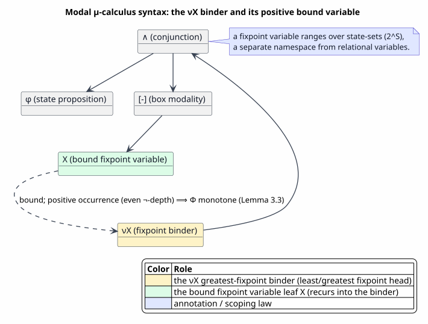
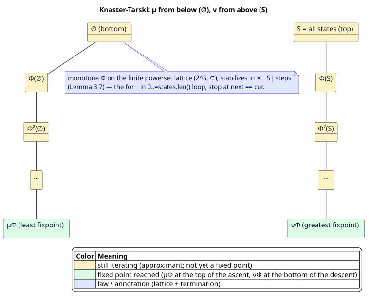
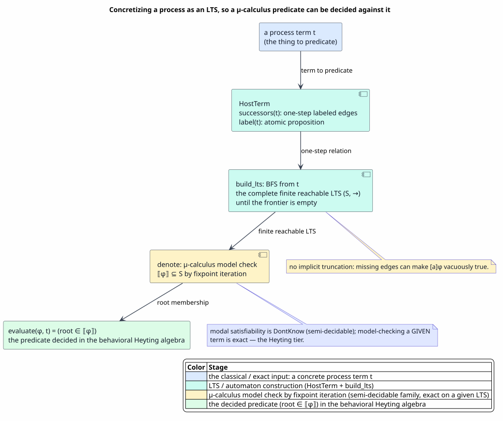
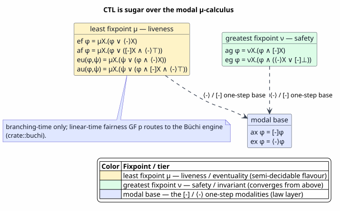

# The Modal μ-Calculus

Last updated: 2026-06-23

All symbols are defined in [Concepts and Glossary](01-concepts-and-glossary.md).
This document is the **proof-home for the fixpoint metatheory** that
[12 — Heyting Behavioral Logic](12-heyting-behavioral-logic.md) §4 *uses* but does not
prove: that the modal operators `Mu`/`Nu` denote genuine least/greatest fixpoints, that
the model checker `denote` converges and computes them exactly, and that the CTL sugar
of [12 Definition 4.4](12-heyting-behavioral-logic.md) means what its names claim. The
modal fragment of the behavioral algebra — `⟨a⟩`, `[a]`, `μX`, `νX` — **is** the
propositional **modal μ-calculus** ([Kozen, 1983](references.md#kozen-1983)), and that
is the subject of this document: its syntax, its fixpoint semantics, **how a process is
concretely materialized so that a μ-calculus predicate can be decided against it in the
behavioral Heyting algebra**, the model-checking algorithm and its correctness, the CTL
encoding, and why the whole fragment lives in the Heyting (not Boolean) tier.

> ⚠ **Caveat and provenance.** `Sat3` is the Rust enum in `algebra_tower.rs`, not a Coq
> object; do not read any `Sat3`/`Esakia` name as a mechanized lemma. The μ-calculus
> **metatheory below is classical mathematics proved here in prose** (each result is a
> Definition/Lemma/Proposition/Theorem with a proof ending `∎`) — there is no Coq
> mechanization of the fixpoint theory in this repository, the same provenance class as
> [12 Proposition 2.13](12-heyting-behavioral-logic.md) (the `Chain3` counter-model) and
> [12 Theorem 5.4](12-heyting-behavioral-logic.md) (bisimulation invariance). The Coq
> building blocks that *do* exist are cited as parentheticals only: the bisimulation
> primitives in `RegisterEquivalence.v` and the modal-tier classification in
> `BehavioralTierClassificationSound.v`. Math is in backticks throughout.

## 1. Why the μ-calculus, and the thesis

A behavioral guard asks a *temporal* question of a process — "is a bad state ever
reachable?", "does this invariant hold on every run?" Those questions are not decided by
looking at one state; they are **fixpoints** over the process's transition structure.
The behavioral algebra answers them with exactly two fixpoint binders — the least
fixpoint `μX.φ` (liveness: "reachable in finitely many steps") and the greatest fixpoint
`νX.φ` (safety: "holds unless finitely refuted") — over the two modalities `⟨a⟩φ` ("some
`a`-successor satisfies `φ`") and `[a]φ` ("all `a`-successors satisfy `φ`"). That logic
is the propositional modal μ-calculus; the eight CTL operators `ax, ex, ef, ag, af, eg,
au, eu` ([12 Definition 4.4](12-heyting-behavioral-logic.md)) are syntactic sugar over
it, and it strictly subsumes CTL and (alternation permitting) LTL on a finite transition
system.

> **Thesis.** The modal μ-calculus is the *modal fragment of the behavioral Heyting
> algebra*. Its greatest-fixpoint operators are **coinductive** — a `νX` safety property
> holds unless a *finite* counterexample refutes it — so its satisfiability is
> semi-decidable, which is exactly why the behavioral tier is Heyting, not Boolean
> ([12 §3](12-heyting-behavioral-logic.md)). Model checking a μ-calculus formula against
> a *given* process is exact; deciding satisfiability *over all processes* is not — the
> `Sat3::DontKnow` boundary.

This document delivers three things: (i) the logic — syntax (§2) and Knaster–Tarski
fixpoint semantics (§3); (ii) the concretization — how a process becomes a finite
transition system a predicate can be decided against (§4) — and the model-checking
algorithm with its exactness proof (§5); (iii) the CTL encoding (§6), the
Heyting-fragment argument (§7), and bisimulation invariance (§8).

## 2. Syntax of the modal μ-calculus

**Definition 2.1 (formulas).** Fix a set `Prop` of atomic state propositions (matched by
the LTS labeling), a set `Act` of actions, and a set `Var` of **fixpoint variables**.
The modal μ-calculus formulas are

`φ ::= ⊤ | ⊥ | p | X | φ ∧ φ | φ ∨ φ | ¬φ | ⟨a⟩φ | [a]φ | μX.φ | νX.φ`,

with `p ∈ Prop`, `X ∈ Var`, and `a` an action pattern (`Any`, written `⟨-⟩`/`[-]`;
`Tau`; or `Named n`). These are exactly the modal arms of the runtime `BehavioralFormula`
([12 Definition 4.3](12-heyting-behavioral-logic.md)); the relational `Relation`,
`Forall`, `Exists` arms belong to the relational and quantifier fragments
([12 §4](12-heyting-behavioral-logic.md), [14](14-quantification.md)) and are orthogonal
to this document.

**Definition 2.2 (free/bound variables, closed formula).** `μX.ψ` and `νX.ψ` **bind** `X`
in `ψ`; the free fixpoint variables `free(φ)` are defined structurally, removing `X` at a
binder. A formula is **closed** when `free(φ) = ∅`. Fixpoint variables are a *separate
namespace* from relational variables — a fixpoint variable ranges over **sets of states**,
not over domain constants. In the model checker an unbound `FixVar` defaults to `∅` (the
`fix` environment lookup), and the CTL sugar is always closed (its single reused binder
variable never escapes its scope).

**Definition 2.3 (positive occurrence; monotone formula).** An occurrence of `X` in `φ`
is **positive** when it lies under an even number of negations `¬`. A formula is
**monotone** (well-formed for fixpoints) when, in every subformula `μX.ψ` or `νX.ψ`, the
bound `X` occurs only positively in `ψ`. This is the syntactic side-condition that makes
the induced operator monotone (Lemma 3.3), which is what Knaster–Tarski (Theorem 3.4)
needs; without it the Kleene iteration of §3 need not converge. Every CTL encoding of
[12 Definition 4.4](12-heyting-behavioral-logic.md) is monotone: in each, `X` appears
only under `⟨-⟩`/`[-]`/`∧`/`∨`, never negated — e.g. in `ag φ = νX.(φ ∧ [-]X)` the bound
`X` sits under `[-]` and `∧`, a positive (even-depth) occurrence.

PlantUML source: [figures/15-mu-syntax.puml](figures/15-mu-syntax.puml).

## 3. Fixpoint semantics: Knaster–Tarski over the powerset lattice

A μ-calculus formula is interpreted as a **set of states** of a finite LTS. The fixpoint
binders are interpreted by the Knaster–Tarski theorem over the powerset lattice; this
section proves that theorem and the finite convergence that makes it an algorithm.

**Definition 3.1 (the state lattice).** For a finite LTS with state set `S` (`|S| = n`),
the powerset `(2^S, ⊆)` with meet `⋂`, join `⋃`, bottom `∅`, and top `S` is a **complete
lattice**: every family `{ Tᵢ } ⊆ 2^S` has a greatest lower bound `⋂ᵢ Tᵢ` and a least
upper bound `⋃ᵢ Tᵢ`, both subsets of `S`.

**Definition 3.2 (the operator induced by a formula).** Fix an environment `ρ`
interpreting the free variables other than `X`. A formula `ψ` with a distinguished free
`X` induces the operator `Φ : 2^S → 2^S` by `Φ(T) = ⟦ψ⟧ρ[X := T]`, where `⟦·⟧` is the
state-set denotation of Definition 5.1. This is exactly the body re-denotation
`denote(body, fix[X := T])` performed inside the `Mu`/`Nu` evaluation.

**Lemma 3.3 (monotonicity).** If `X` occurs only positively in `ψ` (Definition 2.3),
then `Φ` is monotone: `T₁ ⊆ T₂ ⟹ Φ(T₁) ⊆ Φ(T₂)`.

*Proof.* By induction on `ψ`. **Base.** `⟦X⟧ρ[X := T] = T`, monotone; `⟦p⟧`, `⟦⊤⟧`,
`⟦⊥⟧` are constant in `T`, hence monotone. **Step.** `⟦ψ₁ ∧ ψ₂⟧ = ⟦ψ₁⟧ ∩ ⟦ψ₂⟧` and
`⟦ψ₁ ∨ ψ₂⟧ = ⟦ψ₁⟧ ∪ ⟦ψ₂⟧`: intersection and union are monotone in each argument, so the
induction hypotheses compose. `⟦⟨a⟩ψ′⟧` and `⟦[a]ψ′⟧`: both are monotone in `⟦ψ′⟧` — a
larger body-set only adds `⟨a⟩` witnesses (the existential `some successor in the set`)
and only relaxes the `[a]` universal (`all matching successors in the set`), as is read
directly off the successor-membership tests. `⟦¬ψ′⟧ = S ∖ ⟦ψ′⟧` is *antitone* in
`⟦ψ′⟧`; but a positive occurrence of `X` sits under an even number of negations, and two
antitone maps compose to a monotone one, so the occurrence remains monotone (a negative
occurrence would not, which is precisely why Definition 2.3 forbids it). A nested binder
`μY.ψ′` or `νY.ψ′` with `Y ≠ X` is monotone in `X` because its fixpoint is taken
pointwise over the `X`-indexed family of monotone operators (parametric monotonicity).
All cases are covered. `∎`

**Theorem 3.4 (Knaster–Tarski).** A monotone operator `Φ` on a complete lattice
`(L, ⊆)` has a **least fixpoint** `μΦ = ⋂{ T : Φ(T) ⊆ T }` (the least pre-fixpoint) and a
**greatest fixpoint** `νΦ = ⋃{ T : T ⊆ Φ(T) }` (the greatest post-fixpoint).

*Proof.* Let `P = { T : Φ(T) ⊆ T }` be the set of pre-fixpoints; `P` is non-empty because
`Φ(⊤) ⊆ ⊤` (here `⊤ = S`). Put `m = ⋂ P`. For each `T ∈ P`, `m ⊆ T`, so by monotonicity
`Φ(m) ⊆ Φ(T) ⊆ T`; since this holds for every `T ∈ P`, `Φ(m) ⊆ ⋂ P = m`, so `m` is itself
a pre-fixpoint. Applying `Φ` to `Φ(m) ⊆ m` gives `Φ(Φ(m)) ⊆ Φ(m)`, so `Φ(m) ∈ P` and
therefore `m ⊆ Φ(m)`. The two inclusions give `Φ(m) = m`, a fixpoint; and `m ⊆ T` for
every fixpoint `T` (every fixpoint is a pre-fixpoint), so `m` is the least fixpoint. The
greatest-fixpoint case is order-dual: `νΦ = ⋃{ T : T ⊆ Φ(T) }` is the greatest
post-fixpoint, by the same argument with `⊆` reversed and `⋃` for `⋂`. `∎`
([Tarski, 1955](references.md#tarski-1955).)

**Definition 3.5 (Kleene approximants).** `Φ⁰_⊥ = ∅` and `Φ^{k+1}_⊥ = Φ(Φ^k_⊥)` (the
ascending chain); `Φ⁰_⊤ = S` and `Φ^{k+1}_⊤ = Φ(Φ^k_⊤)` (the descending chain).

**Lemma 3.6 (the approximant chains are monotone).**
`∅ = Φ⁰_⊥ ⊆ Φ¹_⊥ ⊆ Φ²_⊥ ⊆ ⋯` and `S = Φ⁰_⊤ ⊇ Φ¹_⊤ ⊇ Φ²_⊤ ⊇ ⋯`.

*Proof.* `∅ ⊆ Φ(∅)` trivially; applying the monotone `Φ` to `Φ^k_⊥ ⊆ Φ^{k+1}_⊥` gives
`Φ^{k+1}_⊥ ⊆ Φ^{k+2}_⊥`, so the ascending chain follows by induction. Dually `Φ(S) ⊆ S`
and induction give the descending chain. `∎`

**Lemma 3.7 (finite convergence — this is the algorithm).** Over a finite `S` with
`|S| = n`, the ascending chain stabilizes at some `k ≤ n`, and `Φ^k_⊥ = μΦ`; the
descending chain stabilizes at some `k ≤ n` with `Φ^k_⊤ = νΦ`. Hence iterating the body
until `next = cur` terminates in at most `n + 1` rounds and returns the correct fixpoint.

*Proof.* By Lemma 3.6 the ascending chain is `⊆`-increasing. A *strictly* increasing
chain in `2^S` strictly increases cardinality at each step, so it can have length at most
`n + 1` (from `|∅| = 0` to at most `|S| = n`); therefore there is a least `k ≤ n` with
`Φ^k_⊥ = Φ^{k+1}_⊥`, i.e. `Φ^k_⊥` is a fixpoint of `Φ`. It is the *least* fixpoint: by
induction on `j`, every approximant `Φ^j_⊥ ⊆ F` for any fixpoint `F` (base `∅ ⊆ F`; step
`Φ^j_⊥ ⊆ F ⟹ Φ^{j+1}_⊥ = Φ(Φ^j_⊥) ⊆ Φ(F) = F` by monotonicity), so the stabilized value
is `⊆ F`; being itself a fixpoint, it equals `μΦ` by Theorem 3.4. The greatest-fixpoint
case is order-dual: the descending chain strictly decreases cardinality, stabilizes in
`≤ n` steps, and its limit is `νΦ`. The `n + 1` round bound and the `next = cur`
stopping test are exactly the bounded fixpoint loop in the `Mu`/`Nu` model-checker. `∎`

PlantUML source: [figures/15-fixpoint-iteration.puml](figures/15-fixpoint-iteration.puml).

## 4. How a process is concretely described, so it can be predicated

A μ-calculus formula denotes a set of *states* — but a guard is asked of a *process*, not
of an abstract state space. This section makes concrete how a process is materialized
into the finite transition system a predicate is then decided against, in the behavioral
Heyting algebra.

**The concretization (cross-referencing [12 Definition 4.1](12-heyting-behavioral-logic.md)).**
A process term `t` is given an LTS by the `HostTerm` interface: `successors(t)` returns
the one-step labeled edges `{ (a, t′) }` — backed by the host's reduction relation — and
`label(t)` returns the atomic proposition true at `t`. From a root `t`, the **reachable
LTS** `(S, →)` is built by breadth-first search: `S` is the set of distinct reachable
terms (assigning each an index, the root at `0`), `→` is the edge relation from
`successors`, and exploration stops once `MAX_REACH_STATES = 10000` states are reached.
**This finite `(S, →)` is the concrete object a μ-calculus predicate is checked against.**
The atomic propositions `p` partition the states by `label`; the actions `a` label the
edges; and a behavioral formula `φ` is evaluated by computing its satisfying set
`⟦φ⟧ ⊆ S` over this LTS (§5) and asking whether the root is in it.

PlantUML source: [figures/15-process-to-lts.puml](figures/15-process-to-lts.puml).

**How this lands a predicate in the Heyting algebra.** The behavioral algebra
`BehavioralAlgebra<H>` is the Heyting tier of the tower
([12 §6.2](12-heyting-behavioral-logic.md)); a μ-calculus formula is one of its
predicates, and the process `t` (via its reachable LTS) is the *domain element* the
predicate is evaluated against. Two consequences are load-bearing and follow from the
concretization being a **bounded** construction:

- **Model checking against a given process is exact** (Theorem 5.2): the LTS is a finite
  structure, so `denote` computes `⟦φ⟧` exactly over it — the predicate's truth at `t` is
  a definite `true`/`false`.
- **Satisfiability over all processes is semi-decidable**: there is no a-priori bound on
  the process to reduce, so `is_satisfiable_3v` returns `Sat3::DontKnow` for a modal
  formula ([12 Definition 4.6](12-heyting-behavioral-logic.md)) — the
  `BehavioralTierClassificationSound.v` `T3` classification. This is the exact reason the
  modal fragment is Heyting, not Boolean (§7).

**The honest gap (carried from [12 §4.2](12-heyting-behavioral-logic.md)).** The model
checker is exact, but the only `HostTerm` instances wired today are `NoTerm` (the empty,
production relational-only LTS) and the test fixture `TestProc`; no live Rholang process
is yet bridged into the μ-calculus checker. So for a dispatched behavioral guard the
process is concretized as a host-supplied *fact* (the relational fragment) or a host
*observation* at COMM time ([08](08-runtime-comm-enforcement.md)), and modal
satisfiability of an as-yet-unreduced process is honestly `Sat3::DontKnow`. The
`successors() =` host-reduction seam (above) is the intended bridge by which a real
process would enter the exact model-checking path.

## 5. The model-checking algorithm and its correctness

**Definition 5.1 (the state-set denotation).** Over the reachable LTS `(S, →)`, the
denotation `⟦·⟧` of a closed monotone formula, in a fixpoint environment `fix` binding
free fixpoint variables to state-sets, is

`⟦⊤⟧ = S`,  `⟦⊥⟧ = ∅`,  `⟦p⟧ = { i ∈ S : label(i) = p }`,  `⟦X⟧ = fix(X)`,
`⟦φ ∧ ψ⟧ = ⟦φ⟧ ∩ ⟦ψ⟧`,  `⟦φ ∨ ψ⟧ = ⟦φ⟧ ∪ ⟦ψ⟧`,  `⟦¬φ⟧ = S ∖ ⟦φ⟧`,
`⟦⟨a⟩φ⟧ = { i : ∃ (b, j) ∈ succ(i). a matches b ∧ j ∈ ⟦φ⟧ }`,
`⟦[a]φ⟧ = { i : ∀ (b, j) ∈ succ(i). a matches b ⟹ j ∈ ⟦φ⟧ }`,
`⟦μX.φ⟧ = Φ^n_⊥` and `⟦νX.φ⟧ = Φ^n_⊤` for `Φ(T) = ⟦φ⟧fix[X := T]` (Definitions 3.2, 3.5).

This is exactly the function the model checker computes; the fixpoint arms iterate `Φ`
from `∅` (resp. `S`) until the set stabilizes, which by Lemma 3.7 is the least (resp.
greatest) fixpoint.

**Theorem 5.2 (soundness / exactness over the reachable LTS).** For a closed monotone
formula `φ` and the reachable LTS built from a root `t`, the model checker computes
`⟦φ⟧` exactly, and `evaluate(φ, t) = true ⟺ root ∈ ⟦φ⟧` (the root being index `0`).

*Proof.* By structural induction on `φ`. The Boolean and atomic arms compute the
set operations of Definition 5.1 verbatim. The modal arms `⟨a⟩`/`[a]` compute the
existential/universal successor tests of Definition 5.1, which are exact over the finite
adjacency. For `μX.φ` and `νX.φ`, the induction hypothesis gives that the body's
denotation under `fix[X := T]` is `Φ(T)` (Definition 3.2); the loop computes the Kleene
limit `Φ^n_⊥` (resp. `Φ^n_⊤`), which equals `μΦ` (resp. `νΦ`) by Lemma 3.7. Hence
`⟦φ⟧` is computed exactly, and the verdict is `root ∈ ⟦φ⟧`. `∎`

**Proposition 5.3 (truncation is reject-safe).** If the BFS truncates at
`MAX_REACH_STATES`, dropping states and edges beyond the cap, then for every formula the
computed possibility/least-fixpoint sets only **shrink** relative to the full LTS — the
checker may return `false`/`DontKnow` where the full model returns `true`, but never the
reverse for a guard.

*Proof.* Dropping edges removes successors. This can only remove `⟨a⟩` witnesses (the
existential finds fewer) and only shrink a `μX` least fixpoint (fewer predecessors are
added at each Kleene round), so `⟨a⟩`- and `μ`-sets shrink. A `[a]` universal becomes
vacuously *easier* to satisfy on a truncated successor list, which over-approximates
safety in the **conservative** direction — a guard that requires a safety property is
never granted on the strength of edges that were dropped. Hence a truncated model checker
errs only toward refusing a COMM, never toward wrongly admitting one — the reject-safe
contract ([12 §3](12-heyting-behavioral-logic.md), [05](05-algebra-pyramid-and-decidability.md)).
This is the source invariant "missing edges only shrink modal satisfaction sets." `∎`

**Proposition 5.4 (complexity, alternation-free).** For an alternation-free `φ` (no
mutually-dependent `μ`/`ν` nesting — the CTL fragment), the model checker runs in
`O(|φ| · |S| · (|S| + |→|))`: each of the `≤ |S| + 1` fixpoint rounds recomputes a body
denotation linear in `|S| + |→|`, over the `|φ|` subformulas.

*Proof.* The structural recursion visits `|φ|` subformula nodes; each `Mu`/`Nu` node
iterates at most `|S| + 1` times (Lemma 3.7); each iteration scans the adjacency once
(`Σᵢ deg(i) = |→|`) plus a linear set operation in `|S|`. Multiplying gives the bound.
Nested *alternation-free* fixpoints do not multiply their iteration counts, because an
inner fixpoint re-converges from a monotone-shifted starting set rather than from scratch
([Emerson & Lei, 1986](references.md#emerson-clarke-1980)). `∎`

## 6. The CTL encoding: the safety-`ν` / liveness-`μ` duality

Each CTL operator of [12 Definition 4.4](12-heyting-behavioral-logic.md) is *sugar* over
a fixpoint formula; here is the proof that each means its intended branching-time
property. Write `pre(T) = { i : ∃ j ∈ T. i → j }` for the predecessor map.

**Proposition 6.1 (`ef` is reachability).** `⟦ef φ⟧ = μX.(φ ∨ ⟨-⟩X)` is the `⊆`-least set
`T` with `⟦φ⟧ ∪ pre(T) ⊆ T`; equivalently `i ∈ ⟦ef φ⟧ ⟺` some run from `i` reaches a
`φ`-state.

*Proof.* `Φ(T) = ⟦φ⟧ ∪ pre(T)` is monotone (Lemma 3.3), so its least fixpoint exists
(Theorem 3.4) and is the least predecessor-closed superset of `⟦φ⟧`. By Lemma 3.7 the
Kleene ascent `∅ ⊆ ⟦φ⟧ ⊆ ⟦φ⟧ ∪ pre(⟦φ⟧) ⊆ ⋯` adds, at round `k`, exactly the states that
reach `⟦φ⟧` in at most `k` steps; the limit is "reaches a `φ`-state in finitely many
steps," i.e. reachability. `∎` (Worked: the `TestProc` ascent `∅ → {2} → {1,2} → {0,1,2}`
of §9.)

**Proposition 6.2 (`ag` is invariance).** `⟦ag φ⟧ = νX.(φ ∧ [-]X)` is the `⊆`-greatest set
`T` with `T ⊆ ⟦φ⟧ ∩ [-]T`; equivalently `i ∈ ⟦ag φ⟧ ⟺ φ` holds at every state of every
run from `i`.

*Proof.* `Ψ(T) = ⟦φ⟧ ∩ [-]T` is monotone, so its greatest fixpoint exists (Theorem 3.4)
and is the greatest set closed under "is a `φ`-state and all successors stay in the set"
— the greatest invariant. By Lemma 3.7 the Kleene descent `S ⊇ ⟦φ⟧ ∩ [-]S ⊇ ⋯` removes,
at round `k`, the states from which a `¬φ`-state is reachable in at most `k` steps; the
limit retains exactly the states all of whose runs remain in `φ`. `∎` (Worked: the
`TestProc` descent `{0,1,2} → {0,1} → {0} → ∅` of §9.)

**Proposition 6.3 (the safety/liveness duality).** `⟦ef φ⟧ = S ∖ ⟦ag ¬φ⟧` and
`⟦ag φ⟧ = S ∖ ⟦ef ¬φ⟧`; more generally `μX.φ(X) = ¬ νX.¬φ(¬X)` — every least-fixpoint
(liveness) property is the complement of a greatest-fixpoint (safety) property, and
conversely.

*Proof.* "`φ` is reachable" is the negation of "`¬φ` is invariant": a run reaches a
`φ`-state iff it is not the case that every state of every run is `¬φ`. Algebraically,
pushing `¬` through the fixpoint uses the antitonicity of `¬` together with the modal De
Morgan dual `¬ pre(T) = [-](S ∖ T)` (a state has no successor entering `T` iff all its
successors avoid `T`), which turns the least fixpoint of `Φ` into the greatest fixpoint of
`T ↦ S ∖ Φ(S ∖ T)`. Hence `μ` is liveness/eventuality and `ν` is safety/invariance — the
two annotations the `Mu`/`Nu` operators carry. `∎`

**Proposition 6.4 (the deadlock-guarded operators).** Under the maximal-run convention
(`⟨-⟩⊤` is "can take a step"; `[-]⊥` is "is a deadlock"), the four guarded CTL operators
are correct at deadlocks: `af φ = μX.(φ ∨ ([-]X ∧ ⟨-⟩⊤))` is **false** at a `φ`-free
deadlock; `eg φ = νX.(φ ∧ (⟨-⟩X ∨ [-]⊥))` keeps a `φ`-deadlock in the set; and
`au`/`eu` carry the same progress guards.

*Proof.* At a deadlock `i` (no successors), `⟨-⟩⊤` is false and `[-]⊥` is true. For
`af φ`: if `i` is a `¬φ`-state, the disjunct `φ` is false and `[-]X ∧ ⟨-⟩⊤` is false
(since `⟨-⟩⊤` is false), so `i` never enters the least-fixpoint set — `af φ` is correctly
false (a `¬φ` run that simply stops has not reached `φ`). For `eg φ`: a `φ`-deadlock has
`φ` true and `[-]⊥` true, so the conjunct `φ ∧ (⟨-⟩X ∨ [-]⊥)` holds and `i` stays in the
greatest-fixpoint set — a maximal run legitimately ending in a `φ`-state witnesses
`eg φ`. The `au`/`eu` cases are the same monotone-fixpoint argument with `ψ` the escape
condition and the `⟨-⟩⊤`/`⟨-⟩X` progress guard. Each is monotone (Lemma 3.3) and decided
by Theorem 5.2. `∎` (The real `ctl_temporal_operators` / `modal_no_infinite_path` tests
are the executable witnesses.)

PlantUML source: [figures/15-ctl-mu-encoding.puml](figures/15-ctl-mu-encoding.puml).

**Out of scope: linear-time fairness.** Branching-time `μ`/`ν` cannot express a linear
fairness constraint such as `GF p` ("infinitely often `p`") without fixpoint
*alternation*; the substrate stays alternation-free, and linear-time temporal properties
route to the dedicated Büchi-automaton engine (`crate::buchi`, `crate::ltl`), outside this
fragment ([08](08-runtime-comm-enforcement.md)).

## 7. Why the μ-calculus is the modal fragment of the behavioral Heyting algebra

**Proposition 7.1 (the modal fragment is the `DontKnow` / Heyting tier).** A formula
containing any modal operator (`⟨a⟩`, `[a]`, `μX`, `νX`) is classified as a
semi-decidable (`T3`) behavioral predicate: `is_satisfiable_3v` returns `Sat3::DontKnow`
for it, while `evaluate` (model checking against a *given* term) is exact.

*Proof.* The modal-tier classifier maps any formula with a modal subformula to the
semi-decidable tier (mechanized as `BehavioralTierClassificationSound.v`), and
`is_satisfiable_3v` short-circuits a modal formula to `DontKnow`
([12 Definition 4.6](12-heyting-behavioral-logic.md)) — the missing piece is a μ-calculus
*satisfiability* engine over all models, not the model-checking direction, which §5
proved exact. `∎`

This is the precise sense in which the modal μ-calculus lives in the Heyting tier:

- **Coinduction is the shape of safety, and of bisimilarity.** A `νX` safety property and
  bisimilarity `∼` are *both* greatest fixpoints — both "holds unless finitely refuted,"
  both computed by descending Kleene iteration / partition refinement
  ([12 §5.2](12-heyting-behavioral-logic.md)). That is why `ag φ = νX.(φ ∧ [-]X)` and the
  coarsest bisimulation run on the same machinery, and why `bisimulation.rs` is the
  "Heyting-SFA bisimilarity" layer.
- **The BHK reading.** A `μ`-liveness witness is a *finite* run — constructive, hence
  assertible; a `ν`-safety property fails only on a *finite* counterexample, but its
  success is the *absence* of a counterexample within the (possibly truncated) model —
  semi-decidable, hence intuitionistic ([12 §3](12-heyting-behavioral-logic.md)). This is
  why `¬¬safe(P) ≠ safe(P)` operationally ([12 §8](12-heyting-behavioral-logic.md)): "not
  refuted within budget" is weaker than "verified."

## 8. Bisimulation invariance of the μ-calculus

**Theorem 8.1 (the μ-calculus is bisimulation-invariant).** If `p ∼ q` then for every
modal μ-calculus formula `φ`, `evaluate(φ, p) = evaluate(φ, q)`; a behavioral predicate is
therefore well-defined on the bisimulation quotient `S / ∼`.

This is exactly [12 Theorem 5.4](12-heyting-behavioral-logic.md), whose proof already
covers the `μX`/`νX` cases: every Kleene approximant `Φ^k_⊥` (resp. `Φ^k_⊤`) is
`∼`-closed (a set `T` is `∼`-closed when `p ∈ T ∧ p ∼ q ⟹ q ∈ T`), `∼`-closure is
preserved by the monotone body operator and by `⋂`/`⋃`, so the fixpoint limit is
`∼`-closed. We cite that proof rather than repeat it. The model-theoretic framing is the
**Hennessy–Milner theorem** (over an image-finite LTS, two states satisfy the same modal
formulas iff they are bisimilar, [Hennessy & Milner, 1985](references.md#hennessy-milner-1985))
and the **van Benthem characterization** (modal logic is the bisimulation-invariant
fragment of first-order logic, [van Benthem, 1983](references.md#van-benthem-1983)). The
Coq building blocks are the bisimulation primitives `is_bisimulation`, `bisimilar`,
`self_bisimilar`, `fixed_point_is_bisimulation` (`RegisterEquivalence.v`); the invariance
theorem itself is the classical result.

## 9. Worked example

Take the `TestProc` LTS of [12 §4.3](12-heyting-behavioral-logic.md): states `{0, 1, 2}`,
edges `0 —step→ 1 —step→ 2`, `label(2) = done`, so `⟦Atom done⟧ = {2}`.

**`ef done` as a least fixpoint (Proposition 6.1).** `Φ(T) = ⟦done⟧ ∪ pre(T)`, ascent from
`∅`:

| round `k` | `Φ^k_⊥` |
|---|---|
| 0 | `∅` |
| 1 | `{2}` |
| 2 | `{1, 2}` |
| 3 | `{0, 1, 2}` |
| 4 | `{0, 1, 2}` — fixed point `= μΦ` |

Root `0 ∈ μΦ`, so `evaluate(ef done, 0) = true`: `done` is reachable. The chain
stabilized in `3 ≤ |S| = 3` strict steps (Lemma 3.7).

**`ag ¬done` as a greatest fixpoint (Proposition 6.2).** `Ψ(T) = ⟦¬done⟧ ∩ [-]T` with
`⟦¬done⟧ = {0, 1}`, descent from `S`:

| round `k` | `Φ^k_⊤` |
|---|---|
| 0 | `{0, 1, 2}` |
| 1 | `{0, 1}` (drop `2`: not in `⟦¬done⟧`) |
| 2 | `{0}` (drop `1`: its successor `2 ∉ T`) |
| 3 | `∅` (drop `0`: its successor `1 ∉ T`) |
| 4 | `∅` — fixed point `= νΦ` |

Root `0 ∉ νΦ`, so `evaluate(ag ¬done, 0) = false`: invariance fails because `done` is
reachable — the De Morgan dual of the previous result (Proposition 6.3), `ag ¬done =
¬ ef done`.

**Nesting.** `ag(ef done)` ("`done` is *always still* reachable") is alternation-free
(`μ` inside `ν`, no mutual dependence): the inner `ef done = {0,1,2}` is computed first,
then the outer `νX.(ef done ∧ [-]X)` descends to `{0,1,2}` — every state can still reach
`done`. The `fix` environment's lexical shadowing lets the two binders reuse one variable
name without interference. These are the real `modal_eventually_done` /
`ctl_temporal_operators` tests.

## 10. Cross-references

- The behavioral operators, model, and `evaluate` this document is the fixpoint
  proof-home for: [12 §4.1, Definitions 4.1–4.7](12-heyting-behavioral-logic.md).
- Why semi-decidable behavioral predicates are intuitionistic, and the `¬¬safe ≠ safe`
  gap: [12 §3, §8](12-heyting-behavioral-logic.md).
- The tower placement of `BehavioralAlgebra` and the implementations catalog:
  [12 §6.2](12-heyting-behavioral-logic.md), [05 — Algebra Pyramid](05-algebra-pyramid-and-decidability.md).
- Bisimulation and its coinductive twinning with `νX`:
  [12 §5](12-heyting-behavioral-logic.md).
- The sibling fragments of the same behavioral algebra: the relational/quantifier fragment
  [14 — Quantification](14-quantification.md) and the LogicT engine
  [13 — Constraint-Theory Engine](13-constraint-theory-engine.md).
- Run-time enforcement of the surviving guard, and the Büchi/LTL boundary:
  [08 — Runtime COMM Enforcement](08-runtime-comm-enforcement.md).
- Literature: [Kozen, 1983](references.md#kozen-1983) (the propositional μ-calculus),
  [Tarski, 1955](references.md#tarski-1955) (the lattice fixpoint theorem),
  [Emerson & Clarke, 1980](references.md#emerson-clarke-1980) (the fixpoint
  characterization of CTL), [Bradfield & Stirling, 2001](references.md#bradfield-stirling-2001)
  (the modal μ-calculus survey).
