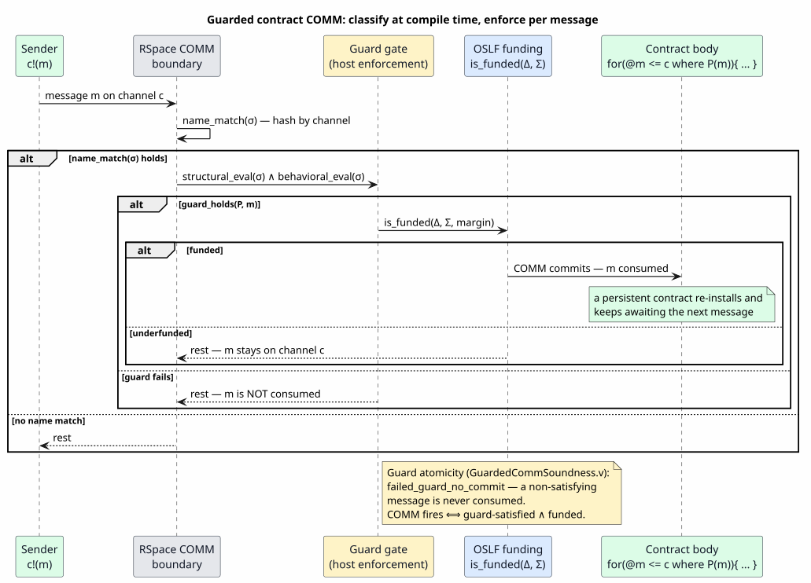

# Predicate-Guarded Contracts

Last updated: 2026-06-24

All symbols are defined in [Concepts and Glossary](01-concepts-and-glossary.md). This
document is the design-home for one question the rest of the suite answers only in
pieces: **how a contract awaits messages on its channels and consumes one only when the
incoming message satisfies a semantic predicate.** It assembles the authoring surface
([06 — Guard Syntax and Extensions](06-guard-syntax-and-extensions.md)), the compile-time
classification ([07 — Language to Rholang Integration](07-language-to-rholang-integration.md)),
the run-time enforcement ([08 — Runtime COMM Enforcement](08-runtime-comm-enforcement.md)),
and the funding axis ([09 — Funding Composition](09-funding-composition.md)) into one
end-to-end account, and states plainly which parts are proven, which are wired, and which
are absent.

> ⚠ **Status convention.** Each capability carries a badge: ✅ **exists** (working code
> with a passing test), ◐ **partial** (a surface exists, incompletely wired), ⊳
> **proposed** (the algebra and proof exist, with no way to write it in a `language!`
> spec), ❌ **absent** (neither surface nor wiring). The badges are the honest core of
> this document; §4 collects them in one ledger. Math is in backticks throughout.

## 1. The question and the thesis

A smart-contracting language built on the full Rholang surface is, at its heart, a
population of **contracts** — persistent receivers, each waiting on one or more channels
for messages to act on. The design question:

> Can a contract be written so that it **awaits** messages and consumes one **only when
> that message satisfies a semantic predicate** `P`, and never consumes a message that
> fails `P`?

**Thesis.** This is exactly the *guarded-receive* mechanism the semantic-predicate
substrate was built for. The predicate `P` is classified once at compile time into an
enforcement *disposition*; at run time the host enforces the surviving decision at the
RSpace communication (`COMM`) boundary, composed with the funding axis as `COMM
fires ⟺ guard-satisfied ∧ funded`; and **guard atomicity** — proved zero-admission in
Coq — guarantees a failing message is left resting, so the contract keeps awaiting. The
substrate and its proofs are built for this; the *persistent* contract surface and the
concrete run-time handler are the two pieces that remain to be wired (§4, §5).

## 2. Authoring a guarded receive today (the surface)

### 2.1 The three declaration pieces — ✅

The shipping prototype is the `GuardedRho` language (`languages/src/guarded_rho.rs`). A
guarded receive is declared with three pieces, each of which exists today:

```
// (1) a rule with a ?guard:Guard slot and a bound message variable x
PGuardedInput . n:Name, ?guard:Guard, ^x.p:[Name -> Proc]
    |- "for" "(" x "<-" n "where" guard ")" "{" p "}" : Proc ;

// (2) the channel category and the join key
guards { channels { channel Name; join PGuardedInput(ch: Name); } }

// (3) the external relations the predicate may query
logic { relation halts(Proc); relation safe(Proc); }
```

- The **`?guard:Guard` slot** lowers to `TermParam::GuardBody` (`ast/src/grammar.rs`),
  then to a `GuardExpression` parser item whose walker calls `parse_predicate_from_str`
  (`runtime/src/lib.rs`). The literal `where` is **not** a reserved keyword — any literal
  may precede the slot; the switch into the predicate sublanguage is driven by the slot,
  not the word.
- The **`guards { channels { … } }`** block declares the channel category `Name` and the
  join key `PGuardedInput(ch: Name)`; the **`logic { … }`** block declares the external
  relations the predicate names (here `halts` and `safe`, populated by host or user code).

### 2.2 The predicate references the bound message — ✅

The receive binds the incoming message as `x` (the moniker binder `^x.p`), scoped over
both the body `p` and the guard. The predicate names `x`:

```
for(x <- @1 where halts(x)){ Nil }
```

parses to the runtime value `RelationQuery { relation_name: "halts", args: [Var("x")],
negated: false }`. The supported `where`-surface
([06 — Guard Syntax and Extensions](06-guard-syntax-and-extensions.md)) is: relation
queries, the connectives `∧ / ∨ / ¬ / ⟹`, the call-form quantifiers `forall` / `exists`,
integer comparisons (`x < 5` desugars to `lt`), `in` membership, and the `->*` rewrite
closure. Richer surfaces — faithful `AcMatch`, modal/temporal `AG` / `EF` / `AU`,
transducer and effective-theory literals — are ⊳ proposed only
([06 §3](06-guard-syntax-and-extensions.md#3-proposed-extensions)).

### 2.3 Linear receive only — the persistent-contract gap — ❌

⚠ One load-bearing limitation: `GuardedRho`'s `PGuardedInput` is a **linear** receive
(`<-`) — it consumes at most once. A **persistent / replicated** receive — the Rholang
`contract foo(x) = { … }`, equivalently `for(x <= chan){ … }`, that keeps serving — has
**no surface form**: there is no persistent arrow, no `persistent` flag on the
guarded-receive path, and the construct is absent even from the proposed extensions. The
sole `persistent: true` lowering in the tree (`rholang-codegen/src/lower.rs`) is the
unrelated, unguarded operator-service-contract lane. The run-time model *can* filter a
stream on a linear receive (re-evaluate the guard per candidate, consume one — §3.3), but
it does not keep serving after a commit.

## 3. The classify-then-enforce path

The lifetime of a guarded contract has two halves separated by a hard boundary: the
substrate **classifies** at compile time; the host **enforces** at run time. The sequence
diagram below traces a single message through the run-time half.

### 3.1 Compile time: `obligation → disposition → quality → flip gate` — ✅

The substrate is **classify-only**: it runs once at compile time and emits evidence, never
an algebra into the generated Rholang ([08 §1](08-runtime-comm-enforcement.md#1-the-honest-answer-up-front)).
For each guard, `collect_guard_obligations` (`rholang-codegen/src/backend.rs`) emits an
obligation whose kind is one of `StructuralPattern`, `BehavioralPredicate`,
`TheoryRegistration`, or `RhoNativeJoin`; `guard_pred_obligation_kind` routes a guard with
any structural (`AcMatch`) component to `StructuralPattern`, else to `BehavioralPredicate`.
Each obligation is covered by a *disposition* (`DovetailCoreStructural`,
`EffectiveBooleanAlgebra`, `SymbolicFiniteTransducer`, `RhoNativeJoin`, `NativeHandler`,
`ExternalContract`) and graded by a *quality* (`guard_quality.rs`; only `Unknown` refuses
the default). The fail-closed flip gate `decide_rho_flip` (`flip.rs`, the Rust image of
`RhoBackendFlipGate.v`) admits the contract only when every obligation is covered with a
non-`Unknown` quality.

### 3.2 Run time: the COMM gate and funding composition — ✅ source path / ◐ AST path

At the `COMM` boundary the host evaluates the firing condition
([08 §2](08-runtime-comm-enforcement.md#2-what-a-comm-is-and-what-enforcement-means)):

`comm_fires(σ) = name_match(σ) ∧ structural_eval(σ) ∧ behavioral_eval(σ)`

composed with the funding discipline ([09 §4](09-funding-composition.md#4-how-they-compose-at-the-boundary)) as
the two-axis gate `GuardedFundedCommit`: `name_match → guard_holds → is_funded → commit`,
i.e. `COMM fires ⟺ guard-satisfied ∧ funded`. The three enforcement mechanisms
([08 §3](08-runtime-comm-enforcement.md#3-the-three-enforcement-mechanisms)) are selected
by the surviving guard's disposition: a structural shape rides RSpace spatial matching
(native, free); a pure boolean over ground data is a Rholang `where` clause; everything
richer is the host-routed native join (`RhoNativeJoin`). A nuance forces the third path:
MeTTaIL's production lane builds `rhoapi::Par` AST directly, and `rhoapi::ReceiveBind` has
**no guard field**, so a non-structural boolean that cannot fold into the match pattern is
routed to the native join rather than an emitted `where`.

### 3.3 Guard atomicity — the awaiting property — ✅ proven

The property that makes "awaits a satisfying message" precise is **guard atomicity**: a
`COMM` whose guard fails consumes nothing and emits nothing. It is proved zero-admission
in `GuardedCommSoundness.v` (`failed_guard_no_commit`, `true_guard_enabled_adds_output`,
`guarded_attempt_no_fabrication`, `missing_premise_no_commit`) and mirrored at the rho
boundary by `RhoGuardedCommSoundness.v` (`comm_fires_iff`, `rho_complement_no_commit`,
`rho_guard_true_commits`). A failing message therefore stays resting on its channel, and a
later satisfying message still commits. Atomicity is **per-candidate and orthogonal to
persistence** — so it is exactly the guarantee a persistent guarded contract needs.



*The sequence: a message `m` on channel `c` is admitted only when `name_match`, the guard,
and funding all hold; a guard failure (or underfunding) leaves `m` resting, and a
persistent contract re-installs to await the next message.*

## 4. Wiring-status ledger

This is the honest core: the substrate and its proofs are built for predicate-guarded
contracts; two execution pieces and the persistent surface are what remain.

| Component | Status |
|---|---|
| Guard-atomicity model + theorems (`GuardedCommSoundness.v`, `RhoGuardedCommSoundness.v`) | ✅ **proven, zero-admission** (target `rocq-rho-bridge`) |
| `where` boolean guard on the live `RhoRuntime` (source path) | ✅ **wired + tested** (`rholang-runtime/tests/rho_guard_oracle.rs`, 4 cases) |
| `RhoNativeJoin` disposition + compatibility matrix + flip-gate planner | ✅ **wired (compile-time)** (`rholang-codegen/src/backend.rs`) |
| The funding `is_funded` resource axis + four-law conformance | ✅ **wired + proven** (`rholang-adapter/src/gslt.rs`, `MettaFundingLawsConformance.v`) |
| Concrete run-time native-join handler consulting `halts` / `safe` | ◐ **specified; handler not wired** — `guard_codegen.rs` emits no per-guard runtime code |
| Modal model-check over a real `rhoapi::Par` | ◐ **honest gap** — only `NoTerm` / `TestProc` instances; modal `Sat3` is `DontKnow` |
| Guard field on `rhoapi::ReceiveBind` (AST path) | ❌ **absent by design** — forces host-routing through `RhoNativeJoin` |
| Persistent `contract` / `for(x <= c …)` surface | ❌ **absent** — only a linear (`<-`) guarded receive exists |
| f1r3node `contract` = persistent receive (`Receive.persistent`) | ✅ **exists in the host** — a guard composes per-candidate |

## 5. The path to full-Rholang predicate-guarded contracts

Four concrete steps close the gap between the proven substrate and a running full-Rholang
predicate-guarded contract:

1. **Surface the construct.** Add a persistent guarded receive (`for(@m <= c where
   P(m)){ … }`, the `contract` form) and thread a `persistent` flag to the
   guarded-receive `ReceiveBind` lowering. f1r3node already models a persistent receive
   (`Receive.persistent`); the surface form and the lowering flag are what is absent.
2. **Wire the native-join handler** at the f1r3node `eval_receive -> consume` seam (the
   `check_commit` veto) so it evaluates the classified guard per candidate and rests
   non-satisfiers. The `where`-oracle test already witnesses the exact behavior it must
   reproduce.
3. **Concretize behavioral truth.** Keep host-supplied facts (`halts` / `safe`, which work
   today) or wire a real `rhoapi::Par` into the modal model checker
   ([12 §4.2](12-heyting-behavioral-logic.md#42-the-three-concretization-mechanisms));
   reject-safety keeps a `Sat3::DontKnow` verdict from ever committing.
4. **Route richer-than-boolean guards through `RhoNativeJoin`** rather than an emitted
   `where`, since `ReceiveBind` carries no guard field — the derived-required design.

The run-time scale of step 2 — how a host with *many* guarded contracts dispatches one
incoming message to the compatible contracts without evaluating every predicate — is the
subject of the companion document
[17 — Predicate Dispatch Optimization](17-predicate-dispatch-optimization.md).

## 6. Cross-references

- The authoring surface (supported and proposed guard syntax):
  [06 — Guard Syntax and Extensions](06-guard-syntax-and-extensions.md).
- The compile-time classification boundary and the flip gate:
  [07 — Language to Rholang Integration](07-language-to-rholang-integration.md).
- The three run-time enforcement mechanisms and the guard-atomicity theorems:
  [08 — Runtime COMM Enforcement](08-runtime-comm-enforcement.md).
- The funding axis and the two-axis `GuardedFundedCommit` gate:
  [09 — Funding Composition](09-funding-composition.md).
- Behavioral concretization and the `Sat3::DontKnow` boundary:
  [12 — Heyting Behavioral Logic](12-heyting-behavioral-logic.md#42-the-three-concretization-mechanisms),
  [15 — Modal μ-Calculus](15-mu-calculus.md).
- Run-time dispatch at scale: [17 — Predicate Dispatch Optimization](17-predicate-dispatch-optimization.md).
- The overview that places all backends in one frame:
  [Runtime Backend Spine](../runtime-backend-spine.md).
