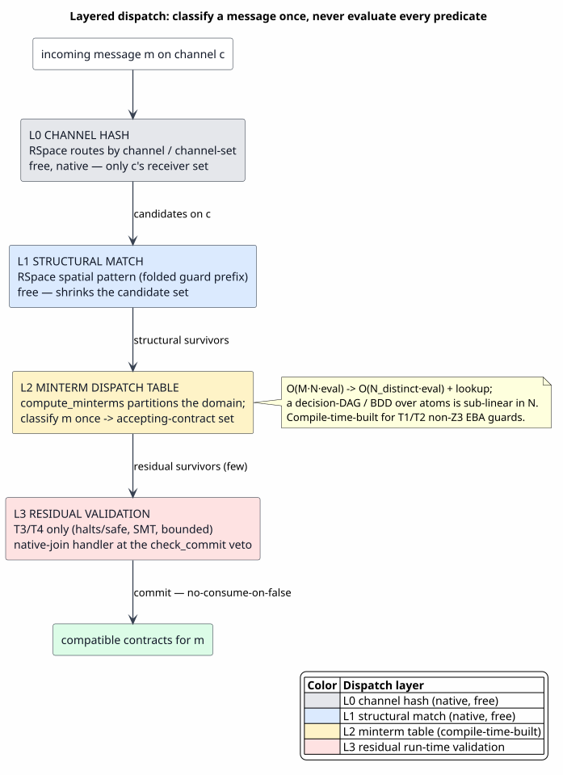
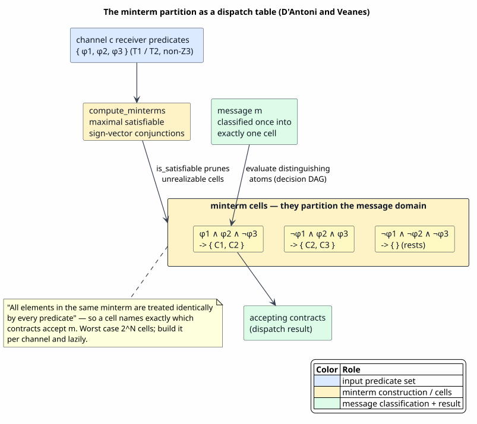

# Predicate Dispatch Optimization

Last updated: 2026-06-24

All symbols are defined in [Concepts and Glossary](01-concepts-and-glossary.md). This
document answers the run-time scaling question that
[16 — Predicate-Guarded Contracts](16-predicate-guarded-contracts.md) raises but does not
solve: **with many predicate-guarded contracts on a channel, how does the host dispatch
one incoming message to the compatible contracts without evaluating every predicate?**
The principled answer is a layered, per-channel dispatch pipeline whose central primitive
— the symbolic-automata **minterm partition** — already exists in the tree.

> ⚠ **Status convention.** Badges as in [16](16-predicate-guarded-contracts.md): ✅
> **exists**, ◐ **partial / specified**, ❌ **to build**. This document is largely a
> design: it names the ingredients that exist, the connective tissue to build, and the
> complexity each layer buys. Math is in backticks throughout.

## 1. The problem and the thesis

Let a channel `c` carry `M` waiting contracts, each guarded by a semantic predicate, and
let messages arrive at rate `R`. The naive enforcement — test every predicate against
every message — costs `O(R · M · eval)` per channel, and re-pays the cost of a predicate
shared by `k` contracts `k` separate times. For a contract population of any size this is
infeasible: it is the design pitfall this document exists to avoid.

> **Thesis.** No message is ever matched against all predicates. A message is classified
> **once** through a layered structure — channel hash, then structural match, then a
> **minterm dispatch table**, then a small residual check — and each distinct predicate
> atom is evaluated **once** and reused across every contract that shares it. The cost
> falls from `O(M · N · eval)` to `O(N_distinct · eval) + lookup`, and a decision-DAG
> over the atoms makes the lookup sub-linear in the number of contracts.

The thesis rests on the same compile-time/run-time boundary as the rest of the suite: the
predicate algebra runs at compile time to *build* the dispatch structure, and the dispatch
structure runs at run time to *classify* — the algebra itself is never re-run per message.

## 2. The layered dispatch pipeline

A message descends through four layers, cheapest discriminator first; each layer hands a
smaller candidate set to the next.

### 2.1 L0 — channel hash — ✅ (native, free)

RSpace stores resting data and waiting continuations in hash maps keyed by channel and by
channel-set (`hot_store.rs`), so a message reaches only the receiver set of its own
channel `c`; predicates are compared *within* `c`, never globally. This is the coarsest
partition and it is already native — the dispatch table of §3 is therefore built
**per channel**, over only `c`'s receiver predicates.

### 2.2 L1 — structural match — ✅ (native, free)

Within `c`, the RSpace spatial matcher tests the message against each waiting receive's
structural pattern. A guard's *structural prefix*, folded into that pattern, is decided
here for free and shrinks the candidate set before any predicate evaluation
([08 §3.1](08-runtime-comm-enforcement.md#3-the-three-enforcement-mechanisms)). One
caveat: RSpace today linear-scans the channel's data
(`find_matching_data_candidate` / `extract_first_match`), so L1 is `O(candidates)`; a
**discrimination trie** over constructor paths would index it (§5, optional).

### 2.3 L2 — minterm dispatch table — ✅ primitive / ❌ table

The residual semantic predicates that do not fold into the structural pattern are routed
here. From the predicate set `{φ1, …, φn}` on `c`, the **minterm partition** (§3) is built
at compile time; at run time a message is classified into exactly one minterm cell, and
the cell *names the accepting contracts directly*. This is the answer to "never evaluate
all predicates."

### 2.4 L3 — residual validation — ◐ (specified)

Only predicates that cannot be partitioned ahead of time — behavioral facts (`halts` /
`safe`), SMT-backed guards, bounded-reachability — reach L3, and only on the few survivors
of L0–L2. They are enforced by the host-routed native join at RSpace's `check_commit`
**post-match veto** seam (`space_matcher.rs`, `rspace.rs`), with the no-consume-on-false
semantics that §3.3 of [16](16-predicate-guarded-contracts.md) proves. The handler is
installed **per receive**, only for channels whose guard took `RhoNativeJoin`, so
structural and unguarded channels stay on the zero-cost stock path.

## 3. The minterm dispatch table

The principled core of L2 is the symbolic-automata **minterm** construction of
[D'Antoni–Veanes 2014](references.md#dantoni-veanes-2014).

**Definition (minterm).** Given predicates `{φ1, …, φn}` over a shared domain, a *minterm*
is a maximal satisfiable conjunction `(±)φ1 ∧ (±)φ2 ∧ … ∧ (±)φn` (each `φi` appearing
positive or negated). The minterms **partition** the domain into cells in which "all
elements are treated identically by every predicate" — so a cell's sign vector names
exactly which `φi` (hence which contracts) accept any element of that cell.

**The primitive already exists.** `compute_minterms` (`prattail/src/symbolic.rs`)
implements this construction and is covered by tests (`minterms_single_predicate`,
`minterms_two_overlapping_predicates`). It rests on the `BooleanAlgebra` trait, which
exposes exactly the operations a minterm build needs — `and`, `or`, `not`,
`is_satisfiable`, and the per-element classifier `evaluate`. Two properties make it apt
for compile-time dispatch:

- **Satisfiability is automata-theoretic, not SMT.** For the shipped decidable algebras,
  `is_satisfiable` is NFA non-emptiness — self-contained and inexpensive, so building the
  partition needs no external solver.
- **It composes over structured messages.** The product / sum / collection / tree
  algebras (`ProductPred` and the closure family) are all `BooleanAlgebra`
  ([05 — Algebra Pyramid](05-algebra-pyramid-and-decidability.md)), so `compute_minterms`
  partitions multi-field message domains, and `TreeAlgebra` subsumes first-order pattern
  matching.

**What remains to build.** `compute_minterms` is a private `fn` consumed only by SFA
determinization, and it returns the cells without the **cell-to-accepting-contract-set**
map a dispatcher reads. Exposing it and emitting that map is the first build step (§6).

**An existing trie precedent.** PathMap is a live dependency, and the parser already
contains a PathMap-backed **trie-dispatch engine** (`prattail/src/decision_tree/`) that
maps token-prefix bytes to candidate parse rules with a deterministic-vs-ambiguous split.
That is the same shape as a message dispatcher — only the alphabet differs (minterm
atoms instead of token bytes) — and is the natural backing structure for L2.

## 4. The decidability-tier gate — which guards are vetted at compile time — ✅

The split between "vetted at compile time" and "validated at run time" is exactly the
**decidability tier** the substrate already computes
([05 §](05-algebra-pyramid-and-decidability.md); `RhoGuardTier` / `DecidabilityTier`):

| Tier | Meaning | Dispatch layer |
|---|---|---|
| `T1Exact` (`CompileTimeDecidable`) | decided from structure / constants | L1 / L2 — fully precomputed |
| `T2Decidable` (`RuntimeDecidable`) | decidable, needs the runtime value | L2 — partition precomputed, one `evaluate` at run time |
| `T3Bounded` (`SemiDecidable`) | decidable only up to a bound | L2 bounded / L3 |
| `T4Asserted` (`Undecidable`) | trusted / host-observed | L3 — residual only |

`T1` / `T2` non-Z3 EBA guards are minterm-partitionable into L2; behavioral facts and
SMT-backed (`Z3Theory`) guards are excluded — `Z3Theory` is deliberately a `Sat3` oracle
with no `BooleanAlgebra` instance ([13 — Constraint-Theory Engine](13-constraint-theory-engine.md)),
so it cannot enter `compute_minterms` and remains L3. The tier is the lever; the
optimization is to make code generation *act* on the tier it already computes.

## 5. Guard residuation — splitting one guard across layers — ❌

A mixed guard such as `and(shape(x), halts(x))` should ride two layers: `shape(x)` folds
into the L1 structural pattern (free), and only `halts(x)` reaches L3. This split is
**residuation**, and it is the one piece of L1/L2/L3 routing the substrate does not do
today: `guard_pred_obligation_kind` classifies a guard **all-or-nothing** (any structural
leg makes the *whole* obligation structural). The soundness foundation for a residuator
exists — `RejectSafeProduct` (`algebra_tower.rs`) keeps a structural leg and a
semi-decidable behavioral leg separate at the type level, with an asymmetric, reject-safe
complement — but it is never constructed in the lowering pipeline. A residuator would
normalize a guard to `structural ∧ minterm-decidable ∧ residual` and lower each conjunct
to its cheapest layer.

## 6. Exists-vs-build ledger

| Ingredient | Status |
|---|---|
| `compute_minterms` (D'Antoni–Veanes partition) | ✅ exists (private `fn`, SFA-internal) — `prattail/src/symbolic.rs` |
| `BooleanAlgebra`: `and` / `or` / `not` / `is_satisfiable` / `evaluate` | ✅ exists |
| Automata-theoretic satisfiability (NFA non-emptiness, no SMT) | ✅ exists |
| Compositional algebras over structured messages (`ProductPred`, tree / bag / map / list) | ✅ exists |
| PathMap trie-dispatch engine (token-prefix → parse rule) | ✅ exists (parse side) — `prattail/src/decision_tree/` |
| L0 per-channel routing | ✅ exists — RSpace `hot_store.rs` |
| Decidability-tier gate (`T1`/`T2` partitionable, `T4` residual) | ✅ exists (classification) |
| `check_commit` per-candidate veto seam (L3 attach point) | ✅ exists — rspace++ |
| `pub` minterm API + cell → contract-set map | ❌ to build |
| Per-channel minterm dispatch trie / decision-DAG | ❌ to build |
| Guard residuation (split structural / minterm / residual) | ❌ to build (`RejectSafeProduct` is the soundness base) |
| L3 native-join handler wired at `check_commit` | ◐ specified; handler not wired |
| L1 structural discrimination trie (replace the linear scan) | ❌ to build (optional) |
| MORK / liblevenshtein as index substrates | ❌ not dependencies |

## 7. Complexity and caveats

- **The win.** Channel routing (L0) plus minterm classification (L2) reduce the per-message
  cost from `O(M · N · eval)` to `O(N_distinct · eval) + lookup`: each distinct predicate
  atom is evaluated once and reused across all `M` contracts that share it, and a
  decision-DAG / BDD ordering the atoms by selectivity makes the cell lookup sub-linear in
  `M`. The dominant remaining work is shrinking the candidate set at L1/L2 so the L3
  residual touches only a few survivors.
- **Minterm blow-up.** The partition is worst-case `2^n` cells in the number of predicates.
  `is_satisfiable` already prunes unrealizable cells during the build, but for a channel
  with many overlapping predicates a **lazy** decision-DAG / BDD is preferred over
  materializing every cell. Building **per channel** (where `n` is small) keeps this
  bounded — another reason L0 routing is load-bearing, not merely an optimization.
- **What stays at L3.** SMT-backed guards (`Z3Theory`, a `Sat3` oracle with no
  `BooleanAlgebra`) and externally-populated behavioral facts (`halts` / `safe`) cannot be
  partitioned ahead of time and remain run-time residuals; reject-safety
  ([12 — Heyting Behavioral Logic](12-heyting-behavioral-logic.md)) keeps a `Sat3::DontKnow`
  from ever wrongly committing.
- **Honest status.** Residuation, the tier-driven lowering, the exposed minterm dispatch
  table, and the L3 handler are designs here: the algebraic levers (`compute_minterms`, the
  tiers, `RejectSafeProduct`) all exist and are proven, while the code generation that wires
  them into a dispatcher is the build-out §6 enumerates. The Rete network of
  [Forgy, 1982](references.md#forgy-1982) — the canonical many-pattern / many-object match —
  is the classical precedent for the same idea: compile the patterns into a discrimination
  network so an object is routed to only the productions it can match.

## 8. Cross-references

- The contract mechanism this document scales: [16 — Predicate-Guarded Contracts](16-predicate-guarded-contracts.md).
- The minterm construction and the `BooleanAlgebra` interface:
  [02 — Effective Boolean Algebra](02-effective-boolean-algebra.md),
  [03 — Symbolic Automata](03-symbolic-automata-sfa.md).
- The decidability tiers: [05 — Algebra Pyramid and Decidability](05-algebra-pyramid-and-decidability.md).
- Why SMT-backed guards stay at L3: [13 — Constraint-Theory Engine](13-constraint-theory-engine.md).
- The run-time enforcement seam (`check_commit`, native join):
  [08 — Runtime COMM Enforcement](08-runtime-comm-enforcement.md#3-the-three-enforcement-mechanisms).
- Literature: [D'Antoni–Veanes 2014](references.md#dantoni-veanes-2014) (minterm-based
  determinization), [D'Antoni–Veanes 2017](references.md#dantoni-veanes-2017) (the EBA / SFA
  survey), [Forgy, 1982](references.md#forgy-1982) (the Rete many-pattern match).
