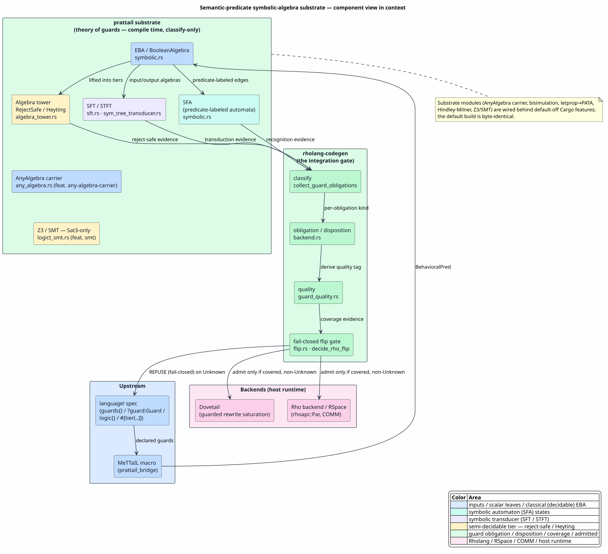

# Semantic-Predicate Symbolic Algebra Architecture

Last updated: 2026-06-22

This suite documents MeTTaIL's **semantic-predicate substrate**: the effective
Boolean algebras (EBAs), symbolic finite automata (SFAs), symbolic finite
transducers (SFTs / tree transducers), and the algebra tower that together decide
*which guarded rewrites and communications a generated language may perform* —
and how that decision travels end-to-end from a `language!` specification through
to a Rholang program executing on the F1r3node Rho machine.

The substrate is **not** the parser, **not** the Dovetail rewrite engine, and
**not** the Rho backend. It owns one thing: the *theory of guards* — how a
predicate over a language's data (its shape, its values, its behavior) is
represented as an algebra, decided, classified by decidability and quality, and
handed to the backend as fail-closed coverage evidence. Two companion suites pick
up on either side:

- [Dovetail](../dovetail/README.md) consumes guarded rewrite rules and saturates
  them; and
- [Rho-Native Integration](../rho-native-integration/README.md) lowers a covered
  language to `rhoapi::Par` and runs it on the host Rho machine.

## The one-sentence contract

`A guard is an element of an effective Boolean algebra; the substrate decides and classifies it at compile time; the backend admits the language only when every guard obligation is covered, and enforces the surviving predicate at run time by structural matching, a host where-guard, or a native join — never by re-evaluating the algebra.`

That sentence contains the suite's two load-bearing and frequently-misunderstood
facts, each given its own document:

| Misconception | Reality | Where |
|---|---|---|
| "Rholang evaluates the semantic predicate at COMM time." | The substrate runs **at compile time** and is **classify-only**. At run time the surviving predicate is enforced by RSpace structural matching, a host `where` boolean guard, or a host-routed native join — the EBA/SFT is never re-evaluated. | [08 — Runtime COMM Enforcement](08-runtime-comm-enforcement.md) |
| "The predicate framework and OSLF funding are the same thing." | They are **two distinct effective theories that compose**: a guarded COMM fires iff `guard-satisfied ∧ funded`. They share a fail-closed, tier-decidable, evidence-carrying design but answer different questions (enabled? vs. funded?). | [09 — OSLF Composition](09-oslf-composition.md) |

## Reading Paths

For principals:

1. [Executive Brief](00-executive-brief.md)
2. [Concepts and Glossary](01-concepts-and-glossary.md)
3. [Guard Syntax and Extensions](06-guard-syntax-and-extensions.md)
4. [Language-to-Rholang Integration](07-language-to-rholang-integration.md)
5. [Runtime COMM Enforcement](08-runtime-comm-enforcement.md)

For implementers:

1. [Concepts and Glossary](01-concepts-and-glossary.md)
2. [Effective Boolean Algebra](02-effective-boolean-algebra.md)
3. [Symbolic Automata (SFA)](03-symbolic-automata-sfa.md)
4. [Symbolic Transducers (SFT / STFT)](04-symbolic-transducers-sft-stft.md)
5. [Algebra Pyramid and Decidability](05-algebra-pyramid-and-decidability.md)
6. [Guard Syntax and Extensions](06-guard-syntax-and-extensions.md)
7. [Language-to-Rholang Integration](07-language-to-rholang-integration.md)
8. [Runtime COMM Enforcement](08-runtime-comm-enforcement.md)
9. [OSLF Composition](09-oslf-composition.md)
10. [Heyting Behavioral Logic](12-heyting-behavioral-logic.md)
11. [Constraint-Theory Engine (LogicT)](13-constraint-theory-engine.md)
12. [Worked Example](11-worked-example.md)

For reviewers checking claims:

1. [Formal Verification and Tests](10-formal-verification-and-tests.md)
2. [Requirements Traceability](00-requirements-traceability.md)
3. [References](references.md)
4. [Validation Script](validate.sh)

## Reader Contract

This substrate is the *theory-of-guards* layer between the language definition and
the rewrite/execution backends. A cohesive reading of every page should be:

`predicate over language data → effective Boolean algebra element → decided + classified → fail-closed coverage evidence`

Use these questions while reading:

| Question | If yes, read it as... |
|---|---|
| Is the page about predicates, `∧`/`∨`/`¬`, satisfiability, or minterms? | the **effective Boolean algebra** (EBA) core |
| Is the page about states, predicate-labeled transitions, emptiness, or determinization? | a **symbolic automaton** (SFA) |
| Is the page about input predicates producing outputs, composition, or functionality? | a **symbolic transducer** (SFT / STFT) |
| Is the page about reject-safety, Heyting, `Sat3`, or decidability tiers? | the **algebra tower** (the semi-decidable discipline) |
| Is the page about `guards { }`, obligations, dispositions, or quality? | the **`language!` → backend** integration |
| Is the page about RSpace, `where`, COMM, or `RhoNativeJoin`? | **runtime enforcement** by the host, downstream of the substrate |

## Document Map

| Document | Question answered |
|---|---|
| [00 - Executive Brief](00-executive-brief.md) | What is the semantic-predicate substrate, and what does it decide? |
| [00 - Requirements Traceability](00-requirements-traceability.md) | Where is each documentation requirement satisfied? |
| [01 - Concepts and Glossary](01-concepts-and-glossary.md) | What do EBA, SFA, SFT, tier, quality, reject-safe, and OSLF mean? |
| [02 - Effective Boolean Algebra](02-effective-boolean-algebra.md) | What is the `BooleanAlgebra` trait, what are its instances, and how are predicates decided? |
| [03 - Symbolic Automata (SFA)](03-symbolic-automata-sfa.md) | How do predicate-labeled automata recognize languages without enumerating an infinite alphabet? |
| [04 - Symbolic Transducers (SFT / STFT)](04-symbolic-transducers-sft-stft.md) | How do symbolic transducers map inputs to outputs, compose, and stay single-valued? |
| [05 - Algebra Pyramid and Decidability](05-algebra-pyramid-and-decidability.md) | How does the tower keep a semi-decidable behavioral algebra from being mistaken for a classical one, and how is the family closed under type constructors? |
| [06 - Guard Syntax and Extensions](06-guard-syntax-and-extensions.md) | What guard syntax is supported today, and what clean syntax is proposed for the features that have algebra but no surface form? |
| [07 - Language-to-Rholang Integration](07-language-to-rholang-integration.md) | How does a `language!` guard become a classified obligation, a disposition, a quality, and a fail-closed flip decision? |
| [08 - Runtime COMM Enforcement](08-runtime-comm-enforcement.md) | Once a language is dispatched, how is the surviving predicate enforced at run time — and what does Rholang itself do and not do? |
| [09 - OSLF Composition](09-oslf-composition.md) | How does the predicate algebra compose with OSLF funding at the guarded-COMM boundary? |
| [10 - Formal Verification and Tests](10-formal-verification-and-tests.md) | Which Rocq theories and tests cover each claim, and which are zero-admission? |
| [11 - Worked Example](11-worked-example.md) | How does GuardedRho's `halts`/`safe` guard travel end-to-end to a host-routed join? |
| [12 - Heyting Behavioral Logic](12-heyting-behavioral-logic.md) | Why is intuitionistic / Heyting logic the correct home for semi-decidable behavioral guards, how does bisimulation make them well-defined, and how does it complete Boolean and align with OSLF? |
| [13 - Constraint-Theory Engine (LogicT)](13-constraint-theory-engine.md) | How does the backtracking logic monad evaluate quantified predicates, adapt a domain solver into an effective Boolean algebra, and combine theories? |
| [References](references.md) | Which papers, DOIs, source files, and proofs support the suite? |

## Architecture at a Glance



PlantUML source: [figures/README.puml](figures/README.puml).

## Diagramming Choices

The pgmcp toolbox catalog reports a dedicated diagramming domain (PlantUML,
Graphviz, Mermaid, D2, Structurizr, TikZ/PGF). Per the project directive this
suite uses **PlantUML** as the default, choosing the diagram *type* that matches
each concept and *naming the actors* after the real components:

| Concept | Diagram type | Why |
|---|---|---|
| SFA recognition | **state-transition diagram** (states + predicate-labeled edges) | an automaton *is* a labeled transition system; a box diagram cannot show predicate guards on edges |
| SFT / STFT transduction | **transducer state diagram** (input-predicate `/` output-term edges) + composition pipeline | a transducer edge carries both a guard and an output; composition is a left-to-right pipeline |
| algebra tower | **class/inheritance diagram** + a **Hasse lattice** | the tower is a trait refinement; the strength order is a lattice |
| closure family | **component tree** | each closure constructor is itself an algebra over sub-algebras |
| end-to-end integration | **sequence diagram** with actors = `language!` author · macro · prattail `PredicateParser` · substrate · Rho backend · flip gate | the integration is a temporal handoff across named components |
| runtime COMM enforcement | **sequence diagram** (process · RSpace · native-join handler · continuation) | enforcement is a runtime interaction; the figure shows *where* each predicate class is gated |
| OSLF composition | **two-lane activity diagram** (logic axis and resource axis converging on a guarded COMM) | two independent decisions converge on one COMM-fires verdict |
| obligation to disposition to quality | **activity / decision tree** | classification is a literal decision cascade ending in a flip verdict |

The suite uses a consistent per-concept color legend:

| Color | Concept |
|---|---|
| blue `#DBEAFE` | inputs / scalar leaves / classical (decidable) EBA |
| teal `#CCFBF1` | symbolic automaton (SFA) states |
| violet `#EDE9FE` | symbolic transducer (SFT / STFT) |
| amber `#FEF3C7` | the semi-decidable tier — reject-safe / Heyting / behavioral (the "caution" color) |
| green `#DCFCE7` | guard obligation / disposition / coverage / admitted |
| indigo `#E0E7FF` | OSLF funding / formal evidence |
| pink `#FCE7F3` | Rholang / RSpace / COMM / host runtime |

## Core Contract

The substrate treats every guard as an element of an **effective Boolean
algebra** `𝓐 = (Φ, D, ⟦·⟧, ⊤, ⊥, ∧, ∨, ¬, sat, witness)`: a set of predicates
`Φ` over a domain `D`, a denotation `⟦φ⟧ ⊆ D`, the Boolean operations, a
satisfiability decision, and a witness generator. Because every automaton
algorithm (emptiness, intersection, complement, determinization, composition,
pre-/post-image, functionality) is written **once** against this abstract
interface, generalizing the framework "over all data types" is *completing the
family of algebra instances and closing it under type constructors* — not
rewriting the automata ([D'Antoni & Veanes, 2017](references.md#dantoni-veanes-2017)).

The central design discipline is the **algebra tower**: structural predicates
(over the shape of data) are decided exactly and are classical; behavioral
predicates (over the dynamics — reachability, modal/temporal properties) are only
semi-decidable, so their complement is unsound to treat classically. The tower
encodes that as a compile-time type guarantee — see
[05](05-algebra-pyramid-and-decidability.md).

The central integration discipline is **fail-closed coverage**: a language
adopts the Rho backend only when every guard obligation it induces is covered by
a compatible, non-`Unknown`-quality disposition. At run time the *surviving*
predicate is enforced by the host, not by the substrate — see
[07](07-language-to-rholang-integration.md) and
[08](08-runtime-comm-enforcement.md).

## Relation To Other Subsystems

| Subsystem | Relationship |
|---|---|
| `language!` macro | Upstream source of guard declarations (`guards { }`, `?guard:Guard`); the substrate consumes the generated `GuardConfig` / `BehavioralPred`. |
| `prattail` crate | Owns the entire substrate: `symbolic.rs` (EBA + SFA), `sft.rs` / `sym_tree_transducer.rs` (SFT / STFT), `algebra_tower.rs` (tower), the closure family, `presburger.rs`, `behavioral_algebra.rs`, `any_algebra.rs`. |
| `rholang-codegen` | Downstream consumer: `backend.rs` collects obligations and runs the coverage gate; `guard_quality.rs` derives the quality tag; `flip.rs` makes the fail-closed flip decision. |
| Dovetail | Consumes covered guarded rewrite rules and saturates them; pure-structural obligations may be discharged by exact-key semantics. |
| Rho backend / F1r3node | Lowers a covered language to `rhoapi::Par` and enforces the surviving guard at run time (RSpace match / `where` / native join). |
| `rigail` | Provides only semirings/weights for the weighted-automata path; it owns **no** predicate-algebra code. |

## Local Validation

Run the suite documentation checks from the repository root:

```text
docs/architecture/semantic-predicates/validate.sh
```

Run the formal-verification gates under the 32 GiB RSS cap:

```text
make -C formal check-capped FORMAL_CAPPED_TARGET=rocq-symbolic-algebra
make -C formal check-capped FORMAL_CAPPED_TARGET=rocq-sft
make -C formal check-capped FORMAL_CAPPED_TARGET=rocq-critical-zero-admission
```
