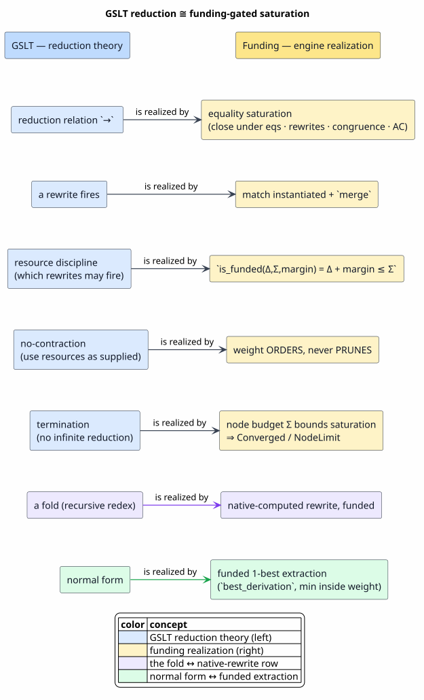
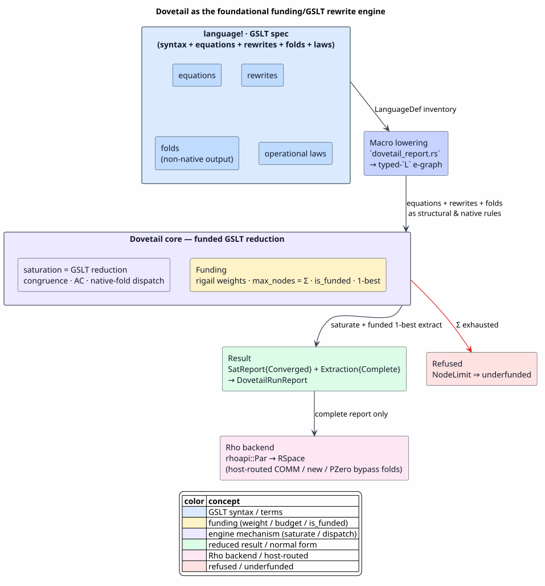
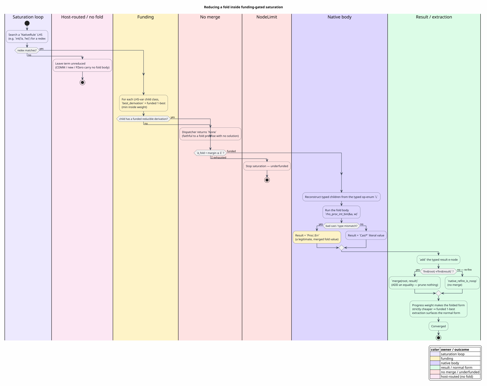
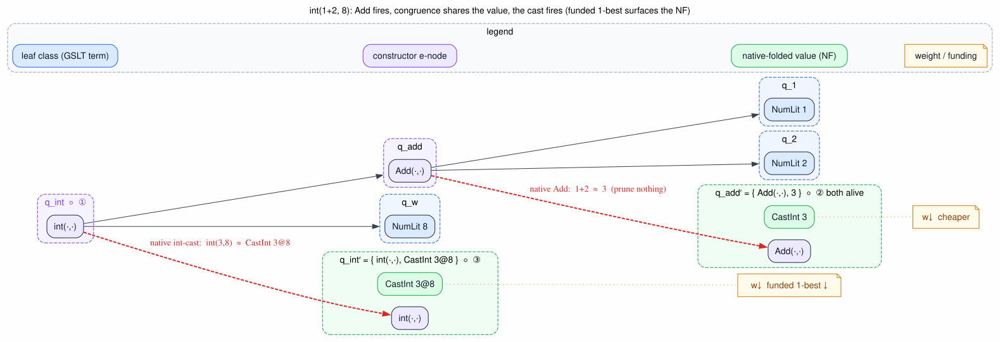

# Dovetail as the Foundational OSLF/GSLT Rewrite Engine — Native Fold Reduction

**Status:** design + staged implementation (2026-06-17).
**Branch:** `feature/wfst-architecture`.
**Supersedes:** the recursive-`try_direct_eval` fold approach (red-teamed + rejected) and the
reify-map Dovetail variant (red-teamed + rejected as unsound). See §8.

---

## Terms used in this document

Every symbol, acronym, and key term, defined (or linked to its glossary entry) before use.
**[G-DT]** = defined in the Dovetail glossary
([`docs/architecture/dovetail/01-concepts-and-glossary.md`](../../architecture/dovetail/01-concepts-and-glossary.md));
**[G-RN]** = defined in the Rho-native glossary
([`docs/architecture/rho-native-integration/01-concepts-and-glossary.md`](../../architecture/rho-native-integration/01-concepts-and-glossary.md));
**[NEW]** = defined inline here.

| Term / symbol | Definition | Source |
|---|---|---|
| Dovetail | The standalone MeTTaIL rewrite-engine crate (`dovetail/`); here cast as the foundational OSLF/GSLT engine. | [G-DT] |
| `language!` | The macro declaring a language's categories, syntax, equations, rewrites, **folds**, guards; expands to `LanguageDef`. | [G-DT] |
| **GSLT** | *Generalized Syntax/Law Theory*: a language definition = syntax + equations + rewrites + operational laws. Dovetail's saturation **is** its reduction relation. | **[NEW]** §2.1 |
| **OSLF** | *Ordered Linear-Substructural Funding*: the cost/resource discipline governing which rewrites may fire. | **[NEW]** §2.2 |
| `Δ` (demand) | The cost a candidate transition would consume. | **[NEW]** §2.2 |
| `Σ` (supply) | The budget available — here the e-graph node budget `EGraphConfig::max_nodes`. | **[NEW]** §2.2 |
| `margin` | A non-negative reserve added to demand before the funding check. | **[NEW]** §2.2 |
| `is_funded(Δ, Σ, margin)` | The OSLF funding predicate `Δ + margin ≤ Σ`. | **[NEW]** §2.2 |
| the four OSLF laws | `sound`, `reject-underfunded`, `supply-monotone`, `decidable` — the obligations on `is_funded`, discharged in `MettaOslfLawsConformance.v`. | **[NEW]** §2.2 |
| e-graph / e-class / e-node | An equality graph; an equivalence class of equal terms (id `EClassId`); a labeled operator over child **e-classes**. | [G-DT] |
| `Subst` / `σ` | A match's bindings `variableName ↦ EClassId`. | [G-DT] |
| saturation | Iterative growth of the equality graph until no new equality arises or a bound stops it. | [G-DT] |
| congruence closure | Equal children `⇒` same-operator parents are equal. | [G-DT] |
| AC | Associative-commutative operator (unordered, flatly-nested children — e.g. `\|`, bags). | [G-DT] |
| `ContentKey` / exact key | A byte-stream identity: equality is byte equality, not a finite hash. | [G-DT] |
| `SemanticHash` | The trait whose contract is `write_content(x)=write_content(y) ⇔ x≈y`. | [G-DT] |
| inside weight | The aggregate semiring weight of all derivations rooted at an e-class. | [G-DT] |
| semiring | An algebra `(⊕, ⊗, 0̄, 1̄)` ordering derivations. | [G-DT] |
| tropical (min-plus) weight | The semiring `(min, +, +∞, 0)` making "cheapest derivation" well-defined. | **[NEW]** §2.2 |
| **rigail** | Dovetail's weight-algebra module (semirings + Newton SCC solver) realizing OSLF cost. | **[NEW]** §2.2 |
| WTA | Weighted tree automaton: e-classes as states, e-nodes as weighted transitions. | [G-DT] |
| `best_derivation(class)` | The funded 1-best extraction: the minimum-inside-weight derivation of an e-class. | **[NEW]** §4 |
| native-computed rewrite | A rewrite whose RHS is *computed* by a trusted function, not by instantiating a pattern. | **[NEW]** §3 |
| `NativeOpId` | A `u32` tag naming one generated native transition (keeps rules plain-data). | **[NEW]** §3 |
| dispatcher | `&dyn Fn(NativeOpId, &mut EGraph<L>, &Subst) -> Option<EClassId>`: the one compiled-in escape that runs native bodies. | **[NEW]** §3 |
| funded transition | A rewrite whose firing is gated by `is_funded`: weight orders it, budget bounds it. | **[NEW]** §2.2 |
| typed op-enum `L` | The generated per-language enum (e.g. `ProcOp{IntBinProc, NumLit(i64), CastInt, …}`) the e-graph carries so literals are lossless and fold bodies run on typed children. | **[NEW]** §3 |
| fold | A rule computing an output by recursively reducing children, then running a Rust body (here: numeric casts/arith on `Proc`). | **[NEW]** §1 |
| redex / normal form (NF) | A reducible subterm (matches a rule LHS); a term with no remaining redexes. | **[NEW]** §1 |
| native-output vs non-native-output fold | A fold whose result category is a primitive native type vs an object-language category (`Proc`). | **[NEW]** §1 |
| substructural / no-contraction | The structural-logic property "an assumption is used as supplied, never freely duplicated"; here, "weight orders, never prunes". | **[NEW]** §2.2 |
| disposition / `NativeFoldLowered` | The classification of how a rule is covered; this doc adds a 4th, `NativeFoldLowered`. | [G-DT] / **[NEW]** §6 |
| `try_direct_eval` | A language's optional native-eval hook; empty for a non-native primary type. | **[NEW]** §1 |
| `delta_sigma` | The verified funding-accounting component (`LinearLogicResources.v`, `RhoCallByNeedBudget.v`). | **[NEW]** §6 |
| Ascent | The legacy generated Datalog rewrite backend (the `fold_proc` relation lived here; retired in P6). | [G-DT] |

---

## 1. Motivation and problem

Dovetail is, by intended design, **the substrate-neutral rewrite engine for MeTTaIL
semantics** (epic `dovetail-gslt-reduction-engine-f1r3node-target`). The Ascent retirement
(campaign phase P6) removed the legacy Datalog rewrite backend, exposing the **fold fragment**
as the one reduction class still evaluated outside Dovetail.

A **fold** rule computes its result by recursively reducing its children to normal form, then
running a Rust body. RhoCalc's numeric casts are the canonical example
(`languages/src/rhocalc.rs`):

```text
IntBinProc . a:Proc, w:Int |- "int" "(" a "," w ")" : Proc ![{ rho_proc_int_bin(&a, w) }] fold;
```

We distinguish, crucially:

- a **native-output fold** — result category is a primitive native type (e.g. `… : Int`).
  These still reduce, via the generated `try_eval`/`try_fold_to_literal` methods.
- a **non-native-output fold** — result category is an object-language category, `Proc`.
  RhoCalc's casts/arith/comparisons/collection-ops are all `… : Proc`. Their `![{…}]` bodies
  (`numeric_dispatch.rs::rho_proc_*`, `calc_*`) were emitted **only** into Ascent's `fold_proc`
  relation. After P6, those bodies are **dead** and these terms reduce **nowhere**: the
  generated Dovetail compiler lowers only `equations` + `rewrites`, never folds, and
  `try_direct_eval` is empty for a language whose primary type (`Proc`) has no native type.

**Ground truth** (the retired relation, preserved in `target/generated/rhocalc/rhocalc-datalog.rs`):
- *Base case* — a literal / already-`Cast*` / structural `Proc` folds to **itself**.
- *Recursive redex* — `fold_proc(IntBinProc(l,w)) ⇐ fold_proc(l, lv) ∧ fold_int(w, rv) ∧
  rho_proc_int_bin(&lv, rv)`: **each child is folded first**; a variable/stuck child has no
  solution, so the fold does not fire.
- *Termination invariant* — a fold result is always a `Cast*` literal, which carries **no fold
  body**, so a fold output can never re-match a fold LHS (no unbounded reduction; cf. the
  rewriting-theory notions of redex and normal form, Baader & Nipkow [BAADER-NIPKOW-1998]).

**Thesis.** A fold is an **OSLF-funded GSLT rewrite**. It must reduce *inside* Dovetail's
funded saturation, like every other rewrite — not on a private, unfunded side-path.

## 2. Theory

### 2.1 GSLT — the reduction relation

A **GSLT** (Generalized Syntax/Law Theory) is a language definition: a syntax, a set of
equations, a set of rewrite rules, and operational laws. Its **reduction relation** `→` is
generated by orienting rewrites left-to-right and closing under the equations and under
**congruence** (Nelson & Oppen [NELSON-OPPEN-1980]): if `a → b` then `f(…, a, …) → f(…, b, …)`.
The reflexive-transitive closure `→*` reduces a term to a **normal form**.

Dovetail computes `→*` by **equality saturation** (Tate et al. [TATE-EQSAT-2009]; Willsey et al.
[EGG-2021]): it grows an e-graph by repeatedly applying every rule to every match and
**merging** the result class with the matched class, plus AC matching, until a fixpoint or a
bound. Saturation never deletes a representation — it only *adds equalities* — so the e-graph
holds every reduct simultaneously, and extraction selects one. **Saturation is `→*`.**

### 2.2 OSLF — the funding discipline

**OSLF** (Ordered Linear-Substructural Funding) is the cost discipline deciding *which*
rewrites may fire. For a candidate transition with **demand** `Δ`, **supply** `Σ`, and reserve
`margin`, the funding predicate is

```text
is_funded(Δ, Σ, margin)  =  (Δ + margin ≤ Σ)
```

discharged by the verified `delta_sigma` and proven to satisfy four laws
(`MettaOslfLawsConformance.v`): `sound` (`funded ⇔ Σ ≥ Δ + margin`), `reject-underfunded`
(positive demand vs zero supply is refused), `supply-monotone` (more supply never un-funds — a
*no-contraction* property), and `decidable` (a verdict always exists). The **substructural**
reading (Girard, "Linear Logic" [GIRARD-1987]) is that resources are used *as supplied*, never
freely duplicated.

Dovetail realizes OSLF directly:

- **weight = cost.** The `rigail` module provides the **semiring** `(⊕, ⊗, 0̄, 1̄)` and the
  **tropical / min-plus** weight `(min, +, +∞, 0)` (Mohri [MOHRI-2002]) over which the **inside
  weight** of an e-class is computed (with a Newton SCC solver for cycles); the lazy best-first
  extractor enumerates derivations in non-decreasing weight order (Huang & Chiang
  [HUANG-CHIANG-2005]).
- **weight ORDERS, never PRUNES.** Equal-weight distinct alternatives both survive; a derivation
  is dropped only when its composed weight `is_zero()`. This *is* the substructural
  no-contraction law.
- **budget = supply `Σ`.** The node budget `EGraphConfig::max_nodes` bounds saturation; an add
  that would exceed it is refused (`NodeLimit`), i.e. `is_funded(Δ, Σ, margin)` fails.

### 2.3 The correspondence

The two specifications are the same engine seen from the syntax side (GSLT) and the resource
side (OSLF):

> 

`→` is saturation; a rewrite firing is a match-and-`merge`; the resource discipline is
`is_funded`; no-contraction is "weight orders, never prunes"; **termination** is the node
budget `Σ` bounding saturation to `Converged`/`NodeLimit`; a **normal form** is the funded
1-best extraction. A **fold** is the one remaining row to realize — a native-computed rewrite,
funded like the rest.

## 3. Architecture

Dovetail sits at the center of the pipeline, with the macro lowering a GSLT into the engine and
the Rho backend lowering the engine's reduced semantics into Rholang/RSpace:

> 

**Typed `L` substrate.** The production e-graph today is `EGraph<String>` — op labels plus
literal leaves stringified via lossy `{:?}` Debug, with no inverse back to a typed term. To run
a *typed* fold body inside saturation we let the e-graph carry a **generated typed op-enum `L`**
per language, with literals in the node:

```rust
// generated per language (illustrative; real variants enumerate every Proc constructor):
enum ProcOp { IntBinProc, NumLit(i64), CastInt, /* … */ }
```

`EGraph<L>`/`RewriteRule<L>`/`Extractor` require only `L: Clone + Eq + Hash + SemanticHash`
(`+ Display` for the runtime projection), and the engine and the
`NBestExtraction`/`EnumerationCompleteness`/`InsideWeightSccClosure` proofs are **generic over
`L`** (every `op.as_str()` is `#[cfg(test)]`). So the engine layer is untouched; the cost is
concentrated in the codegen lowering + the runtime report projection. With literals in the
node, reconstruction is **total and lossless** — no reify map (the red-team showed a reify map
is unsound under `merge`; §8).

## 4. Mechanism

A **native-computed rewrite** names, by an opaque `NativeOpId` tag, a generated transition. The
rule data stays plain-old-data (`Clone + Debug`, serializable — the "rules are DATA" doctrine);
the one compiled-in escape is a per-language **dispatcher**:

```rust
pub type NativeOpId = u32;
pub struct NativeRule<L> { pub lhs: Pattern<L>, pub op: NativeOpId, pub label: Option<String> }
// dispatcher: &dyn Fn(NativeOpId, &mut EGraph<L>, &Subst) -> Option<EClassId>
```

### Algorithm `SATURATE-WITH-NATIVE-DISPATCH`

Literate description (Knuth-style): saturation runs each structural rule exactly as before, then
each native rule. *For a structural rule*, instantiate the pattern RHS and merge. *For a native
rule*, ask the dispatcher to compute a result class and merge it. Both only **add** an equality.

```text
SATURATE-WITH-NATIVE-DISPATCH(rules, native_rules, dispatch, max_iters):
  for iteration in 0 .. max_iters:
    merges ← 0
    for rule in rules:                                  # ── structural ──
      for (root, σ) in search(rule.lhs):
        rhs ← instantiate(rule.rhs, σ)                  # build the pattern RHS
        if find(root) ≠ find(rhs): merge(root, rhs); merges ← merges + 1
      if any merged: rebuild()                          # restore congruence
      if node_budget_exceeded: return NodeLimit         # ¬ is_funded(Δ, Σ, margin)
    for nrule in native_rules:                          # ── native (fold) ──
      for (root, σ) in search(nrule.lhs):
        match dispatch(nrule.op, egraph, σ):            # compute the RHS
          Some(result): if find(root) ≠ find(result): merge(root, result); merges ← merges + 1
          None:         pass                            # var/stuck child ⇒ no fold (premise unmet)
      if any merged: rebuild()
      if node_budget_exceeded: return NodeLimit
    if merges = 0: return Converged                     # fixpoint
  return IterationLimit
```

### Algorithm `APPLY-NATIVE-FOLD` (the dispatcher arm)

```text
APPLY-NATIVE-FOLD(op = int-cast, egraph, σ):
  a_class ← σ["a"];  w_class ← σ["w"]
  a ← reconstruct( best_derivation(a_class) )           # funded 1-best (OSLF selection)
  w ← reconstruct( best_derivation(w_class) )           # — children already folded
  if a is None or w is None: return None                # stuck / variable child ⇒ premise unmet
  result_term ← rho_proc_int_bin(&a, w)                 # the user fold body (revived); may be Proc::Err
  return Some( add(egraph, result_term) )               # add the typed result; saturate merges it
```

Because `L` is typed, `reconstruct` is total and lossless. The fold body operates on
fully-reduced children (the funded 1-best of each child class), exactly as Ascent's `fold_proc`
premises supplied folded children. The end-to-end control flow:

> 

**Progress weight.** Extraction must surface the *reduced* form. A native-fold result (a `Cast*`
literal) is given a **strictly lower** weight than its redex, so the funded 1-best extraction
selects the normal form — itself an act of OSLF funding (choosing the lower-cost derivation).

**Report wiring.** The native gate (`complete_native_dovetail_report_for_language`) becomes
**non-fatal**: a `Proc` fold reduces through `saturate_with_native` + extraction; a
`DirectEvaluationUnavailable` from the empty `try_direct_eval` falls through to saturation
rather than erroring. Host-routed COMM/`new`/`PZero` carry no fold body, so no fold LHS matches
them and they stay unreduced.

## 5. Worked examples

The nested cast `int(1+2, 8)` is the centerpiece — it requires the inner `Add` to fold *before*
the cast, which saturation + congruence drive automatically:

> 

| Input | Outcome | What it shows |
|---|---|---|
| `int(7, 64)` | `CastInt 7` | a single cast fold fires |
| `int(1+2, 8)` | `CastInt 3` | **saturation recursion**: `Add` fires, congruence shares `3`, the cast fires |
| `int(x, 8)` (`x` free) | unchanged | a variable child ⇒ `reconstruct = None` ⇒ no fold (premise unmet) |
| `int("abc", 8)` | `Proc::Err` | a *bad cast* folds to the legitimate `Err` value (the child folds, the body rejects) |
| `"0"` ( = `CastInt 0`) | unchanged | a normal literal matches no fold LHS — the host-routing guard stays green |

## 6. Formal bridge (zero-admission)

- **`GeneratedReportCompiler.v`** gains a fourth disposition `NativeFoldLowered` (a native RHS
  is not a `Pattern→Pattern` rewrite), carrying the single requirement `ReqExactContentKey` (the
  result is added through the exact-key path); the classification theorems extend with a total
  `destruct` that closes the new case by `reflexivity`.
- A named **native-function soundness axiom**: `rho_proc_int_bin(a, w)` *is* the GSLT value of
  `int(a, w)`. This is the *one* trust boundary the hand-written numeric Rust lives behind — the
  same boundary native eval already relied on, now named honestly rather than hidden.
- **`DovetailSaturation.v`**: a native equality is a `good` generated fact, so
  `saturate_step_sound`/`_monotone` extend with the soundness hypothesis explicit, plus
  `native_refire_is_noop` (a re-fired fold merges nothing). The **OSLF-funding bridge**: a fold
  transition is funded iff `Δ_fold + margin ≤ Σ`, composing with `RhoCallByNeedBudget.v` and the
  `delta_sigma` funding laws.
- **Unaffected** (provenance-blind, generic over `L`): `NBestExtraction.v`,
  `EnumerationCompleteness.v`, `InsideWeightSccClosure.v` take the node set as given.

## 7. Implementation increments (each green + committed)

1. **Engine native-RHS + funding hook** (`dovetail/src/rules.rs`): `NativeRule<L>` +
   `NativeOpId` + `saturate_with_native(rules, native, dispatch, max_iters)`, with `saturate`
   delegating. Additive — existing rules + callers unchanged. **(Done, commit `4925010d`.)**
2. **Typed `L` codegen** (`dovetail_report.rs`): the per-language typed op-enum + its
   `SemanticHash`/`Display`; migrate the lowering + report projection off String labels.
3. **`lower_fold`**: emit each non-native-output fold as a native rule + dispatcher arm calling
   the typed body; non-fatal native gate. Revives `rho_*`/`calc_*`.
4. **OSLF funding** wired as the fold-transition weight + the budget-as-`Σ` bridge + the
   progress weight.
5. **Rocq**: `NativeFoldLowered` disposition + the native-soundness axiom + the
   saturation/funding bridge.
6. **Tests**: §5 matrix + `Converged` + extraction surfaces the folded form + 0 dead-code
   (`rg 'never used.*rho_'`).

## 8. Rejected alternatives

- **A — recursive `try_fold_to_self` method:** a reduction path *outside* Dovetail; not
  OSLF-funded, not a GSLT rewrite in the engine; contradicts Dovetail's foundational role and
  leaves a second, unfunded reduction semantics to maintain as grammars grow.
- **B — Dovetail + reify-map:** UNSOUND. A fold merges `redex == value` into one class, so a
  side table keyed by `EClassId` (`reify[find(class)]`) is ambiguous between the redex spine and
  the value, and the `ContentKey` tiebreak is unstable across `rebuild`.
- These were the red-team's findings; **C (typed-`L`)** is the principled survivor — the one
  realization in which "Dovetail is the foundational OSLF/GSLT rewrite engine" is literally true.

## References

DOIs verified against the publisher registry; entries reused from / added to
[`docs/architecture/dovetail/references.md`](../../architecture/dovetail/references.md).

- **[EGG-2021]** Willsey, Nandi, Wang, Flatt, Tatlock, Panchekha. "egg: Fast and Extensible
  Equality Saturation." *Proc. ACM Program. Lang.* 5 (POPL), 2021.
  DOI: [10.1145/3434304](https://doi.org/10.1145/3434304).
- **[TATE-EQSAT-2009]** Tate, Stepp, Tatlock, Lerner. "Equality saturation: a new approach to
  optimization." POPL 2009, pp. 264–276.
  DOI: [10.1145/1480881.1480915](https://doi.org/10.1145/1480881.1480915).
- **[NELSON-OPPEN-1980]** Nelson, Oppen. "Fast Decision Procedures Based on Congruence Closure."
  *J. ACM* 27(2), 1980, pp. 356–364.
  DOI: [10.1145/322186.322198](https://doi.org/10.1145/322186.322198).
- **[GIRARD-1987]** Girard. "Linear Logic." *Theoretical Computer Science* 50(1), 1987,
  pp. 1–101. DOI: [10.1016/0304-3975(87)90045-4](https://doi.org/10.1016/0304-3975(87)90045-4).
- **[BAADER-NIPKOW-1998]** Baader, Nipkow. *Term Rewriting and All That.* Cambridge University
  Press, 1998. ISBN 978-0-521-77920-3 (no DOI).
- **[MOHRI-2002]** Mohri. "Semiring Frameworks and Algorithms for Shortest-Distance Problems."
  *Journal of Automata, Languages and Combinatorics* 7(3), 2002, pp. 321–350 (no registered DOI;
  ACM DL record 10.5555/639508.639512).
- **[HUANG-CHIANG-2005]** Huang, Chiang. "Better k-best Parsing." IWPT 2005.
  ACL Anthology: [W05-1506](https://aclanthology.org/W05-1506/) (no DOI).
