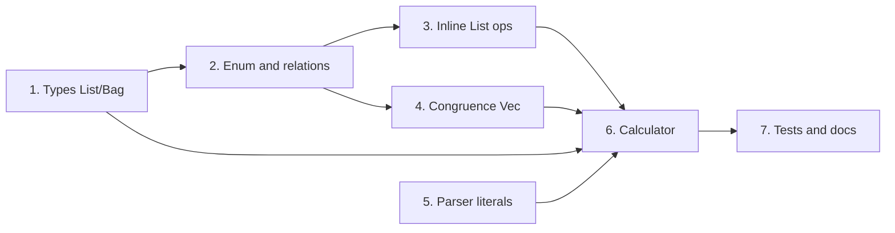

# Implementation Plan: Lists and Bags

**Design refs:** [lists-and-bags-support.md](lists-and-bags-support.md), [bag_as_hashmap_and_direct_list_ops_9bbcfdb9.plan.md](bag_as_hashmap_and_direct_list_ops_9bbcfdb9.plan.md). **Constraint (addendum):** No new runtime types; List = `Vec<Proc>` with inline ops; Bag = `HashBag<Proc>` only.

---

## 1. Types section: List and Bag categories

**Selected: Option A (minimal).**

**Goal:** Languages can declare List and Bag as categories backed by `Vec<Proc>` and `HashBag<Proc>` using existing native-type syntax.

- Use existing `![syn::Type] as Name` syntax. In Calculator, add `![Vec<Proc>] as List` and `![mettail_runtime::HashBag<Proc>] as Bag`.
- Verify [macros/src/ast/language.rs](../../macros/src/ast/language.rs) `parse_types` and `LangType.native_type` (currently `syn::Type`) parse `Vec<Proc>` and `HashBag<Proc>` (with or without full path). If parsing fails for these generic types, extend the parser only as needed for this form (Option B remains fallback).
- **Delimiter config (deferred):** Parameterised delimiters for list/bag literals can be added later; first cut uses fixed or grammar-driven delimiters if needed.

**Output:** Calculator (and any test language) can declare `List` and `Bag` in `types { ... }` with representation `Vec<Proc>` and `HashBag<Proc>`.

---

## 2. Macro: enum and relation generation for List/Bag

**Goal:** Generated code has List and Bag as category enums with correct payload types and relations.

- In [macros/src/gen/types/enums.rs](../../macros/src/gen/types/enums.rs): ensure categories whose native type is `Vec<Proc>` (or `Vec<_>`) get an enum variant with `Vec<Proc>`; same for `HashBag<Proc>` and Bag. Reuse or mirror the existing logic for collection types in constructors (e.g. `CollectionType::Vec` / `HashBag`).
- Generate `list`, `eq_list`, `rw_list` and `bag`, `eq_bag`, `rw_bag` relations (same pattern as `float`, `eq_float`, `rw_float`). [macros/src/logic/relations.rs](../../macros/src/logic/relations.rs) and equation/congruence wiring in [macros/src/logic/equations.rs](../../macros/src/logic/equations.rs) and related.
- Ensure [macros/src/gen/term_ops/subst.rs](../../macros/src/gen/term_ops/subst.rs) and [macros/src/gen/term_ops/normalize.rs](../../macros/src/gen/term_ops/normalize.rs) traverse `Vec` and `HashBag` when they appear as List/Bag category payloads (same traversal as for collection fields in constructors).

**Output:** A language that declares List and Bag gets a generated enum with List/Bag variants, and relations + substitution/normalize that handle them.

---

## 3. Inline List ops (language-authored)

**Selected: Option 3a (language-authored inline).**

**Goal:** List operations (concat, len, elem_at, delete_at) are implemented as inline Vec code in term rust blocks, not a list trait. No macro expansion for list ops.

- Term rust blocks in Calculator (and docs) explicitly use Vec code. No macro change beyond supporting List/Bag as categories (step 2).
- **Inline snippets to use in rust blocks (addendum):** concat = `{ let mut o = a.clone(); o.extend(b.iter().cloned()); o }`; delete_at = clone list + `remove(i)`; elem_at = `a.get(i).cloned()`; len = `a.len()` (wrapped in Int constructor as needed).
- **Future:** Option 3b (macro-expanded helpers like `list_concat(a, b)`) can be added later if desired.

**Output:** List terms in Calculator use Vec directly in their rust blocks; no new runtime list type or trait.

---

## 4. Congruence: Vec branch for List

**Goal:** Rewrites propagate into list elements (Option A); congruence generator supports Vec-backed collections.

- In [macros/src/logic/congruence.rs](../../macros/src/logic/congruence.rs), extend collection congruence so that when the collection type is **Vec** (not HashBag), generated code:
  - Iterates by index over the Vec.
  - For each index, assumes the element rewrites; rebuilds a new Vec with the rewritten element at that index (clone, replace at index, no `remove`/`insert_into`).
- Reuse existing `RewriteContext::Collection` and constructor/element detection; add a branch on `CollectionType::Vec` vs `HashBag` (or on the payload type inferred from the category). HashBag path stays as today (`bag.iter()`, `remove`, `insert_into_*`).

**Output:** Congruence rules for List (Vec) and Bag (HashBag) both generated; rewrites allowed in all list/bag element positions.

---

## 5. Parser / literals for List and Bag (optional for first cut)

**Goal:** List and Bag literals (e.g. `[ a, b, c ]`, `{ x:2, y:1 }`) parse into List/Bag categories.

- If literals are required for the first release: in [macros/src/gen/syntax/parser/prattail_bridge.rs](../../macros/src/gen/syntax/parser/prattail_bridge.rs) (and PraTTaIL spec), add or parameterise rules so that:
  - A list literal uses open/close/sep (e.g. `[`, `]`, `,`) and produces a `List` (Vec) of parsed elements.
  - A bag literal uses `{`, `}`, and element:count pairs and produces a `Bag` (HashBag).
- Delimiter source can be fixed defaults first; type-level delimiter config (e.g. from types section) can follow.
- If literals are deferred: skip this step; list/bag terms are built only via constructors (e.g. AppendList, UnionBag) and explicit term rules.

**Output:** (If implemented) Parsing list and bag literals into List/Bag categories; otherwise document as follow-up. **Status:** Deferred — list literal `[ a, b, c ]` would require the parser/trampoline to wrap a Collection capture in `List::Lit(vec)` when the rule category is List; bridge already resolves `*sep(elements, ",")` for param type List via native type Vec.

---

## 6. Calculator: List and Bag types and terms

**Goal:** Calculator has List and Bag with the agreed semantics and ops.

- **Types:** Add `List` and `Bag` to Calculator's `types { ... }` using Option A syntax: `![Vec<Proc>] as List` and `![mettail_runtime::HashBag<Proc>] as Bag`.
- **Terms (list):** AppendList (concat), LenList, ElemList (index), DeleteList (delete_at); rust blocks use **language-authored inline Vec ops** (3a).
- **Terms (bag):** UnionBag, DeleteBag (remove one), DiffBag; rust blocks use `HashBag` API (`union`, `remove_one`, `diff`) per addendum.
- **GetType:** Extend to return `"List"` and `"Bag"` for List/Bag values.
- **Proc casts:** Per main doc (error-free; e.g. List/Bag → Float/Int as needed).
- **Congruence:** Declare congruence rules so that rewrites propagate through List and Bag constructors (should be generated once step 4 is done).
- **Index semantics:** ElemList/DeleteList 0-based; panic if out of bounds. DeleteBag removes one occurrence; bag_diff no negative counts.

**Files:** [languages/src/calculator.rs](../../languages/src/calculator.rs).

**Output:** Calculator builds and reduces list/bag terms; GetType and Proc casts behave as specified.

---

## 7. Tests and documentation

**Tests:**
- **Macro:** Add or extend tests for List/Bag enum and relation generation; for congruence with Vec (list) and HashBag (bag); for substitution/normalize over List/Bag. [macros/src/ast/tests.rs](../../macros/src/ast/tests.rs) or existing macro test layout.
- **Integration:** In [languages/tests/calculator.rs](../../languages/tests/calculator.rs) (or equivalent): parse and reduce list/bag terms (e.g. append list, union bag, len, elem_at, delete_at, delete bag, diff); assert GetType for List/Bag; optionally test list/bag literals if step 5 is done.

**Documentation:**
- Update [lists-and-bags-support.md](lists-and-bags-support.md): state that Bag is **HashBag** (no wrapper) and List uses **Vec with inline ops** (no wrapper), per addendum; align "Representation and semantics" and "Built-in vs user-defined" with the actual implementation.
- If a macros/guide doc exists: document that List/Bag are declared via e.g. `![Vec<Proc>] as List` and `![HashBag<Proc>] as Bag`, and that List ops are inline Vec in term blocks (no list trait).

**Output:** Green tests; design and macros docs aligned with implementation.

---

## Order and dependencies

- **1 → 2:** Enum/relation codegen needs List/Bag as declared categories.
- **2 → 3, 2 → 4:** Inline list ops and congruence use the same category/type info.
- **1, 3, 4 → 6:** Calculator depends on types, codegen, and congruence. **5** can run in parallel or after 2 if literals are in scope.
- **6 → 7:** Tests and docs after Calculator (and optional parser) are in place.

---

## Summary

| Step | What | Key files |
|------|------|-----------|
| 1 | Types section: List/Bag as Vec/HashBag | macros/src/ast/language.rs |
| 2 | Enum + relations + subst/normalize for List/Bag | macros/src/gen/types/enums.rs, macros/src/logic/relations.rs, term_ops |
| 3 | Inline List ops — 3a: language-authored Vec in rust blocks | Calculator term blocks (no macro change) |
| 4 | Congruence Vec branch | macros/src/logic/congruence.rs |
| 5 | Parser list/bag literals (optional) | macros/src/gen/syntax/parser/prattail_bridge.rs |
| 6 | Calculator List/Bag types and terms | languages/src/calculator.rs |
| 7 | Tests + docs | languages/tests/calculator.rs, docs/design/exploring/lists-and-bags-support.md |

No runtime crate changes; all work in macros and languages (and optional parser).
