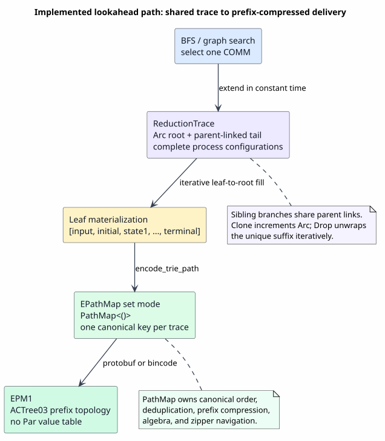
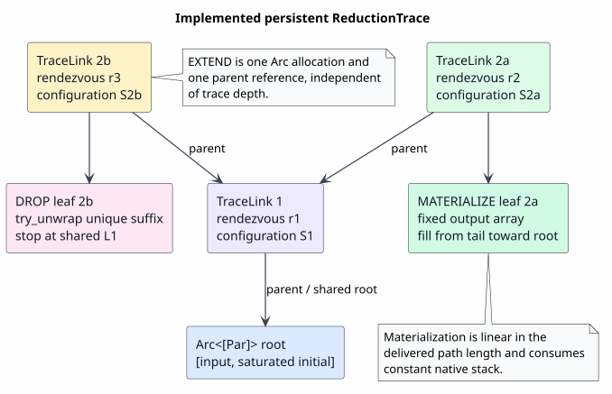
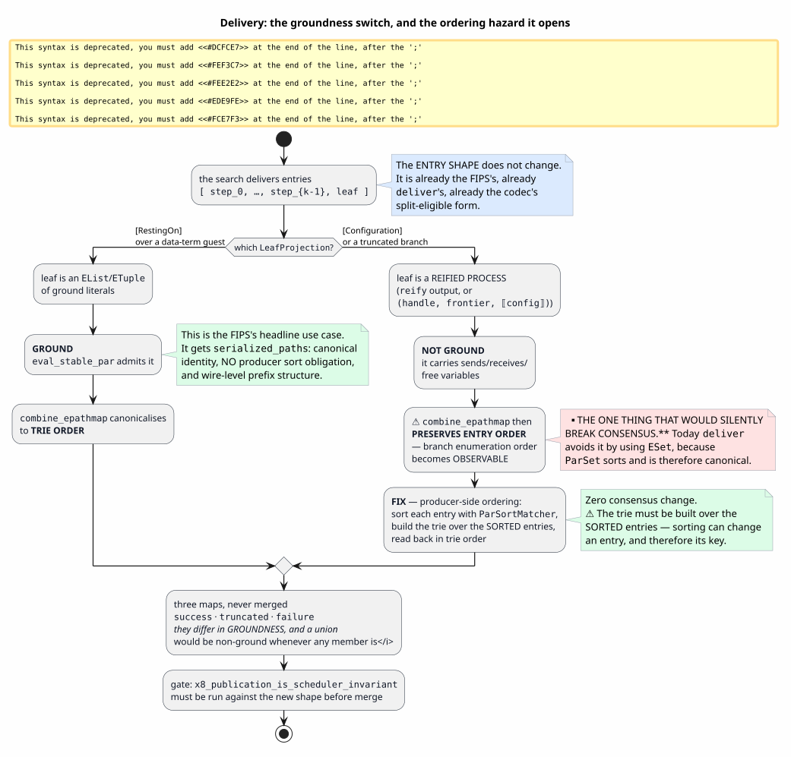

# Storing lookahead traces in a PathMap

> **Status: SUPERSEDED AS AN IMPLEMENTATION PLAN; retained as design history.**
> Commissioned 2026-07-27. The current integration publishes complete traces through the
> homogeneous EPathMap representation (`Empty | Set(PathMap<()>) | Map(PathMap<Par>)`) and
> canonical EPM1 serialization. Present-tense references below to a list-backed EPathMap, a
> global intern store, a shadow cell, ground-only trie serialization, or a missing EPathMap
> matcher arm describe the pre-integration baseline and must not be treated as current design.
> Current implementation/evidence is tracked by f1r3node CBR-044 and its PathMap and stack-safety
> reports; unresolved lookahead-language choices remain design questions rather than EPathMap
> representation work.

---

## Notation

Every symbol, acronym and key term this document depends on, defined before first use.

| Symbol / term | Meaning |
|---|---|
| **FIPS** | F1r3fly Improvement Process Submissions — the sibling repository holding the project's normative change proposals, and by extension one such proposal. The **lookahead FIPS** is `2026-01-08-Lookahead.md` |
| **BFS** | breadth-first search — expand the frontier one depth level at a time, so all depth-$`k`$ nodes are reached before any depth-$`k{+}1`$ node |
| **DFS** | depth-first search — follow one branch to its end, then backtrack |
| **COMM** | the *communication* reduction: a send and a matching receive on one channel rendezvous and are consumed together. In a tuplespace it is the only rule there is |
| **AC** | associative–commutative — a bag with no element order and no grouping |
| **trace** | the sequence of steps a speculative branch fired, in order, from the input expression to its leaf |
| **redex-node** | one element of a trace: the identity of a single fired reduction. [§3](#3-what-a-redex-node-is) settles what it contains |
| **leaf** | the terminal element of a trace: what the branch arrived at — a configuration, a resumption handle, or an error pair |
| **ground** | a `Par` that `eval_stable_par` admits: no sends, receives, news, matches, bundles, connectives or conditionals, and no free variables. Only ground maps get a canonical `serialized_paths` encoding |
| $`\lvert S \rvert`$ | the size of a store configuration — the total entry count across `HotStoreState`'s five maps |
| $`c(v)`$ | the **conflict class** of a search node $`v`$: how many mutually-conflicting rendezvous are enabled there, hence how many children it expands to |
| $`d(v)`$, $`D`$ | the depth of node $`v`$; the depth of a line of the search tree |
| $`E`$, $`L`$ | the number of edges and of leaves in the explored search tree |

---

## 1. The question, and why the current answer is wrong

The lookahead FIPS (`2026-01-08-Lookahead.md`) says of `x!(P)[n]`:

> for each possible **trace `t` of length `n`** a new, empty RSpace `empty_t` will be created …
> and the process `P` will be **executed along that trace** in `empty_t`. If the program executes
> successfully along a trace, **that trace gets inserted into a `success` `PathMap` object**. …
> an extra two-element list containing an error code for the failure and a message is
> **concatenated to the end of the trace** and the trace is inserted into a `failure` `PathMap`.

Four properties follow from the normative text, and the FIPS's own examples settle the fourth:

1. **The trace is what is collected** — *"that trace* gets inserted", not the leaf.
2. **A trace has length `n`** and can be *concatenated to*: it is a sequence, not a key.
3. **Its elements are processes.** `2026-01-08-Lookahead.md:157` reads
   `let @{=ret!(squared) | _} <- trace.last()` — pattern-matching `trace.last()` as a **running
   process**; `:100` binds `@inst` from it and uses it as a live configuration.
4. **Hence the PathMap.** Traces are paths; a PathMap is a trie of paths. Inserting a trace into a
   PathMap is inserting a path into a trie, and prefix sharing lands exactly where the exploration
   shared history.

### 1.1 What is implemented instead

`delivery.rs` folds each step to a 32-byte digest and *appends* the leaf, so `trace.last()` returns
the right thing while the other $`n - 1`$ elements are inert to a consumer. Its module header states the
assumption that produced this:

> **A step is one 32-byte digest.** … all of it is folded into one content digest (`step_digest`)
> **because a consumer *keys* on a trace — it never destructures one** — and because the digest of a
> whole trace (`trace_digest`) is then the natural handle name for resuming a truncated branch.

That assumption is the defect. Its consequences:

| | |
|---|---|
| the input expression | nowhere in the trace |
| intermediate terms | absent; only event identities |
| walking a trace as a reduction sequence | impossible |
| the terminal | *appended* to an event list, not the last node of a path |

It also means `ESet`-of-`EList` preserves the FIPS entry's **arity** but not its **meaning**: prefix
sharing, root-as-input and walk-as-reduction are all absent.



*Figure 1. Left, in red: what `delivery.rs` publishes — an `ESet` of `EList`s, in which the shared
first step `d0` is stored twice and the input expression appears nowhere. Right, in green: the same
entries stored as a trie, where the root is the input, interior nodes are redexes, the leaf
expression is the terminal segment, and two branches that fired the same prefix share those bytes.
The entries themselves are unchanged; only the container differs. Source:
[figures/lookahead-trace-shape.puml](figures/lookahead-trace-shape.puml).*

### 1.2 The two obstacles this explains

Both were encountered independently and treated as separate defects:

- a demo cannot print the input expression that produced a result;
- nothing links a `BranchReport` back to its subject (the engine holds `subject: Par` internally at
  `service.rs:127` and never publishes it).

Under a path-shaped trace neither exists: the input is the root and every leaf knows its ancestry.

---

## 2. The keystone — the storage format already exists

`models/src/rust/canonical_path.rs` encodes a **split-eligible** entry (a single-expression carrier
of a default-metadata `EListBody`) as

```math
\mathrm{path}([e_1,\dots,e_k]) \;=\; \mathrm{enc}(e_1)\;\Vert\;\cdots\;\Vert\;\mathrm{enc}(e_k)\;\Vert\;\texttt{0x00}
```

and `pathmap_integration::create_pathmap_from_elements` stores each entry under
`encode_trie_path(entry)` in a real `PathMap<Par>`.

For an entry $`[\mathit{step}_0, \dots, \mathit{step}_{k-1}, \mathit{leaf}]`$ — **byte-for-byte
what `success_entry`, `truncated_entry` and `failure_entry` already build** — this yields:

```
key = enc(step₀) ‖ enc(step₁) ‖ … ‖ enc(leaf) ‖ 0x00
       └────────┬────────────┘   └───┬───┘
        interior nodes = REDEXES    terminal segment = the EXPRESSION
```

- **Interior trie nodes are the redexes.** Two branches firing the same prefix share those bytes.
- **The leaf expression is the terminal segment**, immediately before the `0x00`.
- Interior and terminal are distinguishable **by tag byte**: `0x06` a step (`GByteArray`), `0x0B` a
  failure leaf (nested `EList`), `0x0C` a truncated leaf (`ETuple`), `0x0F` a reified process (the
  escape arm).

> The redex/leaf model is not an analogy to what the codec does. **It is what the codec does.**
> No new encoding is required and no design freedom is spent.

### 2.1 PathMap semantics — a prefix-compressed set

`RhoTypes.proto:321-339`:

- `reserved 2, 6, 7;` — ⚠ **CORRECTED.** This document previously read the reserved-field comment
  as "values were tried and retired". That is a **misreading**, and it was propagated into three
  other places. The retired fields were `value_form: uint32` / `value_entries: bytes`, and
  `value_entries` was *"the canonical path stream — ascending, deduplicated, length-framed codec
  paths"* — i.e. **the key stream**, which is what field 8 carries today. "Value" there meant
  **value form** (the evaluated/ground representation) as opposed to **term form**; it never meant
  a per-key payload.
  ★ The actual lesson is the opposite and is load-bearing for any wire proposal: the project built
  an **explicit discriminant** for this message (`ff7a7e3a`, `9f9e7f5a`), ran it for one day, and
  **rewound it in favour of a presence check** (`f34c2d7e`) — `git merge-base --is-ancestor
  9f9e7f5a HEAD` is false; those commits survive only on `backup/epathmap-wire-rework-20260721`.
  The discriminant cost a form-split through `==`/`Hash`/`Ord`, a thaw path for mutation, a
  `merge_field` state machine, hand-written serde, an `Invalid` third state, an ingress grammar,
  and a sort. All deleted by the replacement.
- `bytes serialized_paths = 8` — *"the **UNCOMPRESSED**, trie-ordered, length-framed key stream
  `repeat( u32-LE keylen ++ trie_key )`. **NEVER deflated.** The canonical identity + hash preimage
  of a ground map, produced by a PathMap read-zipper walk over the intern trie (no sort)."*

Two consequences that shape everything below:

1. **Trie order *is* canonical for a ground map**, with no producer sort obligation.
2. **Prefix compression is an in-memory property only.** The wire is flat and deliberately never
   deflated — the hash preimage must be canonical, and a compression scheme would be one more thing
   consensus must agree on.

⚠ `serialized_paths` is **not a field you write**. The authoritative Rust struct has
`ps`, `locally_free`, `connective_used`, `remainder` and a private `intern: OnceLock`; field 8 is
produced *at intern time*, *for ground maps only*, from a read-zipper walk over the trie built from
`ps`. **You write entries into `ps`; a ground map's canonical encoding *becomes* field 8.**

---

## 3. What a redex-node is

**Recommended: `step_digest(name)` carried as `GByteArray(32)`** — the Blake2b-256 of the fired
rendezvous's `Consume` content hash concatenated with each selected datum's `Produce` content hash
in bind order.

- **Available for free** at the fire site: `FiredStep.name` is returned by `fire`, and
  `planned[index]` holds the same `RendezvousName`. Computing the digest is one Blake2b-256 over
  $`32 \cdot (1 + \lvert \mathit{binds} \rvert)`$ bytes. Nothing else is computed.
- **Ground: yes.** `eval_stable_expr` admits `GByteArray`; a trace of these inside a
  default-metadata `EList` is `eval_stable_par`.

### 3.1 Why a *faithful* syntactic redex is not available

A faithful redex — the continuation term plus matched payloads — is also free at the fire site, and
is **not ground**, for three independent reasons:

1. `eval_stable_par` rejects any `Par` carrying `sends`, `receives`, `news`, `matches`, `bundles`,
   `connectives` or `conditionals`. A continuation body is exactly that.
2. `BindPattern.patterns` contain `FreeVar`s, so `connective_used` is true.
3. It carries `random_state` bytes (a `Blake2b512Random`) — deploy- and scheduler-derived, and must
   never reach a published name.

**What is lost with the digest:** the syntax. A consumer can *key* on a redex-node, *compare*
traces, and *name* a resumption. It cannot read which rule fired or print the rewritten subterm.

**What is unavailable at any cost without new machinery:** the fired rule's identity *in the MeTTaIL
sense*. In a tuplespace the rule is always COMM; which theory rewrite a guest performed lives inside
the guest's own Rho-net encoding, and the host search cannot see it.

**Recovery path**, if the syntax is wanted: a second, explicitly non-ground map keyed by the same 32
bytes — a map $`\mathit{redex\_digest} \mapsto \mathit{description}`$ — that a debugging consumer
joins against. This keeps the trace
map ground and pays only where someone asks. *(Decision 1.)*

---

## 4. Computing traces without deep copies

### 4.1 What is copied today

Per expanded node `v`, conflict class `c(v)`, depth `d(v)`, configuration size `|S|`:

| site | cost | count |
|---|---|---|
| `load(node.state.clone())` at expansion | $`\Theta(\lvert S \rvert)`$ deep clone of five `HashMap`s | 1 per node |
| `load(node.state.clone())` per sibling after the first | $`\Theta(\lvert S \rvert)`$ | $`c(v) - 1`$ per node |
| `snapshot()` after a fire | $`\Theta(\lvert S \rvert)`$ | 1 per edge |
| `content_fingerprint(&child_state)` | $`\Theta(\lvert S \rvert)`$ prost-encode + Blake2b + `format!` to hex + `Vec<String>` + sort — **and the `Vec<String>` is retained as the visited key** | 1 per edge |
| `child_trace.extend_from_slice(&node.trace)` | $`\Theta(d)`$ `RendezvousName` clones, **two heap allocations each** | 1 per edge |
| `Node` retention | $`\Theta(\lvert \mathit{frontier} \rvert \cdot \lvert S \rvert)`$ | standing |
| `root.clone()` at `explore` | $`\Theta(\lvert S \rvert)`$, **never read** | 1 |

> The trace quadratic is real, but it is **one of five per-edge costs and the only one that is not**
> $`\Theta(\lvert S \rvert)`$.
> A design that fixed only the trace would leave the larger term untouched.

### 4.2 Rejected approaches

**Zipper-per-frontier-node ("let the PathMap be the store").** *Rejected on availability, not
preference.* `pathmap` 0.2.2 — the build `models` pins, and therefore the build the intern trie
lives in — has `take_owned_write_zipper_at_exclusive_path` / `WriteZipperOwned`
**commented out**; the `'static` owned zipper exists only on the `feature/mettatron-fixes` fork,
used by `prattail` and `macros` but not `models`. A borrowed `WriteZipperTracked<'a, …>` cannot live
in a `Vec<Node>` across the search's `.await` points.

*(A DFS variant would work with a single zipper — descend on fire, `set_val` at a leaf, ascend on
backtrack, $`\Theta(\lvert \mathit{step} \rvert)`$ per edge with no trace structure at all. But BFS
is what makes the bracket `[n]`
a **trace-length** bound, and what beam search needs to rank all depth-`k` leaves together.
Decision 8.)*

**Hash-consing the redex-nodes.** *Rejected as unnecessary.* A step key is already a content digest,
which is its own perfect hash. The in-tree table (`runtime/src/hash_consing.rs`) is `Rc` +
`thread_local`, hence not `Send`, and unusable from the async search regardless. The cross-branch
sharing wanted here is delivered by the trie's prefix compression, not by an intern table.

### 4.3 Recommended — three local changes

1. **`Node.trace: Vec<RendezvousName>` becomes `Option<Arc<TraceStep>>`**, with
   `TraceStep { parent: Option<Arc<TraceStep>>, step: Blake2b256Hash, depth: u32 }`.
   A child is one `Arc::new` plus a refcount bump: $`\Theta(1)`$ **per edge instead of**
   $`\Theta(d)`$.
   *Verified safe:* the trace's `RendezvousName`s are write-only in the search — the sleep set is
   keyed by `SemanticName`, and the determinism check compares against `planned`, not the trace. The
   only readers are `step_digest` and `trace_digest`, and `trace_digest` is *already defined* as the
   fold of `step_digest`s.

2. **Move rather than clone when $`c(v) = 1`$.** `SpeculativeSandbox::load` takes its state **by
   value**; when the conflict class is a singleton — every measured guest, λ and Ambient alike —
   `node.state` is never needed again. **Removes one full** $`\Theta(\lvert S \rvert)`$ **clone per
   node**, at the cost of an `if`.

3. **Replace the visited-map key with a 32-byte digest.** Folding the same canonical byte sequence
   into one `Blake2b256Hash` preserves the equivalence relation exactly while dropping the `format!`
   storm and shrinking retained key memory from $`\Theta(\lvert S \rvert)`$ strings to 32 bytes.
   `content_fingerprint` stays for `distinct_success_configurations` and for humans.

Plus: **delete `Exploration.root`** — zero production readers, one deep clone, one retained
configuration. Under this model the *trie's* root is the root.



*Figure 2. Above, in red: today's `Vec<RendezvousName>`, in which every child copies all of its
ancestors and each copied element costs two heap allocations. Below, in green: the proposed
`Arc<TraceStep>` chain, in which a child allocates one node and points at its parent, so siblings
share ancestry instead of duplicating it. Source:
[figures/lookahead-trace-representation.puml](figures/lookahead-trace-representation.puml).*

Change 1 is the one worth spelling out, because its whole content is *where the copying happens*.
Today a trace is a vector that each child copies from its parent; under the proposal a trace is a
node that each child *points at*, and the copying is deferred to the leaves that are actually
delivered.

**Algorithm 1 (extending and materialising a trace).**

```pseudocode
EXTEND(parent_trace, fired_step)                  -- once per EDGE, during search
 1  depth ← if parent_trace = NIL then 0 else parent_trace.depth + 1
 2  return Arc(TraceStep{ parent: parent_trace,
 3                        step:   step_digest(fired_step),
 4                        depth:  depth })

MATERIALISE(leaf_trace)                           -- once per delivered LEAF
 5  out ← array of length leaf_trace.depth + 1    -- exact size known in advance
 6  node ← leaf_trace
 7  while node ≠ NIL do
 8      out[node.depth] ← node.step               -- write straight to final index
 9      node ← node.parent
10  return out
```

`EXTEND` is the hot path: lines 1–4 allocate one `TraceStep` and bump one refcount, so an edge
costs $`\Theta(1)`$ regardless of how deep it sits — against today's `extend_from_slice`, which
copies all $`d`$ ancestors and performs two heap allocations per copied element. Nothing is shared
mutably: a `TraceStep` is immutable once built, and siblings simply hold `Arc`s to the same parent,
which is what makes the structure safe to hold across the search's `.await` points.

`MATERIALISE` is the cold path, and line 5 is why it is cheap: the `depth` field means the final
length is known before the walk starts, so the output array is allocated once at exactly the right
size rather than grown. Line 8 writes each step directly to its final index, so the walk from leaf
to root produces a root-to-leaf sequence with no reversal pass. It runs $`\Theta(d)`$ once per
delivered leaf instead of $`\Theta(d)`$ once per edge — which is the whole of the asymptotic
improvement tabulated in [§4.4](#44-asymptotics): $`\Theta(E \cdot d)`$ becomes
$`\Theta(E) + \Theta(L \cdot d)`$, and since $`L \le E`$ that is never worse and is dramatically
better on the deep, narrow search lines that the bracket `[n]` produces.

The one property `EXTEND` must not lose is that `step_digest` is **content-determined**. If a step
key depended on scheduler order, sibling branches that fired the same rendezvous would receive
different keys, the trie would not share their prefix, and — worse — the *shape* of the delivered
map would vary run to run. That is the same requirement [§5.2](#52--the-ordering-hazard) turns on,
reached from the other side.

### 4.4 Asymptotics

| | today | proposed |
|---|---|---|
| deep `HotStoreState` clones per edge | $`3 + (c - 1)`$ | $`1 + (c - 1)`$ |
| visited key per edge | $`\Theta(\lvert S \rvert)`$ hex `String`s, retained | 32 bytes, retained |
| trace work per edge | $`\Theta(d)`$, 2 allocs/element | $`\Theta(1)`$, 1 alloc |
| trace total, line of depth $`D`$ | $`\Theta(D^2)`$ | $`\Theta(D)`$ |
| trace total, $`E`$ edges / $`L`$ leaves / depth $`d`$ | $`\Theta(E \cdot d)`$ | $`\Theta(E) + \Theta(L \cdot d)`$ at delivery |

⚠ **Predicted, not measured.** The measurement wanted before merge is a heap profile of
`01-computed-desk.rho` attributing its ~113 MB across `HotStoreState::clone`, the visited
`Vec<String>`s, and the trace vectors.

### 4.5 Out of scope — persistent `HotStoreState`

`HotStoreState` is five `std::collections::HashMap`s with a derived `Clone`. Making it persistent
(`im`/`rpds`, or `Arc`-wrapping the per-channel `Vec`s) takes the clone from
$`\Theta(\lvert S \rvert)`$ to $`\Theta(\log \lvert S \rvert)`$ and is **the single largest
remaining win** — it removes the last $`\Theta(\lvert S \rvert)`$ per edge. It is a change to
`rspace++`, a consensus crate, affecting every rspace user. **Track separately; sequence after the
trace work**, which is a precondition for measuring it cleanly.

---

## 5. Storage

Change exactly one thing in `deliver`: `ground_set` becomes a PathMap constructor. The entries do
not change.

```
success   ::= EPathMap { ps: [ entry, … ] }
entry     ::= EList [ step₀, …, step_{k-1}, leaf ]
step      ::= GByteArray(32)                      -- a redex-node
leaf      ::= ⟦configuration⟧ | (handle, frontier, ⟦configuration⟧) | [code, message]
```

**Three maps, not one** — the FIPS gives two, the codebase has three (adding `truncated`). Keep
three, for a reason that is new under this model: **they differ in groundness**, and merging would
make the union non-ground whenever any member is.



*Figure 3. The delivery path, end to end. The branch on `LeafProjection` is the whole decision: a
`RestingOn` leaf over a data-term guest is ground and earns canonical trie ordering for free, while
a `Configuration` or `truncated` leaf is a reified process and is never ground — at which point
`combine_epathmap` preserves entry order and branch enumeration order becomes observable. The green
box on that path is the producer-side fix of §5.2. Source:
[figures/lookahead-groundness-and-ordering.puml](figures/lookahead-groundness-and-ordering.puml).*

### 5.1 Groundness per map

| map | leaf | ground? |
|---|---|---|
| `failure` | `[GInt code, GString message]` | **always** |
| `success`, `LeafProjection::RestingOn` over a data-term guest | `EList`/`ETuple` of ground literals | **yes** — the FIPS's MeTTaIL-theory use case |
| `success`, `LeafProjection::Configuration` | a reified process | **never** |
| `truncated` | `ETuple(GByteArray, GInt, reified process)` | **never**, as currently shaped |

> `LeafProjection` — today a leaf-size optimisation — is **promoted to the ground/non-ground
> switch**. This is the most consequential re-reading in the design: the FIPS's headline use case
> lands in the ground regime and gets `serialized_paths`, canonical identity with no producer sort,
> and wire-level prefix structure. The Lambdas/Confinement use cases do not.

The codec is **total** for both: a non-eval-stable leaf takes the `0x0F` escape arm
(`uv(|prost|) ‖ canonical prost bytes`), legal precisely at a top-level segment position — which is
exactly where the leaf sits. Nothing fails to store.

### 5.2 ★ The ordering hazard

**This is the one thing that would silently break consensus if missed.** `combine_epathmap`
canonicalises to trie order **only for ground maps**; for a non-ground map its comment is explicit —
*"recursively sort each entry, **preserve entry order**."* So delivering a non-ground `EPathMap`
makes **branch enumeration order an observable**, exactly the property `deliver` avoids today by
using `ESet` (*"`ParSet` sorts, so the encoding is canonical"*).

`x8_publication_is_scheduler_invariant` is the test that catches this and **must be run against the
new shape before merge**.

**Recommended fix — producer-side trie ordering, zero consensus change.** In `deliver`, sort each
entry with `ParSortMatcher::sort_match`, build `create_pathmap_from_elements(&sorted_entries, None)`,
and read the entries back in trie order. ⚠ The trie must be built over the **sorted** entries, since
sorting can change an entry and therefore its key.

*Snag:* `canonical_ps_from_trie` is `pub(crate)` in `models`. Either (i) ask f1r3node for a
`pub fn canonicalize_epathmap` — the existing body with the gate removed, a new public function with
no behaviour change to any existing path, therefore **not consensus-visible** *(recommended)*; or
(ii) duplicate the read-zipper walk here, which works but makes any drift a silent consensus
divergence. *(Decision 5.)*

---

## 6. Pattern-matching accessibility

### 6.1 Route B — the zipper query chain — is live and measured

`rholang-runtime/tests/e6a_pathmap_spike.rs` (experiment 145) recorded both halves against live
f1r3node runtimes: an `EPathMap` *receive pattern* cannot destructure sub-entries (no
`EPathmapBody` arm in the spatial matcher), **and** the process-context query chain works end to end
with a deterministic COMM profile, reproducible bit-identically across three runs.

Under the redex-node model that chain is a **trace query language**, strictly more expressive than
the FIPS's own idiom:

| question | expression | cost |
|---|---|---|
| did any branch fire this redex sequence? | `m.pathExists(prefix)` | $`\Theta(\lvert \mathit{prefix} \rvert)`$ |
| all continuations after this prefix | `m.readZipperAt(prefix).getSubtrie()` | $`\Theta(\lvert \mathit{prefix} \rvert)`$ |
| the expression this branch reached | `…descendFirst().getLeaf()` | $`\Theta(1)`$ |
| how many branches share this prefix | `.leafCount()` / `.childCount()` | $`\Theta(\mathit{subtrie})`$ / $`\Theta(1)`$ |

Contrast `{| trace, ..._ |}`, which peels **one arbitrary entry** — sound in the FIPS's λ example
only because confluence makes the choice unobservable, and silently discarding the others over the
non-confluent guests `[*]` exists for.

★ Route B is blocked **only** for programs written in MeTTaIL's Rholang surface, by `lower_pathmap`
(divergence G / C4) — *not* by consensus, *not* by the matcher, and *not* for a `Par` constructed in
Rust.

### 6.2 Route A — the missing `EPathmapBody` arm

Absent, confirmed. It should mirror `ESetBody` exactly, with one substitution: where `ESetBody`
converts through `ParSetTypeMapper::eset_to_par_set` (which sorts and dedups), `EPathmapBody`
converts through the **trie** — dedup by path is dedup by value under an injective codec. In the
current implementation, direct PathMap lookup replaces the historical intern-shadow-cell premise.

**Consensus exposure: high and unavoidable.** The arm makes a pattern that today matches *nothing*
match *something* — a program stuck today would fire. That is a widening of the matching relation.

### 6.3 Sequencing

Three gaps, ascending consensus risk:

1. `lower_pathmap` (C4) — **MeTTaIL only, no consensus exposure**, and alone unblocks all four FIPS
   use cases via Route B;
2. `last` — a library method; consensus-visible but additive and trivial. ⚠ **`last` does not exist
   today**: the method table has `nth`, `length`, `size`, `slice`, `take`, `dropHead`. The FIPS's own
   `trace.last()` does not lower, independently of anything about PathMaps;
3. the `EPathmapBody` arm — consensus-visible and relation-widening.

### 6.4 On *Triemaps that match* (Peyton Jones & Graf)

> ⚠ **CORRECTED.** This section previously attributed the paper to *"R. Hinze & S. Peyton Jones"*
> and quoted §3.2 as *"we simply walk the trie structure"*. Both were wrong. The paper is by
> **Simon Peyton Jones and Sebastian Graf**; Ralf Hinze appears only as an internal citation
> (`[Hinze 2000a]`), which is the likely source of the slip. The quotation is corrected below
> against the text. The technical conclusions are unaffected — they were drawn from the right
> paper, under the wrong name.

**The headline technique does not transfer; its premise does, inverted.**

- §5's matching triemap indexes **many patterns** and queries **one target**. Our shape is the
  **dual** — one pattern, many targets. Building a trie over one pattern buys nothing.
- §3.2's premise — *"we never compare two expressions for equality or ordering. We simply walk down
  the `ExprMap` structure, guided at each step by the next node in the target"* — **inverted**
  (walk the target trie, guided by the next segment of the pattern) **is exactly Route B**.
- Its own measurement argues for the storage decision: the `lookup_lam` benchmark wraps a shared
  100-layer prefix around every key and the trie wins **5.12×** over ordered maps and **2.06×** over
  hash maps, because the trie looks at the shared prefix once while an ordered map traverses it on
  each of its $`O(\log n)`$ comparisons. A set of traces sharing long redex prefixes is that shape.

---

## 7. Compatibility

**About 7 survive · 1 improves · 4 adapt · 5 rebuild · 3 new · 1 deferred.**

| item | verdict | why |
|---|---|---|
| `step_digest` | **survives — promoted** | it *is* the redex-node. Its store-index exclusion becomes load-bearing twice: a trie key must be content-determined or the trie's **shape** is scheduler-dependent |
| `trace_digest` | **survives** | already the fold of `step_digest`s; indifferent to representation |
| `ResumableBranch` host state | **survives** | a `Par` still cannot carry `Blake2b512Random`, a `Consume` source or a `Produce` source. ⚠ A trie node is a reified configuration — **inspectable, not resumable**. The apparatus does not go away |
| `reify` | **survives — significance changes** | its output is never `eval_stable_par`, which is what makes `success`/`truncated` non-ground |
| `resting_on` / `LeafProjection` | **improves — promoted** | becomes the ground/non-ground switch |
| `x8_publication_is_scheduler_invariant` | **survives — becomes the load-bearing gate** | its sorted-byte-multiset assertion across tokio widths is the guard for §5.2 |
| `BranchReport.datum` (the `[trace, [terms]]` pair) | **survives unchanged** | deliberately *not* the FIPS entry shape, with a recorded correction saying the flat reading reached a demo and was wrong. **Do not unify it** |
| `content_fingerprint` | **adapts** | keep for humans; add a 32-byte digest sibling as the visited key |
| `trace_pars`, `x7_lookahead_end_to_end`, `lookahead_demo` goldens | **adapt** | mechanical |
| `Node.trace`, the three leaf structs' `trace` fields | **rebuild** | becomes `Arc<TraceStep>` |
| `deliver`'s `ground_set` | **rebuild** | becomes a PathMap constructor with producer-side trie ordering |
| `Exploration.root` | **rebuild — delete** | zero readers |
| the `load(state.clone())` sites | **rebuild** | move-not-clone on singleton conflict classes |
| `EPathmapBody` matcher arm · `last` · `lower_pathmap` | **new** | see §6.3 |
| persistent `HotStoreState` | **separate item** | §4.5 |

---

## 8. Open decisions

| # | decision |
|---|---|
| 1 | **Redex-node content** — digest-only (ground, opaque, 32 B), or digest plus a side $`\mathit{redex\_digest} \mapsto \mathit{description}`$ map (non-ground, inspectable, pay-per-use)? |
| 2 | **Trace element retention** — digests only, or keep structured `RendezvousName`s on truncated branches for a replay differential? |
| 3 | **The `truncated` leaf** — keep the reified configuration (never ground), or reduce to `(handle, frontier)` and make the map ground, with inspection as a separate request? |
| 4 | **Entry ordering** — producer-side trie ordering in `deliver` *(recommended, no consensus change)*, or ungate `combine_epathmap`'s canonicalisation *(principled, changes every non-ground `EPathMap`'s normal form)*? |
| 5 | **Trie readback** — a new `pub fn canonicalize_epathmap` in f1r3node `models` *(additive)*, or duplicate the walk here *(silent-divergence risk)*? |
| 6 | **Sequencing** — `lower_pathmap` first (zero consensus exposure, unblocks all four FIPS use cases via Route B), or the matcher arm first (honours the FIPS's literal idiom)? |
| 7 | **Persistent `HotStoreState`** — separate item, or folded in? |
| 8 | **BFS or DFS** — BFS makes `[n]` a trace-length bound and is what beam search needs; DFS would let a single write zipper *be* the trace store. *Recommended: BFS.* |

### Settled by evidence, not open

- The redex-node is `step_digest` — the only ground, content-determined, zero-extra-computation
  candidate, and already what `delivery` publishes.
- The entry shape does not change — it is already the FIPS's, already `deliver`'s, already the
  codec's split-eligible form.
- Three maps, not one — they differ in groundness.
- Zipper-per-frontier-node is out, on the 0.2.2 API.
- Hash-consing is out — a content digest is its own intern key.
- The triemap *matching* technique does not transfer; its prefix-sharing premise does.

---

## 9. Corrections to prior records

Recorded so the superseded claims are not re-inherited:

| claim | where | correction |
|---|---|---|
| *"values were tried and retired"* (fields 6/7) | this document, `rholang_ast/recursive_oracle.rs:302`, `scratch/oracle_body.rs:266`, and `rho_rholang_conformance.rs:1251`'s `#[ignore]` reason | **a misreading of the reserved-field comment.** 6/7 were `value_form`/`value_entries` — a *discriminant plus the key stream*, not per-key values. The real lesson is that an explicit discriminant was tried and **replaced by a presence check**. All four sites need correcting; the `#[ignore]` reason blocks divergence G on a claim that is not true |
| *"a consumer keys on a trace — it never destructures one"* | `delivery.rs` header | the assumption that produced the divergence; the FIPS destructures |
| *"the FIPS's own shape"* for `ESet`-of-`EList` | `delivery.rs` header | arity preserved, meaning lost |
| *"PathMap methods do not lower on the reducer path"* | `delivery.rs`, `lookahead.rs` headers | **false of f1r3node**, whose reducer has all 26 methods plus a fusion pass. The blocker is MeTTaIL's `lower_pathmap` alone |
| *"retained so a caller can diff a leaf against the root"* | `Exploration.root` doc | zero production readers |
| the value-slot decision blocks this feature | `divergence_g`'s `#[ignore]` | the FIPS's pattern is bare-element; the value arm was retired upstream. Irrelevant here |
| `trace.last()` | FIPS examples | **`last` does not exist** in the method table |
| *Triemaps that match* attributed to *"R. Hinze & S. Peyton Jones"* | this document, [§6.4](#64-on-triemaps-that-match-peyton-jones--graf) and its References entry | **wrong authors.** The paper is by **Simon Peyton Jones and Sebastian Graf** (arXiv:2302.08775v3, 2024). Hinze appears only as an internal citation, `[Hinze 2000a]`, for the trie idea — the likely source of the slip. Verified against the paper's own title page |
| §3.2 quoted as *"we simply walk **the trie structure**"* | this document, [§6.4](#64-on-triemaps-that-match-peyton-jones--graf) | **misquote.** The text reads *"we simply walk **down the `ExprMap` structure**, guided at each step by the next node in the target"*. The inversion argument is unaffected; the quotation was not verbatim |

## References

### Published work

- **Peyton Jones & Graf 2024** — Peyton Jones, S., and Graf, S. *Triemaps that match.* Technical
  report, arXiv:2302.08775v3 (11 November 2024).
  DOI: [10.48550/arXiv.2302.08775](https://doi.org/10.48550/arXiv.2302.08775).
  Local copy: `~/Papers/Pattern Matching/Triemaps that match.pdf`.
  Used in [§6.4](#64-on-triemaps-that-match-peyton-jones--graf) for three things: the matching
  triemap of §5 (which does **not** transfer, being the dual of our shape), the walk-the-trie
  premise of §3.2 (which transfers inverted), and the `lookup_lam` measurement of §6 — a shared
  100-layer prefix wrapped around every key, on which the trie map beats ordered maps by
  $`5.12\times`$ and hash maps by $`2.06\times`$.

### Normative in-project sources

- **The lookahead FIPS** — `approved/2026-01-08-Lookahead/2026-01-08-Lookahead.md` in the sibling
  **FIPS** (F1r3fly Improvement Process Submissions) repository, checked out alongside this one.
  The normative text quoted in [§1](#1-the-question-and-why-the-current-answer-is-wrong). Not
  linked relatively because it lives outside this repository. *(no DOI registered)*
- `models/src/main/protobuf/RhoTypes.proto:321-339` — the `EPathMap` message, its `reserved 2, 6, 7`
  comment, and `serialized_paths = 8`. *(no DOI registered)*
- `models/src/rust/canonical_path.rs` — the split rule, the `0x0F` escape arm, and `eval_stable`.
  *(no DOI registered)*
- `rholang-runtime/src/speculation/` — [`search.rs`](../../../rholang-runtime/src/speculation/search.rs),
  [`delivery.rs`](../../../rholang-runtime/src/speculation/delivery.rs),
  [`service.rs`](../../../rholang-runtime/src/speculation/service.rs): the search, the entry
  builders, and the engine that holds `subject: Par` without publishing it.
- `rholang/src/rust/interpreter/matcher/spatial_matcher.rs` — the missing `EPathmapBody` arm of
  [§6.2](#62-route-a--the-missing-epathmapbody-arm). *(no DOI registered)*
