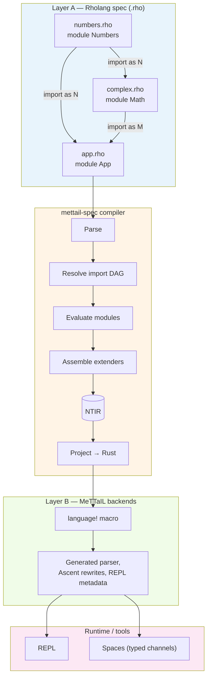
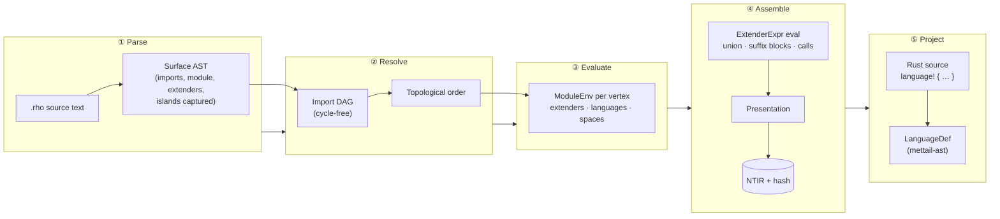
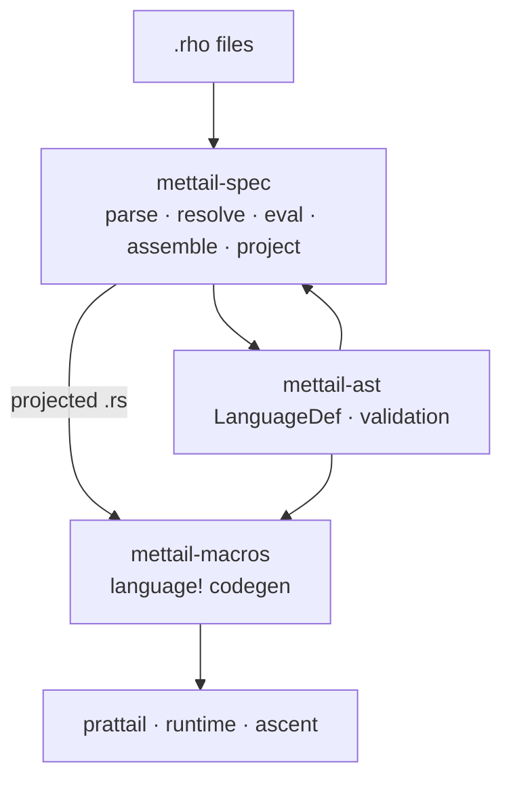
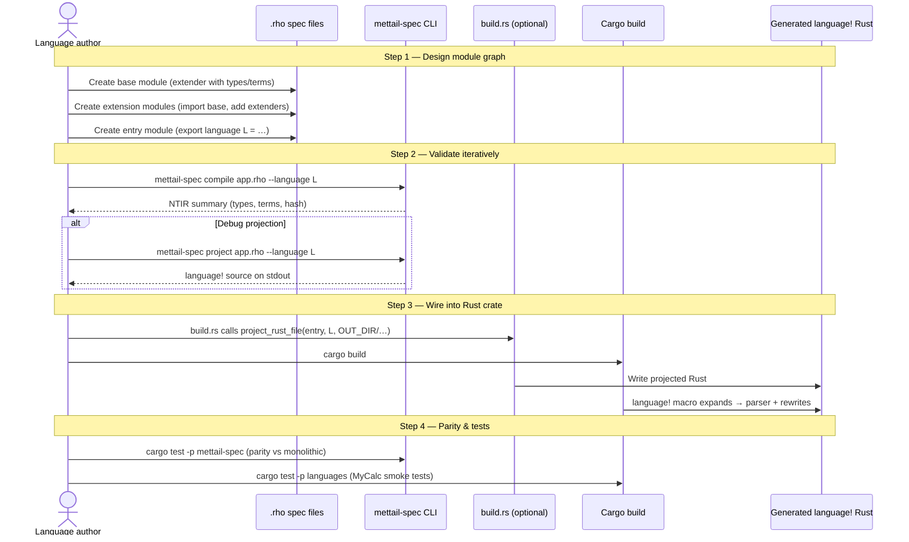
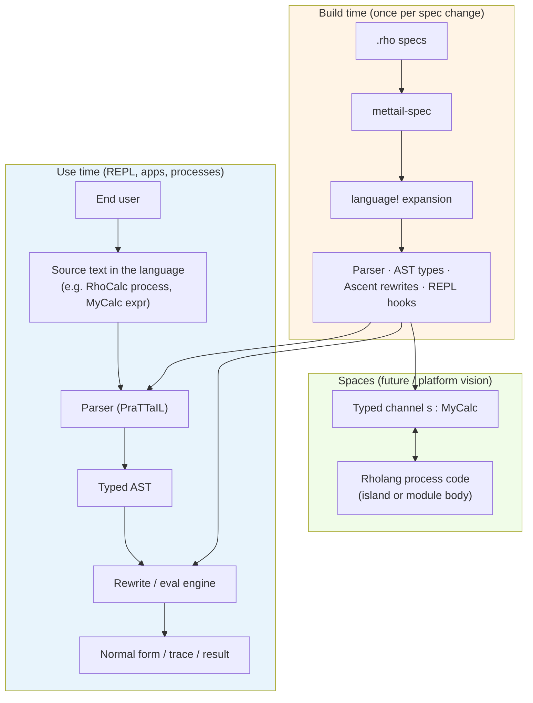
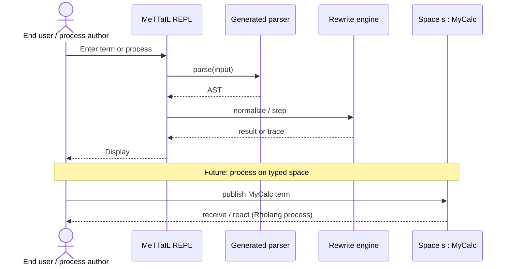
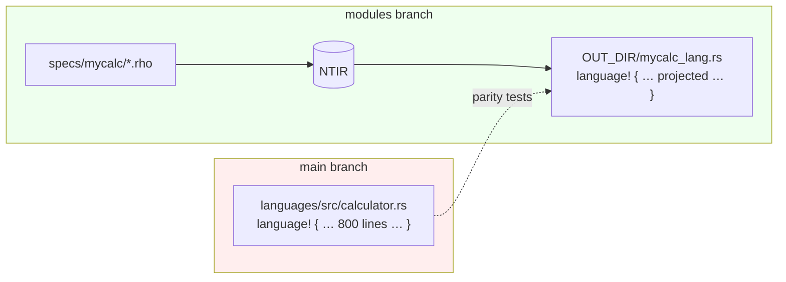

# Module System — Visual Overview

**Branch:** `modules` vs `main`  
**Date:** May 2026

This document summarizes the architectural changes on the `modules` branch and presents four diagrams: high-level module interaction, a detailed pipeline walkthrough, the author workflow for defining a new language, and the end-user workflow for using a language at runtime.

---

## What changed on `modules` (vs `main`)

The branch introduces a **modular language specification system** (MUS — MeTTaIL Unified Specification) alongside the existing monolithic `language!` macro workflow.

| Area | Before (`main`) | After (`modules`) |
|------|-----------------|-------------------|
| **Spec authoring** | Single Rust file with `language! { … }` | Layered `.rho` files with `import`, `module`, `extender`, `export language` |
| **Composition** | Manual copy/paste in one macro block | Parameterized **extenders** composed via `LanguageExpr` (e.g. `M.Complex(N.FloatBase())`) |
| **Compiler pipeline** | Macro parses directly into codegen | **`mettail-spec`**: parse → resolve → evaluate → assemble → **NTIR** → project |
| **Shared AST** | Inside `macros` crate | Extracted to **`mettail-ast`** (shared by macro + spec compiler) |
| **Build integration** | Hand-written language modules | `languages/build.rs` projects `.rho` → generated `language!` Rust (MyCalc proof-of-concept) |
| **Foreign code** | Host Rust only | **Island parsing** (backtick regions) with plugin registry (Phase 3) |
| **Parity** | N/A | Modular `.rho` specs must match monolithic `language!` output (MyCalc tests) |

**New crates:** `mettail-spec`, `mettail-ast`  
**Reference example:** `languages/specs/mycalc/{numbers,complex,app}.rho` → generated `MyCalc` language

---

## Diagram 1 — High-level module interaction

How modular `.rho` files relate to each other and to the build/runtime stack.



**Reading the diagram**

- **Layer A** is backend-neutral: authors compose languages only through `.rho` imports and extender expressions — not through Cargo manifests.
- Each `.rho` file declares exactly one `module { … }` (optionally preceded by `import` statements).
- **Extenders** are reusable, parameterized transformers (e.g. `Complex(Base)` takes a base presentation and adds complex-number syntax).
- **Shipped languages** are fully assembled bindings: `export language MyCalc = …`.
- **Layer B** lowers the canonical **NTIR** (normalized theory IR) into concrete implementation artifacts. Today that means Rust `language!` source; later backends may project differently.

---

## Diagram 2 — Detailed pipeline and module internals

End-to-end flow through each compiler phase, with explanations and concrete examples from the MyCalc reference spec.



### Phase ① Parse

**Input:** a `.rho` file. **Output:** a surface AST including any foreign **islands** (`` Lang`…` `` or `` Lang```…``` ``).

The parser recognizes the module spine:

```text
File ::= [Import] Module
Module ::= "module" Ident "{" Content* "}"
```

**Example — `numbers.rho`**

```rholang
module Numbers {
  export extender FloatBase() {
    empty
    semantics Rust
    types { ![f64] as Float }
  }
}
```

Here `FloatBase` is an exported extender with an empty base presentation (`empty`) plus a `types` suffix that introduces the `Float` category.

---

### Phase ② Resolve

**Responsibility:** walk all `import "path.rho" [as Alias]` declarations, build a directed acyclic graph, reject cycles, and compute evaluation order (dependencies first).

| Rule | Behavior |
|------|----------|
| Path resolution | Relative to the importing file's directory |
| Alias | `as N` → qualified names like `N.FloatBase` |
| Default alias | Module identifier inside the file (e.g. `module Numbers` → `Numbers`) |
| Cycles | Build error with import trace |

**Example import graph (MyCalc)**

```text
app.rho ──imports──► complex.rho ──imports──► numbers.rho
         └─imports──► numbers.rho
```

Evaluation order: `numbers.rho` → `complex.rho` → `app.rho`.

---

### Phase ③ Evaluate

**Responsibility:** walk modules in topological order and populate each vertex's **ModuleEnv**:

| Binding kind | Stored when |
|--------------|-------------|
| `export extender Name(…) { … }` | Exported extender decl + owning module |
| `export language L = …` | Language binding (not yet assembled) |
| `export space s: L` | Space declaration (typed channel for terms of `L`) |

This phase does **not** merge presentations yet — it registers what each module exports.

---

### Phase ④ Assemble

**Responsibility:** given an entry file and a target `export language` name, evaluate the `LanguageExpr` by applying extenders.

**ExtenderExpr forms (implemented subset)**

| Form | Meaning |
|------|---------|
| `empty` | Empty presentation |
| `{ e1 \/ e2 }` | Union of presentations (merge types, terms, equations, …) |
| `e types { … }` | Suffix: add/override types on `e` |
| `e terms { … }` | Suffix: add grammar rules |
| `Ident` or `Ident(args…)` | Reference or call another extender |
| `semantics Rust` | Select backend for this fragment |

**Example — `complex.rho`**

```rholang
import "numbers.rho" as N

module Math {
  export extender Complex(Base) {
    { Base }                    // union: inherit everything from argument
    semantics Rust
    types { ![f64] as Cmplx }
    terms {
      CmplxInj . Cmplx ::= Float ;
      CmplxAdd . Cmplx ::= Cmplx "+" Cmplx ;
    }
  }
}
```

When called as `Complex(N.FloatBase())`:

1. `N.FloatBase()` is assembled first → presentation with `Float` type.
2. `Complex` body `{ Base }` unions that base in.
3. Suffix blocks add `Cmplx` type and term rules.

**Example — `app.rho` (entry point)**

```rholang
import "complex.rho" as M
import "numbers.rho" as N

module App {
  export language MyCalc = M.Complex(N.FloatBase())
  export space s: MyCalc
}
```

Assembly of `M.Complex(N.FloatBase())` produces a single flattened **Presentation**, then **NTIR** (content-hashed for incremental rebuilds).

**NTIR contents**

| Field | Role |
|-------|------|
| `name` | Shipped language name (`MyCalc`) |
| `types`, `terms`, `literals`, `equations`, `rewrites`, `logic` | Flattened spec sections |
| `semantics` | Target backend (`Rust`) |
| `context_template` | Host preamble with `INSERT_HERE` placeholder |
| `rust_island_snippets`, `proc_artifacts` | Lowered foreign islands (Phase 3) |
| `hash` | Content address for cache invalidation |

---

### Phase ⑤ Project (Rust backend)

**Responsibility:** emit Rust source containing `language! { name: …, types { … }, … }`, parseable by the existing macro pipeline.

```text
mettail-spec project app.rho --language MyCalc --out mycalc_lang.rs
```

The `languages` crate's `build.rs` runs this automatically:

```rust
mettail_spec::project_rust_file(&entry, Some("MyCalc"), &out_path)
```

Generated code is included at compile time:

```rust
include!(concat!(env!("OUT_DIR"), "/mycalc_lang.rs"));
```

From there, the **`language!` macro** (unchanged entry point) generates AST types, PraTTaIL parser, Ascent rewrite engine, and REPL metadata — exactly as monolithic specs did before.

---

### Island processing (Phase 3)

Foreign or process code can appear inside extender bodies as **islands**:

```text
Rholang`for(x <- ch) { x!(${hole}) }`     // single backtick
Rust```
  fn helper() -> i32 { 42 }
```                                         // triple backtick, multiline
```

| Component | Role |
|-----------|------|
| **Lexer** | Classifies island tokens; tracks nesting |
| **Escapes** | `` \` ``, `` \${ ``, `` \\ `` inside island bodies |
| **Plugin registry** | Dispatches to `Rust`, `Rholang` (proc) plugins |
| **Typed holes** | `${…}` parsed by the island language (safe templating) |

Island output attaches to NTIR as `rust_island_snippets` or `proc_artifacts`.

---

### Crate responsibilities



---

## Diagram 3 — Author workflow: writing a new language

How a language designer goes from empty directory to a shippable, generated language.



### Step-by-step guide

#### 1. Plan the module graph

Split the language into reusable fragments:

| Module file | Typical contents |
|-------------|------------------|
| `base.rho` | Core types, literals, primitive terms |
| `ext_*.rho` | Feature extenders parameterized on a base |
| `app.rho` | Entry file: imports + `export language` + optional `export space` |

**Principle:** library fragments export **extenders**; only the entry file exports a **language**.

#### 2. Write extenders

```rholang
module Scalars {
  export extender FloatBase() {
    empty
    semantics Rust
    types   { ![f64] as Float }
    literals { Float ::= Regex("-?[0-9]+\\.[0-9]+") ; }
  }
}
```

An extender is a function on presentations: `ExtenderName(Param)` receives assembled argument presentations at call sites.

#### 3. Compose in the entry file

```rholang
import "scalars.rho" as S
import "complex.rho" as C

module MyLang {
  export language Calculator = C.Complex(S.FloatBase())
  export space calc: Calculator
}
```

#### 4. Iterate with the CLI

```bash
# Inspect assembled theory
cargo run -p mettail-spec -- compile languages/specs/mycalc/app.rho --language MyCalc

# Emit Rust projection
cargo run -p mettail-spec -- project languages/specs/mycalc/app.rho --language MyCalc
```

#### 5. Integrate with Cargo (framework implementers)

For shipped languages inside the workspace:

```rust
// languages/build.rs
mettail_spec::project_rust_file(
    manifest_dir.join("specs/mycalc/app.rho"),
    Some("MyCalc"),
    out_dir.join("mycalc_lang.rs"),
)?;
```

```rust
// languages/src/mycalc.rs
include!(concat!(env!("OUT_DIR"), "/mycalc_lang.rs"));
```

#### 6. Verify parity

The branch includes parity tests ensuring modular `.rho` output matches a golden monolithic `language!` spec — guarding against drift during migration.

---

## Diagram 4 — End-user workflow: using a language

How someone **uses** a composed language after it has been built — distinct from authoring the spec.



### What the end user sees

End users do **not** edit `.rho` files or run `mettail-spec`. They interact with the **generated language** through tools that the macro pipeline produces.

| Interaction | Example | Mechanism |
|-------------|---------|-----------|
| **REPL** | Type RhoCalc processes; step through rewrites | `language!` generates REPL metadata + parser |
| **Parse & rewrite** | Submit a term; observe reduction | Ascent rules from `equations` / `rewrites` sections |
| **Host embedding** | Rust code constructs/manipulates AST nodes | Generated AST enum types |
| **Examples / tests** | `repl/src/examples/rhocalc.txt` | Pre-built example processes |

### Example: RhoCalc in the REPL (existing monolithic path)

RhoCalc remains the primary shipped language on this branch (refactored, not yet fully modularized). A user opens the REPL and enters process syntax:

```text
new x in { x!(0) | for(y <- x) { y!(*y) } }
```

Behind the scenes:

1. **Parser** (from `language!` on `rhocalc.rs`) builds a `Proc` AST node.
2. **Rewrite engine** applies structural rules (comm, scope extrusion, etc.).
3. **REPL** displays steps, traces, or normal forms.

The modular system does not change this runtime path — it changes **how the parser/rules are authored** (`.rho` → NTIR → projected `language!` instead of hand-written macro bodies).

### Example: MyCalc (modular path)

Once `MyCalc` is built from `.rho` specs:

1. Author changes `languages/specs/mycalc/*.rho`.
2. `cargo build` re-runs `build.rs` → fresh `language!` source.
3. Macro expansion produces an updated parser for complex-number terms.
4. Tests in `languages/tests/mycalc_rho.rs` parse sample inputs against the generated language.

End-user syntax comes from the **assembled `terms` and `literals`** blocks in the extender chain — e.g. `Cmplx "+" Cmplx` from `complex.rho`.

### Spaces and process code (vision)

The entry module can declare typed channels:

```rholang
export space s: MyCalc
```

A **space** carries terms of a specific language binding — analogous to MeTTa "spaces" or Rholang name channels typed by theory. Process code (Phase 4+) would read/write on those channels using Rholang constructs, with islands providing foreign syntax inside extender bodies today.



---

## Migration snapshot: monolithic → modular



Both paths converge on the same **`LanguageDef` → macro codegen** pipeline. The modular path adds composition, hashing, import graphs, and island support without replacing the runtime stack.

---

## Related documents

| Document | Focus |
|----------|-------|
| [module-system-design-v1.md](./module-system-design-v1.md) | MUS pipeline, NTIR, islands, roadmap |
| [modules-in-languages-design.md](./modules-in-languages-design.md) | GSLT alignment, phasing, conflict policy |
| [module-system-design-initial.md](./module-system-design-initial.md) | Early architectural options |
| `languages/specs/mycalc/` | Reference `.rho` module graph |
| `mettail-spec/` | Compiler implementation |
