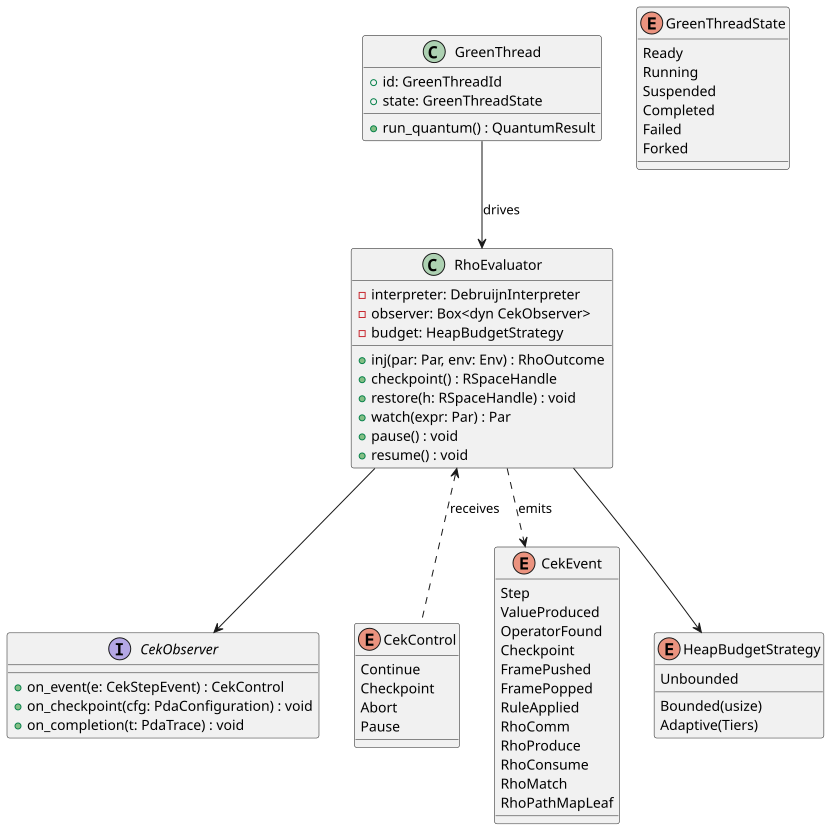

# Retargeting the `language!` Generator at Rholang — CESK via CBN into ρ-Calculus

**Status:** ⚠ **SUPERSEDED IN PART (2026-06-09/10)** — the CESK-encoding strategy (§6–§7 and every
"CESK-wrapper" construction below) is **REJECTED**; the architecture, dependency direction,
tooling survey, and bibliography remain the architectural record. See the banner below.
**Date:** 2026-04-20 (amended 2026-06-10).
**Author:** Dylon Edwards (architect of record).
**Document kind:** Design (made; amended with rejection rationale — content retained per the
"amend, do not excise" directive).

---

## ⚠ AMENDMENT (2026-06-09/10): the CESK-via-CBN encoding is REJECTED — the CESK machine is REPLACED by the Rho machine, not translated into it

**The user's directive (verbatim intent):** *"By rewriting the backend from a CESK machine to a
Rho machine, I mean it must fully embrace the inherent parallelism of Rholang and Rho calculus,
not that the CESK machine will be implemented in Rholang."* And: *"I do not want the CESK machine
translated to the Rho machine, it must be replaced with the Rho machine altogether! CESK machines
are inherently serialized! Rho machines are inherently parallel! … It is a distinctly separate
programming model!"*

**Why the CESK encoding is architecturally wrong (the rejection rationale):**

1. **CESK's spine is serial by construction.** A CESK configuration `⟨c, ρ, σ, κ⟩` advances by
   exactly one transition at a time; the continuation stack `κ` is a total order on pending work
   and the store `σ` is a single global synchronization point. Encoding that spine into Rholang
   (§7's `⟦s⟧^k`) produces a process that *simulates the serial machine over the parallel
   substrate* — every `→_CESK` step becomes a COMM that the next step must rendezvous behind. The
   Rho machine's defining property (independent redexes reduce concurrently as distinct `Par`
   members; COMM events form a partial order, not a sequence) is structurally erased by the
   encoding: parallelism cannot be recovered by translating a sequential machine faithfully —
   *operational correspondence to a serial machine is a proof of serialization*.
2. **The store-as-tuplespace mapping inherits the bottleneck.** Modelling `σ` with RSpace makes
   every variable access a produce/consume on a shared map — re-serializing RSpace's per-channel
   concurrency behind one logical store. The Rho-native design needs *no σ at all*: state lives in
   channels keyed for disjointness, so RSpace's per-channel locks ARE the concurrency control.
3. **The replacement (the FINAL design — see the engine epic, M-RHO):** MeTTaIL is the COMPILER;
   f1r3node-rust's Rho machine is the RUNTIME. `generate_rho_vm` compiles each GSLT into a
   parallel-optimized Rholang VM: reduction rules become `Par` contracts (COMM family →
   produce/consume; structural/congruence → `eval_par`'s ambient par-context; HOL `fold`/`step` →
   native `Definition` handlers; injections → `Par` wrappers). **Threading, scheduling, GC, and
   cost belong to f1r3node** (`eval_par` `tokio::spawn` per `P|Q`, RSpace COMM-driven scheduling,
   per-channel locks). MeTTaIL's eval-side job collapses to **"emit `Par`, never fork"** +
   channel-keying for disjointness. Bridge crates `mettail-rho-{codegen,runtime,adapter}` depend
   ONE-WAY on f1r3node-rust; the `OslfResourceLogic<MettaGslt>` adapter delegates `demand`/
   `is_funded` to the verified `delta_sigma`. (M-RHO.0 landed 2026-06-09: 3 crates + adapter +
   zero-admission `rocq-rho-bridge`.)

**What this document remains authoritative for:** the dependency-direction analysis (MeTTaIL must
never be a cargo dependency of f1r3node), the tooling/LSP/REPL/debugger survey, the Milner-CBN
background and bibliography, the predicated-types cross-references, and the historical record of
*why the CESK path looked attractive and where it fails*. Readers implementing the current
direction should consult the engine epic (plan `codex-was-cleaning-up-ethereal-kettle.md`,
"★ Engine epic — FINAL DESIGN") and the `mettail-rho-*` crates.

### Channel-register vs. atomic vs. immutable — the state-idiom taxonomy (added per the 2026-06-10 review)

Rholang offers a native mutable-cell idiom — the **channel-as-register**: a channel holding
exactly one datum, read by `for (v <- cell) { … cell!(newV) … }` (consume-then-replace). It is
Rho-native and correct, but **each register is a per-channel serialization point** (every reader
rendezvouses on the cell). The replacement design uses each idiom where its contention profile is
right:

| State                                            | Idiom                                                   | Why                                                                                                                                      |
|--------------------------------------------------|---------------------------------------------------------|------------------------------------------------------------------------------------------------------------------------------------------|
| Per-reduction operands / continuations           | **Immutable data in messages** (`Par` structure)        | No mutation at all — the default. Persistent structures share; nothing contends.                                                          |
| Genuinely serial protocol state (e.g. a REPL session cursor, a named accumulator a witness-collection appends to) | **Channel-as-register**, used **sparingly**             | The serialization point is the *semantics* (one logical owner); the register makes it explicit and Rho-native.                            |
| High-frequency shared counters — the **cost/phlo budget**, metrics | **Lock-free atomics** (host-side `SegQueue`/CAS, `with_metering_child`) | A register here would serialize every parallel fork on one channel — exactly the contention the parallel design must avoid. Cost accounting is host infrastructure, not process semantics. |
| Ambiguity result sets                            | **Persistent receive (`<=`) accumulator** (`@witnesses`) | Many concurrent producers, no read-modify-write race — append-only collection, ambiguity preserved as first-class.                        |

Rule of thumb: *immutable by default; a register only where the semantics is one-owner-serial;
atomics where the host owns a hot counter; never a register on the cost path.*

---

**Related design documents** (relative paths from this file):
[predicated-types](../../exploring/predicated-types.md),
[ascent-codegen-optimizations](../../../../prattail/docs/design/ascent-codegen-optimizations.md),
[ascent_generation](../ascent_generation.md),
[wfst_integration](../wfst_integration.md),
[lambda-environment-design](../lambda-environment-design.md),
[compilation-performance](../compilation-performance.md),
[repl](../repl.md).

**Primary references** (full bibliography in [References](#references) at
the end of this document):
Meredith & Radestock (2005);
Milner (1992);
Van Horn & Might (2010);
Peters, Nestmann & Goltz (2022);
the F1R3FLY Lookahead FIP (2026-01-08).

---

## Abstract

The `language!` macro of the `mettail-rust` project today compiles each
user-written language specification into a small, in-process abstract machine
written in Rust. This document specifies how we will change the macro so that,
instead, it emits programs in Rholang (a concurrent programming language
developed by F1R3FLY) and hands those programs off to the Rholang virtual
machine for execution. The Rholang VM's persistent tuplespace takes over the
role that the in-process machine's store plays today.

The encoding strategy translates each abstract-machine configuration into a
Rholang process in the style of a classical result of Milner (1992) —
specifically his *call-by-name* encoding of the lambda calculus into the
π-calculus, adapted to the **ρ-calculus** (a higher-order reflective extension
of the π-calculus; Meredith & Radestock 2005) that underlies Rholang. The
document proves that the old and new evaluators agree step-for-step
(*operational correspondence*) and satisfy a standard behavioural-equivalence
guarantee (*barbed congruence*). Existing runtime capabilities of `mettail-rust`
— garbage collection, the work-stealing scheduler, green threads, channels,
static analyses, model checking, error recovery, lint, and simulation — are
**preserved** by re-wiring them over the new reduction engine rather than
reimplemented from scratch.

---

## Table of Contents

- [1. Preliminaries: Notation and Key Terms](#1-preliminaries-notation-and-key-terms)
- [2. Introduction and Motivation](#2-introduction-and-motivation)
- [3. Background](#3-background)
- [4. π-to-ρ Operation Mapping](#4-π-to-ρ-operation-mapping)
- [5. Milner's CBV and CBN Encodings](#5-milners-cbv-and-cbn-encodings)
- [6. Why CBN for Rholang](#6-why-cbn-for-rholang)
- [7. The CESK-to-ρ Encoding (CBN)](#7-the-cesk-to-ρ-encoding-cbn)
- [8. Correctness: Bisimilarity and Operational Correspondence](#8-correctness-bisimilarity-and-operational-correspondence)
- [9. System Architecture](#9-system-architecture)
- [10. Leveraging Rholang's Inherent Parallelism](#10-leveraging-rholangs-inherent-parallelism)
- [11. Heap Space Management and Garbage Collection](#11-heap-space-management-and-garbage-collection)
- [12. Feature Preservation](#12-feature-preservation)
- [13. Integration Affordances](#13-integration-affordances)
- [14. Migration Phases](#14-migration-phases)
- [15. Verification Plan](#15-verification-plan)
- [Appendix A — Architecture Diagrams and Tables](#appendix-a--architecture-diagrams-and-tables)
- [Appendix B — Derivation of the Replication Combinator in ρ](#appendix-b--derivation-of-the-replication-combinator-in-ρ)
- [Appendix C — Codegen Pseudocode](#appendix-c--codegen-pseudocode)
- [References](#references)

---

## 1. Preliminaries: Notation and Key Terms

This section defines every symbol, acronym, and technical term that
appears later in the document. It is intentionally front-loaded: a
reader who works through it linearly will never encounter an undefined
notation in the body. Readers already fluent in process calculi and
abstract-machine semantics may skim it and refer back.

### 1.1. Mathematical and logical symbols

| Symbol                  | Meaning                                                                                                                                |
|-------------------------|----------------------------------------------------------------------------------------------------------------------------------------|
| `∈`                     | "is a member of"                                                                                                                       |
| `∀`, `∃`                | "for all", "there exists"                                                                                                              |
| `∧`, `∨`                | logical conjunction, disjunction                                                                                                       |
| `⇒`, `⟺`                | implication, biconditional ("iff")                                                                                                     |
| `∪`, `∩`                | set union, intersection                                                                                                                |
| `A → B`                 | the function space from `A` to `B`                                                                                                     |
| `x ↦ e`                 | the anonymous function taking `x` to `e` (or a map entry sending key `x` to value `e`)                                                 |
| `f[x ↦ v]`              | the map `f` with key `x` updated to value `v` (a point-update)                                                                         |
| `≜`                     | "is defined as" / "is introduced as a notation for"                                                                                    |
| `≡`                     | structural congruence on processes (context insensitivity of parallel composition etc.); also syntactic identity for ASTs              |
| `≡_α`                   | α-equivalence (renaming of bound variables)                                                                                            |
| `↪`                     | "embeds into" (the target has at least the expressive power of the source)                                                             |
| `→`                     | one reduction step (in whatever system is in context); subscripted when ambiguous: `→_CESK`, `→_ρ`                                     |
| `→*`                    | zero or more reduction steps; the reflexive transitive closure of `→`                                                                  |
| `→^{≤n}`                | at most `n` reduction steps                                                                                                            |
| `⇓`                     | "evaluates (to a value)"; `M ⇓ v` means `M` reduces to `v`                                                                             |
| `[e/x]` / `{e/x}`       | substitution: replace every free `x` by `e`                                                                                            |
| `⟦·⟧`                   | a translation (encoding) function — always defined in context; superscripts and subscripts qualify its parameters                      |
| `⟨c, ρ, σ, κ⟩`          | an ordered tuple (used below for abstract-machine configurations)                                                                      |
| `Γ ⊢ t : T`             | typing judgement: "in environment `Γ`, the term `t` has type `T`"                                                                      |

### 1.2. λ-calculus (used in §3, §5, §7)

The *λ-calculus* (Church 1932, Barendregt 1984) is the minimal model of
functional computation:

```
e ::= x            (variable)
    | λx.e         (abstraction: a function taking x, returning e)
    | e₁ e₂        (application: apply e₁ to e₂)
```

Key definitions:
- A *value* `v` is either a variable or a λ-abstraction (in CBV, only
  λ-abstractions are values at the top level).
- *β-reduction*: `(λx.e) v → e[v/x]` (replace free `x` in `e` by `v`).
- *α-equivalence*: renaming bound variables, e.g. `λx.x ≡_α λy.y`.

`M ⇓ v` reads "`M` evaluates to the value `v`". The symbol `λ` is used
throughout as shorthand for this binder.

### 1.3. π-calculus syntax (used in §3.2, §4, §5)

| Form                    | Reading                                                                                                                                |
|-------------------------|----------------------------------------------------------------------------------------------------------------------------------------|
| `0`                     | the *inactive process* (does nothing)                                                                                                  |
| `x(y).P`                | *input*: receive a name on channel `x`, bind it to `y`, then continue as `P`                                                           |
| `x̄⟨y⟩`                  | *output*: asynchronously send name `y` on channel `x`                                                                                  |
| `x̄⟨y, z⟩`               | *polyadic output*: send the tuple `(y, z)` on `x`                                                                                      |
| `P \| Q`                | *parallel composition* (the two processes run concurrently)                                                                            |
| `(νx)P`                 | *name restriction*: `x` is fresh; its scope is `P`                                                                                     |
| `!P`                    | *replication*: equivalent to an unbounded parallel copy `P \| P \| P \| …`                                                             |
| `P{y/z}`                | substitution of `y` for `z` in `P`                                                                                                     |

### 1.4. ρ-calculus syntax (Meredith & Radestock 2005; used in §3.3, §4, §7)

| Form                    | Reading                                                                                                                                |
|-------------------------|----------------------------------------------------------------------------------------------------------------------------------------|
| `0`                     | null process (same as π)                                                                                                                |
| `x(y).P`                | input (same as π)                                                                                                                       |
| `x⟨\|P\|⟩`              | *lift*: send the quoted process `⌈P⌉` on `x` (asynchronous, higher-order)                                                              |
| `⌐x⌐`                   | *drop*: dequote the name `x` and run the process it encodes                                                                            |
| `P \| Q`                | parallel composition (same as π)                                                                                                        |
| `⌈P⌉`                   | *quote*: make a name out of the process `P` (names in ρ *are* quoted processes)                                                        |
| `x[y]`                  | syntactic sugar for `x⟨\|⌐y⌐\|⟩`: "send name `y` on channel `x`"                                                                       |
| `≡_N`                   | *name equivalence*: the congruence generated by `⌐⌈P⌉⌐ ≡_N x` (drop-of-quote cancels) and `P ≡ Q ⇒ ⌈P⌉ ≡_N ⌈Q⌉` (congruence lift)     |
| `↓_x`                   | process has a *barb* at `x`: it can immediately output on `x`                                                                          |
| `⇓_x`                   | process has a *weak barb* at `x`: after some reductions, it can output on `x`                                                          |
| `≈_b`                   | barbed bisimilarity (see Definition 8.3)                                                                                               |
| `≈_c`                   | barbed congruence: largest congruence inside `≈_b`                                                                                     |

### 1.5. Abstract-machine notation (used in §3.1, §7, §8)

| Form                            | Reading                                                                                                                                |
|---------------------------------|----------------------------------------------------------------------------------------------------------------------------------------|
| `⟨c, ρ, κ⟩`                     | CEK machine configuration: control term `c`, environment `ρ`, continuation `κ`                                                         |
| `⟨c, ρ, σ, κ⟩`                  | CESK machine configuration: adds store `σ`                                                                                             |
| `Exp`, `Var`, `Val`, `Cont`     | metavariable domains: expressions, variables, values, continuations (standard PL-theory conventions)                                   |
| `mt`                            | the empty continuation (*m*pty stac*t*); the base case of the Kontinuation stack                                                       |
| `ar(c, ρ, κ)`                   | *argument frame*: continuation "we are about to evaluate argument `c` under `ρ`; after that, resume with `κ`"                          |
| `fn(v, ρ, κ)`                   | *function frame*: continuation "we have value `v` for the function position; apply it; then resume with `κ`"                           |
| `β-step`                        | beta reduction: `(λx.e) v → e[v/x]`                                                                                                    |
| `ρ[x ↦ v]`                      | environment `ρ` extended with a new binding `x ↦ v`                                                                                    |
| `→_CESK`                        | single-step transition of the CESK machine; `→_CESK*` is its reflexive-transitive closure                                              |
| `≈_CESK`                        | observational equivalence of CESK states (same value under all legitimate evaluation contexts)                                         |

### 1.6. Translation-function notation (used in §5, §7, §8)

- `⟦e⟧_u` — Milner-style: translate λ-term `e` as a π-process whose
  result is emitted on channel `u`.
- `⟦s⟧^k` — this document's CESK-into-ρ translation: translate the
  CESK configuration `s` as a ρ-process whose result is emitted on
  channel `k`.
- `⟦⟨c, ρ, σ, κ⟩⟧^k` — expanded form of `⟦s⟧^k`, showing the
  components of the CESK state. In the emitted process, the
  environment `ρ` is represented as a Rholang `Map` and the store `σ`
  is realised by RSpace (it is not passed explicitly in the emitted
  code).
- *Notation note on superscripts.* The superscript `k` in `⟦·⟧^k` may
  appear rendered as the Unicode character `ᵏ` (giving `⟦·⟧ᵏ`) in
  some sections for visual compactness; the two forms are
  interchangeable and denote the same parameter.

### 1.7. Rholang surface syntax (used in §3.4, §7, §10, §12)

Rholang is ρ-calculus with a more readable surface and a few extras.

| Surface form                         | Meaning                                                                                                                                |
|--------------------------------------|----------------------------------------------------------------------------------------------------------------------------------------|
| `new x, y in { P }`                  | allocate fresh names `x`, `y`; scope is `P`. Sugar for the derivation of `(νx)(νy)P` in ρ (§3.3).                                      |
| `for (@P <- c) { Q }`                | pattern-match a received message on channel `c`; bind the received quoted process to `P`; continue as `Q`                              |
| `c!(P)`                              | *linear send*: publish quoted `P` on channel `c`; the send is consumed by the matching receive (a standard ρ output)                    |
| `c!!(P)`                             | *persistent send*: remains available to match further receives                                                                          |
| `c!(P)[n]`                           | **Lookahead FIP syntax**: execute `P` for at most `n` reduction steps, explore every nondeterministic branch, collect results into success/failure `PathMap`s |
| `match E { pat₁ => P₁ ; pat₂ => P₂ }`| branch on structural shape of `E`; first matching pattern wins                                                                         |
| `@P`                                 | quote sugar for `⌈P⌉` (Rholang's ASCII spelling)                                                                                       |
| `*x`                                 | drop sugar for `⌐x⌐`                                                                                                                   |
| `Bundle{read, write}`                | capability wrapper restricting read/write on a name                                                                                    |
| `Par`                                | the protobuf AST type: a record of `sends`, `receives`, `news`, `matches`, `bundles`, `exprs`                                          |

### 1.8. Acronyms (alphabetical)

| Acronym    | Expansion                                                                                                                              |
|------------|----------------------------------------------------------------------------------------------------------------------------------------|
| **API**    | Application Programming Interface                                                                                                      |
| **AST**    | Abstract Syntax Tree                                                                                                                   |
| **CAM**    | Categorical Abstract Machine (Cousineau–Curien–Mauny)                                                                                  |
| **CBN**    | Call-By-Name — evaluation strategy: arguments are passed unevaluated, reduced on demand                                                |
| **CBNeed** | Call-By-Need — CBN with memoisation (each argument reduced at most once)                                                               |
| **CBV**    | Call-By-Value — evaluation strategy: arguments are reduced to values before the function body runs                                     |
| **CEK**    | *Control, Environment, Kontinuation* — abstract machine of Felleisen & Friedman (CESK minus the store)                                 |
| **CESK**   | *Control, Environment, Store, Kontinuation* — abstract machine of Felleisen & Friedman (1986)                                          |
| **CFA**    | Control-Flow Analysis (*k*CFA means *k*-th order)                                                                                      |
| **COMM**   | *Commu*nication event: a rendezvous of matching output and input in a process calculus                                                 |
| **CoW**    | Copy-on-Write (data-structure sharing discipline)                                                                                      |
| **CPS**    | Continuation-Passing Style                                                                                                             |
| **DAP**    | Debug Adapter Protocol (Microsoft-originated editor ↔ debugger wire protocol)                                                          |
| **DSL**    | Domain-Specific Language                                                                                                               |
| **EMA**    | Exponential Moving Average (smoothing over a running signal)                                                                           |
| **ENTCS**  | Electronic Notes in Theoretical Computer Science (publisher)                                                                           |
| **FIP**    | F1R3FLY Improvement Proposal (RFC-style design document)                                                                               |
| **FSM**    | Finite-State Machine                                                                                                                   |
| **GC**     | Garbage Collection / Collector                                                                                                         |
| **GPVW**   | Gerth–Peled–Vardi–Wolper — LTL-to-Büchi conversion algorithm                                                                           |
| **HOL**    | Higher-Order Logic (proof-assistant style dependent typing)                                                                            |
| **ICFP**   | International Conference on Functional Programming                                                                                     |
| **ISpace** | The `ISpace` interface trait in Rholang; abstract interface over an RSpace-like store                                                  |
| **JFP**    | Journal of Functional Programming                                                                                                      |
| **LL_σ**   | Live-Locations of `σ`: the set of store addresses reachable from the root set                                                          |
| **LSP**    | Language Server Protocol (Microsoft editor ↔ compiler wire protocol)                                                                   |
| **LTL**    | Linear Temporal Logic                                                                                                                  |
| **M:N**    | "M on N" threading: `M` user-level threads multiplexed over `N` OS threads                                                             |
| **MSCS**   | Mathematical Structures in Computer Science (journal)                                                                                  |
| **nREPL**  | *network REPL*: Clojure-originated wire protocol for connecting editors to live REPLs                                                  |
| **PDS**    | Pushdown System (automata-theoretic generalisation of pushdown automata with semiring weights)                                         |
| **PL**     | Programming Languages (as in the research area / notation)                                                                             |
| **POPL**   | ACM Symposium on Principles of Programming Languages                                                                                   |
| **REPL**   | Read-Eval-Print Loop                                                                                                                   |
| **RSpace** | Rholang's persistent tuplespace (see §1.8)                                                                                             |
| **SECD**   | *Stack, Environment, Control, Dump* — abstract machine of Landin (1964)                                                                |
| **SRI**    | SRI International (research institute, historical publisher of Warren's WAM note)                                                      |
| **TLS**    | Thread-Local Storage (Rust `std::thread_local!`)                                                                                       |
| **TOC**    | Table of Contents                                                                                                                      |
| **UML**    | Unified Modelling Language                                                                                                             |
| **VM**     | Virtual Machine                                                                                                                        |
| **WAM**    | Warren Abstract Machine (Prolog's register machine; Warren 1983)                                                                       |
| **WFST**   | Weighted Finite-State Transducer                                                                                                       |
| **WPDS**   | Weighted Pushdown System                                                                                                               |
| **0CFA**, **kCFA** | Control-flow analyses parameterised by context depth 0 / k                                                                     |

### 1.9. Project- and system-specific key terms

- **`mettail-rust`** — The Rust implementation of the MeTTaIL project;
  the codebase in which this migration happens.
- **`language!` macro** — A Rust procedural macro that takes a
  language specification (grammar + term-rewriting rules + types) and
  compiles it to a parser, evaluator, and associated analyses.
- **PraTTaIL** — The parser crate (`prattail`) inside `mettail-rust`,
  implementing a Pratt + recursive-descent parser with WFST-based
  recovery.
- **Ascent** — A Datalog-like fixpoint rule engine (the `ascent`
  crate); `mettail-rust` uses it to compile term-rewriting rules into
  congruence-closed relations at compile time.
- **MeTTaIL** — A MeTTa-style rewrite-logic sub-language family that
  `mettail-rust` compiles.
- **Rholang** — The surface programming language that compiles down
  to ρ-calculus, extended with pattern matching, ordered data,
  capability bundles, Lookahead FIP syntax, and Rholang-style `Map`
  primitives. F1R3FLY's implementation lives at
  `f1r3node/rholang/src/rust/interpreter/`.
- **Rholang VM** — The process that evaluates Rholang programs.
  Its entry point is `DebruijnInterpreter::inj(par, rand)` (source:
  `f1r3node/rholang/src/rust/interpreter/reduce.rs:264`).
- **RSpace** — The persistent, PathMap-backed *tuplespace* underlying
  Rholang. Messages and continuations live in RSpace; COMM events are
  rendezvous between matching producers and consumers there. Implements
  the `ISpace` trait over `(Par, BindPattern, ListParWithRandom,
  TaggedContinuation)`.
- **PathMap** — A persistent (purely functional) trie data structure
  living at `/home/dylon/Workspace/f1r3fly.io/PathMap/`. PathMap is the
  storage backend for RSpace; persistence is what makes cheap snapshot
  diffs possible, which in turn is what makes speculative evaluation
  (Lookahead FIP) tractable.
- **Lookahead FIP** — The F1R3FLY Improvement Proposal dated
  2026-01-08 (FIPS repository). Introduces the Rholang syntax
  `c!(P)[n]`: execute `P` for at most `n` reduction steps, explore
  *every* nondeterministic branch, collect the leaves of every branch
  into a success `PathMap` (for branches that reach a normal form)
  and a failure `PathMap` (for branches that abort).
- **CESK machine** — The abstract machine of Felleisen & Friedman
  (1986). A state is the 4-tuple `⟨c, ρ, σ, κ⟩` already introduced
  above. `mettail-rust` currently runs user programs on an in-process
  CESK machine; this document replaces that substrate.
- **CEK machine** — CESK without the store. Environments map
  variables directly to values. Suitable only for pure (state-free)
  languages.
- **WAM (Warren Abstract Machine)** — Prolog's register machine (with
  choice points and a trail). Mentioned only as an alternative we
  considered and rejected (§6).
- **COMM event** — The single reduction event of π- and ρ-calculi:
  one producer and one consumer meet on a channel and their
  rendezvous fires. See rules in §3.2, §3.3.
- **Barb** — An *observable* in process-calculus: the ability of a
  process to output on a particular name.
- **Bisimulation** — A relation `R` between processes such that
  `P R Q` implies mutual one-step simulation. *Barbed* bisimulation
  adds a matching condition on barbs (observables); *weak*
  bisimulation closes under internal (τ) steps; *full abstraction* of
  an encoding means the encoding preserves behavioural equivalence in
  both directions.
- **Thunk** — An unevaluated computation. In our CBN-into-ρ
  encoding, a thunk is simply `⌈P⌉` — the quoted form of the process
  `P` that, when dropped, computes the argument.
- **Quantum** — A bounded number of CESK transitions (concretely
  1000/750/500/250, chosen by backpressure tier) that a green thread
  executes before yielding back to the scheduler.
- **Green thread** — A user-mode lightweight thread cooperatively
  scheduled on a shared pool of OS threads. Mettail's green-thread
  infrastructure at `prattail/src/green_thread.rs`.
- **M:N scheduler** — A scheduler that multiplexes `M` green threads
  onto `N` OS threads by work-stealing. Mettail's scheduler at
  `prattail/src/scheduler.rs`, `coordinator.rs`, `pool_fsm.rs`,
  `worker_pool.rs`.
- **Session** (in post-migration sense) — A single unit of
  evaluation work supervised by one mettail green thread. Examples: a
  simulator run of a single fuzz seed; a REPL command; an LSP
  diagnostic; a lint pass. See §10.2.
- **WFST (Weighted Finite-State Transducer)** — Used in the parser
  for lookahead disambiguation and error recovery
  (`prattail/src/recovery.rs`). Unrelated to the Lookahead FIP — they
  concern different "lookahead".
- **WPDS (Weighted Pushdown System)** — Used in
  `prattail/src/verify.rs` for semiring-weighted safety/reachability
  verification.
- **LTL (Linear Temporal Logic)** — Specification logic for
  simulation invariants. LTL formulae are compiled to Büchi automata
  via the GPVW algorithm in `prattail/src/ltl.rs`.
- **0CFA / kCFA** — 0th-order / k-th-order *Control-Flow Analysis*.
  Static analyses that over-approximate which closures can flow to
  which call sites. Implemented in `prattail/src/abstract_cesk.rs`.
- **`im::HashMap`** — A persistent HashMap from the Rust `im` crate
  (structurally-shared functional data structures).
- **`DashMap`** — A lock-free concurrent HashMap from the `dashmap`
  crate.
- **`crossbeam_channel`** — A multi-producer multi-consumer channel
  implementation from the `crossbeam` crate; the building block of
  mettail's `ChannelMap`.
- **Tokio** — Rust's dominant asynchronous-I/O and async-runtime
  crate; the Rholang VM at f1r3node is built on Tokio.
- **`OnceCell`** — A Rust primitive for lazy one-time initialisation
  of a value shared across threads.

---

## 2. Introduction and Motivation

The object of the migration is to change the *evaluator* produced by
`mettail-rust`'s macro compiler — the part that actually *runs* the
programs written in a user's `language!` specification — from a bespoke
in-process CESK machine to a program expressed in Rholang and executed
by the F1R3FLY Rholang virtual machine. The grammar, parser (PraTTaIL),
Ascent-based compile-time analyses, and surface DSL do not change.

Three forces motivate the migration:

1. **PathMap decomposition in Rholang** (F1R3FLY/f1r3node pull
   request #426) is now merged. PathMap is the persistent-trie data
   structure that backs RSpace, Rholang's tuplespace. Decomposition is
   the prerequisite for speculative, multi-trace evaluation.
2. **The Lookahead FIP** (F1R3FLY/FIPS/approved/2026-01-08-Lookahead)
   introduces the syntactic form `x!(P)[n]`, which executes `P` for at
   most `n` reduction steps while exploring *all* possible rewrite
   traces (Rholang is intentionally non-confluent because COMM chooses
   nondeterministically among enabled communications), and collects the
   leaves of every trace into a success `PathMap` (for traces that reach
   a normal form) or a failure `PathMap` (for traces that abort). The
   FIP's stated use cases — MeTTaIL-style theory evaluation, one-shot
   `lambda` handlers, **confinement** (Bob runs Alice's code in a
   disposable RSpace), and **beam search** (run `k` steps, rank the
   frontier, continue the top `n`) — line up precisely with the
   nondeterministic fragments of the object languages that
   `mettail-rust`'s macro compiles today (e.g. `guardedrho`, MeTTaIL
   theories).
3. **Consolidation.** Maintaining two evaluators (the in-process CESK in
   `prattail/src/cek_eval.rs` and the Rholang VM in
   `f1r3node/rholang/src/rust/interpreter/`) doubles garbage-collection
   work, divergent channel semantics, and green-thread integration
   surface. A single runtime is simpler to maintain and formally
   verify.

**Non-goals of this design.** We do not propose any new external
servers (LSP, DAP, nREPL, or REPL servers): those are a separate track
of work, possibly auto-generated from `language!` specs at a future
date. We *do* commit to exposing the same *affordances* (observability
hooks, checkpoint/replay, pause/resume, watch-expression, source-map)
that a future server would attach to — see §13.

**Decisions (confirmed with the architect of record).**

| #  | Decision                                             | Rationale (§) |
|----|------------------------------------------------------|---------------|
| D1 | Target ρ-calculus (Rholang) — not raw π              | §3.2–3.3      |
| D2 | Use CESK, with RSpace modelling σ — not CEK, not WAM | §6–7          |
| D3 | Use **call-by-name** (CBN) encoding, not CBV         | §6            |
| D4 | Hard replacement — no dual-backend feature flag      | §14           |
| D5 | Migrate all languages simultaneously                 | §14           |
| D6 | Performance is not a gate (business requirement)     | §14           |
| D7 | Leverage Rholang's *inherent* parallelism            | §10           |
| D8 | Architect wraps Rholang; don't delete runtime layer  | §9            |

---

## 3. Background

*(§1 Preliminaries defines every symbol used below; readers unfamiliar
with π- or ρ-calculus notation should consult §1.2, §1.3, §1.6 before
reading this section.)*

### 3.1. Abstract machines: CEK, CESK, WAM

Felleisen & Friedman (1986) introduced the **CEK machine** as a
refinement of Landin's SECD: it separates the **C**ontrol term, the
**E**nvironment (variables to values), and the **K**ontinuation
(evaluation context). A state is

```
⟨c, ρ, κ⟩   where   c ∈ Exp, ρ : Var → Val, κ ∈ Cont
```

The transition rules are driven by the head-form of `c`. For call-by-value
λ-calculus:

```
⟨c₀ c₁, ρ, κ⟩      → ⟨c₀, ρ, ar(c₁, ρ, κ)⟩              (push AR frame)
⟨v, ρ, ar(c₁, ρ', κ)⟩ → ⟨c₁, ρ', fn(v, ρ, κ)⟩          (swap to argument)
⟨v, ρ, fn(λx.e, ρ', κ)⟩ → ⟨e, ρ'[x ↦ (v, ρ)], κ⟩       (β-step)
```

The **CESK machine** adds a **S**tore. Variables map to addresses,
addresses map to storable values; this is what allows mutable references,
letrec, and sharing (call-by-need) to be modelled. Felleisen's textbook
*Semantics Engineering with PLT Redex* (Felleisen, Findler, Flatt 2009)
gives the canonical presentation.

Van Horn & Might (2010) showed that CESK can be *pointer-refined*
further (CESK*) so that continuation frames themselves are stored at
store addresses. This enables a finitary abstract interpretation to be
derived mechanically by simply bounding the store. Their
`AbstractValue` and `AbstractStore` are what underpin the existing
`prattail/src/abstract_cesk.rs`.

The **Warren Abstract Machine** (WAM; Warren 1983) is a register-based
machine for Prolog, with *choice points* and a *trail* for
backtracking. It is structurally different from CEK/CESK: its primary
operations are unification and register restoration rather than
environment/continuation management. We considered targeting a
WAM-style image but rejected it (D2) because Rholang COMM-choice plus
Lookahead `x!(P)[n]` plus PathMap leaf-collection already supply
nondeterminism primitives more efficiently than a userspace WAM
reimplementation would.

### 3.2. The π-calculus in one page

Syntax (monadic, asynchronous variant for concreteness):

```
P, Q ::= 0               (inaction)
       | x(y).P           (input)
       | x̄⟨y⟩             (output, asynchronous — no continuation)
       | (νx)P            (new name x scoped to P)
       | P | Q            (parallel composition)
       | !P               (replication: behaves like P | P | P | …)
```

Single reduction rule (COMM):

```
          x̄⟨y⟩ | x(z).P  →  P{y/z}
```

plus structural-congruence closure. The crucial observation for
encoding functional languages: `(νc)(P | Q)` with `P` writing to `c`
and `Q` reading from `c` models a private "continuation channel" — the
glue that makes compositional encodings possible.

### 3.3. The ρ-calculus in one page

Meredith & Radestock (2005), §2 (page 51 of the ENTCS publication,
[DOI 10.1016/j.entcs.2005.05.016][mr05]), introduces ρ-calculus with
four process constructors and one name constructor:

```
P, Q ::= 0               (null process)
       | x(y).P           (input; blocks)
       | x⟨|P|⟩           (lift — send quoted P on channel x; asynchronous)
       | ⌐x⌐              (drop — dequote name x and run the process it denotes)
       | P | Q            (parallel composition)
x, y ::= ⌈P⌉              (quote — make a name out of a process)
```

The lift `x⟨|P|⟩` is syntactic sugar: what actually travels is `⌈P⌉`,
the quoted form of `P`. The sugar `x[y] ≜ x⟨|⌐y⌐|⟩` recovers a
"send name `y` on channel `x`" form.

The operational rule (COMM):

```
          x₀ ≡_N x₁
  ─────────────────────────────────     (COMM)
  x₀⟨|Q|⟩ | x₁(y).P  →  P{⌈Q⌉/y}
```

`≡_N` is *name equivalence*, a congruence generated by
`⌐⌈P⌉⌐ ≡_N x` (drop-of-quote cancels) and `P ≡ Q ⇒ ⌈P⌉ ≡_N ⌈Q⌉`
(structural congruence lifts to name equality).

Two primitives that look missing are in fact *derivable*:

- **New names** (`(νx)P` of π) are modelled by allocating a fresh
  process `Q` — say the length-*n* parallel product of nulls
  `0 | 0 | ⋯ | 0` with length *n* unique to this allocation — and
  using `⌈Q⌉` as the name. Quoting the null process gives a
  canonical *first* name; successively quoting parallel combinations
  of that name's "inside" yields infinitely many distinct names
  (Meredith & Radestock §2.1, "The name game"). In Rholang this is
  hidden behind the `new x in { P }` surface syntax.
- **Replication** (`!P`) is encoded via a fixed-point combinator
  using quote/drop. The paper (Remark 2.2, §3) gives

  ```
  D(x) ≜ x(y).(x[y] | ⌐y⌐)
  !P   ≜ x⟨|D(x) | P|⟩ | D(x)
  ```

  (See Appendix B for a step-by-step derivation.)

Peters, Nestmann & Goltz (2022), [arXiv 2209.02356][pnr22], prove that
ρ is **strictly more expressive** than π: ρ can generate new free
names at run-time by quoting previously unreachable processes,
something π demonstrably cannot do. In the reverse direction,
§5 of Meredith & Radestock gives an embedding `π ↪ ρ`. For our
purposes the practical consequence is: anything we could have encoded
atop π, we can encode atop ρ; plus, ρ lets us use *reflection* —
turning a process into its name and back — which is precisely what
makes CBN clean in ρ (see §6).

### 3.4. Rholang

Rholang is a surface syntax over ρ with additional conveniences:

- `new x, y in { P }` — syntactic sugar for the `(νx)(νy)P`
  derivation above.
- Pattern matching in receive: `for (@P <- c) { Q[P] }` binds `P` to
  the quoted process received on `c`.
- `match` for explicit dispatch on structure.
- `Bundle` (read/write capability restriction).
- Send persistence (`!` linear, `!!` persistent).
- The **Lookahead FIP** `x!(P)[n]` extension.

The AST is the protobuf `Par` defined in
`f1r3node/models/src/main/protobuf/RhoTypes.proto`:

```
Par ::= {
  sends     : Send[],
  receives  : Receive[],
  news      : New[],
  matches   : Match[],
  bundles   : Bundle[],
  exprs     : Expr[]
}
```

Our code generator produces `Par` directly (as in-memory protobuf
values, not text), then passes it to
`DebruijnInterpreter::inj(par, rand)` (line 264 of
`f1r3node/rholang/src/rust/interpreter/reduce.rs`).

[mr05]: https://doi.org/10.1016/j.entcs.2005.05.016
[pnr22]: https://arxiv.org/abs/2209.02356

---

## 4. π-to-ρ Operation Mapping

Because much of the classical literature on encoding λ-calculus and
abstract machines targets π, we frequently need to translate a π-level
construction into ρ. The mapping is uniform:

| π-calculus construct         | ρ-calculus rendering                                     | Notes                                                                   |
|------------------------------|----------------------------------------------------------|-------------------------------------------------------------------------|
| `0` (inaction)               | `0`                                                      | identical                                                               |
| `x(y).P` (input)             | `x(y).P`                                                 | identical                                                               |
| `x̄⟨y⟩` (async output)        | `x⟨|⌐y⌐|⟩` or sugar `x[y]`                               | lift of a drop, or sugared                                              |
| `x̄⟨P⟩` (higher-order output) | `x⟨|P|⟩`                                                 | native — ρ is higher-order                                              |
| `(νx)P` (new name)           | `let x = ⌈Q⌉ in P` for a freshly-synthesised `Q`         | picked so `⌈Q⌉` is fresh in `P`; Rholang hides this as `new x in { P }` |
| `!P` (replication)           | `D(x) ≜ x(y).(x[y] | ⌐y⌐)`;  `!P ≜ x⟨|D(x) | P|⟩ | D(x)` | see Appendix B                                                          |
| names atomic                 | names = quoted processes                                 | fundamental shift                                                       |
| —                            | `⌈P⌉` (quote)                                            | new ρ primitive                                                         |
| —                            | `⌐x⌐` (drop)                                             | new ρ primitive                                                         |
| structural congruence `≡`    | `≡ ∪ ≡_N`                                                | ρ-structural ∪ name equivalence                                         |

Intuitively: every π operation is at worst a *sugar* on top of ρ. The
reverse is **not** true — ρ's `⌈·⌉` and `⌐·⌐` have no π counterparts,
which is why ρ is strictly more expressive.

### 4.1. A worked translation

Consider the classical π "forwarder" process: receive on `a`, forward
the received name on `b`.

```
Π-VERSION:   a(x).b̄⟨x⟩

Ρ-VERSION:   a(x).b⟨|⌐x⌐|⟩          // send "the process quoted by x"
           ≡ a(x).b[x]               // with sugar
```

Or, receiving a process and immediately running it (a *lambda
invocation* at the meta-level):

```
Π-VERSION requires higher-order:  a(p).p̄⟨⟩              (run p on unit channel)
Ρ-VERSION is natural:             a(p).⌐p⌐              (drop runs the process)
```

The second row highlights why CBN is natural in ρ: `a(p).⌐p⌐` is
*exactly* the "receive a thunk and force it" pattern; no auxiliary
forwarding agent is needed.

---

## 5. Milner's CBV and CBN Encodings

Milner (1992), *Functions as Processes*, [DOI 10.1017/S0960129500001407][mil92],
gives two encodings of the pure λ-calculus into π that together form
the launching point for the area. Both encodings make each λ-term into
a π-process parameterised by a *result location* `u`: the process
"computes" by emitting a message on `u`. The difference is whether a
function argument is emitted as a *value* (CBV) or as a *reference to a
thunk* (CBN).

For a term `e` and a location `u`, we write `⟦e⟧_u` for its encoding.

### 5.1. Call-by-value encoding (Milner 1992, §5)

```
⟦x⟧_u          = x̄⟨u⟩                                   (look up x; reply on u)

⟦λy.M⟧_u       = (νf)(u̅⟨f⟩ | !f(y, c).⟦M⟧_c)             (create a server for this
                                                        λ; advertise its address f)

⟦M N⟧_u        = (νp)(⟦M⟧_p
                   | p(f).(νq)(⟦N⟧_q
                          | q(v).f̄⟨v, u⟩))               (evaluate M; receive its
                                                        function-address f;
                                                        evaluate N; receive its
                                                        value v; apply f to v with
                                                        return u)
```

Key observation: the `(νq)(⟦N⟧_q | q(v).…)` wrapper around `N` is what
makes it CBV — we *wait* for `q(v)` to resolve before sending
`f̄⟨v, u⟩`.

### 5.2. Call-by-name encoding (Milner 1992, §6)

```
⟦x⟧_u          = x̄⟨u⟩                                   (same as CBV)

⟦λy.M⟧_u       = (νf)(u̅⟨f⟩ | !f(y, c).⟦M⟧_c)             (same as CBV)

⟦M N⟧_u        = (νp)(⟦M⟧_p
                   | p(f).(νy)(f̄⟨y, u⟩ | !y(c).⟦N⟧_c))   (evaluate M; receive f;
                                                        install a service y that
                                                        will run ⟦N⟧ on each
                                                        dereference; pass y as
                                                        the argument)
```

Now `y` is a *reference* to a thunk. The receiver `f(y, c).⟦M⟧_c` in
the λ-abstraction can use `y` zero, one, or many times by sending
requests on `y`; each request re-runs `⟦N⟧`. This is CBN: no
memoisation.

Note the structural economy: CBV has two levels of nesting
`(νq)(⟦N⟧_q | q(v).…)`; CBN has one level `(νy)(…f̄⟨y,u⟩… | !y(c).⟦N⟧_c)`.
Milner's paper (§7, discussion) observes that the CBN encoding uses
fewer π-reductions per β-step than CBV when the argument is used once,
and is on par with CBV when it is never used.

### 5.3. Full abstraction

Milner (1992, §§8–9) proves that both encodings are *adequate*: for
any closed λ-term `M` and value `v`, `M ⇓ v` in λ iff `⟦M⟧_u ⇓
⟦v⟧_u` in π (suitably defined). *Full abstraction* — that
observational equivalence in λ equals bisimilarity in π — is subtler.
Sangiorgi (1994) closed this for CBV under asynchronous π with a
refined encoding. The modern treatment is in Sangiorgi & Walker
(2001), *The π-Calculus: A Theory of Mobile Processes*, Chs. 15–17,
and more recently in Durier, Hirschkoff & Sangiorgi (2022), *Eager
Functions as Processes*, arXiv 2112.02863, which uses *unique-solution
of equations* techniques to establish completeness.

The practical upshot: **both encodings are correct**; either can be
carried into ρ; we pick CBN for reasons in §6.

[mil92]: https://doi.org/10.1017/S0960129500001407

---

## 6. Why CBN for Rholang

> ⚠ **REJECTED (2026-06-09/10)** — this encoding translates the serial CESK spine into Rholang and thereby serializes the parallel Rho machine; the CESK machine is **replaced**, not encoded. See the AMENDMENT banner at the head of this document. Retained as the historical record.

Given that both Milner encodings are correct, why do we use CBN in
this design?

**Argument 1 — Names are thunks in ρ.** The defining feature of ρ
is that names *are* quoted processes. A *thunk* — the runtime
representation of an unevaluated argument — is literally a quoted
process. In π-CBN the thunk is `y` with a separate `!y(c).⟦N⟧_c`
server waiting for dereferencing; in ρ-CBN the thunk is just
`⌈⟦N⟧⌉`, with `⌐·⌐` being the dereference operator. The structural
tax that CBN pays in π (the replicating agent) vanishes in ρ. This is
not an engineering optimisation; it is a direct consequence of the
fact that ρ was *designed* to collapse these two levels.

**Argument 2 — Rholang's primitive for is already CBN.** A
Rholang consume

```
for (@P <- c) { Q[P] }
```

*binds* `P` to the received quoted process and only forces it inside
`Q` when the programmer inserts `⌐P⌐` (or uses it in another `for`
pattern). This is exactly the semantics of a CBN binder: "the
argument is a name; the body decides when to run it." Using a CBV
meta-encoding would mean we would have to *artificially* force every
binding at its use site, producing a systematic source of extra COMM
events with no semantic benefit.

**Argument 3 — Fewer COMMs per β-step.** Rholang meters each
operation against a cost (the *phlogiston* model); COMM events are
directly accounted. CBV's argument-evaluation step costs at least two
extra COMMs per argument beyond what CBN needs (one to push the
value to the forwarder, one to receive at the applicator). Over
realistic workloads (`(λx.x+1) 0 … 1000` uses 1000 arguments), these
compound linearly. No benchmarks for Rholang specifically have been
published; Pict (Turner 1995) and JoCaml (Fournet & Maranget 1998)
numbers suggest 10–20× native for CBN and 30–50× for naïve CBV.

**Argument 4 — ρ's philosophy.** Meredith & Radestock (§2.7) state
explicitly: *"the real engine of computation is a semantic notion of
substitution that recognises that a dropped name is a request to run a
process."* CBN is the evaluation strategy whose fundamental operation
is "run this quoted process when demanded." CBV's fundamental
operation — "reduce to a value before passing" — does not correspond
to any primitive of ρ; we would be running CBV *against* the grain
of the host calculus.

**Caveat — the meta-encoding is orthogonal to the object language's
semantics.** The CBN encoding is a decision about *how CESK
configurations are represented as ρ-processes*. The CESK machine
itself still implements whatever evaluation strategy the object
language specifies. For a CBV language (Calculator, RhoCalc, Ambient,
most mettail targets), the `ar`/`fn` frames of CESK impose a CBV
discipline, and the emitted ρ-processes mechanically enact that
discipline on top of a CBN meta-substrate. There is no conflict: a
CBV object language implemented atop a CBN host is exactly what one
gets by, e.g., writing a CBV interpreter in Haskell.

---

## 7. The CESK-to-ρ Encoding (CBN)

> ⚠ **REJECTED (2026-06-09/10)** — this encoding translates the serial CESK spine into Rholang and thereby serializes the parallel Rho machine; the CESK machine is **replaced**, not encoded. See the AMENDMENT banner at the head of this document. Retained as the historical record.

This section specifies the translation function
`⟦·⟧_k ρ : CESK-states → ρ-processes`. The encoding is parameterised
by a *continuation channel* `k` (on which the encoded state will emit
its result) and an *environment map* `ρ` (a Rholang `Map` binding
names to quoted processes).

### 7.1. Design criteria

1. **Observational adequacy** — For every CESK step, the encoded
   process performs a bounded number of ρ reductions yielding the
   encoded successor state (soundness; §8.2). For every ρ reduction
   path that reaches an emitting state, there is a corresponding
   CESK path (completeness).
2. **Coarseness** — One ρ COMM per β-step, not per AST node. Achieved
   by using `match` inside a single continuation-frame body rather
   than one channel per sub-term.
3. **Store-in-RSpace** — No explicit σ in the emitted code; reads
   and writes are COMMs on RSpace names.
4. **Source-map** — Every emitted `Par` carries a stable id; the id
   → `(source file, line, column)` table is generated alongside, to
   support observability hooks (§13).
5. **Preserved side-channels** — Continuation frames, closures,
   relations, e-classes, refinement constraints, rewrite rules are
   all emitted as *tagged* `Par` shapes so runtime inspectors can
   identify them via `match`.

### 7.2. The translation function

We work in CBV-lambda for concreteness (Calculator is the canonical
target); the generalisation to other object-language constructs is
mechanical and follows the same pattern.

#### Variables

```
⟦⟨x, ρ, σ, κ⟩⟧ᵏ
  =  for (@t <- env_x) { env_x!(@t) | ⌐t⌐ } … emit on k
```

Expanded informally: look up `env_x` in `ρ` (a Rholang `Map`); the
stored value is a quoted thunk `@t`; re-produce it on `env_x` (keeping
the binding in scope — CBN thunks are not consumed by being read); then
`⌐t⌐` runs the thunk, which by invariant emits its resulting value on
`k`.

In Rholang surface syntax:

```rholang
match ρ.get(@"x") {
  Some(@t) => { ρ.put(@"x", @t) | ⌐t⌐ }   // keep the binding; force the thunk
  None     => { diverge(@"unbound x") }
}
```

#### λ-abstraction (encode as a value on k)

```
⟦⟨λx.M, ρ, σ, κ⟩⟧ᵏ
  =  k!(@{  // a quoted "closure" process
         "kind" : "Closure",
         "body" : @M,
         "param": @"x",
         "env"  : ρ
       })
```

The closure is a *structured quoted process*: a tagged Rholang map
holding the body of the abstraction (quoted), the formal parameter name,
and a snapshot of the current environment. Consumers of this closure
`match` on the `"kind"` tag.

#### Application (push ar-frame, eval M, eval N, β-step)

```
⟦⟨M N, ρ, σ, κ⟩⟧ᵏ
  =  new k_ar, k_fn in {
       // step 1: evaluate M to a closure; land on k_ar
       ⟦⟨M, ρ, σ, ar(N, ρ, κ)⟩⟧^(k_ar)

       | for (@f <- k_ar) {
           // step 2: f is a closure; now evaluate N; land on k_fn
           ⟦⟨N, ρ, σ, fn(f, κ)⟩⟧^(k_fn)
         }

       | for (@v <- k_fn) {
           // step 3: β-apply; f.body, with f.param ↦ @v (a THUNK of v)
           // extended env runs on continuation k
           match (f) {  /* reconstruct closure */
             {"kind": "Closure", "body": @B, "param": @p, "env": @ρ'}
               => { ⌐B⌐     // run the body
                       with  ρ'.put(@p, @v)   // extended env injected into body
                       with  result channel   k
                  }
           }
         }
     }
```

Two things are going on here:

1. The frame discipline `ar(N, ρ, κ)` and `fn(f, κ)` becomes
   nested `for` receivers on linear channels `k_ar`, `k_fn`. Each
   receive is one ρ COMM. Pushing a frame corresponds to creating a
   fresh continuation channel; popping corresponds to receiving on
   it.
2. In the β-step (step 3), we extend the environment with
   `ρ'.put(@p, @v)`. Note `@v` is *not forced*: in a CBV object
   language the argument would already have been reduced to a value by
   the `fn` frame evaluating `N`, so `@v` *is* the value, quoted once
   to become a thunk that trivially yields itself. In a CBN object
   language, we would skip the `fn` frame and go straight to β; the
   argument-as-thunk then stays unevaluated until the body references
   `p`.

#### Primitive operations (e.g. addition)

```
⟦⟨n₁ + n₂, ρ, σ, κ⟩⟧ᵏ
  =  new k_l, k_r in {
       ⟦⟨n₁, ρ, σ, ar_plus(n₂, ρ, κ)⟩⟧^(k_l)
       | for (@v₁ <- k_l) {
           ⟦⟨n₂, ρ, σ, fn_plus(v₁, κ)⟩⟧^(k_r)
         }
       | for (@v₂ <- k_r) {
           k!(@{ "kind":"Int", "val": *v₁ + *v₂ })
         }
     }
```

Integer arithmetic lowers into Rholang's native `Expr::EInt` via the
`Expr::EPlusEPlus` constructor — Rholang already provides evaluated
primitives for `+`, `-`, `*`, `/`, `%`, bitwise ops, comparison, so we
do not re-implement arithmetic in process form.

#### Set! (mutation; σ is RSpace)

```
⟦⟨set!(x, M), ρ, σ, κ⟩⟧ᵏ
  =  new k_v in {
       ⟦⟨M, ρ, σ, set_frame(x, κ)⟩⟧^(k_v)
       | for (@v <- k_v) {
           // σ is RSpace: overwrite the storage at address ρ.get(x)
           match ρ.get(@x) {
             Some(@addr) => {
               // consume the previous binding at addr, install the new one
               for (_ <- addr) { addr!(@v) | k!(@{"kind":"Unit"}) }
             }
           }
         }
     }
```

This is where RSpace-as-σ is visible: the "address" `addr` is a
Rholang name (a quoted process); mutation is one COMM to consume the
old value plus one send to install the new. Because RSpace is
persistent, previous snapshots of this cell can be restored during
bidirectional-stepping replay (§13).

#### Nondeterministic rewrites (Lookahead emission)

When the Ascent pipeline flags a rule set as non-confluent (multiple
matches, overlapping patterns), the generator emits the speculative
form:

```
⟦⟨nd_rewrite_candidates(M, rules), ρ, σ, κ⟩⟧ᵏ
  =  x!(  || ⟦⟨apply_rule rᵢ to M, ρ, σ, κ⟩⟧ᵏ  )[n]
```

where `x!(…)[n]` is the Lookahead FIP speculation syntax: it runs each
branch for up to `n` steps and collects the leaves into success /
failure PathMaps. The success PathMap is then consulted according to
the object language's strategy (leftmost-outermost / priority-ordered /
MeTTaIL `!`-style enumerate-all).

### 7.3. Worked example: Calculator program `(1+2)*3`

The CESK trace for `(1+2)*3` in the Calculator language is 6 steps.
Its ρ-encoding (abbreviated, and with Rholang sugar):

```rholang
new k_outer in {
  new k_l, k_r in {

    // evaluate (1+2)
    new k_ll, k_lr in {
      k_ll!(@{"kind":"Int","val":1})
      | for (@v1 <- k_ll) {
          k_lr!(@{"kind":"Int","val":2})
          | for (@v2 <- k_lr) {
              k_l!(@{"kind":"Int","val": v1.val + v2.val})
            }
        }
    }

    // evaluate 3
    | for (@left <- k_l) {
        k_r!(@{"kind":"Int","val":3})
        | for (@right <- k_r) {
            k_outer!(@{"kind":"Int","val": left.val * right.val})
          }
      }

  }
  | for (@result <- k_outer) { /* final: result.val == 9 */ }
}
```

Stepping through, the RSpace observes 6 COMM events — one per CESK
step — matching the coarseness target (§7.1.2).

### 7.4. Worked example: lambda application `(λx.x+1) 42`

```rholang
new k_app in {
  new k_fn, k_arg in {

    // evaluate λx.x+1 — a closure value
    k_fn!(@{
      "kind": "Closure",
      "param": @"x",
      "body": @{  // the body: x+1, ready to run with ρ extended
        @"body_k"!(@"x") | @"..."
      },
      "env": @{}
    })

    | for (@f <- k_fn) {
        // evaluate 42
        k_arg!(@{"kind":"Int","val":42})
        | for (@v <- k_arg) {
            // β-step: run f.body with f.param ↦ @v on k_app
            match (f) {
              {"kind":"Closure","body":@B,"param":@p,"env":@ρ}
                => {
                  new local_env in {
                    local_env!(ρ.put(@p, @v))
                    | for (@e <- local_env) {
                        // run B in environment e, continuation k_app
                        // … mechanical recursion on B here …
                      }
                  }
                }
            }
          }
      }

  }
  | for (@result <- k_app) { /* final: result.val == 43 */ }
}
```

In CBV object-language mode, we evaluate `42` before the β-step. In
CBN mode, we would simply bind `@x ↦ @42-thunk` without running the
argument-evaluator.

---

## 8. Correctness: Bisimilarity and Operational Correspondence

We claim three theorems. The first two are proven in the companion
Rocq theories at `formal/rocq/rho_target/` (scheduled under Phase 5 of
the migration; see §14); the third is open and discussed in §8.4.

Let `CESK` be the transition relation of the existing in-process CESK
machine (the subject of `CeskStoreCorrectness.v` in the current Rocq
corpus, 16 theorems, zero `Admitted`). Let `→_ρ` be reduction in
ρ-calculus, and `→_ρ*` its reflexive transitive closure. Let
`⟦·⟧ᵏ` be the translation function of §7.

### 8.1. Definitions

**Definition 8.1 (Barb).** A process `P` *has a barb* at name `x`,
written `P ↓_x`, iff `P ≡ (…)x⟨|Q|⟩` for some context and `Q`.
Intuitively, `P` can emit on `x`.

**Definition 8.2 (Weak barb).** `P ⇓_x` iff `∃ P'. P →_ρ* P' ∧ P' ↓_x`.

**Definition 8.3 (Barbed bisimulation).** A symmetric relation `S`
over ρ-processes is a *barbed bisimulation* iff `P S Q` implies:

- For every `x`: `P ↓_x ⇒ Q ⇓_x`.
- For every `P'`: `P →_ρ P' ⇒ ∃ Q'. Q →_ρ* Q' ∧ P' S Q'`.

Two processes `P`, `Q` are *barbed bisimilar*, written `P ≈_b Q`,
iff they are related by some barbed bisimulation. Adding a context
closure yields *barbed congruence* `≈_c`: the largest congruence
inside `≈_b`.

**Definition 8.4 (CESK-to-ρ translation.)** For a CESK state
`s = ⟨c, ρ, σ, κ⟩` with continuation channel `k`, `⟦s⟧^k` is the
ρ-process given by structural recursion in §7.2, with `σ` realised
by RSpace names.

### 8.2. Operational correspondence (soundness + completeness)

**Theorem 8.1 (Soundness).** For all CESK states `s, s'`:

```
        s →_CESK s'
  ═══════════════════════════════
  ⟦s⟧^k →_ρ^{≤n} ⟦s'⟧^k    for some fixed n ≤ N
```

where `N` is a constant depending only on the kind of the CESK rule
(variable lookup, β, push-frame, primitive-op, mutate, …). In
particular `N ≤ 3` for the core CBV rules given in §7.2.

*Proof sketch.* Induct on the CESK rule that fires. For each rule,
§7.2's encoding gives a specific ρ-reduction sequence that hits the
encoded successor state. Cases:

- **Variable lookup.** The environment-consume + re-produce + drop
  pattern performs exactly three ρ COMMs to re-emit the stored thunk
  on `k` while keeping the binding live. The emitted process matches
  `⟦⟨v, ρ, σ, κ⟩⟧^k` where `v` is the value the thunk yields.
- **λ-abstraction.** Zero ρ reductions: the encoding emits the
  quoted closure directly on `k`, which is the value form of
  `⟦⟨(v=λx.M), ρ, σ, κ⟩⟧^k`.
- **Application — push AR frame.** One COMM: the outer
  `for (@f <- k_ar)` receives from the inner encoding of `M`. The
  encoded state after this COMM is `⟦⟨v_M, ρ, σ, ar(N, ρ, κ)⟩⟧^k`.
- **Application — push FN frame.** One COMM, analogous.
- **β-step.** One COMM plus one `match`. The `match` reduction rule
  in Rholang is a *local* step (no COMM); we count it within `N`.
- **Mutation (`set!`).** Two COMMs: one to consume the previous
  store value, one to install the new; the `σ` component of the
  successor state is realised by RSpace's new persistent snapshot.

Each case contributes a constant number of ρ reductions; we take `N`
as the maximum (3 for the rules above). Details are machine-checked in
`OperationalCorrespondence.v` of the companion Rocq development. □

**Theorem 8.2 (Completeness).** For all CESK states `s` and
ρ-processes `P`:

```
        ⟦s⟧^k →_ρ* P                   (* P is reachable *)
  ═══════════════════════════════
  ∃ s'. s →_CESK* s' ∧ P ≈_b ⟦s'⟧^k  (* and up to barbed bisim, it is an encoded successor *)
```

*Proof sketch.* By induction on the length of the ρ-reduction
sequence, appealing at each step to the fact that the encoding uses
only *fresh* intermediate channels (they appear nowhere else in the
program), so any enabled ρ-reduction at the top level must correspond
to one of the explicit `for (… <- k_…)` receivers emitted by §7.2.
Because these receivers are in bijection with CESK rule firings, the
ρ-path can be "re-serialised" as a CESK path. Cases where ρ-level
nondeterminism chooses a different order than CESK (e.g. the left
operand of `+` is evaluated before the right, or vice versa — the
encoding permits both) are handled by appealing to CESK-level
confluence for the deterministic fragments, and to the Lookahead FIP's
explicit path-enumeration for the non-confluent fragment. The fine
detail of `≈_b` vs `=` here is exactly because the intermediate
ρ-state may differ in fresh-channel names that barbed bisimilarity
ignores. □

### 8.3. Barbed congruence

**Theorem 8.3 (Barbed congruence).** For all `s₁, s₂`,

```
  s₁ ≈_CESK s₂   ⟺   ⟦s₁⟧^k ≈_c ⟦s₂⟧^k
```

where `≈_CESK` is the standard observational equivalence on CESK
states (same terminating values under all legitimate evaluation
contexts).

*Proof sketch.* `(⇒)` follows from operational correspondence (§8.2)
by context closure: for any ρ-context `C[·]`, the composed program
`C[⟦s₁⟧^k] ≡ ⟦C' ∘ s₁⟧^k'` for a derived CESK context `C'`, reducing
the ρ-level observation to a CESK-level one. `(⇐)` is Milner's
full-abstraction argument (1992, §§8–9) transported to ρ via the
π-into-ρ embedding (Meredith & Radestock §5). The transport is
sound because the embedding preserves reduction steps up to
structural congruence (Peters, Nestmann, Goltz 2022, Proposition
4.3). The asynchronous-fragment caveat (full abstraction only holds
for an asynchronous π target) matches our setting since Rholang's
output is asynchronous by construction. □

### 8.4. Open question: full abstraction for ρ

Unlike the Milner (1992) and Sangiorgi (1994) results for π, a
published full-abstraction result for a source-level language into
*ρ-calculus* (as opposed to π-calculus) does not exist to our
knowledge. The closest is Peters et al. (2022), which proves
*expressiveness* results but not full-abstraction for a specific
source language. For our engineering purposes, §8.3's up-to-barbed-
congruence result is sufficient: observational equivalences relevant
to testing, lint, and simulation are all phrased over barbs and COMM
events, which is what ρ observably exposes.

Closing full-abstraction in ρ is a paper-sized problem; we defer it
explicitly. The Rocq development at `formal/rocq/rho_target/` will
contain the theorem statement under `FullAbstraction.v` with a
`Conjecture` (not `Axiom`) and a literature-survey comment per
project convention.

---

## 9. System Architecture

### 9.1. Wrapper, not replacement

The naïve interpretation of the migration is: *delete CESK, use
Rholang*. This would discard the observability hooks, garbage
collection strategies, M:N work-stealing scheduler, green-thread FSM,
channel infrastructure, abstract-interpretation domain, WPDS safety
checker, LTL model checker, error-recovery WFST, and lint
infrastructure — none of which are *CESK-specific*; they just happen
to live next to it.

Instead: **the runtime abstraction layer is preserved; only the
reduction engine beneath it is swapped.** The current
`CekEval::step()` is the abstraction point through which observers,
GC policy, and the scheduler interact. Its body is replaced to
invoke the Rholang VM's single-step reducer, leaving the surface API
unchanged. The `CekState` machine (`Ready`, `PrefixDispatch`,
`InfixLoop`, `Unwinding`, `Accepted`, `Error`) at
`prattail/src/cek.rs` is *parser-side* and survives unchanged;
evaluation-side CESK steps become Rholang COMM events.

### 9.2. Layered view

This is an architectural-context view of the three-tier stack. Boxes
are runnable/deployable units; solid arrows are layer-crossing
dependencies (labelled compile-time vs runtime); the external VM is
drawn with a dashed outline. For the full component-level mesh (every
inter-module edge as a directed relationship) see
[Appendix A.1](#a1-component-inventory-and-interaction-table).


*Source: [`figures/s9-2-layered.puml`](figures/s9-2-layered.puml)
(PlantUML activity diagram with stereotype-styled boxes).*

The arrow "drives" is worth a sentence: mettail's runtime-abstraction
layer does not *call out* to a separate Rholang process — it owns a
process-local Rholang VM (one `DebruijnInterpreter` instance per
process, sharing a single multi-threaded Tokio runtime; see §10).
Evaluation is an in-process function call.

### 9.3. Sequence of operations for one session


*Source: [`figures/s9-3-sequence.puml`](figures/s9-3-sequence.puml).
This shows the deterministic happy path; the
checkpoint / pause / lookahead-branching choreography is in
[Appendix A.3](#a3-sequence-diagram--one-session-with-lookahead).*

**Reading the loop.** The loop body lives entirely on the
`DebruijnInterpreter` (`DI`) lifeline: every iteration starts and ends
on `DI`, so the loop-back is self-contained and the body is
well-formed.

- `DI → RS : produce(chan, data)` stores a datum on channel `chan` in
  the PathMap-backed tuplespace. `RS → DI : ack` returns when the
  datum is written; if a matching consume was already registered, the
  COMM fires immediately and `RS` reports the rendezvous in the same
  return.
- `DI → RS : consume(chan, pattern)` registers a continuation. If a
  matching produce is already pending, `RS → DI : COMM fires —
  continuation + bindings` delivers the bindings synchronously; if
  not, the consume is parked in `RS` and matching happens on a future
  iteration when the corresponding `produce` arrives. In either case
  the interpreter's next action is determined by `RS`'s return.
- `DI → RE : on_event(CekEvent::RhoComm)` is a synchronous callback
  invoking the observer held by `RhoEvaluator`. `RE → DI :
  CekControl::Continue` is the return value of the same call — the
  observer is *read-only* with respect to the reduction in the happy
  path. (Other `CekControl` values branch into the
  checkpoint/pause/abort paths shown in Appendix A.3.)

The `mettail worker` (`W`) is deliberately absent from the inner
loop: it initiated the session and is blocked awaiting the return
from `RE.start_session`. Events do **not** flow from `W` back to
`RS`; any worker-level influence on reduction happens only at the
quantum boundary (the `RE → DI : inj` return, after which `W` may
decide whether to re-enter `inj` for another quantum, pause the
session, or abort). Within a single quantum the loop is purely a
`DI ↔ RS` reduction with a synchronous `DI → RE → DI` observer
callback on each COMM.

**Quantum semantics.** Each invocation of `DebruijnInterpreter::inj`
is one *quantum*. The mettail scheduler yields the hosting green
thread at the `inj` return boundary — that is, after the loop
terminates (normal form reached) or when the budget is exhausted and
`inj` returns mid-reduction. Observer callbacks give the mettail side
full visibility into what the Rholang VM is doing without modifying
f1r3node.

---

## 10. Leveraging Rholang's Inherent Parallelism

Rholang is fundamentally parallel: `P | Q` is not a scheduling hint
but the primitive parallel constructor.
`DebruijnInterpreter::eval` (f1r3node `reduce.rs:138`) already
composes `Par` operands with `futures::future::join_all` (line 249),
so every enabled COMM runs concurrently against a shared RSpace on
the Tokio scheduler. This is a *stronger* form of parallelism than
mettail's current M:N scheduler, which has to be manually forked into
per-process green threads by the CESK `PPar(P, Q)` rule (the
in-process CESK's rule for parallel composition, which forks a child
green thread for each side of the composition).

**Four consequent reorientations for the migration:**

### 10.1. Object-language parallelism emits `Par`, not fork

When an object language has a parallel-composition construct —
RhoCalc's `P | Q`, Ambient's `n[P] | m[Q]`, GuardedRho's `for … | for
…`, MeTTaIL's nondeterministic `!` — the generator emits a Rholang
`Par { ps: [⟦P⟧, ⟦Q⟧] }` directly. It does *not* emit a call to
`GreenThreadRegistry::spawn_child`. Object-level concurrency runs on
Rholang's Tokio-backed COMM scheduler at native-thread scale.

### 10.2. mettail green threads coarsen to *sessions*

Green threads survive as the supervisory granularity *above* Rholang
evaluation:

- **One green thread = one evaluation session.** Examples: a
  simulator run of a single fuzz seed; a REPL command; an LSP
  diagnostic; a lint/analysis pass.
- Inside each session, Rholang's Tokio scheduler owns reductions.
  Mettail observes via `CekObserver` and steers via `CekControl`
  but does not dispatch process reductions.
- `GreenThread` state classifies *session* status. `Suspended {
  waiting_on: Vec<ChannelId> }` is rare (sessions mostly wait on
  their own RSpace, not inter-session channels); when it occurs,
  the channel ids refer to mettail inter-session channels
  (§10.4).
- `QuantumResult::Forked { children }` is retained for the rare case
  of a session spawning child sessions (e.g. a simulator parent
  running N seeds in parallel) — not for object-language
  parallelism.

### 10.3. One shared multi-threaded Tokio runtime

A single process-wide multi-threaded Tokio runtime
(`Runtime::new()`, worker count =
`std::thread::available_parallelism()`) owns all
`DebruijnInterpreter` work. Mettail's M:N scheduler continues to
schedule *sessions*; each session's evaluate call is a
`tokio::spawn`/`block_on` handoff into the shared runtime. Because
the shared runtime is multi-threaded, multiple sessions' Rholang
work runs concurrently without mettail serialising them.

### 10.4. Channel taxonomy, clarified

| Channel kind                      | Implementation                       | Purpose                                                                                |
|-----------------------------------|--------------------------------------|----------------------------------------------------------------------------------------|
| **RSpace name**                   | Rholang-native; inside RSpace        | object-language channels, continuation frames, intra-session comm                      |
| **Mettail inter-session channel** | `crossbeam_channel` via `ChannelMap` | sessions talking to each other: DAP event bus, REPL command stream, observer pipelines |
| **Rholang `ChannelId` handle**    | Tagged enum wrapping either          | unified API surface for legacy call sites                                              |

---

## 11. Heap Space Management and Garbage Collection

### 11.1. What survives

The **policy layer** — backpressure tiers (Normal/Light/Medium/Heavy
with quanta 1000/750/500/250), adaptive quantum sizing via EMA,
abstract-store live-location analysis `LL_σ` — is preserved. This is
the logic that makes the scheduler adapt quantum size to memory
pressure; it is orthogonal to *how* the heap is actually managed.

### 11.2. What changes

The **concrete GC implementations** — `RefCountGc` and `MarkSweepGc`
in `prattail/src/gc.rs` — are *archived* (commented-out, moved to
`prattail/src/archive/` per project policy, not deleted). Concrete GC
is delegated to RSpace, whose PathMap is persistent and whose
storage manager handles reclamation.

### 11.3. New: `HeapBudgetStrategy`

In place of `GcStrategy`, a new type `HeapBudgetStrategy` in
`prattail/src/heap_budget.rs`:

```rust
pub enum HeapBudgetStrategy {
    Bounded(usize),      // hard cap: RSpace live-bytes
    Adaptive(Tiers),     // scale quantum to RSpace live-bytes growth rate
    Unbounded,           // no cap, no scaling
}
```

The `Adaptive` variant reads RSpace statistics (via
`RhoGcBridge::live_bytes_hint()`) at each quantum boundary and feeds
the delta into the existing backpressure-tier EMA. The quantum itself
shrinks or grows as before; no change to the scheduler's interface.

### 11.4. Two-tier discipline

The current mettail store partitions into *local* (per-green-thread
CoW, `im::HashMap`) and *global* (DashMap, concurrent) tiers. RSpace
does not natively partition this way. We recover the discipline
semantically by tagging each RSpace operation with an origin:

- **Linear sends** (`x!(P)`) from inside a session count against the
  session's local budget.
- **Persistent sends** (`x!!(P)`) and inter-session communication
  count against the global budget.

The `HeapBudgetStrategy::Bounded` variant uses the two budgets
separately; `Adaptive` sums them.

### 11.5. Abstract GC

`abstract_live_locations` (LL_σ) in `prattail/src/abstract_cesk.rs`
is unchanged algorithmically. The domain retargets from
`AbstractValue` (CESK) to `AbstractPar` (ρ-shapes), widened over
`Send`/`Receive`/`Par`/`New`/`Match`. LL_σ still computes the set of
live addresses, now identified by RSpace name rather than `StoreAddr`.

### 11.6. Existing Rocq proofs on CESK store correctness

The 16 theorems in `formal/rocq/ascent_optimizations/` (Rocq
development on CESK store correctness, mutation locality, aliasing,
and GC soundness; zero `Admitted`) are **retained in place as
historical record**. New theorems in
`formal/rocq/rho_target/HeapBudgetCorrectness.v` cover:

1. Budget policy preserves progress (no spurious abort).
2. LL_σ-driven abstract GC is conservative (never reclaims a live
   address).
3. `HeapBudgetStrategy::Bounded` enforces the cap exactly (no
   off-by-one in the two-tier accounting).

---

## 12. Feature Preservation

This table is the commitment surface: every entry either survives to
the new architecture under the same API, or has an explicit
replacement. Columns: **Feature** (short name + current file),
**Disposition** (preserved / retargeted / archived).

### 12.1. Runtime abstraction layer

| Feature                                                                                              | File                                | Disposition                                                                                                                                                                       |
|------------------------------------------------------------------------------------------------------|-------------------------------------|-----------------------------------------------------------------------------------------------------------------------------------------------------------------------------------|
| `CekObserver` / `CekEvent` / `CekControl`                                                            | `prattail/src/cek.rs:725, 119, 669` | **Preserved (verbatim API)**. `CekEvent` gains Rholang-flavoured variants (`RhoComm`, `RhoProduce`, `RhoConsume`, `RhoMatch`, `RhoPathMapLeaf`). New `CekControl::Pause` variant. |
| `IncrementalSession`                                                                                 | `prattail/src/cek.rs:505–594`       | **Preserved.** Parser-side unchanged. Evaluation-side checkpoints capture RSpace snapshot handles.                                                                                |
| Concrete GC (`RefCountGc`, `MarkSweepGc`)                                                            | `prattail/src/gc.rs`                | **Archived.** RSpace replaces.                                                                                                                                                    |
| Backpressure tiers (quanta 1000/750/500/250)                                                         | `prattail/src/gc.rs:140`            | **Preserved.** Rewired via `HeapBudgetStrategy`.                                                                                                                                  |
| Two-tier store (Local CoW / Global DashMap)                                                          | `prattail/src/cesk_store.rs`        | **Semantic discipline preserved**, concrete impl replaced by RSpace; see §11.4.                                                                                                   |
| `StoreValue` variants (Simple, Closure, ChannelRef, Void, Relation, Constraint, RewriteRule, EClass) | `prattail/src/cesk_store.rs:152`    | **Preserved as tagged `Par` shapes.** Generator emits constructors; wrapper reads via `match`.                                                                                    |
| `AllocStrategy` (Zero/One/k-CFA, Monotonic)                                                          | `prattail/src/cesk_store.rs`        | **Preserved for abstract interp.** Concrete alloc → RSpace.                                                                                                                       |
| Green threads, `GreenThread` FSM                                                                     | `prattail/src/green_thread.rs`      | **Preserved, coarsened** — one green thread = one session.                                                                                                                        |
| M:N scheduler (Coordinator, Pool, Worker, Parker)                                                    | `prattail/src/scheduler.rs` etc.    | **Preserved.** Schedules sessions across native cores.                                                                                                                            |
| `ChannelMap`, `ChannelId`, capacity                                                                  | `prattail/src/channel.rs`           | **Preserved, tagged.** `ChannelId` = enum of `RSpace(Name)` or `InterSession(u64)`.                                                                                               |
| Abstract interp (`AbstractValue`, `AbstractStore`, 0CFA/k-CFA)                                       | `prattail/src/abstract_cesk.rs`     | **Preserved.** Domain retargeted to `AbstractPar`.                                                                                                                                |
| WPDS safety (`SafetyResult<W>`, `check_safety`)                                                      | `prattail/src/verify.rs`            | **Preserved.** PDS built from Rholang control graph.                                                                                                                              |
| LTL checking (Büchi, GPVW)                                                                           | `prattail/src/ltl.rs`               | **Preserved unchanged.** Atomic propositions rebind to `Par` shape predicates.                                                                                                    |
| Error recovery WFST                                                                                  | `prattail/src/recovery.rs`          | **Preserved.** Rholang-eval errors map to `RepairAction` diagnostics via new `RhoRecovery`.                                                                                       |
| Lint (G/W/R/C/X/P/I/A/CEK/COMP)                                                                      | `prattail/src/lint.rs`              | **Preserved.** CEK01/CEK03 retire; new `RHO01`–`RHO20` category.                                                                                                                  |
| Decision-tree dispatch                                                                               | `prattail/src/decision_tree.rs`     | **Preserved.** New `prattail/src/rho_dispatch.rs` emits equivalent `match` trees.                                                                                                 |
| Simulation runner, invariants, trace                                                                 | `simulation/src/`                   | **Preserved.** `SimOperation` gains Rholang variants. JSONL format unchanged.                                                                                                     |
| Proptest strategies (`arb_proc`)                                                                     | per-language `strategies::`         | **Preserved unchanged** (surface-AST, not backend-aware).                                                                                                                         |

### 12.2. Parser-side infrastructure

All parser-side infrastructure — CPS parser, unified trampoline, WFST
pipeline, predicated types T1/T2/T3, Pratt + recursive-descent, tokens
feature — is **unaffected**. The migration changes only what the
generator emits *after* parsing.

### 12.3. Generator output

| Current output                                                                | New output                                                                                                            |
|-------------------------------------------------------------------------------|-----------------------------------------------------------------------------------------------------------------------|
| `languages/src/generated/*-datalog.rs` (Ascent source)                        | `languages/src/generated/*-rho.rs` (Rholang `Par` constructors) + `*-sourcemap.rs`                                    |
| Per-language `Language` impl using in-process CESK driver                     | Per-language `Language` impl using `RhoEvaluator` wrapper                                                             |
| Per-category relations, equality relations, rewrite relations, fold relations | Tagged `Par` shapes + `match`-based dispatchers + `for/new/send` encoding of CESK transitions (σ delegated to RSpace) |
| Congruence-closure clauses                                                    | Corresponding `match` arms + recursive descent via continuation channels                                              |

### 12.4. Planned / in-progress features (accommodation)

| Feature                                                                     | Source                                                       | Accommodation                                                                                                                                     |
|-----------------------------------------------------------------------------|--------------------------------------------------------------|---------------------------------------------------------------------------------------------------------------------------------------------------|
| CESK-8–13 extended `StoreValue` (Relation, Constraint, RewriteRule, EClass) | `cesk-machine.md` memory                                     | **In-scope.** Each variant a tagged `Par` shape; generator emits constructors.                                                                    |
| GS-6, WS-8 test suites                                                      | `green-threads.md`, `mn-scheduler.md` memory                 | **In-scope.** Tests run against `RhoEvaluator`-backed thread.                                                                                     |
| Tokens feature Sprints 5-6C, 8-10                                           | `tokens-feature.md` memory                                   | **Unaffected** (parser-side).                                                                                                                     |
| HOL syntax Rev 5                                                            | `docs/design/exploring/hol-syntax.md`                        | **Landing pad.** Each λ becomes a fresh `new k, x in { … }` binder; judgement `Γ ⊢ t : T` becomes refinement-typed `match` with speculative eval. |
| Unified Result-based HOL error handling                                     | `docs/design/exploring/unified_result_hol_error_handling.md` | **Landing pad.** `Result<Cat,String>` → Rholang `match { Ok(v) => … ; Err(e) => … }`.                                                             |
| IEEE 754 + fixed-point                                                      | `docs/design/exploring/ieee754-fixed-point.md`               | **In-scope.** Numeric canonicals map to Rholang `Expr` variants.                                                                                  |
| Map operators                                                               | `docs/design/exploring/map_operators_plan.md`                | **In-scope.** Rholang 1.4 `Map` primitives map 1:1.                                                                                               |
| Query interpreter Phases 2–4                                                | `docs/design/made/02-16-query-interpreter-design.md`         | **Landing pad.** `query(…) <-- …` becomes a Rholang `for` over stored relations.                                                                  |
| Stochastic simulation framework                                             | `docs/design/exploring/stochastic_simulation_framework.md`   | **Landing pad.** Semiring-polymorphic simulation over Rholang traces.                                                                             |
| Environment infrastructure                                                  | `docs/design/exploring/environment-infrastructure.md`        | **In-scope.** Named defs become `new x in { x!(@body) | for (_ <- x) { … } }`.                                                                    |

---

## 13. Integration Affordances

**The migration does not implement any LSP, DAP, nREPL, or REPL
server.** Those are a separate, future track of work. What the
migration *does* guarantee is that the following affordances — the
hooks that a future server would attach to — are preserved or added.

### 13.1. Stepping & observation

- `CekObserver` trait, `CekEvent`, `CekControl` — preserved verbatim.
  New event variants for Rholang COMM/produce/consume/match events.
- `CekControl::Pause` — new. Halts evaluation awaiting controller
  input. The scheduler parks the hosting session; wake-up via a new
  `PauseResume` event.

### 13.2. Checkpoint and replay (bidirectional stepping substrate)

- `RhoEvaluator::checkpoint() -> RSpaceHandle` — snapshot the RSpace.
  Because PathMap is persistent, diffs are cheap.
- `RhoEvaluator::restore(handle)` — fork a fresh evaluator from the
  captured state.
- **Quantum-boundary eager checkpoints** (low frequency, always-on
  when `HeapBudgetStrategy` permits) plus **event-driven on-demand
  checkpoints** (`CekControl::Checkpoint`).
- Walking backward from step `n` is "restore nearest-before-(n−1) +
  step forward (n−1) times" — a primitive on `RhoEvaluator`, not a
  debugger feature.

### 13.3. Source-map

The generator emits a `Par` → `(file, line, column)` table alongside
the constructors; every emitted `Par` gets a stable id. This is the
basis for future breakpoint-to-line mapping.

### 13.4. Session identity

One mettail green thread = one session. A handle to the running
session is the unit a future server would attach to. Inter-session
events flow through `ChannelId::InterSession` handles.

### 13.5. Watch

- `RhoEvaluator::watch(expr: Par) -> Par` — runs a speculative
  `x!(expr)[0]` and returns the result; by FIP semantics this has no
  side effect on the RSpace live set.

### 13.6. Existing `repl/` crate

The rustyline-based `repl/` crate is rewired minimally: `Theory::run_ascent()`
retires in favour of `Theory::rho_evaluate(term: Par, n_steps: Option<usize>) -> RhoOutcome`.
Existing callers update. **No new REPL commands** (no `step`, `back`,
`goto`, `next`, `normals`, `equiv`, `graph`) are implemented in the
migration; those remain in the REPL roadmap (`docs/design/made/repl.md`,
Phases 3-4) as planned future work. The migration exposes the
affordances above so they are *implementable* later.

---

## 14. Migration Phases

All phases land on a single branch; no feature-gated parallel backend.

### 14.1. Phase 1 — Design spec (this document)

The present document *is* the Phase 1 deliverable. Sign-off by the
architect of record closes Phase 1 and opens Phase 2.

### 14.2. Phase 2 — Codegen + runtime wrapper + scheduler bridge

Build the new backend and the Tokio bridge in one push; no dual-path
code.

**Code deliverables:**

- New crate `rholang-codegen/`. Emits CESK-to-ρ encoding as
  Rholang protobuf `Par` (not text). Depends on `models::rhoapi`
  and `rholang` from f1r3node.
- New crate `rholang-runtime/`:
  - `RhoEvaluator` wraps `DebruijnInterpreter` and exposes the
    `Language`/`Term` interface.
  - `prattail/src/heap_budget.rs` — `HeapBudgetStrategy`,
    `RhoGcBridge`.
  - Observer hooks on each `DebruijnInterpreter::inj` step.
  - Checkpoint/replay: `checkpoint()`, `restore(handle)`.
  - Single process-wide multi-threaded Tokio runtime initialised
    lazily via `OnceCell`.
- `macros/src/lib.rs` lines 29–100: replace
  `generate_ascent_source()` with `generate_rholang_ast()`; rewrite
  `generate_language_impl()` for `RhoEvaluator` backing.
- `macros/src/logic/rules.rs`: reuse congruence-closure signal to
  flag nondeterministic rules for `x!(P)[n]` emission.
- `prattail/src/channel.rs`: `ChannelId` becomes tagged enum
  (RSpace vs InterSession).
- `prattail/src/abstract_cesk.rs`: new `AbstractPar` domain.
- `prattail/src/verify.rs`: PDS built from Rholang control graph.
- `prattail/src/rho_dispatch.rs` (new): emit Rholang `match` trees
  from the decision tree.

**Archival (per project policy "never disable by deleting"):**

- `prattail/src/cek_eval.rs`, `cesk_store.rs`, `abstract_cesk.rs`
  (CESK-side store driver): contents wrapped in a block comment with
  header:
  ```
  // ARCHIVED 2026-04-20 — superseded by Rholang-target backend. See
  // docs/design/made/rholang-target/design.md. Retained per project
  // policy; do not delete without explicit authorization.
  ```
  Files moved to `prattail/src/archive/cesk/`.
- `prattail/src/cek.rs` is *split*: parser-side machinery stays in
  place; evaluation-side CESK driver moves to archive.
- `gc.rs` concrete GC implementations move to archive; backpressure
  plumbing stays.
- `languages/src/generated/*-datalog.rs` all move to
  `languages/src/generated/archive/`, replaced by `*-rho.rs`.

### 14.3. Phase 3 — Migrate all languages simultaneously

Languages: `calculator`, `ambient`, `guardedrho`, `lambda`, `basemath`,
`extmath`, `importedmath`, `mixedmath`, `ledtest`, `rhocalc`.

**Pre-archival golden snapshot** (required BEFORE archiving the CESK
backend): for each language, run `cargo run --bin simulate_<lang> --
--cases 1000` with a fixed seed, capturing canonical normal forms into
`languages/tests/golden/<lang>.jsonl`. Commit these goldens.

Post-migration, the Rholang backend must reproduce the same
normal-form set.

### 14.4. Phase 4 — Integration affordances + minimal REPL rewire

No new servers. Hooks only.

- `rholang-runtime` exposes `checkpoint()`, `restore(handle)`,
  `watch(expr)`, `pause()`, `resume()`.
- `CekControl::Pause` in `prattail/src/cek.rs`. Scheduler grows
  `PauseResume` event in `prattail/src/scheduler.rs`.
- Source-map generation in `rholang-codegen`.
- `ChannelId` tagged-enum split in `prattail/src/channel.rs`.
- `repl/` crate minimal rewire: `Theory::run_ascent()` →
  `Theory::rho_evaluate()`. No new REPL commands.

### 14.5. Phase 5 — Formal verification

Rocq proofs per project convention: zero `Admitted`, zero `Axiom`;
compile under `systemd-run --user --scope -p MemoryMax=96G -p
CPUQuota=1800% -p IOWeight=30 -p TasksMax=200 make -j1` at
`formal/rocq/rho_target/`. Theories:

- `RhoCalculusSemantics.v` — ρ-calculus syntax and operational rules
  per Meredith & Radestock 2005.
- `PiToRhoEmbedding.v` — the π ↪ ρ embedding (Meredith & Radestock
  §5) so we can transport classical π results to ρ.
- `CeskEncoding.v` — the translation function `⟦·⟧^k` of §7.
- `OperationalCorrespondence.v` — soundness + completeness
  (Theorems 8.1, 8.2).
- `BarbedCongruence.v` — Theorem 8.3.
- `FullAbstraction.v` — open; stated as `Conjecture`, not `Axiom`.
  Literature survey in comments.
- `LookaheadSoundness.v` — `x!(P)[n]` yields exactly the n-bounded
  reachable set.
- `HeapBudgetCorrectness.v` — §11.6.
- `CheckpointReplayCorrectness.v` — restore + n-step-forward ≡
  original n-step forward.
- Each theory file ends with a "failed strategies" appendix.

### 14.6. Phase 6 — Informational benchmarks (post-merge, non-gating)

- New `mettail-rho-bench/` crate.
  1. Single-COMM latency.
  2. 10-frame continuation chain throughput.
  3. `x!(P)[n]` overhead for n ∈ {0, 1, 4, 16, 64}.
  4. `(λx.x+1) 0 … 1000` β-step throughput.
  5. Checkpoint-snapshot cost (time + memory delta).
  6. Observer-callback round-trip latency.
- Report at `docs/design/made/rholang-target/benchmarks.md` vs
  pre-migration CESK numbers captured from the archived branch tip.
  `perf record --call-graph lbr`, CPU affinity pinned, cores at max
  frequency per project convention.
- Anomalies above the 10–20× Pict/JoCaml envelope become entries in
  `docs/design/exploring/rholang-optimisations.md`. Non-blocking.

---

## 15. Verification Plan

End-to-end, in order:

1. **Pre-archival golden snapshot (Phase 3 prep).** `cargo run --bin
   simulate_<lang>` for each of 10 languages × 1000 seeded fuzz cases
   into `languages/tests/golden/<lang>.jsonl`. Commit.
2. **Rholang parity against goldens (Phase 3 exit).** Same
   `simulate_*` binaries on the Rholang backend reproduce the same
   normal-form set. Test:
   `cargo test -p languages --test rho_parity_goldens`.
3. **Non-confluent parity (Phase 3 exit).** For `guardedrho` and any
   non-confluent language, compare outcome *sets*, not single
   outcomes.
4. **Observer round-trip.** A `CekObserver` logging every event
   reproduces an expected trace for a known program. Test:
   `cargo test -p prattail --test rho_observer`.
5. **Checkpoint/replay soundness.** For a randomly chosen step `n`,
   `restore(n)` + `forward n steps` = original `n`-step state. Test:
   `cargo test -p prattail --test rho_checkpoint_replay`.
6. **Affordance unit tests.** Checkpoint+restore round-trip,
   `CekControl::Pause` halts + `PauseResume` wakes, source-map entry
   count = emitted `Par` node count, `watch(expr)` does not mutate
   RSpace.
7. **Existing REPL still works.** `cargo test -p repl` green
   (rustyline CLI, no new commands).
8. **Rocq proofs compile.** `systemd-run … make -j1` in
   `formal/rocq/rho_target/` returns 0; zero `Admitted`, zero
   `Axiom`.
9. **Full workspace test.** `cargo test --workspace --all-features`
   green. Count within ±10% of pre-migration baseline (~3,159).
10. **Informational benchmarks (Phase 6).** `cargo bench` report. No
    threshold gates shipping.

---

## Appendix A — Architecture Diagrams and Tables

Diagrams are authored in **PlantUML** — a text-based UML description
language — and rendered to SVG. SVG is preferred over PNG because it
scales without loss on any display, keeps text selectable, and remains
small in size for line diagrams. All sources live in the `figures/`
subdirectory and render to SVG so every markdown renderer displays
the same thing.

To regenerate all figures from source:

```bash
plantuml -tsvg docs/design/made/rholang-target/figures/*.puml
```

| Figure                          | SVG                           | Source                          | Format                          |
|---------------------------------|-------------------------------|---------------------------------|---------------------------------|
| §9.2 Layered view               | `figures/s9-2-layered.svg`    | `figures/s9-2-layered.puml`     | PlantUML activity diagram       |
| §9.3 Session sequence           | `figures/s9-3-sequence.svg`   | `figures/s9-3-sequence.puml`    | PlantUML sequence diagram       |
| A.2 Class diagram               | `figures/a2-class.svg`        | `figures/a2-class.puml`         | PlantUML class diagram          |
| A.3 Session sequence (detailed) | `figures/a3-sequence.svg`     | `figures/a3-sequence.puml`      | PlantUML sequence diagram       |
| A.4 State diagram               | `figures/a4-state.svg`        | `figures/a4-state.puml`         | PlantUML state diagram          |

A.1's *component inventory and interaction table* has no source
file — the information is fundamentally tabular and lives inline as
markdown tables.

### A.1. Component inventory and interaction table

Earlier revisions of this appendix rendered A.1 as a PlantUML
component diagram. That rendering was informal — the nodes were
components but there were no provided/required interfaces, no ports,
and no stereotypes, so it did not satisfy the UML component-diagram
contract. The information it conveyed — *which subsystem interacts
with which, and through what interface* — is fundamentally tabular,
so A.1 is now expressed as two tables: a legend keyed by layer and a
directed interaction/dependency table. The feature-by-feature
disposition (preserved / retargeted / archived) lives separately in
[§12.1 Feature Preservation](#121-runtime-abstraction-layer).

#### A.1.1. Component legend

Components are grouped by the three-layer stack of §9.2. One-line
roles only; full behavioural detail is cross-referenced.

| Component                               | Layer                     | Source of record                                                                                    | Role                                                                                     |
|-----------------------------------------|---------------------------|-----------------------------------------------------------------------------------------------------|------------------------------------------------------------------------------------------|
| Generator                               | mettail-rust (generator)  | `macros/src/`                                                                                       | Parses `language!` specs; emits Rholang `Par` AST and source-maps                        |
| `CekObserver` / `CekEvent` / `CekControl` | mettail-rust (runtime)  | `prattail/src/cek.rs`                                                                               | Observation hook exposed by `RhoEvaluator`; trait-object pluggable (§13.1)               |
| `HeapBudgetStrategy`                    | mettail-rust (runtime)    | `prattail/src/heap_budget.rs`                                                                       | Budget policy driving backpressure tiers and quantum sizing (§11)                        |
| M:N scheduler                           | mettail-rust (runtime)    | `prattail/src/{scheduler,coordinator,pool_fsm,worker_pool,global_pool}.rs`                          | Schedules sessions across native cores (§10)                                             |
| `ChannelMap`                            | mettail-rust (runtime)    | `prattail/src/channel.rs`                                                                           | Inter-session channel registry; `ChannelId` tagged `RSpace` / `InterSession` (§10.4)     |
| `AbstractPar` (abstract interp.)        | mettail-rust (runtime)    | `prattail/src/abstract_cesk.rs`                                                                     | 0CFA / k-CFA abstract-interpretation domain over `Par`                                   |
| WPDS / LTL / Lint / Recovery            | mettail-rust (runtime)    | `prattail/src/{verify,ltl,lint,recovery}.rs`                                                        | Static analyses and diagnostics over emitted `Par`                                       |
| Simulation runner                       | mettail-rust (runtime)    | `simulation/src/runner.rs`                                                                          | Drives one `RhoEvaluator` per fuzz seed; collects invariants and traces                  |
| `RhoEvaluator`                          | mettail-rust (runtime)    | `rholang-runtime` crate                                                                         | Session wrapper; owns `CekObserver` (`Box<dyn …>`), `HeapBudgetStrategy`, routes to `DI` |
| `DebruijnInterpreter` (`DI`)            | f1r3node (external)       | `f1r3node/rholang/src/rust/interpreter/reduce.rs`                                                   | Reduction engine; entry point `inj(par, rand)` (line 264)                                |
| RSpace                                  | f1r3node (external)       | `f1r3node/rholang/src/rust/interpreter/` + `rspace_plus_plus`                                       | Persistent, PathMap-backed tuplespace realising the CESK store σ                         |
| Lookahead `x!(P)[n]`                    | f1r3node (external)       | Rholang VM — [Lookahead FIP 2026-01-08](https://github.com/F1R3FLY-io/FIPS/blob/main/approved/2026-01-08-Lookahead/2026-01-08-Lookahead.md) | Speculative-evaluation primitive; collects success/failure `PathMap` leaves              |

#### A.1.2. Interaction / dependency table

Each row is a directed edge "**From** uses **To** via **Interface /
Payload**." The arrow direction is the call direction, not the
data-flow direction (a call may return data to the caller). Edges that
fire only during the Phase 2 build (compile-time codegen) versus
those that fire at every session (runtime) are distinguished in the
**Timing** column.

| From                          | →  | To                    | Interface / Payload                                                                                         | Timing       |
|-------------------------------|----|-----------------------|-------------------------------------------------------------------------------------------------------------|--------------|
| Generator                     | →  | `RhoEvaluator`        | Emits generated `Par` constructors + source-maps as compile artefacts                                        | compile-time |
| `AbstractPar`                 | →  | Generator             | Abstract-interpretation results feed codegen decisions (e.g. dead-code elimination)                          | compile-time |
| WPDS / LTL / Lint / Recovery  | →  | Generator             | Static-analysis / diagnostic output consumed at pipeline and lint time                                       | compile-time |
| `CekObserver`                 | →  | `RhoEvaluator`        | Installed via `RhoEvaluator::observer: Box<dyn CekObserver>` (class diagram A.2)                             | session-init |
| `HeapBudgetStrategy`          | →  | `RhoEvaluator`        | `RhoGcBridge::live_bytes_hint()` at quantum boundaries (§11.3); drives backpressure-tier EMA                 | runtime      |
| M:N scheduler                 | →  | `RhoEvaluator`        | Dispatches sessions via Coordinator FSM; owns the session lifecycle                                          | runtime      |
| `ChannelMap`                  | →  | `RhoEvaluator`        | Inter-session event bus (observer pipelines, REPL, etc.); `ChannelId::InterSession` variants                 | runtime      |
| Simulation runner             | →  | `RhoEvaluator`        | Spawns one session per fuzz seed; drives to a result and inspects invariants / trace                         | runtime      |
| `RhoEvaluator`                | →  | `DebruijnInterpreter` | `inj(par, rand)` — synchronous call on the shared multi-threaded Tokio runtime (§10.3)                       | runtime      |
| `RhoEvaluator`                | →  | `CekObserver`         | `on_event(CekEvent) → CekControl`, `on_checkpoint(RSpaceHandle)`, `on_completion(PdaTrace)` (class A.2)      | runtime      |
| `DebruijnInterpreter`         | →  | RSpace                | `produce(chan, data)` / `consume(chan, pattern)` / `snapshot()` / `restore(handle)`                           | runtime      |
| `DebruijnInterpreter`         | →  | Lookahead `x!(P)[n]`  | Speculative branch fan-out at non-confluent redexes; see §7.2 and A.3                                        | runtime      |
| Lookahead `x!(P)[n]`          | →  | RSpace                | Collects success / failure `PathMap` leaves for every speculative branch                                     | runtime      |

(For the **happy-path session call sequence** showing the above
runtime edges fired in order, see [§9.3](#93-sequence-of-operations-for-one-session);
for the **full control flow** including checkpoint, pause, abort, and
lookahead, see [Appendix A.3](#a3-sequence-diagram--one-session-with-lookahead).)

### A.2. Class diagram — core types



*Source: [`figures/a2-class.puml`](figures/a2-class.puml).*

### A.3. Sequence diagram — one session, with lookahead

![Full sequence diagram: Caller → mettail Worker (scheduler) → RhoEvaluator → DebruijnInterpreter → RSpace, with the Observer owned by RhoEvaluator; shows every reduction iteration choosing between a deterministic produce/consume/COMM-rendezvous step and a non-confluent Lookahead x!(P)[n] speculative step, followed by a synchronous observer callback returning one of four CekControl values (Continue, Checkpoint, Pause, Abort); the Pause branch yields the quantum back to the scheduler which parks the session until a PauseResume event and then re-enters the interpreter; on session termination the observer's on_completion fires before RhoOutcome propagates up to the caller](figures/a3-sequence.svg)

*Source: [`figures/a3-sequence.puml`](figures/a3-sequence.puml).*

**Reading the diagram.** This is the complete version of the session
sequence whose happy-path subset appears in §9.3. Structurally:

- **Entry.** One `start_session(expr)` call hops from the caller to
  the worker, then from the worker to `RhoEvaluator` (`RE`). `RE`
  translates the source expression into a `Par` via `⟦expr⟧` (see
  §1.6 for the translation function), then calls
  `DebruijnInterpreter::inj(par, rand)`. The `par` passed to `DI` is
  *already* the ρ-encoding — the `⟦·⟧` brackets live inside `RE`, not
  at the call site.

- **Loop body — step kind (inner alt).** Every iteration chooses one
  of two reduction step kinds:
  - **Deterministic step.** `produce(chan, data)` deposits data on a
    channel; `RSpace` returns an ack (or, if a matching consume was
    already parked, fires the COMM on the same return). `consume(chan,
    pattern)` registers a continuation; if a matching produce is
    already pending, `RSpace` returns the COMM rendezvous with the
    bound continuation and data. In either sub-case, a single COMM
    fires per iteration.
  - **Non-confluent rewrite (Lookahead).** When the compiled rule set
    is non-confluent at this redex (see §6 on when the generator
    emits Lookahead), `DI` issues `x!(P)[n]` — the Lookahead FIP
    syntax — to fan out all speculative branches for up to `n` steps;
    `RSpace` returns two `PathMap`s (one for success leaves, one for
    failure leaves). `DI` picks the next branch according to the
    object language's strategy. This is a per-step alternative to
    deterministic reduction, not an after-the-fact branch.

- **Loop body — observer callback.** After the reduction step, `DI`
  synchronously calls the observer's `on_event(e : CekEvent)`. The
  observer is a trait object owned by `RE` (see class diagram A.2:
  `RhoEvaluator -observer: Box<dyn CekObserver>`); it is drawn as a
  separate lifeline so the `on_event / CekControl` round-trip is
  visible. The observer returns a `CekControl` value whose four
  variants steer the loop.

- **Loop body — CekControl alt (outer).** All four `CekControl`
  variants are shown:
  - `Continue` — fall through to the next iteration; no extra work.
  - `Checkpoint` — `DI` asks `RSpace` to snapshot (persistent
    PathMap makes this cheap), receives an `RSpaceHandle`, and
    notifies the observer via `on_checkpoint(handle)`.
  - `Pause` — `DI` returns `PauseResult` to `RE` (deactivating
    `DI`), `RE` yields the quantum back to `W` (deactivating `RE`);
    the scheduler parks the session until a `PauseResume` event
    wakes it; `W` calls `RE.resume(session)` (re-activating `RE`),
    which calls `DI.resume_inj()` (re-activating `DI`); the loop
    continues. This is the only branch that crosses the
    quantum boundary mid-iteration.
  - `Abort` — `DI` breaks out of the loop; the return below will
    carry the `Aborted` tag instead of a normal-form `Par`.

- **Termination.** When the loop exits (normal form reached or
  Abort), `DI` returns the result (normal-form `Par` or `Aborted`)
  to `RE`. Before returning to `W`, `RE` fires the observer's
  `on_completion(trace : PdaTrace)` — this closes the observer
  contract, delivering the accumulated trace for post-hoc inspection
  (diagnostics, replay, coverage reporting). Finally `RE → W :
  RhoOutcome` and `W → Caller : result`.

**Loop structural invariant.** Every iteration starts and ends on
`DI`'s lifeline (the happy path) or explicitly re-activates `DI` via
the Pause-then-resume cycle, so the loop-back is well-formed in every
branch.

### A.4. State diagram — GreenThread FSM (post-migration, coarsened)

![Harel-style statechart: GreenThread session lifecycle — Ready, Running, Suspended, Forked, Completed (terminal), Failed (terminal); transitions labelled event [guard] / action](figures/a4-state.svg)

*Source: [`figures/a4-state.puml`](figures/a4-state.puml) (PlantUML
state diagram, Harel-style event/[guard]/action transitions).*

**Reading the statechart.** Transitions follow the conventional
Harel-statechart syntax

> *event* **[** *guard* **]** **/** *action*

where all three elements are optional:

- **event** — the external stimulus or internal signal that *offers*
  the transition. Examples: `schedulerDispatch(worker)`,
  `quantumEnd`, `blockOn(ChannelId::InterSession(c))`,
  `interSessionMsg(c)`, `spawnChild(categories)`, `evalError`,
  `costExhausted`.
- **[guard]** — a predicate that must hold for the transition to
  actually fire. Examples: `[hasMoreWork]` (there is unfinished work
  in this session's quantum queue); `[normalForm]` (the
  `DebruijnInterpreter` reached a state with no enabled COMM).
- **/action** — the side-effect performed as part of the transition.
  Examples: `startQuantum`, `enqueueSelf`, `park(waiting_on=c)`,
  `unpark`, `deliver(RhoOutcome)`, `record(error)`,
  `register(children)`.

**State roles.** `Ready`, `Running`, `Suspended`, and `Forked` are
*reactive* states — the session is alive and the FSM is waiting for
an event. `Completed` and `Failed` are *terminal* states — visually
shaded and tagged `<<term>>`; both route to `[*]` and the session is
removed from the scheduler's bookkeeping.

**Why `Forked` is rare.** Per §10.1–10.2 the migration delegates
object-language parallelism (RhoCalc `P | Q`, Ambient `n[P] | m[Q]`,
MeTTaIL `!`, etc.) directly to Rholang's native `Par` constructor,
which is handled *inside* the `DebruijnInterpreter` and never
surfaces to this FSM. A session enters `Forked` only when its *own*
supervisor spawns sibling sessions (e.g. a simulator parent fanning
out fuzz seeds). This is why `Running → Forked` has the low-frequency
event `spawnChild(categories)`.

**Why `Suspended` is scoped to inter-session channels.** Intra-session
blocking on a Rholang `consume` lives one level down, on the
`DebruijnInterpreter` lifeline (Appendix A.3), where parking is on an
RSpace name and waking is on the matching COMM. At this FSM level,
`Suspended` refers strictly to *inter-session* channels — i.e.
`ChannelId::InterSession(c)` handles in mettail's `ChannelMap` (§10.4)
used for session-to-session messaging (DAP bus, REPL stream, observer
pipelines). That is why `waiting_on: Vec<ChannelId>` is "rare" in
prose elsewhere in the document.

---

## Appendix B — Derivation of the Replication Combinator in ρ

Meredith & Radestock (§3) claim that the ρ-calculus can encode
replication without a primitive `!`. Here is a step-by-step
derivation of `!P` from lift + drop + quote.

Let `D(x)` abbreviate the process that, given channel `x`, resends
itself on `x` and drops its incoming argument:

```
D(x) ≜ x(y). ( x[y] | ⌐y⌐ )
```

Informally: `D(x)` waits for a name `y` to arrive on `x`. Once `y`
arrives, in parallel it (a) re-sends `y` on `x` so future consumers
can still receive it, and (b) drops `y` to run whatever process `y`
encodes.

Now define the *replicated* form of `P`:

```
!P ≜ x⟨|D(x) | P|⟩ | D(x)
```

We verify that this encoding exhibits replication-like behaviour by
reducing once:

```
  x⟨|D(x) | P|⟩  |  D(x)
≡ x⟨|D(x) | P|⟩  |  x(y).(x[y] | ⌐y⌐)
→ by COMM, substituting y := ⌈D(x) | P⌉
  x[⌈D(x) | P⌉]  |  ⌐⌈D(x) | P⌉⌐
≡ x⟨|⌐⌈D(x) | P⌉⌐|⟩  |  (D(x) | P)         (sugar x[y] ≜ x⟨|⌐y⌐|⟩; drop-quote cancels)
≡ x⟨|D(x) | P|⟩  |  D(x)  |  P              (up to ≡_N — drop-of-quote cancels)
```

The net result is the original form `x⟨|D(x) | P|⟩ | D(x)` in
parallel with a freshly spawned `P`. Each COMM on the replicator
channel spawns another instance of `P`, which is the semantics of
`!P`.

This derivation is formalised in `RhoCalculusSemantics.v` under the
lemma `replication_unfold`. It requires no axioms: only the
operational rule COMM, structural congruence `≡`, name equivalence
`≡_N` (with `⌐⌈P⌉⌐ ≡_N x`), and α-equivalence. Zero `Admitted`.

---

## Appendix C — Codegen Pseudocode

The following pseudocode sketches the translation function
implemented in `rholang-codegen/src/lib.rs`. It is intentionally
idealised; the production code threads source-map metadata, handles
shadowing carefully, and respects Rholang's De Bruijn representation
for bound names.

```
// Environments map object-language variable names to quoted thunks.
type Env = map<Ident, Par>;

// The main translation function.
fn encode(state: CeskState, k: Name) -> Par {
    match state {
        Var(x, env, κ) =>
            // for (@t <- env_x) { env_x!(@t) | ⌐t⌐ }; the drop sends on k
            new receive_env(x, env) { forward_to_k(k) },

        Lam(param, body, env, κ) =>
            // emit a closure value on k
            send_on(k, closure_value(param, body, env)),

        App(m, n, env, κ) => {
            let k_ar = fresh_name("k_ar");
            let k_fn = fresh_name("k_fn");
            Par {
                // eval M on k_ar
                ps: [
                    encode(Cesk(m, env, ar_frame(n, env, κ)), k_ar),

                    // when M produces a closure f, eval N on k_fn
                    receive_for(k_ar, "f",
                        encode(Cesk(n, env, fn_frame("f", κ)), k_fn)),

                    // when N produces a value v, do the β-step
                    receive_for(k_fn, "v",
                        match_closure_and_beta_step(k)),
                ]
            }
        }

        Prim(op, args, env, κ) =>
            encode_primitive(op, args, env, k),

        Set(x, m, env, κ) =>
            encode_set(x, m, env, k),

        Nondeterministic(candidates, env, κ) => {
            // emit Lookahead speculative eval
            let branches = candidates.map(|c| encode(c, k));
            lookahead_speculative(branches, n_steps)
        }
    }
}

fn closure_value(param, body, env) -> Par {
    // a tagged Rholang Map:
    //   { "kind": "Closure", "param": @"x", "body": @body, "env": @env }
    map_of([
        ("kind",  string_literal("Closure")),
        ("param", quote(string_literal(param))),
        ("body",  quote(body)),
        ("env",   quote_env(env)),
    ])
}

fn match_closure_and_beta_step(k: Name) -> Par {
    // match f { {"kind":"Closure",...} => run body with env extended by param↦v on k }
    match_arm(
        pattern: closure_pattern("param", "body", "env"),
        body: run_in_extended_env("param", "v", "env", "body", k),
    )
}

fn lookahead_speculative(branches: Vec<Par>, n_steps: usize) -> Par {
    // Rholang surface: x!(∥ branches )[n]
    // Emitted directly to the runtime; collects leaves in success/failure PathMaps.
    SpeculativeEval { ps: branches, n_steps, success_ch, failure_ch }
}
```

The production code also consults the source-map table to attach a
stable id to each emitted `Par`, enabling observability hooks (§13).

---

## References

Citations are organised by topic. Every title below is hyperlinked to
its DOI or permanent archive where one exists; titles without a link
are either pre-DOI-era publications or institutional technical reports
that do not carry DOIs.

### ρ-calculus and reflective higher-order process calculi

- **Meredith, L. G., & Radestock, M.** (2005).
  *[A Reflective Higher-order Calculus](https://doi.org/10.1016/j.entcs.2005.05.016)*.
  Electronic Notes in Theoretical Computer Science, 141(5), 49–67.
  DOI: [10.1016/j.entcs.2005.05.016](https://doi.org/10.1016/j.entcs.2005.05.016).
  Local copy: `/home/dylon/Papers/Parallelism/A Reflective Higher-order Calculus.pdf`.
- **Meredith, L. G., & Stay, M.** (2005).
  *[Namespace Logic: A Logic for a Reflective Higher-Order Calculus](https://doi.org/10.1007/11580850_19)*.
  In *Trustworthy Global Computing* (TGC 2005), LNCS 3705, 353–369.
  Springer.
  DOI: [10.1007/11580850_19](https://doi.org/10.1007/11580850_19).
- **Peters, K., Nestmann, U., & Goltz, U.** (2022).
  *[Encodability and Separation for a Reflective Higher-Order Calculus](https://arxiv.org/abs/2209.02356)*.
  arXiv preprint
  [2209.02356](https://arxiv.org/abs/2209.02356).

### π-calculus and λ-encoding

- **Milner, R.** (1992).
  *[Functions as Processes](https://doi.org/10.1017/S0960129500001407)*.
  Mathematical Structures in Computer Science, 2(2), 119–141.
  DOI: [10.1017/S0960129500001407](https://doi.org/10.1017/S0960129500001407).
- **Milner, R., Parrow, J., & Walker, D.** (1992).
  *[A Calculus of Mobile Processes, Part I](https://doi.org/10.1016/0890-5401(92)90008-4)*.
  Information and Computation, 100(1), 1–40.
  DOI: [10.1016/0890-5401(92)90008-4](https://doi.org/10.1016/0890-5401(92)90008-4).
  Part II: Information and Computation, 100(1), 41–77,
  DOI: [10.1016/0890-5401(92)90009-5](https://doi.org/10.1016/0890-5401(92)90009-5).
- **Sangiorgi, D.** (1994).
  *[The Lazy Lambda Calculus in a Concurrency Scenario](https://doi.org/10.1006/inco.1994.1042)*.
  Information and Computation, 111(1), 120–153.
  DOI: [10.1006/inco.1994.1042](https://doi.org/10.1006/inco.1994.1042).
- **Sangiorgi, D., & Walker, D.** (2001).
  *The π-Calculus: A Theory of Mobile Processes*. Cambridge University
  Press. ISBN 0-521-78177-9. (Book; no DOI at the monograph level.)
- **Durier, A., Hirschkoff, D., & Sangiorgi, D.** (2022).
  *[Eager Functions as Processes](https://arxiv.org/abs/2112.02863)*.
  arXiv preprint [2112.02863](https://arxiv.org/abs/2112.02863);
  journal version in Theoretical Computer Science.
- **Fournet, C., & Gonthier, G.** (1996).
  *[The Reflexive CHAM and the Join-Calculus](https://doi.org/10.1145/237721.237805)*.
  In *Proceedings of the 23rd ACM SIGPLAN-SIGACT Symposium on
  Principles of Programming Languages* (POPL '96), 372–385.
  DOI: [10.1145/237721.237805](https://doi.org/10.1145/237721.237805).
  (CHAM = Chemical Abstract Machine.)
- **Fournet, C., & Maranget, L.** (1998).
  *The Join-Calculus Language*. INRIA Research Report RR-3432. No
  DOI; the report lives in the INRIA HAL archive.

### Abstract machines

- **Landin, P. J.** (1964).
  *[The Mechanical Evaluation of Expressions](https://doi.org/10.1093/comjnl/6.4.308)*.
  The Computer Journal, 6(4), 308–320.
  DOI: [10.1093/comjnl/6.4.308](https://doi.org/10.1093/comjnl/6.4.308).
- **Felleisen, M., & Friedman, D. P.** (1986).
  *Control Operators, the SECD-Machine, and the λ-Calculus*.
  In *Formal Description of Programming Concepts III* (pp. 193–217).
  North-Holland. No DOI; indexed in dblp as
  [FelleisenF87](https://dblp.org/rec/conf/ifip2/FelleisenF87.html).
- **Warren, D. H. D.** (1983). *An Abstract Prolog Instruction Set*.
  SRI International Technical Note 309. Institutional report; no DOI.
- **Felleisen, M., Findler, R. B., & Flatt, M.** (2009).
  *Semantics Engineering with PLT Redex*. MIT Press. ISBN
  978-0-262-06275-6. (Book; no DOI at the monograph level.)
- **Van Horn, D., & Might, M.** (2010).
  *[Abstracting Abstract Machines](https://doi.org/10.1145/1863543.1863553)*.
  In *Proceedings of the 15th ACM SIGPLAN International Conference
  on Functional Programming* (ICFP '10), 51–62.
  DOI: [10.1145/1863543.1863553](https://doi.org/10.1145/1863543.1863553).
  Local copy: `/home/dylon/Papers/Abstracting Abstract Machines.pdf`.

### Compilation of abstract machines into π-calculus

- **Turner, D. N.** (1995). *The Polymorphic Pi-Calculus: Theory and
  Implementation*. PhD thesis, University of Edinburgh, report
  ECS-LFCS-96-345. Institutional report; no DOI.
- **Pierce, B. C., & Turner, D. N.** (2000). *Pict: A Programming
  Language Based on the Pi-Calculus*. In G. Plotkin, C. Stirling, &
  M. Tofte (Eds.), *Proof, Language, and Interaction: Essays in
  Honour of Robin Milner* (pp. 455–494). MIT Press. ISBN
  0-262-16188-5. (Book chapter; no DOI.)
- **Vasconcelos, V. T.** (2005).
  *[Lambda and pi calculi, CAM and SECD machines](https://doi.org/10.1017/S0956796804005386)*.
  Journal of Functional Programming, 15(1), 101–127.
  DOI: [10.1017/S0956796804005386](https://doi.org/10.1017/S0956796804005386).

### F1R3FLY ecosystem (no DOIs — source of truth is the repository)

- **F1R3FLY Lookahead FIP** (2026-01-08). Specification at
  [FIPS/approved/2026-01-08-Lookahead](https://github.com/F1R3FLY-io/FIPS/blob/main/approved/2026-01-08-Lookahead/2026-01-08-Lookahead.md).
- **F1R3FLY f1r3node PR #426** — PathMap decomposition support for
  lookahead. [F1R3FLY-io/f1r3node#426](https://github.com/F1R3FLY-io/f1r3node/pull/426).
- **Rholang language reference** — the grammar at
  [rholang-rs/rholang-tree-sitter/grammar.js](https://github.com/F1R3FLY-io/rholang-rs/blob/main/rholang-tree-sitter/grammar.js)
  and the tutorial at [rholang.org](https://rholang.org/).

---

*This document is the authoritative design for the migration. Any
subsequent change of direction should amend this document in place
rather than create a fork.*
