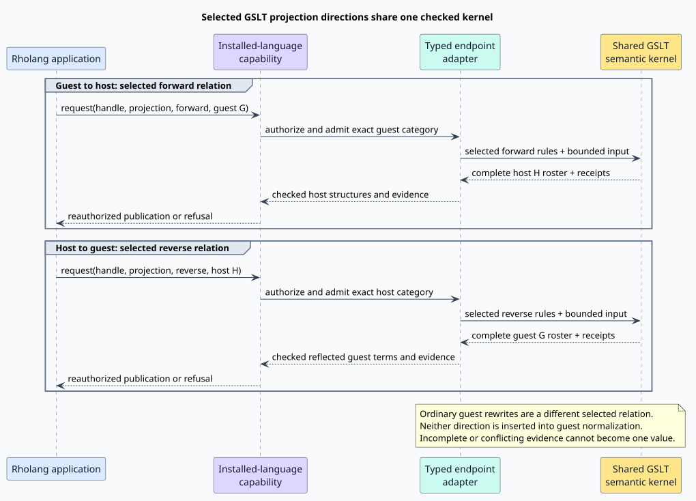

# Typed guest–host projection rules for GSLTs

Status: approved design, 2026-09-29; implementation in progress. The approval covers the typed syntax and semantic contract below, not a claim that the complete runtime service already exists. It complements [the Module/Theory surface plan](module-ddl-full-surface-syntax.md). Where that earlier plan describes direct relation predicates as entirely unimplemented, the current feature-worktree code has progressed further; the inventory below distinguishes the two.

## Recommendation

Put named projection rule groups **inside `Rewrites`**, alongside ordinary guest rules. Give each group an explicit guest category, host category, and direction. Keep the guest side on the left and the host side on the right, including for a host-to-guest rule:

```text
Rewrites {
  projection Boolean : Bool <~> host::Bool {
    Yes : (BTrue) <~> true;
    No  : (BFalse) <~> false;
  }
}
```

This is proposed syntax. `projection` is contextual within `Rewrites`. It selects a typed relation; the rule bodies use the same term patterns, typed contexts, premises, matching, and checked construction machinery as other GSLT rules. `~>` means guest to host, `<~` means host to guest, and `<~>` requests a checked pair of inverse directions. It does not schedule both directions during guest normalization.

A separate top-level `Projections` builder is unnecessary for the initial surface. If authors later prefer that visual organization, `Projections { Boolean : ... }` can be exact sugar for the qualified groups above. There must be one canonical meaning and one execution implementation. `Exports` retains its category visibility/renaming role; it does not acquire conversion semantics.

The design applies to **arbitrary declared guest and host categories**. Boolean is an example, not a special projection kind. An endpoint becomes executable only when its structural signature and a checked codec or bridge are available. Declaring a category name cannot make an arbitrary runtime object serializable, pure, or authorized.

The two request directions use the same semantic kernel but select different typed rule sets. The capability and endpoint checks occur on each direction, including before publication:



## Why this belongs to the GSLT rule system

A graph-structured lambda theory, or GSLT, presents typed constructors, equations, and directed transitions. Its equations identify terms within the appropriate typed theory; its transitions describe computation. The use of multiple sorts and graph-enriched operational structure has an established foundation in [Stay and Meredith, *Representing operational semantics with enriched Lawvere theories*](https://doi.org/10.48550/arXiv.1704.03080). The boundary rules proposed here are an engineering extension of that presentation, not a claim that the cited paper defines this DDL.

Guest and host values already have structural Rholang representations. That gives projections a useful implementation shape: a checked transformation of a Rholang structure into another Rholang structure. It lets us reuse the native reflection adapter, canonical rule-term representation, matcher, proof receipts, and transition kernel. It does not erase the distinction between the represented languages.

In particular, after guest terms are lowered to their checked Rholang representation, a projection's runtime input and output are both structural Rholang values; neither direction needs to parse source text or invoke a second language evaluator. This is a *typed relation over a shared representation*, not an untyped `Par`-to-`Par` rewrite: the installed guest commitment and category identify one endpoint, while the pinned host signature and category identify the other. Reverse projection uses the same representation path with the endpoint roles exchanged, not an attempt to run the forward rewrite backward.

| Layer | Guest endpoint | Host endpoint | What remains distinct |
|---|---|---|---|
| Authoring | `Bool`, `Entry`, or another declared category | `host::Bool`, `host::Str`, `host::Proc`, or another registered host category | Names resolve in explicit endpoint namespaces. |
| Semantic identity | Guest language commitment and category | Host signature/profile commitment and category | Equal spelling or equal numeric IDs do not establish equal sorts. |
| Structural representation | Reflected guest term in Rholang `Par` | Checked host value or term in Rholang `Par` | Constructor ownership, native carrier, binding scope, and capabilities remain checked. |
| Execution | Guest rewrites or a selected projection direction | Checked construction of the target endpoint | One kernel executes the selected relation; it does not run host processes merely because it constructs their syntax. |

For example, `(BTrue)` and the host literal `true` can both be represented in `Par`, but they are not the same constructor, sort, or value. A conversion rule relates them. An equation asserting their unqualified equality would make a much stronger and generally ill-typed claim.

Qualified projection groups therefore share the GSLT machinery while retaining an explicit relation boundary. An ordinary rule still belongs to the guest transition relation. A projection rule belongs to its named category-pair relation. The name is a selector and diagnostic identity, not a capability or a second definition of the guest computation.

## What exists today

The paths in this section refer to the `mettail-module-dev/mettail-rust` feature worktree inspected for this proposal. Line references are review anchors for that snapshot.

| Existing component | Evidence | Implication for this proposal |
|---|---|---|
| Greg and Mike's ordered Theory builders | [BNFC grammar, lines 60–73](https://github.com/F1R3FLY-io/MeTTaIL/blob/3343fbea78af5543d2469d882dd5736e3ca983b2/GSLT/src/main/bnfc/metta_venus.cf#L60-L73); [prototype AST, lines 124–132](https://github.com/F1R3FLY-io/f1r3node-rust/blob/9c57a82b9ceaf798b361918369056312a33b051c/module-syntax/mettail-elab/src/ast.rs#L124-L132) | `Terms`, `Equations`, and `Rewrites` are established; there is no projection builder to preserve. |
| Judgment-style terms and theory composition | [prototype design, decisions D2–D3 and section 3](https://github.com/F1R3FLY-io/f1r3node-rust/blob/9c57a82b9ceaf798b361918369056312a33b051c/module-syntax/documentation/mettail-ddl-and-modules-2026-08-19.md#L54) | Keep rule patterns in the existing constructor notation and preserve ordered builder/composition behavior. |
| Generated host DDL AST | [Rholang grammar](../../../languages/src/rholang.rs), [structural lowering](../../../rholang-runtime/src/ddl_ast.rs) | Projection groups, `<~`, `<~>`, qualified constructor patterns, typed contexts, and Boolean/string/integer literal forms parse structurally. Projection integers now remain native integer values in the wire instead of becoming text. The complete native-literal and token-regex surfaces remain open. |
| Standalone authoring parser and declaration AST | [authoring lexer](../../../mettail-elab/src/lex.rs), [iterative projection parser](../../../mettail-elab/src/parse.rs), [builders and projection rows](../../../mettail-elab/src/ast.rs) | File-authored `Rewrites` accept the same projection arrows, qualified host terms, typed contexts, premises, carrier declarations, and Boolean/string/integer terms. The standalone parser is an authoring entry point, not a second pass over the generated Rholang AST; a cross-frontend test compares its rows with the generated structural wire. |
| Typed flat rule arenas | [rule contracts](../../../grammar-core/src/theory_rule.rs), [projection compiler](../../../mettail-elab/src/projection_compile.rs) | Projection rows reuse the existing flat rule compiler. Typed calls to another projection are still refused until selected-relation premise execution is implemented. |
| Same-sort ordinary rules | [image compiler](../../../dovetail-runtime/src/theory_image_compiler.rs), [kernel](../../../dovetail-runtime/src/semantic_transition_kernel.rs) | A versioned projection image checks independently typed endpoints and keeps selected projection programs separate from ordinary same-sort rewrites. Carrier-backed execution and inverse-law checking remain open. |
| Shared semantic kernel and direct relation execution | [projection execution request](../../../dovetail-runtime/src/semantic_transition_kernel.rs), [runtime native predicate path](../../../rholang-runtime/src/semantic_service.rs) | Rule-backed selected projection directions execute through the existing one-step kernel and retain the returned alternatives and receipts. Installed-host binding, FLT publication, and `where` evidence are not yet wired. |
| Native Boolean predicate checking | [native sort admission, lines 43–116](../../../rholang-runtime/src/semantic_service/predicate.rs#L43), [normal-form classification, lines 681–690](../../../rholang-runtime/src/semantic_service.rs#L681) | Native Boolean results already work under the checked predicate path. Constructor spelling is not truthiness. |
| Structural guest adapter | [installed FLT adapter, lines 334–395](../../../rholang-runtime/src/installed_flt.rs#L334) | Reuse its checked structural traversals. It currently resolves installed guest syntax sorts, not arbitrary host endpoint signatures. |
| Semantic identity and integration metadata | [TheoryCore, lines 97–146](../../../grammar-core/src/language_core.rs#L97), [morphism and resource declarations, lines 649–710](../../../grammar-core/src/language_core.rs#L649) | There is no value-projection registry today. `TheoryMorphismV1` is a named mapping record, not an executable pattern conversion; `ResourceProjectionV1` concerns funding. |
| Independent language rights | [rights and default profile, lines 18–115](../../../grammar-core/src/installed.rs#L18) | Reuse the existing authority model. Default FLT rights do not grant `Bridge`. |

Rholang itself remains a valid host target. Its generated typed adapter stores the deliberately withheld `MethodCall` receiver as an exact `FieldWithheldProc` leaf, preserving the receiver without making it an independently reducible e-class child ([Rholang declaration](../../../languages/src/rholang.rs), [typed lowering](../../../macros/src/gen/runtime/dovetail_report/typed_lowering.rs)). The separate, optional `GrammarCore`/`SemanticSignature`/`SemanticMachineImage` export currently refuses that field because its source-neutral field projection lacks the corresponding exact whole-child representation ([artifact conversion](../../../macros/src/gen/runtime/dovetail_report/semantic_adapter.rs), [metadata emission](../../../macros/src/gen/runtime/metadata.rs)). This refusal does not disable Rholang's generated parser or typed adapter. Projection installation still needs a trusted generated host-signature fragment and an exact codec-profile binding; it may not treat the refused complete triple as though it were available, nor turn the withheld receiver into an ordinary reducible child.

The actual Regex fixture declares `Bool = bool`, `BTrue` with concrete spelling `yes`, and `BFalse` with spelling `no` ([fixture, lines 17–37](../../../rholang-runtime/tests/fixtures/regex_gslt_application.rho#L17)). It separately contains action/observation metadata, including a `FullMatch` predicate role ([lines 390–413](../../../rholang-runtime/tests/fixtures/regex_gslt_application.rho#L390)). Neither the carrier declaration nor that predicate role implements a general bidirectional value conversion.

The feature-worktree code supports a native-Boolean direct relation path when no predicate role is selected ([service selection, lines 352–409](../../../rholang-runtime/src/semantic_service.rs#L352)). It does not yet mean that a `Computation` result can select an arbitrary `Computation ~> host::Bool` mapping. That additional composition is part of this proposal.

## Proposed surface

### Named groups and stable sides

The following grammar sketch uses `RuleTerm`, `RuleContext`, and `RulePremises` for the existing GSLT rule metasyntax, including its planned complete typed/native forms. It does not introduce a grammar for arbitrary host expressions.

```text
RewriteEntry := OrdinaryRewrite | ProjectionGroup | CarrierProjection

ProjectionGroup :=
  "projection" Name ":" GuestCategory Direction HostCategory
  "{" ProjectionRule* "}"

CarrierProjection :=
  "projection" Name ":" GuestCategory Direction HostCategory
  "via" "carrier" ";"

ProjectionRule :=
  Name RuleContext? ":" RulePremises? GuestRuleTerm Direction HostRuleTerm ";"

Direction := "~>" | "<~" | "<~>"
HostCategory := "host" "::" CategoryName
HostConstructor := "(" "host" "::" ConstructorName RuleTerm* ")"
```

The group signature fixes the categories and supported direction. In the initial surface each row uses the group's direction. Independently designed forward and backward conversions use separate named groups; they do not falsely claim to be inverses. A later grouping convenience may display them together without changing their separate contracts.

| Declaration or row | Input when invoked | Output | Contract |
|---|---|---|---|
| `G ~> H` | Guest term of category `G` | Host value/term of category `H` | A directed, possibly partial and lossy relation. |
| `G <~ H` | Host value/term of category `H` | Guest term of category `G` | A directed, possibly partial relation, with the guest still written on the left. |
| `G <~> H` | Either endpoint, selected by the caller | The other endpoint | Checked partial inverse rules over their admitted domains. |

`host` denotes the host signature bound by the installation environment. It is not an ordinary user-defined alias, a URI to execute, or a source-level authority grant. `::` is namespace qualification, not field access or an operation on terms. `host::Bool`, `host::Str`, and `host::Proc` match category names in the current host specification ([host categories, lines 83–95](../../../languages/src/rholang.rs#L83)). Other host categories may be admitted through the same typed endpoint mechanism. An immutable signature/profile commitment resolves the namespace; a caller cannot reinterpret a previously installed projection by rebinding `host`. The new `::` token is recognized contextually in this DDL position and remains distinct from the existing `::=` regex-declaration delimiter.

The three arrow spellings lower to **one directed-rule representation**. A written `G ~> H` stores guest input and host output; a written `G <~ H` stores host input and guest output; `G <~> H` expands to both directed entries with the same source occurrence. Thus `<~` and `<~>` are surface sugar over one or two canonical `~>` programs, not additional runtime rewrite engines. Each generated direction is checked independently for endpoint types, bound variables, premises, effects, and available authority. The pair is accepted as an inverse only with the applicable partial-round-trip evidence; syntactically reversing a lossy or effectful rule is insufficient.

Within rules, guest constructors remain parenthesized, such as `(BTrue)`. Host constructors may be qualified, such as `(host::CastStr text)`. Host native literals are resolved by the declared host endpoint and expected child sorts. The DDL parser recognizes these structural forms directly. It never evaluates an arbitrary Rholang process while elaborating a declaration.

### Why the exact example is `(BTrue) <~> true`

The intended meaning of `yes <~> true` is sound, but `yes` in the Regex fixture is **concrete guest syntax** for constructor `BTrue`. Existing GSLT rewrite bodies use constructor terms, not an embedded invocation of each guest's text parser. The canonical authoring form is therefore:

```text
Yes : (BTrue) <~> true;
```

An editor may display `yes` as the guest-side preview, using the declared syntax and source map. A future surface-term quotation could offer explicit guest syntax if separately designed, but plain identifiers must not sometimes be metavariables and sometimes invoke another parser. Changing concrete spelling from `yes` to `oui` must not silently change this rule's meaning.

### Carrier transport is explicit and narrow

`projection TextValue : Text <~> host::Str via carrier;` requests the checked structural correspondence between compatible native carrier leaves. It does not convert every constructor in `Text`. Its domain is the native-leaf subset admitted by the guest category and the selected host codec.

The implementation resolves exact representations, range/refinement restrictions, Unicode policy, numeric width, collection behavior, and codec identity. Matching a broad carrier family is insufficient: the current host's `Int` is `i64`, whereas a guest's integer representation may be wider. An out-of-range value is explicitly unmapped or refused; it is not truncated. Text does not become bytes by sharing an internal buffer, and a capability never becomes a string by rendering it.

This shorthand is a declared use of an existing or registered structural codec, not automatic invention of a converter. For a pair lacking a suitable codec, installation reports the missing endpoint contract. The proposal does not require a custom evaluator for each guest language.

## Worked examples

### Regex Boolean values and completed computations

This excerpt is proposed syntax in the existing Regex theory, after its `Types` and `Terms` declarations:

```text
Rewrites {
  NullableCoreDone : (NullableCore (NDone B)) ~> (DoneBool B);

  projection Boolean : Bool <~> host::Bool {
    Yes : (BTrue) <~> true;
    No  : (BFalse) <~> false;
  }

  projection CompletedBoolean : Computation ~> host::Bool {
    Done(b:Bool, h:host::Bool):
      if projection Boolean(b, h) then
        (DoneBool b) ~> h;
  }
}
```

`NullableCoreDone` remains an ordinary guest rewrite. `Boolean` relates the two guest constructors to the host Boolean values in both directions. `CompletedBoolean` unwraps an already completed guest computation and composes that declared relation. It does not rerun `fullMatch`, and it does not change the guest rewrite relation.

The proposed `projection P(g, h)` premise is a typed call to a previously declared projection relation, with guest argument first. In a forward rule, known `g` selects the forward mode and derives `h`; in a backward rule, known `h` selects the reverse mode and derives `g`. The checker must establish a valid binding order for each admitted direction. It rejects a call with neither argument available and rejects multiple unresolved modes. If both arguments are bound, the call checks the selected relation without rebinding either value. Ordinary judgment premises retain their existing meaning.

A caller may first normalize `fullMatch(...)` under the `Computation` rewrite relation and then apply `CompletedBoolean` to every resulting terminal form. The existing predicate interface's three-valued evidence policy applies after that composition. The reverse of `Boolean` constructs `BTrue` or `BFalse`; it does not search for a regular expression and text that happen to yield the supplied Boolean.

### Non-Boolean structured values in both directions

The next example maps a guest entry into a host Rholang list containing exactly two strings. It deliberately uses the broad host category `Proc`, showing that a projection can have a restricted domain within an arbitrary declared category.

```text
Theory Entries() {
  Types {
    Text = String;
    Entry;
  }

  Terms {
    MakeEntry . key:Text, value:Text
      |- "entry(" key "," value ")" : Entry;
  }

  Rewrites {
    projection TextValue : Text <~> host::Str via carrier;

    projection EntryValue : Entry <~> host::Proc {
      Pair(k:Text, v:Text, hk:host::Str, hv:host::Str):
        if projection TextValue(k, hk), projection TextValue(v, hv) then
          (MakeEntry k v)
          <~> (host::CastList {(host::CastStr hk), (host::CastStr hv)});
    }
  }
}
```

The braced collection is the existing rule-term collection notation. Its ordered host-list interpretation comes from the registered `host::CastList` signature, not from the braces alone. `host::CastStr` and `host::CastList` correspond to current host constructors ([lines 1300–1303](../../../languages/src/rholang.rs#L1300)). Exposing their signature and canonical collection representation to projection compilation is new integration work.

For native text leaves, guest `entry("color", "blue")` projects to host `["color", "blue"]`; the inverse constructs the same guest entry. A host list of three values, a list containing an integer, or a host send process is outside the inverse domain. A guest `Entry` containing a non-native `Text` constructor is outside this particular forward domain unless `TextValue` is deliberately extended.

The two `TextValue` calls convert the endpoint types explicitly. Equal underlying string representations do not allow a `Text` metavariable to be used as `host::Str` without a checked correspondence. Both call plans can be generated for this structural example: forward calls receive guest leaves; reverse calls receive host leaves. Their results then construct the other endpoint.

No Boolean-specific dispatch, Regex-specific evaluator, string rendering, or second parser participates in this example. The same pattern applies to admitted numeric categories, records, sums, trees, collections, bound syntax, and opaque values whose host contracts support the required operations.

### Lossy directions do not imply an inverse

An entry's key can be exported while its value is discarded. A separately authored import may supply an empty value:

```text
Rewrites {
  projection KeyOnly : Entry ~> host::Str {
    Key(k:Text, v:Text, hk:host::Str):
      if projection TextValue(k, hk) then
        (MakeEntry k v) ~> hk;
  }

  projection WithEmptyValue : Entry <~ host::Str {
    Default(k:Text, hk:host::Str):
      if projection TextValue(k, hk) then
        (MakeEntry k "") <~ hk;
  }
}
```

Both directions exist, but they are not inverses on all entries: exporting and then importing `entry("color", "blue")` yields `entry("color", "")`. These declarations are valid directed projections. Replacing them by an asserted `<~>` pair would be invalid. This is semantic information loss even if every underlying codec transports its payload exactly.

A stateful update interface that preserves the discarded value would need the old guest term or an explicit retained complement. That is a different contract, often expressed as a lens; the distinction between conversion and source-preserving update is explained in [Pierce, *The Weird World of Bi-Directional Programming*](https://www.cis.upenn.edu/~bcpierce/papers/lenses-etapsslides.pdf). This proposal does not silently store hidden complements.

## Semantic contract

### Typed relations first; callable values require evidence

Let $`G`$ and $`H`$ denote the admitted guest and host endpoint domains, with their declared equational equivalences $`\equiv_G`$ and $`\equiv_H`$. A forward projection denotes a relation $`P_{\rightarrow}\subseteq G\times H`$; a backward projection denotes a relation $`P_{\leftarrow}\subseteq H\times G`$. Groundness, scope, carrier refinements, and codec admission are part of membership in these domains.

Rules may be partial or overlap. A relational query can retain several results. A convenience operation returning **one value** must establish that the complete result family is nonempty and has one admissible target value under the selected checked equality. It cannot select the first matching rule or the most favorably ranked parse.

For `<~>`, require a partial isomorphism on admitted subdomains $`D_G\subseteq G`$ and $`D_H\subseteq H`$. Its forward and reverse relations must be partial functions there and satisfy:

```math
\begin{aligned}
g\in D_G &\implies Q(P(g))\equiv_G g,\\
h\in D_H &\implies P(Q(h))\equiv_H h.
\end{aligned}
```

Definedness must be preserved as well as the returned value: the corresponding reverse application must exist on each forward image, and conversely. Neither law asserts total coverage of the whole declared category. The `EntryValue` example is partial on `host::Proc`.

Reversing an arrow is not a general program inversion algorithm. The initial automatic `<~>` checker should accept a decidable structural fragment: exact constants; typed constructor patterns with recoverable metavariables; calls to already checked partial isomorphisms; and collections/binders only where the supported matcher can certify recovery and scope. Check overlap and compatibility across the entire group, not only each row separately. A nonlinear pattern, erased variable, unconstrained output, lossy intrinsic, problematic equation, or unsupported inverse dependency must produce a precise refusal or require independently checked law evidence. For instance, two distinct guest constructors both mapped to host `true` cannot both be part of an inverse table unless the admitted guest equality and domain proof justify that identification.

One-way groups do not need an inverse proof. They still need well-typed rules, complete runtime result accounting, and checked construction. Tests are useful evidence of examples; they do not prove general injectivity, totality, confluence, termination, or inverse laws.

### Equations and operational semantics

Projection matching and construction use the same supported equational discipline as the GSLT kernel. A projection advertised as a map on equivalence classes must respect endpoint equations, including definedness:

```math
g\equiv_G g'\quad\Longrightarrow\quad
\{[h]_{\equiv_H}\mid g\;P_{\rightarrow}\;h\}
=
\{[h]_{\equiv_H}\mid g'\;P_{\rightarrow}\;h\}.
```

The symmetric condition applies to the reverse relation. If the installed equality profile cannot establish the required evidence within its limits, the relevant law or request remains unproved. Do not replace semantic equality with equal printed strings or assume that arbitrary equation systems have a decidable canonical form.

The projection does **not** assert an equation between a guest term and a host term, merge their e-classes, or make the host constructor a guest constructor. Its inverse laws are same-endpoint equations after composition, which can be stated and checked as ordinary typed laws in an appropriate composed presentation. An inverse-law declaration is a proof obligation, not an instruction to add unconditional simplifications to every guest computation.

A value conversion need not preserve every reduction, observation, effect, or grade. To advertise it as a GSLT morphism or permit behavioral cross-language substitution, additionally establish the relevant structure-preservation laws, such as the commuting condition below for each admitted guest transition:

```math
g\longrightarrow_G g'
\quad\Longrightarrow\quad
P(g)\longrightarrow_H^{*}P(g'),
```

with explicitly specified simulation strength, observations, effects, binding behavior, and resource accounting. This obligation is conditional on the chosen behavioral contract; a simple final-value encoder does not acquire it automatically. The [FLT FIPS](https://github.com/F1R3FLY-io/FIPS/blob/b7d8ba0d1c8123d269b850ca1c4f9857006f4b5a/under-review/2026-06-26-Foreign-Language-Terms/2026-06-26-Foreign-Language-Terms.md#L643) already requires stronger morphism evidence for cross-language fills that preserve judgments and grades. That document is an under-review proposal, not proof that every integration described there is implemented.

### Evaluation order is selected by the caller

The default projection request is structural: it applies the chosen projection to an already admitted input. A separate explicit request policy may normalize the guest first and then project every completed alternative. This distinction prevents a conversion declaration from implicitly running an arbitrary guest computation or choosing a normal form.

Within a projection rule, guest reduction premises remain ordinary GSLT transition premises, closed intrinsics remain the existing checked primitive operations, and a projection premise calls the named boundary relation. Any recursion uses the kernel's bounded worklist and shares the request budget. Host construction does not execute the constructed `host::Proc`; effects require a subsequent separately authorized host operation.

Ordinary unqualified guest normalization never automatically chooses a projection. The pair `BTrue ~> true` and `BTrue <~ true`, if inserted as unrestricted rewrites in one relation, would both change the guest result domain and make conversion cycles possible. A selected forward relation or selected reverse relation has a single endpoint direction; an explicit round trip consists of two calls with intermediate admission.

### Mixed guest–host operations are typed compositions

A projection makes a host value available to a guest operation only through an explicit, checked conversion. For example, suppose the guest theory already defines `FullMatch` on `Pattern` and `Text`, with a `Bool` result; `TextValue : Text <~> host::Str` supplies an admitted host-to-guest text direction; and `Boolean : Bool <~> host::Bool` supplies an admitted guest-to-host result direction. An operation taking a guest `Pattern` and a host `Str` may compose those three selected relations without adding host values to the guest's ordinary rewrite relation.

Let $`F`$ be the guest `FullMatch` relation, $`Q_{mathrm{Text}}`$ the selected `host::Str`-to-`Text` relation, and $`P_{mathrm{Bool}}`$ the selected `Bool`-to-`host::Bool` relation. The mixed operation has the relational meaning:

```math
\widehat F
=P_{\mathrm{Bool}}\circ F\circ
  (\mathrm{id}_{\mathrm{Pattern}}\times Q_{\mathrm{Text}}).
```

Here $`\circ`$ is relational composition, $`\times`$ combines the independent typed inputs, and $`\mathrm{id}_{\mathrm{Pattern}}`$ leaves the guest pattern unchanged. This defines a partial, possibly multivalued relation, not automatically a total function. The composed request names each projection and direction, carries all source alternatives and receipts, shares one bounded work budget, and accepts a unique-value or Boolean result only after complete evidence establishes it. The host input is never silently coerced merely because a projection with matching endpoint names exists.

This contract also scales to several host input types, guest inputs, and a host output: use a checked product of the chosen input projections, then the existing guest operation, then an optional output projection. An effectful guest operation still needs its normal action/effect rights and settlement; pure projections cannot launder those requirements. If a first-class *named mixed operation* is later authored in the DDL, its signature must explicitly list guest and host endpoint types and elaborate to this same typed composition plan and kernel, not create a second evaluator or make the guest's internal `Terms` silently polymorphic over host values. The present projection-group syntax alone defines the conversion relations, not that new named-operation surface.

A host-typed input may be filled by an already parsed Rholang process hole at run time. The hole carries an expected endpoint such as `host::Proc` or `host::Str`; filling it first checks the actual structural Rholang term against that exact host category, lexical scope, ownership, and the request budget. A `host::Proc` hole may admit a process term; a `host::Str` hole admits a checked string value or term, not an arbitrary process merely because both have a `Par` representation. The selected host-to-guest projection then consumes the admitted value. Filling never reparses the process as guest text, and merely constructing a host process does not execute it.

Host-category **admission** is not a host-to-host rewrite. If the fill already inhabits the projection's declared host input category, it can be projected directly. If it instead inhabits `host::Proc` and the selected projection requires `host::Str`, an explicit checked host transformation must establish a `host::Str` result first: this may be a structural extraction from a known constructor, an ordinary host rewrite, or an authorized host computation according to the host theory. The complete result family and receipts of that step feed the host-to-guest projection; no first-result selection, implicit evaluation, or type-name cast is permitted. Thus host→host rewriting is composable when genuinely required, but it is not mandatory merely to pattern-match a host-typed hole.

The current FLT template-hole record carries a **guest** `CategoryId` only ([runtime hole record](../../../grammar-core/src/runtime.rs#L78), [installed construction admission](../../../rholang-runtime/src/language_install.rs#L1828)). Host-typed inputs therefore require a versioned endpoint-qualified telescope at the mixed-operation boundary, with the existing structural hole transport and admission discipline reused. They must not be smuggled into the guest parser as a fictitious guest category. If a fill denotes a computation rather than an already admitted value, evaluating it is a separate explicitly authorized operation whose effects and result evidence precede projection.

### Guest-to-guest projections can compose through a pinned host endpoint

The same typed-relation design permits a later `guest1::C`-to-`guest2::D` projection. Suppose $`P_1`$ is a checked partial isomorphism from `guest1::C` to `host::H` and $`P_2`$ is one from `guest2::D` to that **same committed** `host::H` signature and category. The two derived directions are relational composites:

```math
R_{12}=P_2^{-1}\circ P_1,
\qquad
R_{21}=P_1^{-1}\circ P_2.
```

They form a partial inverse pair on the portion whose host images overlap, subject to each leg's admitted-domain and endpoint-equation laws. If either leg is only directed, lossy, ambiguous, or lacks inverse evidence, the composite may still be a directed relation but must not be advertised as `<~>`. Equal display names or equal `Par` structures do not establish that two host signatures are the same; a separately checked host-to-host bridge would be needed if the pinned signatures differ.

“Infer” here means discover and verify a candidate **path after the caller specifies both installed language handles and the intended target category**. It does not mean guess a target language for an FLT, insert a coercion implicitly into ordinary rewrites, or choose one of several competing routes. A composite request checks both capabilities and profile commitments, charges one bounded budget across its legs, retains every intermediate alternative and receipt, and derives unique-value evidence only from complete results. A versioned composition plan may reuse or specialize the existing compiled rule images and automata; it need not duplicate source rules or build another interpreter. Direct guest-to-guest rules remain possible where the host route is absent or semantically inappropriate.

## Runtime behavior and UI contract

Extend the existing generic semantic service with a projection operation rather than creating a language-specific evaluator. Its conceptual request fields are:

```text
ProjectionRequest {
  installed_language_handle,
  projection_id,
  direction: GuestToHost | HostToGuest,
  input,
  evaluation: Structural | NormalizeGuestThenProject,
  result_policy: Relation | UniqueValue,
  limits
}
```

This is an interface sketch, not a currently accepted service payload or a new user-facing Rholang syntax. `NormalizeGuestThenProject` applies only when the input is guest-side; a request for that policy in the opposite direction is rejected. The host-language call spelling can use the established structural service convention without changing the DDL contract.

The service checks the handle, exact projection and endpoint signatures, direction, input admission, capability requirements, and effective limits. It runs any explicitly requested guest normalization and the selected projection using the shared kernel. It validates all resulting receipts and target structures, then revalidates authority before publication or communication commit. A receipt binds the full installed language commitment, projection identity, direction, host profile/codec commitment, exact input and output, proof provenance, completeness, and accounted work.

| Result family and evidence | Relational result | Unique-value result | Boolean `where` use |
|---|---|---|---|
| Complete, admitted, one target value | Retain all supporting occurrences/receipts | Return that value | `true` yields `Sat`; `false` yields `Unsat`. |
| Complete, several distinct target values | Return the complete alternatives | `Ambiguous` | `DontKnow` if they conflict or include non-Booleans. |
| Complete, no applicable mapping for an input | Explicit `Unmapped` for that input | `Unmapped` | `DontKnow`, not `false`. |
| Incomplete search, cancellation, exhausted budget, invalid evidence, or unavailable codec | `Undetermined` or typed refusal | No value | `DontKnow` or typed refusal. |

When a request has several parser readings or guest normal forms, preserve each source alternative through projection. A successfully mapped branch must not erase a different branch that is unmapped, ambiguous, invalid, or unfinished. A unique value or determinate predicate requires successful complete coverage of the relevant source family under the caller's policy. Keep original proof/result occurrences even when target values compare equal.

The three-valued predicate boundary is a consumer of the generic projection service. It accepts only a declared host Boolean target for Boolean guard interpretation; it does not constrain projections themselves to Booleans. The existing native-Boolean path and explicit predicate-role path retain their current behavior unless a caller explicitly selects the new projection path. If a future default-projection facility is desired, it needs a unique, explicit declaration and composition rule; never infer it from names such as `Bool`, `yes`, `FullMatch`, or from the first suitable declaration.

Host-to-guest conversion returns an admitted reflected guest term. An FLT construction hole can then consume that term under its existing typed structural admission rules. Guest-to-host conversion can similarly be requested after a typed capture. Existing hole syntax must not silently acquire arbitrary conversion, and strings must never be reparsed as guest syntax during a fill.

For editor and diagnostic support, show the group signature, selected direction, source rule, and the two endpoint types. Offer completion from the guest signature on the left and the registered host signature on the right. Errors should report concrete reasons: “reverse direction loses `v`,” “host `Int` range exceeded,” “projection `EntryValue` does not admit a three-element list,” or “host codec unavailable.” Source order aids diagnostics and stable identity; it does not resolve semantic overlap by choosing a winner.

## Capabilities, effects, and resources

Projection declarations are immutable data. They neither grant a right nor install executable callbacks. Endpoint codecs and opaque bridges are chosen from independently supplied, fingerprint/profile-bound manifests. A DDL can name a requirement; it cannot supply a Rust function, shell command, wallet, ambient host process, or arbitrary callback implementation.

Rights follow the actual operations. Guest normalization requires `Reduce`; guest construction requires `Construct`; inspecting a reflected guest structure follows the existing observation/reflection policy; publication and effectful bridges retain their own rights. A codec or foreign bridge requiring `Bridge` must obtain that right independently. Do not require or grant `Bridge` merely because a pure native value conversion is called a projection. Derive the complete requirement set from the selected rules, subprojections, and trusted codec manifests, and revalidate it at the existing commit boundary. Preserve the stricter combinations already required by existing service operations.

Guard projections must be pure under the checked signatures. A source-level assertion of purity does not override a codec or transition effect. Constructing a name or process cannot manufacture a live handle, fresh capability, authority-bearing tag, or permission to run it. Binding scopes, linear resources, and opaque ownership must remain valid in both directions; unsupported capture, duplication, dropping, or export is refused.

All endpoint admission, matching, equations, subprojection calls, codec traversal, candidate retention, proof construction, result transport, and cleanup are charged to one bounded request. Intersect caller, installed-theory, and host limits. Use the existing explicit-stack and cancellation discipline. Reversibility is a semantic law, not a promise of equal costs in each direction or termination within every supplied budget.

`ResourceProjectionV1` stays dedicated to grade-to-host funding demand. A value-projection declaration never selects a payer or supplies a validator's cost conversion. The distinction agrees with the [FLT FIPS resource boundary](https://github.com/F1R3FLY-io/FIPS/blob/b7d8ba0d1c8123d269b850ca1c4f9857006f4b5a/under-review/2026-06-26-Foreign-Language-Terms/2026-06-26-Foreign-Language-Terms.md#L672). The [Virtual Host Bridges FIPS, four-layer bridge](https://github.com/F1R3FLY-io/FIPS/blob/b7d8ba0d1c8123d269b850ca1c4f9857006f4b5a/under-review/2026-06-26-Virtual-Host-Bridges-for-FLTs/2026-06-26-Virtual-Host-Bridges-for-FLTs.md#L171) provides a compatible proposed separation between structural canonical values, endpoint codecs, and runtime profiles; it should inform shared codec contracts rather than introduce a duplicate value-conversion subsystem here.

## Schema, compiler, and runtime changes

The following is the recommended implementation boundary, subject to design review. Names ending in `Next` are descriptive placeholders for the next versioned representation, not existing Rust identifiers.

### 1. Structural source AST

Extend generated `DdlRewrite` entries and `mettail-elab::ast` with a projection group, directional rows, qualified endpoint/category/constructor references, a carrier-backed declaration, and typed projection-call premises. Reuse `DdlRuleAst` and the complete planned rule/native literal forms. Preserve source occurrences for every group, row, endpoint, and generated direction. Lex `<~>` and `<~` contextually without altering ordinary Rholang communication arrows or the existing `~>` meaning.

The structural wire and checked data-faithful schema need corresponding closed variants. The standalone elaborator parser, where retained for tools and tests, must lower to the same AST; runtime DDL continues through the generated host parser. There must be no text slicing, `Display` round trip, or second runtime DDL parser.

### 2. Canonical typed relation descriptors

Add a versioned `TheoryProjectionNext` collection to the semantic theory representation. Each declaration records its stable name, guest category reference, host endpoint signature/profile requirement, direction, ordinary typed rule arenas or a checked carrier transport requirement, subprojection references, and law contract. Reuse `TheoryRuleArenaV1`'s representation and its versioned successor as necessary; do not create a parallel expression language for conversions.

An endpoint reference must include ownership/signature identity and category identity. Resolve source names to canonical references before execution. A host endpoint is not an unqualified guest `String` sort with a different display name. Import only the needed immutable host signature fragment and its closure into the checked compilation environment; this imports structure, not host reduction rights or executable authority.

Add a projection rule origin and selection identity to the compiled semantic image. The ordinary equation and rewrite validators retain same-sort roots. The shared projection rule checker instead checks the source and target roots against the selected direction's two endpoint sorts. `<~` normalizes to a host-pattern input and guest-template output; `<~>` produces two separately checked directional programs with shared source provenance. Existing pattern variable, binding, collection, and premise checks remain shared.

The current `Syntax` sort validator requires a matching guest grammar category ([lines 1115–1131](../../../grammar-core/src/language_core.rs#L1115)). Do not fake host categories as guest productions. Introduce explicit endpoint-signature references or a versioned external structural-sort binding and teach image admission to verify them against the registered host contract. Pure codec transport may need a closed, generic typed carrier-conversion primitive; it must use the same manifest-bound structural codec machinery, with exact source/target types and no string-named arbitrary dispatch.

Do not put executable value mappings into `TheoryMorphismV1`'s constructor-name pairs or `ResourceProjectionV1`. A proved behavioral morphism may refer to a projection and its checked law evidence, but that is additional evidence over the declared relation.

### 3. Shared rule compilation and execution

Parameterize the existing rule compiler by relation signature and direction. Reuse constructor lookup, typed arenas, matching, substitution, native leaves, and verified image compilation. Add `Projection(id, direction)` alongside the existing action/rewrite-relation selection. Its candidate set contains only the selected projection's directional rules, and its output-sort contract comes from the descriptor. It must never enter the ordinary `RewriteRelation(sort)` candidate set.

The compiled representation must reuse the current two-part semantic image: complete flat rule programs retain every source rule, while positional left-hand sides are quotient-compiled into the existing flat `TheoryPatternAutomatonV1`/Dovetail `SetAutomaton` representation ([compiler](../../../dovetail-runtime/src/theory_image_compiler.rs#L1282), [restoration](../../../dovetail-runtime/src/semantic_transition_kernel.rs#L182)). Relation-and-direction metadata restricts candidate dispatch; it does not create a second pattern-matching algorithm. Non-positional rules, including supported collection and binder forms, continue through the same bounded complete-rule matcher rather than being discarded to force them into the positional accelerator. The versioned projection image can share interned automaton states and index entries by selected relation, subject to preserving exact candidate and receipt behavior.

Here **PathMap** names a supported collection form and its exact mode/structural marker, not the storage format of the set automaton ([pattern algebra](../../../dovetail/src/set_automaton.rs#L21), [semantic operator mapping](../../../dovetail-runtime/src/semantic_transition_kernel.rs#L32)). A projection involving a PathMap should reuse that existing collection encoding and matcher. Calling every compiled rewrite a “PathMap automaton” would conflate the collection term with the automaton's flat state DAG and rule-entry index.

A projection is one relation application, including its checked premises. Source guest normalization is a separate explicit phase. Typed subprojection premises are scheduled through the same bounded kernel worklist, not by recursively invoking an unmetered service or building a new interpreter. Their receipts compose into the parent's proof and work accounting. Existing supported equation and transition premise behavior remains shared; unsupported profiles are rejected explicitly.

This requires generalizing the shared kernel's selected-relation input/output typing. It does not require relaxing ordinary rewrite typing. A backend could alternatively lower projections to private typed call/return state constructors and ordinary same-sort rewrites, but that introduces generated sorts, frames, and provenance obligations. Such a lowering must be proved equivalent and should be an implementation choice, not new author-facing language semantics.

### 4. Generic boundary adapter and publication

Generalize the structural adapter to accept a verified endpoint binding for either side. Reuse native reflection codecs and the existing semantic service's authorization, complete-result preparation, transport accounting, and commit receipt lifecycle. Add direction/category/profile fields to the relevant proof and service records with an explicit version change.

The reverse input adapter accepts actual host structures under their host category; it must not require those values to masquerade as reflected guest constructors. The forward output adapter materializes checked host values without executing them. Reverse output admission constructs the exact installed guest category, including owner tags, refinements, scopes, and supported carriers.

### 5. Composition and identity

Projection groups are named presentation elements carried through theory parameters, joins, meets, differences, and category renaming. Guest category/constructor renaming updates references structurally; it does not rename the fixed host signature. Shared-origin declarations merge under the existing composition rules. Conflicting declarations with the same qualified identity are diagnosed, and subprojection references must remain closed after composition or subtraction.

Each projection commitment binds its endpoints, directional rules, carrier/codec requirements, and law contract. The full language commitment binds these declarations. Public guest parser behavior and its grammar image can remain unchanged when only projection semantics change. Do not infer that the full language fingerprint remains unchanged.

`TheoryCoreV1` currently fingerprints a `postcard` encoding ([lines 142–147](../../../grammar-core/src/language_core.rs#L142)). Appending a field with a Serde default is not a sufficient binary-compatibility plan. Version the canonical schema/image/receipt changes, retain legacy decoding and legacy fingerprint computation, and reject unknown versions. Languages without projections must retain their prior behavior and identity under the legacy representation. A migrated language that adds a projection deliberately has a new semantic commitment.

## Proof and verification plan

Implement only after reviewing the surface and boundary contract. The proof obligations below distinguish structural inverse checks from stronger general semantics claims.

1. **Source correspondence.** Authored groups, exact programmatic data, and their compiled images denote the same typed projection relation, including `<~` orientation, `<~>` expansion, premise order, and source ownership. Existing ordinary declarations lower exactly as before.
2. **Type and scope preservation.** Every successful result inhabits the selected target endpoint with valid carriers, refinements, binders, and ownership. Equal structural representation is never sufficient to bypass endpoint admission.
3. **Relation separation.** Adding a dormant projection does not alter ordinary guest parse results, equations, rewrite successors, or normal forms. Selected directions cannot accidentally invoke their converse.
4. **Inverse soundness.** Every automatically accepted `<~>` group satisfies both partial round-trip laws and their definedness conditions under the admitted equality profile. Test a negative table with colliding host outputs and a negative row that loses a variable. General law certificates must be checked by an admitted checker; tests alone do not discharge them.
5. **Equation compatibility.** Projections advertised on the GSLT quotient respect both endpoint equations. A failed or unsupported proof cannot be silently replaced with syntactic equality. Stronger morphism/simulation laws are required only where the interface claims them.
6. **Complete alternatives.** Retain all parse, rewrite, projection, and subprojection candidates and their original receipts. Prove that one successful branch cannot hide an unmapped or unfinished branch. Single-value and Boolean results require complete evidence under their selected policy.
7. **No new authority.** Declarations and composition can accumulate requirements but cannot grant rights, rebind codecs, forge host/guest tags, mint handles, or publish effects before the established commit check.
8. **Resource and refusal preservation.** Every phase charges the shared budget, respects cancellation, uses bounded explicit traversal, and treats exhaustion as unknown/refusal. Forward and reverse resource consumption are tested independently.
9. **Compatibility.** Legacy exact-core data, predicate roles, native Boolean predicates, FLT holes, host syntax, and old artifact identities remain valid through versioned decoding. Projection-free programs exercise the unchanged path.

Use the existing [native predicate proof model](../../../formal/rocq/runtime_grammar/theories/NativeBooleanPredicate.v#L1) as a boundary precedent, with its stated limitation: it models the classifier and communication composition, not every implementation check. The [typed projection relation model](../../../formal/rocq/runtime_grammar/theories/TypedProjectionRelation.v#L1) proves source/image selection, direction isolation, typed results, conditional round trips, and explicit two-leg composition; its structural matcher is abstract, so implementation refinement remains an independent obligation. Use meaningful property tests for round trips on admitted domains, out-of-domain refusal, structural entry/list conversion, ambiguous rules, equations, binder scope, numeric bounds, missing codecs, revocation, and deep recursive values. Differentially test the shared kernel paths; do not write a second guest evaluator as a test oracle.

The first implementation increment should cover the common machinery and both directions, then validate both the Boolean table and the non-Boolean structured example. A Boolean-only special case would not meet this contract. Implementation can be staged for verification, but feature completion requires the category-parametric endpoint contract, including supported registered endpoints and bounded recursive rules; unsupported endpoint operations must always have explicit diagnostics.

## Alternatives and tradeoffs

| Option | Benefit | Cost or semantic problem | Decision |
|---|---|---|---|
| Qualified projection groups inside `Rewrites` | Keeps boundary rules beside guest computation; reuses GSLT rule metasyntax and one kernel. | Requires explicit relation signature, direction, and endpoint admission. | Recommended. |
| Top-level `Projections` builder | Highly discoverable visual section for large bridge libraries. | A second surface spelling needs exact desugaring and composition rules. | Optional later sugar; not necessary initially. |
| Unqualified conversion rules in ordinary guest `Rewrites` | Smallest textual change. | Changes the guest transition relation, permits cross-owner leakage, and can loop when inverses are added. | Reject as the implicit default. |
| Declare `BTrue == true` | Very concise. | Conflates conversion with equality and erases endpoint distinctions; usually ill-typed. | Reject. |
| Use `Terms` carrier annotations alone | Reuses existing literal admission. | Carrier representation does not specify conversion of arbitrary constructors or structures. | Keep as the source of primitive codec facts, not the general mechanism. |
| Require explicit ordinary conversion constructors everywhere | Can encode a bridge as an ordinary composed GSLT, making execution explicit. | Exposes administrative terms and makes endpoint discovery and host publication awkward. | Valid low-level encoding or backend lowering; less suitable as the primary authoring interface. |
| Populate existing morphism name maps | Reuses a current canonical record. | Name pairs cannot express conditional, partial, recursive, or lossy structural transformations. | Use only for appropriate structural maps and additional proved evidence. |
| Add Regex-specific Boolean callbacks or a separate projection evaluator | Easy to demonstrate one example. | Does not support arbitrary categories and duplicates semantic machinery. | Reject. |

The review decision is the qualified-relation design: projections are ordinary GSLT-style rules with explicitly declared endpoint types and selected directions, executed by the existing semantic machinery. Their shared Rholang representation makes that reuse practical; it does not make typing, inverse laws, authority, or completeness optional.
