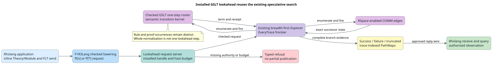

# Installed GSLT lookahead in F1R3Lang

Status: required design and implementation work for the Regex GSLT/FLT F1R3Lang demonstration. This document records the integration contract; it does not claim that the implementation is complete.

## Outcome and existing machinery

An ordinary Rholang application must be able to install a Theory/Module, construct an FLT with its syntax, and evaluate a send carrying that FLT with the existing lookahead suffixes, `x!(P)[n]` and `x!(P)[*]`. The result must retain every authorized execution trace, including successful, failed, and truncated branches, and be consumable through the approved PathMap interface.

Reuse the [lookahead request server](../../../rholang-runtime/src/speculation/server.rs), [breadth-first explorer](../../../rholang-runtime/src/speculation/search.rs), [service](../../../rholang-runtime/src/speculation/service.rs), and [delivery layer](../../../rholang-runtime/src/speculation/delivery.rs). The Rholang grammar and lowering already emit their request channels ([grammar](../../../languages/src/rholang.rs), [lowering](../../../rholang-runtime/src/rholang_ast.rs)). The current prototype registers a fixed, macro-generated Lambda guest with an in-Rholang prelude and seed. A dynamically installed GSLT instead has a checked semantic image and the [semantic transition kernel](../../../dovetail-runtime/src/semantic_transition_kernel.rs); it does not automatically have that prelude. Treating its reflected term as an inert, completed process would be an incorrect result, not a supported fallback.

The public F1R3Lang composition currently installs the language, FLT, theorem, and semantic services but not the lookahead definitions or their host-budget binding (the isolated node branch's `node/src/rust/runtime/f1r3lang.rs`). The approved *Lookahead* FIPS and the *Foreign-Language Terms* FIPS also require two PathMap names on the reply channel and all possible traces; the prototype currently sends bare success terms there and delivers PathMaps separately. This public contract discrepancy is part of the required work.

The diagram source is [PlantUML](figures/installed-gslt-lookahead-flow.puml).

## Semantic model

The speculative configuration consists of one sandbox RSpace snapshot, its active reflected guest occurrences, the installed-language authority bound to those occurrences, and a finite budget. Guest occurrences are identified structurally in the snapshot; they are not reparsed from source or copied into an unrelated state store.

At each configuration, the existing explorer enumerates a disjoint union of enabled host rendezvous occurrences and checked guest rewrite occurrences. Each guest occurrence records its exact owner, location, rule, premise proof, and transition receipt. Equal target terms reached by different rules remain different edges in the FIPS-conformant every-trace mode. The present normalizer's equal-target grouping is useful for normal-form sets, but it is not a permissible substitute for the uncoalesced step roster.

One bounded lookahead step is one selected host COMM or one selected guest semantic transition. Administrative saturation and structural reflection consume their own metered work but do not silently add a trace edge. At bound zero, a configuration with enabled edges is truncated; a configuration with no enabled edges is successful. Unbounded search remains bounded by finite host funding, with exhaustion reported as failure or undetermined evidence, never as a fabricated normal form. The explorer retains its breadth-first frontier, deterministic edge names, resumable truncation handles, and separate success/failure/truncation outcomes.

Mixed host/guest edges are considered conflicting unless an existing checked independence proof permits commuting them. No top-k filter, equal-target coalescing, or selected-normal-form shortcut may discard a trace before its evidence is evaluated. The public FIPS route uses the every-trace mode. Any independence-reduced mode remains an explicit, separately documented optimization with its distinct trace contract.

## Authority and effects

A constructor-head fingerprint identifies a language; it does not grant permission. The versioned internal lookahead request must carry or resolve an opaque installed-language handle for each active FLT, including native-literal roots that have no constructor head. Direct lexical FLTs derive that binding from their existing selector during checked construction. Received or composite FLTs require an explicit, authorized binding; absent, ambiguous, mismatched, forged, revoked, or cross-language ownership refuses before execution or publication.

Resolve handles through the existing installed-language table. Check `Reduce` for each guest transition and `Observe` for requested observations; require `Construct`, `ReflectAst`, or bridge rights only for operations that actually use them. Recheck the live authority and revocation epoch at publication. The speculative sandbox receives admitted immutable images and pure transition primitives, not authority to install modules, publish to the host RSpace, call external services, or commit effects. Host phlogiston, kernel logical work, conversion work, and delivery work must all be accounted for on success and refusal. Unsupported effects fail closed.

Process holes use the existing typed structural fill and pattern machinery. For a composite term, each active child dispatches under its own handle; cross-owner substitution or projection requires the declared checked morphism. Neither the Rholang parser nor the guest parser re-enters source text after the FLT has been prepared.

## Reduction, observation, and lookahead

These are distinct interfaces over one authored theory:

- `Reduce` denotes the authorized one-step GSLT transition relation and its receipts. A bounded-normalization request repeatedly uses that same relation.
- `Observe` denotes an authorized, admitted context or projection over a state or complete relation result. It does not introduce another rewrite relation.
- Lookahead explores the possible transitions and publishes their trace-indexed states and observations. It must not invoke whole normalization as one opaque host COMM, because that erases `[n]` depth and nondeterministic branches.

Consequently, the standard Theory/Module `Terms`, `Equations`, and `Rewrites` remain the authoritative language definition. Mandatory duplicate `Actions`/`Observations` DDL tables are not justified. The current named `SemanticOperation::Reduce(name)` and `Observe(name)` selectors are an action-centric implementation seam; replace the mandatory path with a checked relation/query selection over the authored rewrites and caller-specified observation policy. Named actions or observations may remain optional interfaces when a theory genuinely declares a specialized operation. The OSLF `Reduce` and `Observe` rights and judgments themselves remain necessary.

## Ordered implementation gates

1. **Formal contract before core edits.** Extend the existing semantic-normalization and lookahead trace models with complete, canonically ordered one-step occurrences; owner/sort preservation; zero-step, truncation, and exhaustion laws; no partial publication; and a refinement from mixed edges to the existing Rholang-only explorer. Include a counterexample with two distinct rules producing the same term.
2. **Checked step roster.** Lift the semantic kernel's existing rewrite matcher and executor into a resource-checked public one-step API returning all individual successor occurrences, receipts, consumed work, and complete no-successor evidence. Keep the existing whole-normalization API; test their relation rather than reimplementing either algorithm.
3. **Handle-bound guest context.** Preserve installed selectors/handles across FLT construction and the internal lookahead request ABI. Validate native-literal roots, composite children, typed holes, and morphisms through the existing language table. A tag is never treated as a capability.
4. **Explorer transition seam.** Extend the existing sandbox/explorer to enumerate and fire both RSpace and guest edges from exact snapshots. Preserve the existing BFS, deterministic replay, trace delivery, cancellation, and bounded funding. Do not wrap whole guest normalization in a single system-process call.
5. **FIPS public wire and bound.** Deliver success and failure PathMaps on the reply channel, define a versioned compatible representation for truncated resumable branches, and verify the same-RSpace name constraint. The approved bound is an unsigned 64-bit integer; current lowering/wire narrows it to nonnegative signed 64-bit. Support the complete approved range with checked resource refusal, or obtain an explicit specification amendment before claiming conformance. Keep bare-result convenience on a distinct opt-in API if needed; it cannot silently replace the approved wire.
6. **Public node composition.** Install the engine definitions with the same language runtime in F1R3Lang, validate the combined system processes, and bind the engine to the actual evaluation runtime budget immediately after runtime construction. Mirror the setup in the public-route test factory. Scope any consensus/replay claim to routes actually verified.
7. **Acceptance and documentation.** Exercise `[0]`, `[1]`, and `[*]` through the public node with an inline Regex theory and FLTs: deterministic and two-branch rewrites; equal-target/different-proof traces; literal roots; typed and nested holes; mixed host/guest processes; received FLTs; no-match, exhaustion, revocation, forged handles/tags, and cross-language refusal. Query the returned PathMaps. Differentially compare one-step traces with the existing whole normalizer and the macro prototype on their common subset. Run deep-term stack-safety, deterministic replay, and budget/property tests. Update the two FIPS and user-facing contract only after verified behavior matches the examples.

The critical path is gates 1, 2 and 3, then 4, then 6 and 7. The public wire work in gate 5 can proceed independently after gate 1. Parser and semantic-image build optimizations do not block these gates.

## Acceptance boundary

The integration is not complete merely because the lookahead syntax parses, the static Lambda prototype runs, or a single installed Regex term normalizes. Completion requires a public F1R3Lang evaluation that installs the Regex theory from source, explores every authorized branch of an FLT with the approved lookahead suffix, returns queryable PathMaps and full receipts, and passes the authority, resource, ambiguity, and replay tests above. Until then, reports must distinguish the existing prototype from dynamic-GSLT lookahead.
