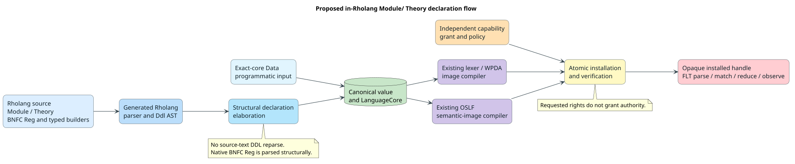
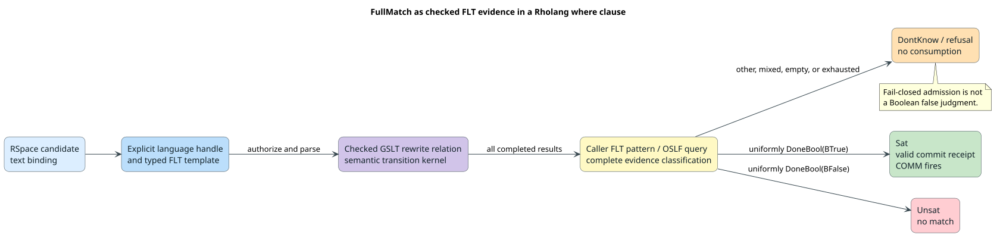

# Complete Module and Theory surface for MeTTaIL declarations

Status: design proposal for Greg and Mike's review. The syntax in this document is **not yet implemented**. The authored theory uses Greg and Mike's existing `Terms`, `Equations`, and `Rewrites` to define semantics. `Exports` retains its existing category visibility and renaming role; it does **not** redeclare semantic operations. This does not define another host language or remove the data-faithful canonical representation.

The immediate motivation is the three `Data({...})` blocks in the [Regex GSLT application](../../../rholang-runtime/tests/fixtures/regex_gslt_application.rho). They currently carry (1) sorts, carriers, and literal tokens, (2) operator binding metadata, and (3) typed rewrites, rights, OSLF actions and observations, and limits. The readable `Terms`, `Equations`, and `Rewrites` already state the guest language's semantics. The present runtime service selects named action and observation records, but that implementation requirement does **not** justify making authors duplicate their rewrite rules as new Theory declarations. The data-faithful form remains available for automatic construction and analysis; eliminating presentation `Data` from the authored Regex source requires a general FLT-to-rewrite-relation execution path, not additional semantic syntax.

The authoritative sources have different jobs: `MeTTaIL/GSLT/src/main/bnfc/metta_venus.cf` is the **BNFC reference for a readable token-regex surface**; `f1r3node-rust-module-syntax/module-syntax/documentation/mettail-ddl-and-modules-2026-08-19.md` supplies **Greg and Mike's `Module`/`Theory`, `Types`, and judgment-form `Terms` structure**. Their document leaves retention of BNFC pragmas, including `token` and `position token`, open in §9.4. This proposal adopts a **BNFC-inspired**, not byte-for-byte BNFC-compatible, token declaration form inside the module structure. The established PraTTaIL regex compiler retains its semantics; similarity of spelling does not import BNFC's character classes or every BNFC operator. The [BNFC LBNF reference](https://github.com/BNFC/bnfc/blob/master/docs/lbnf.rst#lexer-definitions) documents the inspiration. Current implementation boundaries are the generated [Rholang specification](../../../languages/src/rholang.rs), [authoring schema](../../../mettail-elab/src/schema.rs), [canonical language core](../../../grammar-core/src/language_core.rs), and [runtime lexer-image compiler](../../../prattail/src/runtime_backend.rs).

## Terms and architecture

The *host* is the one Rholang language parsed by the generated frontend. A *theory* is an immutable language definition; it is not an installed parser or an authority. A *guest term* is parsed under an explicitly selected installed-language handle. `Data` denotes a structurally parsed Rholang value, not text passed to another DDL parser. A *carrier* specifies a native value representation; an ordinary theory constructor is still a distinct structural term. A graph-structured lambda theory (GSLT) presents grammar, equations, and reductions; Operational Semantics in Logical Form (OSLF) derives behavioral observations and logic over that presentation for a specified observational setting ([Stay and Meredith 2017](https://doi.org/10.48550/arXiv.1704.03080), [GSLT context](../../../context/gslt-context.md)). The current action/observation service is one runtime interface over the theory, not OSLF's definition. FLT means foreign-language term. The proposed `token Name Reg;` expressions specify **lexer tokens** using PraTTaIL regex semantics; they are not the Regex guest language being specified by the application.



The declaration path is one-way and structural: generated host AST, typed declaration AST, canonical value and `LanguageCore`, then the existing lexer/WPDA and semantic-image compilers. Exact-core `Data` enters at the canonical-value boundary. Neither route grants rights; installation intersects requested rights with an independent capability grant.

## Authored Regex spelling

This excerpt shows the authored language definition, not a field-by-field transcription of the current service records. The ordinary `Exports` builder is omitted because the example does not need to hide or rename categories. Requested rights remain installation policy rather than a `Theory` attribute. `Options` owns optional lexer, parser, and semantic controls, including semantic limits. The two lexical declarations use a **BNFC-inspired `token Name Reg;` form** inside `Terms`. They are not an invented `Literals { Category ::= Reg => carrier … }` language. `Types` carries the separate canonical carrier and variable-admission metadata. In particular, the `data` modifier in this excerpt is **proposed**, not part of Greg and Mike's current `Types { Category; }` grammar: it requests a category without automatically admitted variable forms. The short rewrite sample illustrates the rule grammar; the migration rule in [Typed rules](#typed-rules-and-native-values) applies to every remaining rewrite in the fixture. Each form shown is proposed syntax, not an assertion that the current parser accepts it.

```text
Module RegexGSLT {
  Theory Regex() {
    Types {
      data Pattern;
      data Computation;
      data NFrames;
      data DFrames;
      data EFrames;
      data MatchResult;
      data ReplacementTemplate;
      data PrefixResult;
      data Scalar = String;
      data Text = String;
      data Bool = bool;
      data Flag = bool;
      data Nat = BigInt;
      data Grade = BigInt;
    }

    Terms {
      token Scalar [A-Za-z0-9\u{80}-\u{10FFFF}];
      token Nat [0-9]+;

      PAlt . p:Pattern, q:Pattern
        |- p "|" q : Pattern left prefix(10);
      PConcat . p:Pattern, q:Pattern
        |- p q : Pattern left prefix(20);
      PStar . p:Pattern
        |- p "*" : Pattern nonassoc prefix(30);
      PPlus . p:Pattern
        |- p "+" : Pattern nonassoc prefix(30);
      POptional . p:Pattern
        |- p "?" : Pattern nonassoc prefix(30);
      PRepeat . p:Pattern, lo:Nat, hi:Nat
        |- p "{" lo "," hi "}" : Pattern nonassoc prefix(30);
    }

    Rewrites {
      FullReadEnd(p:Pattern, t:Text, i:Nat):
        if intrinsic utf8_at_end(t, i) => (b:Flag) then
          (FullScan p t i) ~> (FullAtEnd b p t i);

      FullAdvance(p:Pattern, t:Text, i:Nat):
        if intrinsic utf8_scalar_at(t, i) => (c:Scalar, j:Nat) then
          (FullAtEnd false p t i)
            ~> (FullDerivative (DEval c p (DNil)) t j);
    }

    Options {
      Semantics {
        Limits {
          max_term_nodes = 16384;
          max_proof_nodes = 16384;
          max_frontier = 256;
          max_steps = 10000000;
          max_grade_bits = 128;
        }
      }
    }
  }

  theory Regex()
}
```

The Regex fixture sets `admits_variables: false` for every listed category. Proposed `data Category;` would lower to that existing schema property; plain `Category;` retains the current default, `admits_variables: true`. This is a *category-admission setting*, not an extra constructor, equality, rewrite, or semantic capability. It borrows the meaning of `data` from the [existing compile-time language specification](../../../languages/src/rholang.rs), whose closed metasyntax categories do not acquire automatic variable/HOL forms. The current in-Rholang DDL parser accepts only `Category;`, so the modifier and native-carrier spellings shown here require separate syntax and elaboration work. Neither spelling is related to the exact programmatic `Data(value)` builder.

### Language semantics, module visibility, and FLT execution

`Module` groups reusable declarations. `Types` states the sorts; `Terms` states constructors and concrete syntax; `Equations` states equality; `Rewrites` states the directed transition relation. The complete Regex fixture's relation contains `StartFullMatch` and the subsequent computation rules; only representative rules appear in the excerpt. The existing `Exports` builder only selects or renames categories across a theory-composition boundary. It is optional when the default category visibility is sufficient, as in this excerpt; it is **not** a second semantic-definition mechanism.

| Concern | Source of meaning | Boundary |
|---|---|---|
| Guest syntax and transitions | `Types`, `Terms`, `Equations`, and `Rewrites`. | Immutable theory and its existing compiled grammar/semantic images. |
| Public category visibility or renaming | Existing `Exports` category entries. | Theory/module composition, not rewrite execution. |
| One-step versus normalizing execution, resource budget, and result-pattern test | Generic FLT invocation and its checked caller policy. | Authorized runtime request, not a new Theory declaration. |
| Parser, lexer, and semantic limits | Nested `Options`. | Checked authoring options intersected with independent host admission limits. |
| Requested and granted rights | Installation request and independent host grant. | Opaque installed-language handle, never a theory term or rewrite. |

The current [semantic service](../../../rholang-runtime/src/semantic_service.rs) accepts named `Reduce` and `Observe` operations backed by `SemanticActionV1` and `ObservationDeclV1`. That is an **implementation seam**, not proof that authored language semantics need action or observation declarations. To execute an authored theory without duplicating its semantics, the service must expose a general, authorized one-step or bounded-normalization operation over the existing compiled rewrite relation through the existing semantic transition kernel. The caller selects the execution and observation policy; the theory supplies the transition relation. Different observational settings may ask different questions of that same relation; they do not redefine the guest language. This is required integration work, not a claim that the current service already supports direct relation execution. The internal action/observation records and exact data-faithful input remain available for callers that deliberately construct those interfaces.

For Regex, an FLT containing `fullMatch(...)` is a `Computation` term. The rewrite relation itself decides each successor, including the `StartFullMatch` step; no extra public operation name or entry-rule declaration is needed. A normalizing FLT request must retain every admissible successor until the chosen bounded policy has enough evidence to finish or reports `Undetermined`. A Rholang FLT pattern can then match a completed `doneBool(yes)` or `doneBool(no)` term structurally, as the existing application already does for `yes`. A `where` guard may accept only according to its explicit caller-side pattern and completeness policy; an exhausted, conflicting, or unmatched result must not silently become `false`.

The Regex rule intrinsics are a closed, pure set in the current core. For a general effectful theory, purity and capability requirements must be checked from the actual transition primitives and their trusted signatures before admitting an effectful or guard invocation; a source-level `effect Pure` assertion cannot make an effectful rule pure. Requested rights remain outside `LanguageCoreV1`: omission requests the current native-FLT default set (`Parse`, `Construct`, `Match`, `Observe`, `ReflectAst`, `Reduce`), while an explicit empty request asks for none. Neither request grants authority. `Options.Semantics.Limits` overrides the bounded theory defaults; exhaustion is a refusal or `Undetermined`, never fabricated logical evidence.

`token Scalar Reg;` and `token Nat Reg;` deliberately resemble BNFC token declarations, but `Reg` uses all existing PraTTaIL lexer-regex forms. For these two names, the typed `Types` declarations determine the existing native decoder deterministically: `String` maps to the checked `carrier str` representation and `BigInt` to `carrier int`. That inference is a proposed *elaboration rule*; it must be proved equal to the fixture's explicit `literals[].eval` values. A nondefault decoder remains an explicitly typed declaration, never an inference from the spelling of `Scalar` or `Nat`. Unlike BNFC's `["abc"]` enumeration, the unquoted `[A-Z]` character class uses PraTTaIL's existing range semantics. The two declarations lower to the fixture's unchanged runtime patterns `[A-Za-z0-9\u{80}-\u{10FFFF}]` and `[0-9]+` (the JSON source escapes each backslash), with no lexer-language or token-priority change.

### Why a BNFC-inspired token regex, not `regex("…")`

`Scalar ::= regex("[A-Za-z0-9\\u{80}-\\u{10FFFF}]")` is not the requested BNFC-style surface: it hides the pattern inside a string and blurs the distinction between a token declaration and a term rule. This proposal parses the BNFC-shaped `Reg` expression **as a structural part of the generated Rholang DDL AST**, then lowers supported expressions to the existing canonical `TokenPattern::Regex` string. For example:

```text
Terms {
  token Identifier [A-Za-z_][A-Za-z_0-9]*;
  position token MarkedIdentifier [A-Za-z_]+;
}
```

This is intentionally close to BNFC declaration syntax, not a claim of complete BNFC compatibility. `position token` is a proposed compatible-looking form but needs an explicit occurrence/position field in the canonical authoring schema, which does not currently have one; it must not be claimed as implemented by the present `TokenDecl`. Richer optional metadata—category/decoder override, priority, mode push/pop, and stream—belongs under `Options.Lexer.TokenOptions`, keyed by a previously declared token. It does not alter `token Name Reg;`. For example, `Options { Lexer { TokenOptions { Identifier : category Name, priority 10, stream Main; } } }` lowers to the existing token fields. `position token` requests source-location observation; it never turns a token's spelling into an authority.

The proposed `Reg` surface grammar exposes **every existing PraTTaIL lexer-regex form**, including classes, escapes, and bounded repetition. The following is a precedence sketch; `Escape` and `ClassBody` denote the existing PraTTaIL lexical forms, not new regex operations:

```text
Reg       := Reg1
Reg1      := Reg1 "|" Reg2 | Reg2
Reg2      := Reg2 Reg3 | Reg3
Reg3      := RegAtom Quantifier?
Quantifier := "*" | "+" | "?" | Bound
Bound     := "{" n "}" | "{" n "," "}" | "{" n "," m "}"
           | "{" "," m "}" | "{" "," "}"
RegAtom   := Literal | Escape | "." | "[" ClassBody "]" | "(" Reg ")"
```

The grammar above specifies **what the author writes**, not a second regex semantics. The generated Rholang parser must structurally recognize these forms with source occurrences; the adapter emits the same canonical `TokenPattern::Regex` pattern under the current character profile. The BNFC influence is the `token Name Reg;` declaration shape, not additional BNFC-only regex atoms or semantics. Full PraTTaIL lexer-regex coverage is the required surface contract:

| Existing lexer feature | Required authored form |
|---|---|
| Literal characters and escaped metacharacters | Bare literals and every escape currently accepted by PraTTaIL, including `\.`, `\\`, `\[`, `\{`, `\/`, and `\$`. |
| Control escapes and shorthand classes | `\n`, `\r`, `\t`, `\d`, `\w`, `\s`, `\D`, `\W`, and `\S`, under the same character profile as the existing lexer. |
| Unicode escapes and properties | `\u{03B1}`, `\u03B1`, `\U000003B1`, `\p{XID_Start}`, `\P{White_Space}`, and every property name the existing lexer accepts. |
| Character classes | `[abc]`, `[a-z]`, `[α-ω]`, `[\u0391-\u03C9]`, `[^abc]`, mixed ranges, and the existing valid class escapes, shorthands, and properties. |
| Wildcard, grouping, concatenation, and alternation | `.` with its existing newline exclusion, `(...)` as noncapturing grouping, adjacency, and alternation as in <code>a&#124;b</code>. |
| Repetition | `*`, `+`, `?`, `{n}`, `{n,}`, `{n,m}`, `{,n}`, and `{,}`, with PraTTaIL's existing bounds and nullable-token checks. |

The generated host parser must retain regex punctuation and escapes in a typed `Reg` AST; it may not hand an opaque DDL substring to another DDL parser. A top-level semicolon terminates `token Name Reg;`; a literal semicolon can be written `[;]` or `\u{3B}`. The full feature matrix needs source-to-canonical-pattern tests and installed-lexer differential tests, including class ranges, Unicode, negation, all bounded forms, invalid escapes, and declaration-delimiter cases. The existing lexer still rejects backreferences, lookaround, lazy quantifiers, named groups, and anchors; the new syntax must not pretend to support them. These are requirements to preserve the current supported surface, not to change its meaning.

BNFC general subtraction is outside this BNFC-inspired surface because it is not an existing PraTTaIL lexer-regex feature. That boundary is not an invitation to invent another regex evaluator or change the lexer. PraTTaIL's [existing regex compiler](../../../prattail/src/automata/regex.rs) handles target patterns with its stack-safe Thompson NFA, alphabet partitioning, subset construction, and DFA minimization. The [existing runtime compiler](../../../prattail/src/runtime_backend.rs) and [lexer-image verifier](../../../grammar-core/src/image.rs) continue to consume `TokenPattern::Regex` unchanged. No new canonical `Reg` arm, DFA-product operator, or alternative regex semantics is part of this proposal. The host grammar must distinguish regex punctuation from enclosing DDL syntax by its grammar state, not global character guessing.

Nullable and empty token languages remain rejected. Existing acceptance, priority, longest-match, mode, and alternative-token rules remain unchanged. Unicode scalar ranges use PraTTaIL's current Unicode path. Compilation and lowering have explicit size/work bounds and do not introduce recursive processing.

## Typed rules and native values

Existing simple Greg/Mike `Equations` and `Rewrites` remain valid. A named rule may add typed parameters before the colon. Those parameters become canonical `context` entries. Premises are ordered; each intrinsic output is introduced after its inputs, has a declared sort, and is available only to later premises and the conclusion. Supported premise forms are freshness (`x # y` and `x # ...rest`), a rewrite step, a named judgment/relation, bounded universal premise, a checked guard, and a closed intrinsic call. Intrinsics are drawn only from the installed closed ABI; for the Regex fixture that set is `exact_term_eq`, `utf8_at_end`, `utf8_scalar_at`, `utf8_slice`, `checked_nat_add`, and `utf8_concat_many`. A source string cannot register a new host function.

Native literals are distinct from constructors:

```text
Rewrites {
  RenderEmpty:
    (RenderEval (ReplacementEmpty) m) ~> (RenderDone "");
  RenderRightDone:
    (RenderRight l (RenderDone r))
      ~> (RenderJoining (JoinPieces { l, r }:Text));
  ReplaceAllPositive(p:Pattern, r:ReplacementTemplate, t:Text):
    (ReplaceProgress false p r t) ~> (ReplaceCompute p r t);
}
```

The last rule above is only a *syntax illustration*, not a replacement for the fixture's differently shaped `ReplaceAllPositive` rule. Bare `0`, `true`, and `""` map to canonical native `i128`, `bool`, and `str` literal nodes respectively; explicit `literal(i128, 0)`, `literal(bool, true)`, and `literal(str, "")` remain available when the carrier must be stated. `(BTrue)` and `(BFalse)` remain ordinary guest constructors, **not** native `true` and `false`. A typed collection such as `{ l, r }:Text` maps to the canonical typed-collection AST; its collection kind comes from the expected sort, not an inferred arbitrary host collection.

The complete rule-AST surface must cover variables, constructor applications, one/many binders, substitution, ordered and unordered collections with optional remainder, typed collections, collection map/zip, native literals, and the currently accepted legacy substitution form. Existing placement, scoping, and profile restrictions remain; presenting a legacy form does not make it executable in a profile that currently rejects it. Equations acquire optional names and typed contexts, while unnamed equations remain source-compatible. Equation premises retain their existing restrictions, including no illicit transition premise.

The authored `Terms` surface uses Greg and Mike's judgment arm `Label . bindings |- syntax : Category;`. A legacy BNFC arm `Label . Category ::= Items;`, if retained for import compatibility, is a distinct AST variant and must not be mistaken for the proposed **token-regex** syntax. Optional suffixes cover evaluation (`operator`, `carrier`, `handler`, or source requirement), `fold`/`step`, association, `prefix(n)`, sharing the preceding level, tier/bound/force, and documentation. Duplicated attributes are rejected. `prefix(n)` maps to the existing `prefix_bp` field even for a postfix rule; no new precedence convention is invented. Regex's explicit powers remain alternation 10, concatenation 20, postfix 30. Nonassociative postfix rejection and grouping behavior must remain unchanged.

## Canonical fields versus authored theory syntax

The [current schema](../../../mettail-elab/src/schema.rs) accepts more fields than the GSLT presentation requires. This inventory separates the existing or needed *authoring surface* from derived logical structure, runtime policy, and exact programmatic metadata. A canonical field's existence is not a reason to introduce a peer Theory builder. The data-faithful `language/3` route remains available for automatic construction and analysis; it is structurally parsed Rholang data, not a second textual DDL parser.

| Canonical field family | Authoring role and boundary |
|---|---|
| `mettail`, `name` | Derived from the language profile and enclosing `Theory`; ordinary `Data` fragments still may not override them. |
| `types` | Existing `Types` declares category names. Proposed category modifiers and annotations would expose the already-present native/collection/extern carrier, variable-admission (`data` for `admits_variables: false`), collection delimiter, and refinement fields; these are not yet accepted by the in-Rholang DDL parser. |
| `literals` | BNFC-inspired `token Category Reg;` inside `Terms` for a carrier-backed category; the `Types` carrier supplies the checked default decoder. An explicit typed decoder override covers the other native-evaluation variants. |
| `tokens` | The same `token Name Reg;` inside `Terms` for named tokens; `Options.Lexer.TokenOptions` attaches optional category/decoder, priority, push/pop, and stream without altering that declaration form. `position token` requires an additional canonical position field. |
| `modes` | `Modes` declares name, optional `raw`, and its ordered token declarations. |
| `sync` | `Sync` declares alignments and location tracking without changing stream membership implicitly. |
| `terms` | `Terms` preserves label, result sort, context, one of judgment syntax or BNFC items, evaluation, mode, association, `prefix_bp`, previous-level sharing, tier, and documentation. |
| `equations`, `rewrites` | `Equations`/`Rewrites` preserve names, contexts, ordered premises, and exact structural left/right ASTs. |
| `rights` | Installation policy, not a Theory builder. The installer grants no right without independent authority; omission uses the current native-FLT default request. |
| `oslf.effects`, `oslf.actions`, `oslf.observations` | Present in the current action-centric FLT service and exact programmatic schema, but **not** required additions to the authored GSLT. The general FLT service must run and observe the theory's checked rewrite relation without authors restating it as named actions or observation tables. Existing explicit data remains valid. |
| `oslf.judgments` | OSLF judgments derived from the GSLT should be generated or queried from that theory. Explicit extra axioms or checker contracts, if any, require their own soundness justification; the field alone does not justify a `Judgments` builder. |
| `oslf.morphisms` | Theory/module composition and `Replacements` supply the existing authored mapping language. Additional canonical morphism evidence may remain explicit data or derived evidence; do not duplicate it as obligatory Theory syntax. |
| `oslf.interactive`, `oslf.continued`, `oslf.cost` | The corresponding structure and laws are defined by typed terms, equations, and rewrites when they are part of the language. Canonical witnesses or checked profile metadata are separate derived or programmatic artifacts; no standalone builder follows merely from their fields. |
| `oslf.resource_projection`, `oslf.checkers` | Checked host-integration or checker-ABI requirements, not guest-language syntax or an authority grant. Their programmatic representation remains available; any additional surface must be justified at that boundary. |
| `oslf.limits` | `Options.Semantics.Limits` covers every accepted bound; omission retains the current default. |
| `guards`, `tree_invariants`, `relations` | Existing analysis and profile-specific data remain exact in `language/3`; the GSLT's reduction and equality laws remain in `Rewrites` and `Equations`. Additional source forms require a specific non-derivability case and must not silently expand the core theory. |
| `options` | `Options` groups closed lexer, parser, generation, weighting, and semantic settings; parser recovery and semantic limits are nested closed blocks. The groupings lower to the existing canonical fields without changing their meaning. |
| `semantics`, `context`, `doc` | Authoring metadata in the data-faithful form; not additional rewrite or equality semantics. A readable metadata surface is optional and must preserve the current closed schema. |
| `extends`, `includes`, `mixins` | Existing Module/Theory parameters, references, combinators, and `Replacements` are the primary authored composition surface. Preserve their distinct resolver laws; do not add redundant builders merely to mirror data keys. |
| `exports`, `replacements` | Existing category visibility/renaming in `Exports` and existing `Replacements` retain their Greg/Mike meanings. No semantic-operation entries are added to `Exports`. |
| `core_schema`, `core` | Stay in closed exact-core `Data`; they are not presentation builders. |

Representative record spelling for the broader families is:

```text
Types {
  data Entries = Map(Key, Value)
    collection { open = "{"; close = "}"; sep = ","; key_val_sep = ":"; };
  data Positive = BigInt refine n:Nat where cmp(n, ">", 0);
}
Modes { Quoted raw { token CloseQuote ["]; } }
Options {
  Lexer { TokenOptions { Quoted.CloseQuote : pop; } }
  Parser { beam_width = auto; }
  Semantics { Limits { max_steps = 10000000; } }
}
Sync { align Main Auxiliary at {"\n"}; track Locations with Main; }
```

The `Modes` example keeps the same `token Name Reg;` form inside a mode; `Options.Lexer.TokenOptions` supplies mode-stack behavior. The `Sync` example uses a BNFC-style sequence. Field blocks are closed and type-checked, not arbitrary host-code evaluation. The existing data-schema option keys are `beam_width`, `log_semiring_model_path`, `dispatch`, `emit_tests`, `emit_blockly`, `emit_simulator`, `parse_only`, `case_insensitive`, `unicode_normalization`, `reserved_keywords`, `contextual_keywords`, and `recovery`; the proposed nested grouping is surface organization, not a new interpretation of those keys. Recovery must include every current key: `skip_per_token`, `delete_cost`, `substitute_cost`, `insert_cost`, `swap_cost`, `max_skip_lookahead`, `deep_nesting_threshold`, `deep_nesting_skip_mult`, `shallow_depth_threshold`, `shallow_depth_skip_mult`, `low_bp_threshold`, `low_bp_skip_mult`, `collection_insert_mult`, `group_insert_mult`, `bracket_insert_mult`, `mixfix_substitute_mult`, `simulation_valid_mult`, `simulation_fail_penalty`, `beam_width`, `cascade_window`, `vpa_nesting_ceiling`, `adaptive_weight_threshold`, `deterministic_skip_discount`, `ambiguous_insert_discount`, and `max_recovery_depth`.

Guard and tree-query data remain available in the exact programmatic schema. A readable Rholang query language may expose positive/negative calls, finite domains, bounded quantification, linear constraints, equality/inequality, comparisons, logical connectives, AC matching, and tree references where their profiles admit them. Those are *queries over* the theory and its OSLF-derived logic, not additional definitions of the guest language's syntax or reduction semantics. Unsupported modal or profile-specific forms remain rejected.

## Boolean values and predicate evidence

The current Regex fixture declares `BTrue`/`BFalse` as constructors in the `Bool` sort. `Bool = bool` admits native Boolean carrier values but **does not equate** those constructors with Rholang `true`/`false`. The application already matches the structural FLT pattern `doneBool(yes)` and then explicitly sends Rholang `true`. Its current `FullMatch` predicate-role record additionally maps `DoneBool(BTrue)` and `DoneBool(BFalse)` to guard evidence; that record is part of the present action-centric service, not a new GSLT axiom or a necessary Theory builder. An unexpected, conflicting, exhausted, or missing result is undetermined, not `false`.

### How `fullMatch` guards a receive

The [actual application](../../../rholang-runtime/tests/fixtures/regex_gslt_application.rho) uses the ordinary `where` clause, with an explicitly handle-qualified FLT:

```text
for(@text <- @"regex.guard.input"
    where language:Computation`fullMatch(a(b|c)+,${text:Text})`) {
  @"regex.guard"!(text)
}
```

`language` is an opaque installed handle in lexical scope. The qualified guest parser constructs `CallFullMatch(Pattern, Text)` in the declared `Computation` sort. The **current** predicate service selects the named `FullMatch` observation, runs its checked action through the shared semantic transition kernel, and compares every completed result against its declared positive and negative terms. The required generalization is for a Rholang caller to express that test as an FLT pattern or OSLF query over the theory's reduction relation, without restating the reduction semantics in the Theory. That direct-query `where` path is **not yet implemented**. It must preserve the following classification:

| Checked result set | Guard evidence |
|---|---|
| Nonempty, uniformly `DoneBool(BTrue)` | `Sat` |
| Nonempty, uniformly `DoneBool(BFalse)` | `Unsat` |
| Empty, mixed, unexpected, exhausted, invalid, or unavailable | `DontKnow` or a typed refusal |

The RSpace communication commits only on `Sat` with a valid, still-live authority/commit receipt. `Unsat` does not match. `DontKnow` is fail-closed: it does not consume the datum or fire the continuation, but it is **not** a proof of `false`. The implementation boundaries are [predicate classification](../../../rholang-runtime/src/semantic_service/predicate.rs), [three-valued verdict algebra](../../../prattail/src/algebra_tower.rs), and [COMM-time guard policy](../../../rholang-runtime/src/guard_par_substrate.rs).

### What Boolean algebra is, and is not, present

The query yields `Sat`, `Unsat`, or `DontKnow` evidence. The verdicts use strong-Kleene conjunction, disjunction, and negation. For example, `Unsat and DontKnow` is `Unsat`, `Sat or DontKnow` is `Sat`, and `not DontKnow` remains `DontKnow`. This is **not** a two-valued Boolean algebra: excluded middle fails at `DontKnow` (`DontKnow or not DontKnow` remains `DontKnow`). The policy that blocks a receive on `DontKnow` is an operational admission decision, not a logical conversion from unknown to false. A safe collapse to native `bool` exists only for `Sat`/`Unsat`; `DontKnow` has no Boolean value.

The two guest constructors could represent the two elements of a Boolean algebra **only after** the theory declares Boolean operations and proves their total, closed, terminating/confluent truth tables on that constructor subset. The present Regex fixture declares no such general `and`/`or`/`not` algebra. For `fullMatch` specifically, a proof of total deterministic normalization into exactly one of the two declared terminal forms under adequate resources would make each successful query two-valued; bounded exhaustion or invalid evidence still remains a third outcome. Rholang code can already construct a host `true` after structurally matching the positive FLT result; a negative mapping must be equally explicit. No new `Projections` Theory builder or `observeValue` service is justified by this example.



The derived-query path must preserve all parse and rewrite alternatives. A pattern that matches one candidate is not sufficient to discard another candidate, and budget exhaustion is not negative evidence. Explicit Rholang pattern matching maps *guest terms* to host process behavior without making guest constructors identical to native Rholang Booleans. `ResourceProjection` remains exclusively about cost/funding and must not be overloaded for value conversion.

## Elaboration, identity, and authority laws

The generated Rholang grammar must emit typed `Ddl*` AST variants for the necessary Greg/Mike builders and BNFC-inspired `Reg` nodes. Existing structural DDL lowering produces the canonical presentation value; the checked schema and composition machinery produce `LanguageCore`. There is no source substring extraction, host `Display` round-trip, or second DDL parser. Lexer/WPDA and OSLF images remain derived and replaceable; the immutable GSLT presentation remains authoritative for its syntax, equality, and transition relation.

The following laws are implementation requirements:

1. **Old-form preservation:** every previously admitted `Data` value decodes exactly as before. Closed exact-core `Data` still begins only at `Empty`, contains exactly `core_schema` and `core`, and cannot be mixed with presentation builders as an open fragment.
2. **Builder correspondence:** each authored `Types`, `Terms`, `Equations`, `Rewrites`, composition, and `Options` declaration lowers to its documented canonical grammar/rule/configuration fields, preserving order, carrier spelling, names, and source occurrences. OSLF-derived observations are not silently reinterpreted as authored axioms.
3. **GSLT and operational correspondence:** the migrated authored fixture has the same accepted grammar, equality, and rewrite relation, including the same canonical regex-string patterns where applicable. The current fixture's action/observation metadata may differ or be absent, so full `LanguageCore` fingerprint equality is **not** claimed. Instead, prove that generic FLT relation execution and the former named-service path agree on applicable steps, completed result families, resource refusals, and guard evidence, while preserving all ambiguity. No native `Reg` core arm or new regex semantics are introduced.
4. **No new authority:** syntax, `Data`, names, aliases, registry records, fingerprints, and reflected tags never act as handles or grants. Rights remain requested-versus-granted. Host handlers and checker ABIs are closed and separately authorized.
5. **No premature election:** token and parser ambiguity survives until admissible evidence resolves it; lexer priority and deterministic source order are explicit, not accidental effects of formatting.
6. **Bounds and stack safety:** parsing, AST lowering, regex algebra, core admission, image compilation, generic relation execution, and cleanup use the existing explicit-stack/resource-checked discipline. Exhaustion is a typed refusal, not a partial language or a Boolean negative.

One migration hazard is nonsemantic-looking identity change. Unnamed equations currently receive names derived from element identity, and each `Data` fragment consumes its own fragment identity. Splitting a fragment among builders can change generated names and fingerprints. Add optional named equations and preserve old names where exact grammar/rule migration needs them. Eliminating redundant action and observation records intentionally changes the full theory value; compare the actual transition relation and externally visible FLT evidence, not just fingerprints. Operator power, intrinsic output order, and resource bounds must still be compared exactly.

## Grammar and implementation plan

Braces delimit builders and semicolons terminate declarations. The generated host grammar distinguishes `token Name Reg;` from Greg and Mike's judgment-form term rules inside `Terms`, and both from ordinary Rholang process syntax. It also distinguishes regex alternation from Rholang process parallel composition. New keywords should be contextual where possible; making `char`, `digit`, or `token` globally reserved would be a Rholang regression. Rule constructors stay parenthesized S-expressions. A native literal stays distinct from a constructor, and a typed collection's element annotation stays distinct from a result-sort annotation. Existing theory-algebra precedence, module imports, lexical scope, and full-expression extent remain unchanged.

Implementation should proceed as one reviewed contract, with these independently verifiable increments:

1. Freeze the GSLT core, lexer/parser configuration, data-faithful extension, and runtime-query boundaries against the OSLF/GSLT sources. Define the BNFC-inspired surface-to-PraTTaIL mapping and its rejection boundary before changing the parser.
2. Extend `languages/src/rholang.rs` with typed builders and the proposed BNFC-inspired `Reg` grammar; preserve generated AST occurrences and the existing parser hot path. Extend the structural DDL wire only where the authored declaration AST requires it.
3. Add categories, literal/token `Reg` surface forms, term metadata, and complete rule AST/premises. Lower accepted regex forms to existing canonical `TokenPattern::Regex` strings and reuse the existing PraTTaIL automata and semantic compiler without changing either one's semantics.
4. Preserve `Exports` as category visibility/renaming only; place lexer, parser, and semantic controls under `Options` and keep requested rights at installation. Reuse the existing compiled rewrite image and semantic transition kernel to expose a checked generic FLT step/normalization/query path. Derive OSLF observations from the theory and caller query rather than authored action or observation tables; prove the relation/OSLF correspondence before changing the runtime service. Preserve exact-core `Data` and current profile restrictions.
5. Migrate the Regex fixture with no presentation `Data` blocks, retaining its current action-centric form as a differential oracle. Run property-based rule-relationship and query-equivalence tests, invalid-input tests, generated/static versus installed/runtime lexer/parser differential tests, full Regex semantic and FLT tests, and public-node entrypoint tests.

The proof model must cover builder-to-GSLT correspondence; exact equivalence of each admitted surface regex to its emitted existing PraTTaIL pattern, including Unicode ranges and priority; explicit rejection of unmappable forms; complete candidate preservation in generic relation execution; derivation of OSLF query evidence; declaration/handle capability separation; and refusal laws. Tests must demonstrate that `a*?`, `a++`, and `a?+` remain rejected, grouping works, precedence is 10/20/30, `BTrue` differs from native `true`, and a failed or mixed query never becomes a host `false`. Deep declarations and regexes must fail within admitted resource bounds, not overflow the process stack.

This proposal is intentionally a **surface and correspondence design**. It does not claim that the shown token/options syntax or generic FLT relation-query path currently exists or passes tests; it does not propose a BNFC difference backend or change PraTTaIL regex semantics.
