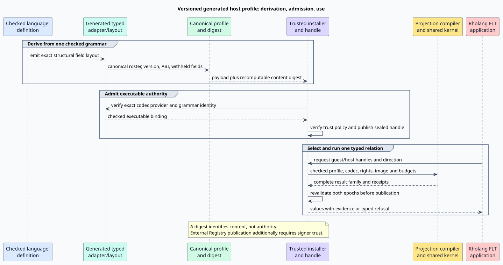

# Versioned Rholang host profiles for GSLT projections

Status: proposed integration plan for review. The typed GSLT projection surface and selected-relation kernel are partially implemented; a trusted, executable Rholang host-profile binding is **not** yet installed. This plan is subordinate to the [approved projection relation design](gslt-projection-rules.md) and keeps the [Module/Theory syntax work](module-ddl-full-surface-syntax.md) on its own path. It neither introduces a second Rholang language nor reparses Rholang-specified theories.

## Purpose and vocabulary

A *guest* is an installed language specified by an in-Rholang Theory or by a checked compiled definition. The *host* of the projection considered here is the generated Rholang grammar and its executable structural adapter. A *host profile* is a versioned, canonical description of that checked grammar's categories, constructors, field shapes, and codec contract. A *codec provider* is the implementation that transports values into and out of the already existing generated Rholang term representation. A *binding* is an installed, sealed association between one profile, one exact codec provider, and the authority needed to use it. A profile's digest identifies content; it is not a capability.

The author writes, for example, a guest-to-host rule involving `host::Bool` in `Rewrites`. The author does **not** define `host::Bool`, supply Rholang constructors, choose a trusted fingerprint, or grant a callback. The compiler resolves the category against an independently admitted host binding. The same mechanism must work for other checked host grammars; only startup policy chooses Rholang as the built-in host for an ordinary Rholang application.



The [generated Rholang grammar](../../../languages/src/rholang.rs) remains the one application entrypoint. Its Theory/Module declarations are already parsed into structural `Ddl*` terms, then lowered through the [iterative DDL wire](../../../rholang-runtime/src/ddl_ast.rs) and the [canonical elaborator](../../../mettail-elab/src/wire.rs). A profile is derived from the checked `language!` definition and generated adapter layout, never from `definition_source()` text or a displayed term. This preserves the user's requirement that a Theory not be parsed a second time.

## Existing boundary and the actual gap

The macro already emits Rholang's typed parser and a Dovetail adapter. The latter retains the `MethodCall` receiver as an exact `FieldWithheldProc` leaf: the [Rholang withholding rule](../../../languages/src/rholang.rs) intentionally prevents the semantic engine from reducing the receiver as an independent child, while [typed lowering](../../../macros/src/gen/runtime/dovetail_report/typed_lowering.rs) and [reconstruction](../../../macros/src/gen/runtime/dovetail_report/reconstruct.rs) preserve its value. Ordered arguments have their own exact field representation. Replacing either with an ordinary reducible child would change Rholang semantics.

The optional `generated_semantic_artifacts_v1()` export is a *different* interface. Its [source-neutral artifact conversion](../../../macros/src/gen/runtime/dovetail_report/semantic_adapter.rs) currently refuses `SemanticFieldProjection::Withheld` because the neutral schema lacks the corresponding structural-child coefficient. That refusal blocks using the complete neutral `GrammarCore`/`SemanticSignature`/`SemanticMachineImage` triple as Rholang's host profile today. It does **not** mean the macro-generated Rholang parser or typed adapter is broken. The plan must either extend that neutral schema with a faithful inert withheld leaf, or derive a separate checked host-signature/codec descriptor from the same adapter layout while leaving complete neutral export explicitly unavailable. Neither path may reconstruct an allegedly equivalent grammar by reparsing source.

The current [projection descriptor](../../../grammar-core/src/projection_core.rs) contains `signature_fingerprint` and `codec_profile_fingerprint`, but its fields can be supplied by a caller. The [image compiler](../../../dovetail-runtime/src/theory_image_compiler.rs) checks roster consistency and equality against those fields; it does not authenticate their provenance. The current [static installation path](../../../grammar-core/src/installed.rs) records `semantic_image: None` and installs a structural parser only. Therefore raw descriptor equality and `install_static` cannot be used as evidence of an executable, trusted Rholang host binding.

## Identity, version, and trust

The profile payload is canonically encoded and contains at least:

| Commitment component | Why it is bound |
|---|---|
| Language identity and explicit grammar version | A source projection must not silently acquire the categories or semantics of a later Rholang release. |
| Generated definition and grammar digests | The checked `language!` expansion, not an author-supplied label, determines the roster. |
| Category, constructor, and field roster | A rule must resolve `host::Category` and structural patterns against exact checked shapes. |
| Field carrier and withholding layout | Round trips must preserve inert `MethodCall` receiver transport and ordered arguments. |
| Semantic-key ABI and codec ABI/provider epoch | A profile must not be paired with a different implementation merely because category names match. |
| Canonical encoding/profile ABI | Hashes and older installed handles remain unambiguous across schema changes. |

The *profile digest* is recomputed from domain-separated canonical bytes at admission. The existing `signature_fingerprint` field should be renamed or precisely documented as this content commitment; it is not a publisher's digital signature. A *digital signature* is needed when an external Registry publisher attests the signed record and its pinned profile/provider policy. The built-in profile can instead be trusted through the node's compiled startup path. In both cases an untrusted Rholang term containing the correct digest is still just data, not authority. The [Registry record](../../../mettail-elab/src/registry.rs) already defines canonical signed payload bytes and excludes replaceable parser-image caches; the [installer](../../../rholang-runtime/src/language_install.rs) calls `verify_module_trust` before using such a record. Profile publication must bind signer identity, exact version, content digest, provider identity/epoch, and the intended admission policy in an authenticated payload. A signed module may attest *data*; it may not smuggle native callbacks into the node.

Two installed projection endpoints are version-compatible only when the pinned profile digest, grammar version, codec ABI, and provider epoch agree with the admitted binding. A newer Rholang release produces a new binding even if several category names happen to be unchanged. Source-level declarations may be portable and re-elaborated against a newer profile, but an installed projection image and its receipts never silently migrate. Existing handles remain attached to their original profile until explicit retirement or revocation.

The generated `LanguageDef` currently has no dedicated version field ([definition model](../../../ast/src/language/model.rs)); its [definition fingerprint](../../../ast/src/identity.rs) already includes checked options. Add a version field as checked language metadata, include it in the fingerprint, and emit it in the generated profile. Pin Rholang's first final version only after the approved syntax amendments settle its constructor roster. This is a dependency, not permission to accept an unversioned trusted profile in the meantime.

## Construction and installation algorithm

The following algorithm is normative for the proposed seam. Each operation either returns a checked result or a typed refusal; no branch substitutes a default profile or codec.

```text
derive_profile(checked_language_definition, generated_adapter_layout):
    require the layout belongs to the same checked definition
    enumerate checked categories, generated constructors, and exact field roles
    include language version, grammar identity, semantic-key ABI, codec ABI, provider epoch
    canonicalize the payload under a versioned profile schema
    return payload and domain-separated digest(payload)

admit_host_profile(payload, codec_provider, trust_evidence, install_policy):
    recompute and compare every content commitment
    check definition/grammar identity against the installed generated parser
    check provider ABI, epoch, exact structural round-trip obligations, and policy
    verify publisher authorization when the source is Registry-distributed
    reject missing, duplicate, inconsistent, or revoked candidates
    atomically publish one sealed executable host binding

compile_projection(guest_theory, authored_projection, sealed_host_binding):
    authorize use of the exact still-live binding
    resolve qualified host sorts and constructors against its checked roster
    compile typed directed rows into the existing flat rule programs and set automata
    commit guest identity, host profile, codec ABI, selected relation, and source occurrences
    return a versioned projected image or a typed refusal

use_projection(request, installed_guest, installed_host):
    validate rights, both exact bindings, direction, category, budgets, and cancellation
    run the selected relation through the existing semantic transition kernel
    preserve every admissible result, source occurrence, and receipt
    revalidate both bindings and authority before publishing any result
    return checked values with evidence, or an explicit refusal/undetermined outcome
```

The [existing shared image compiler](../../../dovetail-runtime/src/theory_image_compiler.rs) and [semantic transition kernel](../../../dovetail-runtime/src/semantic_transition_kernel.rs) already represent projection rules as selected, endpoint-typed relations over the flat rule arena and set automata. The profile is an admission and codec seam around that pipeline, **not** a new parser, matcher, rewrite evaluator, or operator instruction set. Ordinary guest rewrites stay isolated from host projections; an authored `<~>` supplies two independently checked directions and never asserts a global inverse law by syntax alone.

The installed-language table needs an explicit executable-host installation path. It seals the profile, parser identity, semantic image or generated typed adapter, codec provider, rights, and install epoch in one atomic commitment. The opaque handle, not the profile digest, is what authorizes use. Installation must reject a profile with no executable exact codec. Revocation and reinstallation change the live epoch, and publication checks it again after kernel execution so an in-flight result cannot escape a revoked authority. The same abstraction accommodates a compiled non-Rholang host and a runtime-defined host with an independently admitted provider; a runtime grammar cannot conjure native implementation code from a name.

## Formal refinement and test obligations

The existing [typed projection relation model](../../../formal/rocq/runtime_grammar/theories/TypedProjectionRelation.v) proves direction selection, endpoint typing, conditional inversion, two-leg composition, and (in its current host-binding extension) unique matching registered identities. Its `nat` identifiers abstract commitments; their equality is **not** a proof of hash collision resistance, signer authorization, or executable codec correctness. Extend the model before completing the runtime seam with:

1. Versioned grammar/profile identity and a provenance rule connecting generated descriptors to the checked language definition.
2. An explicit installed authority and codec provider; content equality alone cannot create a handle.
3. Exact field-preservation and round-trip laws, including the inert withheld receiver and ordered arguments. A lossy relation does not acquire an inverse theorem.
4. Binding uniqueness, duplicate-profile refusal, stale-version refusal, revocation, and a pre-publication revalidation law.
5. Refinement from authored rule selection to the existing kernel image, preserving all candidates, source occurrences, budgets, and incomplete-evidence outcomes.

Implementation tests must compare deterministic profile bytes/digests across identical builds and reject a one-field mutation of *each* committed dimension. They must exercise exact receiver/argument round trips, changed Rholang versions, wrong and duplicate profiles, missing and wrong codec providers, unsigned or unauthorized Registry records, revocation during use, and simultaneous guest/host upgrade attempts. Differential tests should compare the generated typed adapter with the admitted profile codec on the same structural terms; a second hand-written evaluator is not a valid oracle. Runtime tests must preserve complete ambiguity and ensure a failed projection or exhausted guard never becomes host `false`.

## Implementation order and review gates

1. Define canonical profile payload, encoding, domain-separated digest, and recomputation at admission. Distinguish a raw descriptor from a sealed trusted binding.
2. Generate the versioned payload from the checked macro definition and common semantic-adapter layout, then preserve withheld and ordered fields through the existing typed lowering/reconstruction path.
3. Add the executable, atomic host installation path and exact codec/provider commitment. Do not broaden the parser-only meaning of `install_static` silently.
4. Bind projection elaboration to the sealed profile instead of caller-supplied fingerprints. Complete Rholang's version pin and built-in registration after the syntax roster is stable.
5. Admit Registry-distributed profile attestations under the existing signed-record trust path without allowing untrusted native code; revalidate both handles on use and publication.
6. Extend and check the formal model, then run the independent end-to-end, mutation, authority, ambiguity, and regression audit.

Each slice is a real implementation step, not a claim that its later dependencies are already present. The feature is complete only when the generated Rholang host profile is admitted, an in-Rholang guest Theory can bind typed projections to it, an FLT can execute them through the shared kernel, and all version, authority, revocation, codec, and ambiguity checks pass.
