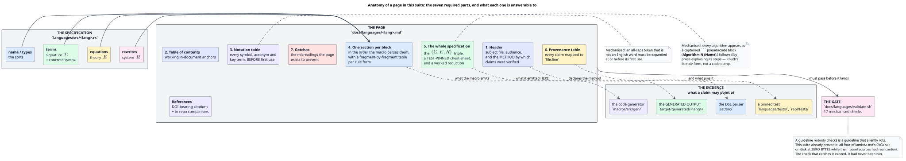

# Language Specification References

Last updated: 2026-08-04

One page per bundled `language!` specification. Each page walks its `languages/src/*.rs` block
**component by component** — what every fragment of the DSL (domain-specific language) means, what
the macro generates from it, and how the result executes — with every claim traced to a file and
line in the parser, the code generator, or the *actual generated output* under
`target/generated/<lang>/`.

**What this suite is for.** The DSL is dense: a twelve-line block can expand into thirty-eight
generated modules. Reading a specification therefore requires knowing three things at once — the
surface grammar of the DSL, the semantics of the theory being declared, and the machinery each
clause switches on. The other suites cover those axes generically; these pages tie them to one
concrete, complete specification each, so you can read a real block start to finish without
guessing.

**What this suite is not.** It is neither a DSL grammar reference nor a compiler-internals
document. See [Related documents](#related-documents) for those.

---

## Notation

Every term the roster and the conventions below depend on, defined before it is used. Each page
carries its own, larger notation table for the vocabulary specific to that language.

| Symbol / term | Meaning |
|---|---|
| $`\Sigma`$ | **signature** — the constructors (term formers) of a theory, with their arities and sorts |
| $`E`$ | **equational theory** — a set of *undirected* laws identifying terms |
| $`R`$ | **rewrite system** — a set of *directed* reduction rules |
| $`(\Sigma, E, R)`$ | the triple a `language!` block denotes; every page in this suite exhibits its own |
| **DSL** | domain-specific language — here, the `language!` surface these pages read |
| **GSLT** | Greg's Structured Labelled Transition system — the $`(\Sigma, E, R)`$ presentation MeTTaIL compiles, and the organising idea of the omnibus paper whose conformance ladder four of these specifications transcribe |
| **AC** | associative–commutative — a bag-like collection whose elements have no order and no grouping, so `a \| b` and `b \| a` are the same term |
| **COMM** | the *communication* reduction of a process calculus: a send and a matching receive on one channel rendezvous and are consumed together |
| **AST** | abstract syntax tree |
| **L1**, **L2**, … | rungs of the GSLT omnibus paper's conformance ladder, cited in the roster's *What the specification exercises* column |

---

## The roster

Every production specification in `languages/src/`. Four are transcriptions of the GSLT omnibus
paper's conformance ladder (their module headers cite `omnibus.tex` line ranges); four are native
MeTTaIL languages.

| Language | Source | Lines | Sorts | What the specification exercises | Page |
|---|---|---:|---|---|---|
| **Lambda** | `languages/src/lambda.rs` | 34 | `Term` | binders and higher-order abstract syntax, β-reduction via the `eval` meta-operator, congruence rules as reduction contexts | ✅ [lambda.md](lambda.md) |
| **Monoid** | `languages/src/monoid.rs` | 94 | `M` | GSLT omnibus **L2** — the *equations* rung: `Assoc` / `UnitL` / `UnitR` with an empty `rewrites` block; the quotient an equational theory induces | ✅ [monoid.md](monoid.md) |
| **Json** | `languages/src/json.rs` | 267 | `Value`, `Field`, `![bool] as Bool`, `![CanonicalBigRat] as BigRat`, `![str] as Str` | GSLT omnibus **L1** — the *types + terms* rung: native payload carriers, `literals { }` lexer classes, collection sorts | ✅ [json.md](json.md) |
| **Turing** | `languages/src/turing.rs` | 191 | `Config`, `Tape`, `State`, `Sym`, `![u32] as UInt32` | GSLT omnibus **L9** — the paper's deliberate *non*-example: a single-tape machine as a GSLT, a `Vec(Sym)` zipper tape, and a `fold` helper that both fold lanes reject | ✅ [turing.md](turing.md) |
| **Pi** | `languages/src/pi.rs` | 233 | `Proc`, `Name` | GSLT omnibus **L11** — the π-calculus: name restriction as a nominal binder, `HashBag` parallel composition with `*sep`, the typed COMM lane, and a documented surface delta (literal-led binder prefixes) | ✅ [pi.md](pi.md) |
| **Ambient** | `languages/src/ambient.rs` | 135 | `Proc`, `Name` | Cardelli–Gordon mobile ambients: six structural-congruence *equations* with freshness premises (`x # N`), scope extrusion over an AC bag, and three capability rewrites with congruences | ✅ [ambient.md](ambient.md) |
| **Calculator** | `languages/src/calculator.rs` | 793 | `Proc` plus the native numeric tower (`Int`, `UInt32`, `BigInt`, `BigRat`, `Fixed`, `Float`, `Bool`, `Str`) | `literals { }` with regex patterns and `eval` blocks, native `![…]` folds, numeric casts, `fold` / `step` evaluation modes | ✅ [calculator.md](calculator.md) |
| **Rholang** | `languages/src/rholang.rs` | 2 785 | `Proc`, `Name`, `InputBind`, `ForRow` plus the native tower | the flagship: COMM as a rewrite, multi-binder receives, collections, guards, `options { }`, and hand-written `logic { }` | ✅ [rholang.md](rholang.md) |

Composition fixtures (`languages/src/composition/`) and the Rholang support modules
(`languages/src/rholang/`) are not specifications in their own right; composition is documented in
[`../design/exploring/theory_composition.md`](../design/exploring/theory_composition.md) and
[`../../prattail/docs/design/architecture-overview.md`](../../prattail/docs/design/architecture-overview.md).

---

## Where to start

**If you have never read a `language!` block:** start with [lambda.md](lambda.md). It is the
smallest complete specification in the tree — one sort, two constructors, no equations, four
rewrite rules — and every construct it uses recurs, at greater scale, in every other language. Its
§5 (`terms`) and §7 (`rewrites`) are the reusable parts; read those once and the other pages become
skimmable.

**If you are looking for one specific mechanism**, the shortest path is:

| You want to understand… | Read |
|---|---|
| binders, scopes, α-equivalence, capture-avoiding substitution | [lambda.md §5.1](lambda.md#51-lam--xbodyterm---term---lam--x--body--term), [§7.1](lambda.md#71-beta----app-lam-fun-arg--eval-fun-arg) |
| how a rewrite rule's premises work | [lambda.md §7.2](lambda.md#72-the-three-congruence-rules) |
| what an *equation* is, versus a *rewrite* | [lambda.md §6](lambda.md#6-equations----the-equational-theory-e) |
| what the macro actually generates, and where it lands | [lambda.md §2](lambda.md#2-what-language-is-and-what-it-produces) |
| the DSL's full surface grammar, block by block | [`../../readme_dev.md`](../../readme_dev.md) §"Guide: defining a language theory" |

---

## The shape of a page, and the shape of a specification



*Figure 1. Left: the blocks of a `language!` specification. Centre: the seven parts every page in
this suite carries, in order. Right: the four kinds of evidence a claim is allowed to rest on —
the parser, the generator, the generated output, or a pinned test. Bottom: the gate all of it must
pass. Source: [figures/suite-page-anatomy.puml](figures/suite-page-anatomy.puml).*

For orientation while reading any page in this suite. The block order is fixed by
`impl Parse for LanguageDef`; optional blocks may be omitted entirely.

```text
language! {
    name: YourLanguage,
    extends:  [Base],   /* optional — full inheritance: types, terms, equations, rewrites, logic, guards */
    includes: [Other],  /* optional — grammar only */
    mixins:   [Frag],   /* optional — fragment grammar */
    options   { … },    /* optional — parser tuning (beam_width, dispatch, …) */
    types     { … },    /* the sorts: algebraic, native-payload, or collection */
    literals  { … },    /* optional — lexer patterns + eval blocks for literal tokens */
    terms     { … },    /* the signature and the concrete syntax */
    guards    { … },    /* optional — declared predicate dispatch */
    equations { … },    /* undirected laws */
    rewrites  { … },    /* directed reduction */
    logic     { … },    /* optional — hand-written Datalog relations */
}
```

The two rule productions, which account for most of any specification's bulk:

```text
terms:      Label . term_context |- concrete_syntax : Category [ ![rust] ] [ fold | step ] [ right ] [ prefix(N) ] [ canonical ] ;
equations:  Name  . type_context | premises |- lhs_pattern  =  rhs_pattern ;
rewrites:   Name  . type_context | premises |- lhs_pattern  ~>  rhs_pattern ;
```

`|-` is the turnstile: in `terms` it separates metasyntax (arguments and their binding structure)
from object syntax (what a programmer types); in `equations` and `rewrites` it separates the
contexts from the rule proper. Rule patterns are **abstract-syntax S-expressions**
$`(\mathrm{Constructor}\ \mathit{arg}_1\ \mathit{arg}_2\ \dots)`$, never the concrete syntax
declared by `terms`.

---

## Conventions for pages in this suite

Each page should carry, in this order:

1. **Header** — subject file, audience, and the method by which claims were verified.
2. **A table of contents** with working in-document anchors.
3. **A notation table** defining every symbol, acronym, and key term before first use.
4. **One section per block** of the specification, in the order the macro parses them, with a
   fragment-by-fragment table for each rule form the language introduces.
5. **The specification as a whole** — the $`(\Sigma, E, R)`$ triple it denotes, a concrete-syntax
   cheat-sheet drawn from a *test-pinned* corpus (never invented), and at least one worked
   reduction.
6. **A provenance table** — every claim mapped to `file:line` in the parser, the generator, the
   generated output, or a test.
7. **Gotchas** — the misreadings the page exists to prevent.
8. **References** — every external work cited with a resolvable DOI, plus the in-repo companions.

### What `validate.sh` will hold you to

Four of those conventions are mechanised, so they fail the build rather than the review. Read this
before writing a page; each is cheap to satisfy up front and tedious to retrofit.

- **Acronyms are expanded at or before first use.** The check treats an all-caps token that is not
  an English dictionary word as an acronym, and accepts four definition forms: `ACRONYM
  (expansion)`, `expansion (ACRONYM)`, a notation-table row whose first cell is the acronym, or a
  bold gloss `**ACRONYM** — expansion`. Bibliographic parentheticals such as `(POPL '73)` count.
- **Algorithms are presented in literate form.** An algorithm is a fenced block with the
  info-string `pseudocode`, captioned `**Algorithm N (Name).**` in the six lines above it, and
  *exposited* — prose explaining the steps within twelve lines below. Every expository page needs
  at least one; this index does not, because a roster presents no algorithm.
- **Every expository page embeds at least one rendered figure**, referenced as
  ``.
- **Every reference entry carries a DOI**, or a navigable relative link to an in-repo document, or
  the literal marker `(no DOI registered)` when the work genuinely has none. Fabricating a DOI is
  the worst failure this suite can ship, so registered DOIs are additionally resolved against
  `doi.org` whenever the network is available.

Mathematics is held to the same line whether it sits inside backticks or not. A complexity class
or a relation wrapped in *plain* backticks is an **inert code span**: it renders as monospace, so
it looks deliberate and survives review, while carrying none of the typesetting a formula needs.
It is as much a violation as the same expression left bare in prose, and the checker treats the two
identically. Write $`\Theta(|S|)`$ and $`t \subseteq u`$ as math spans; keep backticks for things
that really are code, like `HotStoreState::clone`.

### Diagramming policy

PlantUML only (`figures/*.puml`), rendered to SVG and committed alongside the source:

```sh
plantuml -tsvg docs/languages/figures/*.puml
```

Figure files are prefixed with their language (`lambda-beta-firing.puml`) so the directory stays
navigable as pages are added; figures belonging to this index rather than to any one language take
the prefix `suite-` (`suite-page-anatomy.puml`). Use the house palette — `#DBEAFE` structure,
`#DCFCE7` syntax and surface, `#FCE7F3` rewrites and the host, `#EDE9FE` engine internals,
`#FEF3C7` metadata and equations, `#FEE2E2` failure — and PlantUML's `<latex>…</latex>` for
mathematics in labels rather than unicode literals. `validate.sh` rejects any `.puml` that carries
no explicit `#RRGGBB` colour at all.

### Mathematics in prose

GitHub-flavored Markdown delimiters: inline math is a backtick span wrapped in dollar signs, and
display math is a fenced block with the `math` info-string. Bare `$…$` and `$$…$$` are forbidden —
GitHub's CommonMark pass strips backslash escapes before MathJax parses them. `validate.sh`
enforces this.

### Validation

```sh
docs/languages/validate.sh
```

Seventeen checks, each reporting its own name and one of **PASS** / **FAIL** / **SKIP** /
**ERROR**. Every verdict is taken from an exit code and never from grepped output; the run does not
stop at the first failure, so one invocation shows you everything.

The four states are deliberately distinct, mirroring `scripts/check-fmt.sh` in the sibling
`f1r3node-rust-mettail` workspace rather than inventing a second convention:

| Exit | State | What it means | Is it a failure? |
|---:|---|---|---|
| 0 | **PASS** | the check ran and found nothing | no |
| 1 | **FAIL** | the check ran and found violations — fix the document | yes |
| 2 | **ERROR** | the check itself broke; the pages are **unchecked**, and the answer is unknown | yes |
| 3 | **SKIP** | the check could not run here and said why | no, but it is *not* a pass |

★ **ERROR and FAIL demand different responses**, which is why they are not merged: *fail* means the
document is wrong, *error* means nobody knows. Collapsing them reproduces the defect the Rust-side
`check-fmt.sh` exists to prevent — `rustfmt` with a non-empty ignore list exits 101 having printed
nothing, so a `| grep -c '^Diff in'` gate scored a crash as CLEAN and an agent reverted a correct
change on the strength of it. `doclint.py` therefore catches every unexpected exception and returns
2, because an uncaught Python traceback exits 1 and would be indistinguishable from "violations
found".

| # | Check | Guideline it mechanises |
|---:|---|---|
| 1 | `fences-balanced` | structural precondition for every other fence check |
| 2 | `math-symbol-literals` | `math-mathjax` |
| 3 | `math-delimiters` | `math-delimiters` |
| 4 | `math-github-renderable` | `math-delimiters` (commands GitHub cannot typeset) |
| 5 | `math-backticks` | `math-backticks` — inert code spans and bare prose |
| 6 | `diagrams-plantuml-assets` | `diagrams-prefer-plantuml`, `diagrams-complete` |
| 7 | `diagrams-plenty` | `diagrams-plenty` |
| 8 | `diagrams-fully-colored` | `diagrams-fully-colored` |
| 9 | `links-relative` | `doc-placement` |
| 10 | `anchors-in-document` | `pedagogy-logical-flow` |
| 11 | `citations-exist+doi-links` | `citations-exist`, `citations-doi-links` |
| 12 | `citations-doi-valid` | `citations-doi-valid` — network, **SKIPs** when offline |
| 13 | `pedagogy-define-terms` | `pedagogy-define-terms` |
| 14 | `algorithms-literate-pseudocode` | `algorithms-literate-pseudocode` |
| 15 | `code-snippets-valid` | `code-snippets-valid` |
| 16 | `roster-coverage` | `doc-naming-structure` |
| 17 | `live-spec-source` | `coverage-semantics` |

The remaining guidelines — `coverage-doc-types`, `diagrams-best-types`, `diagrams-best-actors`,
`pedagogy-intuition-rationale` and their kin — are editorial judgements. They are reviewed by hand
and are *not* silently assumed to hold.

Three checks can report **SKIP**, and a skip is never a pass. `citations-doi-valid` skips when
`doi.org` is unreachable — because a gate that fails on a plane is a gate people disable — and also
when *any single DOI* comes back indeterminate, since partial verification reported as PASS would
convert "we could not check these" into "these are fine". Set `DOCLINT_DOI=on` to make
unreachability fatal in continuous integration, or `DOCLINT_DOI=off` to skip deliberately.
`pedagogy-define-terms` skips when no word list is installed; point `DOCLINT_WORDLIST` at one to
re-enable it (when set, it is authoritative — there is no silent fallback). `code-snippets-valid`
skips its Rust half when `rustfmt` is absent.

A page outside this directory can be held to the document-level checks by naming it:

```sh
docs/languages/validate.sh docs/design/exploring/lookahead-traces-as-a-pathmap.md
```

### The checker checks itself

```sh
docs/languages/doclint.py selftest
```

Because a check never observed to reject anything is evidence only that it ran. The self-test
constructs, and asserts on, four kinds of input:

1. a **negative fixture per check** that must be rejected — thirteen of them, including a fabricated
   DOI that must come back unregistered from `doi.org`;
2. a **false-positive control** — link syntax written inside a code span, which the link checker
   must *not* treat as a live link;
3. a **clean document** that every check must accept, so that no check is wired to fail
   unconditionally;
4. the **four driver states**, run as real subprocesses, asserting that a clean run, a violating
   run, a crashed run, and a skipped run produce four *different* exit codes. If fewer than four
   distinct codes are observed, the self-test fails.

### Where the checker lives

`doclint.py` sits beside `validate.sh`, not in a repo-level `scripts/`, because `validate.sh` is
its only caller and a gate should travel with its implementation. The other three documentation
suites carry their own validators and none imports it; if a second suite ever adopts it, that is
the moment to lift it into a shared location. It requires **Python 3.9+** (checked at start-up),
and it disables bytecode caching so it never leaves a `__pycache__` in the directory it audits.
The supported invocation is as a script.

### Adding a page

1. Write `docs/languages/<module>.md`, where `<module>` matches `languages/src/<module>.rs`.
2. Give it the eight parts listed above, including at least one captioned `pseudocode` algorithm
   and a References section whose entries carry DOIs.
3. Put its figures in `figures/<module>-*.puml`, render them to SVG, and embed at least one.
4. Add the page to [the roster](#the-roster) — `validate.sh` fails if it is missing.
5. Flip the language's row from ☐ to ✅.
6. Run `docs/languages/validate.sh`.

---

## Related documents

| Document | What it covers that this suite does not |
|---|---|
| [`../../readme_dev.md`](../../readme_dev.md) | the DSL block-by-block *reference*: syntax, semantics, goal, and which codegen path consumes each block |
| [`../../prattail/docs/usage/grammar-features.md`](../../prattail/docs/usage/grammar-features.md) | the complete grammar-feature catalogue: prefix/infix/mixfix rules, associativity, binding powers, collections |
| [`../architecture/rho-native-integration/27-oslf-language-to-rholang-compilation.md`](../architecture/rho-native-integration/27-oslf-language-to-rholang-compilation.md) | how a `language!` specification is compiled into an installed Rholang program via the set automaton |
| [`../architecture/rho-native-integration/19-in-rho-binder-beta-substitution.md`](../architecture/rho-native-integration/19-in-rho-binder-beta-substitution.md) | the in-Rho de-Bruijn substitution cascade that executes binder β |
| [`../architecture/dovetail/README.md`](../architecture/dovetail/README.md) | the rewrite engine itself: e-graphs, saturation, extraction, reports |
| [`../design/exploring/theory_composition.md`](../design/exploring/theory_composition.md) | `extends` / `includes` / `mixins` and the theory of language composition |
| [`../examples/rholang/`](../examples/rholang/) | the Rholang walk-through: specification, macro expansion, lexer, parser, codegen, evaluation |
| [`../design/guards-block.md`](../design/guards-block.md) | the optional `guards { }` block and predicate dispatch |

---

## References

The theories the roster names, so that "Cardelli–Gordon mobile ambients" and "the π-calculus" are
citations rather than gestures. The suite-wide register, with fuller annotations, is
[`../architecture/rho-native-integration/references.md`](../architecture/rho-native-integration/references.md).

- **Cardelli & Gordon 1998** — Cardelli, L., and Gordon, A. D. *Mobile Ambients.* In *Foundations
  of Software Science and Computation Structures* (FoSSaCS 1998), Lecture Notes in Computer
  Science (LNCS) 1378, pp. 140–155. Springer.
  DOI: [10.1007/BFb0053547](https://doi.org/10.1007/BFb0053547).
  The normative theory for the **Ambient** row: the structural congruence with freshness premises,
  scope extrusion over an AC bag, and the in/out/open capability reductions.
  Register entry:
  [MOBILE-AMBIENTS-1998](../architecture/rho-native-integration/references.md#mobile-ambients-1998).

- **Milner, Parrow & Walker 1992** — *A Calculus of Mobile Processes, Parts I and II.* Information
  and Computation 100(1): 1–40 and 41–77.
  DOI: [10.1016/0890-5401(92)90008-4](https://doi.org/10.1016/0890-5401%2892%2990008-4) (Part I),
  [10.1016/0890-5401(92)90009-5](https://doi.org/10.1016/0890-5401%2892%2990009-5) (Part II).
  The theory for the **Pi** row: name passing, restriction as a binder, replication, and the COMM
  rule that parallel composition serves.

- **Meredith & Radestock 2005** — *A Reflective Higher-Order Calculus.* Electronic Notes in
  Theoretical Computer Science.
  DOI: [10.1016/j.entcs.2005.05.016](https://doi.org/10.1016/j.entcs.2005.05.016).
  The $`\rho`$-calculus underlying the **Rholang** row — quoting, reflection, and COMM.
  Register entry: [RHO-2005](../architecture/rho-native-integration/references.md#rho-2005).

- **Stay & Meredith 2017** — *Representing Operational Semantics with Enriched Lawvere Theories.*
  arXiv:1704.03080.
  DOI: [10.48550/arXiv.1704.03080](https://doi.org/10.48550/arXiv.1704.03080).
  The $`(\Sigma, E, R)`$ presentation every page in this suite exhibits.
  Register entry: [OSLF-2017](../architecture/rho-native-integration/references.md#oslf-2017).

- **The GSLT omnibus paper** — the internal manuscript whose conformance ladder supplies the
  **L1**, **L2**, **L9** and **L11** rungs cited in the roster. Its `omnibus.tex` line ranges are
  quoted in the module headers of the corresponding `languages/src/*.rs` files. Unpublished
  in-project source; *(no DOI registered)*.
