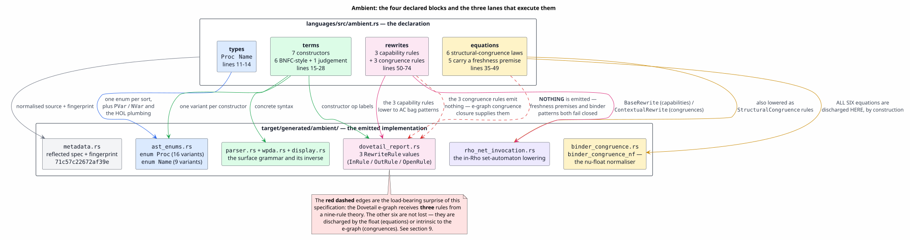
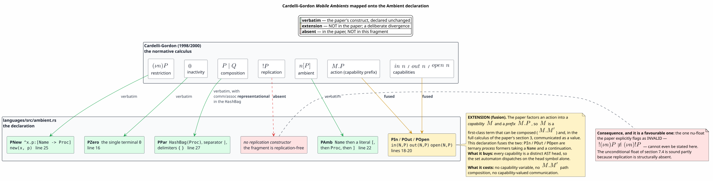
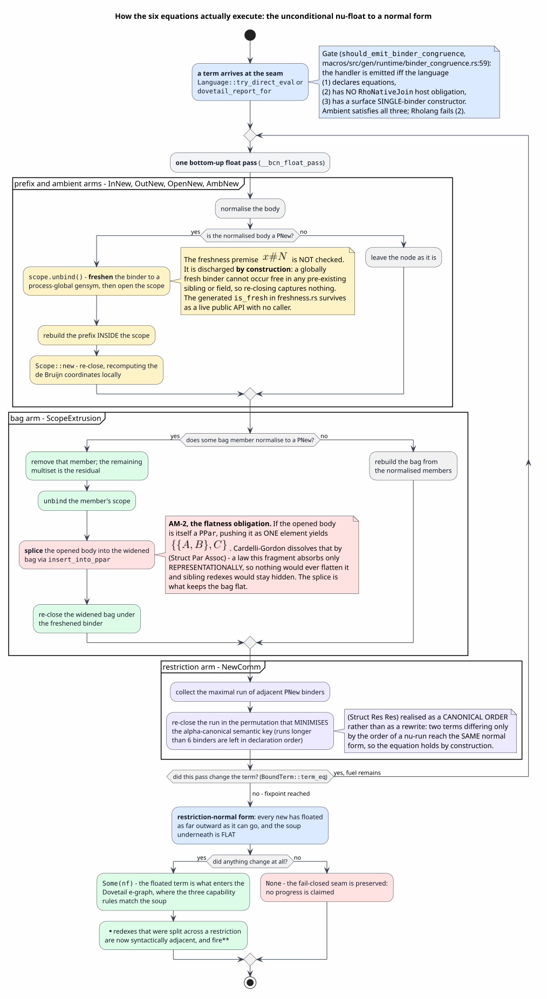
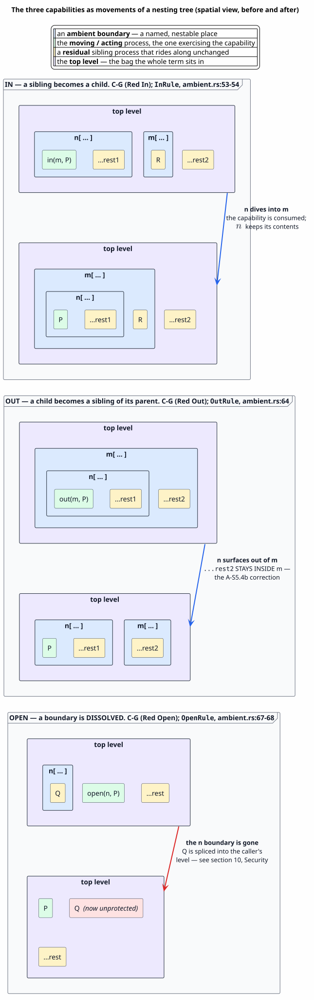
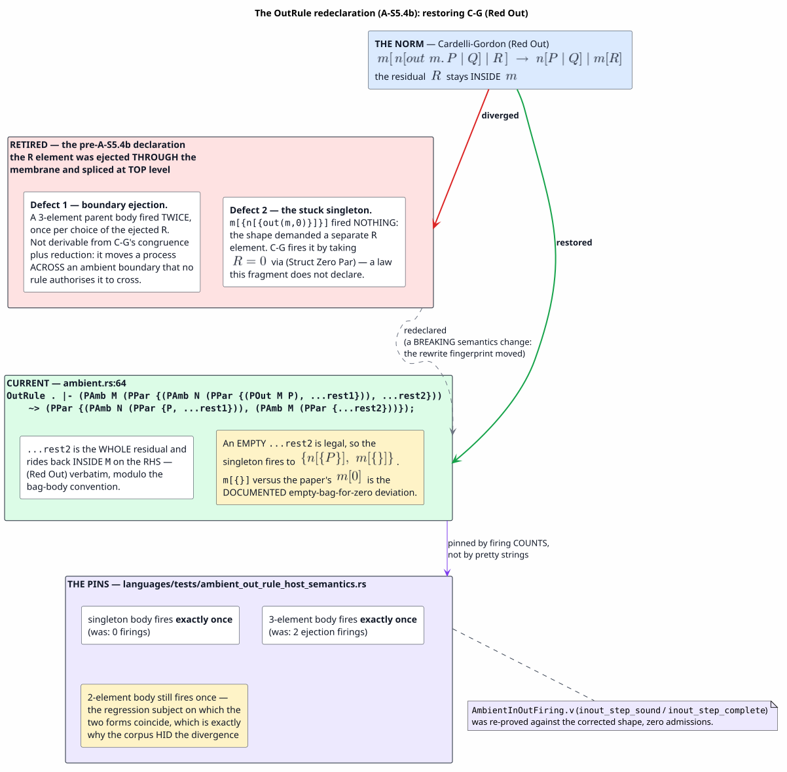
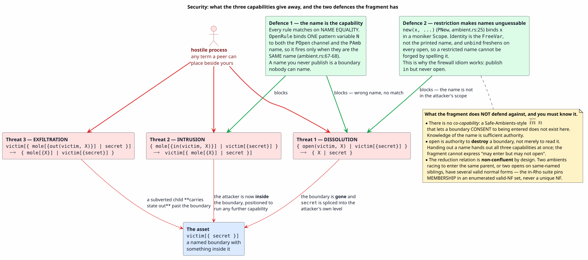

# Ambient — the `language!` specification for the Cardelli-Gordon ambient calculus, component by component

Last updated: 2026-07-29 · part of the [Language Specification References](README.md) suite

**Subject:** `languages/src/ambient.rs` (135 lines: 19 rule declarations, the rest the C-G verdict commentary audited in [1.2](#12-the-elided-comment-blocks))
**Audience:** anyone reading this block who needs to know **exactly** how far it is, and is not, the
calculus of the *Mobile Ambients* paper
**Method:** every claim below was checked against the DSL (domain-specific language) parser that
reads this block, the code generator, the *actual generated output* in
`target/generated/ambient/`, the test pins, and — for every theory claim — against the paper
itself. [Section 12](#12-provenance-where-each-claim-comes-from) gives the
file-and-line provenance for each one.

> ### ⚠ This page is governed by a standing project rule
>
> **`Ambient` means *the* ambient calculus, and every change to `languages/src/ambient.rs` must be
> verified against Cardelli-Gordon.** The paper ([MOBILE-AMBIENTS-1998](#references)) is
> **normative** here, not inspirational. Accordingly this page does two things an ordinary
> language page does not:
>
> 1. it exhibits the correspondence construct by construct
>    ([section 6](#6-the-cardelli-gordon-correspondence)), and
> 2. it **labels every extension as an extension** — anything in this block that the paper does not
>    have is called out, with the line that introduces it and a statement of what it buys and what
>    it costs ([section 6.3](#63-the-extensions-labelled-as-extensions)).
>
> Presenting a divergence as though it were canonical ambient calculus is the specific failure this
> rule exists to prevent. Where the implementation departs from the paper, this page says so in
> those words.

If you have never read a `language!` block, read [lambda.md](lambda.md) first: it explains
`terms`, `equations`, `rewrites`, binders, and the meaning of the turnstile at one-sixth the
scale. This page assumes those.

---

## Table of contents

1. [The specification under discussion](#1-the-specification-under-discussion)
2. [What the macro produces from these 19 declarations](#2-what-the-macro-produces-from-these-19-declarations)
3. [`name: Ambient` — the language identifier](#3-name-ambient--the-language-identifier)
4. [`types { Proc Name }` — the two sorts](#4-types--proc-name---the-two-sorts)
5. [`terms { … }` — the signature and the concrete syntax](#5-terms-----the-signature-and-the-concrete-syntax)
6. [The Cardelli-Gordon correspondence](#6-the-cardelli-gordon-correspondence)
7. [`equations { … }` — the structural congruence](#7-equations-----the-structural-congruence)
8. [`rewrites { … }` — the reduction relation](#8-rewrites-----the-reduction-relation)
9. [How a term actually reduces: the three lanes](#9-how-a-term-actually-reduces-the-three-lanes)
10. [Security: what mobility gives away](#10-security-what-mobility-gives-away)
11. [The specification as a whole](#11-the-specification-as-a-whole)
12. [Provenance: where each claim comes from](#12-provenance-where-each-claim-comes-from)
13. [Gotchas](#13-gotchas)
14. [References](#references)

---

## 1. The specification under discussion

Reproduced verbatim from `languages/src/ambient.rs`, with the line numbers this page cites. The
crate attributes and the `use` are omitted; the `language!` invocation begins at line 9. The
source's **comment blocks are elided** here and shown as `// ⟨…⟩` markers, which is why the numbers
jump; [1.2](#12-the-elided-comment-blocks) says what each elided block is and where this page
audits it.

```rust
language! {
    name: Ambient,                                                          // 10
    types {                                                                 // 11
        Proc                                                                // 12
        Name                                                                // 13
    },                                                                      // 14
    // ⟨signature C-G alignment header⟩                                     // 15-23
    terms {                                                                 // 24
        // ⟨PZero verdict⟩                                                  // 25-27
        PZero . Proc ::= "0" ;                                              // 28

        // ⟨EXTENSION — capability/prefix fusion⟩                           // 30-53
        PIn . Proc ::= "in(" Name "," Proc ")";                             // 54
        POut . Proc ::= "out(" Name "," Proc ")";                           // 55
        POpen . Proc ::= "open(" Name "," Proc ")";                         // 56

        // ⟨PAmb verdict⟩                                                   // 58
        PAmb . Proc ::= Name "[" Proc "]";                                  // 59

        // ⟨PNew verdict⟩                                                   // 61-63
        // PNew . Proc ::= "new(" <Name> "," Proc ")";                      // 64
        PNew . ^x.p:[Name -> Proc] |- "new" "(" x "," p ")" : Proc;         // 65

        // ⟨PPar verdict⟩                                                   // 67-70
        PPar . Proc ::= HashBag(Proc) sep "|" delim "{" "}" ;               // 71

        // ⟨ABSENT — replication⟩                                           // 73-76
    },                                                                      // 77
    // ⟨equation-block C-G alignment header⟩                                // 78-83
    equations {                                                             // 84
        NewComm . |- (PNew ^x.(PNew ^y.P)) = (PNew ^y.(PNew ^x.P));         // 86
        ScopeExtrusion . | x # ...rest                                      // 89
            |- (PPar {(PNew ^x.P), ...rest}) = (PNew ^x.(PPar {P, ...rest}));
        // ⟨EXTENSION — capability-prefix float⟩                            // 90-91
        InNew . | x # N |- (PIn N (PNew ^x.P)) = (PNew ^x.(PIn N P));       // 92
        OutNew . | x # N |- (POut N (PNew ^x.P)) = (PNew ^x.(POut N P));    // 93
        OpenNew . | x # N |- (POpen N (PNew ^x.P)) = (PNew ^x.(POpen N P)); // 94
        AmbNew . | x # N |- (PAmb N (PNew ^x.P)) = (PNew ^x.(PAmb N P));    // 97
    },                                                                      // 98
    rewrites {                                                              // 99
        InRule . |- (PPar {(PAmb N (PPar {(PIn M P) , ...rest1})),          // 102
                           (PAmb M R), ...rest2})                           // 102
            ~> (PPar {(PAmb M (PPar {(PAmb N (PPar {P , ...rest1})), R})),  // 103
                      ...rest2});                                           // 103

        OutRule . |- (PAmb M (PPar {(PAmb N (PPar {(POut M P), ...rest1})), // 113
                                    ...rest2}))                             // 113
            ~> (PPar {(PAmb N (PPar {P, ...rest1})),                        // 113
                      (PAmb M (PPar {...rest2}))});                         // 113

        OpenRule . |- (PPar {(POpen N P), (PAmb N Q), ...rest})             // 117
            ~> (PPar {P,Q, ...rest});                                       // 118

        ParCong . | S ~> T |- (PPar {S, ...rest}) ~> (PPar {T, ...rest});   // 121
        NewCong . | S ~> T |- (PNew ^x.S) ~> (PNew ^x.T);                   // 126
        AmbCong . | S ~> T |- (PAmb N S) ~> (PAmb N T);                     // 128
        // ⟨ABSENT — capability congruence⟩                                 // 130-133
    }                                                                       // 134
}                                                                           // 135
```

### 1.2 The elided comment blocks

The source carries its own C-G verdict beside every declaration. Those blocks are commentary
rather than declaration, so the listing above elides them; each is named here with the section of
this page that audits the claim it makes.

| Lines | Elided block | Audited in |
|---:|---|---|
| 15–23 | signature C-G alignment header — names the paper, scopes the fragment to its section 2, and states the three verdict words (`C-G verbatim` / `EXTENSION` / `ABSENT`) used throughout the block | [6.2](#62-signature-correspondence-construct-by-construct) |
| 25–27 | `PZero` is verbatim as a *term*; the Zero *laws* are absent | [6.4](#64-what-this-fragment-does-not-have) |
| 30–53 | **EXTENSION — capability/prefix fusion**: what the paper factors, what is fused, why it is conservative over section 2, what it buys and what it forecloses | [6.3](#63-the-extensions-labelled-as-extensions) |
| 58 | `PAmb` is verbatim | [6.2](#62-signature-correspondence-construct-by-construct) |
| 61–63 | `PNew` is verbatim, and is the one rule needing the judgement form | [5.3](#53-pnew--the-one-judgement-style-rule) |
| 67–70 | `PPar` is verbatim, with comm/assoc representational rather than axiomatic | [5.4](#54-ppar--the-collection-rule) |
| 73–76 | **ABSENT** — replication, and why its absence is load-bearing for the float extensions | [6.4](#64-what-this-fragment-does-not-have) |
| 78–83 | equation-block C-G alignment header: the equations are "the C-G table (Mobile Ambients) with three exact axioms and three documented sound extensions", and every float premise is the capture-avoidance condition `x # N`, "never the vacuous-binder condition `x # P` the pre-A-S5.4b declaration carried" | [7.1](#71-the-freshness-premise) |
| 90–91 | **EXTENSION — capability-prefix float**: "NOT C-G axioms — documented sound extensions" | [6.3](#63-the-extensions-labelled-as-extensions) |
| 100–101, 105–112, 115–116, 120, 123–125, 127 | the per-rewrite C-G citations, one per rule: (Red In), (Red Out) with the A-S5.4b redeclaration note, (Red Open), (Red Par), (Red Res), (Red Amb) | [8](#8-rewrites-----the-reduction-relation) |
| 130–133 | **ABSENT** — capability congruence, and why its absence is fidelity rather than omission | [6.2](#62-signature-correspondence-construct-by-construct) |

### 1.1 Notation used in this document

Everything below is defined before it is used. Symbols are given in the notation of the paper on
the left and of the DSL on the right, because this page constantly moves between the two.

| Symbol / term | Meaning |
|---|---|
| $`\Sigma`$ | **signature** — the set of constructors (term formers) with their arities and sorts |
| $`E`$ | **equational theory** — a set of *undirected* laws identifying terms |
| $`R`$ | **rewrite system** — a set of *directed* reduction rules |
| $`\equiv`$ | **structural congruence** — the paper's equivalence "up to trivial syntactic restructuring"; written `=` in the DSL's `equations` block |
| $`\rightarrow`$ | the paper's one-step **reduction** relation; written `~>` in the DSL's `rewrites` block |
| $`\rightsquigarrow`$ | the same relation when this page needs to distinguish the DSL's arrow from the paper's |
| $`n`$, $`m`$ | **names** — the paper's atomic ambient names; sort `Name` here |
| $`n[P]`$ | an **ambient** named $`n`$ whose contents are $`P`$; `PAmb` here |
| $`(\nu n)P`$ | **restriction** — creates a fresh name $`n`$ whose scope is $`P`$; `PNew` here. $`\nu`$ is read "nu" |
| $`M`$ | a **capability** — the paper's $`in\ n`$, $`out\ n`$, $`open\ n`$ |
| $`M.P`$ | an **action**: exercise capability $`M`$, then continue as $`P`$ |
| $`!P`$ | **replication** — unboundedly many parallel copies of $`P`$. *Not present in this fragment* |
| $`0`$ | **inactivity** — the process that does nothing; `PZero` here |
| $`fn(P)`$ | the **free names** of $`P`$ — the names occurring in $`P`$ that are not bound by a restriction |
| `#` | the DSL's **freshness** operator. `x # N` is the premise "`x` is not free in `N`", i.e. $`x \notin fn(N)`$. Parsed to `Premise::Freshness` |
| `...rest` | a **collection rest pattern** — binds the whole remaining multiset of a bag. Only legal as the *last* element of a `{ … }` metapattern |
| **AC** | **associative-commutative** — a matching discipline in which the order and bracketing of a collection's members is irrelevant |
| **HashBag** | the multiset carrier used for `PPar`; it absorbs AC *representationally*, i.e. by construction rather than by rule |
| **GSLT** | Greg's Structured Labelled Transition system — the $`(\Sigma, E, R)`$ presentation MeTTaIL compiles |
| **NF** | **normal form** — a term to which no further rule applies |
| **AST** | **abstract syntax tree** — the typed tree a program parses to |
| **LHS** | **left-hand side** — the pattern side of a rule, the part that must match |
| **RHS** | **right-hand side** — the contractum side of a rule, the part that is built |
| **moniker** | the binder library backing `Scope` / `Binder` / `FreeVar`; `unbind` freshens a binder on every open |
| **e-graph** | the Dovetail engine's equality-saturation data structure; congruence closure is intrinsic to it |
| **C-G** | Cardelli-Gordon, i.e. [MOBILE-AMBIENTS-1998](#references) |
| **A-S5.4a / A-S5.4b / A-S5.6** | internal campaign identifiers for, respectively, the unconditional float, the `OutRule` redeclaration, and the production flip onto the Rho machine. They appear verbatim in source comments and test names |

---

## 2. What the macro produces from these 19 declarations

`language!` is a procedural macro. It consumes a theory — the triple $`(\Sigma, E, R)`$ — and emits
an entire language implementation. For `Ambient` that is **41 non-empty generated Rust modules**
plus two TypeScript descriptors under `target/generated/ambient/`, and four generated test files
under `languages/tests/`.

Ambient declares four of the DSL's blocks. `options`, `literals`, `guards` and `logic` are absent;
`extends` / `includes` / `mixins` are absent. The generated `metadata.rs` confirms the absences
reflectively: `logic_relations`, `builtin_predicates`, `theories`, `channels`, `join_patterns` and
`connectives` are all empty slices, and `runtime_backends` is `NO_RUNTIME_BACKEND_CAPABILITIES`.



*Figure 1. Which generated artifact each block feeds. The two red dashed edges are the load-bearing
surprise of this specification and are the subject of
[section 7.3](#73-what-the-equations-compile-to). Source:
[figures/ambient-spec-to-artifacts.puml](figures/ambient-spec-to-artifacts.puml).*

A partial inventory, chosen for the modules this page cites:

| Module | Role | Size |
|---|---|---:|
| `ast_enums.rs` | the Rust `enum` for each sort | 59 lines |
| `parser.rs` + `wpda.rs` | the Pratt / weighted-pushdown-automaton parser | 2 986 + 8 973 lines |
| `display.rs` | `Display` — the inverse of the parser | 456 lines |
| `binder_congruence.rs` | **`binder_congruence_nf`** — the restriction-float normaliser. This module is where the `equations` block actually executes | 238 lines |
| `dovetail_report.rs` | the e-graph rule set: **exactly three** `RewriteRule` values | 3 rules |
| `rho_net_invocation.rs` | the in-Rho (Rholang) set-automaton lowering | 112 KB |
| `subst.rs`, `normalize.rs`, `iterative_cmp.rs`, `semantic_hash.rs` | substitution, normalisation, stack-safe ordering, and the alpha-canonical key | — |
| `metadata.rs` | reflected specification plus its fingerprint | 254 lines |

---

## 3. `name: Ambient` — the language identifier

**Syntax.** `name: Ident,` — a *field*, comma-terminated, not a block.

**Semantics.** It becomes the identifier prefix of every generated item and the string returned by
`Language::name()`.

| Generated item | Name for this specification |
|---|---|
| marker struct | `AmbientLanguage` |
| metadata implementation | `AmbientMetadata` |
| ambiguity-carrying term wrapper | `AmbientTerm` / `AmbientTermInner` |
| module path | `mettail_languages::ambient::*` |
| REPL (read-eval-print loop) backend key | `"Ambient"` |
| Cargo feature | `ambient` (declared in `languages/Cargo.toml`, and in the default feature set) |

It also seeds the **language fingerprint**, recorded in `metadata.rs`:

```rust
fn definition_fingerprint(&self) -> Option<&'static str> {
    Some("mettail-langdef-v1:71c57c22672af39e")
}
```

The fingerprint plus the normalised `definition_source` are the memo keys for cached in-Rho
artifacts. This matters more here than for most languages: the `OutRule` redeclaration described in
[section 8.2](#82-outrule-against-red-out-and-the-a-s54b-redeclaration) was a **breaking
language-semantics change**, and the fingerprint moving is precisely what invalidated the artifacts
that had been derived from the old rule.

---

## 4. `types { Proc Name }` — the two sorts

```text
types {
    Proc
    Name
},
```

**Syntax.** Whitespace-separated sort declarations. Both are the *pure algebraic* form: an AST
(abstract syntax tree) category with no native Rust payload. (The other two forms —
`![i32] as Int` for a native-payload sort, `![Vec<Proc>] as List` for a collection sort — are
unused here.)

**Why two sorts.** This is the process/name split every mobile process calculus needs and the
untyped $`\lambda`$-calculus does not. In C-G, names $`n`$ and processes $`P`$ are separate
syntactic categories: an ambient is written $`n[P]`$ with a *name* on the outside, and restriction
$`(\nu n)P`$ binds a *name*. Declaring `Name` as its own sort is what lets `PNew`'s binder be typed
`[Name -> Proc]` — it binds a name, in a process.

**`Proc` is primary.** `metadata.rs` marks `Proc` with `is_primary: true` and `Name` with
`is_primary: false`; primacy is positional (the first declared sort wins). Primacy is load-bearing:
the binder-congruence handler of [section 7.3](#73-what-the-equations-compile-to) is generated over
the *primary* category only.

### What the block generates

One Rust `enum` per sort, plus two families of auto-injected variants (reproduced from
`target/generated/ambient/ast_enums.rs`, with paths shortened):

```rust
pub enum Proc {
    PZero,                                    // ┐
    PIn(Arc<Name>, Arc<Proc>),                // │
    POut(Arc<Name>, Arc<Proc>),               // │ your seven
    POpen(Arc<Name>, Arc<Proc>),              // │ `terms` rules
    PAmb(Arc<Name>, Arc<Proc>),               // │
    PNew(Scope<Binder<String>, Arc<Proc>>),   // │
    PPar(HashBag<Proc>),                      // ┘
    PVar(OrdVar),                             // ← AUTO-INJECTED: the variable form
    LamProc(Scope<Binder<String>, Arc<Proc>>),        // ┐
    MLamProc(Scope<Vec<Binder<String>>, Arc<Proc>>),  // │
    ApplyProc(Arc<Proc>, Arc<Proc>),                  // │ AUTO-INJECTED:
    MApplyProc(Arc<Proc>, Vec<Proc>),                 // │ higher-order (HOL)
    LamName(Scope<Binder<String>, Arc<Proc>>),        // │ plumbing, one family
    MLamName(Scope<Vec<Binder<String>>, Arc<Proc>>),  // │ per domain sort
    ApplyName(Arc<Proc>, Arc<Name>),                  // │
    MApplyName(Arc<Proc>, Vec<Name>),                 // ┘
}

pub enum Name {
    NVar(OrdVar),                             // ← the ONLY surface inhabitant of `Name`
    LamProc(Scope<Binder<String>, Arc<Name>>),        // ┐
    MLamProc(Scope<Vec<Binder<String>>, Arc<Name>>),  // │
    ApplyProc(Arc<Name>, Arc<Proc>),                  // │ AUTO-INJECTED:
    MApplyProc(Arc<Name>, Vec<Proc>),                 // │ the same HOL families,
    LamName(Scope<Binder<String>, Arc<Name>>),        // │ carried over `Name`
    MLamName(Scope<Vec<Binder<String>>, Arc<Name>>),  // │
    ApplyName(Arc<Name>, Arc<Name>),                  // │
    MApplyName(Arc<Name>, Vec<Name>),                 // ┘
}
```

Sixteen `Proc` variants and nine `Name` variants, from seven declared constructors.

#### `Name` is variable-only, and that is a theory-relevant fact

**No `terms` rule has result sort `Name`.** Consequently the only inhabitant of `Name` reachable
from surface syntax is the auto-injected `NVar` — a bare identifier. So in this grammar

```math
fn(N) \;=\; \{\,N\,\}\qquad\text{for every } N : \mathtt{Name}
```

and therefore the freshness premise `x # N` coincides *exactly* with the paper's side condition
$`n \neq m`$ on (Struct Res Amb). This equivalence is used in
[section 7.2](#72-the-six-equations-against-the-paper) and is **not** an accident of notation: it
holds because `Name` has no constructors. If a future `terms` rule ever gave `Name` a compound form
(Rholang's quoted process `@P`, say), $`fn(N)`$ would stop being a singleton — and `x # N` would
remain the correct, *stronger* condition while $`x \neq N`$ would silently become unsound. Writing
the premise as freshness rather than as disequality is therefore the future-proof choice, and one
worth understanding rather than merely accepting.

#### `PVar` / `NVar` — the auto-injected variable forms

Expanded: **P**roc **Var**iable, **N**ame **Var**iable. Every sort that does not declare an
explicit `Var` rule receives one automatically, named by the first letter of the sort upper-cased
followed by `Var`. Each carries an `OrdVar` — a moniker `Var` (free or bound) with a total order so
that hashing and comparison are deterministic across runs.

#### `Lam*` / `MLam*` / `Apply*` / `MApply*` — the HOL plumbing

Expanded: **Lam**bda over a domain sort, **M**ulti-**Lam**bda, **Apply**, **M**ulti-**Apply**.
These are **meta-level** constructs the engine uses to represent and apply *specification-level*
abstractions during matching and substitution. They are not object-level ambient syntax, and none
of them can be written by a programmer. Both families appear in both enums because `PNew`'s
`[Name -> Proc]` arrow flags the (category, domain) pairs that need them.

#### Representation notes

- Children are `Arc<…>`, so derived `Clone` is `Arc::clone` — $`O(1)`$ and non-recursive.
- `PPar`'s single field is a `HashBag<Proc>`: a **multiset**. This is the representational choice
  that absorbs (Struct Par Comm) and (Struct Par Assoc); see
  [section 6.4](#64-what-this-fragment-does-not-have).
- `PartialEq`, `Ord`, `Hash` and `Debug` are emitted as *iterative work-stack* implementations, not
  derived, so deeply nested terms cannot overflow the stack.
- `BoundTerm` is derived, so $`\alpha`$-equivalence is **structural**. The paper likewise treats
  $`\alpha`$-conversion as *definitional identity* rather than as a rule of $`\equiv`$ — "these
  processes are understood to be identical … as opposed to structurally equivalent". The
  implementation and the theory agree here exactly, and [section 7.4](#74-the-unconditional-float-and-why-it-is-sound)
  depends on that agreement.

---

## 5. `terms { … }` — the signature and the concrete syntax

### 5.1 The two rule forms in one block

Ambient is the suite's clearest example of the DSL's **two coexisting rule syntaxes**. The parser
chooses between them by lookahead: after `Label .` it forks the stream, parses one identifier, and
checks whether a `::` follows.

```text
legacy (BNFC):      Label . Category ::= item item … ;
judgement:          Label . term_context |- concrete_syntax : Category … ;
```

| Rule | Line | Form | Why |
|---|---:|---|---|
| `PZero`, `PIn`, `POut`, `POpen`, `PAmb`, `PPar` | 28–71 | legacy `::=` | six ordinary constructors; the legacy form is terser when there is no binding structure to declare |
| `PNew` | 65 | judgement `\|-` | a **binder**. Binding structure can only be declared in the judgement form |

Line 64 makes the reason explicit: it is the *commented-out* legacy attempt,
`// PNew . Proc ::= "new(" <Name> "," Proc ")";`. The legacy form does have a binder item — `<Name>`
parses to `GrammarItem::Binder` — but it cannot express the **arrow type** that says *what sort the
body has*. The judgement form's `^x.p:[Name -> Proc]` can. Line 64 is dead text kept for
legibility, not a pending task.



*Figure 2. Every process former of the paper, and what this block does with it: green is verbatim,
amber is a labelled extension, red is absent. Source:
[figures/ambient-cg-correspondence.puml](figures/ambient-cg-correspondence.puml).*

### 5.2 `PZero` `PIn` `POut` `POpen` `PAmb` — the BNFC-style rules

```text
PZero . Proc ::= "0" ;
PIn . Proc ::= "in(" Name "," Proc ")";
POut . Proc ::= "out(" Name "," Proc ")";
POpen . Proc ::= "open(" Name "," Proc ")";
PAmb . Proc ::= Name "[" Proc "]";
```

Fragment by fragment, taking `PIn` as representative:

| Fragment | Name | What it is / does |
|---|---|---|
| `PIn` | **label** | the constructor name; becomes `Proc::PIn(…)` |
| `.` | separator | the mandatory dot after every rule label, in all four blocks |
| `Proc` | **result category** | the sort this production yields |
| `::=` | **production arrow** | the token that selects the legacy form |
| `"in("` | **terminal** | a literal token; quoted strings are *always* literals |
| `Name` | **non-terminal** | an unquoted identifier naming a *sort*, not a parameter — this is the key difference from the judgement form, where unquoted identifiers name parameters |
| `","`, `")"` | terminals | the punctuation a programmer types |
| `;` | terminator | end of rule |

Because the legacy form has no parameter names, the generator synthesises them positionally.
`metadata.rs` shows the result: `PIn`'s reflected fields are `f1 : Name` and `f3 : Proc` — indices
1 and 3 of the item list `["in(", Name, ",", Proc, ")"]`, the terminals having been skipped. `PAmb`
correspondingly reflects `f0 : Name` and `f2 : Proc`.

**What they generate.**

```text
PZero,
PIn(Arc<Name>, Arc<Proc>),
POut(Arc<Name>, Arc<Proc>),
POpen(Arc<Name>, Arc<Proc>),
PAmb(Arc<Name>, Arc<Proc>),
```

**What they print.** The generated `Display` is the exact inverse: `PIn` emits `in(`, the name, `,`,
the continuation, `)`; `PAmb` emits the name, `[`, the body, `]`. So `Proc::PAmb(n, body)` prints
as `n[…]` and `Proc::PZero` prints as `0`.

**A surface note worth internalising.** `PAmb`'s body position is an arbitrary `Proc`, so both
`n[p]` and `n[{p}]` parse — and they are **different terms**, with no equation relating them. The
capability rewrites of [section 8](#8-rewrites-----the-reduction-relation) all match a
*bag-bodied* ambient, so only the second shape can ever fire. This is a declared convention of the
fragment, and it is the reason the test corpus writes `m[{c[{0}]}]` rather than `m[c[0]]`.

### 5.3 `PNew` — the one judgement-style rule

```text
PNew . ^x.p:[Name -> Proc] |- "new" "(" x "," p ")" : Proc;
```

Read aloud: *"the constructor `PNew` takes one abstraction argument binding a **name** `x` in the
**process** `p`; concretely it is written* `new(⟨x⟩,⟨p⟩)` *; the whole form is a* `Proc`*."*

| Fragment | Name | What it is / does |
|---|---|---|
| `^` | **abstraction marker** | marks this parameter as a *binder*, not a plain subterm |
| `x` | **binder name** | the bound name; referenceable from the syntax pattern |
| `.` | scope dot | "`x` is bound in what follows" |
| `p` | **body name** | the term living under the binder |
| `[Name -> Proc]` | **arrow type** | `TypeExpr::Arrow { domain: Name, codomain: Proc }` — the binder ranges over sort `Name`, the body has sort `Proc` |
| `\|-` | **turnstile** | everything left of it is metasyntax; everything right of it is object syntax |
| `"new" "(" x "," p ")"` | **mixfix syntax** | literals interleaved with parameter *references* (unquoted identifiers here name parameters, not sorts) |
| `: Proc` | **result sort** | the category |

**What it generates:** `PNew(Scope<Binder<String>, Arc<Proc>>)` — moniker's capture-safe
abstraction, binder and body bundled into one indivisible, $`\alpha`$-equivalence-respecting value.

**The subtlety that [section 7](#7-equations-----the-structural-congruence) depends on:** `PNew`
has exactly **one** field, and that field is the whole `Scope`. Any pattern binding a name to
`PNew`'s child binds it to the scope, not to the body.

**Why the arrow domain is `Name` and not `Proc`.** Because $`(\nu n)P`$ binds a *name*. Getting
this wrong would make `new` a process-level `let`, and `AmbNew`'s premise `x # N` would then be a
type error rather than a side condition.

### 5.4 `PPar` — the collection rule

```text
PPar . Proc ::= HashBag(Proc) sep "|" delim "{" "}" ;
```

| Fragment | Meaning | Parser |
|---|---|---|
| `HashBag(Proc)` | a **multiset** of `Proc` — the collection type and its element type | one of `HashBag` / `HashSet` / `Vec` |
| `sep "\|"` | the **separator** printed and parsed between members. Mandatory; a non-empty literal is enforced | `sep` keyword then a string literal |
| `delim "{" "}"` | the optional **open and close delimiters** | `delim` keyword then two string literals |

**What it generates:** `PPar(HashBag<Proc>)`, printed as `{ ` members joined by `` ` | ` `` ` }`.
The generated `Display` sorts the rendered members before joining, so printing is deterministic
even though the carrier is unordered.

**Why `HashBag` and not `Vec`.** Because C-G's composition is commutative and associative, and a
multiset carrier makes those two laws hold *by construction* rather than by rewriting. Realising
(Struct Par Comm) and (Struct Par Assoc) as e-graph rules would mean saturating over every
permutation and re-bracketing of the soup — combinatorially hopeless. This is the single most
consequential engineering decision in the file, and it comes with a debt that
[section 7.4](#74-the-unconditional-float-and-why-it-is-sound) pays: **bag flatness**.

**What the multiset does not give you.** A `HashBag` counts multiplicity, so `{P | P}` is a
two-member bag, not one. The paper agrees: composition is not idempotent, and $`n[P] \mid n[Q]`$ is
explicitly *not* $`n[P \mid Q]`$.

---

## 6. The Cardelli-Gordon correspondence

### 6.1 The normative calculus, in full

For a self-contained comparison, here is the paper's calculus of mobility primitives, quoted in
its own notation.

**Syntax.**

```math
\begin{aligned}
P, Q \;::=\;& (\nu n)P \;\mid\; 0 \;\mid\; P \mid Q \;\mid\; !P \;\mid\; n[P] \;\mid\; M.P \\
M \;::=\;& in\ n \;\mid\; out\ n \;\mid\; open\ n
\end{aligned}
```

**Structural congruence** (the twelve axioms and the four congruence rules, omitting reflexivity,
symmetry and transitivity):

| Rule | Statement |
|---|---|
| (Struct Res) | $`P \equiv Q \;\Rightarrow\; (\nu n)P \equiv (\nu n)Q`$ |
| (Struct Par) | $`P \equiv Q \;\Rightarrow\; P \mid R \equiv Q \mid R`$ |
| (Struct Repl) | $`P \equiv Q \;\Rightarrow\; {!P} \equiv {!Q}`$ |
| (Struct Amb) | $`P \equiv Q \;\Rightarrow\; n[P] \equiv n[Q]`$ |
| (Struct Action) | $`P \equiv Q \;\Rightarrow\; M.P \equiv M.Q`$ |
| (Struct Par Comm) | $`P \mid Q \equiv Q \mid P`$ |
| (Struct Par Assoc) | $`(P \mid Q) \mid R \equiv P \mid (Q \mid R)`$ |
| (Struct Repl Par) | $`{!P} \equiv P \mid {!P}`$ |
| (Struct Res Res) | $`(\nu n)(\nu m)P \equiv (\nu m)(\nu n)P`$ |
| (Struct Res Par) | $`(\nu n)(P \mid Q) \equiv P \mid (\nu n)Q \quad\text{if } n \notin fn(P)`$ |
| (Struct Res Amb) | $`(\nu n)(m[P]) \equiv m[(\nu n)P] \quad\text{if } n \neq m`$ |
| (Struct Zero Par) | $`P \mid 0 \equiv P`$ |
| (Struct Zero Res) | $`(\nu n)0 \equiv 0`$ |
| (Struct Zero Repl) | $`{!0} \equiv 0`$ |

**Reduction:**

| Rule | Statement |
|---|---|
| (Red In) | $`n[in\ m.\,P \mid Q] \mid m[R] \;\rightarrow\; m[\,n[P \mid Q] \mid R\,]`$ |
| (Red Out) | $`m[\,n[out\ m.\,P \mid Q] \mid R\,] \;\rightarrow\; n[P \mid Q] \mid m[R]`$ |
| (Red Open) | $`open\ n.\,P \mid n[Q] \;\rightarrow\; P \mid Q`$ |
| (Red Res) | $`P \rightarrow Q \;\Rightarrow\; (\nu n)P \rightarrow (\nu n)Q`$ |
| (Red Amb) | $`P \rightarrow Q \;\Rightarrow\; n[P] \rightarrow n[Q]`$ |
| (Red Par) | $`P \rightarrow Q \;\Rightarrow\; P \mid R \rightarrow Q \mid R`$ |
| (Red $`\equiv`$) | $`P' \equiv P,\; P \rightarrow Q,\; Q \equiv Q' \;\Rightarrow\; P' \rightarrow Q'`$ |

Additionally, and separately from $`\equiv`$, the paper identifies processes up to renaming of
bound names: $`(\nu n)P = (\nu m)P\{n \leftarrow m\}`$ when $`m \notin fn(P)`$, "understood to be
identical … as opposed to structurally equivalent".

### 6.2 Signature correspondence, construct by construct

| C-G construct | This specification | Line | Verdict |
|---|---|---:|---|
| $`(\nu n)P`$ restriction | `PNew . ^x.p:[Name -> Proc]` | 65 | **verbatim** — a genuine binder over the `Name` sort |
| $`0`$ inactivity | `PZero . Proc ::= "0"` | 28 | **verbatim** as a *term*; but see the Zero *laws* in [6.4](#64-what-this-fragment-does-not-have) |
| $`P \mid Q`$ composition | `PPar . Proc ::= HashBag(Proc) sep "\|"` | 71 | **verbatim**, with comm/assoc **representational** rather than axiomatic |
| $`n[P]`$ ambient | `PAmb . Proc ::= Name "[" Proc "]"` | 59 | **verbatim** |
| $`M.P`$ action, with $`M ::= in\ n \mid out\ n \mid open\ n`$ | `PIn` / `POut` / `POpen`, each `Proc ::= "…(" Name "," Proc ")"` | 54–56 | **EXTENSION — fusion.** See [6.3](#63-the-extensions-labelled-as-extensions) |
| $`!P`$ replication | *nothing* | — | **ABSENT.** See [6.4](#64-what-this-fragment-does-not-have) |
| (Struct Res Res) | `NewComm`, premise-free | 86 | **verbatim** |
| (Struct Res Par) | `ScopeExtrusion`, premise `x # ...rest` | 89 | **verbatim**, lifted pointwise over the AC bag |
| (Struct Res Amb) | `AmbNew`, premise `x # N` | 97 | **verbatim**; `x # N` coincides with $`x \neq N`$ because `Name` is variable-only |
| (Struct Par Comm) / (Struct Par Assoc) | the `HashBag` carrier | 71 | **realised representationally**, not declared |
| (Struct Res) / (Struct Par) / (Struct Amb) / (Struct Action) — congruence of $`\equiv`$ | the float is applied bottom-up through every constructor arm | — | **realised by construction** |
| (Struct Zero Par) / (Struct Zero Res) / (Struct Zero Repl) | *nothing* | — | **ABSENT** |
| (Struct Repl Par) | *nothing* | — | **ABSENT** (vacuous: no $`!`$) |
| — | `InNew` / `OutNew` / `OpenNew`, premise `x # N` | 92–94 | **EXTENSION — capability-prefix float** |
| (Red In) | `InRule` | 102–103 | **verbatim** modulo the bag-body convention |
| (Red Out) | `OutRule` | 113 | **verbatim** modulo the bag-body convention, *since A-S5.4b*; see [8.2](#82-outrule-against-red-out-and-the-a-s54b-redeclaration) |
| (Red Open) | `OpenRule` | 117–118 | **verbatim** modulo the bag-body convention |
| (Red Res) | `NewCong` | 126 | **verbatim** |
| (Red Amb) | `AmbCong` | 128 | **verbatim** |
| (Red Par) | `ParCong` | 121 | **verbatim** |
| (Red $`\equiv`$) | the float normalises before matching; the e-graph holds the contractum's class | — | **realised operationally**; see [9](#9-how-a-term-actually-reduces-the-three-lanes) |
| $`\alpha`$-conversion as definitional identity | derived `BoundTerm` over moniker `Scope` | — | **verbatim** — structural, not axiomatised |

**Verdict on the reduction relation: all six of the paper's reduction rules that this fragment can
express are present and, since A-S5.4b, all three capability rules have the paper's shape.** There
is no capability congruence (`InCong` and friends), and that is *correct*, not an omission: C-G has
no rule permitting reduction under a capability prefix — actions are inert until exercised.

### 6.3 The extensions, labelled as extensions

Two deliberate divergences. Each is stated with the line that introduces it, what it buys, and what
it costs.

#### Extension 1 — capability/prefix **fusion** (declared at `ambient.rs:54-56`, labelled at `:30-53`)

The paper factors an action into a **capability** $`M`$ and an **action former** $`M.P`$, making
$`M`$ a first-class syntactic category. It is first-class in a checkable sense and not merely a
notational one: the paper gives $`M`$ its *own* free-name function,
$`fn(in\ n) = fn(out\ n) = fn(open\ n) = \{n\}`$, and defines $`fn(M.P) = fn(M) \cup fn(P)`$ —
clauses that are only well-formed if $`M`$ is a syntactic category. This specification fuses the two layers: `PIn`,
`POut` and `POpen` are *process* formers of arity two, taking a `Name` and a continuation `Proc`,
and $`M`$ exists as no sort at all.

```math
\text{paper:}\quad M.P \text{ with } M ::= in\ n \mid out\ n \mid open\ n
\qquad\text{here:}\quad \mathrm{PIn}(N, P),\ \mathrm{POut}(N, P),\ \mathrm{POpen}(N, P)
```

- **What it buys.** Every capability becomes a distinct AST head symbol, so the positional set
  automaton dispatches on the head alone: matching `(PIn M P)` is one symbol test, where matching
  $`M.P`$ with $`M = in\ m`$ would require descending into a capability subterm and discriminating
  there. This is the same reason the three rewrites can be lowered as flat AC patterns.
- **What it does *not* cost — the fusion is conservative over section 2.** In the mobility calculus
  of the paper's section 2, $`M`$ ranges over exactly the three atomic capabilities $`in\ n`$,
  $`out\ n`$, $`open\ n`$. So the map

  ```math
  in\ n.P \mapsto \mathrm{PIn}(n, P), \qquad
  out\ n.P \mapsto \mathrm{POut}(n, P), \qquad
  open\ n.P \mapsto \mathrm{POpen}(n, P)
  ```

  is a **bijection** between the paper's $`M.P`$ terms and this signature's three formers. Nothing
  of section 2 is lost, and the congruence rule (Struct Action)
  $`P \equiv Q \Rightarrow M.P \equiv M.Q`$ holds *by construction* rather than as a declared
  axiom.
- **What it costs.** All three costs are relative to the paper's **section 3**, whose capability
  layer needs $`M`$ to be a value:
  1. **capability variables** — section 3 writes $`P\{x \leftarrow M\}`$ for substituting a
     capability for a free occurrence of a variable; here you cannot write a process that is
     parametric in *which* capability it exercises;
  2. **path composition** $`(M.M').P`$ — introduced in section 3 as "a path-formation operation on
     capabilities"; the section-2 grammar does *not* give $`M`$ a sequence form. Here you must nest
     process formers, e.g. `in(loc1, in(loc2, 0))`, which is the same thing operationally but is
     not a capability *value*;
  3. **capability communication** — the paper's section 3 extends the calculus with input/output so
     capabilities can be *sent*. That extension is out of scope for this fragment entirely.
- **Labelling status.** ✅ **Annotated in the source at lines 30–53** (defect #96), in the same form
  as Extension 2 below: the block opens `** EXTENSION — CAPABILITY/PREFIX FUSION. NOT the C-G
  signature. **` and states what the paper factors, why the fusion is conservative over section 2,
  what it buys and what it forecloses. The signature-wide alignment header at lines 15–23 names the
  paper and scopes the fragment; the equation-block header at lines 78–83 continues to cover the
  *equations* only, which is why the signature needed a header of its own.

#### Extension 2 — the **capability-prefix float** equations (declared at `ambient.rs:92-94`, labelled at `:90-91`)

`InNew`, `OutNew` and `OpenNew` let a restriction float out through a capability prefix:

```math
\mathrm{in}(N, (\nu x)P) \;\equiv\; (\nu x)\,\mathrm{in}(N, P)\qquad\text{if } x \notin fn(N)
```

There is **no such axiom in the paper.** C-G's restriction laws are (Struct Res Res), (Struct Res
Par), (Struct Res Amb) and the Zero rules; none of them commutes $`\nu`$ with an action prefix.

- **What it buys.** Restriction-normal-form *canonicality*. Without the trio, a term such as
  `open(a, new(x, 0))` would be stuck in its own private shape and two terms equal modulo the
  extension would have different normal forms.
- **Why it is sound here.** Capability prefixes are **inert** until exercised — no reduction rule
  looks inside `PIn` / `POut` / `POpen` other than to match the head and bind the continuation — so
  moving a binder across one cannot change any observation. The side condition $`x \notin fn(N)`$
  is exactly the capture-avoidance condition, and the fragment's replication-freedom removes the
  one $`\nu`$-float the paper explicitly flags as invalid,
  $`{!(\nu n)P} \not\equiv (\nu n){!P}`$.
- **What it costs.** It is **not load-bearing for matching**: every rewrite LHS binds its
  capability continuation as a pattern variable, so no redex depends on the trio having fired. The
  formal match-completeness theorem is stated over the C-G subset *without* these three, which is
  the honest scope.
- **Labelling status.** ✅ Annotated in the source at lines 90–91: "Capability-prefix floats: NOT
  C-G axioms — documented sound extensions".

### 6.4 What this fragment does not have

| Missing | Status | Consequence |
|---|---|---|
| $`!P`$ **replication**, and hence (Struct Repl Par) and (Struct Zero Repl) | **absent by design** | The fragment is finitary: no process can spawn unboundedly many copies of itself. It also means $`{!(\nu n)P} \not\equiv (\nu n){!P}`$ — the paper's one flagged invalid float — **cannot be stated**, which is part of why the extension trio of [6.3](#63-the-extensions-labelled-as-extensions) is sound here |
| (Struct Zero Par) $`P \mid 0 \equiv P`$ | **absent** | `{P \| 0}` is a two-member bag, distinct from `P`. Harmless for `In` / `Open` redex exposure, because their `...rest` patterns absorb a stray `PZero` member. It was **not** harmless for `Out`: the paper fires the singleton $`m[n[out\ m.P]]`$ by taking $`R = 0`$ via this very law, and the retired `OutRule` could not — see [8.2](#82-outrule-against-red-out-and-the-a-s54b-redeclaration) |
| (Struct Zero Res) $`(\nu n)0 \equiv 0`$ | **absent** | A vacuous restriction is never garbage-collected. Observationally inert, but it does mean normal forms can carry dead binders |
| the empty bag versus $`0`$ | **`{}` is not `PZero`** | No equation relates `PPar` of an empty `HashBag` to `PZero`. The `OutRule` singleton therefore reduces to `m[{}]` where the paper would write $`m[0]`$. This is the **documented empty-bag-for-zero deviation** and it is visible in a test golden |
| `n[p]` versus `n[{p}]` | **distinct terms** | No relating equation; the three capability rewrites fire only on bag-bodied ambients |
| the paper's abbreviations $`n[] \triangleq n[0]`$, $`M \triangleq M.0`$, $`(\nu n_1 \ldots n_k)P`$ | **absent** | Purely notational; write them out |
| the paper's section-3 communication primitives $`(n).P`$, $`\langle M \rangle`$ | **absent** | Out of scope; this is the mobility-primitives calculus only |

None of these is a bug. Each is a *fragment boundary*, and a reader who assumes otherwise will
misread the block.

---

## 7. `equations { … }` — the structural congruence

**Syntax.**

```text
Name . type_context | premises |- lhs_pattern = rhs_pattern ;
```

Both contexts are optional; the distinguishing operator is `=` (undirected), against `~>`
(directed) in `rewrites`. Rule patterns are **abstract-syntax S-expressions**
$`(\mathit{Constructor}\ \mathit{arg}_1\ \mathit{arg}_2\ \ldots)`$, never the concrete syntax
declared by `terms`.

Two abbreviated forms appear here:

| Written | Means |
|---|---|
| `NewComm . \|- …` | `\|-` immediately after the dot: **both** the type context and the premise list are empty |
| `InNew . \| x # N \|- …` | nothing before the `\|`: empty *type* context; `x # N` is the single premise |

### 7.1 The freshness premise

`#` is the DSL's freshness operator. The premise `x # N` reads "**`x` is not free in `N`**", i.e.

```math
x \;\notin\; fn(N)
```

and parses to `Premise::Freshness(FreshnessCondition { var, term })`. The target has two forms:

| Written | Parsed as | Meaning |
|---|---|---|
| `x # N` | `FreshnessTarget::Var` | `x` is not free in the term bound to `N` |
| `x # ...rest` | `FreshnessTarget::CollectionRest` | `x` is not free in **any member** of the multiset bound to the rest pattern `rest` |

The second form exists precisely for `ScopeExtrusion`: the paper's (Struct Res Par) side condition
is freshness against a *process*, and when composition is a bag the "process you are floating past"
is the residual multiset.

#### ★ The `x # N` correction is present in the current tree

The audit that produced this correction found that the pre-A-S5.4b declaration wrote the four
prefix/ambient float premises as `x # P` — freshness against the **body being floated**, which is
the *vacuous-binder* condition: it says the restriction binds nothing anyone uses. That is the
opposite of what extrusion is for. (Struct Res Par) and (Struct Res Amb) exist to move *used*
binders; requiring the binder to be unused makes the law fire only when it is pointless.

**Verified in the working tree at the time of writing:** all four premises read `x # N` —
`ambient.rs:92` (`InNew`), `:93` (`OutNew`), `:94` (`OpenNew`), `:97` (`AmbNew`) — and
`ScopeExtrusion` at `:89` reads `x # ...rest`. The reflected `metadata.rs` agrees, recording
`conditions: &["x # N"]` for four equations and `conditions: &["x # ...rest"]` for one, with
`NewComm` premise-free. **The correction has landed.**

### 7.2 The six equations against the paper

| # | Equation | Premise | C-G counterpart | Verdict |
|---|---|---|---|---|
| 1 | `NewComm . \|- (PNew ^x.(PNew ^y.P)) = (PNew ^y.(PNew ^x.P))` | none | (Struct Res Res) $`(\nu n)(\nu m)P \equiv (\nu m)(\nu n)P`$ | **axiom, verbatim** |
| 2 | `ScopeExtrusion . \| x # ...rest \|- (PPar {(PNew ^x.P), ...rest}) = (PNew ^x.(PPar {P, ...rest}))` | `x # ...rest` | (Struct Res Par) $`(\nu n)(P \mid Q) \equiv P \mid (\nu n)Q`$ if $`n \notin fn(P)`$ | **axiom, verbatim.** Instantiate the paper's $`P`$ as the residual and its $`Q`$ as the extruded body; the orientations then coincide modulo (Struct Par Comm), which the bag absorbs |
| 3 | `AmbNew . \| x # N \|- (PAmb N (PNew ^x.P)) = (PNew ^x.(PAmb N P))` | `x # N` | (Struct Res Amb) $`(\nu n)(m[P]) \equiv m[(\nu n)P]`$ if $`n \neq m`$ | **axiom, verbatim.** The premise coincides with $`x \neq N`$ because `Name` is variable-only ([section 4](#4-types--proc-name---the-two-sorts)) |
| 4 | `InNew . \| x # N \|- (PIn N (PNew ^x.P)) = (PNew ^x.(PIn N P))` | `x # N` | **none** | **EXTENSION** ([6.3](#63-the-extensions-labelled-as-extensions)) |
| 5 | `OutNew` — same shape over `POut` | `x # N` | **none** | **EXTENSION** |
| 6 | `OpenNew` — same shape over `POpen` | `x # N` | **none** | **EXTENSION** |

Note that equations are *undirected*, so the orientation printed in the source (extruded form on
the left for `ScopeExtrusion`, nested form on the left for the four prefix floats) carries no
semantic weight. What matters is which pairs of terms are identified.

### 7.3 What the equations compile to

Here is the finding a reader of the `equations` block would not guess, and it is the most important
mechanical fact on this page.

**The Dovetail e-graph receives zero of these six equations.** Independently verified: the
generated `target/generated/ambient/dovetail_report.rs` contains exactly **three**
`dovetail::rules::RewriteRule` values, labelled `Ambient::rewrite::InRule`,
`Ambient::rewrite::OutRule` and `Ambient::rewrite::OpenRule`, and **zero** occurrences of the
substring `equation::`. Two independent gates in the generator explain it:

1. **Freshness premises fail closed.** `premise_supported` is an exhaustive match with no
   catch-all, and accepts *only* `Premise::Congruence`. `Freshness`, `RelationQuery`, `ForAll`,
   `BehavioralGuard` and `SyntheticInjGuard` all return `false`, "because they demand evidence the
   structural saturation does not model". `lower_equation` therefore rejects equations 2–6 outright
   before even looking at their patterns.
2. **Binder patterns fail closed.** `pattern_term_to_dovetail` returns
   `Err("lambda patterns require binder lowering")` for `PatternTerm::Lambda`. Every one of the six
   equations — including the premise-free `NewComm` — has a `^x.…` pattern-level abstraction, so
   even equation 1 cannot be lowered.

For most languages that combination would make the language **fail closed**: the emitter normally
plants a guard that returns `Err("… needs specialized lowering before structural saturation can be
complete: …")`. **Ambient does not take that path**, and the generated file contains no such guard.
The emitter branches:

> *"Inc 2/3: a host-less language with a binder handler (e.g. Ambient) floats its `new`s outward
> (the binder congruences) BEFORE the in-engine AC reduction, rather than failing closed on the
> unlowered equations. The floated term is what gets lowered into the e-graph; the AC rules match
> the soup under the floated news, so no peel/re-wrap is needed."*

So the six equations are **discharged by a dedicated normaliser**, not by saturation. That
normaliser is `binder_congruence.rs`, emitted only when
`should_emit_binder_congruence(language)` holds — which requires all three of:

1. the language declares equations,
2. it has **no** `RhoNativeJoin` host obligation (no host RSpace), and
3. it has a **surface single-binder** constructor over the primary category.

Ambient satisfies all three. Rholang and `guarded_rho` fail (2) — their binders are multi-binders
tied to COMM and are routed to the host — so they do **not** get the handler. Condition (3) is what
distinguishes a name-restriction calculus from a message-passing one; `PNew` is exactly the
`^x.p` shape it looks for.

### 7.4 The unconditional float and why it is sound



*Figure 3. `binder_congruence_nf` as a flow: the three arms that realise the six equations, the
fixpoint that drives them, and the two obligations (capture-safety, bag flatness) each arm carries.
Source: [figures/ambient-binder-float.puml](figures/ambient-binder-float.puml).*

The float is presented below in Knuth's literate form: each named chunk is stated, then explained,
and the chunks refer to one another by name. Notation used inside the chunks: `<-` is assignment,
`|>` marks a commentary aside, `[...]` is a sequence, and a chunk reference is written
`<chunk-name>`.

**Algorithm 1 (Restriction-normal form).** The driver — iterate one pass to a fixpoint.

```pseudocode
<binder-congruence-nf>  =
    current <- <one-float-pass>(self)
    fuel    <- 1_000_000
    loop
        next <- <one-float-pass>(current)
        if term_eq(next, current) then break       |> alpha-aware equality: a fixpoint
        current <- next
        if fuel = 0 then break
        fuel <- fuel - 1
    return current
```

`term_eq` is `BoundTerm`'s $`\alpha`$-aware equality, so the loop terminates on *semantic*
stability, not on syntactic identity of binder names — which matters, because every pass renames
binders. The fuel bound is a belt-and-braces termination guard: each pass strictly increases the
outward displacement of some binder, so the fixpoint is reached long before it is consumed.

**Algorithm 2 (One float pass).** The dispatch — one arm per constructor family, bottom-up.

```pseudocode
<one-float-pass>  =
    match self with
    | PIn(N, body) | POut(N, body) | POpen(N, body) | PAmb(N, body) ->
          <float-through-a-unary-prefix>
    | PNew(scope) ->
          <canonicalise-a-run-of-restrictions>
    | PPar(bag) ->
          <extrude-one-restriction-out-of-the-bag>
    | other -> other                               |> PZero, PVar, HOL plumbing: inert
```

Three arms do the work and a fourth is the identity. The `other` arm matters: `PZero` and `PVar`
have no subterms to float through, and the auto-injected HOL variants are meta-level machinery that
never appears in a parsed program, so passing them through unchanged is both correct and cheap.

**Algorithm 3 (Prefix float).** Realises `AmbNew`, `InNew`, `OutNew` and `OpenNew` at once.

```pseudocode
<float-through-a-unary-prefix>  =
    body_nf <- <binder-congruence-nf>(body)
    if body_nf is PNew(s) then
        (b, opened) <- unbind(s)                   |> FRESHENS b to a global gensym
        return PNew(Scope::new(b, Ctor(N, opened)))
                                                   |> re-close: de Bruijn recomputed locally
    else
        return Ctor(N, body_nf)
```

One chunk covers four equations because all four constructors have the same shape — a `Name` field
and a `Proc` field — so `Ctor` here stands for whichever of the four matched. The `unbind` on the
freshening line is the entire capture-safety argument, and the `Scope::new` on the return line is
what recomputes the de Bruijn coordinates for the widened body.

**Algorithm 4 (Bag extrusion).** Realises `ScopeExtrusion`, and carries the flatness obligation.

```pseudocode
<extrude-one-restriction-out-of-the-bag>  =
    members <- [ (<binder-congruence-nf>(m), multiplicity) for (m, multiplicity) in bag ]
    for i in indices(members) do
        if members[i].term is PNew(s) then
            residual <- members with ONE copy of members[i] removed
            (b, opened) <- unbind(s)
            inner <- HashBag::from(residual)
            insert_into_ppar(inner, opened)        |> SPLICES if `opened` is itself a PPar
            return PNew(Scope::new(b, PPar(inner)))
    return PPar(rebuild(members))                  |> no floatable member: nothing to do
```

Only *one* restriction is extruded per pass; Algorithm 1's fixpoint is what lifts the rest. The
`insert_into_ppar` line is the load-bearing one and is the subject of the flatness discussion
below: it splices rather than nests. Note also that only one *copy* of a multiply-occurring member
is removed, which is what keeps the multiset's multiplicities honest.

**Algorithm 5 (Restriction-run canonicalisation).** Realises `NewComm` as an order, not a rewrite.

```pseudocode
<canonicalise-a-run-of-restrictions>  =
    (b, opened) <- unbind(scope)
    binders <- [b];  core <- <binder-congruence-nf>(opened)
    while core is PNew(inner) do                   |> collect the maximal adjacent run
        (b2, body2) <- unbind(inner)
        binders <- binders ++ [b2]
        core <- <binder-congruence-nf>(body2)
    if length(binders) <= 1 or length(binders) > 6 then
        return close_run(binders, core)            |> cap: k factorial permutations
    return argmin over permutations p of binders:
               alpha_canonical_key(close_run(p, core))
```

The while-loop collects a maximal run of adjacent restrictions, and the `argmin` then picks the one
ordering of that run whose fully re-closed form has the smallest $`\alpha`$-canonical key. Because
the key is a function of the term's meaning rather than of its binder names, the winner is stable
across runs, which is what the determinism test pins.

**Why (Struct Res Res) as a canonical order rather than as a rewrite.** An equation that permutes
adjacent binders has no terminating orientation; as an e-graph rule it would merge classes forever.
Choosing the permutation that minimises the $`\alpha`$-canonical semantic key makes the law hold by
construction — two terms differing only in the order of a $`\nu`$-run reach the *same* normal form,
which is exactly what $`\equiv`$ asks for. The factorial cap at six binders is an engineering
bound, and it is a real (if remote) incompleteness: a run of seven or more restrictions is left in
declaration order.

#### The float is unconditional, and that is a theorem, not a shortcut

**The generated code does not need an `is_fresh` helper.** The prefix arm floats whenever the body
normalises to a `PNew`; it does not test the premise. The formerly generated, uncalled
`freshness.rs` module was retired in #95 rather than preserving a misleading public API.

This looks alarming and is not, because of the following argument, which the source states and this
page reproduces because a reader must be able to check it:

1. `unbind` **freshens** the binder to a process-global gensym before opening the scope.
2. A globally fresh name cannot occur free in any *pre-existing* term — in particular not in `N`,
   not in any sibling bag member, and not in any enclosing context.
3. Therefore the side condition $`x \notin fn(N)`$ (respectively $`x \notin fn(\mathit{rest})`$)
   **holds by construction** at the moment the float is performed.
4. $`\alpha`$-conversion is *definitional identity* in C-G (see [6.1](#61-the-normative-calculus-in-full)),
   so the freshening step is not a proof step at all — it is the same term.
5. Hence freshen-then-float is a single instance of (Struct Res Par) / (Struct Res Amb) /
   (extension) whose premise is discharged, applied to a term identical to the original.

The **earlier**, conditional implementation gated each float on `is_fresh` against the *original*
binder. That made the normal form hint-sensitive and non-maximal: a term such as
`{ new(x, n[{in(m, 0)}]) | m[x[0]] }`, where a *sibling* mentions `x` free, **stalled** — so the
`In`-redex existed modulo $`\equiv`$ but was syntactically absent, and nothing fired. That
counterexample is now a positive test pin.

#### The flatness obligation, and why it is not optional

Because (Struct Par Assoc) is absorbed **representationally**, nothing in the system will ever
dissolve a nested bag. If the extrusion seam pushed a bag-bodied restriction's opened body in as
*one element*, the result would be `{ {A | B} | C }` — and the paper's (Struct Par Assoc) is
exactly the law that would flatten it, but this fragment does not declare it and the `HashBag` only
absorbs it for bags that are *already* flat. Sibling redexes would stay hidden forever.

`insert_into_ppar` — the generated auto-flatten helper, the host mirror of the engine's
`add_flattened_bag` — is what discharges this. The corresponding test asserts both the
$`\alpha`$-equality of the normal form *and*, explicitly, that no member of the floated bag is
itself a `PPar`.

**Capture-safety is pinned too.** The load-bearing test constructs `open(x, new(x, 0))` where the
channel name and the restriction's binder share one `FreeVar` identity — a state a prior
substitution can produce and the parser cannot — and asserts that after the float, `x` is **still
free**. A naive float that reused the binder unchanged would capture it.

---

## 8. `rewrites { … }` — the reduction relation

**Syntax.**

```text
Name . type_context | premises |- lhs_pattern ~> rhs_pattern ;
```

The `...rest` metapattern deserves its own note before the rules. It is parsed inside a `{ … }`
collection metapattern, and the parser **breaks out of the element loop** as soon as it sees one:
`...rest` must therefore be the **last** element of the pattern. All five bag patterns below obey
that. A rest pattern binds the entire remaining multiset — possibly **empty**, which is the fact
[section 8.2](#82-outrule-against-red-out-and-the-a-s54b-redeclaration) turns on.



*Figure 4. The single most useful picture of this calculus: what each capability does to the
containment structure, drawn before and after. Ambient boundaries in blue, the acting process in
green, residuals in amber. Source:
[figures/ambient-nesting-in-out-open.puml](figures/ambient-nesting-in-out-open.puml).*

Matching, for all three rules, follows one procedure — worth stating once, because each individual
rule is then just a shape plugged into it.

**Algorithm 6 (Capability-redex matching and firing).** Shared by `InRule`, `OutRule`, `OpenRule`.

```pseudocode
<match-a-capability-redex>  =
    |> PRECONDITION: the term arrives ALREADY in restriction-normal form
    |> (Algorithm 1), so every `new` is outermost and the soup underneath is FLAT.
    locate the AC bag node for `PPar`  (or, for OutRule, the enclosing `PAmb` root)
    for each way of choosing the fixed members out of the multiset do
        bind each fixed member positionally, by head symbol and arity
        |> NAME EQUALITY IS THE AUTHORISATION CHECK:
        |> a repeated pattern variable (`N` in OpenRule, `M` in InRule and OutRule)
        |> must bind the SAME name at both occurrences, or this choice fails
        bind the residual multiset to the rest variable   |> possibly EMPTY
        emit the contractum, splicing every bag-valued position FLAT
```

Three properties of this procedure decide everything that follows. The precondition is what makes
matching *complete* — see [section 9](#9-how-a-term-actually-reduces-the-three-lanes). The
name-equality step is what makes it *safe* — see
[section 10](#10-security-what-mobility-gives-away). And "possibly empty" is what makes the
`OutRule` singleton fire — see
[section 8.2](#82-outrule-against-red-out-and-the-a-s54b-redeclaration). Because the choice is
over a multiset, a rule may match in several distinct ways at once, which is the source of the
non-confluence discussed in section 9.

### 8.1 `InRule` against Red In

```text
InRule . |- (PPar {(PAmb N (PPar {(PIn M P) , ...rest1})), (PAmb M R), ...rest2})
    ~> (PPar {(PAmb M (PPar {(PAmb N (PPar {P , ...rest1})), R})), ...rest2});
```

```math
\textbf{(Red In)}\qquad n[in\ m.\,P \mid Q] \mid m[R] \;\rightarrow\; m[\,n[P \mid Q] \mid R\,]
```

| Pattern fragment | Paper counterpart |
|---|---|
| `(PAmb N (PPar {(PIn M P), ...rest1}))` | $`n[in\ m.\,P \mid Q]`$ — with `...rest1` playing $`Q`$ |
| `(PAmb M R)` | $`m[R]`$ |
| `...rest2` | the ambient context, i.e. the (Red Par) closure folded into the pattern |
| RHS `(PAmb M (PPar {(PAmb N (PPar {P, ...rest1})), R}))` | $`m[\,n[P \mid Q] \mid R\,]`$ |

**Verdict: verbatim**, modulo two conventions already declared — the ambient bodies are bag-bodied,
and `...rest2` folds (Red Par) into the rule instead of relying on `ParCong` alone.

**The name equality `M` is the whole security story.** `M` occurs twice on the LHS: once as the
target of `in`, once as the name of the ambient being entered. The matcher must bind both to the
same name, so `n` enters `m` only if it names `m` exactly.

**Note that `R` is a bare `Proc` variable, not a bag pattern.** So the entered ambient's body is
bound whole. When it is itself a bag, the contractum's flatten/splice is what keeps the result flat
— which is why the golden for the `in` subject reduces `{n[{in(m, 0)}] | m[{c[{0}]}]}` to
`{m[{n[{0}] | c[{0}]}]}` with `c[{0}]` at the *same* level as `n[{0}]`, not nested one deeper.

### 8.2 `OutRule` against Red Out and the A-S5.4b redeclaration

```text
OutRule . |- (PAmb M (PPar {(PAmb N (PPar {(POut M P), ...rest1})), ...rest2}))
    ~> (PPar {(PAmb N (PPar {P, ...rest1})), (PAmb M (PPar {...rest2}))});
```

```math
\textbf{(Red Out)}\qquad m[\,n[out\ m.\,P \mid Q] \mid R\,] \;\rightarrow\; n[P \mid Q] \mid m[R]
```

**Verdict: verbatim since A-S5.4b** — `...rest2` is $`R`$, and on the RHS it is re-wrapped
*inside* `M`, exactly as $`m[R]`$ demands.



*Figure 5. The norm, the retired form and its two defects, the current declaration, and the firing-count
pins that hold it. Source:
[figures/ambient-outrule-redeclaration.puml](figures/ambient-outrule-redeclaration.puml).*

**This rule was, until the A-S5.4b campaign, the one place where the implementation contradicted
the paper.** The retired declaration matched a separate `R` *element* and spliced it at top level,
outside `M`, on the right. That had two defects, and this page reports them because the history is
the reason the current shape is what it is:

1. **Boundary ejection.** A residual was moved *through* an ambient membrane, which no rule of C-G
   authorises: $`\equiv`$ plus reduction cannot derive it. Worse, it was ambiguous — a
   three-element parent body fired **twice**, once per choice of which member played `R`.
2. **The stuck singleton.** `m[{n[{out(m,0)}]}]` fired **nothing**, because the shape demanded a
   separate `R` element. The paper fires that term by taking $`R = 0`$ via (Struct Zero Par) — a
   law this fragment does not declare ([6.4](#64-what-this-fragment-does-not-have)).

The redeclaration fixes both: an empty `...rest2` is legal, so the singleton fires to
$`\{\,n[\{P\}],\ m[\{\}]\,\}`$. The `m[{}]` there — against the paper's $`m[0]`$ — is the
documented empty-bag-for-zero deviation, and it is visible in the test golden for the singleton
subject: `"{n[{0}] | m[{}]}"`.

**Why the divergence survived so long, and the lesson in it.** The corpus's only `Out` subject was
a body of *exactly two* elements — the one arity on which the two rule shapes coincide. A test
suite can be green and blind at the same time. The pins added with the redeclaration therefore
assert **firing counts** at three arities, not output strings:

| Subject | Firings now | Firings before |
|---|---:|---:|
| `m [ { n [ { out(m, 0) } ] } ]` (singleton) | 1 | 0 — stuck |
| `m [ { n [ { out(m, 0) } ] \| a [ 0 ] \| b [ 0 ] } ]` (3-element) | 1 | 2 — one per ejection choice |
| the 2-element regression subject | 1 | 1 — the blind spot |

The change moved the rewrite fingerprint, i.e. it was a **breaking language-semantics fix**, and
the Rocq development `AmbientInOutFiring.v` (`inout_step_sound` / `inout_step_complete`) was
re-proved against the corrected shape with zero admissions.

### 8.3 `OpenRule` against Red Open

```text
OpenRule . |- (PPar {(POpen N P), (PAmb N Q), ...rest}) ~> (PPar {P,Q, ...rest});
```

```math
\textbf{(Red Open)}\qquad open\ n.\,P \mid n[Q] \;\rightarrow\; P \mid Q
```

**Verdict: verbatim.** `N` occurs twice on the LHS — as the `open` target and as the ambient's name
— so the rule fires only on a *name match*, and `...rest` folds in (Red Par).

This is the simplest of the three rules and the most dangerous one;
[section 10](#10-security-what-mobility-gives-away) is about exactly why.

**Bag-valued `Q` splices flat.** The golden for the `open` subject takes
`{open(n, a[{0}]) | n[{b[{0}]}]}` to `{a[{0}] | b[{0}]}`: `Q` was the one-member bag `{b[{0}]}`,
and its member lands as a *sibling* of `a[{0}]`, not as a nested bag.

### 8.4 The three congruence rules

```text
ParCong . | S ~> T |- (PPar {S, ...rest}) ~> (PPar {T, ...rest});
NewCong . | S ~> T |- (PNew ^x.S) ~> (PNew ^x.T);
AmbCong . | S ~> T |- (PAmb N S) ~> (PAmb N T);
```

Each is a *conditional* rewrite: nothing before the `|`, so the type context is empty; the text
between `|` and `|-` is a `Premise::Congruence`. Read as inference rules, and set beside the
paper:

```math
\frac{S \rightsquigarrow T}{\mathrm{PPar}\{S, \mathit{rest}\} \rightsquigarrow \mathrm{PPar}\{T, \mathit{rest}\}}
\qquad
\frac{S \rightsquigarrow T}{\mathrm{PNew}(\hat{x}.S) \rightsquigarrow \mathrm{PNew}(\hat{x}.T)}
\qquad
\frac{S \rightsquigarrow T}{\mathrm{PAmb}(N, S) \rightsquigarrow \mathrm{PAmb}(N, T)}
```

| DSL rule | C-G rule | Verdict |
|---|---|---|
| `ParCong` | (Red Par) $`P \rightarrow Q \Rightarrow P \mid R \rightarrow Q \mid R`$ | verbatim; `...rest` is $`R`$ |
| `NewCong` | (Red Res) $`P \rightarrow Q \Rightarrow (\nu n)P \rightarrow (\nu n)Q`$ | verbatim |
| `AmbCong` | (Red Amb) $`P \rightarrow Q \Rightarrow n[P] \rightarrow n[Q]`$ | verbatim |

In `NewCong`, `^x.S` is a **pattern-level abstraction**: the LHS *opens* the scope and names the
body `S`; the RHS *re-closes* over the same binder with the reduced body. `^` in a `terms` context
*declares* a binding site; `^` in a pattern *destructures* one.

**No capability congruence, and that is right.** There is no `InCong` / `OutCong` / `OpenCong`,
matching the paper, which has no reduction rule under $`M.P`$. A capability prefix is a *guard*:
its continuation cannot run until the capability is exercised. Adding such a rule would be a
semantic change, not a completeness fix.

**How each backend consumes them.**

| Backend | Treatment |
|---|---|
| **Dovetail e-graph** | emits **nothing**. Congruence closure is intrinsic to an e-graph — equal children give equal parents by construction |
| **in-Rho net** | classified `RhoNetRuleKind::ContextualRewrite`, while the three capability rules are `RhoNetRuleKind::BaseRewrite` |
| **test generation** | `gen_ambient_rewrite.rs` branches on `is_congruence_rule()` |
| **metadata** | recorded verbatim: `conditions: &["S ~> T"], premise: Some(("S", "T"))` |

They are still worth declaring: they are the human- and proof-readable statement of *which*
relation this language defines, and they are what the in-Rho lane compiles into descent receivers.

---

## 9. How a term actually reduces: the three lanes

Ambient is executed by three cooperating mechanisms, and confusing them is the single easiest way
to misread a trace.

| Lane | What it does | Where it comes from |
|---|---|---|
| **1. the float** | discharges all six `equations`, producing a restriction-normal form with a flat soup | `binder_congruence.rs`, generated because the language is host-less with a surface single binder |
| **2. the Dovetail e-graph** | saturates the **three** capability rewrites over the floated term; supplies the congruence rules for free | `dovetail_report.rs` |
| **3. the in-Rho machine** | the **production** exec path since A-S5.6: matching, firing, contractum re-drive, bag reassembly and congruence/binder descent all run as COMMs on the live f1r3node reducer | `rho_net_invocation.rs`, driven by the `^drive` receiver family |

The ordering is not incidental. Lane 1 must run first because it is what makes lane 2 *complete*:
a redex split across a restriction — `{ new(x, n[{in(m, 0)}]) | m[x[0]] }` — is a redex modulo
$`\equiv`$ but not syntactically, and the AC matcher only sees syntax. This is the operational
realisation of (Red $`\equiv`$)'s left half. The corresponding formal statement,
`float_nf_exposes_redexes_in` / `_open` in `BinderFloatCanonicalization.v`, is proved over the C-G
subset — that is, *without* relying on the three capability-float extensions, which are not
load-bearing for it.

**Where the equations go in lane 3.** Unlike the Dovetail lane, the in-Rho lowering *does* consume
the equations: `add_equations` emits one `RhoNetRuleKind::StructuralCongruence` rule per equation,
with the freshness premises lowered as semantic-predicate guards on the rule's inputs. So the
"equations compile to nothing" finding of [section 7.3](#73-what-the-equations-compile-to) is
specific to the structural-saturation lane, and stating it without that qualifier would be wrong.

**Non-confluence is by design.** Two ambients racing to enter the same parent, or two `open`s on
same-named siblings, genuinely have several valid normal forms. The in-Rho conformance suite
therefore pins **membership in an enumerated valid-NF set**, never a unique normal form — and any
tooling built on this language must do the same.

---

## 10. Security: what mobility gives away

The ambient calculus is a model *of* security boundaries, so a specification page that skipped
this would be omitting the subject matter. Everything below is a property of the rules in
[section 8](#8-rewrites-----the-reduction-relation), not commentary.



*Figure 6. What a hostile process placed beside yours can do with each capability, and what
actually stops it. Source:
[figures/ambient-open-threat-model.puml](figures/ambient-open-threat-model.puml).*

### The three primitives are three different authorities

| Capability | Authority it confers over the named ambient | Rule |
|---|---|---|
| `in(n, P)` | **enter** it — relocate yourself, and everything you contain, inside its boundary | `InRule` |
| `out(n, P)` | **leave** it — relocate yourself outside a boundary you are currently within | `OutRule` |
| `open(n, P)` | **destroy** it — dissolve the boundary and splice its contents into your own level | `OpenRule` |

`open` is categorically the strongest. The paper is explicit that it is "relatively well-behaved"
for two reasons — the dissolution is initiated by the `open` agent, so the appearance of $`Q`$
alongside $`P`$ "is not totally unexpected"; and $`open\ m`$ "is a capability that is given out by
$`m`$, so $`m[Q]`$ cannot be dissolved if it does not wish to be". **The second reason is a
statement about name distribution, not about the reduction rule**, and it is the whole basis of
security in this fragment.

### The two defences the fragment actually has

1. **The name *is* the capability.** Every rewrite binds one pattern variable to *both* the
   capability's target and the ambient's name, so a rule fires only on name equality. There is no
   ambient-level access-control list; possessing the name is the entire authorisation check.
2. **Restriction makes a name unforgeable.** `new(x, …)` binds `x` in a moniker `Scope`. Identity
   is the underlying `FreeVar`, not the printed name, and `unbind` freshens on every open — so a
   restricted name **cannot be forged by spelling it**. Writing `x` outside the scope produces a
   *different, free* name that matches nothing. This is what makes the firewall idiom work: hand
   out `in`, never hand out `open`.

### What the fragment does not defend against — state this to anyone building on it

- **No co-capabilities.** Safe-Ambients-style consent (an $`\overline{in}\ n`$ that a boundary must
  offer before it can be entered) does not exist here. Knowledge of a name is sufficient authority;
  a boundary cannot refuse.
- **Capabilities are not separable.** Handing out a name hands out `in`, `out` *and* `open` at
  once. The fragment cannot express "may enter but may not open" — the very policy most firewall
  patterns want. The only lever is *which* names you publish, and to whom.
- **`open` is destructive, not observational.** It does not read a boundary's contents; it removes
  the boundary. Anything relying on that boundary for isolation loses it permanently.
- **No secrecy of contents, only of names.** Once a hostile ambient is *inside* via `in`, it is a
  sibling of everything in there and can exercise further capabilities against those siblings.
- **Non-confluence means an attacker can influence scheduling.** Where two reductions race, which
  one fires is not determined by the theory. Do not build a protocol that assumes an order.

### The idioms, and what each demonstrates

The bundled REPL examples are the canonical readings of these patterns. Each is a *demonstration*,
not a guarantee:

| Example | Source shape | What it demonstrates |
|---|---|---|
| `amb_firewall` | an agent holding `in(firewall, …)` beside one holding `in(untrusted, …)` | entry is name-directed: an agent goes only where it holds the name |
| `amb_safe_ambient` | `{safe[{open(key,0)}] \| key[{secret[0]}] \| agent[{in(safe,0) \| open(key,0)}]}` | the `open` capability as an authorisation token, and how holding it lets an agent unwrap a protected value |
| `amb_capability_passing` | `new(x, {agent[{in(x,0)}] \| x[0]})` | a restricted name shared with exactly one agent — the unforgeability defence in one line |
| `amb_parent_child` | `parent[{child[{out(parent,0)}] \| open(child,result)}]` | exfiltration-by-consent: the child leaves, the parent dissolves it |

---

## 11. The specification as a whole

```math
\Sigma \;=\; \left\{
\begin{aligned}
&\mathrm{PZero} : \mathrm{Proc}, \quad
 \mathrm{PAmb} : \mathrm{Name} \times \mathrm{Proc} \to \mathrm{Proc}, \\
&\mathrm{PIn},\ \mathrm{POut},\ \mathrm{POpen} : \mathrm{Name} \times \mathrm{Proc} \to \mathrm{Proc}, \\
&\mathrm{PNew} : [\mathrm{Name} \to \mathrm{Proc}] \to \mathrm{Proc}, \quad
 \mathrm{PPar} : \mathcal{M}(\mathrm{Proc}) \to \mathrm{Proc}
\end{aligned}
\right\}
```

where $`\mathcal{M}(-)`$ is the finite-multiset functor (the `HashBag`).

```math
E \;=\; \underbrace{\{\,\mathrm{NewComm},\ \mathrm{ScopeExtrusion},\ \mathrm{AmbNew}\,\}}_{\text{C-G axioms}}
   \;\cup\; \underbrace{\{\,\mathrm{InNew},\ \mathrm{OutNew},\ \mathrm{OpenNew}\,\}}_{\text{labelled extensions}}
```

```math
R \;=\; \underbrace{\{\,\mathrm{InRule},\ \mathrm{OutRule},\ \mathrm{OpenRule}\,\}}_{\text{(Red In) / (Red Out) / (Red Open)}}
   \;\cup\; \underbrace{\{\,\mathrm{ParCong},\ \mathrm{NewCong},\ \mathrm{AmbCong}\,\}}_{\text{(Red Par) / (Red Res) / (Red Amb)}}
```

That is the **replication-free, communication-free mobility fragment of the Cardelli-Gordon ambient
calculus**, with composition's AC laws absorbed representationally, the Zero laws omitted,
$`\alpha`$-equivalence structural, and three sound $`\nu`$-float extensions added for
normal-form canonicality.

### 11.1 Concrete-syntax cheat-sheet

Every source string below is drawn from a test-pinned corpus, so these are exactly the strings the
tooling executes. The first five are the `Ambient` rows of the exec golden corpus, with their
declared normal forms.

| Source text | Normal form | Rule(s) |
|---|---|---|
| `{open(n, a[{0}]) \| n[{b[{0}]}]}` | `{a[{0}] \| b[{0}]}` | `OpenRule`; bag-valued `Q` splices flat |
| `{n[{in(m, 0)}] \| m[{c[{0}]}]}` | `{m[{n[{0}] \| c[{0}]}]}` | `InRule`; `R` splices flat |
| `m[{n[{out(m, 0)}] \| a[{0}] \| b[{0}]}]` | `{n[{0}] \| m[{a[{0}] \| b[{0}]}]}` | `OutRule`; the whole residual stays inside `m` |
| `m[{n[{out(m, 0)}]}]` | `{n[{0}] \| m[{}]}` | `OutRule` with an **empty** `...rest2`; note `m[{}]`, not `m[0]` |
| `{n[{in(m, 0)}] \| m[{open(n, c[{0}])}]}` | `{m[{c[{0}] \| 0}]}` | `InRule` then `OpenRule` — the contractum *creates* the second redex |
| `0` | `0` | none — a normal form; the float reports no progress |
| `{ open(n, 0) \| n [ 0 ] }` | itself | **no reduction**: `n[0]` is not bag-bodied, so `OpenRule` does not match |
| `open(a, new(x, 0))` | `new(x', open(a, 0))` | `OpenNew` (extension) via the float |
| `in(n, new(x, 0))` | `new(x', in(n, 0))` | `InNew` (extension) via the float |
| `new(z, in(z, new(x, 0)))` | floats, and `z` stays bound to the outer `new` | `InNew`; the capture-safety pin |

Whitespace is insignificant: `m [ { n [ { out(m, 0) } ] } ]` and `m[{n[{out(m,0)}]}]` parse
identically, and the printer emits the spaced form for bags.

### 11.2 A reduction, step by step

Subject: `{n[{in(m, 0)}] | m[{open(n, c[{0}])}]}` — the two-step cascade, chosen because it
exercises both a capability rule and the contractum-creates-a-redex property.

1. **Parse.** The token stream yields
   `PPar{ PAmb(n, PPar{PIn(m, PZero)}), PAmb(m, PPar{POpen(n, PAmb(c, PPar{PZero}))}) }`.
2. **Float.** No `PNew` occurs anywhere, so `binder_congruence_nf_term` reports **no progress** and
   returns `None`; the original term is lowered. (This is the fail-closed seam working as
   designed — "no change" is reported, not fabricated.)
3. **Match `InRule`.** The AC matcher finds the bag; binds `N := n`, `M := m`, `P := 0`,
   `rest1 := {}` inside `n`'s body, and `R := {open(n, c[{0}])}` — the whole body of `m`, as a bare
   `Proc`. `rest2` binds the empty residual. The two occurrences of `M` agree, so the match is
   authorised.
4. **Fire.** The contractum is `{ m[{ n[{0}] , R }] }`, and because `R` is itself a bag it splices
   flat: `{m[{n[{0}] | open(n, c[{0}])}]}`.
5. **Match `OpenRule`.** The `In` step has placed `open(n, …)` and `n[{0}]` in the *same* bag —
   the redex did not exist a moment ago. `N := n`, `P := c[{0}]`, `Q := {0}`, `rest := {}`.
6. **Fire.** `{P, Q, rest}` splices flat to `{c[{0}] | 0}`, inside `m`.
7. **Result.** `{m[{c[{0}] | 0}]}`. No `PIn`, `POut` or matching `POpen` / `PAmb` pair remains, so
   no rule matches: **normal form**. Note the residual `0` member — (Struct Zero Par) is not
   declared, so nothing removes it.

---

## 12. Provenance: where each claim comes from

| Claim in this document | Source |
|---|---|
| the declaration, line for line | `languages/src/ambient.rs:9-135` |
| the source's own C-G alignment statements, extension labels and correction notes | signature header `languages/src/ambient.rs:15-23`; capability/prefix fusion `:30-53`; equation header `:78-83`; capability-prefix float `:90-91`; the `x # N` note `:95-96`; the `OutRule` note `:105-111`; the two ABSENT notes `:73-76` and `:130-133` |
| legacy `::=` versus judgement `\|-` dispatch | `ast/src/grammar.rs:618` (`parse_grammar_rule`), `:639-650` (the `::` lookahead), `:665` (`parse_grammar_rule_old`), `:726` (`parse_grammar_rule_new`) |
| `HashBag(…) sep … delim … ` production and its validations | `ast/src/grammar.rs:1596` (`parse_collection`), `:1599` (carrier), `:1617` (`sep` required, non-empty), `:1631` (optional `delim`) |
| `<Name>` binder item in the legacy form | `ast/src/grammar.rs:681-686` |
| `[A -> B]` is `TypeExpr::Arrow` | `ast/src/types.rs:24-34` |
| premise kinds; freshness with a `Var` or `CollectionRest` target | `ast/src/language/model.rs:99-149` (`enum Premise`), `:169-189` (`FreshnessTarget`, `FreshnessCondition`); `ast/src/language/parse.rs:2305-2317` (`parse_premise`) |
| `{P, Q, ...rest}` metapattern; `...rest` must be last | `ast/src/language/parse.rs:2959-2997` |
| generated `enum Proc` (16 variants) and `enum Name` (9 variants) | `target/generated/ambient/ast_enums.rs:1-59` |
| fingerprint `mettail-langdef-v1:71c57c22672af39e`; normalised source | `target/generated/ambient/metadata.rs:7-14` |
| `Proc` primary, `Name` not; positional field names `f0` / `f1` / `f2` / `f3` | `target/generated/ambient/metadata.rs:15-137` |
| reflected equations with their conditions (`x # N` ×4, `x # ...rest` ×1, none ×1) | `target/generated/ambient/metadata.rs:138-177` |
| reflected rewrites, including the congruence premises | `target/generated/ambient/metadata.rs:178-229` |
| no logic relations / theories / channels / join patterns / connectives; no runtime backends | `target/generated/ambient/metadata.rs:230-253` |
| `Display` for `PIn` / `PAmb` / `PNew` / `PPar`, and the sorted bag rendering | `target/generated/ambient/display.rs:69-150` |
| no surface synonymy classes for this language | `target/generated/ambient/display.rs:21,27,30` |
| **exactly three** `RewriteRule`s and **zero** `equation::` labels in the e-graph rule set | `target/generated/ambient/dovetail_report.rs:443-504` |
| only congruence premises are supported on the structural path | `macros/src/gen/runtime/dovetail_report.rs:1456-1470` (`premise_supported`), `:2148-2164` (the exhaustiveness test) |
| premised equations are rejected before pattern lowering | `macros/src/gen/runtime/dovetail_report.rs:1472-1482` (`lower_equation`) |
| binder patterns cannot be lowered to the e-graph | `macros/src/gen/runtime/dovetail_report.rs:1392` |
| the handler branch that replaces the fail-closed gate | `macros/src/gen/runtime/dovetail_report.rs:1646-1657`, `:1690-1712`, `:1714-1719` |
| the binder-congruence gate and its three conditions | `macros/src/gen/runtime/binder_congruence.rs:47-63` (`should_emit_binder_congruence`), `:67-72` (`has_no_host_disposition`), `:77-90` (`surface_single_binder_label`) |
| the unconditional-float rationale, the flatness obligation, and the disposition gate | `macros/src/gen/runtime/binder_congruence.rs:1-40` (module header) |
| the generated float: prefix arms, bag arm with `insert_into_ppar`, the `NewComm` canonical order, the fixpoint | `target/generated/ambient/binder_congruence.rs:1-238` |
| the obsolete uncalled `is_fresh` emitter and stale generated files are retired | `macros/src/lib.rs` (`retire_lang_module` call), `macros/src/logic/writer.rs` (`retire_lang_module`) |
| capture-safety, the F1 stall subject, the AM-2 flat-bag subject, determinism, no-float-on-ground | `languages/tests/ambient_binder_handler.rs` |
| `OutRule` firing counts at three arities; the pre-A-S5.4b observed behaviour | `languages/tests/ambient_out_rule_host_semantics.rs:1-90` |
| the exec golden corpus and the declared C-G normal forms | `repl/tests/a_s5_6_exec_goldens.rs:66-82`, `:127-147` |
| Ambient's production backend is the Rho machine (A-S5.6) | `repl/tests/registry_exec.rs:102-117` |
| equations lower to `StructuralCongruence`; rewrites to `BaseRewrite` / `ContextualRewrite` | `rholang-codegen/src/rho_net.rs:514-547` (`add_equations`), `:549-568` (`add_rewrites`) |
| the in-Rho end-to-end obligations, including the empty-bag Nil case and the valid-NF-set discipline | `rholang-runtime/tests/rho_net_ambient_full.rs:1-45` |
| formal verification of the float and of In/Out/Open firing | `formal/rocq/rho_bridge/theories/BinderFloatCanonicalization.v`, `…/AmbientInOutFiring.v`, `…/AmbientOpenFiring.v` |
| the prior C-G alignment audit, in full | [`../architecture/rho-native-integration/26-in-rho-ac-family-reference.md`](../architecture/rho-native-integration/26-in-rho-ac-family-reference.md) §13 |
| the paper's syntax, structural congruence, reduction, and the remarks on `open` | [MOBILE-AMBIENTS-1998](#references), §2.1–2.3 |

---

## 13. Gotchas

1. **The `equations` block does not reach the e-graph.** All six are discharged by the generated
   float in `binder_congruence.rs`. Looking for `Ambient::equation::…` in a Dovetail trace will
   find nothing, and that is correct, not a bug. The in-Rho lane *does* consume them — so the
   statement is lane-specific.
2. **There is deliberately no generated `is_fresh` API.** Freshness is discharged by construction
   (freshen, then float), not checked; #95 retired the uncalled helper. Do not "fix" the float by
   re-adding a gate: the conditional version was strictly weaker and stalled on the F1 subject.
3. **`n[p]` and `n[{p}]` are different terms.** No equation relates them, and the capability rules
   only match bag-bodied ambients. `{ open(n, 0) | n[0] }` is a normal form.
4. **`{}` is not `0`.** The `OutRule` singleton reduces to `m[{}]`. (Struct Zero Par) is not
   declared, so a `0` member in a bag is never absorbed either — normal forms carry them.
5. **`...rest` must be the last element of a `{ … }` metapattern.** The parser breaks out of the
   element loop when it sees one.
6. **An empty `...rest` is legal**, and the `OutRule` fix turns on exactly that.
7. **`PIn` / `POut` / `POpen` fuse the paper's capability and action former.** They are *process*
   constructors here. There is no capability value, no `M.M'`, and no capability communication.
   The fusion is conservative over the paper's section 2 (the three formers are in bijection with
   $`M.P`$ there); all three losses are section-3 features. Labelled in the source at lines 30–53
   and must stay labelled.
8. **`InNew` / `OutNew` / `OpenNew` are not C-G axioms.** They are labelled extensions in the
   source at lines 90–91 and must stay labelled.
9. **Two syntaxes coexist in one `terms` block.** Six rules use legacy `::=`, one uses the
   judgement form — because only the judgement form can declare a binder's arrow type.
10. **Abstract versus concrete syntax.** `(PPar {(POpen N P), (PAmb N Q), ...rest})` in a rewrite
    is *not* the notation a programmer types for the same term, which is `{open(n,p) | n[q]}`.
11. **Repeated pattern variables are the authorisation check.** `N` in `OpenRule` and `M` in
    `InRule` / `OutRule` each occur twice on the LHS; the rule fires only when both occurrences
    bind the same name.
12. **The reduction relation is not confluent**, deliberately. Pin membership in a set of valid
    normal forms, never a unique one.
13. **A run of more than six adjacent restrictions is not canonicalised.** The `NewComm` normal
    order is computed by exhaustive permutation with a factorial cap.

---

## References

- **MOBILE-AMBIENTS-1998** — Luca Cardelli and Andrew D. Gordon. 1998. "Mobile Ambients." In
  *Foundations of Software Science and Computation Structures* (FoSSaCS 1998).
  LNCS (Lecture Notes in Computer Science) 1378, pp. 140–155. Springer. DOI: [10.1007/BFb0053547](https://doi.org/10.1007/BFb0053547).
  Journal version: 1998/2000, *Theoretical Computer Science* 240(1), pp. 177–213. DOI:
  [10.1016/S0304-3975(99)00231-5](https://doi.org/10.1016/S0304-3975%2899%2900231-5).
  **The normative specification for this language.** Sections 2.1–2.3 give the syntax, the
  structural congruence, and the reduction relation quoted in
  [section 6.1](#61-the-normative-calculus-in-full).
- **Milner, R., Parrow, J. and Walker, D. (1992).** *A Calculus of Mobile Processes, I & II.*
  *Information and Computation* 100(1), pp. 1–40 and 41–77. DOI:
  [10.1016/0890-5401(92)90008-4](https://doi.org/10.1016/0890-5401%2892%2990008-4) and
  [10.1016/0890-5401(92)90009-5](https://doi.org/10.1016/0890-5401%2892%2990009-5). *The
  $`\pi`$-calculus, from which the ambient calculus takes restriction, scope extrusion, and the
  chemical-style reduction semantics; see also [pi.md](pi.md) in this suite.*
- **SET-AUTOMATON-LOCATE-2021** — Erkens, R. and Groote, J. F. *A Set Automaton to Locate All
  Pattern Matches in a Term.* ICTAC (International Colloquium on Theoretical Aspects of Computing)
  2021, LNCS 12819, pp. 67–85. DOI:
  [10.1007/978-3-030-85315-0_5](https://doi.org/10.1007/978-3-030-85315-0_5). *The symbol-once
  positional matcher used to locate the capability redexes.*
- **OSLF-2017** — Operational Semantics in Logical Form; the theory the toolchain implements. See
  [`../architecture/rho-native-integration/references.md`](../architecture/rho-native-integration/references.md).
- In-repo companions:
  [`../architecture/rho-native-integration/26-in-rho-ac-family-reference.md`](../architecture/rho-native-integration/26-in-rho-ac-family-reference.md)
  §13 (the authoritative C-G alignment record this page audits against the tree),
  [`../architecture/rho-native-integration/27-oslf-language-to-rholang-compilation.md`](../architecture/rho-native-integration/27-oslf-language-to-rholang-compilation.md)
  (how a `language!` block becomes an installed `Par`),
  [`../architecture/dovetail/README.md`](../architecture/dovetail/README.md) (the e-graph engine),
  [`../../readme_dev.md`](../../readme_dev.md) (the DSL reference),
  [lambda.md](lambda.md) (the same treatment at one-sixth the scale).
