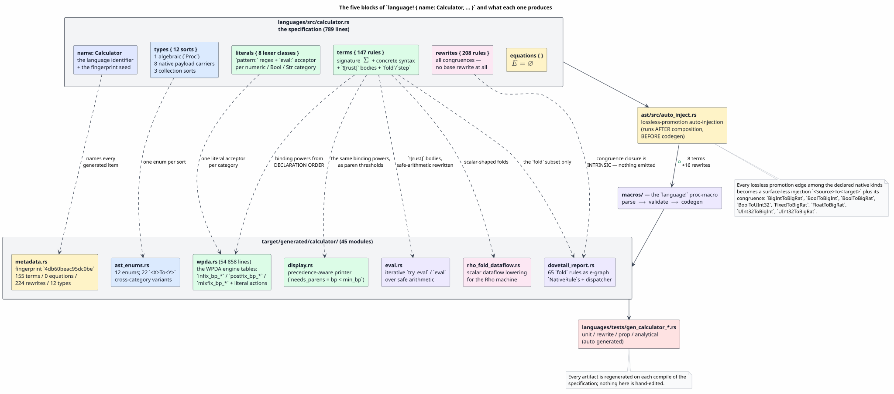
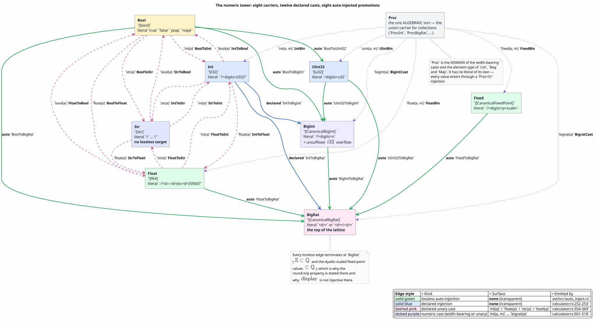
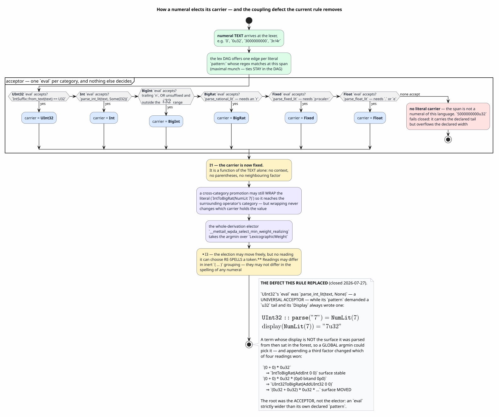
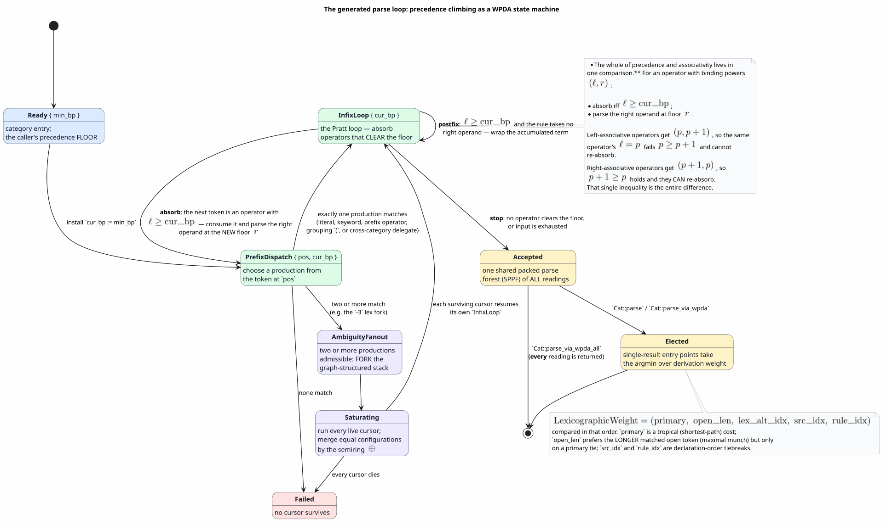
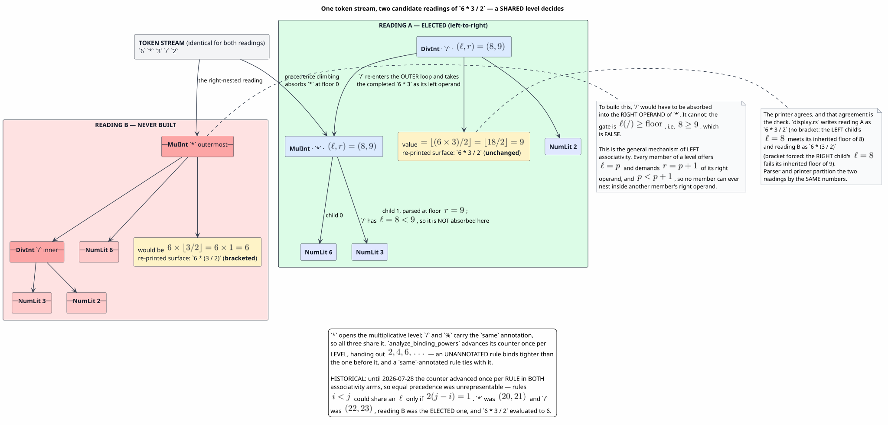

# Calculator — the `language!` specification for arithmetic, component by component

Last updated: 2026-07-28 · part of the [Language Specification References](README.md) suite

**Subject:** `languages/src/calculator.rs` (789 lines)
**Audience:** anyone who needs to know how a `language!` block becomes a parser — precedence,
associativity, ambiguity, and the numeric tower are all decided here
**Method:** every claim below was checked against the DSL (domain-specific language) parser, the code generator, the *actual
generated output* in `target/generated/calculator/`, and the test corpus that pins the behaviour.
[§13](#13-provenance-where-each-claim-comes-from) gives the file-and-line provenance for each one.
Claims that are *derived* from a generated table rather than pinned by an existing test are labelled
**derived** at the point of use.

Lambda is the suite's smallest specification; Calculator is its most *revealing*. Arithmetic is
where precedence, associativity and ambiguity actually bite, so Calculator is the page to read when
the question is **"how does a `language!` block become a parser?"** rather than "what does this
theory mean?". It is also the language the project's own parser benchmarks are written against
(`languages/benches/bench_infix.rs`, `bench_prefix.rs`, `bench_scaling.rs`), which makes its
generated tables the ones most worth being able to read.

> **Read [lambda.md](lambda.md) first** if you have never opened a `language!` block. This page
> assumes the shared vocabulary that page establishes — labels, the turnstile, term contexts,
> abstract-syntax rule patterns, congruence rules — and spends its space on what Calculator adds.

---

## Table of contents

1. [The specification under discussion](#1-the-specification-under-discussion)
2. [Notation, symbols and acronyms](#2-notation-symbols-and-acronyms)
3. [What the macro produces from this block](#3-what-the-macro-produces-from-this-block)
4. [`types { … }` — twelve sorts and the numeric tower](#4-types-----twelve-sorts-and-the-numeric-tower)
5. [`literals { … }` — the lexer classes and the acceptor doctrine](#5-literals-----the-lexer-classes-and-the-acceptor-doctrine)
6. [The carrier-election rule](#6-the-carrier-election-rule)
7. [`terms { … }` — the signature, the surface, and the native bodies](#7-terms-----the-signature-the-surface-and-the-native-bodies)
8. [Precedence and associativity — the heart of the page](#8-precedence-and-associativity--the-heart-of-the-page)
9. [Ambiguity: what the machine keeps, and what it elects](#9-ambiguity-what-the-machine-keeps-and-what-it-elects)
10. [Partial operations: division by zero, overflow, and friends](#10-partial-operations-division-by-zero-overflow-and-friends)
11. [`equations` and `rewrites`](#11-equations-and-rewrites)
12. [Display, parse, and round-tripping](#12-display-parse-and-round-tripping)
13. [Provenance: where each claim comes from](#13-provenance-where-each-claim-comes-from)
14. [Security and resource considerations](#14-security-and-resource-considerations)
15. [The specification as a whole](#15-the-specification-as-a-whole)
16. [Gotchas](#16-gotchas)
17. [References](#references)

---

## 1. The specification under discussion

The block is too long to reproduce whole; here is its skeleton, with the line ranges that hold each
part.

```text
use mettail_macros::language;

language! {
    name: Calculator,                       // :10

    types {                                 // :11 – :24   — 12 sorts
        Proc                                //   the one purely algebraic sort
        ![i32] as Int                       //   eight native-payload carriers …
        ![u32] as UInt32
        ![mettail_runtime::CanonicalBigInt] as BigInt
        ![mettail_runtime::CanonicalBigRat] as BigRat
        ![mettail_runtime::CanonicalFixedPoint] as Fixed
        ![f64] as Float
        ![bool] as Bool
        ![str] as Str
        ![Vec<Proc>] as List                //   … and three collection sorts
        ![mettail_runtime::HashBag<Proc>] as Bag
        ![HashMap<Proc, Proc>] as Map
    },

    literals {                              // :25 – :221  — 8 lexer classes
        UInt32 { pattern: … ; eval: ![ … ] }
        Int    { … }  BigInt { … }  BigRat { … }
        Fixed  { … }  Float  { … }  Bool   { … }  Str { … }
    },

    terms {                                 // :222 – :562 — 147 rules
        ProcInt . i:Int |- i : Proc ;                       // injections into Proc
        Err . |- "error" : Int ;                            // inert error normal forms
        AddInt . a:Int, b:Int |- a "+" b : Int ![a + b] fold;
        PowInt . a:Int, b:Int |- a "^" b : Int ![a.pow(b as u32)] step right;
        Neg    . a:Int        |- "-" a   : Int ![(-a)] fold;
        Fact   . a:Int        |- a "!"   : Int ![ … ] step;
        Tern   . c:Int, t:Int, e:Int |- c "?" t ":" e : Int ![ … ] step right;
        …
    },

    equations {                             // :563 – :564 — EMPTY
    },

    rewrites {                              // :565 – :788 — 208 rules, ALL congruences
        AddIntCongL . | S ~> T |- (AddInt S R) ~> (AddInt T R);
        AddIntCongR . | S ~> T |- (AddInt L S) ~> (AddInt L T);
        …
    },
}
```

Three counts, each obtained two independent ways so a miscount would show up as a disagreement:

| Block | Count | How counted | Cross-check |
|---|---:|---|---|
| `types` | 12 | declarations between `:11` and `:24` | `metadata.rs` reflects 12 `TypeDef` |
| `terms` | 147 | turnstiles (`\|-`) in `:223`–`:561` | rule-label regex over the same range gives 147 |
| `equations` | 0 | the block is empty | `fn equations(&self) -> &[]` in `metadata.rs` |
| `rewrites` | 208 | turnstiles in `:566`–`:788` | lines ending `~> … ;` in the same range give 208 |

The reflected metadata reports **155** terms and **224** rewrites — 8 and 16 more than the source
declares. Those differences are exactly the auto-injection output, enumerated in
[§4.3](#43-auto-injection-the-eight-promotions-you-did-not-write).

---

## 2. Notation, symbols and acronyms

Every symbol, acronym and term used later, defined before first use.

| Symbol / term | Expansion | Meaning |
|---|---|---|
| $`\Sigma`$ | — | **signature**: the constructors (term formers) with their arities and sorts |
| $`E`$ | — | **equational theory**: undirected laws identifying terms |
| $`R`$ | — | **rewrite system**: directed reduction rules |
| $`\rightsquigarrow`$ | — | one-step reduction, written `~>` in the DSL |
| **sort** / **category** | — | a syntactic class of terms; Calculator has twelve |
| **carrier** | — | for a numeric sort, the Rust type that holds its values (`i32` for `Int`, …) |
| **GSLT** | Greg's Structured Labelled Transition system | the $`(\Sigma, E, R)`$ presentation the macro compiles |
| **OSLF** | Operational Semantics in Logical Form | the theory the toolchain implements ([OSLF-2017](#references)) |
| **AST** | Abstract Syntax Tree | the tree a parse produces |
| **Pratt parser** | — | top-down operator-precedence parsing: each operator carries numeric *binding powers* and a loop absorbs operators that clear a running floor ([Pratt 1973](#references)) |
| **binding power** (**bp**) | — | the number that ranks an operator. Written $`(\ell, r)`$ for (`left_bp`, `right_bp`) |
| $`\ell`$ (`left_bp`) | — | the floor an operator must **clear** to be absorbed |
| $`r`$ (`right_bp`) | — | the floor the operator **installs** for its own right operand |
| **floor** / `cur_bp` / `min_bp` | — | the running precedence threshold of the active sub-parse |
| **PDA** | PushDown Automaton | a finite automaton with a stack |
| **WPDA** | Weighted PushDown Automaton | a PDA whose transitions carry semiring weights, so competing runs are comparable. Calculator's parser is a WPDA walker ([Reps et al. 2005](#references)) |
| **GLL** | Generalised LL | a parsing discipline that explores *all* LL alternatives at once using a graph-structured stack, so ambiguous and left-recursive grammars are handled without backtracking ([Scott and Johnstone 2010](#references)) |
| **GSS** | Graph-Structured Stack | the shared stack that lets GLL alternatives share a common suffix rather than copying it |
| **SPPF** | Shared Packed Parse Forest | a DAG holding *every* derivation of an input, with common subtrees shared ([Tomita 1986](#references); [Scott and Johnstone 2013](#references)) |
| **semiring** | — | a set with $`\oplus`$ (choose) and $`\otimes`$ (combine); parse weights live in one |
| **tropical semiring** | — | the semiring $`(\mathbb{R}\cup\{\infty\}, \min, +)`$; "add costs along a path, take the cheapest path" |
| **`LexicographicWeight`** | — | Calculator's parse weight: five components compared in order, primary cost first |
| **argmin** | — | the argument minimising a function; here, the cheapest derivation |
| **bigint** | — | arbitrary-precision integer ($`\mathbb{Z}`$), no fixed width |
| **bigrat** | — | arbitrary-precision rational ($`\mathbb{Q}`$), a bigint numerator over a bigint denominator, kept canonical (reduced, positive denominator) |
| **fixed point** | — | an integer *unscaled* value plus a decimal *scale*: `123p2` denotes $`123 \times 10^{-2}`$ |
| **e-graph** | equality graph | a data structure holding many equivalent terms compactly; equal children give equal parents for free ([Willsey et al. 2021](#references)) |
| **Dovetail** | — | this project's e-graph rewrite engine |
| **saturation** | — | applying every rule everywhere until nothing new appears |
| **`fold`** | — | a rule annotation: reduce eagerly to a native value when all operands are values |
| **`step`** | — | a rule annotation: keep the rule as a small-step / congruence-driven reduction |
| **stuck term** | — | a redex that matches a rule whose side condition fails, so it never reduces and is a normal form with no value |
| **safe arithmetic** | — | the `SafeArith` trait: every partial operation returns `Option`, `None` where the mathematics is undefined or the result is unrepresentable |
| **injection** / **promotion** | — | a lossless embedding of one carrier into a wider one, e.g. $`\mathbb{Z} \hookrightarrow \mathbb{Q}`$ |
| **inert grouping** | — | `(` … `)`: Calculator declares no rule for it, so it denotes nothing and may be added or removed freely |

---

## 3. What the macro produces from this block

`language!` is a procedural macro. It takes the theory and emits an entire implementation: types,
lexer, parser, printer, evaluator, rewrite-engine data, runtime lowerings, and tests. For Calculator
that is **45 modules** under `target/generated/calculator/`, totalling roughly 441 000 lines.



*Figure 1. Each block feeds specific generated artifacts, and auto-injection runs between the
specification and codegen. Source:
[figures/calculator-spec-to-artifacts.puml](figures/calculator-spec-to-artifacts.puml).*

The modules that carry this page's subject matter:

| Module | Lines | Role |
|---|---:|---|
| `ast_enums.rs` | 1 034 | one Rust `enum` per sort; 22 cross-category `<X>To<Y>` variants |
| `wpda.rs` | 54 858 | the WPDA engine: literal actions, prefix dispatch, and the `infix_bp_*` / `postfix_bp_*` / `mixfix_bp_*` binding-power tables |
| `display.rs` | 9 453 | the precedence-aware printer — the parser's numbers again, as parenthesisation thresholds |
| `eval.rs` | 3 379 | iterative `try_eval` / `eval` over safe arithmetic |
| `dovetail_report.rs` | 76 059 | the e-graph rule set: 65 `fold` rules as `NativeRule`s, plus their dispatcher |
| `rho_fold_dataflow.rs` | — | the scalar-dataflow lowering used by the production Rho-machine backend |
| `normalize.rs`, `subst.rs`, `iterative_cmp.rs` | 55 588 / 65 489 / 17 053 | stack-safe work-stack passes |
| `metadata.rs` | 4 321 | the reflected specification and its fingerprint |

### 3.1 `name: Calculator` and the fingerprint

`name:` is a *field*, not a block. It becomes the identifier prefix of every generated item
(`CalculatorLanguage`, `CalculatorMetadata`, module `mettail_languages::calculator`, REPL (read-eval-print loop) backend
key `"Calculator"`) and it seeds the language fingerprint:

```rust
fn definition_fingerprint(&self) -> Option<&'static str> {
    Some("mettail-langdef-v1:4db60beac95dc0be")
}
```

The fingerprint is computed over the **augmented** definition — after composition and after
auto-injection — so it covers the eight promotions the source never mentions. It is the memo key for
cached in-Rho artifacts; changing one character of the specification changes it, invalidating exactly
the artifacts that depended on it.

---

## 4. `types { … }` — twelve sorts and the numeric tower

Three declaration forms appear, and Calculator uses all three.

| Form | Declares | Calculator's instances |
|---|---|---|
| `Proc` | a **pure algebraic sort** — an AST category with no Rust payload | `Proc` |
| `![T] as C` | a sort whose values carry a **native Rust payload** of type `T` | `Int`, `UInt32`, `BigInt`, `BigRat`, `Fixed`, `Float`, `Bool`, `Str` |
| `![Vec<T>] as C`, `![HashBag<T>] as C`, `![HashMap<K,V>] as C` | a **collection sort** | `List`, `Bag`, `Map` |

A native payload is what unlocks literals, `fold` / `step` evaluation, native printers, and the
`try_direct_eval` fast path. `Proc` has none, which is the point: it is the *union carrier*. Every
value enters `Proc` through an injection (`ProcInt`, `ProcBigRat`, …), and because `List`, `Bag` and
`Map` are collections *of* `Proc`, a single list can hold an integer, a string and a rational at
once.

### 4.1 The eight numeric and scalar carriers

| Sort | Rust carrier | Mathematical domain | Notes |
|---|---|---|---|
| `Int` | `i32` | $`\{-2^{31}, \dots, 2^{31}-1\}`$ | the default carrier of an unsuffixed numeral |
| `UInt32` | `u32` | $`\{0, \dots, 2^{32}-1\}`$ | requires an explicit `u32` tail |
| `BigInt` | `CanonicalBigInt` | $`\mathbb{Z}`$ | requires `n`, *or* an unsuffixed numeral outside `i32` |
| `BigRat` | `CanonicalBigRat` | $`\mathbb{Q}`$ | the top of the promotion lattice |
| `Fixed` | `CanonicalFixedPoint` | $`\{\,m \cdot 10^{-s} : m \in \mathbb{Z},\ s \in \mathbb{N}\,\}`$ | scale written after `p` |
| `Float` | `f64` | IEEE 754 binary64 ([IEEE 754-2019](#references)) | wrapped as `CanonicalFloat64` for total ordering and hashing |
| `Bool` | `bool` | $`\{\bot, \top\}`$ | four surface spellings |
| `Str` | `str` | finite strings | no lossless numeric target |

**Why `CanonicalX` wrappers.** `f64` has no total order (`NaN` compares unequal to itself) and
`BigRat` has many representations of one value ($`2/4 = 1/2`$). The generated code needs `Eq`, `Ord`
and `Hash` to be *total and deterministic*, because terms are e-graph keys and hash-map keys.
`CanonicalFloat64` and `CanonicalBigRat` supply exactly that: one representative per value, with a
total order.

### 4.2 What the block generates

One Rust `enum` per sort, plus auto-injected variants. Abridged, from
`target/generated/calculator/ast_enums.rs`:

```text
pub enum Int {
    NumLit(i32),                     // ← the literal, from the `literals { Int … }` class
    IVar(OrdVar),                    // ← AUTO-INJECTED: the variable form ("Int" -> "IVar")
    Err,                             // ← your `Err . |- "error" : Int` rule
    CastErrInt,                      // ← your `CastErrInt` rule
    AddInt(Arc<Int>, Arc<Int>),      // ← your `AddInt` rule
    Neg(Arc<Int>),                   // ← your `Neg` rule
    Fact(Arc<Int>),                  // ← your `Fact` rule
    Tern(Arc<Int>, Arc<Int>, Arc<Int>),
    FloatToInt(Arc<Float>),          // ← your `int(a)` cast
    …
}
```

The variable variant's name comes from the same rule Lambda's page describes: first letter of the
sort, upper-cased, followed by `Var`. `Int` gives `IVar`; `BigRat` gives `BVar`. Children are
`Arc<T>`, so `Clone` is $`O(1)`$ pointer sharing rather than a deep copy; `PartialEq`, `Ord`, `Hash`
and `Debug` are emitted as iterative work-stack implementations so a deep expression cannot overflow
the stack.

**No higher-order plumbing.** Lambda's `enum Term` carries four auto-injected `LamTerm` /
`MLamTerm` / `ApplyTerm` / `MApplyTerm` variants because it declares a binder. Calculator declares
none, so `compute_hol_domain_pairs` yields nothing and none of those variants exist. Arithmetic
needs no meta-level abstraction machinery.

### 4.3 Auto-injection: the eight promotions you did not write

The macro runs `emit_auto_injection_rules` after composition and before codegen. For every ordered
pair of declared native kinds joined by a **lossless** promotion edge, it emits a surface-less
injection rule `<Source>To<Target> . v:Source |- v : Target ;` plus its congruence — unless the user
already declared that pair, or already used that label.

The lossless edge relation is the partial order

```math
\mathrm{Bool} \;\prec\; \mathrm{UInt32} \;\prec\; \mathrm{BigInt} \;\prec\; \mathrm{BigRat},
\qquad
\mathrm{Int} \;\prec\; \mathrm{BigInt},
\qquad
\mathrm{Float} \;\prec\; \mathrm{BigRat},
\qquad
\mathrm{Fixed} \;\prec\; \mathrm{BigRat}
```

restricted to the kinds this language declares. Its justification is containment of value sets:
$`\mathbb{Z} \subset \mathbb{Q}`$, the dyadic-and-decimal-scaled fixed-point values are rationals,
and a binary64 float is exactly a rational. `Bool` promotes to every integer width because
$`\bot \mapsto 0`$ and $`\top \mapsto 1`$ fit everywhere.

For Calculator that yields exactly eight synthetic terms:

| Emitted | Why not skipped |
|---|---|
| `BoolToUInt32`, `BoolToBigInt`, `BoolToBigRat` | no user rule for the pair, no label collision |
| `UInt32ToBigInt`, `UInt32ToBigRat` | idem |
| `FloatToBigRat`, `FixedToBigRat`, `BigIntToBigRat` | idem |
| — `IntToBigInt`, `IntToBigRat` | **skipped**: the user declared them (`:252`, `:253`) as simple projections |
| — `BoolToInt` | **skipped by the LABEL skip-list**: `BoolToInt . a:Bool \|- "int" "(" a ")" : Int` is *not* a simple projection (it has a surface), but it claims the label auto-injection would have used. Without this skip, codegen would emit a duplicate variant and fail |

Each of the eight also gets a congruence `<X>To<Y>Cong` and a canonicalisation rewrite
`NormCast<X>To<Y>InProc`, which lifts a `Proc`-wrapped `X` to a `Proc`-wrapped `Y` so that a binary
operator's two operands reach a common variant. That is $`8 + 8 + 8 = 24`$ synthetic rules: 8 terms
and 16 rewrites — precisely the gap between the source counts (147 / 208) and the reflected counts
(155 / 224).



*Figure 2. Eight carriers; twelve declared unary casts with surfaces; six numeric casts out of
`Proc`; two declared and eight auto-injected surface-less promotions. Source:
[figures/calculator-numeric-tower.puml](figures/calculator-numeric-tower.puml).*

**The consequence that matters later.** A surface-less injection has, by construction, *no surface
of its own*. `IntToBigRat(NumLit 1)` prints as `1`, exactly as `NumLit 1` does. Two distinct terms,
one string. That is not a defect; it is what "transparent promotion" means. It is also precisely why
$`\mathrm{parse} \circ \mathrm{display}`$ cannot be the identity on `BigRat` — see
[§12](#12-display-parse-and-round-tripping).

---

## 5. `literals { … }` — the lexer classes and the acceptor doctrine

A `literals { }` entry declares a lexical class for a native-payload sort:

```text
Category {
    pattern: r"<regex>";
    eval: ![ { <Rust expression of type Result<Payload, ()>, with `text: &str` in scope> } ]
}
```

Calculator declares eight. Abridged:

| Category | `pattern` (abridged) | `eval` accepts |
|---|---|---|
| `UInt32` | `(0b…\|0o…\|0x…\|[0-9]…)u32` | **exactly** its declared `u32` domain |
| `Int` | `-?(0b…\|0o…\|0x…\|[0-9]…)(i32)?` | any spelling that fits `i32` with the `I32` default suffix |
| `BigInt` | `-?(…)n` | the `n` domain **plus** unsuffixed numerals too large for `i32` |
| `BigRat` | `(…)r(/(…)r)?` | whole (`7r`) or composite (`3r/4r`) rationals |
| `Fixed` | `-?(…)p[0-9]…` | `<mantissa>p<scale>` |
| `Float` | `-?(…(\.…)?([eE]…)?)(f64)?` | decimal-or-exponent forms |
| `Bool` | `yeap\|nope\|true\|false` | four spellings, two values |
| `Str` | `"([^"\\]\|\\.)*"` | escaped double-quoted strings |

### 5.1 The acceptor doctrine

> **A category's literal domain is decided by its own `eval`, and by nothing else.**

The `pattern` decides *what the lexer offers*; the `eval` decides *what the category accepts*. There
is no third guard. The generator's own documentation says so explicitly, and records that a
guard family which once appeared to enforce the pattern (`IntSuffix::matches_*`) was retired in
2026-07 with zero callers — "a documented-but-read-by-nobody guard family is what made a
universal-acceptor `eval` look guarded."

The doctrine has one hard corollary, and it is the thing to internalise about this block:

> **An `eval` wider than its own `pattern` is a defect, always.** Because `Display` is generated from
> the `pattern`, a category that *accepts* a spelling its `Display` never *writes* puts a term into
> the parse forest whose printed form is not the surface it was parsed from.

Calculator carries the two case studies. Both were closed in July 2026, and both are worth reading
as the canonical statement of the failure mode:

- **`UInt32`, the acceptor too wide.** `eval` was `parse_int_lit(text, None)` — a universal acceptor
  of every integer spelling — while `pattern` demanded a `u32` tail and `Display` always wrote one.
  So `UInt32::parse("7")` succeeded and printed back as `"7u32"`. Consequences in
  [§6](#6-the-carrier-election-rule).
- **`BigInt`, the same defect, one category over.** The comment above the rule said "bare `1` is not
  a BigInt", but the acceptor took every integer spelling, so bare `1` *was* a BigInt and the
  declared `n` was decorative. Once `Display` began emitting the mandatory tail,
  $`\mathrm{display}(\mathrm{parse}(\texttt{"0"})) = \texttt{"0n"} \ne \texttt{"0"}`$ and the
  round-trip lost its fixpoint.

The current `BigInt` acceptor is the instructive one, because it is *deliberately* a superset of its
pattern — and says so:

```rust
let __lit = mettail_prattail::parse_int_lit(text, None).map_err(|_| ())?;
let __declared_bigint = text.ends_with('n');
let __unsuffixed_overflow = matches!(
    mettail_prattail::IntSuffix::from_text(text),
    mettail_prattail::IntSuffix::Unsuffixed
) && __lit.as_i64().and_then(|v| i32::try_from(v).ok()).is_none();
if __declared_bigint || __unsuffixed_overflow { Ok(__lit) } else { Err(()) }
```

The superset clause is not a violation of the doctrine but an application of it: it is *stated*, it
is *disjoint from every other category's domain* (an unsuffixed numeral outside `i32` has no other
carrier), and `Display` writes it back with the `n` tail. It is what keeps a bare `3_000_000_000`
readable. `UInt32` needs no such clause and has none, because every unsuffixed numeral already has a
carrier.

### 5.2 Declaration order matters to the lexer

The `Fixed` class is declared *before* `Float`, with a comment saying why: the float pattern admits
digit runs with neither `.` nor `e`, so a `Float` edge would otherwise steal `10` from `10p1`. Where
two patterns match at one position the lex DAG keeps **both** edges and lets maximal munch and the
derivation weight decide; where one pattern is a prefix of another, ordering is what stops the
shorter one from winning by accident.

### 5.3 What a failing literal `eval` produces

When a literal's `eval` returns `Err`, the generated action pushes the category's zero-ary `Err`
constructor if it has one:

```rust
if let Ok(__v) = __result {
    b.push_term::<BigRat>(BigRat::RatLit(__v));
} else {
    b.push_term::<BigRat>(BigRat::Err);
}
```

This is the *only* place a Calculator `Err` term is manufactured other than parsing the keyword
`error` itself — a fact [§10](#10-partial-operations-division-by-zero-overflow-and-friends) returns
to.

---

## 6. The carrier-election rule

This is the section readers most often get wrong, and the one with the most instructive history.

### 6.1 The rule, stated

> **I1 — a numeral's literal carrier is a function of the numeral TEXT, and of nothing else.**
> Not of context, not of parentheses, not of neighbouring factors, not of the derivation weight.

The current table, pinned test-by-row:

| Text | Carrier | Why |
|---|---|---|
| `0`, `7`, `7i32`, `0x1F`, `2147483647` | `Int` | unsuffixed or `i32`-suffixed, fits `i32` |
| `-7`, `-2147483648` | `Int` | the sign is **part of the numeral token** |
| `3000000000`, `4294967296` | `BigInt` | unsuffixed, outside `i32` — `BigInt`'s declared superset |
| `0u32`, `7u32`, `0x1Fu32`, `4294967295u32` | `UInt32` | carries the mandatory `u32` tail and fits |
| `7n`, `-7n` | `BigInt` | the `n` tail |
| `7r`, `3r/4r` | `BigRat` | the `r` tail; `Nr/Dr` lexes atomically as one token |
| `7p0`, `-260592200p0` | `Fixed` | `p<scale>` |
| `7.5`, `1e3` | `Float` | a `.` or an exponent |
| `5000000000u32` | **none** | carries the declared tail but overflows the declared width: **fails closed** |

"Carrier" here means *this category's own literal constructor*, not reachability.
`BigRat::parse("7")` succeeds — via `IntToBigRat(NumLit 7)` — but that is a **cast of someone else's
literal**, not a `BigRat` literal. Counting it would measure category reachability instead of the
literal domain, which is why the pinning test distinguishes the two.

**Algorithm 4 (Elect a numeral's carrier).** The procedure the table above summarises. Note what is
*absent* from its parameter list: there is no context, no enclosing category, and no derivation
weight.

```pseudocode
function CARRIER(text):
    # The lexer offers one edge per literal `pattern` whose regex matches this
    # span; every offered edge stays in the lex DAG. The ACCEPTORS decide.
    for each category C with a `literals { C … }` block, in declaration order:
        if eval_C(text) is Ok(_):
            return C                       # the FIRST acceptor wins, and at most one accepts
    return NONE                            # fail closed: the span is not a numeral here
```

**Why at most one accepts.** The acceptors are pairwise disjoint by construction, because each is
keyed on a *tail* (`u32`, `n`, `r`, `p<scale>`) or on a *shape* (a `.` or an exponent), and the one
acceptor that is deliberately a superset — `BigInt`'s unsuffixed-overflow clause — is disjoint from
`Int`'s by the very condition that defines it. So the loop's order is a formality: the result does
not depend on it. That is exactly the property the pinning test asserts, one row per spelling.



*Figure 3. The acceptor cascade, the invariant it establishes, and the coupling defect the current
rule removes. Source:
[figures/calculator-literal-carrier-election.puml](figures/calculator-literal-carrier-election.puml).*

### 6.2 The defect this rule replaced — the bigrat cast tower

Before 2026-07-27 the rule did **not** hold, and the failure mode is worth spelling out because it is
the sort of thing that looks like a printer bug and is not.

`UInt32`'s over-wide acceptor meant a bare `0` had a `UInt32::NumLit` reading whose `Display` wrote
`0u32`. So the surface `"0 + 0"`, read in a `BigRat` position, carried **four** readings:

```text
AddBigRat(IntToBigRat 0, IntToBigRat 0)                 display "0 + 0"
IntToBigRat(AddInt 0 0)                                 display "0 + 0"
BigIntToBigRat(AddBigInt(IntToBigInt 0, IntToBigInt 0)) display "0 + 0"
UInt32ToBigRat(AddUInt32 0 0)                           display "0u32 + 0u32"   <-- the intruder
```

Single-result parsing elects by **global argmin over the whole derivation's weight**. Which of the
four won was therefore a function of the *entire* expression — so appending a third factor flipped
the **first** factor's carrier, and with it the surface:

```text
"(0 + 0) * 0u32"                     => IntToBigRat(AddInt 0 0)        surface stable
"(0 + 0) * 0u32 * (0p0 bitand 0p0)"  => UInt32ToBigRat(AddUInt32 0 0)
                                     => "(0u32 + 0u32) * 0u32 * …"     surface MOVED
```

That is the `bigrat_display_parse_roundtrip` property failure: with the surface moving at every
layer, $`\mathrm{display} \circ \mathrm{parse}`$ had no fixpoint.

**Why the fix went to the acceptor and not to the elector.** Three candidate roots were considered
and two were ruled out on the record:

1. *`Display` is lossy.* No: `UInt32::NumLit(7)` and `"7u32"` correspond exactly in both directions,
   and the intruding reading re-parses from its own display on the nose.
2. *The election is wrong.* No: teaching the elector to prefer readings whose display equals the
   input would be a post-hoc surface filter over readings the **grammar should never have
   admitted**. The election being global is by design and remains so.
3. *The acceptor is wrong.* Yes: an `eval` strictly wider than its own declared `pattern`.

### 6.3 The invariant that makes a global elector safe

The election still ranges over readings; what changed is that the readings it ranges over can no
longer disagree about *tokens*:

```math
\forall\, s.\ \ \text{let } c = \mathrm{display}(\mathrm{parse}(s)).\quad
\forall\, \rho \in \mathrm{readings}(c).\ \
\mathrm{strip}(\mathrm{display}(\rho)) = \mathrm{strip}(c)
```

where $`\mathrm{strip}`$ deletes whitespace and the inert `(` and `)`. This is stated at exactly the
strength that holds, and both bounds are load-bearing:

- **Weaker than display equality**, deliberately. Readings *do* legitimately differ in grouping: a
  cross-category projection operand is bracketed by its *source* category's precedence logic, so
  `"1 + 2 + 3"` has six readings, three writing `1 + 2 + 3` and three writing `(1 + 2) + 3`. The
  first formulation attempted here — "all readings of a surface display identically" — is measurably
  false.
- **Stronger than "some reading round-trips"**, because it admits no intruder at all.

The surface is canonicalised before the invariant is asserted, because a numeral may legitimately be
written in a spelling `Display` does not choose, and rewriting it is normalisation *inside one
carrier*, not a change of carrier: `0x1F + 1` normalises to `31 + 1`, and `3000000000 + 1` to
`3000000000n + 1`.

---

## 7. `terms { … }` — the signature, the surface, and the native bodies

The full production, of which Lambda uses the first four fields and Calculator uses seven:

```text
Label . term_context |- concrete_syntax : Category [ ![rust_expr] ] [ fold | step ] [ right ] [ prefix(N) ] [ canonical ] ;
```

| Suffix | Meaning | Calculator's use |
|---|---|---|
| `![rust_expr]` | a Rust expression computing the value natively | 127 of the 147 rules |
| `fold` | reduce eagerly once every operand is a value | 65 rules |
| `step` | keep as a small-step rule driven by congruences | 62 rules |
| `right` | this operator is right-associative | `PowInt`, `PowFloat`, `Tern` |
| `prefix(N)` | an explicit prefix binding power | **unused** — every prefix uses the derived $`\max_{\mathrm{infix}} + 2`$ |
| `canonical` | declare this production the canonical spelling among surface synonyms | **unused** — Calculator's synonymy classes are empty |

The first three counts are exactly consistent, and the consistency is the check: $`65 + 62 = 127`$,
so **every rule with a native body carries exactly one eval mode, and every rule with an eval mode
has a native body**. The remaining $`147 - 127 = 20`$ rules are precisely the bodyless ones — the
eleven `Proc*` injections, the two `Err` constants, the five `CastErr*` constants, and the two
declared `IntTo*` injections.

### 7.1 Rule shapes, by example

| Shape | Example | Reads as |
|---|---|---|
| **injection** | `ProcInt . i:Int \|- i : Proc ;` | one parameter, no literal — a transparent wrapper with no surface |
| **nullary keyword** | `Err . \|- "error" : Int ;` | a constant; the surface *is* the whole rule |
| **infix** | `AddInt . a:Int, b:Int \|- a "+" b : Int ![a + b] fold;` | operand, literal, operand — takes an infix binding-power slot |
| **prefix** | `Neg . a:Int \|- "-" a : Int ![(-a)] fold;` | literal first — takes the prefix binding power |
| **postfix** | `Fact . a:Int \|- a "!" : Int ![ … ] step;` | operand then literal, nothing after — takes a postfix slot |
| **mixfix** | `Tern . c:Int, t:Int, e:Int \|- c "?" t ":" e : Int ![ … ] step right;` | three operands, two literals |
| **circumfix** | `Len . s:Str \|- "\|" s "\|" : Int ![s.len() as i32] step;` | literal, operand, literal — no binding-power slot; it is self-delimiting |
| **function call** | `SinFloat . a:Float \|- "sin" "(" a ")" : Float ![a.sin()] step;` | keyword-led, fully delimited |
| **cross-category** | `EqInt . a:Int, b:Int \|- a "==" b : Bool ![a == b] step;` | operands in `Int`, result in `Bool` |

The last one is the shape that surprises people, and [§8](#8-precedence-and-associativity--the-heart-of-the-page)
explains why: a cross-category operator is grouped by its **operand** category, so `EqInt` occupies
an `Int` precedence slot even though it produces a `Bool`.

### 7.2 `fold` versus `step` — and where each one actually runs

Both annotations attach a native body; they differ in which backend consumes it. Measured over the
generated report: `dovetail_report.rs` contains **65 distinct** `Calculator::fold::…` `NativeRule`
labels and **zero** `Calculator::step::…` labels.

| | `fold` | `step` |
|---|---|---|
| e-graph (`dovetail_report.rs`) | emitted as a `NativeRule` with its own op id and dispatcher arm | **not emitted at all** |
| direct evaluation (`eval.rs`) | a `Reduce…` frame in the iterative evaluator | a `Reduce…` frame, identically |
| Rho machine | eligible for the scalar dataflow lowering | reduces through congruences |
| classification | "native handler contract" | "Dovetail core" (a directional rewrite) |

So `AddInt` (a `fold`) reduces during saturation; `PowInt` (a `step`) does not appear in the e-graph
rule set at all and reaches its value through `eval` / the congruence-driven path. Both are
reachable; they are simply reached differently.

### 7.3 `safeify` — why no rule writes `checked_*`

Every `![rust]` body is rewritten at macro-expansion time. `safeify` walks the `syn::Expr` and
replaces each partial operation with its `SafeArith` counterpart threaded through `?`:

| Written in the DSL | Emitted |
|---|---|
| `a + b` | `SafeArith::safe_add(a, b)?` |
| `a - b`, `a * b`, `a / b`, `a % b` | `safe_sub` / `safe_mul` / `safe_div` / `safe_rem`, each `?`-threaded |
| unary `-a` | `safe_neg(a)?` |
| `a.pow(n)`, `.powi`, `.powf` | `safe_pow` / `safe_powf` |
| `.product::<T>()`, `.sum::<T>()` | `safe_product` / `safe_sum`, short-circuiting on the first `None` |
| `.sqrt() .ln() .log2() .log10() .exp() .sin() .cos() .tan() .asin() .acos() .atan()` | the `SafeFloat` equivalents |
| `== != < > && \|\| ! & \| ^ << >>` | **left alone** — these do not overflow in a way the evaluator must model |

The whole body is then wrapped in `(|| -> Option<_> { Some(#rewritten) })()`, so every native body
has type `Option<T>` and every emission site can test it uniformly. That is why `AddInt`'s body is
the three characters `a + b` and still cannot panic on overflow, and it is why the spec's own comment
at `:322`–`:326` says manual `checked_*` calls are unnecessary.

Two rules opt into the same protocol *by hand*, returning `Option` directly rather than relying on
the rewrite: `Fact` returns `None` for a negative argument, and `Fraction` returns whatever
`CanonicalBigRat::try_from_nd` gives, which is `None` for a zero denominator.

---

## 8. Precedence and associativity — the heart of the page

Calculator declares **no precedence numbers at all**. Every binding power in the generated parser is
derived, and the derivation has exactly two inputs: the **shape** of each rule (prefix / infix /
postfix / mixfix) and its **position in the declaration order** of its operand category.

### 8.1 The assignment algorithm, in literate form

The algorithm is `analyze_binding_powers`. It is presented here in Knuth's literate style: the
procedure first, then each named chunk expanded in the order a reader needs it, with prose carrying
the argument between the chunks ([Knuth 1984](#references)).

**Algorithm 1 (Assign binding powers).** A bucketing, followed by two ordered passes per bucket. The
only global decision is the bucketing key, and it is the source of this page's first surprise.

```pseudocode
procedure ASSIGN-BINDING-POWERS(rules):
    buckets := group rules by rule.category           ⟨1. Bucket by OPERAND category⟩
    for each bucket in buckets, in a deterministic order:
        ⟨2. First pass: non-postfix operators, in declaration order⟩
        ⟨3. Second pass: postfix operators, above them all⟩
    return the table

⟨1. Bucket by OPERAND category⟩ =
    key(rule) := rule.category        # the category of the OPERANDS, not of the result

⟨2. First pass: non-postfix operators, in declaration order⟩ =
    p := 2                                         # 0 and 1 are reserved for category entry
    level_is_open := false
    for each rule in bucket where not rule.is_postfix, in DECLARATION ORDER:
        if level_is_open and not rule.shares_level_with_previous:
            p := p + 2                             # open the NEXT, tighter level
        level_is_open := true
        if rule.associativity = LEFT:              # the default
            (left_bp, right_bp) := (p, p + 1)
        else:                                      # the rule carried `right`
            (left_bp, right_bp) := (p + 1, p)
        emit (rule.terminal, left_bp, right_bp)

⟨3. Second pass: postfix operators, above them all⟩ =
    first_free := if level_is_open then p + 2 else p    # = max_infix_bp + 1
    q := first_free + 2                            # leave a 2-slot gap for prefix
    for each rule in bucket where rule.is_postfix, in DECLARATION ORDER:
        emit (rule.terminal, left_bp := q + 1)     # postfix consumes no right operand
        q := q + 2
```

**Chunk 1 — why the operand category is the right key.** `EqInt . a:Int, b:Int |- a "==" b : Bool`
is bucketed under `Int`, not `Bool`, because the binding power is consumed by the loop that is
*parsing an* `Int`: that loop must decide whether `==` can continue *this* operand, and what the
result category turns out to be is a later question. The consequence is the one the ladder below
makes visible — **declaring a comparison shifts every arithmetic operator declared after it**.

**Chunk 2 — the three facts that fall straight out.** *Earlier-declared binds no tighter*, because
`p` only increases. *Associativity is one swap*: a left-associative operator gets $`\ell < r`$, a
right-associative one gets $`\ell > r`$, and nothing else in the machine distinguishes them. And
*the counter advances once per LEVEL, not once per rule* — a rule annotated `same` reuses the `p`
its predecessor opened.

**Chunk 2a — why `same` had to exist.** Until 2026-07-28 both associativity arms ended in
`p := p + 2`, so no branch left `p` unchanged. Rule $`i`$ of a category then received
$`\ell \in \{2 + 2i,\; 3 + 2i\}`$, and two rules $`i < j`$ could share an $`\ell`$ only if
$`3 + 2i = 2 + 2j`$, i.e.

```math
2(j - i) = 1,
```

which no integers satisfy. Every operator in a category was therefore **provably distinct** in
precedence, and declaration order was a strict *total* order by construction. The grammar had no way
to say that `*` and `/` bind equally tightly, so `6 * 3 / 2` could only parse as `6 * (3 / 2)`. The
`same` annotation supplies the missing relation — *no tighter than the previous rule* — while
leaving declaration order as the single source of truth for the ordering itself.

**Chunk 2b — precedence and associativity are independent.** A level is a *set* of operators, and
each member keeps its own associativity. The encoding makes this exact: at level $`p`$ a
left-associative operator is $`(p,\, p+1)`$ and a right-associative one is $`(p+1,\, p)`$, so both
satisfy

```math
\min(\ell,\, r) = p,
```

which is how every downstream consumer recovers the level, while the *order* of the pair carries the
associativity. Mixed associativity within one level is therefore expressible — and it must be:
Rholang's normative grammar declares `matches` as `prec.right(6, …)` beside `==` and `!=` as
`prec.left(6, …)`. A design that attached one associativity per level could not model Rholang.

**Chunk 3 — the gap is deliberate.** Postfix starts two slots above the last infix rather than one,
and the slot that is skipped is where the **prefix** binding power lives. Prefix rules never appear
in this table; their operand floor is computed on demand instead, by Algorithm 2.

**Algorithm 2 (Prefix binding power).** Called by the parser, by `Display`, and by the lint pass —
all three, so that they cannot disagree.

```pseudocode
function PREFIX-BP(category, explicit):
    if explicit is present:
        return explicit                        # the `prefix(N)` suffix; Calculator never uses it
    m := max over non-postfix operators of THIS category of max(left_bp, right_bp)
    return m + PREFIX_BP_OFFSET                # PREFIX_BP_OFFSET = 2
```

Filtering to the operand category is the right scope: the prefix operand sub-parse runs at
`cur_bp = prefix_bp`, so only operators that could fire *on that operand* need to be dominated, and
cross-category operators whose result lives elsewhere are correctly excluded. The offset is `+ 2`
rather than `+ 1` as a standardisation across those three consumers; if they disagreed by one, the
printer and the parser would disagree about parentheses, and the round-trip would stop being
analysable.

The resulting layout per category is therefore

```math
\underbrace{2 \ldots b_{\max}}_{\text{infix, mixfix}}
\;<\;
\underbrace{b_{\max} + 2}_{\text{prefix}}
\;<\;
\underbrace{b_{\max} + 4, \ b_{\max} + 6, \ \ldots}_{\text{postfix}}
\;<\;
\underbrace{b_{\max}' + 1}_{\texttt{atomic\_child\_bp}}
```

where $`b_{\max}`$ is the largest non-postfix binding power and $`b'_{\max}`$ the largest of all.

### 8.2 The table this produces for `Int`

Read directly out of the generated engine. `infix_bp_int` returns
$`(\ell,\, r,\, \texttt{result\_src\_idx},\, \texttt{rule\_idx})`$:

```rust
fn infix_bp_int(terminal: &str) -> &'static [(u8, u8, u16, u16)] {
    match terminal {
        "==" => &[( 4,  5, 7,  0)],  ">"  => &[( 4,  5, 7,  4)],
        "<"  => &[( 4,  5, 7,  8)],  "<=" => &[( 4,  5, 7, 12)],
        ">=" => &[( 4,  5, 7, 16)],  "!=" => &[( 4,  5, 7, 20)],
        "+"  => &[( 6,  7, 2,  4)],  "-"  => &[( 6,  7, 2,  5)],
        "*"  => &[( 8,  9, 2,  6)],  "/"  => &[( 8,  9, 2,  7)],
        "%"  => &[( 8,  9, 2,  8)],  "^"  => &[(11, 10, 2,  9)],
        "bitor" => &[(12, 13, 2, 10)], "bitand" => &[(14, 15, 2, 11)],
        "~"  => &[(16, 17, 2, 19)],
        _ => &[],
    }
}
fn postfix_bp_int(terminal: &str) -> &'static [(u8, u16, u16)] {
    match terminal { "!" => &[(21, 2, 14)], _ => &[] }
}
fn mixfix_bp_int(terminal: &str) -> &'static [(u8, u16, u16)] {
    match terminal { "?" => &[(3, 2, 2)], _ => &[] }
}
```

Nine levels, not fifteen. Reading $`\min(\ell, r)`$ down the table gives the ladder

| level | operators | associativity | why they are together |
|---|---|---|---|
| 2 | `?` `:` | **right** (declared) | the ternary; `1 ? 2 : 0 ? 3 : 4` = `1 ? 2 : (0 ? 3 : 4)` |
| 4 | `==` `!=` `<` `<=` `>` `>=` | left | comparisons are one relation family |
| 6 | `+` `-` | left | additive |
| 8 | `*` `/` `%` | left | multiplicative |
| 10 | `^` | **right** (declared) | exponentiation, tighter than `*` and `/` |
| 12 | `bitor` | left | mirrors `or` |
| 14 | `bitand` | left | mirrors `and`, tighter than `bitor` |
| 16 | `~` | left | a bespoke test operator with no conventional peer |
| 21 | `!` | — | postfix, above the whole infix range (Algorithm 1, chunk 3) |

The ternary's $`(\ell, r) = (3, 2)`$ is the right-associative encoding at level 2: $`\ell > r`$, and
$`\min(3,2) = 2`$ is still the level. Before 2026-07-28 it read $`(2, \ldots)`$ — left — because the
mixfix classifier hard-coded `Associativity::Left` and silently discarded the rule's declared
`right`, while `Display` honoured it. Parser and printer disagreed about what the same grammar
meant; they no longer do.

`result_src_idx` indexes `WPDA_CATEGORIES`, whose first eight entries are `Proc`, `BigRat`, `Int`,
`UInt32`, `Fixed`, `Float`, `BigInt`, `Bool` — so `2` is `Int` and `7` is `Bool`, confirming that the
six comparisons live in `Int`'s ladder while producing `Bool`.

The printer carries the same numbers as parenthesisation thresholds — `Neg` and `BitNotInt` at 35,
`Fact` at 37, and the `Proc` injections forwarding `atomic_child_bp(Int) = 38`. Parser and printer
agreeing on one table is what makes the display round-trip analysable at all.

**One entry to read carefully.** The mixfix table records the ternary's trigger at $`\ell = 2`$,
while `Display` renders `Tern` with the pair $`(\ell, r) = (3, 2)`$ that Algorithm 1 assigns to a
right-associative first operator. The difference is inert, and demonstrably so: the gate is
$`\ell \ge \mathrm{floor}`$, and both 2 and 3 clear every floor the ternary can meet (0 at the top
level, 2 in its own else-branch) while failing every floor an arithmetic operator installs (17 and
above). So the ternary is the loosest `Int` operator, and right-associative, under either value —
which is what the two pinned tests assert.


*Figure 4. Loosest at the top, tightest at the bottom, with the three declaration-order traps called
out. Source: [figures/calculator-binding-power-ladder.puml](figures/calculator-binding-power-ladder.puml).*

### 8.3 The parse loop that consumes the table

The parser is a WPDA walker whose state machine has exactly the three Pratt states plus the two the
weighted, all-parses discipline needs:

| State | Meaning |
|---|---|
| `Ready { min_bp }` | category entry; the caller's floor |
| `PrefixDispatch { pos, cur_bp }` | choose a production from the token at `pos` |
| `InfixLoop { cur_bp }` | absorb operators that clear the floor |
| `AmbiguityFanout` | two or more productions admissible: fork the graph-structured stack |
| `Saturating` | run every live cursor; merge equal configurations by the semiring $`\oplus`$ |

The decision that implements precedence and associativity is one comparison, and it is emitted
verbatim into the engine:

```rust
infix_bp_int(token_text).iter().any(|&(left_bp, ..)| left_bp >= floor)
    || postfix_bp_int(token_text).iter().any(|&(left_bp, ..)| left_bp >= floor)
    || mixfix_bp_int(token_text).iter().any(|&(left_bp, ..)| left_bp >= floor)
```

**Algorithm 3 (Precedence climbing).** The loop that consumes the tables of Algorithms 1 and 2. Two
of its lines carry the whole of precedence and associativity, and they are marked.

```pseudocode
function PARSE-AT(floor):
    lhs := PREFIX-DISPATCH()                       # literal, keyword, prefix op, or `( … )`
    loop:
        t := peek()
        if t is not an operator of this category:
            return lhs
        (l, r) := binding powers of t
        if l < floor:
            return lhs                             # ⟨the entire PRECEDENCE decision⟩
        consume(t)
        if t is postfix:
            lhs := WRAP(t, lhs)
            continue
        rhs := PARSE-AT(r)                         # ⟨the entire ASSOCIATIVITY decision⟩
        lhs := COMBINE(t, lhs, rhs)
```

**Why $`\ell < r`$ gives left-associativity.** After absorbing a left-associative operator with
$`(\ell, r) = (p,\, p+1)`$, the right operand is parsed at floor $`p+1`$. The same operator
reappearing offers $`\ell = p`$, and $`p \ge p+1`$ is false, so it is **not** absorbed into the right
operand — it is left for the outer loop, which attaches it to the left. Hence `a - b - c` is
`(a - b) - c`.

**Why $`\ell > r`$ gives right-associativity.** With $`(\ell, r) = (p+1,\, p)`$ the right operand is
parsed at floor $`p`$, and the same operator's $`\ell = p+1`$ satisfies $`p+1 \ge p`$, so it **is**
absorbed. Hence `2 ^ 3 ^ 2` is `2 ^ (3 ^ 2)`, value 512 — test-pinned.



*Figure 5. The five states, the transitions, and the single inequality that carries all of precedence
and associativity. Source: [figures/calculator-parse-loop.puml](figures/calculator-parse-loop.puml).*

### 8.4 A term whose reading each declaration decides

Every row below is pinned by a test except where marked **derived**, in which case the derivation
from the table above is given in full.

| Declaration | Term | Reading it forces | Value |
|---|---|---|---|
| `Fact` is **postfix** (bp 21) | `3 + 5!` | `AddInt(3, Fact(5))` | 123 |
| … and postfix sits above `^` (11) | `3! ^ 2` | `PowInt(Fact(3), 2)` | 36 |
| `Neg` is **prefix** (bp 19) | `-3 + 5` | `AddInt(Neg 3, 5)`, not `Neg(AddInt(3,5))` | 2 |
| … and prefix sits above `^` | `-3 ^ 2` | `PowInt(-3, 2)`, not `Neg(PowInt(3,2))` | 9 |
| `PowInt` carries `right` | `2 ^ 3 ^ 2` | `PowInt(2, PowInt(3,2))` | 512 |
| `Tern` is declared **first** in `Int` | `1 + 0 ? 3 + 4 : 5` | `Tern(AddInt(1,0), AddInt(3,4), 5)` | 7 |
| `Tern` carries `right` | `0 ? 2 : 1 ? 3 : 4` | `Tern(0, 2, Tern(1,3,4))` | 3 |
| `Not` is **prefix** in `Bool` | `not true and false` | `And(Not true, false)` | `false` |
| `(` `)` is **inert** | `(3 + 2)!` | `Fact(AddInt(3,2))` | 120 |
| `/` carries `same`, so it shares `*`'s level | `6 * 3 / 2` | `DivInt(MulInt(6,3), 2)` | 9 |
| `-` carries `same`, so it shares `+`'s level | `10 - 4 + 3` | `AddInt(SubInt(10,4), 3)` | 9 |
| `and` is declared **after** `or` | `false and false or true` | `Or(And(false,false), true)` | `true` |
| `bitand` is declared **after** `bitor` | `1 bitand 2 bitor 4` | `BitOrInt(BitAndInt(1,2), 4)` | 4 |

The equal-precedence rows deserve their own figure, because the reading they produce is the one a
reader has to *derive* rather than read off a total order.



*Figure 6. `6 * 3 / 2` under a shared level. Source:
[figures/calculator-two-readings.puml](figures/calculator-two-readings.puml).*

**The derivation.** `*` and `/` both have $`(\ell, r) = (8, 9)`$. Parsing `6 * 3 / 2` at floor 0: the
loop absorbs `*` (since $`8 \ge 0`$) and parses the right operand at floor $`r = 9`$. There it reads
`3`, then meets `/` with $`\ell = 8`$, and $`8 \ge 9`$ is **false** — so `/` is *not* absorbed into
the right operand. The sub-parse returns `3`, the loop folds `MulInt(6, 3)`, and the outer iteration
then absorbs `/` with the fold as its left operand. The result is `DivInt(MulInt(6, 3), 2)`.

This is the general mechanism for left-associativity, and it is worth stating once: at a shared level
$`p`$, every member offers $`\ell = p`$ and demands $`r = p + 1`$ of its right operand. Since
$`p < p + 1`$, no member of the level can ever be absorbed into another member's right operand, so
each one closes the fold to its left and the chain nests leftward. A right-associative member of the
same level offers $`\ell = p + 1`$ instead, which *does* clear the floor — which is exactly why
mixed-associativity levels nest rightward in both directions, and why Rholang's level 6 is worth a
diagnostic note (`G10`) even though it is unambiguous.

Integer division truncates, so the two readings disagree numerically:
$`\lfloor (6 \times 3)/2 \rfloor = 9`$ while $`6 \times \lfloor 3/2 \rfloor = 6`$. That disagreement
is what makes `6 * 3 / 2` a usable test fixture, and it is pinned in
`languages/tests/operator_precedence_conformance.rs`.

> **Historical note.** Until 2026-07-28 this section documented the *opposite* reading, and Figure 6
> existed to depict it: `*` was $`(20,21)`$ and `/` was $`(22,23)`$, so `/` bound tighter and
> `6 * 3 / 2` evaluated to **6**. That was not a decision but an artefact — `analyze_binding_powers`
> advanced its counter once per rule in both associativity arms, so equal precedence was
> unrepresentable (see §8.1, chunk 2a, for the parity argument). The figure has been redrawn to show
> the level-sharing reading; the defect it used to illustrate is preserved in this note rather than
> in a diagram, because a figure whose only purpose is to depict a fixed bug invites being read as
> current behaviour.

The printer corroborates independently, which is the check that this is a property of the language
and not of one path: `display.rs` renders `DivInt(MulInt(6,3), 2)` as `6 * 3 / 2` (the left child's
$`\ell = 8`$ meets its inherited floor of 8, so no bracket) and `MulInt(6, DivInt(3,2))` as
`6 * (3 / 2)` (the right child's $`\ell = 8`$ fails the inherited floor of 9, so a bracket is
forced). Parser and printer partition the two readings by the same numbers.

The same reasoning applies to `+` and `-`, though there a chain of the form `1 + 2 - 3` evaluates to
$`0`$ under both readings — which is why the test for it asserts the **tree** and not the value.
`1 + 2 - 3` now parses as `SubInt(AddInt(1,2), 3)`, structurally equal to the explicitly grouped
`(1 + 2) - 3`.

### 8.5 Why declaration order, and not a `precedence { }` block

The design is deliberate, and its rationale is worth stating because the alternative is written down
in the repository as a rejected extension point.

- **One source of truth.** The `terms` block already fixes the signature and the surface. Adding a
  second, independent ordering would let the two disagree, and a grammar whose printer and parser
  disagree about precedence is a grammar whose round-trip is unanalysable.
- **Total by construction.** Declaration order is a total *pre*order on a finite list: every pair of
  operators in a category is comparable, and no ambiguity can arise from an *unspecified* relative
  precedence. A `precedence { level … }` block would admit partial specifications.
- **Deterministic and diffable.** The binding-power table is a pure function of the source text, so
  the generated tables are byte-reproducible and a precedence change shows up as a source diff.

**The one relation declaration order cannot express, and how `same` supplies it.** A total order
says which of two operators binds tighter; it cannot say that *neither* does. That is a real gap and
not a stylistic one — `*` and `/` must bind equally tightly or `6 * 3 / 2` reads wrongly (§8.4) —
and it went unnoticed for as long as it did precisely because the assigner made the gap invisible:
it could only ever *produce* a strict total order, so no table ever exhibited the missing relation.

The `same` annotation adds exactly that one relation and nothing else:

```text
MulInt . a:Int, b:Int |- a "*" b : Int ![a * b] fold;
DivInt . a:Int, b:Int |- a "/" b : Int ![a / b] fold same;   // no tighter than `*`
ModInt . a:Int, b:Int |- a "%" b : Int ![a % b] fold same;   // no tighter than `/`
```

Declaration order still supplies the ordering; `same` supplies only the ties. The result is a total
*preorder* — a sequence of levels, each an unordered set of operators — which is precisely the
structure Pratt binding powers encode, and precisely the structure a precedence table in a language
reference has always been.

An absolute `@prec(n)` was reconsidered at this point and rejected again, for reasons the relative
marker avoids by construction: it admits partial specifications, forces renumbering churn when a
level is inserted, and lets two rules disagree about which level a number denotes. `same` cannot
express any of those states — it has no operand to get wrong.

- **It composes with `right`, per rule.** `same` sets the level; `right` sets the associativity; they
  never interact. This is not an elegance argument but a requirement: Rholang's normative grammar
  declares `matches` as `prec.right(6, …)` alongside `==` and `!=` as `prec.left(6, …)`, so a design
  that attached one associativity to each level could not model the language MeTTaIL exists to
  implement.
- **The remaining cost is paid knowingly.** The reader must still know that declaration order is
  what orders the levels, and that a rule with no annotation opens a new, tighter one. The `right`,
  `prefix(N)`, `canonical` and `same` suffixes are the whole annotation vocabulary; `prefix(N)` is
  what Rholang uses to cap a quotation's operand.

---

## 9. Ambiguity: what the machine keeps, and what it elects

Calculator's grammar is genuinely ambiguous, and the machine is built to keep the ambiguity rather
than to resolve it early.

### 9.1 The worked case: `-3!`

The `Int` literal pattern begins `-?`, so a sign abutting a numeral forks the lex DAG: one edge reads
`-3` as a single token, another reads `-` as a keyword followed by `3`. Both survive, and the parse
forest holds **exactly two** `Int`-category readings:

| Reading | Why it exists | Value |
|---|---|---|
| `Fact(NumLit(-3))` | the sign is inside the numeral token | $`(-3)! `$ |
| `Neg(Fact(NumLit(3)))` | postfix `!` (21) binds tighter than prefix `-` (19) | $`-(3!)`$ |

At the *language* level a third reading appears, `Fact(Neg(NumLit(3)))`, reachable through a
cross-category wrapper. All three denote the same number.


*Figure 7. The lex fork, the readings, and where election does and does not apply. Source:
[figures/calculator-ambiguity-lattice.puml](figures/calculator-ambiguity-lattice.puml).*

### 9.2 Two entry points, two contracts

| Entry point | Contract |
|---|---|
| `Cat::parse_via_wpda_all`, `…_all_with_weights` | returns **every** reading. For `-3!` that is exactly 2 at `Int` — asserted as an equality, not an inequality, so a collapse would fail the test |
| `Cat::parse_via_wpda_prefix_with_weights(s, k)` | returns the first `k` readings, and is asserted to agree with the eager prefix at every `k` |
| `Cat::parse_via_wpda` | one representative: the global argmin |
| `Cat::parse` | `parse_structured` — the argmin, then a fixpoint loop that accepts only when the re-display equals the **input** |
| `CalculatorLanguage::parse` | a language-level term, possibly `Ambiguous(alts)` |

### 9.3 The weight

The elector minimises `LexicographicWeight`, five components compared in order:

```math
w \;=\; (\underbrace{\mathrm{primary}}_{\text{tropical cost}},\ \
\underbrace{\mathrm{open\_len}}_{\text{longest open token}},\ \
\underbrace{\mathrm{lex\_alt\_idx}}_{\text{lex alternative}},\ \
\underbrace{\mathrm{src\_idx}}_{\text{category order}},\ \
\underbrace{\mathrm{rule\_idx}}_{\text{rule order}})
```

- **`primary`** is a tropical (shortest-path) cost: costs add along a derivation and the cheapest
  derivation wins. This is the principal selector.
- **`open_len`** prefers the *longer* matched open token — the maximal-munch principle — but only as
  the first tie-break *below* `primary`. It was originally placed above `primary`, which let any
  longer-open lex fork dominate regardless of cost and mis-parsed `bitnot 5 + bitnot 6` into
  cast-heavy wrappers; it was demoted.
- **`src_idx`** is the source-category index. ★ **This is the order in which each category first
  appears as a rule's result sort in `terms`** — not the order of the `types` block. For Calculator
  that is `Proc`, `BigRat`, `Int`, `UInt32`, `Fixed`, `Float`, `BigInt`, `Bool`, `Str`, `List`,
  `Bag`, `Map`, which differs from the `types` order (`Proc`, `Int`, `UInt32`, `BigInt`, `BigRat`, …)
  at positions 2–7. Moving a rule between categories in `terms` can therefore change a tie-break.
- **`rule_idx`** is the rule's position within its category. Final tie-break.

The weight forms a semiring: $`\oplus`$ is lexicographic minimum (so ambiguous fan-out merges by
choosing), and $`\otimes`$ adds the primary cost while **left-projecting** the tie-breaks, which
retains the identity of the entry-most rule rather than trying to sum category indices. Because
`primary` is an `f64` sum, $`\otimes`$ is associative only up to floating-point rounding; $`\oplus`$
and distributivity are exact, since $`\oplus`$ selects rather than adds.

### 9.4 Why not disambiguate at the lexer

Collapsing the `-3` fork by removing the leading `-?` from the `Int` pattern was tried, and reversed,
on a measured argument:

1. **The stated premise was false.** The decision was justified as "aligned with Rholang, where unary
   minus is an operator, not a signed literal". Rholang's own grammar puts the sign *inside* the
   numeral token for every signed literal class — `long_literal /-?\d+/`, `bigint_literal /-?\d+n/`,
   `signed_int_literal`, `bigrat_literal`, `float_literal`, `fixed_point_literal` — with unsigned
   integers the single exception. Alignment *requires* the `-?`.
2. **It left a value with no surface at all.** $`i32_{\min} = -2147483648`$ is an inhabitant of the
   declared domain `![i32] as Int`, reachable by folding `-2147483647 - 1` and by a generator draw.
   Its `Display` is `-2147483648`; with a signless pattern that string must be read as `Neg` applied
   to `2147483648`, which overflows `i32` — so `Int::parse("-2147483648")` failed outright and the
   property test that unwraps it panicked. The operator spelling *does not exist* for that value.
3. **What it removed was an ambiguity, not a meaning.** The two readings of `-3!` denote the same
   number. The project's standing rule is that an ambiguity belongs in the lattice; narrowing the
   lexer to hide it removes information the downstream machinery is built to use.

---

## 10. Partial operations: division by zero, overflow, and friends

Division, remainder, exponentiation, factorial and fraction-construction are **partial**: for some
inputs the mathematics is undefined or the result is unrepresentable in the declared carrier.
Calculator handles all of them by one mechanism with three lane-specific dispositions.

### 10.1 The mechanism

`DivInt`'s declared body is three characters:

```text
DivInt . a:Int, b:Int |- a "/" b : Int ![a / b] fold;
```

`safeify` rewrites it to `SafeArith::safe_div(a, b)?`, and the generated evaluator arm reads

```text
__EvalFrame::ReduceDivInt => {
    let b = values.pop().expect("PDA same-cat value");
    let a = values.pop().expect("PDA same-cat value");
    match (|| -> Option<_> {
        let __mettail_lifted = Lift(<_ as SafeArith>::safe_div(a, b)?).lift();
        __mettail_lifted
    })() {
        Some(__v) => values.push(__v),
        None => return None,
    }
}
```

`SafeArith for i32` delegates to the standard library's checked family, and its contract is stated
in the module:

> Division and remainder by zero return `None`; signed $`i_{\min}`$ divided or remaindered by $`-1`$
> overflows and also returns `None`.

So `safe_div(5, 0) = None`, and so does `safe_div(i32::MIN, -1)` — the second case being the one
readers forget.

### 10.2 The three dispositions


*Figure 8. One term, three lanes. Source:
[figures/calculator-partial-operation-dispositions.puml](figures/calculator-partial-operation-dispositions.puml).*

| Lane | What `5 / 0` does | Anchor |
|---|---|---|
| **Parsing** | succeeds. Partiality is a *reduction* property, never a syntax one | — |
| **Direct evaluation** | `Int::try_eval()` returns `None`; `Int::eval()` is `try_eval().expect(…)` and therefore **panics** with `"Cannot evaluate expression - contains unevaluated terms or arithmetic overflowed. Apply rewrites first."` | `eval.rs:3-9`, `:243-259` |
| **e-graph saturation** | the native dispatcher arm for op 20 returns `None`, so the rule **does not fire** and no e-class is added. `DivInt(NumLit 5, NumLit 0)` is a **stuck term** — a normal form with no value | `dovetail_report.rs:26051-26080` |
| **Rho machine (production `exec`)** | the lowering returns `BlockedBySemanticPredicate(SafeEvaluationDeclined)`; the report-free fast path defers, and the wrapper *lazily* builds the checked Dovetail report as the observational payload (backend `Dovetail`, artifact `DovetailRunReport`) | `rholang-codegen/src/dataflow.rs:78-116`; pinned by `repl/tests/zero_dstage_exec.rs:522-549` |

The third lane's design intent is recorded explicitly: `Defer` means "the shape is not fully
Rho-lowerable" (a non-scalar operation, a free variable), whereas `BlockedBySemanticPredicate` means
"the shape *is* Rho-lowerable, but a semantic predicate such as safe arithmetic declined it". Keeping
the two apart is what lets the runtime audit distinguish a shape rejection from the paper's allowed
semantic-predicate boundary.

### 10.3 There is no error *term*

This is the finding most likely to be assumed wrongly, so it is stated flatly:

> **No Calculator reduction produces an error term.** `Int::Err` (surface `error`), `CastErrInt`
> (`cast_error_int`), `CastErrUInt32`, `CastErrFixed`, `CastErrFloat` and `CastErrBigInt` are
> **parseable, inert normal forms**. You can write them; nothing manufactures them.

The evidence is three-part and mutually corroborating:

1. **The only site that *introduces* one is a keyword action.** Across the whole generated tree,
   `Int::Err` and `Int::CastErrInt` are introduced only by the WPDA semantic action that fires when
   the token `error` or `cast_error_int` is read. `BigRat::Err` has one further introduction site:
   the `BigRat` literal action, when `parse_rational_lit` fails on a token the pattern admitted.
   Every other occurrence in the generated tree is one of two things, and neither manufactures an
   error out of a successful term: a **structure-preserving reconstruction** — `normalize.rs`,
   `subst.rs`, `iterative_drop.rs` and the e-graph rebuild in `dovetail_report.rs` all rebuild an
   `Err` that was already there — or a **property-test generator** (`random_generation.rs`,
   `term_generation.rs`, `strategies.rs`), which deliberately draws from every constructor and is
   why `error` shows up in shrunken counterexamples.
2. **The sink that would produce them is not emitted.** `CastResult::err()` — the trait method that
   maps a failed numeric cast to a nullary `Err` — is generated **only for object-output cast
   languages**, and Calculator has none: `IntBin`, `UIntBin`, `FloatBin`, `FixedBin`, `BigintCast`
   and `BigratCast` all output a *native* category. The generator's own summary is that a
   native-output cast "returns `Option<scalar>`, **defers on `None`**". Correspondingly, the
   generated `numeric_cast_adapter.rs` for Calculator contains an `impl ProcToNumericInput for Proc`
   and **no** `impl CastResult`.
3. **The design note that says otherwise is about the other flavour.** The numeric-casting design
   document says "invalid casts reduce to per-category nullary errors (`cast_error_int`, …) where
   applicable"; the qualifier is load-bearing, and for Calculator it does not apply.

The same holds for `Fraction`, despite a spec comment suggesting otherwise. `Fraction` is a `step`
rule; `step` rules are not lowered into the e-graph rule set at all, and its `try_from_nd` body
appears in exactly one generated module, `eval.rs`. A zero denominator therefore yields
`try_eval() == None` and an `eval()` panic — not `BigRat::Err`.

### 10.4 The partial operations, enumerated

| Rule | Undefined / unrepresentable when | Mechanism |
|---|---|---|
| `DivInt`, `ModInt` | divisor 0; $`i32_{\min} / (-1)`$ | `safe_div` / `safe_rem` |
| `AddInt`, `SubInt`, `MulInt` | the true result leaves `i32` | `safe_add` / `safe_sub` / `safe_mul` |
| `Neg` | $`-i32_{\min}`$ | `safe_neg` |
| `PowInt` | exponent negative; result leaves `i32` | `safe_pow`; note the exponent is `b as u32`, so a negative `b` wraps to a huge exponent and overflows to `None` |
| `Fact` | argument negative (returns `None` by hand); $`13! > i32_{\max}`$ | hand-written guard, then `safe_product` |
| `AddFloat`, `MulFloat`, … | the result is `NaN` | `SafeArith for f64` returns `None` on `NaN` and preserves $`\pm\infty`$ |
| `DivBigRat` | denominator 0 | `safe_div` on `CanonicalBigRat` |
| `Fraction` | denominator 0 | `try_from_nd` returns `None` |
| `AddUInt32` | the sum leaves `u32` | `safe_add` |
| `ElemList`, `DeleteList`, `GetMap` | index out of range; key absent | ⚠ **`.expect(…)` — these panic.** See [§14](#14-security-and-resource-considerations) |

---

## 11. `equations` and `rewrites`

### 11.1 `equations { }` — empty, and that is a claim

An equation asserts two terms are interchangeable; the lowering emits *two* e-graph rules per
equation so the two classes merge in both directions. Calculator declares **none**, and
`metadata.rs` confirms it:

```rust
fn equations(&self) -> &'static [EquationDef] { &[] }
```

The empty block is a positive statement, not an omission: **Calculator has no equational theory**.
Commutativity of `+` is *not* declared, associativity is *not* declared, and $`x + 0 = x`$ is *not*
declared. Every reduction is directed. This is the right choice for an evaluator — the operators are
already computed natively by `fold`, so an equational presentation of the same facts would only
enlarge the e-graph without changing any normal form. It is also the reason Calculator's e-graph
saturation terminates readily: with no commutativity to close under, the class count is bounded by
the term.

### 11.2 `rewrites { … }` — 208 rules, all congruences

Every one of the 208 declared rewrites has the same shape:

```text
AddIntCongL . | S ~> T |- (AddInt S R) ~> (AddInt T R);
AddIntCongR . | S ~> T |- (AddInt L S) ~> (AddInt L T);
```

Nothing before the `|`, so the type context is empty; between `|` and `|-` is a single
`Premise::Congruence`. Read as inference rules:

```math
\frac{S \rightsquigarrow T}{\mathrm{AddInt}(S, R) \rightsquigarrow \mathrm{AddInt}(T, R)}
\qquad\qquad
\frac{S \rightsquigarrow T}{\mathrm{AddInt}(L, S) \rightsquigarrow \mathrm{AddInt}(L, T)}
```

**There is no base rewrite anywhere in the block.** Calculator's entire computational content lives
in the `![rust]` bodies of its `terms`. The `rewrites` block does one job: it declares *where* a
redex may be contracted — one congruence per operand position of every operator, so an inner
subexpression can reduce to a value before its parent's `fold` fires. Without `IntToFloatCong`,
`str(2^3)` would never reduce its argument and the cast would never become applicable; the spec says
exactly that at `:769`–`:771`.

Backends consume them differently, and one derives them for free:

| Backend | Treatment |
|---|---|
| **Dovetail e-graph** | emits **nothing** for a congruence rule. Congruence closure is intrinsic to an e-graph — equal children give equal parents by construction — so re-encoding them would be redundant work |
| **in-Rho net** | classified as contextual rewrites |
| **test generation** | `rewrite_tests.rs` branches on `is_congruence_rule()` |
| **metadata** | recorded verbatim: `conditions: &["S ~> T"], premise: Some(("S", "T"))` |

They are still worth writing where a backend derives them: they are the human- and proof-readable
statement of which relation the language defines, and the auto-injection pass reads them (via
`user_cong_constructors`) to decide which synthetic congruences it must *not* duplicate.

---

## 12. Display, parse, and round-tripping

★ **Do not assume `parse(display(t)) == t`.** For Calculator it is false in general, for a reason
that is a property of the language rather than a bug — and the tree distinguishes the region where it
holds from the region where it cannot.

### 12.1 The two invariants, and why they differ

```math
\textbf{(S) } \mathrm{display}(t) = \sigma
\qquad
\textbf{(P) } \mathrm{parse}(\sigma) = t
\qquad
\textbf{(R) } \mathrm{parse}(\mathrm{display}(t)) = t
```

Leg **R** — *term preservation* — is what a round-trip test should assert. The far weaker property
$`\mathrm{display}(\mathrm{parse}(\mathrm{display}(t))) = \mathrm{display}(t)`$ — *display stability*
— is what most round-trip tests in the tree historically asserted, and it is satisfied by any display
that maps two distinct terms to one string. Term preservation implies display stability; the converse
fails exactly where `display` is non-injective.

### 12.2 Where term preservation holds

| Case | Surface | Legs asserted |
|---|---|---|
| `Int::NumLit(7)` | `7` | S, P, R through **both** entry points |
| `Int::AddInt(1, 2)` | `1 + 2` | S, P, R |
| `BigInt::NumLit(5)` | `5n` | S, P, R |
| `Bool::BoolLit(true)` | `true` | S, P, R |
| `UInt32::BitAndUInt32(BoolToUInt32(LtEqInt(1,2)), 3)` | `(1 <= 2) bitand 3u32` | S, P, R — **the positive bracketing witness** |
| `Int::Tern(1,2,3)` | `1 ? 2 : 3` | structure preserved |

The `UInt32` row is the interesting one. `BoolToUInt32` is a surface-less auto-injection whose source
category `Bool` *has* operators, so a bare rendering (`1 <= 2 bitand 3u32`) would let `bitand`
capture `2`. A bracket is genuinely required, and it is supplied by the **source** category's own
precedence logic at `atomic_child_bp(Bool)` — the language's pure `(` `)` grouping, which denotes
nothing. The same test asserts the negative: the surface must not contain `bigint(`, `bigrat(`,
`uint(`, `int(`, `float(` or `fixed(`.

That negative exists because the previous mechanism borrowed a *real constructor* of the target
category as a bracketing device. For Calculator's `BigRat` it elected `bigrat( … )`, so
`AddBigRat(IntToBigRat(AddInt(1,2)), Err)` displayed as `bigrat(1 + 2) + error`, which re-parses as a
`BigratCast` over `Proc` — a node the term never contained. (The same election on Rholang landed on
a *send*, so two integers displayed as `@Nil!(1) + @Nil!(2)`.) A rule of the target category cannot
serve as a bracket, because every rule of the target category means something.

### 12.3 Where term preservation cannot hold

$`\mathrm{display}`$ is not injective across the auto-injected numeric tower. `IntToBigRat` has no
surface of its own, so

```math
\mathrm{display}\bigl(\mathrm{AddBigRat}(\mathrm{IntToBigRat}\,1,\ \mathrm{IntToBigRat}\,2)\bigr)
\;=\;
\mathrm{display}\bigl(\mathrm{IntToBigRat}(\mathrm{AddInt}(1, 2))\bigr)
\;=\;
\texttt{"1 + 2"}
```

Two distinct terms, one surface. No bracketing device can separate them: **the language declares them
surface-identical**, and that is what a transparent promotion is. So `BigRat` is covered by a test
that pins the *bracketing* property without claiming injectivity:

```text
AddBigRat(IntToBigRat(AddInt(1,2)), Err)   displays   "(1 + 2) + error"
```

with three further assertions: the surface must not contain `bigrat(`; the bracket must be
load-bearing (`1 + 2 + error` must parse to a *different* term, otherwise the test pins nothing); and
the grouped reading must retain `AddInt(NumLit(1), NumLit(2))` inside.

### 12.4 What holds instead, on the whole language

| Property | Status |
|---|---|
| $`\mathrm{parse} \circ \mathrm{display} = \mathrm{id}`$ | **false in general** — non-injective across the promotion lattice |
| $`\mathrm{display} \circ \mathrm{parse}`$ has a fixpoint from layer 1 | holds; walked for 3 steps per seed so a period-2 oscillation is caught rather than mistaken for convergence |
| canonical display is idempotent | pinned for `BigRat` bitand/bitor trees, `Int`-projection sums, and ambiguous addition trees |
| no reading of a canonical surface re-spells a token | holds, modulo inert grouping — the invariant of [§6.3](#63-the-invariant-that-makes-a-global-elector-safe) |
| grouping is inert: `C::parse(E).is_ok()` iff `C::parse("(" ++ E ++ ")").is_ok()` | holds for every category, with a `both fail` control (`0 - 1r` must fail in both forms, since `BigRat` declares no `-` infix) |

### 12.5 The unary-minus surface hazard — checked, and closed

A sibling defect is live elsewhere in this repository in which a unary `-` applied to a method call
renders into an unparseable surface. **Calculator had the analogous defect and it is closed**, with
the shrunken counterexample pinned verbatim:

```text
-(592107620 + bigrat(cast_error_bigint))
```

Before the fix, `0 + bigrat(a)` parsed while `(0 + bigrat(a))` did not — a redundant pair of
parentheses around a legal cross-category expression made it unparseable, and the property test that
found it was dismissed as a flake. It is deterministic. The counterexample now parses, and its
canonical form re-parses to itself. Three further prefix-plus-cast surfaces are pinned as displaying
*exactly* their input:

| Surface | What it exercises |
|---|---|
| `float(-(1.0 + cast_error_float))` | a prefix `-` with a grouped operand *inside* a cast |
| `bitnot bigrat(0 bitand -1142617375) + error` | a trailing lower-precedence infix must stay **outside** the prefix operand |
| `bigrat(160208597) / -error` | an infix right-hand side admitting a prefix negation over a keyword |

I found no live unary-minus rendering hazard in Calculator.

---

## 13. Provenance: where each claim comes from

| Claim | Source |
|---|---|
| block order and per-block role | `readme_dev.md` §"Guide: defining a language theory" |
| the specification itself; line ranges for each block | `languages/src/calculator.rs:9-789` |
| 147 terms / 208 rewrites in source | counted two ways over `:223-561` and `:566-788` |
| 12 types / 155 terms / 0 equations / 224 rewrites reflected | `target/generated/calculator/metadata.rs`; `fn equations` at `:2496-2498` |
| fingerprint `mettail-langdef-v1:4db60beac95dc0be` | `target/generated/calculator/metadata.rs:8` |
| `types` block forms (plain / `![T] as C` / collections) | `ast/src/language/parse.rs:457` (`parse_types`) |
| auto-injected `Var` variant and its naming rule | `macros/src/gen/types/enums.rs:121-127`; `macros/src/gen/mod.rs:2162` (`generate_var_label`) |
| HOL (higher-order logic) plumbing is demand-driven and absent here | `macros/src/gen/types/enums.rs:129-182` (`compute_hol_domain_pairs`) |
| `Arc` children; iterative `Clone`/`Hash`/`Ord`/`Debug` | `macros/src/gen/types/enums.rs:184-201` |
| auto-injection algorithm, skip lists, `NormCast…` rules | `ast/src/auto_inject.rs:168-338`; label skip-list at `:211-216`; `NormCast` at `:305-334` |
| the lossless-promotion table | `ast/src/language/model.rs:1129-1222` (`lossless_targets`); lossy edges at `:1224+` |
| the eight auto-injected terms and sixteen rewrites | name-diff of `metadata.rs` against the source rule labels |
| "a category's literal domain is decided by its own `eval`" | `macros/src/gen/runtime/wpda_codegen/prefix.rs:371-393` (doc comment on `classify_literal_patterned`) |
| `parse_int_lit` suffix and fitting rules | `prattail/src/int_lit.rs:421-461` |
| the `UInt32` over-wide-acceptor defect and its analysis | `languages/src/calculator.rs:28-80`; `languages/tests/numeric_literal_carrier_is_text_determined.rs:1-115` |
| the `BigInt` copy of the same defect, and its stated superset | `languages/src/calculator.rs:143-168` |
| the carrier table (I1) | `languages/tests/numeric_literal_carrier_is_text_determined.rs:306-364` |
| `UInt32` accepts exactly its declared domain (I2) | `…/numeric_literal_carrier_is_text_determined.rs:234-285` |
| no reading re-spells a token (I3), modulo inert grouping | `…/numeric_literal_carrier_is_text_determined.rs:370-433` |
| `Fixed` declared before `Float`, and why | `languages/src/calculator.rs:184-189` |
| a failing literal `eval` pushes the category's `Err` | `target/generated/calculator/wpda.rs:33561-33592` |
| `Int::Err` / `CastErrInt` are pushed only by keyword actions | `target/generated/calculator/wpda.rs:33620-33648` |
| `terms` rule production and its optional suffixes | `ast/src/grammar.rs:617` (`parse_grammar_rule`), `:725`, `:764` (`EvalMode` keywords), `:870` (`parse_term_param`) |
| binding-power assignment by declaration order; the two passes | `prattail/src/binding_power.rs:576-669` (`analyze_binding_powers`) |
| `PREFIX_BP_OFFSET = 2` and the layout rationale | `prattail/src/binding_power.rs:518-538` |
| `compute_prefix_bp` and its operand-category filter | `prattail/src/binding_power.rs:540-574` |
| the generated `Int` binding-power tables | `target/generated/calculator/wpda.rs:40330` (`infix_bp_int`), `:40354` (`postfix_bp_int`), `:40364` (`mixfix_bp_int`) |
| the `left_bp >= floor` gate | `target/generated/calculator/wpda.rs:40029-40036` |
| `Display` parenthesisation thresholds for `Int` | `target/generated/calculator/display.rs:793` (`Tern`), `:828` (`AddInt`), `:840` (`SubInt`), `:852` (`MulInt`), `:864` (`DivInt`), `:876` (`ModInt`), `:888` (`PowInt`), `:935` (`Neg`), `:946` (`Fact`), `:981` (`CustomOp`) |
| cross-category comparison thresholds | `target/generated/calculator/display.rs:5153` (`EqInt`), `:5201`, `:5249`, `:5297`, `:5345`, `:5393` |
| `atomic_child_bp(Int) = 38` | `target/generated/calculator/display.rs:76-84` (the `ProcInt` arm) |
| the WPDA state machine | `prattail/src/wpda_runtime.rs:544-580` (`WpdaState`) |
| `WPDA_CATEGORIES` and its ordering rule | `target/generated/calculator/wpda.rs:1-15`; `macros/src/gen/runtime/wpda_codegen/mod.rs:322-396` |
| precedence and associativity test corpus | `languages/tests/calculator.rs:149-243` (unary minus, `^` right-assoc), `:236-256` (postfix), `:466-533` (ternary) |
| `-3!` has exactly two `Int` readings, both preserved | `languages/tests/calculator.rs:280-306`, `:325-355`, `:363-393` |
| the language-level third reading | `languages/tests/calculator.rs:395-455` |
| `LexicographicWeight`, its components and ordering | `rigail/src/lex_weight.rs:1-227` |
| the elector | `target/generated/calculator/wpda.rs:41552-41600` |
| the D1 reversal argument (Rholang's own regexes; $`i32_{\min}`$) | `languages/src/calculator.rs:82-133` |
| `safeify`: what it rewrites and what it leaves alone | `macros/src/gen/native/rust_code_rewrite.rs:1-50`; `:161` (`BinOp::Div` maps to `safe_div`) |
| `SafeArith` contract; `safe_div` = `checked_div` | `runtime/src/safe_arith.rs:41-101`, `:103-145` |
| `eval()` = `try_eval().expect(…)` | `macros/src/gen/native/eval.rs:1200-1225`; `target/generated/calculator/eval.rs:3-9` |
| the generated `DivInt` evaluator arm | `target/generated/calculator/eval.rs:243-259` |
| `DivInt` as an e-graph `NativeRule` (op 20) and its dispatcher | `target/generated/calculator/dovetail_report.rs:27636-27640`, `:26051-26080` |
| only `fold` rules become `NativeRule`s | `macros/src/gen/runtime/dovetail_report/typed_report.rs:73`; measured: 65 `Calculator::fold::` labels, 0 `Calculator::step::` |
| `BlockedBySemanticPredicate(SafeEvaluationDeclined)` | `rholang-codegen/src/dataflow.rs:78-116` |
| `5 / 0` on the Rho machine, pinned | `repl/tests/zero_dstage_exec.rs:522-549` |
| native-output casts defer on `None`; `CastResult` is object-output only | `macros/src/gen/runtime/numeric_cast_adapter.rs:11-24`, `:104-121`, `:603-683` |
| Calculator emits `ProcToNumericInput` and no `CastResult` | `target/generated/calculator/numeric_cast_adapter.rs:17` |
| numeric cast width semantics ($`m = 2^n`$, $`n \ge 3`$) | `docs/design/made/native-types/numeric-casting.md:8-10`, `:24-33`, `:80-84` |
| congruence rules emit no Dovetail data | `macros/src/gen/runtime/dovetail_report.rs:1537` |
| equations emit forward and reverse e-graph rules | `macros/src/gen/runtime/dovetail_report.rs:1472` (`lower_equation`) |
| the three round-trip legs and the two defects they pin | `languages/tests/display_parse_term_preservation.rs:1-112` |
| term preservation for `Int` / `BigInt` / `Bool` / `UInt32` | `languages/tests/display_parse_term_preservation.rs:417-538` |
| `BigRat` non-injectivity, bracketed-not-denoted | `languages/tests/display_parse_term_preservation.rs:540-585` |
| grouping is inert, with a `both fail` control | `languages/tests/calculator_grouping_is_inert.rs:73-133` |
| the `-(… + bigrat(…))` counterexample parses | `languages/tests/calculator_grouping_is_inert.rs:115-133` |
| prefix-plus-cast surfaces display exactly | `languages/tests/calculator_display_projection_tests.rs:268-274`, `:277-284`, `:305-322` |
| canonical-display idempotence | `languages/tests/calculator_display_projection_tests.rs:61-90`, `:92-140` |
| WPDA token/dispatch parity for every literal category | `languages/tests/wpda_parity_calculator.rs`, `…_cross_cat.rs` |
| the parser benchmarks that use this language | `languages/benches/bench_infix.rs`, `bench_prefix.rs`, `bench_scaling.rs`; generators in `languages/src/bench_common.rs` |

---

## 14. Security and resource considerations

Calculator is small, but it is an arithmetic evaluator that runs on a consensus substrate, so its
partiality and allocation surfaces are worth naming explicitly rather than leaving implicit.

### 14.1 Arithmetic safety: covered by construction

Every fixed-width arithmetic operation in the specification is `safeify`-rewritten, so integer
overflow, division by zero, remainder by zero, negative exponents and `NaN` all become `None` rather
than a wrapped value, a trap, or a poisoned float. This is the strongest of the guarantees here, and
it is *not* opt-in: a grammar author cannot write an unchecked `+` in a `![rust]` body, because the
rewrite happens before the body is ever emitted. Note the deliberate consequence recorded in the
generator: overflow now behaves identically in debug and release (previously it wrapped in release),
matching the stated contract "fully evaluable, or fail".

### 14.2 Panic surfaces: three, and they are real

⚠ Three `fold` bodies call `.expect(…)` on a fallible lookup, and `safeify` does not touch
`.expect` — it rewrites arithmetic, not option handling. These panics reach the generated e-graph
dispatcher verbatim:

| Rule | Body | Panics when |
|---|---|---|
| `ElemList . a:List, i:Int \|- "at" "(" a "," i ")"` | `… .expect("ElemList: invalid index")` | index negative, out of range, or not a literal |
| `DeleteList . a:List, i:Int \|- "delete" "(" a "," i ")"` | `… .expect("DeleteList: invalid index")` | idem |
| `GetMap . m:Map, k:Proc \|- "get" "(" m "," k ")"` | `m.get(&k).cloned().expect("get: key not found")` | key absent |

Every *numeric* partial operation returns `Option` and defers; these three do not. A term such as
`at(list, 99)` is therefore not a stuck term but a panic during saturation. The fix shape is
uniform — return `Option` from the body and let the existing `None`-defers-the-rule machinery
handle it, exactly as `Fact` and `Fraction` already do — but it is not applied today, and the page
records that rather than implying otherwise.

A fourth, milder surface: `Int::eval()` (as distinct from `try_eval()`) panics on any unevaluable
term. That one is contractual and documented in the generated doc comment; callers that cannot
tolerate it have `try_eval`.

### 14.3 Unbounded-precision allocation

`BigInt` and `BigRat` are arbitrary precision, and **the literal parser applies no digit cap**: it
strips underscores and hands the digit string to `BigInt::from_str_radix`. A numeral of $`n`$ digits
therefore allocates $`\Theta(n)`$ limbs at parse time, before any evaluation, and the tokeniser
imposes no length bound of its own. Two amplifiers follow from the specification:

- `PowInt` is `Int`-only and overflow-checked, so it cannot be used to blow up precision — but
  `AddBigInt` / `SubBigInt` / `BitAndBigInt` and the `BigRat` operators all preserve arbitrary
  precision, and `MulBigRat` can double the numerator and denominator sizes per application.
- `CanonicalBigRat` reduces to lowest terms, which costs a GCD (greatest common divisor) per operation — cheap asymptotically,
  but not free, and it is paid on every `fold`.

The practical consequence is that **input length, not term structure, bounds the memory cost of
parsing a Calculator program**, and any host that accepts untrusted Calculator source should bound
the source length before parsing rather than after. Budgeting and metering of *execution* are not
Calculator's concern and are deliberately not implemented here: on the production path Calculator
runs on the F1r3node interpreter, which owns that mechanism.

### 14.4 Silent coercions in the string casts

Three declared casts swallow parse failures rather than reporting them:

| Rule | Body | Failure becomes |
|---|---|---|
| `StrToFloat` | `a.parse().unwrap_or(0.0)` | `0.0` |
| `StrToInt` | `a.parse().unwrap_or(0)` | `0` |
| `StrToBool` | `a.parse().unwrap_or(false)` | `false` |

This is a deliberate total-function choice — the casts never fail, so they never need an error term —
but it means `int("banana")` is `0`, indistinguishable from `int("0")`. A caller that needs to
distinguish "the string was not a number" from "the string was zero" must check before casting.
`ProcToStr` makes the opposite, safer choice: it uses fallible `try_eval()` per arm and falls back to
the empty string only for genuinely unevaluable inputs.

### 14.5 Denial of service via ambiguity

The parser is all-parses by construction, so a maliciously ambiguous input could in principle produce
a large forest. Three mitigations are already in the generated code and are worth knowing about:
the SPPF shares subtrees rather than copying them, so the forest is a DAG and not a tree; the
single-result elector probes with a descending cap sequence (`128, 64, 32, 16, 8, 4, 2, 1`) and stops
at the first cap that realises a term, so a pathological input degrades to a small budget rather than
exhausting memory; and cursor merging collapses configurations that agree on `(state, gss_node, pos)`
via the semiring $`\oplus`$, which is what keeps the walker polynomial on the chain shapes the
benchmarks exercise.

---

## 15. The specification as a whole

### 15.1 The triple

```math
\Sigma \;=\; \Sigma_{\mathrm{lit}} \;\cup\; \Sigma_{\mathrm{op}} \;\cup\; \Sigma_{\mathrm{inj}} \;\cup\; \Sigma_{\mathrm{err}}
```

with

- $`\Sigma_{\mathrm{lit}}`$ — one literal constructor per native carrier (8), plus the auto-injected
  variable form per sort;
- $`\Sigma_{\mathrm{op}}`$ — the arithmetic, bitwise, comparison, boolean, string, list, bag and map
  operators;
- $`\Sigma_{\mathrm{inj}}`$ — 22 cross-category maps: 12 declared unary casts with surfaces, 6
  numeric casts out of `Proc`, 2 declared surface-less injections, 8 auto-injected surface-less
  promotions;
- $`\Sigma_{\mathrm{err}}`$ — 7 nullary inert error constants (`Err` on `Int` and on `BigRat`, plus
  five `CastErr…`).

```math
E \;=\; \varnothing
\qquad\qquad
R \;=\; \{\, \text{224 congruence rules} \,\}
```

That is: **an evaluator, not a theory.** The directed content is in the native bodies; $`R`$ only
says where they may fire; $`E`$ is empty because nothing needs to be identified that the carriers do
not already identify.

### 15.2 Concrete-syntax cheat-sheet

Every row is drawn from a test, never invented.

| Source | Reads as | Value / note |
|---|---|---|
| `7`, `-7`, `0x1F`, `2147483647` | `Int::NumLit` | radix normalises to decimal on display |
| `7u32`, `0x1Fu32` | `UInt32::NumLit` | the `u32` tail is mandatory |
| `7n`, `-7n`, `3000000000` | `BigInt::NumLit` | the last via the unsuffixed-overflow clause |
| `7r`, `3r/4r` | `BigRat::RatLit` | `Nr/Dr` lexes atomically |
| `7p0`, `-260592200p0` | `Fixed::FixedLit` | scale after `p` |
| `7.5`, `1e3` | `Float::FloatLit` | |
| `true`, `false`, `yeap`, `nope` | `Bool::BoolLit` | four spellings, two values |
| `error`, `cast_error_int` | `Int::Err`, `Int::CastErrInt` | inert; nothing produces them |
| `3 + 5!` | `AddInt(3, Fact 5)` | 123 |
| `3! ^ 2` | `PowInt(Fact 3, 2)` | 36 |
| `2 ^ 3 ^ 2` | `PowInt(2, PowInt(3,2))` | 512 |
| `-3 ^ 2` | `PowInt(-3, 2)` | 9 |
| `(3 + 2)!` | `Fact(AddInt(3,2))` | 120 |
| `1 + 0 ? 3 + 4 : 5` | `Tern(AddInt(1,0), AddInt(3,4), 5)` | 7 |
| `0 ? 2 : 1 ? 3 : 4` | `Tern(0, 2, Tern(1,3,4))` | 3 |
| `not true and false` | `And(Not true, false)` | `false` |
| `fraction(1, 2)`, `fraction(1n, 2n)` | `BigRat::Fraction` | bare `Int`s widen through `IntToBigInt` |
| `1n + 2n` at `Int` | **parse error** | `BigInt` and `Int` are distinct sorts; no implicit narrowing |
| `1u32` at `Int` | **parse error** | the `u32` suffix is not in `Int`'s domain |
| `2147483648` at `Int` | **parse error** | outside `i32`; it is a `BigInt` |
| `(1 <= 2) bitand 3u32` | `BitAndUInt32(BoolToUInt32(LtEqInt(1,2)), 3)` | the bracket is inert grouping, not a constructor |
| `(0 + bigrat(a)) * error` | legal `BigRat` | the grouping-inertness counterexample |

### 15.3 A worked evaluation

Subject: `3 + 5!`.

1. **Lex.** `3`, `+`, `5`, `!`. The `Int` pattern matches `3` and `5`; the sign fork does not arise
   because no `-` abuts a numeral.
2. **Prefix dispatch** at floor 0: `3` is an `Int` literal, so `lhs := NumLit(3)`.
3. **Infix loop** at floor 0 sees `+`, whose $`\ell = 16 \ge 0`$. Absorb it and parse the right
   operand at floor $`r = 17`$.
4. **Prefix dispatch** at floor 17: `5` is an `Int` literal, so `lhs := NumLit(5)`.
5. **Infix loop** at floor 17 sees `!`, a postfix operator with $`\ell = 37 \ge 17`$. Absorb: `lhs :=
   Fact(NumLit 5)`. Nothing follows, so return.
6. **Combine.** `AddInt(NumLit 3, Fact(NumLit 5))`.
7. **Reduce.** `Fact` is a `step` rule; its body guards `a < 0` and otherwise computes
   `safe_product(1..=5) = Some(120)`, so the operand becomes `NumLit(120)` — reachable at the parent
   because `FactCong` licenses reduction in that position. `AddInt` is a `fold`; both operands are
   now values, so `safe_add(3, 120) = Some(123)` fires and the whole term becomes `NumLit(123)`.
8. **Print.** `display` writes `123`. No operator node remains; **normal form**.

---

## 16. Gotchas

1. **Precedence is declaration order; `same` is what makes two operators tie.** An unannotated rule
   opens a new, *tighter* level than the rule before it. `+ -` share one level and `* / %` share
   another, because `-`, `/` and `%` carry `same`. Drop a `same` and you silently split a level:
   before 2026-07-28 every one of these was its own level, and `6 * 3 / 2` evaluated to **6**.
2. **`bitand` and `bitor` bind *tighter* than `+` and `*`,** the opposite of C. `1 + 2 bitand 3`
   reads `1 + (2 bitand 3)`. Between themselves they nest like `and`/`or` — `bitand` is tighter —
   so `1 bitand 2 bitor 4` reads `(1 bitand 2) bitor 4`.
3. **A cross-category operator occupies its *operand* category's precedence slot.** `EqInt : Bool`
   sits in `Int`'s ladder. Declaring a comparison shifts every arithmetic operator declared after it.
4. **A literal's domain is its `eval`, not its `pattern`.** The pattern decides what the lexer
   offers; the `eval` decides what the category accepts. An `eval` wider than its pattern is a
   defect, and Calculator has carried two of them.
5. **A numeral's carrier is a function of its text alone.** No context, no parentheses, no
   neighbouring factor. If you find yourself explaining a carrier by what stands to its right, you
   have found a bug, not a subtlety.
6. **`Int::Err` and the `CastErr…` constants are inert.** They parse; nothing produces them. A failed
   cast *defers* (the fold does not fire), a failed literal `eval` pushes `Err`, and a failed
   arithmetic operation leaves a stuck term. Do not read `error` in a normal form as "the engine
   signalled an error"; read it as "the programmer wrote `error`".
7. **`5 / 0` parses.** Partiality is a reduction property. What happens next depends on the lane:
   panic under `eval()`, a stuck term under saturation, a semantic-predicate deferral on the Rho
   machine.
8. **`i32::MIN / -1` is `None` too.** Overflow, not just division by zero.
9. **Do not assume `parse(display(t)) == t`.** It holds on `Int`, `BigInt`, `Bool` and the bracketed
   `UInt32` projection; it *cannot* hold across the promotion lattice, where two terms genuinely
   share one surface. What holds instead is display-fixpoint and no-token-re-spelling.
10. **`(` `)` is inert.** It carries no rule, so `C::parse(E)` succeeds exactly when
    `C::parse("(" ++ E ++ ")")` does. If you find a bare form that parses and a parenthesised form
    that does not, that is a parser defect — it has happened, and it is pinned.
11. **`-3!` is genuinely ambiguous and stays that way.** Two `Int` readings, three at the language
    level, all denoting the same number. Use `parse_via_wpda_all` when you need them.
12. **`equations { }` being empty is a claim, not an omission.** Calculator declares no commutativity
    and no associativity; every reduction is directed.
13. **`step` rules do not appear in the e-graph rule set.** `PowInt`, `Fact`, `Tern`, `Fraction` and
    every comparison are `step`; only the 65 `fold` rules become `NativeRule`s.
14. **Three list/map operations panic rather than defer.** `at`, `delete` on a `List`, and `get` on a
    `Map` call `.expect(…)`. Every numeric partial operation defers instead.

---

## References

Venue and publisher abbreviations used below, glossed once here so the entries stay readable:
**ACM** — Association for Computing Machinery; **POPL** — the ACM Symposium on Principles of
Programming Languages; **ICTAC** — the International Colloquium on Theoretical Aspects of Computing;
**LNCS** — Lecture Notes in Computer Science; **IEEESTD** — the IEEE standards-series DOI prefix.

- **Pratt, V. R.** (1973). "Top down operator precedence." *Proceedings of the 1st Annual ACM
  Symposium on Principles of Programming Languages* (POPL '73), 41–51.
  [DOI: 10.1145/512927.512931](https://doi.org/10.1145/512927.512931). The parsing discipline the
  binding-power tables implement.
- **Floyd, R. W.** (1963). "Syntactic analysis and operator precedence." *Journal of the ACM*
  10(3), 316–333. [DOI: 10.1145/321172.321179](https://doi.org/10.1145/321172.321179). The origin of
  operator-precedence parsing, and the reason precedence is expressible as two numbers per operator.
- **Scott, E. and Johnstone, A.** (2010). "GLL parsing." *Electronic Notes in Theoretical Computer
  Science* 253(7), 177–189.
  [DOI: 10.1016/j.entcs.2010.08.041](https://doi.org/10.1016/j.entcs.2010.08.041). The
  graph-structured stack the `AmbiguityFanout` state forks.
- **Scott, E. and Johnstone, A.** (2013). "GLL parse-tree generation." *Science of Computer
  Programming* 78(10), 1828–1844.
  [DOI: 10.1016/j.scico.2012.03.005](https://doi.org/10.1016/j.scico.2012.03.005). SPPF construction
  for ambiguous grammars.
- **Tomita, M.** (1986). *Efficient Parsing for Natural Language*. Kluwer.
  [DOI: 10.1007/978-1-4757-1885-0](https://doi.org/10.1007/978-1-4757-1885-0). The shared packed
  parse forest.
- **Reps, T., Schwoon, S., Jha, S. and Melski, D.** (2005). "Weighted pushdown systems and their
  application to interprocedural dataflow analysis." *Science of Computer Programming* 58(1–2),
  206–263. [DOI: 10.1016/j.scico.2005.02.009](https://doi.org/10.1016/j.scico.2005.02.009). The
  weighted-pushdown formalism the walker instantiates.
- **Willsey, M., Nandi, C., Wang, Y. R., Flatt, O., Tatlock, Z. and Panchekha, P.** (2021). "egg:
  Fast and extensible equality saturation." *Proceedings of the ACM on Programming Languages* 5
  (POPL), 1–29. [DOI: 10.1145/3434304](https://doi.org/10.1145/3434304). E-graphs, congruence
  closure, and why a congruence rule needs no encoding.
- **Goldberg, D.** (1991). "What every computer scientist should know about floating-point
  arithmetic." *ACM Computing Surveys* 23(1), 5–48.
  [DOI: 10.1145/103162.103163](https://doi.org/10.1145/103162.103163). Background for the
  `CanonicalFloat64` wrapper and the `NaN`-rejecting `SafeArith` contract.
- **IEEE** (2019). *IEEE Standard for Floating-Point Arithmetic*, IEEE Std 754-2019.
  [DOI: 10.1109/IEEESTD.2019.8766229](https://doi.org/10.1109/IEEESTD.2019.8766229). The `Float`
  carrier's semantics.
- **Knuth, D. E.** (1984). "Literate programming." *The Computer Journal* 27(2), 97–111.
  [DOI: 10.1093/comjnl/27.2.97](https://doi.org/10.1093/comjnl/27.2.97). The presentation style of
  the algorithms in [§8.1](#81-the-assignment-algorithm-in-literate-form).
- **OSLF-2017** — Operational Semantics in Logical Form; the theory the toolchain implements.
  (no DOI registered) See
  [`../architecture/rho-native-integration/references.md`](../architecture/rho-native-integration/references.md)
  for the full entry.
- **SET-AUTOMATON-LOCATE-2021** — Erkens, R. and Groote, J. F. (2021). "A set automaton to locate all
  pattern matches in a term." *ICTAC 2021*, LNCS 12819, 67–85.
  [DOI: 10.1007/978-3-030-85315-0_5](https://doi.org/10.1007/978-3-030-85315-0_5). The symbol-once
  matcher used by the in-Rho lowering.
- In-repo companions: [`README.md`](README.md) (this suite), [`lambda.md`](lambda.md) (the smallest
  specification, read first), [`../../readme_dev.md`](../../readme_dev.md) (the DSL reference),
  [`../../prattail/docs/usage/grammar-features.md`](../../prattail/docs/usage/grammar-features.md)
  (the grammar-feature catalogue),
  [`../design/made/native-types/numeric-casting.md`](../design/made/native-types/numeric-casting.md)
  (cast widths and rounding),
  [`../architecture/dovetail/README.md`](../architecture/dovetail/README.md) (the rewrite engine).
