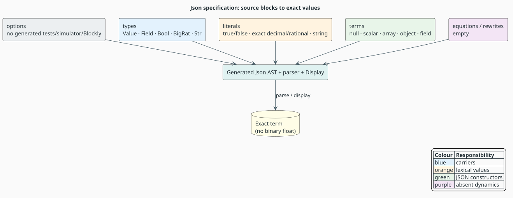
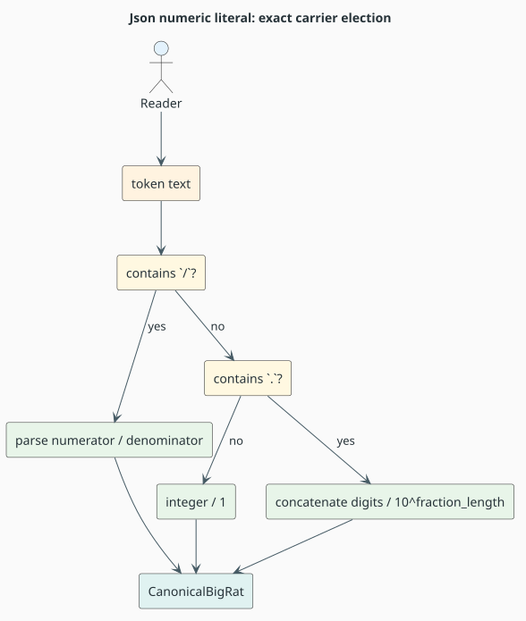
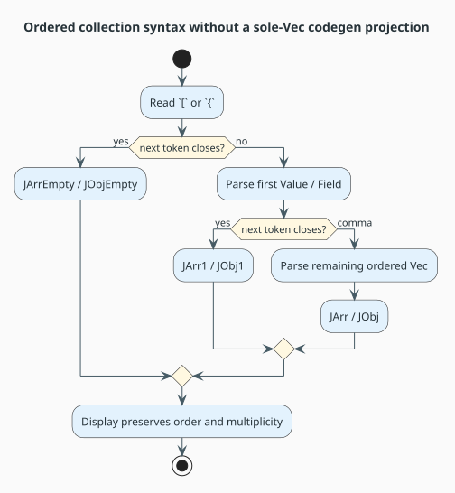

# Json — the `language!` specification for exact JSON-shaped terms

Last updated: 2026-08-04 · part of the [Language Specification References](README.md) suite

**Subject:** `languages/src/json.rs` (267 lines at this revision)

**Audience:** readers learning how native literal carriers and ordered collection slots are declared

**Method:** claims were checked against the source specification, `languages/tests/json.rs`, and the
generated modules under `target/generated/json/`.

Json is the smallest bundled specification that combines algebraic sorts, native payloads, custom
literal evaluation, and ordered heterogeneous collections. It is the first rung of the
GSLT (Greg's Structured Labelled Transition system) conformance ladder: the theory declares a
signature, but deliberately declares no equations and no rewrites. GSLT is the
$`(\Sigma,E,R)`$ theory presentation consumed by MeTTaIL.

---

## Table of contents

1. [Theory and notation](#1-theory-and-notation)
2. [The source block](#2-the-source-block)
3. [Options and generated surface](#3-options-and-generated-surface)
4. [Types and exact carriers](#4-types-and-exact-carriers)
5. [Literal languages](#5-literal-languages)
6. [Terms and collection arities](#6-terms-and-collection-arities)
7. [Empty dynamics](#7-empty-dynamics)
8. [Algorithms and invariants](#8-algorithms-and-invariants)
9. [Generated artifacts and verification](#9-generated-artifacts-and-verification)
10. [Differences from strict JSON](#10-differences-from-strict-json)
11. [References](#11-references)

---

## 1. Theory and notation

| Symbol or term | Meaning |
|---|---|
| $`\Sigma`$ | the **signature**: constructors and their argument/result sorts |
| $`E`$ | the **equational theory**: undirected identities between terms |
| $`R`$ | the **rewrite system**: directed computation rules |
| **AST** | abstract syntax tree |
| **DSL** | domain-specific language; here, the `language!` input syntax |
| **JSON** | JavaScript Object Notation, standardized by RFC 8259 |
| **BNF** | Backus–Naur form, a notation for context-free grammar productions |
| **BNFC** | BNF Converter; the source of the accepted `Label . Category ::= ...` production style |
| **carrier** | the Rust value stored by a native term category |
| **canonical rational** | an exact reduced ratio of arbitrary-precision integers |
| **arity split** | separate constructors for empty, singleton, and multi-element syntax |

The theory is $`(\Sigma,\varnothing,\varnothing)`$: eleven term constructors form
$`\Sigma`$, while $`E`$ and $`R`$ are empty. Parsing and rendering are meaningful even without a
reduction relation; the result is a typed data language.



*Figure 1. Json's literal evaluators and constructors feed the generated parser and AST. No binary
floating-point value enters the numeric carrier. Source:
[figures/json-spec-to-values.puml](figures/json-spec-to-values.puml).*

---

## 2. The source block

The complete structural outline is:

```text
language! {
    name: Json,
    options { emit_tests: false, emit_simulator: false, emit_blockly: false },
    types { Value Field Bool BigRat Str },
    literals { Bool { ... } BigRat { ... } Str { ... } },
    terms {
        JNull JBool JNum JStr
        JArrEmpty JArr1 JArr
        JObjEmpty JObj1 JObj
        Field
    },
    equations { },
    rewrites { },
}
```

The order is significant because `LanguageDef` parses the blocks in this order. The empty blocks
are explicit statements about the theory, not placeholders for undocumented behavior.

---

## 3. Options and generated surface

`languages/src/json.rs:144-148` disables three file-writing options:

| Option | Value | Consequence |
|---|---:|---|
| `emit_tests` | `false` | no generated `gen_json_*` test source is written into `languages/tests/` |
| `emit_simulator` | `false` | no auto-discovered binary requiring the optional `strategies` feature is written |
| `emit_blockly` | `false` | no Blockly artifacts are written |

These switches do not suppress the generated library implementation. The build still emits the
parser, display implementation, stack-safe term operations, metadata, strategies, Dovetail report,
and Rho-lowering modules under `target/generated/json/`. The hand-written suite
`languages/tests/json.rs` owns the conformance checks.

The simulator switch is intentionally off: generated simulators refer to strategy functions gated
behind a Cargo feature. Auto-discovering such a binary in a default build would make a documentation
example alter buildability.

---

## 4. Types and exact carriers

The `types` block at `languages/src/json.rs:150-157` declares two algebraic sorts and three native
sorts:

| DSL declaration | Generated role | Stored payload |
|---|---|---|
| `Value` | recursive JSON-shaped value | one of the `Value` enum variants |
| `Field` | object member | one string key and one `Value` |
| `![bool] as Bool` | Boolean literal carrier | Rust `bool` |
| `![CanonicalBigRat] as BigRat` | numeric carrier | exact arbitrary-precision rational |
| `![str] as Str` | string carrier | generated owned string literal representation |

The generated `Value` enum contains the scalar and collection variants directly. In particular,
`target/generated/json/ast_enums.rs` shows `JArr(Arc<Value>, Vec<Value>)` and
`JObj(Arc<Field>, Vec<Field>)`: order and duplicates are represented, not reconstructed from a set
or map.

### 4.1 Why numbers are rational

RFC 8259 describes decimal syntax but permits implementations to choose representational limits.
This specification elects exactness: the surface `3.14` becomes $`314/100 = 157/50`$, with no
binary floating-point rounding. That makes equality and display deterministic across platforms.

```math
\operatorname{decode}(i.f)
= \frac{\operatorname{integer}(i \mathbin{+\!+} f)}{10^{|f|}}
```

Here $`i`$ is the signed integer part, $`f`$ the fractional digit string, $`|f|`$ its length, and
$`+\!+`$ digit-string concatenation.

---

## 5. Literal languages

The `literals` block at `languages/src/json.rs:159-240` declares three token families. A token is
accepted only when its regex and evaluator agree.

### 5.1 Boolean

`true|false` maps to the two Rust Boolean values. The evaluator retains a defensive fallback to
`Err(())`; malformed text declines the reading instead of panicking.

### 5.2 Exact number

The numeric pattern accepts:

- a JSON-style integer such as `0`, `-2`, or `314`;
- a decimal such as `3.14` or `-0.125`;
- a canonical display-compatible rational such as `157/50`.

The last form is a deliberate surface superset. `CanonicalBigRat` displays an exact non-integral
value as a ratio, so accepting the ratio is required for `parse(display(term))` to preserve the
term. It does not remove any RFC 8259 number.



*Figure 2. Each accepted branch constructs the same exact rational carrier. Source:
[figures/json-exact-number.puml](figures/json-exact-number.puml).*

Denominator zero is refused. Decimal decoding constructs the denominator by appending one zero per
fractional digit; the complexity is linear in the token length.

### 5.3 String

The string pattern recognizes a double-quoted sequence with backslash escapes. The evaluator strips
the frame and currently decodes escaped quote and escaped backslash. This is sufficient for the
declared language and its display round trip, but it is not yet the complete RFC 8259 escape table;
the limitation is explicit in [§10](#10-differences-from-strict-json).

---

## 6. Terms and collection arities

The term table at `languages/src/json.rs:243-261` is the whole signature.

| Constructor | Surface | Result | Meaning |
|---|---|---|---|
| `JNull` | `null` | `Value` | null value |
| `JBool` | a `Bool` literal | `Value` | Boolean injection |
| `JNum` | a `BigRat` literal | `Value` | exact number injection |
| `JStr` | a `Str` literal | `Value` | string injection |
| `JArrEmpty` | `[]` | `Value` | empty ordered array |
| `JArr1` | `[v]` | `Value` | singleton array |
| `JArr` | `[v, vs...]` | `Value` | non-empty array with at least two elements |
| `JObjEmpty` | `{}` | `Value` | empty ordered object sequence |
| `JObj1` | `{f}` | `Value` | singleton object sequence |
| `JObj` | `{f, fs...}` | `Value` | object sequence with at least two fields |
| `Field` | `key:value` | `Field` | object member |

### 6.1 Why arrays and objects use three constructors

The GSLT paper writes a parameterized `List(Value)` or `List(Field)`. MeTTaIL's supported ordered
carrier is `Vec(T)`, but a rule whose sole parameter is a collection takes a specialized emission
path historically shaped around homogeneous `HashBag` terms. Json avoids projecting an ordered
list through that path. The empty/singleton/multi split keeps `Vec(T)` in a normal parameter slot,
the same shape used by polyadic Rholang sends.



*Figure 3. The three cases cover every finite ordered collection exactly once. Source:
[figures/json-arity-split.puml](figures/json-arity-split.puml).*

The representation is intentionally an ordered field sequence rather than a host hash map. Strict
JSON interoperable consumers may later reject duplicate keys, but the parser does not silently
discard or reorder them.

---

## 7. Empty dynamics

`equations { }` and `rewrites { }` at lines 264 and 266 state:

```math
E = \varnothing, \qquad R = \varnothing
```

Therefore Json parsing constructs a normal form immediately. There is no reduction that sorts
fields, deduplicates keys, coerces numbers, or changes a spelling after the literal evaluator has
constructed its carrier. This is a data-model test of the front end, not an evaluator benchmark.

---

## 8. Algorithms and invariants

### 8.1 Literate algorithm: exact decimal decoding

**Algorithm 1 (Exact decimal decoding).** Convert accepted decimal text into a rational without a
binary floating-point intermediate.

**Invariant.** After processing $`k`$ fractional digits, the denominator is $`10^k`$ and the
numerator is the signed concatenation of integral and fractional digits.

```pseudocode
ExactDecimal(text)
  If text contains no decimal point:
    return Integer(text) / 1
  Split text into integral part i and fractional digits f.
  Let digits be the sign-aware concatenation of i and f.
  Let denominator begin at 1.
  For each digit in f:
    append one decimal zero to denominator.
  Return Integer(digits) / Integer(denominator), reduced canonically.
```

The loop runs once per fractional digit and retains only the two digit strings. Its time and space
complexity are linear in input length, excluding arbitrary-precision reduction cost.

### 8.2 Literate algorithm: arity-complete collection construction

**Algorithm 2 (Arity-complete collection construction).** Cover every finite ordered array/object
while keeping collection payloads on the supported general parameter path.

**Invariant.** The emitted constructor's flattened element sequence equals the source sequence in
the same order and with the same multiplicity.

```pseudocode
ConstructDelimited(kind, elements)
  If elements is empty, emit the kind's Empty constructor.
  If elements has one member, emit the kind's singleton constructor.
  Otherwise:
    remove the first member as head;
    retain the remaining ordered members as a Vec tail;
    emit the kind's multi constructor (head, tail).
```

The three branches are disjoint and exhaustive by collection length.

---

## 9. Generated artifacts and verification

| Evidence | What it establishes |
|---|---|
| `target/generated/json/ast_enums.rs` | exact generated variants and payload types |
| `target/generated/json/display.rs` | delimiter and separator rendering for every constructor |
| `target/generated/json/parser.rs` | generated weighted parser |
| `target/generated/json/metadata.rs` | reflected terms and definition fingerprint |
| `languages/tests/json.rs` | parsing, display, exact values, arrays, objects, and conformance |
| `docs/languages/validate.sh` | documentation structure, figures, math, links, citations, and snippets |

The key executable properties are:

1. accepted scalar literals produce the intended carrier;
2. `parse(display(value))` preserves generated Json terms;
3. array and object order/multiplicity survive the round trip;
4. the empty equation/rewrite report stays empty;
5. malformed literals decline rather than panic.

---

## 10. Differences from strict JSON

This is an exact JSON-shaped term language, not a claim of complete RFC 8259 interoperability.

| Area | Current disposition |
|---|---|
| rational display syntax | accepts `numerator/denominator` in addition to JSON decimals so exact values round-trip |
| string escapes | quote and backslash are decoded; the full Unicode escape repertoire is not yet implemented |
| duplicate object keys | preserved as an ordered `Vec<Field>` rather than rejected or collapsed |
| whitespace | handled by the shared lexer rather than specified in this block |
| equations / rewrites | none; no normalization invents a stricter object policy |

These differences are explicit so a consumer can add a strict validation layer without confusing
validation with the language's lossless AST representation.

---

## 11. References

- T. Bray, ed., *The JavaScript Object Notation (JSON) Data Interchange Format*, RFC 8259,
  Internet Engineering Task Force, 2017.
  [DOI: 10.17487/rfc8259](https://doi.org/10.17487/rfc8259).
- The GSLT omnibus working draft, outside this repository at
  `/home/dylon/Workspace/f1r3fly.io/publications/GSLT-intro/omnibus.tex:393-415`, supplies the L1
  signature transcribed and conservatively extended here. (no DOI registered)
- [Suite index](README.md) — conventions, validation, and shared theory vocabulary.
