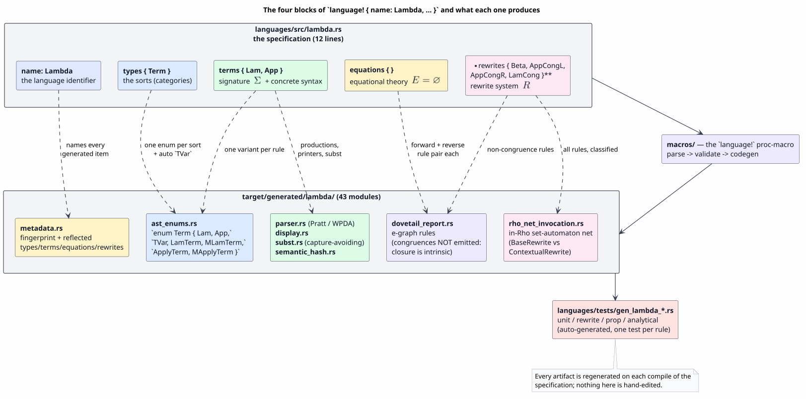
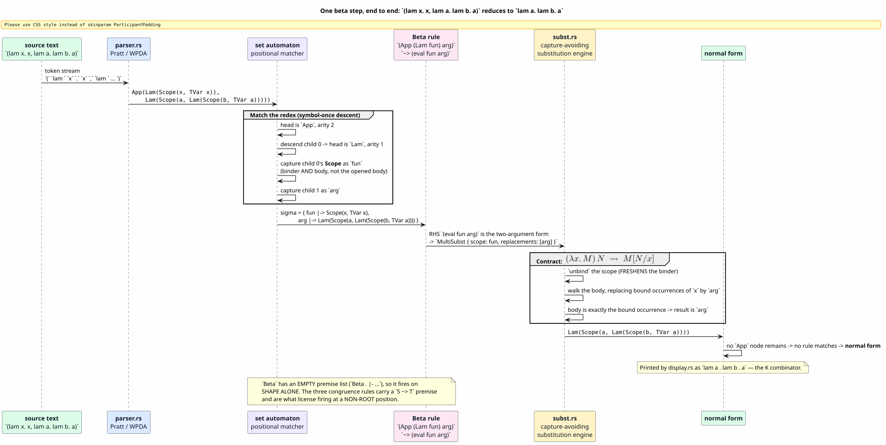
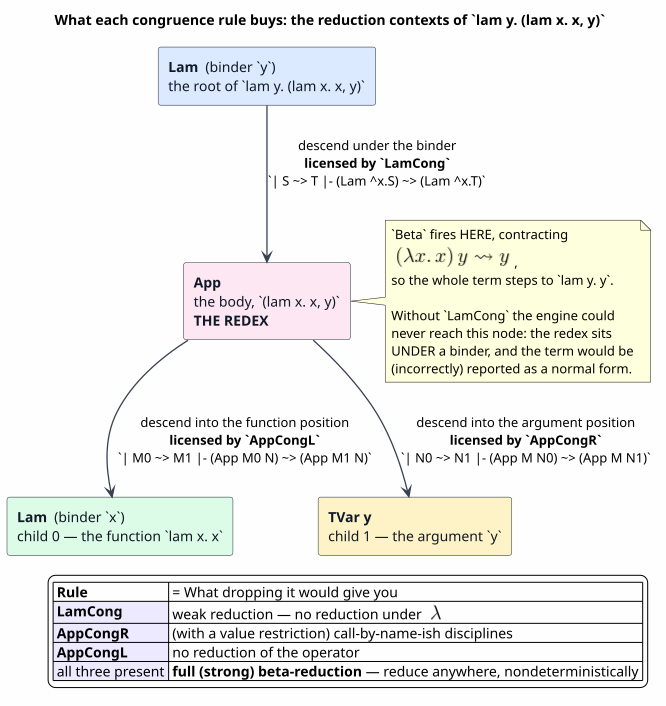

# Lambda — the `language!` specification for the λ-calculus, component by component

Last updated: 2026-07-27 · part of the [Language Specification References](README.md) suite

**Subject:** `languages/src/lambda.rs`
**Audience:** anyone reading a MeTTaIL `language!` block for the first time
**Method:** every claim below was checked against the DSL parser, the code generator, and the
*actual generated output* in `target/generated/lambda/`; §9 gives the file-and-line provenance for
each one.

Lambda is the smallest complete specification in the tree — 12 lines covering one sort, two
constructors, no equations, and four rewrite rules — which makes it the recommended first read for
the whole suite: every DSL construct it uses recurs, at greater scale, in every other language.

---

## Table of contents

1. [The specification under discussion](#1-the-specification-under-discussion)
2. [What `language!` is, and what it produces](#2-what-language-is-and-what-it-produces)
3. [`name: Lambda` — the language identifier](#3-name-lambda--the-language-identifier)
4. [`types { Term }` — the sorts](#4-types--term---the-sorts)
5. [`terms { … }` — the signature Σ and the concrete syntax](#5-terms-----the-signature-σ-and-the-concrete-syntax)
6. [`equations { }` — the equational theory E](#6-equations----the-equational-theory-e)
7. [`rewrites { … }` — the rewrite system R](#7-rewrites-----the-rewrite-system-r)
8. [The specification as a whole](#8-the-specification-as-a-whole)
9. [Provenance: where each claim comes from](#9-provenance-where-each-claim-comes-from)
10. [Gotchas](#10-gotchas)

---

## 1. The specification under discussion

```rust
use mettail_macros::language;

language! {
    name: Lambda,

    types {
        // Proc
        // Name
        Term
    },

    terms {
        Lam . ^x.body:[Term -> Term] |- "lam " x "." body : Term;

        App . fun:Term, arg:Term |- "(" fun "," arg ")" : Term;
    },

    equations {
        // extensionality?
    },

    rewrites {
        Beta . |- (App (Lam fun) arg) ~> (eval fun arg);
        AppCongL . | M0 ~> M1 |- (App M0 N) ~> (App M1 N);
        AppCongR . | N0 ~> N1 |- (App M N0) ~> (App M N1);
        LamCong . | S ~> T |- (Lam ^x.S) ~> (Lam ^x.T);
    },
}
```

Twelve lines of specification. They compile to **38 generated modules** and four generated test
files.

### Notation used in this document

| Symbol / term | Meaning |
|---|---|
| $`\Sigma`$ | **signature** — the set of constructors (term formers) and their arities/sorts |
| $`E`$ | **equational theory** — a set of *undirected* equations identifying terms |
| $`R`$ | **rewrite system** — a set of *directed* reduction rules |
| $`\rightsquigarrow`$ | the one-step reduction relation, written `~>` in the DSL |
| $`M[N/x]`$ | capture-avoiding substitution of $`N`$ for free occurrences of $`x`$ in $`M`$ |
| **sort** / **category** | a syntactic class of terms (here there is exactly one: `Term`) |
| **GSLT** | Greg's Structured Labelled Transition system — the $`(\Sigma, E, R)`$ presentation MeTTaIL compiles |
| **OSLF** | Operational Semantics in Logical Form — the theory the toolchain implements ([OSLF-2017](#references)) |
| **HOL** | higher-order logic / higher-order abstract syntax — here, the meta-level abstraction machinery |
| **AST** | abstract syntax tree |
| **α-equivalence** | equality of terms up to consistent renaming of bound variables |
| **β-reduction** | the rule $`(\lambda x.\,M)\,N \rightsquigarrow M[N/x]`$ |
| **η / extensionality** | the equation $`\lambda x.\,(M\,x) = M`$ when $`x`$ is not free in $`M`$ |

---

## 2. What `language!` is, and what it produces

`language!` is a **procedural macro**. It takes a language *theory* — the triple
$`(\Sigma, E, R)`$ — and emits an entire language implementation: types, parser, printer,
substitution, rewrite engine data, runtime lowerings, and tests.

The canonical block order is fixed by `impl Parse for LanguageDef`:

```text
language! {
    name: YourLanguage,
    options   { … },   /* optional — parser tuning (beam_width, dispatch, …) */
    types     { … },   /* required — the sorts */
    literals  { … },   /* optional — lexer classes for literal tokens */
    terms     { … },   /* the signature and concrete syntax */
    equations { … },   /* undirected laws */
    rewrites  { … },   /* directed reduction */
    logic     { … },   /* optional — hand-written Datalog relations */
}
```

Lambda uses four of them. `options`, `literals` and `logic` are absent; `equations` is present but
empty (which is legal — an empty block declares "this theory has no equations", as distinct from
omitting the block).



*Figure 1. Each block feeds specific generated artifacts. `types` fixes what kinds of AST nodes
exist; `terms` fixes concrete syntax and constructors; `equations` and `rewrites` define the
equality and the directed steps over those ASTs. Source:
[figures/lambda-spec-to-artifacts.puml](figures/lambda-spec-to-artifacts.puml).*

A partial inventory of `target/generated/lambda/`:

| Module | Role |
|---|---|
| `ast_enums.rs` | the Rust `enum` for each sort |
| `parser.rs` | the Pratt / WPDA parser (1 737 lines) |
| `display.rs` | `Display` — the inverse of the parser |
| `subst.rs` | iterative, pooled, capture-avoiding substitution engine |
| `semantic_hash.rs`, `iterative_cmp.rs`, `iterative_hash.rs` | α-canonical identity, stack-safe |
| `dovetail_report.rs` | the e-graph rewrite-rule set for the Dovetail engine |
| `rho_net_invocation.rs`, `rho_scalar_invocation.rs` | the in-Rho (Rholang) set-automaton lowering |
| `metadata.rs` | reflected description of the whole specification + its fingerprint |
| `strategies.rs`, `term_generation.rs`, `random_generation.rs` | proptest strategies and term generators |
| `binder_congruence.rs`, `freshness.rs`, `normalize.rs`, `flatten.rs`, … | supporting passes |

plus `languages/tests/gen_lambda_{unit,rewrite,prop,analytical}.rs` — auto-generated tests, one per
constructor and one per rewrite rule.

---

## 3. `name: Lambda` — the language identifier

**Syntax.** `name: Ident,` — a *field*, comma-terminated. It is not a block.

**Semantics.** It becomes the identifier prefix for every generated item, and the string returned by
`Language::name()`.

| Generated item | Name for this specification |
|---|---|
| marker struct | `LambdaLanguage` |
| metadata implementation | `LambdaMetadata` |
| module path | `mettail_languages::lambda::*` |
| REPL backend key | `"Lambda"` |
| legacy Datalog dump | `languages/src/generated/lambda-datalog.rs` |

**It also seeds the language fingerprint.** The generated `metadata.rs` records

```rust
fn definition_fingerprint(&self) -> Option<&'static str> {
    Some("mettail-langdef-v1:6ef0c40636bb0bca")
}
fn definition_source(&self) -> Option<&'static str> {
    Some("name: Lambda, types { Term }, terms\n{\n    Lam. ^x.body:[Term -> Term] |- \"lam \" x \".\" body : Term; …")
}
```

The fingerprint plus the normalised source are the **memo keys** for cached in-Rho artifacts and for
the incremental "append one rewrite rule without re-deriving everything" path
(`splice_rewrite_into_source`). Change one character of the specification and the fingerprint
changes, invalidating exactly the artifacts that depended on it.

---

## 4. `types { Term }` — the sorts

```rust
types {
    // Proc
    // Name
    Term
},
```

**Syntax.** Whitespace-separated declarations. Three forms exist in the DSL:

| Form | Declares |
|---|---|
| `Term` | a **pure algebraic sort** — an AST category with no Rust payload |
| `![i32] as Int` | a sort whose values carry a **native Rust payload**, which unlocks `try_direct_eval`, `fold`/`step` evaluation, and native printers |
| `![Vec<Proc>] as List`, `Bag [ "{", "}", "\|" ]` | a **collection sort** (List / Bag / Map / Set / Pathmap), optionally with surface delimiters |

Lambda declares exactly one sort, `Term`, in the first form. The untyped λ-calculus has a single
syntactic category, so nothing more is needed.

**`Proc` and `Name` are commented out and therefore inert.** They are vestigial from the
$`\rho`$-calculus template this file was cloned from — a process calculus needs a process/name
split; the λ-calculus does not. The macro never sees them; they are not a pending TODO.

### 4.1 What the block generates

One Rust `enum` per sort, plus two families of *auto-injected* variants. The real output
(`target/generated/lambda/ast_enums.rs`, reproduced verbatim with paths shortened):

```rust
#[derive(Clone, mettail_runtime::BoundTerm)]
pub enum Term {
    Lam(Scope<Binder<String>, Arc<Term>>),            // ← your `Lam` rule
    App(Arc<Term>, Arc<Term>),                        // ← your `App` rule
    TVar(OrdVar),                                     // ← AUTO-INJECTED: the variable form
    LamTerm(Scope<Binder<String>, Arc<Term>>),        // ┐
    MLamTerm(Scope<Vec<Binder<String>>, Arc<Term>>),  // │ AUTO-INJECTED:
    ApplyTerm(Arc<Term>, Arc<Term>),                  // │ higher-order (HOL) plumbing
    MApplyTerm(Arc<Term>, Vec<Term>),                 // ┘
}
```

#### `TVar` — the auto-injected variable form

Expanded: **T**erm **Var**iable. Every sort that does not declare an explicit `Var` rule receives
one automatically. The name comes from `generate_var_label`: *the first letter of the sort name,
upper-cased, followed by* `Var`. `Term` → `TVar`; a sort named `Proc` would yield `PVar`.

`TVar` is what a bare identifier in source text parses to. It carries an `OrdVar` — a moniker
`Var` (free or bound) equipped with a total order so that hashing and comparison are deterministic
across runs.

#### `LamTerm` / `MLamTerm` / `ApplyTerm` / `MApplyTerm` — the HOL plumbing

Expanded: **Lam**bda over domain **Term**, **M**ulti-**Lam**bda over domain **Term**, **Apply** to
a **Term**, **M**ulti-**Apply** to **Term**s.

These are **meta-level** constructs the engine uses to represent and apply *specification-level*
abstractions during matching and substitution. They are emphatically **not** your object-level
`Lam` and `App`: `Term::Lam` is the λ of the language you are defining; `Term::LamTerm` is the
engine's own abstraction machinery over that language.

They appear because `compute_hol_domain_pairs` flags the pair `(Term, Term)` — your `Lam` rule
structurally declares a `[Term -> Term]` abstraction. Remove the binder parameter and none of the
four would be emitted. (Before the HOL-B optimisation the macro emitted these for *every*
(category, domain) pair, i.e. $`O(|\text{categories}|^2)`$ variants; they are now demand-driven.)

#### Representation notes

- Children are `Arc<Term>`, not `Box<Term>`. Derived `Clone` is therefore `Arc::clone` — $`O(1)`$
  and non-recursive — which collapsed a former $`O(N^2)`$ deep-clone in chain construction to
  $`O(N)`$ sharing.
- `PartialEq`, `Eq`, `PartialOrd`, `Ord`, `Hash` and `Debug` are **not** derived. They are emitted
  as *iterative work-stack* implementations so that deeply nested terms cannot overflow the stack.
- `BoundTerm` is derived: α-equivalence is structural, not axiomatised. This is why the
  `equations` block does not need an α-conversion law.

---

## 5. `terms { … }` — the signature Σ and the concrete syntax

Every rule in `terms` is a **typing judgement**. The full production accepted by the parser is:

```text
Label . term_context |- concrete_syntax : Category [ ![rust_expr] ] [ fold | step ] [ right ] [ prefix(N) ] [ canonical ] ;
```

The five bracketed suffixes are optional and unused by Lambda:

| Suffix | Meaning |
|---|---|
| `![rust_expr]` | a Rust expression computing the value natively — used for constant folding and injections |
| `fold` | eager reduction when all subterms are values |
| `step` | mark the rule for small-step / congruence plumbing rather than collapsing to one big fold |
| `right` | this infix rule is right-associative |
| `prefix(N)` | explicit binding power for a prefix operator |
| `canonical` | declares this production the canonical spelling among surface synonyms |

`|-` is the **turnstile** — ASCII for the sequent symbol $`\vdash`$. Its role is a hard boundary:

> **Everything to the left of `|-` is metasyntax** — the abstract arguments and their *binding
> structure*. **Everything to the right is object syntax** — what a programmer actually types.

A legacy BNFC-style alternative (`Label . Category ::= item item … ;`) is still accepted; the
parser distinguishes them by looking for `::` versus `:`. Lambda uses the judgement style
throughout, which is the preferred form.


*Figure 2. The four regions of a `terms` rule, the parsed structures each becomes, and the Rust
each of those generates. Source: [figures/lambda-rule-anatomy.puml](figures/lambda-rule-anatomy.puml).*

### 5.1 `Lam . ^x.body:[Term -> Term] |- "lam " x "." body : Term;`

Read aloud: *"the constructor `Lam` takes one abstraction argument, binding `x` in `body`;
concretely it is written* `lam ⟨x⟩.⟨body⟩` *; the whole form is a* `Term`*."*

| Fragment | Name | What it is / does |
|---|---|---|
| `Lam` | **label** | the constructor name; becomes the enum variant `Term::Lam(…)` |
| `.` | separator | the mandatory dot after every rule label (in all four blocks) |
| `^` | **abstraction marker** | marks this parameter as a *binder*, not a plain subterm |
| `x` | **binder name** | the name of the bound variable; referenceable from the syntax pattern |
| `.` | scope dot | separates binder from body — "`x` is bound in what follows" |
| `body` | **body name** | the name of the term living under the binder |
| `:` | ascription | introduces the parameter's type |
| `[Term -> Term]` | **arrow type** | parsed as `TypeExpr::Arrow { domain: Term, codomain: Term }` — the binder ranges over sort `Term`, the body has sort `Term` |
| `\|-` | **turnstile** | end of context, start of the surface grammar |
| `"lam "` | **terminal** | a literal token; quoted strings are *always* literals |
| `x` | **parameter reference** | unquoted identifiers reference context parameters — here, the binder's printed name |
| `"."` | terminal | the literal dot the programmer types in `lam x. x` |
| `body` | parameter reference | the subtree under the binder |
| `: Term` | **result sort** | the category this production yields |
| `;` | terminator | end of rule |

**Multi-binder form.** The same parameter written `^[xs].body:[Term* -> Term]` would declare a
*vector* of binders (`TermParam::MultiAbstraction`, with `TypeExpr::MultiBinder` as the arrow's
domain), producing `Scope<Vec<Binder<String>>, …>`. Rholang's `for(…)` receive uses this; λ does
not.

**What it generates:**

```rust
Lam(Scope<Binder<String>, Arc<Term>>)
```

`Scope` is moniker's capture-safe abstraction: binder and body bundled into a single,
indivisible, α-equivalence-respecting value. `Binder<String>` keeps a `pretty_name` purely so the
printer can render a readable variable name; identity is *not* the name. The generated `Display`
pushes `"lam "`, the pretty name, `" . "`, then the body — so `Term::Lam(x. x)` prints as
`lam x . x`.

**A subtlety worth internalising now, because §7 depends on it:** the `Lam` variant has exactly
**one** field, and that field is the whole `Scope`. It is not a (binder, body) pair of two fields.
Any pattern that binds a name to `Lam`'s child binds it to the scope.

### 5.2 `App . fun:Term, arg:Term |- "(" fun "," arg ")" : Term;`

Read aloud: *"the constructor `App` takes two plain `Term` arguments, `fun` and `arg`; concretely
it is written* `(⟨fun⟩,⟨arg⟩)` *; the result is a* `Term`*."*

| Fragment | Name | What it is / does |
|---|---|---|
| `App` | label | becomes `Term::App(…)` |
| `fun:Term, arg:Term` | **simple parameters** | `name:Type` form (`TermParam::Simple`) — plain subterms, no binding; comma-separated |
| `"(" fun "," arg ")"` | **mixfix syntax** | literal, param, literal, param, literal |
| `: Term` | result sort | the category |

**What it generates:** `App(Arc<Term>, Arc<Term>)`, printed as `(fun , arg)`.

**Why the comma, rather than juxtaposition?** Application in textbook λ-calculus is written by
juxtaposition, `f a`. Encoding that in this grammar would require an infix operator whose token is
*nothing at all*, which needs its own binding-power discipline in the Pratt/WPDA parser and
introduces genuine ambiguity against every other production. The parenthesised, comma-separated
form keeps every production's first token unambiguous. The WPDA parity test pins the exact
behaviour: `Fixed("lam ")` → `PrefixDispatch: ConsumeAndPush(rule_at(Term, Lam, 1))`.

### 5.3 Everything else the `terms` block drives

The same `GrammarRule` list is read by the parser generator, the printer, the substitution engine,
the normaliser, the proptest strategy generator, and the metadata reflector. It is the single
source of truth for both *"what does a program look like"* and *"what is its tree"*.

The generated `subst.rs` is worth a glance, because it shows the shape: one `Assemble` task per
constructor, driven by an explicit work stack with pooled buffers —

```rust
enum SubstTask {
    VisitTerm { src: *const Term, slot: usize, op_idx: usize },
    AssembleTerm_Lam { slot: usize, cloned_pattern: Binder<String>, body_slot: usize },
    AssembleTerm_App { slot: usize, f0_slot: usize, f1_slot: usize },
    …
}
```

— i.e. substitution never recurses, so it cannot overflow the stack on a deep term.

---

## 6. `equations { }` — the equational theory E

**Syntax.**

```text
Name . type_context | premises |- lhs_pattern = rhs_pattern ;
```

Both contexts are optional. The distinguishing operator is `=` (undirected), against `~>` in
`rewrites` (directed).

**Semantics.** An equation asserts that two terms are *interchangeable*. The lowering
(`lower_equation`) emits **two** Dovetail rewrite rules per equation, labelled
`Lambda::equation::Name::forward` and `…::reverse`, so the e-graph merges the two e-classes in both
directions. Equations are the right home for structural congruence: associativity and commutativity
of parallel composition, scope extrusion, unit laws — anything symmetric in intent.

**Lambda declares none.** `equations { }` is empty, and `metadata.rs` confirms it:
`fn equations(&self) -> &'static [EquationDef] { &[] }`.

### 6.1 The `// extensionality?` comment

The comment is an open design question: should **η-conversion** be part of the theory?

```math
\eta:\qquad \lambda x.\,(M\,x) \;=\; M \qquad\text{provided } x \notin \mathrm{fv}(M)
```

Written in this DSL it would read:

```rust
Eta . | x # M |- (Lam ^x.(App M x)) = M;
```

where `x # M` is the **freshness premise** — "`x` is not free in `M`" — and `#` is the freshness
operator (`Premise::Freshness`).

**Two things to know before adding it.**

1. **β without η is the standard choice** for a reduction-oriented presentation. η is an
   extensionality principle about *observational* equality; it is not needed to compute, and
   including it complicates confluence arguments and normal-form talk. That is presumably why the
   line is a question mark rather than a rule.
2. **The freshness premise is not supported on the current Dovetail structural path.**
   `premise_supported` is exhaustive over every `Premise` variant and accepts *only*
   `Premise::Congruence`; `Freshness`, `RelationQuery`, `ForAll`, `BehavioralGuard` and
   `SyntheticInjGuard` all return `false`, because they demand evidence the structural saturation
   does not model. An η equation would therefore be reported as unsupported and the language would
   **fail closed** — it would not be silently dropped, but it would not run either.

---

## 7. `rewrites { … }` — the rewrite system R

**Syntax.**

```text
Name . type_context | premises |- lhs_pattern ~> rhs_pattern ;
```

- `type_context` — optional, comma-separated `name:Type` bindings.
- `|` — separates the type context from the premise list. Present only when there are premises.
- `premises` — comma-separated side conditions. Kinds: congruence (`S ~> T`), freshness (`x # P`),
  relation queries (`rel(a, b)`), universals (`xs.*map(|x| …)`), behavioural guards.
- `|-` — the turnstile: end of contexts, start of the rule proper.
- `~>` — the directed reduction arrow.

Two abbreviated forms appear in this file and are worth spelling out:

| Written | Means |
|---|---|
| `Beta . \|- …` | `\|-` immediately after the dot ⇒ **both** the type context and the premise list are empty — an unconditional rule |
| `AppCongL . \| M0 ~> M1 \|- …` | nothing before the `\|` ⇒ empty *type* context; `M0 ~> M1` is the single premise |

> **Critical:** rewrite patterns are written in **abstract syntax**, as prefix S-expressions
> `(Constructor arg₁ arg₂ …)` — *never* in the concrete syntax defined by `terms`. `(App M N)` is
> the AST node; the text a programmer types for it is `(M , N)`. Confusing the two is the single
> most common misreading of this block.

### 7.1 `Beta . |- (App (Lam fun) arg) ~> (eval fun arg);`

The β-reduction rule — the entire computational content of the λ-calculus.

```math
\beta:\qquad (\lambda x.\,M)\,N \;\rightsquigarrow\; M[N/x]
```

| Fragment | What it is / does |
|---|---|
| `Beta` | the rule name; surfaces in metadata, traces, and rule labels |
| `.` | the separator after the name |
| `\|-` | turnstile with **nothing** before it — no type context, no premises. This rule fires on shape alone |
| `(App (Lam fun) arg)` | **LHS pattern**: an `App` node whose child 0 is a `Lam` node and whose child 1 is captured as `arg` |
| `fun` | binds `Lam`'s single child — i.e. **the entire `Scope`**, binder *and* body together, not the opened body |
| `arg` | binds the argument subterm |
| `~>` | rewrites to |
| `(eval fun arg)` | **RHS**: apply the scope `fun` to the replacement `arg` — see below |

#### `eval` — the substitution meta-operator

`eval` is **not a constructor** you declared, and it is not a user-visible function. It is a
reserved meta-operator in pattern position, recognised by the pattern parser (historically also
spelled `subst`). It has two arities:

| Form | Lowers to | Meaning |
|---|---|---|
| `(eval scope repl)` — 2 arguments | `PatternTerm::MultiSubst { scope, replacements: [repl] }` | open the scope — moniker `unbind`, which **freshens** the binder — and substitute `repl` for the bound variable |
| `(eval term var repl)` — 3 arguments (legacy) | `PatternTerm::Subst { term, var, replacement }` | $`\mathit{term}[\mathit{repl}/\mathit{var}]`$ |

If the first argument is syntactically a pattern-level lambda `^x.body`, the 2-argument form
lowers to the single `Subst` variant instead, extracting binder and body directly. Here `fun` is a
plain variable, so it takes the `MultiSubst` path: unbind at runtime, then substitute.

So `(eval fun arg)` is exactly $`\mathit{fun}[\mathit{arg}/x]`$ where $`x`$ is the `Lam`'s binder —
**capture-avoiding by construction**, because `unbind` freshens the binder before the body is ever
exposed. The generated metadata renders the rule as `lhs: "(lam fun.,arg)"`, `rhs: "fun[arg]"`.



*Figure 3. Source text, parse, positional match, the firing substitution $`\sigma`$, substitution,
normal form — for `(lam x. x, lam a. lam b. a)`. Source:
[figures/lambda-beta-firing.puml](figures/lambda-beta-firing.puml).*

#### How `Beta` executes

Compile time: the LHS pattern is interned into the **positional set automaton**. The serializer
emits a location-rooted receive whose match has an `App`-arity-2 *nested* case — descend child 0,
match a `Lam`-arity-1 head, collapse the `Lam` body as `fun`, bind child 1 as `arg`, and fire the
substitution

```math
\sigma \;=\; \{\, \mathit{fun} \mapsto \text{body},\ \ \mathit{arg} \mapsto \text{argument} \,\}
```

on the `Beta` rule's channel.

Because the RHS is a *top-level substitution*, `Beta` is routed to the **native lane**
(`typed_report::generate_native_rules_and_dispatch`) rather than being emitted as a structural
e-graph rule: it gets its own operation id and its own dispatcher arm, and in the in-Rho backend
becomes a `^subst` seed which the de-Bruijn substitution term-rewriting system drives to normal
form as silent communications. The single observable communication *is* the β fire.

### 7.2 The three congruence rules

```rust
AppCongL . | M0 ~> M1 |- (App M0 N) ~> (App M1 N);
AppCongR . | N0 ~> N1 |- (App M N0) ~> (App M N1);
LamCong  . | S  ~> T  |- (Lam ^x.S)  ~> (Lam ^x.T);
```

**Names expanded:** *Cong* = **congruence**. *L* and *R* are the **left** (function/operator) and
**right** (argument/operand) positions of an application. `LamCong` is the congruence for the `Lam`
constructor.

**Form.** Each is a *conditional* rewrite. Nothing appears before the `|`, so the type context is
empty; the text between `|` and `|-` is a `Premise::Congruence`. Read them as horizontal inference
rules:

```math
\frac{M_0 \rightsquigarrow M_1}{\mathrm{App}(M_0, N) \rightsquigarrow \mathrm{App}(M_1, N)}
\qquad
\frac{N_0 \rightsquigarrow N_1}{\mathrm{App}(M, N_0) \rightsquigarrow \mathrm{App}(M, N_1)}
\qquad
\frac{S \rightsquigarrow T}{\mathrm{Lam}(\hat{x}.S) \rightsquigarrow \mathrm{Lam}(\hat{x}.T)}
```

In `LamCong`, `^x.S` is a **pattern-level abstraction** (`PatternTerm::Lambda`): the LHS *opens*
the `Lam`'s scope and names the body `S`; the RHS *re-closes* over the same binder `x` with the
reduced body `T`. This is the only place in the file where `^` appears in a rewrite rather than in
a `terms` context, and it means something related but distinct: in `terms` it *declares* a binding
site; in a pattern it *destructures* one.

**What they mean semantically.** They define the **reduction contexts** — the positions at which a
redex may be contracted. With all three present, and with no ordering or value restriction
anywhere, Lambda's `~>` is **full (strong) β-reduction**: reduce anywhere, in either subterm of an
application, including *under* a λ, nondeterministically.



*Figure 4. The redex in `lam y. (lam x. x, y)` sits under a binder; `LamCong` is what licenses the
engine to descend to it. Source: [figures/lambda-reduction-contexts.puml](figures/lambda-reduction-contexts.puml).*

| If you dropped… | You would get |
|---|---|
| `LamCong` | weak reduction — no reduction under λ; `lam y. (lam x. x, y)` would be (wrongly) a normal form |
| `AppCongR` | no reduction of arguments; restricting it to *values* instead is how call-by-value is specified |
| `AppCongL` | no reduction of the operator |
| all three | only top-level redexes — a single-step head reduction |

**How each backend consumes them.** These rules are *specification*; different backends realise
them differently, and one of them derives them for free:

| Backend | Treatment |
|---|---|
| **Dovetail e-graph** | `lower_rewrite` emits **nothing** for a congruence rule. Congruence closure is intrinsic to an e-graph — equal children give equal parents by construction — so re-encoding these would be redundant work |
| **in-Rho net** | classified `RhoNetRuleKind::ContextualRewrite`; `Beta` is a `RhoNetRuleKind::BaseRewrite` |
| **test generation** | `rewrite_tests.rs` branches on `is_congruence_rule()` to generate the appropriate assertions |
| **metadata / reflection** | recorded verbatim: `conditions: &["M0 ~> M1"], premise: Some(("M0", "M1"))` |

They are still worth writing even where a backend derives them: they are the human- and
proof-readable statement of *which relation this language actually defines*, and swapping them is
how you change evaluation strategy.

---

## 8. The specification as a whole

```math
\Sigma \;=\; \bigl\{\; \mathrm{Lam} : [\mathrm{Term} \to \mathrm{Term}] \to \mathrm{Term}, \quad
                       \mathrm{App} : \mathrm{Term} \times \mathrm{Term} \to \mathrm{Term} \;\bigr\}
```

```math
E \;=\; \varnothing
\qquad\qquad
R \;=\; \{\,\beta\,\} \;\cup\; \{\,\text{AppCongL},\ \text{AppCongR},\ \text{LamCong}\,\}
```

That is the **untyped λ-calculus under full β-reduction**, with α-equivalence handled *structurally*
by moniker `Scope`s rather than axiomatised as an equation.

### 8.1 Concrete syntax cheat-sheet

Taken from the golden corpus in `repl/tests/a_s5_6_exec_goldens.rs`, so these are exactly the
strings the REPL executes:

| Source text | AST | Note |
|---|---|---|
| `lam x. x` | `Lam(x. TVar x)` | the identity combinator **I** |
| `lam a. lam b. a` | `Lam(a. Lam(b. TVar a))` | the **K** combinator; already a normal form |
| `(lam x. x, lam a. lam b. a)` | `App(Lam …, Lam …)` | a single β step ⇒ `lam a. lam b. a` |
| `lam y. (lam x. x, y)` | redex under a binder | needs `LamCong` ⇒ `lam y. y` |
| `((lam x. (x,x)), (lam x. (x,x)))` | **Ω** | diverges — the non-termination witness |
| `(lam x. x, (lam x. x, (lam x. x, (lam x. x, lam a. lam b. a))))` | a 4-chain | four successive β steps |

### 8.2 A reduction, step by step

Subject: `(lam x. x, lam a. lam b. a)`.

1. **Parse.** The token stream `(`, `lam `, `x`, `.`, `x`, `,`, `lam `, … `)` yields
   `App(Lam(Scope(x, TVar x)), Lam(Scope(a, Lam(Scope(b, TVar a)))))`.
2. **Match.** The set automaton sees head `App`, arity 2; descends child 0; sees head `Lam`,
   arity 1; captures that scope as `fun`; captures child 1 as `arg`. The `Beta` LHS matches at the
   root.
3. **Fire.** $`\sigma = \{\mathit{fun} \mapsto \mathrm{Scope}(x,\ \mathrm{TVar}\ x),\ \ \mathit{arg} \mapsto \mathrm{Lam}(a.\,\mathrm{Lam}(b.\,\mathrm{TVar}\ a))\}`$.
4. **Contract.** The RHS `(eval fun arg)` unbinds `fun` (freshening the binder) and substitutes
   `arg` for the bound variable throughout the body. The body *is* the bound occurrence, so the
   result is `arg` itself.
5. **Result.** `Lam(Scope(a, Lam(Scope(b, TVar a))))` — printed `lam a . lam b . a`. No `App` node
   remains, so no rule matches: **normal form**.

---

## 9. Provenance: where each claim comes from

| Claim in this document | Source |
|---|---|
| block order and per-block role | `readme_dev.md` §"Guide: defining a language theory" |
| `terms` rule production, judgement vs. legacy style | `ast/src/grammar.rs:617` (`parse_grammar_rule`), `:725` (`parse_grammar_rule_new`) |
| `^x.body` / `^[xs].body` / `?g:Guard` / `*opt(…)` parameter forms | `ast/src/grammar.rs:870` (`parse_term_param`) |
| `[A -> B]` is `TypeExpr::Arrow`; `A*` is `MultiBinder` | `ast/src/types.rs:24-34`, `:96-172` |
| quoted string ⇒ literal, bare identifier ⇒ parameter reference | `ast/src/grammar.rs:970-1014` (`parse_syntax_pattern`) |
| `types` block forms (plain / `![T] as C` / collections) | `ast/src/language/parse.rs:457` (`parse_types`) |
| auto-injected `Var` variant and its naming rule | `macros/src/gen/types/enums.rs:121-127`; `macros/src/gen/mod.rs:2162` (`generate_var_label`) |
| auto-injected `Lam{D}` / `MLam{D}` / `Apply{D}` / `MApply{D}`, gated by `compute_hol_domain_pairs` | `macros/src/gen/types/enums.rs:129-182` |
| `Arc` children, iterative `Clone`/`Hash`/`Ord`/`Debug` rationale | `macros/src/gen/types/enums.rs:184-201` |
| generated `enum Term` for this language | `target/generated/lambda/ast_enums.rs` |
| `Display` renders `"lam " + name + " . " + body`; `App` renders `( fun , arg )` | `target/generated/lambda/display.rs:68-103` |
| substitution is an iterative work-stack with pooled buffers | `target/generated/lambda/subst.rs` |
| fingerprint, normalised source, reflected types/terms/equations/rewrites | `target/generated/lambda/metadata.rs` |
| rewrite/equation production; the `\|` / `\|-` context split | `ast/src/language/parse.rs:2835` (`parse_rule_contexts`), `:3261` (`parse_rewrite_rule`), `:2892` (`parse_equation`) |
| premise kinds | `ast/src/language/model.rs:99-149` (`enum Premise`); `ast/src/language/parse.rs:2276` (`parse_premise`) |
| `eval` arities and their lowerings | `ast/src/language/parse.rs:2981-3042` |
| pattern-level `^x.S` is `PatternTerm::Lambda` | `ast/src/language/parse.rs:3077-3082` |
| equations emit forward **and** reverse e-graph rules | `macros/src/gen/runtime/dovetail_report.rs:1472` (`lower_equation`) |
| only congruence premises are supported on the structural path | `macros/src/gen/runtime/dovetail_report.rs:1456` (`premise_supported`) |
| congruence rules emit no Dovetail data (closure is intrinsic) | `macros/src/gen/runtime/dovetail_report.rs:1537` |
| substitution rewrites go to the native lane, not the structural one | `macros/src/gen/runtime/dovetail_report.rs:1543-1549` |
| `BaseRewrite` vs `ContextualRewrite` classification | `rholang-codegen/src/rho_net.rs:551-568` (`add_rewrites`) |
| β compile/run pipeline; the σ firing and `^subst` seed | `docs/architecture/rho-native-integration/27-oslf-language-to-rholang-compilation.md` §13; `…/19-in-rho-binder-beta-substitution.md` §4 |
| the golden surface-syntax corpus | `repl/tests/a_s5_6_exec_goldens.rs:63-78` |
| WPDA token/dispatch parity for `Lam` | `languages/tests/wpda_parity_lambda.rs` |
| generated per-constructor and per-rewrite tests | `languages/tests/gen_lambda_unit.rs`, `…/gen_lambda_rewrite.rs` |

---

## 10. Gotchas

1. **Two different syntaxes coexist in one file.** `terms` uses *concrete* syntax — quoted literals
   interleaved with parameter references. `equations` and `rewrites` use *abstract* prefix patterns
   over constructor labels. `(App M N)` in a rewrite is not the same notation as `(M , N)` in
   source text, even though they denote the same node.
2. **`fun` in `(Lam fun)` is the whole `Scope`, not the body.** `Lam` has one field. `(eval fun arg)`
   depends on this: it unbinds internally.
3. **`eval` is a reserved meta-operator**, not a constructor and not a user function. You cannot
   name a constructor `eval`, and `eval` never appears in surface syntax.
4. **The empty turnstile prefix is meaningful.** `Beta . |- …` means "no type context and no
   premises". `AppCongL . | M0 ~> M1 |- …` means "empty type context, one premise". The difference
   is one bar.
5. **The commented `Proc` and `Name` sorts are dead text**, not a TODO. They are ρ-calculus
   residue.
6. **The four auto-injected HOL variants exist solely because of the one binder parameter**, and
   they are meta-level. Do not confuse `Term::LamTerm` (engine machinery) with `Term::Lam` (your
   λ).
7. **Adding an η equation is not free.** Its freshness premise is unsupported on the current
   Dovetail structural path, so the language would fail closed rather than silently mis-reduce.
8. **`"lam "` carries a trailing space** in the literal. That is cosmetic — lexing is
   whitespace-insensitive, so `lam x. x` and `lam x . x` both parse, and the printer emits the
   latter.
9. **Congruence rules are not redundant even where a backend derives them.** They are the
   specification of the reduction relation; the e-graph merely happens to satisfy them for free.

---

## References

- **OSLF-2017** — Operational Semantics in Logical Form; the theory the toolchain implements. See
  `docs/architecture/rho-native-integration/references.md#oslf-2017`.
- **RHO-2005** — the core $`\rho`$-calculus, quoting, and COMM.
  `docs/architecture/rho-native-integration/references.md#rho-2005`.
- **SET-AUTOMATON-LOCATE-2021**, **SET-AUTOMATON-MATCHING-2022** — the symbol-once positional set
  automaton used to locate redexes. `…/references.md`.
- Barendregt, H. P., *The Lambda Calculus: Its Syntax and Semantics*, Studies in Logic vol. 103,
  North-Holland, 1984 — the standard reference for β, η, and reduction strategies.
- In-repo companions: `docs/architecture/rho-native-integration/19-in-rho-binder-beta-substitution.md`
  (β and substitution in Rho), `…/27-oslf-language-to-rholang-compilation.md` (how a `language!`
  block becomes an installed `Par`), `docs/examples/rholang/01-language-spec.md` (the same
  block-by-block treatment for Rholang), `readme_dev.md` (the DSL guide).
