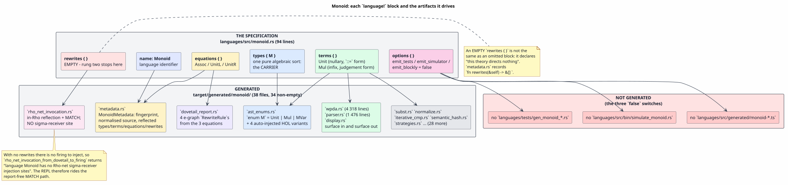
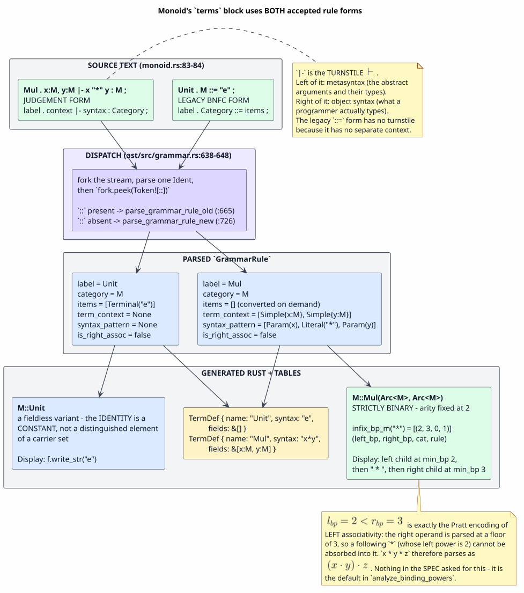
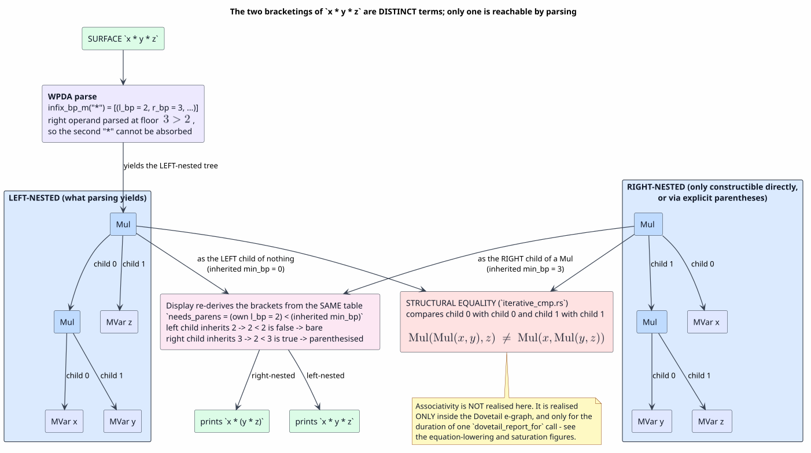
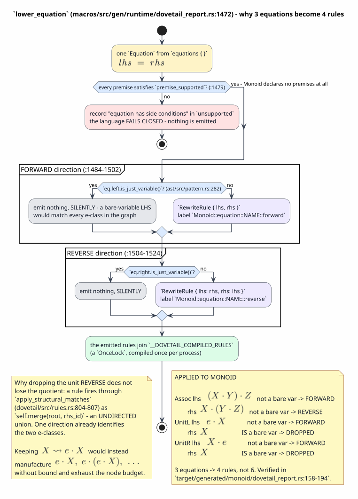

# Monoid — the `language!` specification for the equations rung, component by component

Last updated: 2026-07-28 · part of the [Language Specification References](README.md) suite

**Subject:** `languages/src/monoid.rs`
**Audience:** anyone reading a MeTTaIL `language!` block that declares an equational theory
**Method:** every claim below was checked against the DSL (domain-specific language) parser, the
code generator, and the *actual generated output* in `target/generated/monoid/`;
[§13](#13-provenance-where-each-claim-comes-from) gives the file-and-line provenance for each one.

Monoid is the second rung of the GSLT (Greg's Structured Labelled Transition system) omnibus paper's
conformance ladder — the rung at which a specification stops being a free term algebra and starts
being a *quotient*. It declares one sort, two constructors, **three equations**, and **no rewrites
at all**. That makes it the shortest path to understanding what an `equations { }` block actually
buys you, because nothing else in the file can be confused for the answer.

It is also the page in this suite where the gap between the *algebra* and the *implementation* is
widest, and [§9](#9-where-the-algebra-and-the-implementation-diverge) exhibits that gap in detail
rather than smoothing it over. The short version, stated up front so no reader is misled:

> **Associativity is not enforced anywhere in the parser, the AST (abstract syntax tree), the
> printer, the normaliser, or the matcher.** `Mul` is strictly binary and left-associative, so
> `(a*b)*c` and `a*(b*c)` are different Rust values that compare unequal.
> The three equations are realised **only** inside the
> Dovetail e-graph, for the duration of a single `dovetail_report_for` call, and they never mutate
> the term you hold.

---

## Table of contents

1. [The specification under discussion](#1-the-specification-under-discussion)
2. [What `language!` is, and what it produces](#2-what-language-is-and-what-it-produces)
3. [`name: Monoid` - the language identifier](#3-name-monoid---the-language-identifier)
4. [`options { ... }` - the three emission switches](#4-options------the-three-emission-switches)
5. [`types { M }` - the carrier](#5-types--m----the-carrier)
6. [`terms { ... }` - the signature and the concrete syntax](#6-terms------the-signature-and-the-concrete-syntax)
7. [`equations { ... }` - the equational theory](#7-equations------the-equational-theory)
8. [`rewrites { }` - the empty rewrite system](#8-rewrites-----the-empty-rewrite-system)
9. [Where the algebra and the implementation diverge](#9-where-the-algebra-and-the-implementation-diverge)
10. [The specification as a whole](#10-the-specification-as-a-whole)
11. [The saturation procedure, in literate form](#11-the-saturation-procedure-in-literate-form)
12. [Resource discipline, failure modes, and security posture](#12-resource-discipline-failure-modes-and-security-posture)
13. [Provenance: where each claim comes from](#13-provenance-where-each-claim-comes-from)
14. [Gotchas](#14-gotchas)
15. [References](#references)

---

## 1. The specification under discussion

The file `languages/src/monoid.rs` is 94 lines, of which 60 are module documentation (the
clause-by-clause containment table against the source paper) and 24 are the specification itself:

```rust
use mettail_macros::language;

language! {
    name: Monoid,

    options {
        emit_tests: false,
        emit_simulator: false,
        emit_blockly: false,
    },

    types { M },

    terms {
        Unit . M ::= "e" ;
        Mul . x:M, y:M |- x "*" y : M ;
    },

    equations {
        Assoc . |- (Mul (Mul X Y) Z) = (Mul X (Mul Y Z)) ;
        UnitL . |- (Mul Unit X) = X ;
        UnitR . |- (Mul X Unit) = X ;
    },

    rewrites { },
}
```

This is a transcription of the GSLT omnibus paper's rung-two listing
([GSLT-OMNIBUS](#references), `omnibus.tex:430-449`), clause for clause: `types { M }` at `:434`,
`Unit` at `:437`, `Mul` at `:438`, `Assoc` at `:442`, `UnitL` at `:443`, `UnitR` at `:444`, and the
empty `rewrites { }` at `:447`. The module header records that containment as a 7-of-7 table; the
only deviation is the `options` block, which the paper does not have and which controls file
emission rather than semantics.

### Notation used in this document

Every symbol, acronym, and term used later is defined here first.

| Symbol / term | Meaning |
|---|---|
| $`\Sigma`$ | **signature** — the set of constructors (term formers) with their arities and sorts |
| $`E`$ | **equational theory** — a set of *undirected* equations identifying terms |
| $`R`$ | **rewrite system** — a set of *directed* reduction rules; for Monoid, $`R = \varnothing`$ |
| **sort** / **category** | a syntactic class of terms; Monoid declares exactly one, named `M` |
| **carrier** | the set a sort denotes — here, the set of `M`-terms |
| **arity** | the number of arguments a constructor takes; `Unit` has arity 0, `Mul` arity 2 |
| $`\cdot`$ | the binary operation, written `*` in the concrete syntax and `Mul` in the abstract syntax |
| $`e`$ | the identity element, written `e` in the concrete syntax and `Unit` in the abstract syntax |
| **free algebra** $`T_\Sigma(X)`$ | the algebra of all well-sorted terms over $`\Sigma`$ and variables $`X`$, with **no** equations imposed |
| **quotient algebra** $`T_\Sigma(X)/{\equiv_E}`$ | the free algebra with terms identified whenever $`E`$ proves them equal |
| $`\equiv_E`$ | **provable equality** in equational logic: the least congruence containing $`E`$ ([BIRKHOFF-1935](#references)) |
| **congruence** | an equivalence relation closed under the term formers: if $`a \equiv b`$ then $`f(\ldots,a,\ldots) \equiv f(\ldots,b,\ldots)`$ |
| $`\rightsquigarrow`$ | a *directed* step, written `~>` in the DSL; used below for one orientation of an equation |
| **e-graph** | a data structure representing a congruence over many terms compactly ([NELSON-OPPEN-1980](#references)) |
| **e-class** | one equivalence class inside an e-graph — a set of e-nodes asserted equal |
| **e-node** | one term former applied to e-*classes*, e.g. `Mul[A, E]` |
| **equality saturation** | running rewrite rules over an e-graph as *merges* until a fixpoint ([EQSAT-2009](#references), [EGG-2021](#references)) |
| **hash-consing** | interning structurally identical nodes so they share one identity; why both `e` occurrences below land in one class |
| **AC** | associative–commutative — the matching discipline a *flat* operator would need; Monoid does **not** use it |
| **GSLT** | Greg's Structured Labelled Transition system — the $`(\Sigma, E, R)`$ presentation MeTTaIL compiles |
| **OSLF** | Operational Semantics in Logical Form, the theory the toolchain implements ([OSLF-2017](#references)) |
| **DSL** | domain-specific language — here, the `language!` macro's input grammar |
| **AST** | abstract syntax tree |
| **LHS** | left-hand side of a rule — the pattern that must match |
| **RHS** | right-hand side of a rule — the pattern that is built when it does |
| **REPL** | read-eval-print loop — the interactive front end in `repl/`, which registers each bundled language under its lower-cased name |
| **BNFC** | the Backus-Naur Form Converter tool, whose `Label . Cat ::= item ... ;` production style the DSL's legacy rule form imitates |
| **WPDA** | weighted pushdown automaton — the parser backend the macro generates |
| $`l_{bp}`$ / $`r_{bp}`$ | **left** and **right binding power**, the two numbers a Pratt parser uses to place an infix operator ([PRATT-1973](#references)) |
| **HOL** | higher-order logic / higher-order abstract syntax — the engine's own abstraction machinery |
| **rung** | one level of the omnibus paper's conformance ladder; rung one is types + terms, rung two adds equations, rung three adds rewrites |

---

## 2. What `language!` is, and what it produces

`language!` is a **procedural macro**. It takes a language *theory* — the triple
$`(\Sigma, E, R)`$ — and emits an entire language implementation: types, parser, printer,
substitution, rewrite-engine data, runtime lowerings, and reflected metadata.

The canonical block order is fixed by `impl Parse for LanguageDef`:

```text
language! {
    name: YourLanguage,
    options   { ... },   /* optional - emission switches and parser tuning */
    types     { ... },   /* required - the sorts */
    literals  { ... },   /* optional - lexer classes for literal tokens */
    terms     { ... },   /* the signature and concrete syntax */
    equations { ... },   /* undirected laws */
    rewrites  { ... },   /* directed reduction */
    logic     { ... },   /* optional - hand-written Datalog relations */
}
```

Monoid uses five of them: `name`, `options`, `types`, `terms`, `equations`, and `rewrites` — the
last one present but empty. `literals` and `logic` are absent.



*Figure 1. `types` fixes what kinds of AST node exist; `terms` fixes the constructors and the
concrete syntax; `equations` becomes e-graph rule data and reflected metadata; the empty `rewrites`
is why no in-Rho firing site is generated; `options` suppresses three file-writing emitters.
Source: [figures/monoid-spec-to-artifacts.puml](figures/monoid-spec-to-artifacts.puml).*

Twenty-four lines of specification compile to **38 files** in `target/generated/monoid/`, of which
34 are non-empty. The four empty ones — `binder_congruence.rs`, `eval.rs`, `flatten.rs`,
`numeric_cast_adapter.rs` — are emitted unconditionally and are empty *because Monoid has nothing
for them to do*: no binders, no `![...]` native evaluation, no collection to flatten, no numeric
sorts to cast between. Their emptiness is itself evidence, and [§9](#9-where-the-algebra-and-the-implementation-diverge)
uses `flatten.rs` in exactly that way.

| Module | Role for this language |
|---|---|
| `ast_enums.rs` | the Rust `enum M` — 435 bytes, the whole carrier |
| `wpda.rs` | the weighted-pushdown parser tables and engine (4 318 lines) |
| `parser.rs` | the token type, lexer, and parse entry points (1 476 lines) |
| `display.rs` | `Display` — precedence-aware, the inverse of the parser |
| `dovetail_report.rs` | the e-graph rule set built from `equations { }`, and the saturation driver |
| `metadata.rs` | reflected description of the whole specification plus its fingerprint |
| `rho_net_invocation.rs` | the in-Rho reflection and MATCH path (41 695 bytes) |
| `iterative_cmp.rs`, `iterative_hash.rs`, `semantic_hash.rs`, `iterative_drop.rs` | stack-safe identity, ordering, hashing, and dropping |
| `subst.rs`, `normalize.rs`, `env_subst.rs`, `env_types.rs` | substitution and normalisation work-stack engines, plus the REPL environment |
| `strategies.rs`, `term_generation.rs`, `random_generation.rs` | proptest strategies and term generators (emitted even with `emit_tests: false`) |
| `is_ground.rs`, `term_depth.rs`, `var_inference.rs`, `match_pattern.rs`, `parse_alt_filter.rs` | supporting analyses |
| `language_struct.rs`, `language_trait_impl.rs`, `term_wrapper.rs`, `debug.rs`, `freshness.rs`, `guard_codegen.rs`, `flt_reflect.rs`, `rho_scalar_invocation.rs`, `rho_fold_dataflow.rs` | the runtime surface |
| `ast.rs`, `language.rs` | aggregators — nothing but `include!` lines |

---

## 3. `name: Monoid` - the language identifier

**Syntax.** `name: Ident,` — a *field*, comma-terminated. It is not a block.

**Semantics.** It becomes the identifier prefix for every generated item and the string returned by
`Language::name()`.

| Generated item | Name for this specification |
|---|---|
| marker struct | `MonoidLanguage` |
| term wrapper | `MonoidTerm(pub M)` |
| metadata implementation | `MonoidMetadata` |
| environment type | `MonoidEnv` |
| WPDA engine | `MonoidWpdaEngine` |
| module path | `mettail_languages::monoid::*` |
| REPL key | `monoid` (the registry inserts under `name().to_lowercase()`) |

**It also seeds the language fingerprint.** The generated `metadata.rs` records:

```rust
fn definition_fingerprint(&self) -> Option<&'static str> {
    Some("mettail-langdef-v1:cf26748712324304")
}
fn definition_source(&self) -> Option<&'static str> {
    Some("name: Monoid, options\n{ emit_tests: false, emit_simulator: false, emit_blockly: false, }, types\n{ M }, terms { Unit.M ::= \"e\"; Mul.x:M, y:M |- x \"*\" y : M; }, equations\n{\n    Assoc. |- (Mul(Mul X Y) Z) = (Mul X(Mul Y Z)); UnitL. |- (Mul Unit X) = X;\n    UnitR. |- (Mul X Unit) = X;\n}, rewrites {},")
}
```

The fingerprint plus the normalised source are the **memo keys** for cached artifacts and for the
incremental "append one rule without re-deriving everything" path. They also do a second job that is
easy to miss: `rho_net_program()` reconstructs a fresh `LanguageDef` **from that very string** via
`reconstruct_language_def`, then lowers it. The normalised source is therefore not a comment — it is
live input to a code path, and the fingerprint is what binds the reconstruction to the original.

---

## 4. `options { ... }` - the three emission switches

```text
options {
    emit_tests: false,
    emit_simulator: false,
    emit_blockly: false,
},
```

**Syntax.** A block of `key: value,` pairs. The parser validates each key against a closed list and
rejects anything else with an error naming the whole list: `beam_width`,
`log_semiring_model_path`, `dispatch`, `emit_tests`, `emit_blockly`, `emit_simulator`, `hosted_in`,
`case_insensitive`, `unicode_normalization`, `reserved_keywords`, `parse_only`. `emit_tests` in
particular must be a boolean or the parse fails with "emit_tests must be a boolean (true or false)".

**Semantics.** All three switches **default to `true`**, so a specification that omits the block
gets all three. Each is a *file-writing* switch — the macro writes to the source tree, not just to
`target/`:

| Switch | Default | What `true` writes | Monoid |
|---|---|---|---|
| `emit_tests` | `true` | `languages/tests/gen_monoid_{unit,rewrite,prop,analytical}.rs` | suppressed |
| `emit_simulator` | `true` | `languages/src/bin/simulate_monoid.rs` | suppressed |
| `emit_blockly` | `true` | `languages/src/generated/monoid-*.ts` | suppressed |

That the suppression is real, and not merely declared, is checkable in one command: the only files
in `languages/` whose name contains `monoid` are `languages/src/monoid.rs` and
`languages/tests/monoid.rs`, and the directory `languages/src/generated/` does not exist at all.

**Why these three are pinned off, and why that is a design decision rather than a preference.**
The module header gives the mechanism, and it is worth internalising because it is a build hazard
rather than a style choice: `emit_simulator: true` would make the macro write
`languages/src/bin/simulate_monoid.rs` on every compile, and Cargo's edition-2021 auto-discovery
would then pick that file up as a binary target with **no** `required-features = ["strategies"]`.
Every hand-declared `[[bin]]` in `languages/Cargo.toml` carries that gate because the generated
simulator names `mettail_languages::monoid::strategies::arb_*`, which exists only under the
`strategies` feature. A default `cargo build -p languages` would therefore fail to compile a file
nobody wrote.

**What `emit_tests: false` costs, and what pays for it.** Rung two's whole claim is about a
*quotient*, and a generated per-constructor suite cannot state that claim — it can only check that
constructors round-trip. The hand-written conformance suite `languages/tests/monoid.rs` states it
instead, and it is the source of every pinned example in this page. Note the asymmetry with the
other production specs: `ambient`, `calculator`, `lambda` and `rholang` all *do* carry generated
suites. Turning these switches on for Monoid is a change to the macro's emission contract, not a
per-language preference.

**What is still generated regardless.** `strategies.rs` (5 427 bytes) and `term_generation.rs`
(3 449 bytes) are emitted unconditionally — the proptest strategy surface is not gated by
`emit_tests`, which gates only the *test files that consume it*.

---

## 5. `types { M }` - the carrier

```text
types { M },
```

**Syntax.** Whitespace-separated declarations. Three forms exist in the DSL:

| Form | Declares |
|---|---|
| `M` | a **pure algebraic sort** — an AST category with no Rust payload |
| `![i32] as Int` | a sort whose values carry a **native Rust payload**, which unlocks `try_direct_eval`, `fold`/`step` evaluation, and native printers |
| `![Vec<Proc>] as List`, `Bag [ "{", "}", "\|" ]` | a **collection sort** (List / Bag / Map / Set / Pathmap), optionally with surface delimiters |

Monoid declares exactly one sort, `M`, in the first form. A monoid has a single carrier, so nothing
more is needed — and the *choice* of the first form is load-bearing twice over:

- Because `M` has **no native payload**, `try_direct_eval` has nothing to fold, which is what routes
  every `dovetail_report_for` call down the structural e-graph lane rather than the native lane
  (see [Figure 5](#74-how-the-quotient-is-actually-computed)).
- Because `M` is **not a collection sort**, `Mul` cannot be an AC operator. That single fact decides
  the answer to "is the matcher flat or binary?" — see [§9.3](#93-the-operation-is-strictly-binary-not-flat).

### 5.1 What the block generates

One Rust `enum` per sort, plus two families of *auto-injected* variants. The real output
(`target/generated/monoid/ast_enums.rs`, verbatim with paths shortened):

```rust
#[derive(Clone, mettail_runtime::BoundTerm)]
pub enum M {
    Unit,                                          // <- your `Unit` rule
    Mul(Arc<M>, Arc<M>),                           // <- your `Mul` rule
    MVar(OrdVar),                                  // <- AUTO-INJECTED: the variable form
    LamM(Scope<Binder<String>, Arc<M>>),           // .
    MLamM(Scope<Vec<Binder<String>>, Arc<M>>),     // | AUTO-INJECTED:
    ApplyM(Arc<M>, Arc<M>),                        // | higher-order (HOL) plumbing
    MApplyM(Arc<M>, Vec<M>),                       // '
}
```

#### `Unit` is a fieldless variant

`Unit` takes no arguments and carries no payload, so it is a plain fieldless enum variant. This is
worth stating explicitly because it is the *implementation* of "there is an identity element": the
identity is a **constructor**, not a distinguished member of some carrier set, and not a value
computed at runtime. Two syntactic occurrences of `e` in one term are therefore the same value, and
in the e-graph they hash-cons to the same e-class.

#### `MVar` — the auto-injected variable form

Expanded: **M**-sort **Var**iable. Every sort that does not declare an explicit `Var` rule receives
one automatically. The name comes from `generate_var_label`: *the first letter of the sort name,
upper-cased, followed by* `Var`. `M` gives `MVar`; a sort named `Proc` would give `PVar`.

`MVar` is what a bare identifier in source text parses to, and it is why `x * y` is a legal Monoid
program at all: without it, the only closed terms would be built from `Unit` and the carrier would
be a one-element monoid. It carries an `OrdVar` — a moniker `Var` (free or bound) equipped with a
total order so that hashing and comparison are deterministic across runs.

#### `LamM` / `MLamM` / `ApplyM` / `MApplyM` — the HOL plumbing

Expanded: **Lam**bda over domain **M**, **M**ulti-**Lam**bda over domain **M**, **Apply** to an
**M**, **M**ulti-**Apply** to **M**s. These are *meta-level* constructs the engine uses to represent
and apply specification-level abstractions during matching and substitution.

**Monoid declares no binder anywhere — and gets all four anyway.** This is the cleanest available
witness for a fact that is easy to get wrong: `compute_hol_domain_pairs` returns the **full
cross-product** of (category $`\times`$ domain) over all declared types, unconditionally. With one
sort that is one pair, hence one family of four variants. The function's own documentation explains
why an earlier demand-driven gating ("HOL-B") was reverted: downstream emitters reference these
variants unconditionally for every pair, so gating the *enum* against a usage scan produced dangling
references — "96+ compile errors across rholang/guardedrho on the merge". See
[§9.4, finding F-2](#94-defect-log) for the stale comment this leaves behind at the call site.

#### Representation notes

- Children are `Arc<M>`, not `Box<M>`. Derived `Clone` is therefore `Arc::clone` — $`O(1)`$ and
  non-recursive.
- `PartialEq`, `Eq`, `PartialOrd`, `Ord`, `Hash`, `Debug` and `Drop` are **not** derived. They are
  emitted as *iterative work-stack* implementations (`iterative_cmp.rs`, `iterative_hash.rs`,
  `iterative_drop.rs`, `debug.rs`) so that deeply nested terms — and a left-nested chain of `Mul` is
  exactly that — cannot overflow the stack.
- `BoundTerm` is derived. For Monoid this is inert plumbing, since no variant holds a user-declared
  `Scope`; it matters only for the auto-injected HOL variants.

**★ The carrier the code declares is the FREE algebra.** `enum M` is $`T_\Sigma(X)`$ extended with
the HOL variants — every distinct tree is a distinct value. The equations of
[§7](#7-equations------the-equational-theory) do not change this type, do not add a canonical form to
it, and do not make its `PartialEq` coarser. Whatever quotient exists lives elsewhere.

---

## 6. `terms { ... }` - the signature and the concrete syntax

Every rule in `terms` is a **typing judgement**, and the DSL accepts two spellings of one. Monoid
uses both — the only page in this suite where you can read them side by side:

```text
judgement form:  Label . term_context |- concrete_syntax : Category [ suffixes ] ;
legacy BNFC form: Label . Category ::= item item ... ;
```

The parser distinguishes them by forking the token stream, parsing one identifier, and peeking for
`::` — present selects `parse_grammar_rule_old`, absent selects `parse_grammar_rule_new`.



*Figure 2. `Unit` takes the legacy `::=` path and comes out with `items = [Terminal("e")]` and no
term context; `Mul` takes the judgement path and comes out with a term context and a syntax
pattern. Both converge on one `GrammarRule` type. Source:
[figures/monoid-rule-forms.puml](figures/monoid-rule-forms.puml).*

### 6.1 `Unit . M ::= "e" ;`

Read aloud: *"the constructor `Unit` is an `M`; concretely it is written* `e`*."*

| Fragment | Name | What it is / does |
|---|---|---|
| `Unit` | **label** | the constructor name; becomes the enum variant `M::Unit` |
| `.` | separator | the mandatory dot after every rule label, in all four blocks |
| `M` | **category** | the sort this production yields |
| `::=` | **production arrow** | parsed as `Token![::]` then `Token![=]`; its presence is what selects the legacy path |
| `"e"` | **terminal** | a literal token; quoted strings are *always* literals |
| `;` | terminator | end of rule |

**What it generates.** `GrammarRule { label: Unit, category: M, items: [Terminal("e")],
term_context: None, syntax_pattern: None, is_right_assoc: false, ... }`, and from that the fieldless
variant `M::Unit`, the token `Token::KwE`, and a `Display` arm that is a single
`f.write_str("e")`.

**Why the legacy form here.** The judgement form's context is a list of *parameters*, and a nullary
constant has none; writing `Unit . |- "e" : M ;` would be legal but reads as an empty context rather
than as a constant. The same choice is made in `languages/src/ambient.rs`, and the module header
records it as the established convention for nullary constants.

### 6.2 `Mul . x:M, y:M |- x "*" y : M ;`

Read aloud: *"the constructor `Mul` takes two `M` arguments named `x` and `y`; concretely it is
written* `x * y`*; the result is an* `M`*."*

| Fragment | Name | What it is / does |
|---|---|---|
| `Mul` | label | becomes `M::Mul(..)` |
| `x:M, y:M` | **simple parameters** | `name:Type` form (`TermParam::Simple`) — plain subterms, no binding; comma-separated |
| `\|-` | **turnstile** | ASCII for $`\vdash`$; everything left of it is metasyntax, everything right of it is object syntax |
| `x "*" y` | **infix syntax pattern** | `[Param(x), Literal("*"), Param(y)]` |
| `: M` | **result sort** | the category this production yields |
| `;` | terminator | end of rule |

**What it generates.** `M::Mul(Arc<M>, Arc<M>)` — arity fixed at **two**, permanently.

**Five optional suffixes exist and Monoid uses none of them**, which is itself a claim about the
specification and is checked in [§9](#9-where-the-algebra-and-the-implementation-diverge):

| Suffix | Meaning | Effect if added to `Mul` |
|---|---|---|
| `![rust_expr]` | compute the value natively | would need a native payload sort; `M` has none |
| `fold` | eager reduction when all subterms are values | same |
| `step` | mark for small-step congruence plumbing | no rewrites exist to step |
| `right` | this infix rule is **right**-associative | would flip $`(l_{bp}, r_{bp})`$ from $`(2,3)`$ to $`(3,2)`$ |
| `prefix(N)` | explicit binding power for a prefix operator | `Mul` is not prefix |

### 6.3 How the parser decides associativity

This is where a reader looking for "associativity" will first go, so it is worth following the whole
chain. Nothing in the specification mentions associativity; the parser gets it from a **default**,
and that default is **left**. It is a default in the strict sense — an explicitly declared `right`
is always honoured, and nothing else in the pipeline may override the declaration.

1. `classify_judgement` sees two `Simple` params and a three-element pattern
   `[Param, Literal, Param]` whose two parameter types are equal, so it classifies `Mul` as a plain
   homogeneous binary infix and sets
   `associativity: if rule.is_right_assoc { Right } else { Left }`. `is_right_assoc` is `false`
   because the `right` suffix is absent, so the answer is **`Left`**.
2. `analyze_binding_powers` walks each category's infix rules in declaration order starting at
   `precedence = 2`, and for a left-associative rule assigns
   $`(l_{bp}, r_{bp}) = (\mathit{precedence},\, \mathit{precedence}+1)`$.
   `Mul` is the only infix rule in `M`, so it gets $`(2, 3)`$. (The counter advances once per
   precedence **level** rather than once per rule — a rule annotated `same` joins its
   predecessor's level. `Monoid` declares one infix rule and no annotation, so neither
   mechanism is exercised here; see `docs/languages/calculator.md` §8.1 for a category that
   uses both.)
3. That number pair is frozen into the generated tables — `infix_bp_m("*") -> [(2u8, 3u8, 0u16, 1u16)]`,
   and the parallel `LexAltRuleKind::InfixOp { l_bp: 2u8, r_bp: 3u8, ... }` used at the infix-loop
   fork site.

The Pratt reading of $`l_{bp} < r_{bp}`$ is exactly left-associativity: after consuming `*`, the
right operand is parsed with a floor of $`r_{bp} = 3`$, and a following `*` offers only
$`l_{bp} = 2 < 3`$, so it cannot be absorbed into the right operand and instead closes the current
node and re-opens as its parent's left child.

```math
\texttt{x * y * z} \;\longmapsto\; \mathrm{Mul}(\mathrm{Mul}(x, y),\, z)
```



*Figure 3. Parsing reaches only the left-nested tree; the right-nested tree exists as a value but
requires explicit parentheses in the surface. `Display` re-derives brackets from the same binding
powers, so the round trip is faithful and the two trees print differently. Source:
[figures/monoid-associativity-parse.puml](figures/monoid-associativity-parse.puml).*

### 6.4 `Display`, and why the round trip is faithful

The generated printer is a work-stack engine — it pushes tasks in reverse rather than recursing —
and its `Mul` arm carries the whole precedence story in two literals:

```rust
match term {
    M::Mul(x, y) => {
        let needs_parens = 2u8 < min_bp;
        if needs_parens { stack.push(DisplayTask::WriteLiteral(")")); }
        stack.push(DisplayTask::DisplayM(&**y as *const _, 3u8));
        stack.push(DisplayTask::WriteString(" * ".to_string()));
        stack.push(DisplayTask::DisplayM(&**x as *const _, 2u8));
        if needs_parens { stack.push(DisplayTask::WriteLiteral("(")); }
    }
    // ... one arm per remaining variant: Unit, MVar, and the four HOL variants
}
```

The literal `2u8` is `Mul`'s own $`l_{bp}`$ and the `3u8` passed to the right child is its
$`r_{bp}`$ — the same numbers, re-derived by the same `analyze_binding_powers` call at display
codegen time. Working the two cases through:

| Term | Left child inherits | Right child inherits | `needs_parens` at the inner node | Printed |
|---|---|---|---|---|
| `Mul(Mul(x,y), z)` | $`2`$ | $`3`$ | inner is the **left** child: $`2 < 2`$ is false | `x * y * z` |
| `Mul(x, Mul(y,z))` | $`2`$ | $`3`$ | inner is the **right** child: $`2 < 3`$ is true | `x * (y * z)` |

So the printer distinguishes the two bracketings even though the parser can only produce one of them
from unparenthesised input. The conformance suite pins the round trip as an identity on parse over
five subjects — `"e"`, `"e * e"`, `"x * y"`, `"x * y * z"`, `"e * x * e"` — asserting
`M::parse(&format!("{t}")) == t`.

---

## 7. `equations { ... }` - the equational theory

**Syntax.**

```text
Name . type_context | premises |- lhs_pattern = rhs_pattern ;
```

Both contexts are optional. The distinguishing operator is `=` (undirected), against `~>` (directed)
in `rewrites`. All three of Monoid's equations write `Name . |- ... = ... ;` — a turnstile with
**nothing** before it, meaning *no type context and no premises*.

> **Critical:** equation patterns are written in **abstract syntax**, as prefix S-expressions
> `(Constructor arg1 arg2 ...)` — never in the concrete syntax defined by `terms`. `(Mul X Y)` is
> the AST node; the text a programmer types for it is `X * Y`.

### 7.1 The three equations, fragment by fragment

```text
Assoc . |- (Mul (Mul X Y) Z) = (Mul X (Mul Y Z)) ;
UnitL . |- (Mul Unit X) = X ;
UnitR . |- (Mul X Unit) = X ;
```

| Fragment | What it is / does |
|---|---|
| `Assoc` / `UnitL` / `UnitR` | rule names; they surface in metadata, in rule labels, and in firing traces |
| `\|-` with nothing before it | empty type context **and** empty premise list — these equations hold unconditionally |
| `X`, `Y`, `Z` | **pattern variables** — `PatternTerm::Var`, matching any e-class |
| `Unit` | *also* parsed as `PatternTerm::Var`, and only resolved to the nullary constructor downstream — see [§9.4, finding F-4](#94-defect-log) |
| `=` | the undirected equality that makes this an equation rather than a rewrite |

Written as mathematics, the three clauses are the monoid axioms:

```math
\text{(Assoc)}\quad (X \cdot Y) \cdot Z \;=\; X \cdot (Y \cdot Z)
\qquad
\text{(UnitL)}\quad e \cdot X \;=\; X
\qquad
\text{(UnitR)}\quad X \cdot e \;=\; X
```

and the theory they present is the **free monoid** on the variables — equivalently, finite sequences
of variables under concatenation, since the axioms let any bracketing be flattened and any `e`
deleted.

### 7.2 The first lowering: e-graph rule data

An equation asserts that two terms are *interchangeable*, and the Dovetail lowering realises that by
emitting **up to two** directed `RewriteRule`s per equation, labelled
`Monoid::equation::NAME::forward` and `...::reverse`. "Up to" is the operative phrase, and it is
where Monoid stops matching the folk description of the lowering.

`lower_equation` gates each direction on a single predicate:

```rust
match pattern_to_dovetail(language, &eq.left, enum_id) {
    Ok(left) if !eq.left.is_just_variable() => { /* emit ::forward */ },
    Ok(_) => {},                                  // emit NOTHING, and say nothing
    Err(reason) => unsupported.push(format!("equation `{}` LHS: {reason}", eq.name)),
}
// ... the mirror-image block for `eq.right`, emitting ::reverse
```

with `is_just_variable` defined as `matches!(self, Pattern::Term(PatternTerm::Var(_)))`.

For `UnitL` and `UnitR` the right-hand side *is* a bare variable `X`, so the reverse direction is
suppressed — and suppressed **silently**: the `Ok(_) => {}` arm pushes nothing onto `unsupported`,
so nothing is reported. The result, verified in the generated output:

| Equation | forward emitted | reverse emitted |
|---|---|---|
| `Assoc` | yes — `Mul(Mul(X,Y),Z)` to `Mul(X,Mul(Y,Z))` | yes — the mirror image |
| `UnitL` | yes — `Mul(Unit, X)` to `X` | **no** (RHS is a bare variable) |
| `UnitR` | yes — `Mul(X, Unit)` to `X` | **no** (RHS is a bare variable) |

**Three equations, four rules.** `target/generated/monoid/dovetail_report.rs:158-194` contains
exactly four `RewriteRule` literals, and an independent count of the distinct
`Monoid::equation::*::*` labels in that file returns the same four.



*Figure 4. Both directions pass through the same bare-variable gate; only `Assoc` survives it twice.
The left-hand note explains why suppressing the unit reverse does not cost the quotient. Source:
[figures/monoid-equation-lowering.puml](figures/monoid-equation-lowering.puml).*

**Why suppressing the reverse is correct rather than lossy.** A rule fires by
`self.merge(root, rhs_id)` — an **undirected** union of the two e-classes. One direction therefore
already identifies both sides; the second direction buys only the ability to *construct* the other
shape when it is not already present. For `Assoc` that construction is essential (given only
`X * (Y * Z)`, nothing would otherwise create `(X * Y) * Z` to merge with), and it is safe, because
re-bracketing a fixed leaf sequence has finitely many results. For the unit laws the reverse would
be $`X \rightsquigarrow e \cdot X`$, whose left-hand side is a bare variable matching *every*
e-class and whose right-hand side manufactures a strictly larger term — an unbounded generator that
would exhaust the node budget on any input. Dropping it is a resource control, and the bare-variable
gate is the mechanism that enforces it.

**Premises would change the picture entirely.** `premise_supported` is exhaustive over every
`Premise` variant and accepts *only* `Premise::Congruence`; `Freshness`, `RelationQuery`, `ForAll`,
`BehavioralGuard` and `SyntheticInjGuard` all return `false`, and an equation carrying one is pushed
onto `unsupported`, which makes the whole language **fail closed**. Monoid declares no premises, so
this path is never taken here — but it is why `languages/src/ambient.rs`, whose structural-congruence
equations carry freshness premises `x # N`, is a materially harder specification than this one.

### 7.3 The second lowering: the in-Rho net

The same three equations are lowered a second time, for the in-Rho backend, by `add_equations` —
and with a different shape. Each equation becomes **exactly one** `RhoNetRule` of kind
`RhoNetRuleKind::StructuralCongruence`, whose input channel is the pattern-trace channel of
`equation.left` and whose output is a location named `equation/<index>/<name>/structural-result`.

So the two backends disagree on both count and directionality:

| | Dovetail e-graph | in-Rho net |
|---|---|---|
| `Assoc` | 2 rules (forward + reverse) | 1 rule, keyed on the left pattern |
| `UnitL` | 1 rule (forward only) | 1 rule, keyed on the left pattern |
| `UnitR` | 1 rule (forward only) | 1 rule, keyed on the left pattern |
| total | **4** | **3** |
| effect of a firing | undirected `merge` of two e-classes | a directed trace from input channel to output location |

This is recorded as finding [F-3](#94-defect-log). It is not currently observable for Monoid,
because — as [§8](#8-rewrites-----the-empty-rewrite-system) explains — no in-Rho injection site is
generated for a language with no rewrites, so those three rules are program *data* that nothing
drives.

### 7.4 How the quotient is actually computed


*Figure 5. The native fold lane is attempted first and always declines for Monoid, so control
reaches the structural lane; saturation then only ever ADDS equalities, and extraction is what turns
the quotient back into a term. Source:
[figures/monoid-saturation-flow.puml](figures/monoid-saturation-flow.puml).*

Three details in that flow deserve to be spelled out, because they are the ones that decide what
"the equation fires" means for this language.

**One — the native lane always declines.** The generated `dovetail_report_for` opens with
`if let Ok(report) = complete_native_dovetail_report_for_language(&MonoidLanguage, term) { return Ok(report); }`.
That function first tries `try_direct_eval`, which is the native-payload fold path and returns
`None` because `M` has no `![T]`-declared payload; it then falls back to `normalize_term` and
requires the result to *differ* from the input, returning
`Err(NativeDovetailReportError::DirectEvaluationUnavailable)` when it does not. Monoid's generated
normaliser reassembles `Mul` and `Unit` unchanged, so the terms compare equal and the `Err` is
produced — and discarded by the `if let Ok`. Control therefore always reaches the structural lane.

**Two — firing is merging, not rewriting.** `apply_structural_matches` instantiates the rule's RHS
under the match substitution $`\sigma`$ and then calls `self.merge(root, rhs_id)`, recording a
`RewriteJustification` carrying $`\sigma`$. Nothing is removed and nothing is oriented: the e-graph
grows monotonically, which is exactly the property that makes the fixpoint unique
([EQSAT-2009](#references)).

**Three — congruence is free.** `rebuild()` restores the invariant that structurally identical
e-nodes over *canonical* children share an e-class. That is the congruence-closure step of
[NELSON-OPPEN-1980](#references), and it is why the equations do not need explicit congruence rules
of the kind `languages/src/lambda.rs` writes for its rewrites: once `e * x` and `x` are one class,
every parent node containing either is automatically one class too.

Worked out on the pinned subject `e * x * e`, the fixpoint has exactly two e-classes:


*Figure 6. Four e-classes go in and two come out. Both surviving classes are cyclic — the class of
`x` contains an e-node whose child is that same class — which is precisely why extraction needs a
recursion guard. Source: [figures/monoid-quotient-eclasses.puml](figures/monoid-quotient-eclasses.puml).*

```math
\mathbf{E} \;=\; \{\, e,\; e \cdot e \,\}
\qquad\qquad
\mathbf{A} \;=\; \{\, x,\; e \cdot x,\; x \cdot e,\; (e \cdot x) \cdot e,\; e \cdot (x \cdot e) \,\}
```

The root lands in $`\mathbf{A}`$, the class of `x` — which is the monoid quotient's verdict for this
input. The conformance suite pins each half of that separately: `UnitL::forward` must appear in the
firings for `"e * x"`, `UnitR::forward` for `"x * e"`, some `Assoc::*` for `"(x * y) * z"`, and the
report must be `is_complete()` for all five of `"e * x"`, `"x * e"`, `"e * e"`, `"(x * y) * z"`,
`"e * x * e"`.

**Termination is not accidental.** `Assoc` in both directions can only re-bracket a fixed sequence
of leaves, and the number of binary trees over $`n`$ leaves is the Catalan number
$`C_{n-1} = \frac{1}{n}\binom{2n-2}{n-1}`$ — finite. The unit rules only delete units. So the
reachable term set is finite, and saturation reaches `SaturationOutcome::Converged` rather than the
budget. Had the unit reverses been emitted, that argument would fail immediately.

### 7.5 What the reflection reports

`metadata.rs` renders each equation as an `EquationDef` with `lhs` and `rhs` as **user-syntax
strings**:

```rust
fn equations(&self) -> &'static [EquationDef] {
    &[
        EquationDef { conditions: &[], lhs: "X*Y*Z",  rhs: "X*Y*Z", is_guarded: false }, // Assoc
        EquationDef { conditions: &[], lhs: "Unit*X", rhs: "X",     is_guarded: false }, // UnitL
        EquationDef { conditions: &[], lhs: "X*Unit", rhs: "X",     is_guarded: false }, // UnitR
    ]
}
```

`Assoc` reflects as a **tautology**: both sides render `"X*Y*Z"`. The renderer
`pattern_to_user_syntax` splices arguments into each rule's syntax pattern recursively and tracks no
precedence at all, so the parentheses that are the entire content of the associativity axiom are
lost. Separately, `Unit` renders as `"Unit"` rather than as its declared surface `"e"`, because the
pattern parser produced a `PatternTerm::Var` and this renderer does not resolve it against the
constructor table. Both are finding [F-4](#94-defect-log).

The reflection is not on any execution path — the e-graph rules are built from the *patterns*, not
from these strings — so the quotient is unaffected. What is affected is anything that reads the
language through `LanguageMetadata`: a documentation generator, a REPL `describe` command, or a
conformance check written against the reflected form. The conformance suite here deliberately
asserts only `meta.equations().len() == 3`, and prints the `(lhs, rhs)` pairs solely in the failure
message.

---

## 8. `rewrites { }` - the empty rewrite system

```text
rewrites { },
```

**An empty block is not an omitted block.** It declares "this theory directs nothing", and the
declaration is recorded: `metadata.rs` emits `fn rewrites(&self) -> &'static [RewriteDef] { &[] }`.
The conformance suite asserts `meta.rewrites().is_empty()` with the message "Monoid is rung two —
`rewrites { }` is empty", so emptying it by accident, or filling it, breaks a test rather than
silently changing the language.

$`R = \varnothing`$ has four visible consequences.

**No in-Rho firing site.** The generated `rho_net_invocation_from_dovetail_to_firing` is a stub that
validates the report's completeness and then unconditionally returns
`Err("language Monoid has no Rho-net sigma-receiver injection sites")`. There is no firing to inject
because injection is *per rewrite*, and there are none.

**No native rewrite lane.** `rho_scalar_contract_invocation_to` returns
`Err("language Monoid has no lowered Rho scalar contract invocation plan")` and
`rho_scalar_invocation_rule_labels()` returns the empty string. `rho_fold_dataflow_invocation_to`
returns `RhoFoldDataflowDisposition::Defer`.

**The REPL rides the MATCH path.** `repl/src/rho_backends.rs` registers Monoid through
`rho_match_backed!` with `step: report_as_step` and `fallback: match_then_replay`, and the choice is
documented as *measured, not assumed*: the comment table records that Monoid has no generated
`dovetail_step_graph`, that the report-free match invocation **admits** `(e * a)` and
`((a * b) * c)`, and that the sigma-replay driver was observed to accept. That registration is
exercised end to end: `repl/tests/registry_exec.rs` asserts the key `monoid` resolves in three case
forms and parses `(e * a)`, and `repl/tests/omnibus_repl_reachability.rs` spawns the actual REPL
binary with `monoid` as its startup argument and asserts the same subject is accepted at the prompt.

**Reduction, in the ordinary sense, does not exist.** There is no `~>` relation to iterate, so
"what does `e * x` reduce to?" has no answer in $`R`$. The nearest thing Monoid has is the e-class
membership of [§7.4](#74-how-the-quotient-is-actually-computed), and the extractor's funded-best
choice within that class — which is a *selection*, not a reduction.

---

## 9. Where the algebra and the implementation diverge

This section answers, from the code and not from mathematics, the four questions a reader of a
monoid specification should ask.

### 9.1 Associativity is realised in exactly one place

| Candidate mechanism | Present? | Evidence |
|---|---|---|
| a rewrite rule | **no** | `rewrites { }` is empty; `metadata.rs` reflects `&[]` |
| a parser associativity declaration | **no, in the relevant sense** | `Mul` gets `Associativity::Left` by *default*, which fixes a bracketing rather than making bracketings equal |
| a normalisation pass | **no** | `target/generated/monoid/normalize.rs` reassembles `M::Mul(f0, f1)` positionally; there is no reordering or re-bracketing arm |
| a flattening pass | **no** | `target/generated/monoid/flatten.rs` is **0 bytes** |
| a flat / variadic matcher | **no** | see [§9.3](#93-the-operation-is-strictly-binary-not-flat) |
| coarser structural equality | **no** | `iterative_cmp.rs` compares `Mul` child 0 against child 0 and child 1 against child 1 |
| an equation lowered to e-graph rules | **YES** | `Assoc::forward` and `Assoc::reverse` in `dovetail_report.rs:158-181` |

**So: the specification does enforce associativity, but only inside an e-graph, and only while one
is alive.** Concretely, `MonoidLanguage::parse("(x * y) * z")` and `MonoidLanguage::parse("x * (y * z)")`
produce values that are **not** equal under `==`, `term_eq`, `Hash`, or `Ord`, and no API turns one
into the other. They become interchangeable only inside a `dovetail_report_for` call, and the
identification is discarded when that call returns.

This is not a bug — it is the correct realisation of an *equational* theory, whose whole point is
that it is undirected and therefore has no normal form to store. It is, however, a fact that a
reader who expects `assert_eq!` to succeed will get wrong, so the page states it rather than
implying it.

### 9.2 The identity element, and whether `e * x` reduces to `x`

**Where it lives.** `Unit` is a fieldless constructor, `M::Unit` — a *syntactic* constant, not a
value in a carrier set.

**Is `e * x` to `x` a rule?** Yes: `UnitL` is declared, and it is lowered to the directed e-graph
rule `Monoid::equation::UnitL::forward` with LHS `Mul(leaf Unit, var X)` and RHS `var X`.

**Does it fire?** Yes, and this is pinned rather than assumed: `monoid_unit_left_is_quotiented`
saturates the parsed `"e * x"` and asserts that `Monoid::equation::UnitL::forward` appears among
`report.rule_firings`, with the failure message "UnitL must fire on `e * x` — it is what identifies
it with `x`". `monoid_unit_right_is_quotiented` does the same for `UnitR` on `"x * e"`.

**But it does not reduce anything.** The firing calls `merge`, so afterwards the e-class of `e * x`
*is* the e-class of `x` — and the `M` value you passed in is byte-for-byte what it was. There is no
in-place rewrite, no returned normal form, and no `M::normalize()` that deletes units. If you want a
term back you must extract one, and extraction picks a funded-best member of the class under the
uniform `TropicalWeight(0.0)` cost, which is a choice among equals rather than a computed normal
form.

### 9.3 The operation is strictly binary, not flat

`M::Mul(Arc<M>, Arc<M>)` has arity two, fixed at code-generation time, and the e-graph patterns
built from it are `Pattern::app("Monoid::M::Mul", vec![_, _])` — also arity two. Nothing anywhere
treats `Mul` as variadic.

The toolchain *does* have a flat, associative-commutative path, and it is instructive to see exactly
why Monoid misses it. `pattern_term_to_dovetail` routes to `ac::lower_ac_collection` when and only
when a constructor's **sole argument is a collection metapattern** `{ ... }`:

```rust
if let [AstPattern::Collection { .. }] = args.as_slice() {
    return ac::lower_ac_collection(language, constructor, &args[0], enum_id);
}
```

That requires the *sort* to be a collection sort — `Bag`, `HashBag`, `Set`, and so on, declared in
`types` — as Rholang's `PPar` and Ambient's parallel composition are. Monoid declares `types { M }`,
a pure algebraic sort, and `Mul` takes two `Simple` params. It is therefore a free binary operator
with an equation attached, not an AC operator.

The consequence is the direct answer to "are `(a*b)*c` and `a*(b*c)` the same term?":

```math
\mathrm{Mul}(\mathrm{Mul}(a,b),c) \;\neq\; \mathrm{Mul}(a,\mathrm{Mul}(b,c))
\qquad\text{but}\qquad
\mathrm{Mul}(\mathrm{Mul}(a,b),c) \;\equiv_E\; \mathrm{Mul}(a,\mathrm{Mul}(b,c))
```

— unequal as terms, equal in the theory, and the second fact is materialised only by saturation.
The omnibus paper's own framing of rung two is exactly this distinction: *"whether it is free,
associative, or associative–commutative … turns out to determine whether proximity to a resource
confers authority over it"*. Monoid sits at "associative", one rung below AC, and the code makes
that visible.

### 9.4 Defect log

Four discrepancies were found while tracing this specification. All are logged with `file:line`;
none is repaired here, because this page's mandate is documentation.

**F-1 — a doc comment claims six e-graph rules where four are emitted.**
`languages/tests/monoid.rs:27-29` states: *"The three equations lower to SIX Dovetail rules — each
equation becomes a bidirectional pair `<Lang>::equation::<Name>::{forward,reverse}`
(`macros/src/gen/runtime/dovetail_report.rs:1331, 1351`)."* The generated output contains **four**
(`target/generated/monoid/dovetail_report.rs:158-194`), because the bare-variable gate at
`macros/src/gen/runtime/dovetail_report.rs:1485` and `:1505` suppresses both unit reverses. The
cited line numbers are also stale: `:1331` is `pattern_to_dovetail` and `:1351` is inside it; the
label sites are `:1488` and `:1508`. The assertions in that file are unaffected — they check for
`UnitL::forward`, `UnitR::forward`, and any `Assoc::*`, all of which exist.

**F-2 — a stale comment at the HOL call site contradicts the function it calls.**
`macros/src/gen/types/enums.rs:129-134` says the auto-injected `Lam{D}` / `MLam{D}` / `Apply{D}` /
`MApply{D}` variants are emitted only for pairs "structurally implied by an `Abstraction` /
`MultiAbstraction` grammar param, or appearing by name in a `rust_code` body / logic block". The
function it then calls, `compute_hol_domain_pairs` (`macros/src/logic/common.rs:36-45`), returns the
**full cross-product** unconditionally, and its own doc comment at `:17-35` explains that the gating
was reverted as incorrect. Monoid is the minimal witness: it declares no binder of any kind and
`target/generated/monoid/ast_enums.rs:6-11` still carries all four variants. (This also makes
`docs/languages/lambda.md:236-239` inaccurate where it says the variants "are now demand-driven";
that page is outside this one's write scope.)

**F-3 — the two backends lower the same equations to different rule counts and directionality.**
Dovetail emits four rules with undirected merge semantics
(`macros/src/gen/runtime/dovetail_report.rs:1472-1527`); the in-Rho net emits three rules of kind
`RhoNetRuleKind::StructuralCongruence`, each keyed on `equation.left` only
(`rholang-codegen/src/rho_net.rs:514-548`), so the in-Rho realisation is a left-to-right orientation
of the axioms rather than a congruence, despite the kind's name. Not currently observable for
Monoid, since no injection site is generated for a language with no rewrites.

**F-4 — the reflected metadata is lossy in two independent ways.**
(a) `pattern_to_user_syntax` / `pattern_term_to_syntax` / `apply_args_to_syntax`
(`macros/src/gen/runtime/metadata.rs:807`, `:837`, `:902`) splice arguments into syntax patterns
without tracking precedence, so `Assoc` reflects as `lhs: "X*Y*Z", rhs: "X*Y*Z"` — a tautology
(`target/generated/monoid/metadata.rs:55-60`). The generated `Display` does not have this problem
(`display.rs:72`), so a precedence-aware renderer already exists in the tree.
(b) A bare identifier in a pattern is always `PatternTerm::Var`
(`ast/src/language/parse.rs:3113-3115`); the Dovetail lowering resolves it against the constructor
table (`macros/src/gen/runtime/dovetail_report.rs:1360-1367`) but the metadata renderer does not
(`:839`), so `UnitL` reflects as `"Unit*X"` rather than `"e*X"`.
A latent corollary of (b), not exercised by Monoid: `is_just_variable`
(`ast/src/pattern.rs:282-284`) cannot distinguish a pattern variable from a nullary-constructor
reference, so an equation whose RHS is a bare nullary constructor — `Foo . |- (Mul X Y) = Unit ;` —
would have its reverse direction suppressed even though the reverse LHS would be a perfectly
matchable ground pattern.

---

## 10. The specification as a whole

```math
\Sigma \;=\; \bigl\{\; \mathrm{Unit} : M, \qquad \mathrm{Mul} : M \times M \to M \;\bigr\}
```

```math
E \;=\; \{\, \text{Assoc},\ \text{UnitL},\ \text{UnitR} \,\}
\qquad\qquad
R \;=\; \varnothing
```

That is the theory of a **monoid**, presented equationally: an associative binary operation with a
two-sided identity, and no directed computation at all.

Two algebras are in play and conflating them is the single most common misreading of this file:

| | What it is | Where it lives |
|---|---|---|
| $`T_\Sigma(X)`$ | the **free** algebra — every distinct tree is a distinct value | `enum M` in `ast_enums.rs`; this is what `parse` returns and what `==` compares |
| $`T_\Sigma(X)/{\equiv_E}`$ | the **quotient** — the monoid the specification actually presents | the e-classes of a live e-graph, and nowhere else |

By Birkhoff's completeness theorem for equational logic ([BIRKHOFF-1935](#references)),
$`s \equiv_E t`$ holds exactly when $`E`$ proves $`s = t`$ using reflexivity, symmetry, transitivity,
congruence, and substitution. Equality saturation computes the restriction of that relation to the
terms present in the graph: `merge` supplies symmetry and transitivity through the union-find
([TARJAN-1975](#references)), `rebuild` supplies congruence
([NELSON-OPPEN-1980](#references)), and rule instantiation under $`\sigma`$ supplies substitution.

### 10.1 Concrete-syntax cheat-sheet

Every row is drawn from a test-pinned corpus — `languages/tests/monoid.rs` for the first six,
`repl/tests/registry_exec.rs:154` and `repl/tests/omnibus_repl_reachability.rs:71` for the last.
None is invented.

| Source text | AST | Note |
|---|---|---|
| `e` | `Unit` | the identity; a fieldless variant |
| `e * e` | `Mul(Unit, Unit)` | saturates into the unit class |
| `x * y` | `Mul(MVar x, MVar y)` | two free variables |
| `x * y * z` | `Mul(Mul(MVar x, MVar y), MVar z)` | **left**-nested; prints back identically |
| `(x * y) * z` | `Mul(Mul(MVar x, MVar y), MVar z)` | the same term — the parentheses are redundant |
| `x * (y * z)` | `Mul(MVar x, Mul(MVar y, MVar z))` | a **different** term; prints with its parentheses |
| `e * x * e` | `Mul(Mul(Unit, MVar x), Unit)` | the worked example of [§7.4](#74-how-the-quotient-is-actually-computed) |
| `(e * a)` | `Mul(Unit, MVar a)` | the REPL reachability subject |

### 10.2 A run, step by step

Subject: `e * x * e`, the subject of [Figure 6](#74-how-the-quotient-is-actually-computed).

1. **Lex.** `e` becomes `Token::KwE`; `x` becomes `Token::Ident("x")`; each `*` becomes
   `Token::Star`.
2. **Parse.** The WPDA consults `infix_bp_m("*") = [(2, 3, 0, 1)]`. The first `*` is taken at
   $`l_{bp} = 2`$; its right operand is parsed at floor 3; the second `*` offers 2, which is below
   the floor, so it closes the first node and reopens as its parent. Result:
   `Mul(Mul(Unit, MVar x), Unit)`.
3. **Intern.** `__mettail_dovetail_add_m` walks the tree bottom-up. Both `Unit` occurrences produce
   the identical `ENode::leaf("Monoid::M::Unit")` and hash-cons to **one** e-class `c0`. Four classes
   exist: `c0 = {Unit}`, `c1 = {MVar x}`, `c2 = {Mul[c0,c1]}`, `c3 = {Mul[c2,c0]}` (the root).
4. **Compile the rules once.** A `OnceLock` builds the four-rule `CompiledRuleSet` on first use and
   reuses it for the life of the process.
5. **Saturate.** `UnitL::forward` matches `Mul[c0,c1]` and merges `c2` into `c1`; `UnitR::forward`
   matches the root and merges `c3` in as well; `rebuild()` then canonicalises `Mul[c2,c0]` to
   `Mul[A,c0]`, where `A` is the merged class. `Assoc` in both directions re-brackets within `A`,
   creating `Mul[E,E]` (that is, `e * e`), which `UnitL` immediately folds into the unit class. No
   further merge is possible: `SaturationOutcome::Converged`.
6. **Extract.** `Extractor::funded_best` over the root's canonical class walks e-nodes under a
   uniform `TropicalWeight(0.0)` cost. The class is cyclic — `Mul[E,A]` and `Mul[A,E]` are members of
   `A` and refer back to `A` — but it also contains the acyclic `MVar x`, so a finite funded
   derivation exists and completeness is reachable.
7. **Report.** `report_from_extraction_with_rule_firings` attaches the firing labels,
   `project_dovetail_report` converts to the runtime type, and `validate_shape` rejects a malformed
   report before it is returned. The conformance suite then asserts `report.is_complete()`.

**Read the result correctly.** The report says: *the input is in the same equivalence class as `x`*.
It does not say the input *became* `x`, and the `MonoidTerm` handed to `dovetail_report_for` is
unchanged.

---

## 11. The saturation procedure, in literate form

The procedure below is the one the generated `dovetail_report_for` runs. It is presented in Knuth's
literate style ([KNUTH-1984](#references)): a top-level narrative decomposed into named chunks, each
chunk stated once, expanded once, and explained in the prose that follows it. Angle brackets name a
chunk; the algorithm that expands it says so in its caption.

**Algorithm 1 (Dovetail report, top level).** The report is the composition of four phases. Each has
its own error exit, and nothing partial is ever returned to the caller.

```pseudocode
procedure DOVETAIL-REPORT-FOR(term, max_iters, max_nodes):
    <try the native fold lane; return early if it succeeds>       # Algorithm 2
    <intern the term into a fresh e-graph>                        # Algorithm 3
    <saturate against the compiled equation rules>                # Algorithm 4
    <extract a funded-best derivation and project the report>     # Algorithm 6
```

Read the four chunk names as the four questions the procedure asks in order: *can somebody else do
this faster*, *what does the term look like as a graph*, *what does the theory say about it*, and
*what term should I hand back*. Only the third is specific to an equational theory; the other three
are shared with every language the macro compiles. The two budgets are threaded through unchanged,
so the caller — not the language — decides how much work is permitted.

**Algorithm 2 (native fold lane).** The fast path, for languages whose sorts carry native Rust
payloads and can therefore be *folded* rather than saturated.

```pseudocode
<try the native fold lane; return early if it succeeds> =
    if COMPLETE-NATIVE-REPORT(Monoid, term) succeeds as report:
        return Ok(report)
```

Monoid always declines this lane, and it declines cheaply — one virtual call and one term
comparison. `try_direct_eval(term)` returns `None`, because no sort was declared with a `![T] as C`
payload; the fallback then computes `normalize_term(term)` and requires the result to *differ* from
the input, which it does not, because Monoid's generated normaliser reassembles `Mul` and `Unit`
unchanged. The callee returns `Err(DirectEvaluationUnavailable)`, and the caller's `if let Ok(...)`
discards it. Control therefore always reaches Algorithm 3.

**Algorithm 3 (interning).** A post-order walk that turns one Rust term into one e-graph root.

```pseudocode
<intern the term into a fresh e-graph> =
    eg    <- EGraph::with_config(max_nodes)
    roots <- [ ADD(eg, typed_term) ]
    sort roots; dedup roots
    if roots is empty: return Err("produced no roots")

procedure ADD(eg, t):                     # one arm per enum variant
    case t of
      Unit      -> return eg.add(leaf "Monoid::M::Unit")
      Mul(a, b) -> return eg.add(node "Monoid::M::Mul" [ ADD(eg, a), ADD(eg, b) ])
      MVar(v)   -> return eg.add(leaf ("Monoid::M::MVar" ++ show v))
      otherwise -> the four HOL variants, unreachable for a parsed Monoid term
```

`ADD` recurses over the *Rust* term, whose depth is bounded by the length of the source text, so no
work stack is needed here. This is also where sharing first appears: `eg.add` hash-conses, so the
two syntactic occurrences of `e` in `e * x * e` produce the identical `ENode::leaf` and land in one
e-class before any rule has fired. The root list is sorted and deduplicated because a language with
several roots must not saturate the same class twice.

**Algorithm 4 (equality saturation).** The fixpoint loop, and the only place the equations act.

```pseudocode
<saturate against the compiled equation rules> =
    rules <- ONCE-LOCK-INIT(<the four rules>)                     # Algorithm 5
    sat   <- SATURATE(eg, rules, max_iters)
    if sat.outcome != Converged:
        return Err("saturation stopped before convergence: " ++ show sat.outcome)

procedure SATURATE(eg, rules, max_iters):
    for iteration in 0 .. max_iters - 1:
        merges <- 0
        for each rule in rules:
            matches <- SEARCH(eg, rule.lhs)        # positional set automaton
            if the node budget was hit: return NodeLimit
            for each (root, sigma) in matches:
                if some variable of rule.rhs is unbound in sigma: skip
                rhs_id <- INSTANTIATE(eg, rule.rhs, sigma)
                if FIND(root) != FIND(rhs_id):
                    MERGE(root, rhs_id)            # UNDIRECTED - this is the whole point
                    record a RewriteJustification carrying sigma
                    merges <- merges + 1
            if merges > 0: REBUILD(eg)             # restore congruence
        if merges == 0: return Converged           # fixpoint
    return IterationLimit
```

Two invariants make this safe. E-classes only ever merge, never split; and e-nodes are only ever
added, never removed. The loop body is therefore a *monotone* operator, and whenever the reachable
term set is finite — which [§7.4](#74-how-the-quotient-is-actually-computed) argues it is, by the
Catalan bound on re-bracketings — the Knaster–Tarski fixpoint theorem gives a unique least fixpoint
that does not depend on the order in which rules fire. `MERGE` is what makes a *directed* rule
express an *undirected* equation, and `REBUILD` is the congruence-closure step: after any merge it
re-canonicalises every e-node whose children moved, so equal children force equal parents without a
single congruence rule being written by hand.

**Algorithm 5 (the compiled rule set).** Built once per process behind a `OnceLock` and reused.

```pseudocode
<the four rules> =
    Mul(Mul(X,Y),Z) -> Mul(X,Mul(Y,Z))   labelled Monoid::equation::Assoc::forward
    Mul(X,Mul(Y,Z)) -> Mul(Mul(X,Y),Z)   labelled Monoid::equation::Assoc::reverse
    Mul(Unit, X)    -> X                 labelled Monoid::equation::UnitL::forward
    Mul(X, Unit)    -> X                 labelled Monoid::equation::UnitR::forward
```

Four rules, from three equations. The two unit *reverses* are absent by construction, because each
would have a bare pattern variable as its left-hand side: such a rule matches every e-class in the
graph and its right-hand side builds a strictly larger term, so it generates without bound.
[§7.2](#72-the-first-lowering-e-graph-rule-data) derives this from the generator, and
[Figure 4](#72-the-first-lowering-e-graph-rule-data) draws the decision. Note that `Unit` appears
here as a *leaf* rather than as a pattern variable: the lowering resolved the bare identifier
against the constructor table, which is the step the metadata renderer omits (finding
[F-4](#94-defect-log)).

**Algorithm 6 (extraction and projection).** Saturation yields a congruence, not a term; this is
where a term comes back out.

```pseudocode
<extract a funded-best derivation and project the report> =
    completeness <- Complete
    derivations  <- []
    for each root in roots:
        e <- FUNDED-BEST(eg, FIND(root), cost = TropicalWeight(0.0))
        if e.completeness == BoundedByCycleCut: completeness <- BoundedByCycleCut
        if e.value is Some(d): append d to derivations
    report         <- REPORT-FROM(derivations, completeness, sat.rule_firings)
    runtime_report <- PROJECT(report)
    VALIDATE-SHAPE(runtime_report)?              # malformed reports never escape
    return Ok(runtime_report)
```

`FUNDED-BEST` walks the root's canonical e-class choosing a minimum-cost derivation under a uniform
`TropicalWeight(0.0)`, which means every e-node costs the same and the choice is a *selection among
equals* rather than a computed normal form. Its recursion guard is what makes the walk terminate:
the unit equations necessarily make classes cyclic — the class of `x` contains an e-node whose child
is that same class — and a cut back-edge downgrades the run to `BoundedByCycleCut`. The downgrade is
sticky across roots, so one bounded root makes the whole report bounded. `VALIDATE-SHAPE` is the
last gate: a structurally malformed report becomes an `Err` rather than escaping to a caller that
would have to re-check it.

---

## 12. Resource discipline, failure modes, and security posture

A specification that presents a *quotient* is a specification whose evaluation can, in principle,
diverge: an equational theory has no orientation, so nothing about it guarantees a normal form. The
implementation therefore treats termination as a resource question with explicit budgets, and every
failure mode is a typed refusal rather than a hang.

**Bounded saturation is the primary availability control.** Both budgets are caller-supplied:

| Call site | `max_iters` | `max_nodes` |
|---|---|---|
| the installed compiler stage, `dovetail_compiler_stage()` | 64 | 1 000 000 |
| the conformance suite, `languages/tests/monoid.rs:24-25` | 32 | 100 000 |

The suite's comment states the reasoning explicitly: *"Small on purpose: a monoid presentation must
converge quickly, and a bounded budget means a divergence would surface as a limit error, never as a
hung test binary."* Exceeding either budget returns `SaturationOutcome::NodeLimit` or stops short of
`Converged`, and the generated code turns that into `Err(...)` — the report is never returned in a
partial state.

**The bare-variable gate is a second, structural resource control.** As [§7.2](#72-the-first-lowering-e-graph-rule-data)
shows, a rule whose LHS is a bare variable matches every e-class in the graph; combined with an RHS
that builds a larger term it is an unbounded generator. Suppressing the unit reverses removes that
class of rule by construction rather than relying on the budget to catch it.

**Unsupported premises fail closed.** `premise_supported` is exhaustive over the `Premise` enum with
no catch-all arm, so a newly added premise variant is a compile error rather than a silently
accepted one, and every non-congruence premise pushes the equation onto `unsupported`, which makes
the whole language refuse to build a report. A specification cannot acquire a side condition that is
quietly ignored.

**Shape validation guards the boundary.** `validate_shape()` runs on the projected report before it
leaves the generated function, and the in-Rho entry points call `report.assert_complete()` before
they will touch a report at all.

**The parser is the trust boundary for untrusted input, and it is bounded too.** The generated WPDA
walkers run under `const MAX_STEPS: usize = 1_000_000` at every entry point, so a hostile input
cannot spin the automaton indefinitely; a step-limit exhaustion becomes a parse error.

**Where `unsafe` appears, and why.** The generated `display.rs`, `debug.rs`, `iterative_cmp.rs` and
`iterative_hash.rs` engines hold `*const M` raw pointers in their work stacks. The generated comment
states the invariant that justifies it: the pointer is derived from a `&M` reference within the same
call, so the referent is guaranteed live for the duration. The Dovetail lowering additionally calls
`scope.unsafe_body()` on the HOL variants, which for Monoid is unreachable from any parsed term.

**Why any of this is a security question and not merely an engineering one.** The omnibus paper puts
rung two on the critical path for capability safety: *"The equational theory of a single operator —
whether it is free, associative, or associative–commutative — turns out to determine whether
proximity to a resource confers authority over it … Equations are not decoration. They are the
difference between an object-capability discipline and an ambient-authority leak."*
([GSLT-OMNIBUS](#references), `omnibus.tex:451-457`.) Under an AC theory, an operand's *position*
carries no information, so being adjacent to a resource in a composition is indistinguishable from
being anywhere else in it — which is exactly ambient authority. Monoid is associative but **not**
commutative, so position is still meaningful: `a * secret` and `secret * a` are distinct
e-classes. That distinction is a property of what `equations { }` does and does *not* declare, and
adding a `Comm` equation would silently erase it.

**One deployment-shaped note.** `rho_net_program()` reconstructs a `LanguageDef` by re-parsing the
`definition_source` string carried in `metadata.rs`. That string is compiled-in constant data, not
external input, and the fingerprint `mettail-langdef-v1:cf26748712324304` binds the reconstruction to
the specification it came from; but it is worth knowing that a code path parses a language definition
at runtime, because the trust argument rests on that string's provenance.

---

## 13. Provenance: where each claim comes from

| Claim in this document | Source |
|---|---|
| the specification text, and the clause table against the paper | `languages/src/monoid.rs:1-94` (block at `:71-94`) |
| the paper's rung-two listing and its capability argument | `omnibus.tex:423-457` (listing `:430-449`) |
| block order and per-block role | `readme_dev.md` §"Guide: defining a language theory" |
| `terms` rule dispatch: `::=` vs judgement | `ast/src/grammar.rs:618` (`parse_grammar_rule`), `:638-648` (the fork/peek), `:665` (old), `:726` (new) |
| the legacy form yields `syntax_pattern: None`, `is_right_assoc: false` | `ast/src/grammar.rs:702-722` |
| the `right` suffix sets `is_right_assoc` | `ast/src/grammar.rs:791-793` |
| `types` block forms (plain / `![T] as C` / collections) | `ast/src/language/parse.rs:457` (`parse_types`) |
| `options` key validation and the closed key list | `ast/src/language/parse.rs:2106-2112`, `:2254` |
| `emit_tests` / `emit_blockly` default to `true`; what each writes | `macros/src/lib.rs:173-191`, `:200-219` |
| Monoid writes no generated test / simulator / Blockly files | `find languages -name '*monoid*'` returns exactly `languages/src/monoid.rs` and `languages/tests/monoid.rs`; `languages/src/generated/` does not exist |
| auto-injected `Var` variant and its naming rule | `macros/src/gen/types/enums.rs:121-126`; `macros/src/gen/mod.rs:2162` (`generate_var_label`) |
| HOL variants are the full cross-product, not demand-driven | `macros/src/logic/common.rs:36-45`, with the revert rationale at `:17-35`; call site `macros/src/gen/types/enums.rs:136-160` |
| generated `enum M` for this language | `target/generated/monoid/ast_enums.rs:1-12` |
| infix classification and the `Left` default | `macros/src/gen/runtime/wpda_codegen/infix.rs:71` (`classify_judgement`), `:91-134`, `:122-126` |
| left-associative binding powers are $`(p, p+1)`$ starting at 2 | `prattail/src/binding_power.rs:593` (`analyze_binding_powers`), `:611-643` |
| the generated binding-power tables for `*` | `target/generated/monoid/wpda.rs:454` (`InfixOp { l_bp: 2, r_bp: 3 }`), `:3005-3010` (`infix_bp_m`) |
| the per-category rule table | `target/generated/monoid/wpda.rs:11` |
| `Display` is precedence-aware; the `Mul` arm | `target/generated/monoid/display.rs:59-82` |
| structural equality is positional | `target/generated/monoid/iterative_cmp.rs:50-54` |
| normalisation reassembles `Mul` unchanged; `flatten.rs` is empty | `target/generated/monoid/normalize.rs:205-232`; `target/generated/monoid/flatten.rs` (0 bytes) |
| fingerprint, normalised source, reflected types/terms/equations/rewrites | `target/generated/monoid/metadata.rs:7-14`, `:15-77` |
| equation reflection strings are precedence-free and do not resolve nullary constructors | `macros/src/gen/runtime/metadata.rs:695-727`, `:807-834`, `:837-871`, `:902-996`, `:998-1034` |
| equation production; the `\|` / `\|-` context split | `ast/src/language/parse.rs:2921` (`parse_equation`), `:2835` (`parse_rule_contexts`) |
| a bare identifier in a pattern is `PatternTerm::Var` | `ast/src/language/parse.rs:2953` (`parse_pattern`), `:3113-3115` |
| `is_just_variable` | `ast/src/pattern.rs:282-284` |
| equations emit forward and/or reverse; the bare-variable gate | `macros/src/gen/runtime/dovetail_report.rs:1472-1527` (gate at `:1485`, `:1505`; labels at `:1488`, `:1508`) |
| a `Var` naming a declared constructor lowers to `Pattern::leaf` | `macros/src/gen/runtime/dovetail_report.rs:1360-1367` |
| AC lowering requires a collection metapattern as the sole argument | `macros/src/gen/runtime/dovetail_report.rs:1380-1382` |
| only congruence premises are supported; everything else fails closed | `macros/src/gen/runtime/dovetail_report.rs:1456-1470` |
| the four generated e-graph rules, and their labels | `target/generated/monoid/dovetail_report.rs:152-195` |
| the native lane is attempted first and discards its `Err` | `target/generated/monoid/dovetail_report.rs:19-24`; `dovetail-runtime/src/lib.rs` (`complete_native_dovetail_report_for_language`) |
| non-convergence is an `Err`; the installed stage's budgets | `target/generated/monoid/dovetail_report.rs:196-204`, `:251` |
| rule firing is an undirected `merge` | `dovetail/src/rules.rs:789-830` (merge at `:804-807`) |
| the saturation loop and its outcomes | `dovetail/src/rules.rs:930-936`, `:975-1085` |
| extraction completeness and the cycle guard | `dovetail/src/extract.rs:76-84` |
| `is_complete()` on the runtime report | `runtime/src/language.rs:547-549`; `validate_shape` at `:559` |
| in-Rho: one `StructuralCongruence` rule per equation, keyed on the left pattern | `rholang-codegen/src/rho_net.rs:514-548`; rule kinds at `:175-183` |
| in-Rho: no sigma-receiver injection site for Monoid | `target/generated/monoid/rho_net_invocation.rs:36-41` |
| in-Rho: scalar and fold dispositions | `target/generated/monoid/rho_scalar_invocation.rs:16-22`, `:41-43`; `target/generated/monoid/rho_fold_dataflow.rs:9-13` |
| the Rho-net program is rebuilt from the reflected definition source | `target/generated/monoid/rho_net_invocation.rs:864-892` |
| REPL registration, and the measured `step`/`fallback` choice | `repl/src/rho_backends.rs:964-996` (the measured table), `:1021-1031`; `repl/src/registry.rs:231`, `:280` |
| REPL reachability and the pinned subject `(e * a)` | `repl/tests/registry_exec.rs:58`, `:152-156`; `repl/tests/omnibus_repl_reachability.rs:68-72`, `:123-136` |
| the quotient is *computed*, not merely declared | `languages/tests/monoid.rs:111-142` (UnitL / UnitR / Assoc firing assertions) |
| saturation converges and the report is complete | `languages/tests/monoid.rs:147-164` |
| display round-trip identity over five subjects | `languages/tests/monoid.rs:96-106` |
| `rewrites { }` is empty and metadata records it | `languages/tests/monoid.rs:92`; `target/generated/monoid/metadata.rs:75-77` |
| feature wiring and module export | `languages/Cargo.toml:30`, `:95`; `languages/src/lib.rs:130-131` |
| parser step budget | `target/generated/monoid/wpda.rs:3351`, `:3511` (`MAX_STEPS = 1_000_000`) |

---

## 14. Gotchas

1. **The equations do not change the type.** `enum M` is the free algebra. `parse("(x*y)*z") == parse("x*(y*z)")`
   is `false`, and there is no API that makes it true. The quotient exists only inside a live
   e-graph.
2. **"The equation fires" means "two e-classes were merged"**, not "a term was rewritten". The `M`
   value you passed to `dovetail_report_for` is unchanged when it returns.
3. **`Mul` is left-associative because of a default, not because of the spec.** Nothing in
   `monoid.rs` mentions associativity of the parse; `analyze_binding_powers` assigns
   $`(l_{bp}, r_{bp}) = (2,3)`$ to the first infix rule in a category, and the `right` suffix would
   flip it.
4. **Three equations produce four e-graph rules, not six.** The unit reverses are suppressed by the
   bare-variable gate, silently. See finding [F-1](#94-defect-log).
5. **`Unit` inside a pattern is parsed as a *variable* and resolved later.** The Dovetail lowering
   resolves it against the constructor table; the metadata renderer does not. See finding
   [F-4](#94-defect-log).
6. **`Mul` is not an AC operator.** AC lowering is reachable only for a constructor whose sole
   argument is a collection metapattern over a collection *sort*. `Mul` takes two `Simple` params of
   a pure algebraic sort.
7. **An empty `rewrites { }` is meaningful and is asserted.** It declares $`R = \varnothing`$;
   `metadata.rs` reflects `&[]` and the conformance suite checks it.
8. **The `options` switches must stay `false`.** `emit_simulator: true` would make Cargo
   auto-discover a generated binary with no `required-features` gate and break a default
   `cargo build -p languages`.
9. **Both e-classes at the fixpoint are cyclic.** The class of `x` contains `Mul[E,A]` whose child is
   that same class. Extraction is complete only because the class also contains the acyclic
   `MVar x`; without an acyclic member the run would be reported `BoundedByCycleCut`.
10. **The reflected `Assoc` reads as a tautology.** `lhs` and `rhs` both render `"X*Y*Z"`. Read the
    patterns, not the reflection, when you want to know what an equation says.
11. **Monoid is associative but not commutative, and that is a security-relevant distinction.**
    Adding a `Comm` equation would make operand position carry no information — see
    [§12](#12-resource-discipline-failure-modes-and-security-posture).

---

## References

Bibliographic abbreviations used below: **ACM** — Association for Computing Machinery;
**POPL** — the ACM Symposium on Principles of Programming Languages.

- **GSLT-OMNIBUS** — the source paper for this specification's conformance ladder, an unpublished
  working draft. `/home/dylon/Workspace/f1r3fly.io/publications/GSLT-intro/omnibus.tex`; rung two at
  `:423-457`, the listing transcribed here at `:430-449`, the capability argument at `:451-457`. Not
  part of this repository. (no DOI registered)
- **BIRKHOFF-1935** — Birkhoff, G., "On the Structure of Abstract Algebras", *Mathematical
  Proceedings of the Cambridge Philosophical Society* **31**(4), 1935, 433–454.
  [doi:10.1017/S0305004100013463](https://doi.org/10.1017/S0305004100013463). The completeness
  theorem for equational logic — why $`\equiv_E`$ is exactly "provable from $`E`$".
- **NELSON-OPPEN-1980** — Nelson, G. and Oppen, D. C., "Fast Decision Procedures Based on Congruence
  Closure", *Journal of the ACM* **27**(2), 1980, 356–364.
  [doi:10.1145/322186.322198](https://doi.org/10.1145/322186.322198). The congruence-closure
  algorithm the e-graph's `rebuild()` implements.
- **TARJAN-1975** — Tarjan, R. E., "Efficiency of a Good But Not Linear Set Union Algorithm",
  *Journal of the ACM* **22**(2), 1975, 215–225.
  [doi:10.1145/321879.321884](https://doi.org/10.1145/321879.321884). The union-find that makes
  `merge` and `find` near-constant time.
- **EQSAT-2009** — Tate, R., Stepp, M., Tatlock, Z. and Lerner, S., "Equality Saturation: a New
  Approach to Optimization", POPL 2009. See
  [`../architecture/rho-native-integration/references.md`](../architecture/rho-native-integration/references.md)
  `#EQUALITY-SATURATION-2009` for the repository-local entry.
- **EGG-2021** — Willsey, M., Nandi, C., Wang, Y. R., Flatt, O., Tatlock, Z. and Panchekha, P.,
  "egg: Fast and Extensible Equality Saturation", *Proceedings of the ACM on Programming Languages*
  **5**(POPL), 2021, 1–29. [doi:10.1145/3434304](https://doi.org/10.1145/3434304). The modern
  formulation of the rebuild-deferred e-graph.
- **KNUTH-BENDIX-1970** — Knuth, D. E. and Bendix, P. B., "Simple Word Problems in Universal
  Algebras", reprinted in *Automation of Reasoning*, Springer, 1983, 342–376.
  [doi:10.1007/978-3-642-81955-1_23](https://doi.org/10.1007/978-3-642-81955-1_23). The
  *orientation* approach to deciding equational theories — the alternative Monoid does **not** take;
  see also `#KNUTH-BENDIX-1970` in the repository references file.
- **BAADER-NIPKOW-1998** — Baader, F. and Nipkow, T., *Term Rewriting and All That*, Cambridge
  University Press, 1998. [`doi:10.1017/CBO9781139172752`](https://doi.org/10.1017/CBO9781139172752).
  The standard text for equational theories, congruence, AC matching, and the word problem.
- **PRATT-1973** — Pratt, V. R., "Top down operator precedence", POPL 1973, 41–51.
  [doi:10.1145/512927.512931](https://doi.org/10.1145/512927.512931). The binding-power discipline
  the generated parser's $`(l_{bp}, r_{bp})`$ pairs implement.
- **KNUTH-1984** — Knuth, D. E., "Literate Programming", *The Computer Journal* **27**(2), 1984,
  97–111. [doi:10.1093/comjnl/27.2.97](https://doi.org/10.1093/comjnl/27.2.97). The presentation
  style of [§11](#11-the-saturation-procedure-in-literate-form).
- **Knaster–Tarski** — the least-fixpoint theorem for monotone operators on a complete lattice,
  cited in [§11](#11-the-saturation-procedure-in-literate-form) for the order-independence of
  saturation. Stated in a rewriting-flavoured form in Baader and Nipkow, *op. cit.*
  [`doi:10.1017/CBO9781139172752`](https://doi.org/10.1017/CBO9781139172752), §2.
- **OSLF-2017** — Operational Semantics in Logical Form; the theory the toolchain implements. See
  [`../architecture/rho-native-integration/references.md`](../architecture/rho-native-integration/references.md)
  `#OSLF-2017`.
- In-repo companions: [`lambda.md`](lambda.md) (the same treatment for a rung-*three* specification,
  with rewrites and congruence rules),
  [`../architecture/dovetail/README.md`](../architecture/dovetail/README.md) (the rewrite engine
  itself: e-graphs, saturation, extraction, reports),
  [`../architecture/rho-native-integration/27-oslf-language-to-rholang-compilation.md`](../architecture/rho-native-integration/27-oslf-language-to-rholang-compilation.md)
  (how a `language!` block becomes an installed `Par`), [`../../readme_dev.md`](../../readme_dev.md)
  (the DSL guide).
