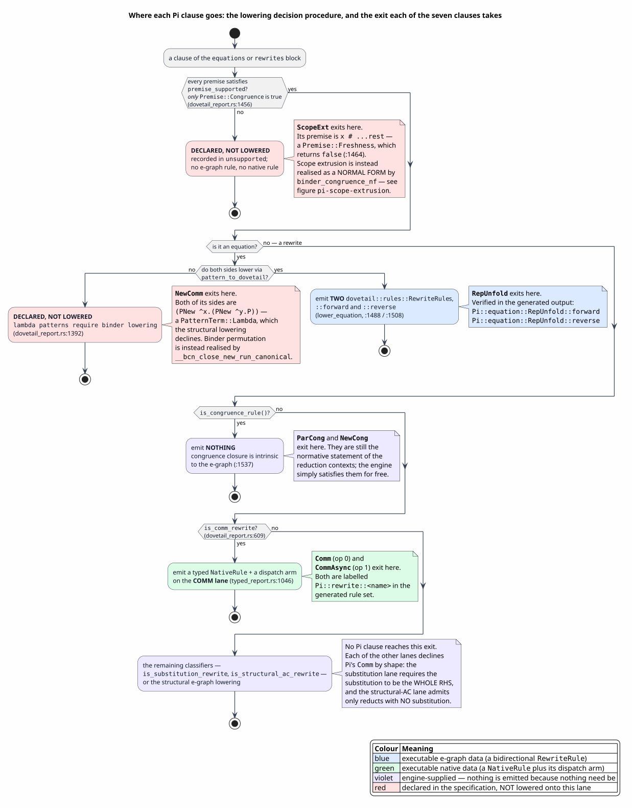
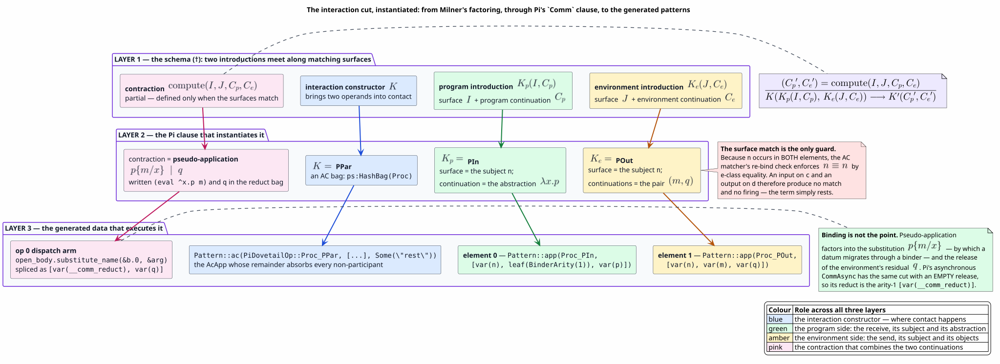
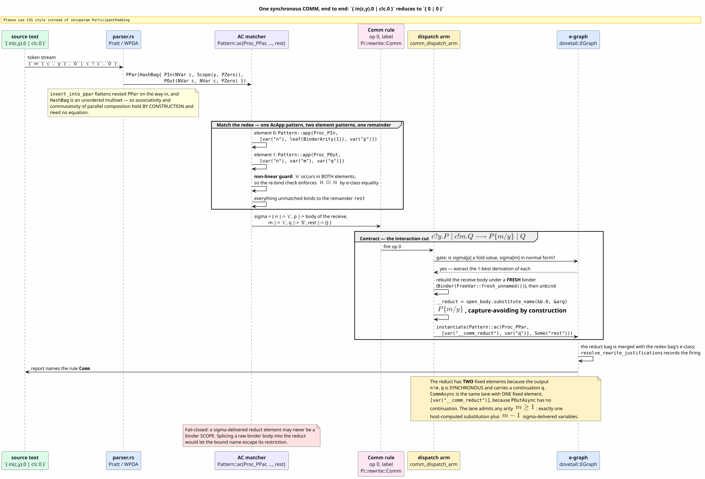
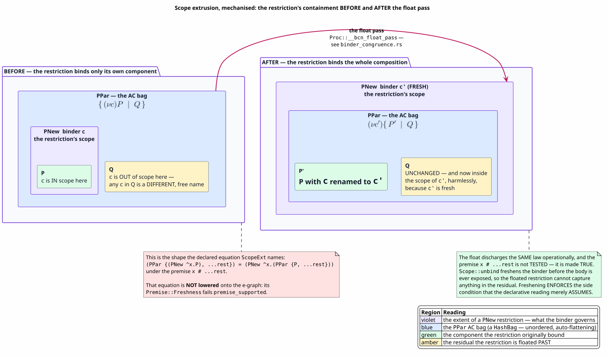
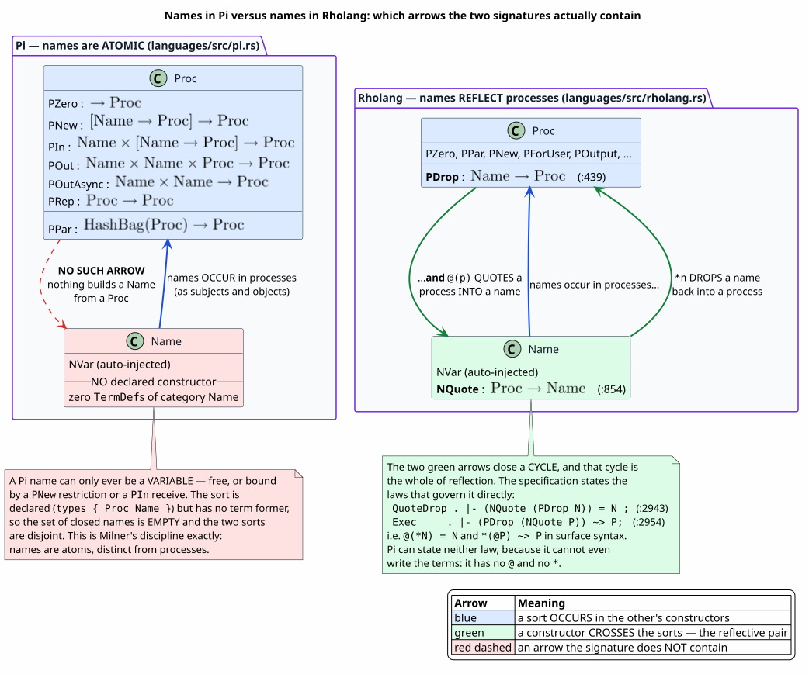

# Pi — the `language!` specification for the pi-calculus, component by component

Last updated: 2026-07-27 · part of the [Language Specification References](README.md) suite

**Subject:** `languages/src/pi.rs`
**Audience:** anyone who wants to know exactly which pi-calculus this tree implements, and how it
relates to the reflective calculus underneath Rholang
**Method:** every claim below was checked against the DSL (domain-specific language) parser, the code
generator, the *actual generated output* in `target/generated/pi/`, the conformance suite
`languages/tests/pi.rs`, and the source listing in the omnibus paper of the
GSLT (Greg's Structured Labelled Transition system); [§12](#12-provenance-where-each-claim-comes-from) gives the file-and-line
provenance for each one.

Pi is the suite's most consequential page after Rholang, for one reason: **this project's whole
substrate is a reflective descendant of this calculus.** Reading Pi tells you what the ancestor
provides; reading it *against* Rholang tells you what reflection adds. Both readings are below, and
both are anchored — [§9](#9-pi-and-the-rho-calculus-what-reflection-actually-adds) is the comparison,
and it rests on a single, checkable structural fact about the two signatures.

If you have never read a `language!` block, read [lambda.md](lambda.md) first. It covers the
constructs Pi shares with every other specification — labels, turnstiles, binders, congruence rules,
the `eval` meta-operator — at one-twelfth the scale. This page assumes them and spends its budget on
what is new here: **two sorts, an associative-commutative bag, name restriction, and communication.**

---

## Table of contents

1. [The specification under discussion](#1-the-specification-under-discussion)
2. [Which pi-calculus is this?](#2-which-pi-calculus-is-this)
3. [`name` and `options` — the identifier and the three emission switches](#3-name-and-options--the-identifier-and-the-three-emission-switches)
4. [`types { Proc Name }` — two sorts, one of them empty](#4-types--proc-name---two-sorts-one-of-them-empty)
5. [`terms { … }` — the signature and the concrete syntax](#5-terms-----the-signature-and-the-concrete-syntax)
6. [`equations { … }` — structural congruence, audited](#6-equations-----structural-congruence-audited)
7. [`rewrites { … }` — communication and its contexts](#7-rewrites-----communication-and-its-contexts)
8. [Scope extrusion, mechanised](#8-scope-extrusion-mechanised)
9. [Pi and the rho-calculus: what reflection actually adds](#9-pi-and-the-rho-calculus-what-reflection-actually-adds)
10. [The specification as a whole](#10-the-specification-as-a-whole)
11. [Executing Pi: lanes, budgets, and failing closed](#11-executing-pi-lanes-budgets-and-failing-closed)
12. [Provenance: where each claim comes from](#12-provenance-where-each-claim-comes-from)
13. [Gotchas](#13-gotchas)
14. [References](#references)

---

## 1. The specification under discussion

```rust
language! {
    name: Pi,

    options {
        emit_tests: false,
        emit_simulator: false,
        emit_blockly: false,
    },

    types { Proc  Name },

    terms {
        PZero . Proc ::= "0" ;
        PNew . ^x.p:[Name -> Proc] |- "new" "(" x "," p ")" : Proc ;
        PIn . n:Name, ^x.p:[Name -> Proc] |- "in" "(" n "," x ")" "." p : Proc ;
        POut . n:Name, m:Name, p:Proc |- n "!" m "." p : Proc ;
        POutAsync . n:Name, m:Name |- n "!" m : Proc ;
        PPar . ps:HashBag(Proc) |- "{" ps.*sep("|") "}" : Proc ;
        PRep . p:Proc |- "!" p : Proc ;
    },

    equations {
        NewComm . |- (PNew ^x.(PNew ^y.P)) = (PNew ^y.(PNew ^x.P)) ;
        ScopeExt . | x # ...rest
                 |- (PPar {(PNew ^x.P), ...rest}) = (PNew ^x.(PPar {P, ...rest})) ;
        RepUnfold . |- (PRep P) = (PPar {P, (PRep P)}) ;
    },

    rewrites {
        Comm . |- (PPar {(PIn n ^x.p), (POut n m q), ...rest})
                  ~> (PPar {(eval ^x.p m), q, ...rest}) ;

        CommAsync . |- (PPar {(PIn n cont), (POutAsync n m), ...rest})
                  ~> (PPar {(eval cont m), ...rest}) ;

        ParCong . | S ~> T |- (PPar {S, ...rest}) ~> (PPar {T, ...rest}) ;
        NewCong . | S ~> T |- (PNew ^x.S) ~> (PNew ^x.T) ;
    },
}
```

Seven term formers, three equations, four rewrite rules. The file itself is 233 lines, of which 161
are a module header recording the containment argument against the paper; the block above is the
specification.

**This block is a transcription with a documented delta.** It is rung **L11** of the GSLT omnibus
paper's conformance ladder, whose listing appears at `omnibus.tex:1965-1995`. Every clause of the
paper's version is present with the same meaning; three things are spelled differently and two
clauses are added. Each divergence is labelled *as* a divergence in the section that introduces it,
with the file and line that causes it.

### Notation used in this document

Every symbol, acronym and term used below, defined before its first use.

| Symbol / term | Meaning |
|---|---|
| $`\Sigma`$ | **signature** — the set of constructors (term formers) with their arities and sorts |
| $`E`$ | **equational theory** — a set of *undirected* equations identifying terms |
| $`R`$ | **rewrite system** — a set of *directed* reduction rules |
| $`\rightsquigarrow`$ | the one-step reduction relation, written `~>` in the DSL |
| $`\equiv`$ | **structural congruence** — the equivalence on processes generated by $`E`$ |
| $`\mid`$ | parallel composition; in this specification the constructor `PPar` |
| $`(\nu x)P`$ | **name restriction** — "there is a fresh name $`x`$, known only inside $`P`$"; here `PNew` |
| $`\overline{x}\langle y\rangle`$ | output of the name $`y`$ on the channel $`x`$ (Milner's notation); here `POut` / `POutAsync` |
| $`x(y).P`$ | input of a name, bound to $`y`$, on the channel $`x`$; here `PIn` |
| $`!P`$ | **replication** — unboundedly many copies of $`P`$; here `PRep` |
| $`P\{m/x\}`$ | capture-avoiding substitution of the name $`m`$ for free occurrences of $`x`$ in $`P`$ |
| $`\mathrm{fn}(P)`$ | the **free names** of $`P`$ — those not bound by a restriction or an input |
| **sort** / **category** | a syntactic class of terms; Pi has two, `Proc` and `Name` |
| **subject** / **object** | of a prefix: the *channel* it acts on, and the *datum* it carries |
| **AC** | **associative-commutative** — an operator for which grouping and order are immaterial |
| **AST** | **abstract syntax tree** — the parsed shape of a term, as against the text that denotes it |
| **LHS** | **left-hand side** — of a rule, the pattern that must match |
| **RHS** | **right-hand side** — of a rule, the contractum the match is replaced by |
| **BNFC** | the **Backus-Naur Form Converter**, a parser generator whose labelled-grammar production style the DSL also accepts |
| **REPL** | **read-eval-print loop** — this project's interactive front end |
| **GSLT** | Greg's Structured Labelled Transition system — the $`(\Sigma, E, R)`$ presentation MeTTaIL compiles |
| **OSLF** | Operational Semantics in Logical Form — the theory the toolchain implements ([OSLF-2017](#references)) |
| **WPDA** | weighted pushdown automaton — the machinery the generated parser is built from |
| **e-graph** | a congruence-closed union-find over terms; the Dovetail engine's core data structure |
| **e-class** | an equivalence class of terms within an e-graph |
| **saturation** | repeatedly applying every rule to an e-graph until nothing new is learned, or a budget is spent |
| $`\sigma`$ | the **substitution** a pattern match produces, binding pattern variables to matched subterms |
| **lane** | one of the generator's classifier-selected lowering paths; a clause is claimed by exactly one |
| **fail closed** | to refuse rather than to guess when a required condition cannot be established |

---

## 2. Which pi-calculus is this?

"The pi-calculus" names a family. Before anything else, here is precisely which member this
specification defines. **Every answer is a citation, not a recollection.**

| Question | Answer | Where the answer is forced |
|---|---|---|
| Monadic or polyadic? | **Monadic** | `POut . n:Name, m:Name, p:Proc` carries exactly one object; `PIn`'s `^x.p:[Name -> Proc]` binds exactly one name. The generated variant is `POut(Arc<Name>, Arc<Name>, Arc<Proc>)` — one subject, one object, one continuation |
| Synchronous or asynchronous? | **Both** — synchronous is the paper's clause, asynchronous is a declared superset extra | `POut` carries a continuation `p:Proc`; `POutAsync . n:Name, m:Name` does not. The reduct arities differ accordingly (two elements versus one) |
| Choice / summation `+`? | **Absent** | The signature has exactly seven term formers and none of them is a sum. `metadata.rs` lists `PZero`, `PNew`, `PIn`, `POut`, `POutAsync`, `PPar`, `PRep` — that is the complete `terms()` reflection |
| Replication or recursion? | **Replication** | `PRep . p:Proc \|- "!" p : Proc`, with the unfolding law `RepUnfold`. There are no process constants and no recursive definitions |
| Match / mismatch `[x=y]P`? | **Absent** | No constructor produces a conditional on name equality. Name equality is tested *only* inside the COMM rule, as the non-linear channel guard |
| Are names distinct from processes? | **Yes, strictly** | `Name` has **zero** declared constructors — see [§4](#4-types--proc-name---two-sorts-one-of-them-empty) |

**Verdict.** This is the **monadic, summation-free, match-free, replication-based pi-calculus with
synchronous output**, extended with the asynchronous output sublanguage. In the standard taxonomy it
is the core calculus of Milner, Parrow and Walker ([PI-1992-I](#references)) minus summation and
matching — the fragment Milner's later tutorial treats as the working core
([POLYADIC-1993](#references)) — restricted to arity one, and unioned with the asynchronous fragment
of Honda and Tokoro ([ASYNC-1991](#references)).

**Why those omissions are not defects.** Summation and matching are the two features whose *absence*
is best understood as a design commitment rather than an oversight:

- **Summation** is the feature that makes a calculus's structural congruence carry a second AC
  operator with its own unit, and the feature that most complicates any encoding into a
  communication-only substrate. Omitting it keeps `PPar` the *only* AC operator, which is exactly
  what lets one `HashBag` carrier discharge associativity and commutativity for the whole language
  ([§6.2](#62-what-the-hashbag-carrier-discharges-for-free)).
- **Matching** would require a name-equality test in *term* position. Pi tests name equality in
  exactly one place — the COMM rule's shared subject — and that test is discharged by the matcher's
  e-class equality check rather than by any evaluator
  ([§7.1](#71-comm--the-synchronous-interaction)). Keeping equality confined to the cut is what
  makes the rule "a rule about a site of interaction rather than about whole terms".

Replication rather than recursion is the corresponding positive commitment: `!P` is an *equation*
about a term, so it can be discharged by the same e-graph machinery as every other equation, whereas
recursive process definitions would need an environment the GSLT presentation does not have. The
price is a recursive equation, and [§11.2](#112-why-a-recursive-equation-is-safe-to-ship) is the
argument that it is safe.

---

## 3. `name` and `options` — the identifier and the three emission switches

### 3.1 `name: Pi`

**Syntax.** `name: Ident,` — a field, comma-terminated, not a block.

**Semantics.** It becomes the identifier prefix for every generated item and the string returned by
`Language::name()`, which `pi_language_resolves` pins to `"Pi"`.

| Generated item | Name for this specification |
|---|---|
| marker struct | `PiLanguage` |
| metadata implementation | `PiMetadata` |
| module path | `mettail_languages::pi::*` |
| generated op enum | `PiDovetailOp` |
| REPL backend key | `"Pi"` |
| rule labels | `Pi::equation::<name>::{forward,reverse}`, `Pi::rewrite::<name>` |

It also seeds the language fingerprint, `mettail-langdef-v1:2d40630b333d6338`, recorded in
`metadata.rs` alongside the normalised source text. The pair is the memo key for cached in-Rho
artifacts: change one character of the specification and the fingerprint changes, invalidating
exactly the artifacts that depended on it.

### 3.2 `options { … }` — three `false`s that must stay `false`

```text
options {
    emit_tests: false,
    emit_simulator: false,
    emit_blockly: false,
},
```

These are the macro's **file-writing** switches. With them off, this specification writes no
`languages/tests/gen_pi_*.rs`, no `languages/src/bin/simulate_pi.rs`, and no
`languages/src/generated/pi-*.ts`. Two independent reasons keep them off, and they are worth
separating because only one of them is about Pi:

1. **A build-integrity reason, common to any language.** `emit_simulator: true` would make the macro
   write `languages/src/bin/simulate_pi.rs` on every compile. Cargo's edition-2021 auto-discovery
   would then pick that file up as a binary target *without* the
   `required-features = ["strategies"]` gate that every hand-declared `[[bin]]` in
   `languages/Cargo.toml` carries — because the generated simulator names
   `mettail_languages::pi::strategies::arb_*`, which exists only under the `strategies` feature. A
   default `cargo build -p languages` would fail to compile a file nobody wrote.
2. **A safety reason specific to Pi.** `emit_tests: false` means no machine-written property test
   drives an *unbudgeted* saturation over the recursive `RepUnfold` equation. See
   [§11.2](#112-why-a-recursive-equation-is-safe-to-ship).

Turning these on is a change to the macro's emission contract, not a per-language preference.
Because they are off, Pi's conformance suite is **hand-written**: `languages/tests/pi.rs`, gated by
the `pi` feature, which `all-languages` — and therefore the default build — enables.

---

## 4. `types { Proc Name }` — two sorts, one of them empty

```text
types { Proc  Name },
```

**Syntax.** Whitespace-separated sort declarations. Pi uses the simplest of the three available
forms — a bare identifier, declaring a **pure algebraic sort** with no native Rust payload and no
collection carrier. (The other two forms, `![i32] as Int` and `Bag [ "{", "}", "\|" ]`, are used by
`Json` and `Calculator`; Pi needs neither.)

**Order is meaningful.** The first sort declared is the **primary** category: `metadata.rs` records
`TypeDef { name: "Proc", is_primary: true }` and `TypeDef { name: "Name", is_primary: false }`. The
primary category is what a bare `parse_term` yields and what the REPL executes.

### 4.1 The generated enums

Two Rust enums, one per sort. Reproduced from `target/generated/pi/ast_enums.rs` with paths
shortened and the auto-injected higher-order plumbing elided:

```rust
pub enum Proc {
    PZero,                                              // ← your `PZero`
    PNew(Scope<Binder<String>, Arc<Proc>>),             // ← your `PNew`
    PIn(Arc<Name>, Scope<Binder<String>, Arc<Proc>>),   // ← your `PIn`
    POut(Arc<Name>, Arc<Name>, Arc<Proc>),              // ← your `POut`
    POutAsync(Arc<Name>, Arc<Name>),                    // ← your `POutAsync`
    PPar(HashBag<Proc>),                                // ← your `PPar`
    PRep(Arc<Proc>),                                    // ← your `PRep`
    PVar(OrdVar),                                       // ← AUTO-INJECTED: the variable form
    /* LamProc, MLamProc, ApplyProc, MApplyProc,
       LamName, MLamName, ApplyName, MApplyName        // ← AUTO-INJECTED: higher-order plumbing */
}

pub enum Name {
    NVar(OrdVar),                                       // ← AUTO-INJECTED: the variable form
    /* LamProc, MLamProc, ApplyProc, MApplyProc,
       LamName, MLamName, ApplyName, MApplyName        // ← AUTO-INJECTED: higher-order plumbing */
}
```

Note the shapes: `PIn`'s subject is a *separate* field ahead of the scope, so `PIn` is a binder node
with a **pre-scope field**. That detail returns twice — once in the COMM classifier
([§7.1](#71-comm--the-synchronous-interaction)) and once in the in-Rho execution path
([§11.3](#113-the-in-rho-lane-and-its-documented-deferral)).

`PVar` and `NVar` are auto-injected: every sort that does not declare an explicit variable rule
receives one, named by taking the first letter of the sort, upper-casing it, and appending `Var`.
They carry an `OrdVar` — a nominal variable equipped with a total order so hashing and comparison
are deterministic across runs.

### 4.2 The finding: `Name` has no constructors at all

**`Name` declares seven fewer term formers than `Proc`, and in fact declares none.** This is not an
elision in this document; it is a property of the specification, and it is checkable three ways:

- the `terms` block contains no production ending in `: Name`;
- `metadata.rs` contains **zero** `TermDef` entries with `type_name: "Name"` — the seven it lists are
  all `type_name: "Proc"`;
- the generated `enum Name` contains no user variant, only `NVar` and the auto-injected higher-order
  plumbing.

The consequence is exact and worth stating carefully, because it is the fulcrum of
[§9](#9-pi-and-the-rho-calculus-what-reflection-actually-adds):

> **A Pi name can only ever be a variable** — free, or bound by a `PNew` restriction or a `PIn`
> receive. The set of *closed* (variable-free) names is empty. There is no operation anywhere in the
> signature that manufactures a name from anything else, and in particular none that manufactures a
> name from a process.

That is precisely Milner's discipline: names are atoms, drawn from an infinite set, and distinct
from processes. The specification realises it not by an axiom but by an *absence*, which is the
strongest way to realise it — a law you cannot break because you cannot write the term.

---

## 5. `terms { … }` — the signature and the concrete syntax

Every rule in `terms` is a typing judgement:

```text
Label . term_context |- concrete_syntax : Category ;
```

`|-` is the turnstile. **Everything to its left is metasyntax** — the abstract arguments and their
binding structure. **Everything to its right is object syntax** — what a programmer types. A legacy
BNFC-style alternative, `Label . Category ::= item item … ;`, is also accepted; the parser
distinguishes them by looking for `::` versus `:`. Pi uses the legacy form for exactly one rule
(`PZero`, a nullary constant) and the judgement form for the other six, mirroring `ambient.rs`.

### 5.1 `PZero . Proc ::= "0" ;` — the inactive process

The BNFC-style form: a category, `::=`, and a single literal. It generates the field-less variant
`Proc::PZero` and prints as `0`. This is $`\mathbf{0}`$, the process that does nothing.

It is worth noticing what `PZero` is *not*: it is **not** the empty `PPar` bag. The two are distinct
terms, and no law identifies them — see [§6.3](#63-the-audit-against-the-standard-laws).

### 5.2 `PNew . ^x.p:[Name -> Proc] |- "new" "(" x "," p ")" : Proc ;` — restriction

Read aloud: *"the constructor `PNew` takes one abstraction argument, binding `x` in `p`; concretely
it is written `new(⟨x⟩,⟨p⟩)`; the whole form is a `Proc`."* This is $`(\nu x)P`$.

| Fragment | Name | What it is / does |
|---|---|---|
| `PNew` | **label** | becomes the variant `Proc::PNew(…)` |
| `^` | **abstraction marker** | marks this parameter as a *binder*, not a plain subterm |
| `x` | **binder name** | the restricted name; referenceable from the syntax pattern |
| `.` | scope dot | "`x` is bound in what follows" |
| `p` | **body name** | the process living under the binder |
| `[Name -> Proc]` | **arrow type** | the binder ranges over sort `Name`; the body has sort `Proc` |
| `"new" "(" … "," … ")"` | **mixfix syntax** | literals interleaved with the two parameter references |
| `: Proc` | **result sort** | the category this production yields |

**How the binder is represented.** `PNew(Scope<Binder<String>, Arc<Proc>>)` — a single field holding
the whole scope, binder and body together. The representation is **nominal, via the moniker
library**, not de Bruijn indices and not gensym-at-parse:

- `Binder<String>` carries a `pretty_name` purely so the printer can render a readable variable; the
  binder's *identity* is not its name.
- Occurrences of the bound name inside the body are `Name::NVar(OrdVar)` values.
- `BoundTerm` is derived on both enums, so **alpha-equivalence is structural**: `new(c, 0)` and
  `new(d, 0)` are equal terms by construction. This is why the `equations` block contains no
  alpha-conversion law — there is nothing for it to do.
- Opening a scope goes through `Scope::unbind`, which **freshens** the binder. Nothing can observe
  the body under its original binder name, so capture is prevented by construction rather than by a
  side condition. [§8](#8-scope-extrusion-mechanised) shows why this matters more here than anywhere
  else in the tree.

### 5.3 `PIn . n:Name, ^x.p:[Name -> Proc] |- "in" "(" n "," x ")" "." p : Proc ;` — input

Two parameters: a plain `n:Name` (the **subject**, the channel listened on) and an abstraction
`^x.p` (the **object** position, binding the received name in the continuation). This is
$`n(x).P`$. The generated variant is `PIn(Arc<Name>, Scope<Binder<String>, Arc<Proc>>)`, and the
metadata renders its surface as `in(n,x).p`.

> ### ★ Surface delta — the input prefix is literal-led, not infix
>
> **The paper writes this clause infix:** `PIn . n:Name, ^x.p:[Name -> Proc] |- n "?" x "." p : Proc ;`
> (`omnibus.tex:1974`), i.e. `c?y.P`. This specification writes it `in(c,y).P`.
>
> **The term context and the result category — which is what the clause *is* — are the paper's
> verbatim.** Only the notation moves. The generated `TermDef` for `PIn` has exactly the fields
> `n : Name` and `^x.p : [Name -> Proc]`, in that order, yielding `Proc`.
>
> **The cause is a codegen constraint, at a specific line.** A binder rule is classified by
> `classify_binder` in `macros/src/gen/runtime/wpda_codegen/binder.rs`, which returns `None` — declining
> to treat the rule as a binder at all — unless position 0 of its syntax pattern is a literal, a
> token-kind capture, or a guest body:
>
> ```rust
> if !matches!(
>     &sp[0],
>     SyntaxExpr::Literal(_) | SyntaxExpr::TokenKind { .. } | SyntaxExpr::GuestBody { .. }
> ) {
>     return None;
> }
> ```
>
> An infix-led rule that *also* opens a binder therefore falls through to the Pratt infix/prefix
> path, which has no binder machinery. Every binder rule in the tree is literal-led for this reason
> — `ambient.rs`'s `"new" "(" x "," p ")"`, `lambda.rs`'s `"lam " x "." body`. The literal-led
> spelling chosen here mirrors the omnibus's *own* Ambient listing, which writes
> `PIn . Proc ::= "in(" Name "," Proc ")"` at `omnibus.tex:2028`.
>
> **The delta is in the surface only.** Note carefully that infix-led rules parse perfectly well in
> general: `POut`'s `n "!" m "." p` is infix-led and is the paper's own spelling, pinned by
> `pi_output_prefix_parses`. It is the *conjunction* of infix-led and binder-opening that is
> unsupported.

### 5.4 `POut` and `POutAsync` — synchronous and asynchronous output

```text
POut . n:Name, m:Name, p:Proc |- n "!" m "." p : Proc ;
POutAsync . n:Name, m:Name |- n "!" m : Proc ;
```

`POut` is $`\overline{n}\langle m\rangle.P`$ — subject `n`, object `m`, and a **continuation** `p`
that runs once the send completes. That continuation is what makes the output *synchronous*: the
sender is blocked in the sense that its continuation is not available until the interaction happens.

**`POutAsync` is a declared superset clause,** flagged as such in the source with a `➕` marker. It
is $`\overline{n}\langle m\rangle`$ with no continuation — the output of the asynchronous
pi-calculus ([ASYNC-1991](#references), [BOUDOL-1992](#references)), in which a send is a free-floating
message rather than a blocking act. It is retained deliberately: asynchronous pi is a calculus in
its own right, and a conformance specification is permitted to be a superset of the paper's listing.

> ### The `!` overload, and why it is unambiguous
>
> Three rules mention `!`: `POut` (`n "!" m "." p`), `POutAsync` (`n "!" m`), and `PRep` (`"!" p`).
> They are resolved **by position and category**, which the generated tables show directly:
>
> | Table | Entry for `!` | Selects |
> |---|---|---|
> | `Proc` prefix dispatch | the pair `(0u16, 6u16)` — category `Proc`, rule 6 | **`PRep`** |
> | `infix_bp_name("!")` | `[(4, 5, 0, 4)]` — left bp 4, right bp 5, yields `Proc`, rule 4 | **`POutAsync`** |
> | `mixfix_bp_name("!")` | `[(2, 0, 3)]` — left bp 2, yields `Proc`, rule 3 | **`POut`** |
>
> (`WPDA_CATEGORIES` is `["Proc", "Name"]`, so source index 0 is `Proc` and 1 is `Name`; the `Proc`
> rule indices run `PZero` 0, `PNew` 1, `PIn` 2, `POut` 3, `POutAsync` 4, `PPar` 5, `PRep` 6.)
>
> The `Proc` category declares **no** infix, postfix or mixfix entry for `!` whatsoever — those three
> tables are empty. So a `!` in leading position within a process slot can only be `PRep`, and a `!`
> following a parsed `Name` can only continue an output.
>
> The remaining question is `POut` versus `POutAsync`, and here the honest answer is that **the
> parser does not decide at the `!` at all.** `POutAsync`'s syntax is a proper prefix of `POut`'s:
> the two agree on `n ! m` and diverge only afterwards. No binding power can separate them at that
> token, so both entries stay live and the *input* decides — a following `.` and process completes
> `POut`, and the operand simply ending completes `POutAsync`. Both outcomes are test-pinned:
> `pi_output_prefix_parses` on `c!c.0` and `pi_comm_async_fires` on `{ in(c,y).0 | c!c }`.
>
> This is the house rule visible in miniature: never disambiguate early. Adding a superset clause
> introduced a genuine local ambiguity, and the WPDA absorbed it by exploration rather than by a
> precedence hack.


*Figure 1. `!` is dispatched by position and category, and the `POut` / `POutAsync` split is
deliberately left undecided until the input settles it. Source:
[figures/pi-bang-dispatch.puml](figures/pi-bang-dispatch.puml).*

### 5.5 `PPar . ps:HashBag(Proc) |- "{" ps.*sep("|") "}" : Proc ;` — parallel composition

This is the specification's structural heart, and the clause that most repays close reading.

| Fragment | Name | What it is / does |
|---|---|---|
| `ps` | parameter name | the collection of parallel components |
| `HashBag(Proc)` | **collection carrier** | a *multiset* of `Proc` — unordered, duplicates counted |
| `"{"`, `"}"` | delimiters | the literal braces around the composition |
| `ps.*sep("\|")` | **separator metapattern** | render/parse the collection's members separated by `\|` |

`.*sep(…)` is a **pattern operation** — a method-chain form on a collection parameter, parsed by
`parse_pattern_op` after the `.` and `*` tokens, and generating the grammar
`(<elem> "sep")* <elem>?`. It is the one piece of Pi's surface syntax that is not a plain literal or
parameter reference.

The generated variant is `PPar(HashBag<Proc>)`. Two consequences follow *by construction*, and
[§6.2](#62-what-the-hashbag-carrier-discharges-for-free) collects them.

**How it prints.** The generated `Display` writes `{`, then the members joined by `" | "`, then `}` —
but first it **sorts** the rendered members. Sorting is what gives an unordered multiset a stable
printed form, and it is what makes `pi_paper_program_round_trips` (parse, print, re-parse, compare)
a meaningful test rather than a coin flip. Members whose own rendering contains a bare `|` are
parenthesised by `group_if_bare_delims` so the separator cannot be misread.

### 5.6 `PRep . p:Proc |- "!" p : Proc ;` — replication

A prefix rule generating `PRep(Arc<Proc>)`, printed `!p`. It is $`!P`$: unboundedly many parallel
copies of $`P`$. Its meaning is supplied entirely by the `RepUnfold` equation
([§6.1](#61-the-three-declared-equations)) — the constructor itself is inert.

---

## 6. `equations { … }` — structural congruence, audited

**Syntax.** `Name . type_context | premises |- lhs_pattern = rhs_pattern ;` — both contexts optional.
The distinguishing operator is `=` (undirected), against `~>` (directed) in `rewrites`.

**Semantics.** An equation asserts that two terms are interchangeable. The lowering emits **two**
Dovetail rewrite rules per equation — `Pi::equation::<name>::forward` and `…::reverse` — so the
e-graph merges the two e-classes in both directions.

> **Critical, and the most common misreading of the whole file:** equation and rewrite patterns are
> written in **abstract syntax**, as prefix S-expressions
> $`(\mathrm{Constructor}\ \mathit{arg}_1\ \mathit{arg}_2\ \ldots)`$, *never* in the concrete syntax
> declared by `terms`. `(PPar {P, (PRep P)})` is the abstract syntax tree; the text a programmer
> types for it is `{ P | !P }`.

### 6.1 The three declared equations

```text
NewComm . |- (PNew ^x.(PNew ^y.P)) = (PNew ^y.(PNew ^x.P)) ;
ScopeExt . | x # ...rest
         |- (PPar {(PNew ^x.P), ...rest}) = (PNew ^x.(PPar {P, ...rest})) ;
RepUnfold . |- (PRep P) = (PPar {P, (PRep P)}) ;
```

**`NewComm`** — restrictions commute:

```math
(\nu x)(\nu y)P \;\equiv\; (\nu y)(\nu x)P
```

**`ScopeExt`** — scope extrusion, the defining move of the pi-calculus:

```math
\{\,(\nu x)P \;\mid\; \mathit{rest}\,\} \;\equiv\; (\nu x)\{\,P \;\mid\; \mathit{rest}\,\}
\qquad\text{provided } x \notin \mathrm{fn}(\mathit{rest})
```

The proviso is written `x # ...rest` — a **freshness premise**, where `#` is the freshness operator
and `...rest` denotes the AC bag's remainder. Read it as "`x` does not occur free in anything the
restriction is being floated past".

**`RepUnfold`** — replication unfolds:

```math
!P \;\equiv\; P \;\mid\; !P
```

### 6.2 What the `HashBag` carrier discharges for free

Two of the standard structural laws are *never declared* because the carrier already provides them.
This is the payoff of choosing a multiset rather than a binary operator:

| Law | How it holds | Evidence |
|---|---|---|
| $`P \mid Q \equiv Q \mid P`$ (commutativity) | `HashBag` is an unordered multiset keyed by element counts; equality is count-based and order-independent | `runtime/src/hashbag.rs` |
| $`(P \mid Q) \mid R \equiv P \mid (Q \mid R)`$ (associativity) | the generated `insert_into_ppar` **auto-flattens**: inserting a `PPar` peels it and pushes its members back onto the work stack, so nested compositions collapse into one flat bag on the way in | `target/generated/pi/flatten.rs` |

The paper makes the same observation about its own listing: "$`K`$ is `PPar`, whose `HashBag` carrier
makes it associative–commutative".

The flattening is iterative over an explicit work stack rather than recursive, so a deeply nested
composition cannot overflow the stack while being normalised.

### 6.3 The audit against the standard laws

Here is the complete standard structural congruence for the monadic pi-calculus, as presented in
Milner's tutorial and in Sangiorgi and Walker ([POLYADIC-1993](#references),
[SW-2001](#references)), checked one law at a time against this specification. **An absent law is a
finding, not an omission from this page.**

| # | Standard law | Status here | Mechanism, or the reason for absence |
|---|---|---|---|
| 1 | $`P \equiv Q`$ if $`P`$, $`Q`$ are alpha-equivalent | **Held, structurally** | `BoundTerm` derived on both enums; alpha-equivalence is term identity, so no axiom is needed |
| 2 | $`P \mid Q \equiv Q \mid P`$ | **Held, by the carrier** | `HashBag` is unordered |
| 3 | $`(P \mid Q) \mid R \equiv P \mid (Q \mid R)`$ | **Held, by the carrier** | `insert_into_ppar` auto-flattens |
| 4 | $`P \mid \mathbf{0} \equiv P`$ | **★ ABSENT** | No equation declares it, and no generated pass removes a `PZero` from a bag. `PZero` is a constructor, not the empty bag; the generated `normalize.rs` mentions `PZero` only in an identity arm |
| 5 | $`(\nu x)(\nu y)P \equiv (\nu y)(\nu x)P`$ | **Declared, not lowered; realised as a normal form** | `NewComm`; see [§6.4](#64-two-declared-equations-are-not-lowered) and [§8.3](#83-newcomm-as-a-canonical-representative) |
| 6 | $`(\nu x)(P \mid Q) \equiv P \mid (\nu x)Q`$, $`x \notin \mathrm{fn}(P)`$ | **Declared, not lowered; realised as a normal form** | `ScopeExt`; see [§8](#8-scope-extrusion-mechanised) |
| 7 | $`(\nu x)\mathbf{0} \equiv \mathbf{0}`$ | **★ ABSENT** | Not declared. A restriction over an inactive process is not garbage-collected |
| 8 | $`!P \equiv P \mid !P`$ | **Held, and lowered** | `RepUnfold`, the only equation that becomes executable e-graph data |
| 9 | $`!\mathbf{0} \equiv \mathbf{0}`$ | **★ ABSENT** | Not declared. It is derivable from laws 4 and 8 only in the presence of law 4, which is itself absent |
| 10 | $`P + Q \equiv Q + P`$, $`P + \mathbf{0} \equiv P`$ | **Vacuous** | There is no summation operator, so these laws have no instances |

**The three absent laws are exactly the "Zero" laws**: $`P \mid \mathbf{0} \equiv P`$,
$`(\nu x)\mathbf{0} \equiv \mathbf{0}`$, and $`!\mathbf{0} \equiv \mathbf{0}`$. The specification
inherits AC from its carrier but no *units* and no garbage collection.

**What that costs, stated precisely.** Reduction is unaffected — no rule in `rewrites` requires a
unit law to fire, and the `Comm` rule's `...rest` remainder absorbs residual `PZero`s harmlessly. What
is affected is *equality*: `{ 0 | 0 }`, `{ 0 }` and `0` are three distinct terms in this theory. Any
future work that compares processes up to structural congruence — a bisimulation checker, a
normal-form-based cache key, an observational-equivalence test — would need laws 4, 7 and 9 added
first. Adding them is not free: law 4 in particular is a *collapsing* equation on an AC bag, and its
reverse direction ($`P \equiv P \mid \mathbf{0}`$) can insert unboundedly many units during
saturation, so it would need the same budget analysis
[§11.2](#112-why-a-recursive-equation-is-safe-to-ship) gives `RepUnfold`.

A useful cross-check: the sibling `ambient.rs` specification, whose structural congruence is aligned
clause-by-clause with Cardelli and Gordon ([MOBILE-AMBIENTS-1998](#references)), declares `NewComm`
and `ScopeExtrusion` in exactly the same shape and *also* omits the Zero laws. The omission is a
house pattern, not a Pi-specific slip.

### 6.4 Two declared equations are not lowered

This is the page's most important structural finding, and it is verifiable from the generated output
in one command's worth of evidence. The Dovetail rule set generated for Pi contains exactly four
labelled rules:

```text
Pi::equation::RepUnfold::forward
Pi::equation::RepUnfold::reverse
Pi::rewrite::Comm
Pi::rewrite::CommAsync
```

`NewComm` and `ScopeExt` are **absent**. Each is declined by a different gate, and neither gate is
arbitrary:

- **`ScopeExt` is declined at the premise gate.** `lower_equation` begins with
  `if !eq.premises.iter().all(premise_supported) { … return }`. `premise_supported` is exhaustive
  over every premise variant with no catch-all, and accepts *only* `Premise::Congruence`;
  `Premise::Freshness` returns `false`. The rationale is sound: a freshness side condition demands
  evidence — that a name does not occur free in a term — which structural saturation does not model.
  Guessing would be unsound, so the gate fails closed.
- **`NewComm` is declined at the pattern gate.** Both of its sides are `PatternTerm::Lambda` nodes
  (`^x.…`), and `pattern_to_dovetail` returns
  `Err("lambda patterns require binder lowering")` for those. An e-graph node has no notion of a
  binder to open, so a pattern that must open one cannot be lowered structurally.

**Neither law is thereby lost.** Both are delivered operationally, by a different mechanism, and
[§8](#8-scope-extrusion-mechanised) is that mechanism. But the two facts must be held together, and
the second one carries a caveat:

> ⚠ **The non-lowering is silent on Pi's path.** On the untyped lowering path the collected
> `unsupported` list is compiled into a runtime check that returns an explicit
> "needs specialized lowering before structural saturation can be complete" error. Pi does **not**
> take that path: because it has a COMM rewrite, `needs_typed_dovetail_path` routes it to the typed
> report generator, which binds the list as `_unsupported` and drops it. So on Pi's actual path
> there is no diagnostic naming `NewComm` and `ScopeExt` as unlowered. The evidence for this section
> is the generated rule set itself, which is why this page cites that rather than a message.



*Figure 2. The lowering decision procedure, with the exit each of Pi's seven clauses takes. Two
equations reach the red terminal — declared, not lowered. Source:
[figures/pi-clause-routing.puml](figures/pi-clause-routing.puml).*

---

## 7. `rewrites { … }` — communication and its contexts

**Syntax.** `Name . type_context | premises |- lhs_pattern ~> rhs_pattern ;`. The abbreviations Pi
uses are worth spelling out, since one bar changes the reading:

| Written | Means |
|---|---|
| `Comm . \|- …` | `\|-` immediately after the dot: **both** the type context and the premise list are empty — an unconditional rule |
| `ParCong . \| S ~> T \|- …` | nothing before the `\|`: an empty *type* context, with `S ~> T` as the single premise |

### 7.1 `Comm` — the synchronous interaction

```text
Comm . |- (PPar {(PIn n ^x.p), (POut n m q), ...rest})
          ~> (PPar {(eval ^x.p m), q, ...rest}) ;
```

```math
n(x).P \;\mid\; \overline{n}\langle m\rangle.Q \;\longrightarrow\; P\{m/x\} \;\mid\; Q
```

| Fragment | What it is / does |
|---|---|
| `(PPar { … })` | the LHS matches an AC bag — not a fixed pair, a *multiset* |
| `(PIn n ^x.p)` | an input element: subject bound to `n`, the abstraction destructured as `^x.p` |
| `(POut n m q)` | an output element: subject bound to `n` **again**, object `m`, continuation `q` |
| `...rest` | the **remainder** — every bag member that is not one of the two participants |
| `(eval ^x.p m)` | the contractum $`P\{m/x\}`$ — `eval` is the reserved substitution meta-operator |
| `q` | the output's continuation, released into the reduct |

**The channel condition is expressed by re-use, not by a test.** `n` appears in *both* elements of
the LHS. A pattern variable that occurs twice must bind the same thing both times, so the rule fires
only when subject equals subject. This is a **non-linear pattern**, and it is what
`comm_unique_shared_var` identifies: the unique variable appearing exactly once in every element.
The classifier rejects a rule with zero or two-or-more shared variables as an ambiguous guard.

`pi_comm_does_not_fire_on_mismatched_channels` pins the negative case: on
`{ in(c,y).0 | d!d.0 }` the rule does not fire, and the term simply rests.

**`eval` is the substitution meta-operator**, not a constructor you declared and not a user-visible
function. The paper spells the same operator `subst` (`omnibus.tex:1989`) while elsewhere calling it
"substitution by `eval`"; the live macro special-cases the identifier `eval` exactly, in
`ast/src/language/parse.rs`, lowering `(eval ^x.p m)` to
`PatternTerm::Subst { term: p, var: x, replacement: m }`. `subst` has no special case and would be
rejected as an unknown constructor. **This is a keyword delta, not a semantic one.**

#### The theory this rule instantiates

The paper factors every reduction of this shape into an **interaction cut**, written $`(\dagger)`$:

```math
\frac{(C_p', C_e') = \mathrm{compute}(I, J, C_p, C_e)}
     {K\bigl(K_p(I, C_p),\, K_e(J, C_e)\bigr) \;\longrightarrow\; K'\bigl(C_p', C_e'\bigr)}
```

with $`K`$ the **interaction constructor** that brings two operands into contact, $`K_p`$ and
$`K_e`$ two **introductions** each separating an **interaction surface** ($`I`$, $`J`$ — the part
that must match) from a **continuation**, and $`\mathrm{compute}`$ a partial **contraction** that
combines the continuations on a surface match. The factoring is Milner's.

Pi's `Comm` instantiates it exactly: $`K = \texttt{PPar}`$; the introductions are `PIn` and `POut`;
the surfaces are the subjects $`n`$, matched by name equality; the continuations are
$`\lambda x.p`$ and the pair $`(m, q)`$; and the contraction is Milner's **pseudo-application**,
returning $`p\{m/x\} \mid q`$.



*Figure 3. The schema, the Pi clause that instantiates it, and the generated patterns that execute
it, aligned role by role. Source:
[figures/pi-interaction-cut.puml](figures/pi-interaction-cut.puml).*

#### How the generated matcher works

The rule is claimed by the **COMM lane** — `is_comm_rewrite` — which fails closed on every shape but
this one. The lane emits a `NativeRule` (a matching pattern plus an operation id) and a dispatch arm
(the code that computes the contractum). The generated pattern for `Comm`, from
`target/generated/pi/dovetail_report.rs`:

```rust
NativeRule {
    lhs: Pattern::ac(
        PiDovetailOp::Proc_PPar,
        vec![
            Pattern::app(PiDovetailOp::Proc_PIn, vec![
                Pattern::var("n"),
                Pattern::leaf(PiDovetailOp::BinderArity(1u32)),
                Pattern::var("p"),
            ]),
            Pattern::app(PiDovetailOp::Proc_POut, vec![
                Pattern::var("n"),
                Pattern::var("m"),
                Pattern::var("q"),
            ]),
        ],
        Some("rest".to_string()),
    ),
    op: 0u32,
    label: Some("Pi::rewrite::Comm".to_string()),
}
```

Three things to read off it. First, `Pattern::ac` with a `Some("rest")` remainder is what makes the
rule match a *site* inside an arbitrary composition rather than a whole term. Second, `var("n")`
appears in both element patterns — the matcher's re-bind check is the channel guard. Third, the
`PIn` element is `[var("n"), leaf(BinderArity(1)), var("p")]`: the explicit abstraction `^x.p` in the
source lowers to a binder-arity marker followed by the *body*, which is the same element pattern a
bare scope variable would produce. That equivalence is why the paper's explicit spelling and
Rholang's bare-variable spelling both classify.

Now the algorithm, in literate form. The whole firing is five steps; the top-level chunk names them,
and each is then refined in turn.

**Algorithm 1 (Fire a COMM redex).**

```pseudocode
⟨Fire a COMM redex⟩ ≡
    ⟨1. Bind and gate the operand classes⟩
    ⟨2. Extract the best derivation of each operand⟩
    ⟨3. Rebuild the receive body under a FRESH binder⟩
    ⟨4. Compute the contractum by capture-avoiding substitution⟩
    ⟨5. Splice the reduct bag and return its e-class⟩
```

The arm runs only after the matcher has succeeded, so it may assume the shape it was compiled for:
an AC bag containing an input and an output on a common subject. Its whole obligation is to build the
contractum and hand back an e-class. The five refinements follow.

**Algorithm 1.1 (Bind and gate the operand classes).**

```pseudocode
c_class ← σ["p"]                                        // the receive continuation
if not is_fold_value(c_class)    then return None
q_class ← σ["m"]                                        // the transmitted name
if not has_normal_form(q_class)  then return None
```

The AC match has already produced $`\sigma`$, binding `n`, `p`, `m`, `q` and `rest`. Before doing any
work the arm checks that the two operands it will consume are ready — the continuation's class is a
value, and the object's class has a normal form. Returning `None` means "not now", so a firing is
never attempted on an unsettled operand.

**Algorithm 1.2 (Extract the best derivation of each operand).**

```pseudocode
(cont_derivation, object_derivation) ←
    with extractor E over the e-graph:
        (E.best(find(c_class)), E.best(find(q_class)))
```

An e-class holds many equivalent terms, and the arm needs one representative of each. Both
extractions share a single extractor scope, so the extractor is built once and dropped before the arm
continues — the cost of an extractor is in its construction, not its queries.

**Algorithm 1.3 (Rebuild the receive body under a FRESH binder).**

```pseudocode
body    ← reconstruct_Proc(cont_derivation)
binder  ← Binder(FreeVar::fresh_unnamed())              // NOT the rule's `x`
scope   ← Scope::from_parts_unsafe(binder, body)
(b, open_body) ← scope.unbind()                         // freshens on the way out
```

This is the capture-avoidance step, and it is the reason the pattern's binder name is irrelevant. The
arm does not reuse the name `x` written in the rule; it mints a brand-new binder, closes the
reconstructed body under it, and immediately re-opens it. Whatever names occur free in the
transmitted object, none of them can collide with a binder that was invented after they were.

**Algorithm 1.4 (Compute the contractum by capture-avoiding substitution).**

```pseudocode
arg    ← reconstruct_Name(object_derivation)
reduct ← open_body.substitute_name(&b.0, &arg)          // = P{m/x}
```

The object is reconstructed as a `Name`, and the substitution is the generated, sort-directed one —
replacing a free *name* variable by a *name*, which is precisely what name-passing means. The
generated signature is `Proc::substitute_name(&FreeVar<String>, &Name) -> Proc`.

**Algorithm 1.5 (Splice the reduct bag and return its e-class).**

```pseudocode
σ' ← σ ∪ { "__comm_reduct" ↦ lower(reduct) }
return instantiate(
    Pattern::ac(Proc_PPar, [var("__comm_reduct"), var("q")], Some("rest")),
    σ')
```

The contractum is lowered into the e-graph under the reserved name `__comm_reduct`, and the reduct is
instantiated as an AC bag over the *same* operator and the *same* remainder — so the residual
composition survives the interaction untouched. Instantiating an AC pattern flattens the remainder
bag into the result, so the outcome is one flat canonical bag rather than a nested one.

That two-element reduct is `Comm`'s signature: **the substituted receive continuation *and* the
output's own continuation `q`**, whose parallel composition is exactly $`P\{m/x\} \mid Q`$. The lane
admits any reduct arity $`m \geq 1`$ — exactly one host-computed substitution plus $`m-1`$
$`\sigma`$-delivered variables.



*Figure 4. The handshake for `{ in(c,y).0 | c!c.0 }`: parse, AC match with the non-linear channel
guard, the five-step contraction, and the merge that records the firing. Source:
[figures/pi-comm-handshake.puml](figures/pi-comm-handshake.puml).*

#### The one genuinely semantic side condition

The classifier enforces a condition that is not about shape at all:

> A $`\sigma`$-delivered reduct element may **never** be a binder scope.

If a reduct element that the match delivers verbatim were the last argument of a binder constructor,
splicing it into the reduct would lift a binder *body* out from under its binder — and the bound name
would escape. `is_comm_rewrite` collects the scope variables of every binder element and rejects the
rule if any reduct variable is among them. It fails closed: an ill-formed rule is refused at compile
time rather than mis-firing at run time.

#### Historical note: why this clause once could not fire

The synchronous `Comm` was, for a period, declared but non-firing — recorded in the source as delta
**D10**, now closed. The COMM lane had been written for Rholang, whose output is *asynchronous*, and
carried two incidental restrictions: the reduct had to have exactly one element besides the
remainder, and every element argument had to be a bare variable. The paper's synchronous output
violates the first (its reduct has two: the substituted continuation and `q`) and its explicit
`^x.p` violates the second.

Neither restriction was semantic. The reduct bag *is* the AC parallel operator the LHS matched over,
so an $`m`$-element reduct simply denotes an $`m`$-fold parallel composition; and `^x.p` lowers to
the same element pattern a bare scope variable does. The lane now admits both, and
`pi_comm_fires_verbatim` asserts that saturating the omnibus's own redex `{ in(c,y).0 | c!c.0 }`
reports the rule **`Comm`** by name — not the asynchronous variant, which a substring test could not
have distinguished.

### 7.2 `CommAsync` — the asynchronous interaction

```text
CommAsync . |- (PPar {(PIn n cont), (POutAsync n m), ...rest})
          ~> (PPar {(eval cont m), ...rest}) ;
```

The same interaction cut with an **empty release**: `POutAsync` has no continuation, so the reduct is
the arity-one bag `[var("__comm_reduct")]`. It is generated as op 1, labelled
`Pi::rewrite::CommAsync`, and pinned by `pi_comm_async_fires`.

Note also the *spelling* difference: the receive's scope is written as the bare variable `cont`
rather than the explicit `^x.p`. Both spellings produce the same element pattern — compare the two
generated `NativeRule`s, which differ only in the body variable's name and in the output
constructor. This is the clearest available demonstration that the abstraction spelling is
notational.

### 7.3 `ParCong` and `NewCong` — the reduction contexts

```text
ParCong . | S ~> T |- (PPar {S, ...rest}) ~> (PPar {T, ...rest}) ;
NewCong . | S ~> T |- (PNew ^x.S) ~> (PNew ^x.T) ;
```

```math
\frac{S \rightsquigarrow T}{\{\,S \mid \mathit{rest}\,\} \rightsquigarrow \{\,T \mid \mathit{rest}\,\}}
\qquad\qquad
\frac{S \rightsquigarrow T}{(\nu x)S \rightsquigarrow (\nu x)T}
```

These are **conditional** rewrites: the text between `|` and `|-` is a `Premise::Congruence`. They
define where a redex may be contracted — inside a parallel composition, and under a restriction —
which together make `~>` closed under the two constructors that build process contexts.

`lower_rewrite` emits **nothing** for a congruence rule, and this is not a gap: congruence closure is
intrinsic to an e-graph, since equal children give equal parents by construction. Re-encoding these
would be redundant work.

They remain worth writing. They are the human- and proof-readable statement of *which relation this
language defines*, they are what `metadata.rs` reflects (`conditions: &["S ~> T"]`,
`premise: Some(("S", "T"))`), and swapping them is how one would change the reduction strategy. The
conformance suite asserts on their presence and premised-ness directly.

**What is not closed.** There is no congruence rule for `PIn`, `POut` or `PRep` — and there should not
be. In the pi-calculus reduction does not proceed underneath a prefix: a process guarded by an input
or output is *blocked* until that prefix is consumed. The absence of `InCong` and `OutCong` is
therefore a positive statement about the calculus, matching the standard reduction relation exactly.
Likewise the absence of a congruence under `PRep` keeps replication inert until `RepUnfold` exposes a
copy.

---

## 8. Scope extrusion, mechanised

Scope extrusion is the pi-calculus's signature move: a restricted name may be communicated outside
the scope that created it, and the scope *expands* to cover the recipient rather than the name
escaping. It is also the law this specification declares but does not lower
([§6.4](#64-two-declared-equations-are-not-lowered)), so the question "where does extrusion actually
happen?" has a real answer that is not the equation.

### 8.1 The float pass

The answer is `binder_congruence.rs`, a generated module Pi receives because
`should_emit_binder_congruence` holds for it: its `equations` block is non-empty, it has no
host-backed guard obligation, and `PNew` is a surface single-binder over the primary category.

The module implements a **directed normal form**: float every restriction outward to a fixpoint.

**Algorithm 2 (Binder-congruence normal form).**

```pseudocode
⟨Binder-congruence normal form of P⟩ ≡
    current ← ⟨one bottom-up float pass over P⟩
    repeat
        next ← ⟨one bottom-up float pass over current⟩
        if next ≡ current  (up to alpha)  then stop
        current ← next
    until fuel exhausted
    return current
```

The fixpoint loop compares successive passes with `BoundTerm::term_eq` — alpha-equivalence, not
syntactic equality, which matters because every pass freshens the binders it touches and a
syntactic test would therefore never converge. The explicit fuel counter guarantees termination
whether or not the term converges, so a pathological input costs a bounded amount of work rather
than hanging.

**Algorithm 2.1 (One bottom-up float pass).**

```pseudocode
⟨one bottom-up float pass over a node⟩ ≡
    case PNew(scope):
        (binder, body) ← scope.unbind()              // FRESHENS the binder
        collect the maximal RUN of nested PNew binders under body
        return ⟨close the run canonically⟩

    case POut(subject, object, continuation):
        body ← normalise(continuation)
        if body is PNew(s):                          // float OUT of the prefix
            (b, opened) ← s.unbind()
            return PNew(Scope(b, POut(subject, object, opened)))
        return POut(subject, object, body)

    case PPar(bag):
        normalise every member
        if some member is PNew(s):                   // ★ THE EXTRUSION STEP
            (b, opened) ← s.unbind()
            return PNew(Scope(b, PPar(opened ∪ the residual members)))
        return PPar(normalised members)

    otherwise: rebuild the node from its normalised children
```

The pass is bottom-up: normalise the children first, then float at this node. Working upward means a
restriction buried at any depth is lifted one level per pass, and the fixpoint loop repeats until no
level remains to lift. The `PNew` case additionally gathers a *run* of adjacent restrictions so that
[§8.3](#83-newcomm-as-a-canonical-representative) can order them canonically in one place.

The `PPar` case is `ScopeExt` read left to right: a restriction sitting *inside* the bag is lifted to
sit *outside* it, with the residual members brought under the new scope.

### 8.2 Why the freshness premise is not needed operationally

The declared equation carries the proviso $`x \notin \mathrm{fn}(\mathit{rest})`$, and the float pass
never tests it. That is not an oversight, and the reason is the single most useful thing to
understand about binders in this tree:

> `Scope::unbind` **freshens** the binder before the body is ever exposed. The floated restriction
> therefore binds a name that provably occurs nowhere else, so it cannot capture anything in the
> residual. **Freshening enforces the side condition that the declarative reading merely assumes.**

A declarative equation must *state* the proviso because it quantifies over all instances, including
the bad ones. An operational pass can *establish* it. This is why the pass is sound without a
freshness check, and why the unlowered equation is not a hole in the semantics — it is the same law,
discharged by construction rather than by hypothesis.



*Figure 5. What the restriction governs before and after the float, and why the residual is
unharmed by being brought inside the new scope. Source:
[figures/pi-scope-extrusion.puml](figures/pi-scope-extrusion.puml).*

### 8.3 `NewComm` as a canonical representative

The same module also discharges `NewComm`. Having floated a *run* of restrictions to the top, the
pass must choose an order in which to re-close them, and it chooses **canonically**:
`__bcn_close_new_run_canonical` enumerates the permutations of the binder run using Heap's algorithm,
closes the core under each, hashes each closure with the framed semantic-key hasher, and keeps the
permutation with the **least key**.

Since $`(\nu x)(\nu y)P`$ and $`(\nu y)(\nu x)P`$ have the same binder run and the same core, they
normalise to the same closure — which is exactly the content of `NewComm`, realised as a canonical
representative rather than as a symmetric merge.

> ⚠ **The canonicalisation is capped.** The permutation search runs only for runs of length
> $`2 \le n \le 6`$; for $`n > 6`$ the pass short-circuits and closes the run in the order it found
> it. The cap is a cost control — $`n!`$ closures each requiring a semantic hash — but it means
> **binder permutation is not canonicalised beyond six consecutive restrictions**. Two terms
> differing only by a permutation of seven or more adjacent binders will not be identified.

### 8.4 Where the float actually runs

Precision matters here, because the float is *not* part of the Dovetail saturation on Pi's path.
`binder_congruence_nf_term` is invoked from exactly two generated places for Pi:

| Call site | Role |
|---|---|
| `target/generated/pi/language_trait_impl.rs`, in `try_direct_eval` | the language's direct-evaluation step: it returns `Some(progressed)` iff the float made observable progress, and `None` otherwise, preserving the fail-closed seam |
| `target/generated/pi/rho_net_invocation.rs` | boundary canonicalisation before the in-Rho reflection |

The untyped Dovetail path *does* float before lowering, but Pi does not take the untyped path — it is
routed typed by `needs_typed_dovetail_path` because it has a COMM rewrite. So: **extrusion is a
direct-eval and boundary normalisation for Pi, not an in-saturation rewrite.** This is a genuine
architectural seam and is recorded as such rather than smoothed over.

---

## 9. Pi and the rho-calculus: what reflection actually adds

This is the section the page exists for. The comparison is often made loosely; it can be made
exactly, because the difference between the two calculi is visible as **the presence or absence of
two arrows in a signature.**

### 9.1 The structural fact

| | `Pi` (`languages/src/pi.rs`) | `Rholang` (`languages/src/rholang.rs`) |
|---|---|---|
| Constructors yielding `Name` | **none** | `NQuote . p:Proc \|- "@" "(" p ")" : Name ;` |
| Constructors from `Name` into `Proc` | none (names only *occur* in processes, as subjects and objects) | `PDrop . n:Name \|- "*" n : Proc ;` |
| Closed names | **none exist** — every name is a variable | any quoted process `@(P)` is a closed name |
| Sorts | disjoint | mutually recursive |

In Pi the sort `Name` is declared and then never populated. In Rholang the two sorts are joined by a
**cycle**: quote a process to get a name, drop a name to get a process back. That cycle is
reflection, and the specification states the laws that govern it directly:

```text
QuoteDrop . |- (NQuote (PDrop N)) = N ;      // an equation
Exec      . |- (PDrop (NQuote P)) ~> P;      // a rewrite
```

In surface syntax, `@(*N) = N` and `*(@P) ~> P`. The first says quoting a dropped name recovers the
name; the second says dropping a quoted process *runs* it — and it is a directed rewrite rather than
an equation precisely because executing a process is a step, not an identity.

**Pi can state neither law, because it cannot write the terms.** There is no `@` and no `*` in its
signature. This is the whole of the difference, and everything else follows from it.



*Figure 6. The two sort graphs side by side. The arrow Pi does not have is drawn dashed and red;
the pair Rholang does have closes a cycle. Source:
[figures/pi-names-vs-rho.puml](figures/pi-names-vs-rho.puml).*

### 9.2 What follows from it

**Name supply.** A pi-calculus process obtains a fresh name only from $`(\nu x)`$ or by receiving
one. Names are drawn from a primitive infinite set the calculus assumes. A rho-calculus process can
*construct* a name from any process it can write, so the name supply is generated by the term
language rather than assumed alongside it. Both specifications still declare a restriction operator
— Rholang's `PNew` is a multi-binder, `^[xs]` — but in the reflective setting restriction is a
freshness device, not the only source of names.

**Higher-order communication without a higher-order calculus.** Pi is strictly first-order: `POut`
carries a `Name` and nothing else, so the only thing that can be communicated is a channel. To send
"a process" in Pi one must encode it — the standard encodings send a private name and serve the
process behind it. In Rholang, `@(P)` is a name, so sending a process is sending a name, and the
recipient recovers it with `*`. Reflection buys process mobility *within* a first-order
communication discipline, which is the design's central claim
([RHO-2005](#references), [LYBECH-2022](#references)).

**Where equality lives.** Both calculi test name equality at the cut and nowhere else. Pi's test is
variable equality, since a name *is* a variable. Rholang's test compares quoted processes, so name
equality becomes structural equality of processes — which is why the rho-calculus has to fix a
notion of process equality up front, and why `QuoteDrop` is an equation rather than a convention.

### 9.3 Where this specification sits, precisely

**`Pi` is the un-reflected ancestor, present in this tree as a conformance specification rather than
as the substrate.** Three concrete markers place it:

1. **It is a transcription, not the production semantics.** Its module header is a
   clause-by-clause containment table against `omnibus.tex:1965-1995`, and its purpose is to
   demonstrate that the `language!` DSL can express the pi-calculus faithfully.
2. **It shares the COMM machinery with Rholang, and that sharing is the interesting part.** Pi's
   `Comm` and Rholang's communication ride the *same* typed COMM lane concept — the AC bag, the
   non-linear subject guard, the host-computed substitution. The generalisation that let Pi's
   synchronous rule fire (arity $`\geq 1`$ reducts) was written *for* Pi and left Rholang's
   asynchronous shape byte-identical. The substrate is genuinely a pi-descendant, and this file is
   how that is demonstrated rather than asserted.
3. **Rholang does not declare its communication as a `rewrites` clause at all.** Where Pi writes
   `Comm` in the DSL, `rholang.rs` routes communication to hand-written support code —
   `receive::try_comm_rw_proc` plus a custom rule in its `logic { }` block — because Rholang's
   receive supports multi-binder rows and joins that the single-receive COMM shape does not cover.
   Pi's `Comm` is therefore the *simplest complete* statement of the rule in the tree, and the best
   place to read it.

A closing caution against over-reading the comparison: the two calculi are not related by mere
addition of `@` and `*`. Adding reflection changes what "name" means, hence what structural
congruence must fix, hence what observational equivalence can be. The literature on exactly how much
changes is live ([LYBECH-2022](#references)). What this page establishes is narrower and firmer:
**the structural difference between the two specifications in this repository is precisely the pair
of cross-sort constructors, and Pi has neither.**

---

## 10. The specification as a whole

```math
\Sigma \;=\; \left\{
\begin{aligned}
&\mathrm{PZero} : \mathrm{Proc}, \quad
  \mathrm{PNew} : [\mathrm{Name} \to \mathrm{Proc}] \to \mathrm{Proc}, \\
&\mathrm{PIn} : \mathrm{Name} \times [\mathrm{Name} \to \mathrm{Proc}] \to \mathrm{Proc}, \quad
  \mathrm{PRep} : \mathrm{Proc} \to \mathrm{Proc}, \\
&\mathrm{POut} : \mathrm{Name} \times \mathrm{Name} \times \mathrm{Proc} \to \mathrm{Proc}, \quad
  \mathrm{POutAsync} : \mathrm{Name} \times \mathrm{Name} \to \mathrm{Proc}, \\
&\mathrm{PPar} : \mathrm{HashBag}(\mathrm{Proc}) \to \mathrm{Proc}
\end{aligned}
\right\}
```

```math
E \;=\; \{\, \text{NewComm},\ \text{ScopeExt},\ \text{RepUnfold} \,\}
\qquad
R \;=\; \{\, \text{Comm},\ \text{CommAsync} \,\} \;\cup\; \{\, \text{ParCong},\ \text{NewCong} \,\}
```

That is the monadic, summation-free, match-free pi-calculus with replication and synchronous output,
plus the asynchronous output sublanguage — with alpha-equivalence handled structurally by nominal
scopes, associativity and commutativity of composition handled by the multiset carrier, and the
three Zero laws absent.

### 10.1 Concrete syntax cheat-sheet

Every line below is taken from the conformance suite `languages/tests/pi.rs`, so these are exactly
the strings the tests parse and saturate — none is invented.

| Source text | Reads as | Pinned by |
|---|---|---|
| `0` | `PZero` | `pi_zero_and_par_parse` |
| `{ 0 \| 0 }` | `PPar` of two inactive processes | `pi_zero_and_par_parse` |
| `new(c, 0)` | `PNew` — $`(\nu c)\mathbf{0}`$ | `pi_new_parses` |
| `in(c,y).0` | `PIn` — receive on `c`, binding `y` | `pi_input_prefix_parses` |
| `c!c.0` | `POut` — send `c` on `c`, then continue as `0` | `pi_output_prefix_parses` |
| `c!c` | `POutAsync` — the same send with no continuation | `pi_comm_async_fires` |
| `!0` | `PRep` — replication | `pi_replication_parses` |
| `new(c, { in(c,y).0 \| c!c.0 })` | the paper's own program (`omnibus.tex:2008`); display round-trips to an identical term | `pi_paper_program_round_trips` |
| `{ in(c,y).0 \| c!c.0 }` | **the `Comm` redex** — saturates complete, fires `Comm` | `pi_comm_redex_saturates_completely`, `pi_comm_fires_verbatim` |
| `{ in(c,y).0 \| c!c.0 \| in(d,z).0 }` | the same redex with a non-participant; `Comm` still fires | `pi_comm_verbatim_preserves_the_remainder` |
| `{ in(c,y).0 \| d!d.0 }` | **no firing** — the subjects differ | `pi_comm_does_not_fire_on_mismatched_channels` |
| `{ in(c,y).0 \| c!c }` | the `CommAsync` redex | `pi_comm_async_fires` |
| `!in(c,y).0` | a replicated receive; saturation must terminate under budget | `pi_replication_saturation_is_bounded` |
| `{ !in(c,y).0 \| c!c.0 }` | `RepUnfold` and `Comm` together, under budget | `pi_replicated_input_terminates_under_budget` |

### 10.2 A reduction, step by step

Subject: `{ in(c,y).0 | c!c.0 }` — the omnibus's own redex, and the standard "send a channel over
itself" interaction.

1. **Parse.** The token stream `{`, `in`, `(`, `c`, `,`, `y`, `)`, `.`, `0`, `|`, `c`, `!`, `c`, `.`,
   `0`, `}` yields
   `PPar(HashBag{ PIn(NVar c, Scope(y, PZero)), POut(NVar c, NVar c, PZero) })`. The `!` after the
   parsed name `c` takes the `Name`-category continuation tables, and the following `.` settles it
   as `POut`.
2. **Lower.** The bag becomes an AC e-node over `PiDovetailOp::Proc_PPar` with two children.
3. **Match.** The `Comm` `NativeRule` matches: element 0 against the `PIn` node, element 1 against
   the `POut` node, and the empty remainder against `rest`. `var("n")` binds `c` in the first element
   and must re-bind to the same e-class in the second — it does, since both subjects are `c`.
4. **Fire.** $`\sigma = \{\, n \mapsto c,\ p \mapsto \mathbf{0},\ m \mapsto c,\ q \mapsto \mathbf{0},\ \mathit{rest} \mapsto \varnothing \,\}`$.
   The op-0 dispatch arm runs the five steps of
   [§7.1](#71-comm--the-synchronous-interaction): rebuild the receive body under a fresh binder,
   unbind, and compute `open_body.substitute_name(&b.0, &c)`. The body is `PZero`, which contains no
   occurrence of the bound name, so the contractum is `PZero`.
5. **Splice.** The reduct is instantiated as
   `Pattern::ac(Proc_PPar, [var("__comm_reduct"), var("q")], Some("rest"))`, i.e. the bag
   `{ 0 | 0 }`, and merged with the redex's e-class.
6. **Report.** `resolve_rewrite_justifications` records a firing labelled `Pi::rewrite::Comm`. The
   suite asserts on the bare tail `"Comm"` — distinguishing it from `"CommAsync"`, which a substring
   test over the rendered report could not do.

Note step 6's residue: the result is `{ 0 | 0 }` and **not** `0`, because the unit law
$`P \mid \mathbf{0} \equiv P`$ is absent ([§6.3](#63-the-audit-against-the-standard-laws)). The
reduction is correct; the term is simply not garbage-collected.

---

## 11. Executing Pi: lanes, budgets, and failing closed

### 11.1 Which lane claims which clause

Four classifiers compete for every rewrite, and they are mutually exclusive by shape. For Pi the
outcome is:

| Clause | Lane | What is emitted |
|---|---|---|
| `RepUnfold` | structural e-graph | two `RewriteRule`s, `::forward` and `::reverse` |
| `NewComm`, `ScopeExt` | **none** | nothing — see [§6.4](#64-two-declared-equations-are-not-lowered) |
| `Comm` | typed **COMM** lane | `NativeRule` op 0 + dispatch arm |
| `CommAsync` | typed **COMM** lane | `NativeRule` op 1 + dispatch arm |
| `ParCong`, `NewCong` | congruence | nothing — closure is intrinsic to the e-graph |

The other three lanes decline `Comm`, and correctly so, each for a stated reason: the untyped
string-keyed e-graph path fails closed on a substitution RHS and on lambda LHS patterns; the
substitution lane requires the substitution to be the *whole* RHS and the LHS to contain no
collection metapattern; and the structural-AC lane admits only reducts whose elements are *all* bare
variables — the exact complement of the COMM lane's "exactly one substitution".

Because `is_comm_rewrite` succeeds, `needs_typed_dovetail_path` routes the entire language to the
typed report generator. That single fact explains the silent-`unsupported` seam in
[§6.4](#64-two-declared-equations-are-not-lowered) and the `typed_step_graph` selection in
[§11.3](#113-the-in-rho-lane-and-its-documented-deferral).

### 11.2 Why a recursive equation is safe to ship

`RepUnfold . |- (PRep P) = (PPar {P, (PRep P)})` is a **recursive** equation: read left to right it
unfolds a replication forever. It is declared verbatim because dropping it would break the
containment claim, and the divergence risk is contained *structurally* rather than by weakening the
theory. Three independent guards:

1. **The engine is an e-graph, not a term rewriter.** Unfolding `(PRep P)` once builds the e-node
   `PPar{P, c}` and unions it into the very e-class `c` it came from. Re-applying the rule
   rediscovers the *same* hash-consed e-node, so the equivalence closure is a **finite cyclic graph**,
   not an infinite term. This is the primary guard, and it is a property of the data structure rather
   than of any budget.
2. **Every reduction in the conformance suite is budgeted.** `dovetail_report_for(term, MAX_ITERS, MAX_NODES)`
   takes an explicit iteration and node budget — the suite uses 24 and 200 000 — and returns
   `Err(IterationLimit | NodeLimit)` rather than looping. `pi_replication_saturation_is_bounded`
   asserts exactly this for `!in(c,y).0`: it must terminate *with a decision*, a report or an
   explicit budget error, and never hang. `pi_replicated_input_terminates_under_budget` asserts the
   same with a matching output present, exercising `RepUnfold` and `Comm` together.
3. **The generated test suites are off.** `emit_tests: false` means no machine-written property test
   drives an unbudgeted saturation over `RepUnfold`.

This is the engineering answer to the obvious objection — "you declared a diverging law" — and it is
worth generalising: **a recursive equation is safe in this engine because equality saturation
quotients by construction; it is the surrounding budget that makes the *search* terminate.**

Note the direction-sensitivity that the generated data reveals. The `::forward` rule matches
`PRep(P)` anywhere, but the `::reverse` rule's LHS is an AC pattern over `[var("P"), app(Proc_PRep, [var("P")])]`
with **`None`** as the remainder — so folding a composition back into a replication requires the bag
to contain *exactly* those two members. Unfolding is general; refolding is not.

### 11.3 The in-Rho lane and its documented deferral

Pi is a registered REPL backend, `"Pi"`, wired as a two-stage lazy Dovetail-plus-Rholang backend with
`step: typed_step_graph` and `fallback: match_then_replay`. Both knobs were **measured, not assumed**,
and the measurement is recorded in the registry:

| Language | `dovetail_step_graph` | report-free match invocation | sigma-replay |
|---|---|---|---|
| `Pi` | generated | **rejects** (`PIn` pre-scope binder fields) | accepts |

The deferral is precise and by design: `PIn` is a binder node carrying a **pre-scope `Name` field**
(the subject sits *ahead* of the scope, as [§4.1](#41-the-generated-enums) showed), and the
report-free match path's reflection does not model that shape. So Pi's `exec` takes the deferral
route, and the sigma-replay driver fires `Comm` and `CommAsync` through their dispatch arms. Because
Pi is on the typed path, the REPL's `step` gets the generated one-step rewrite graph rather than a
report re-read as a derivation.

This is the same shape a purpose-built demonstration grammar exhibits, so it is a known property of
pre-scope binder fields rather than anything peculiar to Pi.

### 11.4 The fail-closed properties, collected

Robustness here is a matter of *refusing* rather than guessing, and it is worth reading the
guarantees in one place — they are the specification's security-relevant surface:

| Risk | Guard | Failure mode |
|---|---|---|
| A bound name escapes its binder via a spliced reduct | `is_comm_rewrite` rejects any sigma-delivered reduct element that is a binder scope | compile-time rejection of the rule |
| Substitution captures a free name | `Scope::unbind` freshens; the dispatch arm mints a fresh binder before substituting | cannot arise |
| A freshness side condition is assumed without evidence | `premise_supported` accepts only congruence premises | the clause is not lowered |
| Saturation diverges on `RepUnfold` | hash-consed e-graph plus explicit iteration and node budgets | `Err(IterationLimit \| NodeLimit)` |
| A rewrite is matched on a shape a lane cannot soundly execute | each classifier fail-closes on every unrecognised shape | the clause falls through to another lane, or to none |
| An unsettled operand is consumed mid-firing | the dispatch arm's value and normal-form gates | the arm returns `None`; no firing |

---

## 12. Provenance: where each claim comes from

| Claim in this document | Source |
|---|---|
| the specification block, options, and the containment table | `languages/src/pi.rs:172-233` (block), `:1-161` (module header) |
| the paper's own listing, verbatim | `omnibus.tex:1965-1995` at `publications/GSLT-intro/omnibus.tex` (outside this repository) |
| the paper's infix `PIn`, and the `subst` spelling | `omnibus.tex:1974`, `:1989` |
| the omnibus's Ambient listing that the literal-led spelling mirrors | `omnibus.tex:2028` |
| the interaction cut $`(\dagger)`$, its vocabulary, and the pi instantiation | `omnibus.tex:594-646` |
| the paper's spatial-guard program and the AC reading of `PPar` | `omnibus.tex:1997-2014` |
| binder rules must be literal-led; the exact gate | `macros/src/gen/runtime/wpda_codegen/binder.rs:319-331` (`classify_binder`) |
| `.*sep(…)` is a pattern operation; the grammar it generates | `ast/src/grammar.rs:196-197`, `:1053-1056` (method chain), `:1083-1091` (`parse_pattern_op`) |
| only congruence premises are supported; exhaustive, no catch-all | `macros/src/gen/runtime/dovetail_report.rs:1456-1470` (`premise_supported`) |
| an equation with an unsupported premise is skipped | `macros/src/gen/runtime/dovetail_report.rs:1479-1482` (`lower_equation`) |
| equations emit forward **and** reverse rules | `macros/src/gen/runtime/dovetail_report.rs:1488`, `:1508` |
| lambda patterns are not lowered structurally | `macros/src/gen/runtime/dovetail_report.rs:1392` (`pattern_to_dovetail`) |
| congruence rules emit no Dovetail data | `macros/src/gen/runtime/dovetail_report.rs:1537-1541` (`lower_rewrite`) |
| Comm rewrites emit nothing structural; they go to the typed native lane | `macros/src/gen/runtime/dovetail_report.rs:1559-1561` |
| the COMM classifier, its fail-closed conditions, and reduct arity $`m \ge 1`$ | `macros/src/gen/runtime/dovetail_report.rs:582-733` (`is_comm_rewrite`) |
| the unique shared (non-linear) channel variable | `macros/src/gen/runtime/dovetail_report.rs:543-558` (`comm_unique_shared_var`) |
| an explicit `^x.body` scope argument is admitted only for a single-binder constructor | `macros/src/gen/runtime/dovetail_report.rs:477-541` (`comm_structured_element`) |
| the LHS must be a `HashBag` apply with a remainder | `macros/src/gen/runtime/dovetail_report.rs:463-475` (`comm_collection_apply`) |
| the five-step COMM dispatch arm | `macros/src/gen/runtime/dovetail_report/typed_report.rs:1046-1115` (`comm_dispatch_arm`) |
| the binder-aware element pattern (`BinderArity(1)` + body) | `macros/src/gen/runtime/dovetail_report/typed_report.rs:949-988` (`comm_element_pattern`) |
| a Comm rewrite routes the whole language to the typed path | `macros/src/gen/runtime/dovetail_report.rs:86-89`, `:124-131` (`needs_typed_dovetail_path`) |
| the typed path drops the `unsupported` list | `macros/src/gen/runtime/dovetail_report/typed_report.rs:1303`, `:1593`, `:2078` |
| the untyped path turns `unsupported` into a runtime error | `macros/src/gen/runtime/dovetail_report.rs:1704-1711` |
| when the binder-congruence module is generated | `macros/src/gen/runtime/binder_congruence.rs:59-63` (`should_emit_binder_congruence`) |
| the float pass, its fixpoint loop, and the `PPar` extrusion case | `target/generated/pi/binder_congruence.rs:1-112` |
| the canonical binder-run closure and its $`n \le 6`$ cap | `target/generated/pi/binder_congruence.rs:113-176` |
| the float is the language's `try_direct_eval` | `target/generated/pi/language_trait_impl.rs:26` |
| the generated enums, including `Name`'s lack of constructors | `target/generated/pi/ast_enums.rs:1-62` |
| fingerprint, normalised source, reflected types/terms/equations/rewrites | `target/generated/pi/metadata.rs` |
| the four generated rule labels, and the `Comm` / `CommAsync` native rules | `target/generated/pi/dovetail_report.rs:1104-1145` |
| the two-element `Comm` reduct and the one-element `CommAsync` reduct | `target/generated/pi/dovetail_report.rs:1041-1047`, `:1088-1091` |
| `substitute_name`'s signature | `target/generated/pi/subst.rs:2055-2059` |
| `PPar` auto-flattening on insert | `target/generated/pi/flatten.rs` |
| `HashBag` is an order-independent multiset | `runtime/src/hashbag.rs:29-44`, `:306-312` |
| `PPar` prints sorted, with `\|`-containing members grouped | `target/generated/pi/display.rs:142-160` |
| no unit law in the normaliser | `target/generated/pi/normalize.rs:134-135` |
| the `!` dispatch tables and the category/rule indices | `target/generated/pi/wpda.rs:1-30` (`WPDA_CATEGORIES`, `WPDA_RULES`), `:6285`, `:6424`, `:6443`, `:6380-6402` |
| the conformance suite, its budgets, and every pinned string | `languages/tests/pi.rs:19-20`, `:75-316` |
| the REPL backend registration, measured knobs, and the pre-scope deferral | `repl/src/rho_backends.rs:15`, `:964-1045` |
| Rholang's `NQuote`, `PDrop`, `QuoteDrop`, `Exec`, and its hand-written communication | `languages/src/rholang.rs:439`, `:854-855`, `:2943`, `:2954`, `:2950-2951`; `languages/src/rholang/receive.rs:1056` |
| Ambient's matching structural-congruence clauses | `languages/src/ambient.rs:35-49` |
| the `pi` feature and its inclusion in `all-languages` | `languages/Cargo.toml:24-34`, `:109`; `languages/src/lib.rs:153-154` |

---

## 13. Gotchas

1. **`Name` has no constructors.** Not "few" — *none*. Every name is a variable. This is the single
   fact that separates Pi from the rho-calculus, and it is easy to skim past because the sort is
   declared in the `types` block like any other.
2. **Two of the three equations are not lowered, and nothing says so at compile time.** `NewComm` and
   `ScopeExt` are absent from the generated rule set. Their content is delivered by the
   binder-congruence float instead — which is a *directed normal form*, not a symmetric e-graph
   merge, and which runs in `try_direct_eval`, not inside saturation.
3. **The Zero laws are absent.** `{ 0 | 0 }` does not reduce to `0`, and `new(c, 0)` does not reduce
   to `0`. Reduction is unaffected; *equality* is. Do not assume a structural congruence you did not
   read in the block.
4. **A single-element bag is not its element.** `{ P }` and `P` are distinct terms — there is no
   singleton collapse anywhere in the generated normaliser.
5. **`!` means two unrelated things.** Leading, it is replication; after a name, it is output. And
   `POut` versus `POutAsync` is decided by what follows the object, not at the `!`.
6. **Rewrite patterns are abstract syntax; `terms` patterns are concrete.** `(PPar {P, (PRep P)})` is
   the AST for what a programmer types as `{ P | !P }`. Confusing the two is the most common
   misreading of the file.
7. **`eval` is a reserved meta-operator, not a constructor and not a user function.** The paper's
   `subst` would be rejected as an unknown constructor. Same operator, one keyword.
8. **In `(PIn n ^x.p)`, the abstraction is notational.** The rule could equally be written with a
   bare scope variable, as `CommAsync` is; both lower to the same
   `[…, BinderArity(1), body]` element pattern, and the dispatch arm rebuilds a fresh binder anyway,
   so the pattern's binder name never reaches the generated code.
9. **`POutAsync` and `CommAsync` are deliberate superset clauses**, marked `➕` in the source. They
   are not the paper's, and they are not a workaround for the period when the synchronous `Comm`
   could not fire — that period ended, and they were kept on their own merits.
10. **Binder-permutation canonicalisation stops at six.** Runs of seven or more adjacent restrictions
    are closed in discovery order, so `NewComm` is not realised for them.
11. **The metadata's rendering of `CommAsync` looks truncated.** It reads
    `{in(n,cont). | n!m | ...rest}` — with nothing after the `.` — because `cont` is a bare scope
    variable and the surface renderer prints the binder, the dot, then the body. It is a display
    artifact of the reflection, not a malformed clause.
12. **The three `options` `false`s are load-bearing.** Flipping `emit_simulator` would break a default
    `cargo build -p languages`; flipping `emit_tests` would put an unbudgeted property test on top of
    a recursive equation.

---

## References

- **PI-1992-I** — Robin Milner, Joachim Parrow, and David Walker. 1992. "A Calculus of Mobile
  Processes, I." *Information and Computation* 100(1), 1–40.
  [DOI: 10.1016/0890-5401(92)90008-4](https://doi.org/10.1016/0890-5401%2892%2990008-4).
  The origin of the calculus this specification transcribes; the source of the summation-bearing
  presentation from which Pi's summation-free fragment is taken.
- **PI-1992-II** — Robin Milner, Joachim Parrow, and David Walker. 1992. "A Calculus of Mobile
  Processes, II." *Information and Computation* 100(1), 41–77.
  [DOI: 10.1016/0890-5401(92)90009-5](https://doi.org/10.1016/0890-5401%2892%2990009-5).
- **POLYADIC-1993** — Robin Milner. 1993. "The Polyadic $`\pi`$-Calculus: a Tutorial." In *Logic and
  Algebra of Specification*, NATO ASI (Advanced Study Institute) Series vol. 94, 203–246. Springer.
  [DOI: 10.1007/978-3-642-58041-3_6](https://doi.org/10.1007/978-3-642-58041-3_6).
  The standard presentation of the structural congruence audited in
  [§6.3](#63-the-audit-against-the-standard-laws), and of the monadic/polyadic distinction settled in
  [§2](#2-which-pi-calculus-is-this).
- **FUNCTIONS-AS-PROCESSES** — Robin Milner. 1992. "Functions as processes." *Mathematical Structures
  in Computer Science* 2(2), 119–141.
  [DOI: 10.1017/S0960129500001407](https://doi.org/10.1017/S0960129500001407).
  The source of the pseudo-application reading of the contraction used in
  [§7.1](#71-comm--the-synchronous-interaction).
- **ASYNC-1991** — Kohei Honda and Mario Tokoro. 1991. "An object calculus for asynchronous
  communication." In *ECOOP (European Conference on Object-Oriented Programming) '91*,
  LNCS (Lecture Notes in Computer Science) 512, 133–147. Springer.
  [DOI: 10.1007/BFb0057019](https://doi.org/10.1007/BFb0057019).
  The asynchronous fragment that `POutAsync` and `CommAsync` implement.
- **BOUDOL-1992** — Gérard Boudol. 1992. *Asynchrony and the $`\pi`$-calculus*. Research Report
  RR-1702, INRIA (France's National Institute for Research in Digital Science and Technology).
  [https://inria.hal.science/inria-00076939](https://inria.hal.science/inria-00076939).
  The independent formulation of the same asynchronous fragment. These are numbered research reports;
  this one has (no DOI registered).
- **SW-2001** — Davide Sangiorgi and David Walker. 2001. *The $`\pi`$-calculus: A Theory of Mobile
  Processes*. Cambridge University Press. ISBN 978-0-521-78177-0. The standard reference text for
  structural congruence, reduction, and behavioural equivalence in this calculus; this edition has
  (no DOI registered).
- **CMS-1999** — Robin Milner. 1999. *Communicating and Mobile Systems: the $`\pi`$-Calculus*.
  Cambridge University Press. ISBN 978-0-521-65869-0; this edition has (no DOI registered).
- **RHO-2005** — L. G. Meredith and M. Radestock. 2005. "A Reflective Higher-Order Calculus."
  *Electronic Notes in Theoretical Computer Science* 141(5), 49–67.
  [DOI: 10.1016/j.entcs.2005.05.016](https://doi.org/10.1016/j.entcs.2005.05.016).
  The calculus of quoted processes as names — the `@`/`*` pair that
  [§9](#9-pi-and-the-rho-calculus-what-reflection-actually-adds) contrasts with Pi.
- **LYBECH-2022** — Stian Lybech. 2022. "Encodability and Separation for a Reflective Higher-Order
  Calculus." arXiv:2209.02356.
  [DOI: 10.48550/arXiv.2209.02356](https://doi.org/10.48550/arXiv.2209.02356).
  The modern discussion of how much reflection changes, and the reason
  [§9.3](#93-where-this-specification-sits-precisely) declines to over-state the relationship.
- **MOBILE-AMBIENTS-1998** — Luca Cardelli and Andrew D. Gordon. 1998. "Mobile Ambients." In
  *FoSSaCS 1998*, LNCS 1378, 140–155. Springer.
  [DOI: 10.1007/BFb0053547](https://doi.org/10.1007/BFb0053547).
  The normative theory for the sibling `ambient.rs` specification used as a cross-check in
  [§6.3](#63-the-audit-against-the-standard-laws).
- **OSLF-2017** — Operational Semantics in Logical Form; the theory the toolchain implements. See
  [`../architecture/rho-native-integration/references.md`](../architecture/rho-native-integration/references.md#oslf-2017).
- **SET-AUTOMATON-LOCATE-2021**, **SET-AUTOMATON-MATCHING-2022** — the symbol-once positional set
  automaton used to locate redexes. See
  [`../architecture/rho-native-integration/references.md`](../architecture/rho-native-integration/references.md).
- In-repo companions: [`../examples/rholang/01-language-spec.md`](../examples/rholang/01-language-spec.md)
  (the same block-by-block treatment for Rholang),
  [`../architecture/rho-native-integration/27-oslf-language-to-rholang-compilation.md`](../architecture/rho-native-integration/27-oslf-language-to-rholang-compilation.md)
  (how a `language!` block becomes an installed process),
  [`../architecture/dovetail/README.md`](../architecture/dovetail/README.md) (the e-graph engine and
  its budgets), and [`../../readme_dev.md`](../../readme_dev.md) (the DSL guide).
