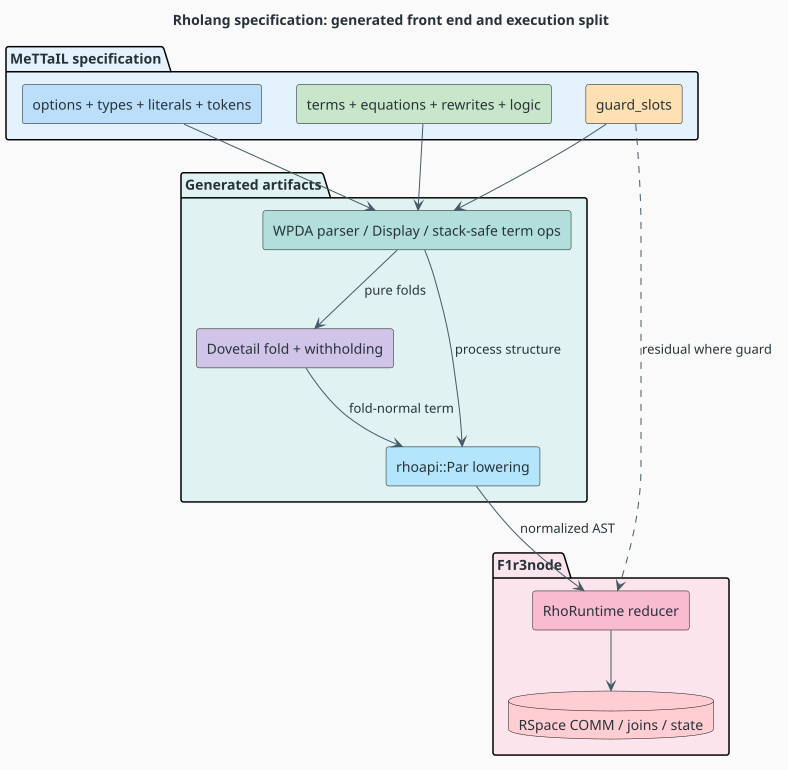
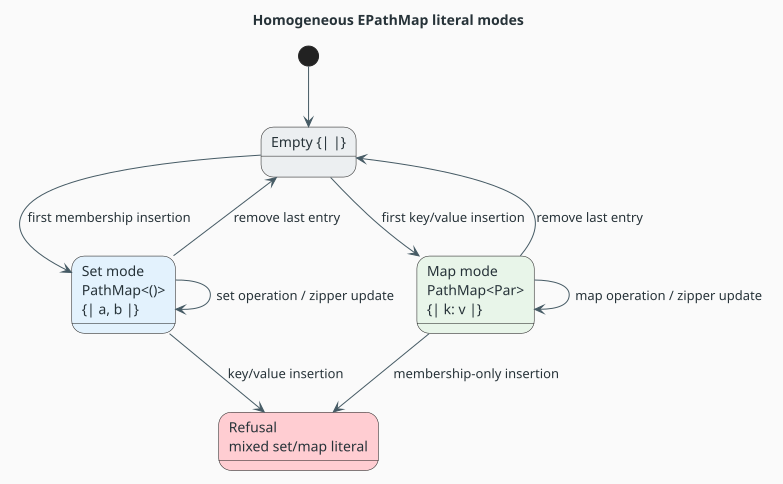
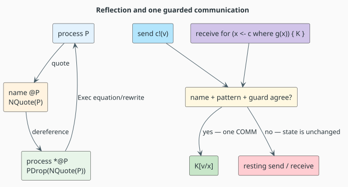

# Rholang — the `language!` specification from syntax to RSpace

Last updated: 2026-08-04 · part of the [Language Specification References](README.md) suite

**Subject:** `languages/src/rholang.rs` (2,785 lines at this revision) and its support modules under
`languages/src/rholang/`

**Audience:** implementers integrating MeTTaIL-generated Rholang with F1r3node

**Method:** each section was checked against the live specification, generated modules under
`target/generated/rholang/`, focused language tests, and the F1r3node reducer where behavior is
owned by the Rho machine.

Rholang is the suite's flagship specification. It is not merely a concrete grammar: the generated
front end normalizes pure terms, lowers process structure directly to `rhoapi::Par`, and delegates
communication to F1r3node's RhoRuntime and RSpace. The architecture has one critical boundary:
MeTTaIL defines and transforms the language; the node owns consensus execution, communication,
storage, replay, and token accounting.

---

## Table of contents

1. [Theory, components, and notation](#1-theory-components-and-notation)
2. [Specification overview](#2-specification-overview)
3. [Options and keyword election](#3-options-and-keyword-election)
4. [Types and homogeneous collections](#4-types-and-homogeneous-collections)
5. [Literals, comments, and foreign templates](#5-literals-comments-and-foreign-templates)
6. [Guards](#6-guards)
7. [Process and name terms](#7-process-and-name-terms)
8. [Operators and methods](#8-operators-and-methods)
9. [Equations and rewrites](#9-equations-and-rewrites)
10. [Hand-written logic and COMM](#10-hand-written-logic-and-comm)
11. [Execution architecture](#11-execution-architecture)
12. [Algorithms and stack safety](#12-algorithms-and-stack-safety)
13. [Verification and provenance](#13-verification-and-provenance)
14. [Known boundaries](#14-known-boundaries)
15. [References](#15-references)

---

## 1. Theory, components, and notation

| Symbol or term | Meaning |
|---|---|
| $`\Sigma`$ | the **signature**: Rholang constructors and their sorted arguments |
| $`E`$ | the **equational theory**: undirected identities such as quote/drop cancellation and scope extrusion |
| $`R`$ | directed local rewrites and congruence contexts |
| **AST** | abstract syntax tree |
| **DSL** | domain-specific language; here, `language!` |
| **GSLT** | Greg's Structured Labelled Transition system, the $`(\Sigma,E,R)`$ input model |
| **COMM** | one atomic communication between matching output and input processes |
| **RSpace** | the tuple-space store that holds Rholang data and continuations and commits COMM events |
| **RhoRuntime** | F1r3node's reducer and RSpace execution façade |
| **WPDA** | weighted pushdown automaton; the generated parser's explicit-state machine |
| **PDA** | pushdown automaton; a finite control plus an explicit stack, also used for generated traversals |
| **FLT** | foreign-language template, a host term containing raw guest text and interpolation holes |
| **URI** | uniform resource identifier |
| **EPathMap** | homogeneous, prefix-compressed path trie exposed to Rholang |
| **PathMap** | the underlying compressed trie implementation used by EPathMap |
| **Dovetail** | the equality-saturation and rewrite engine that evaluates MeTTaIL terms outside node-owned COMM |
| **withholding** | a declared boundary that prevents Dovetail from evaluating a child owned by another evaluator |
| **normal form** | a term for which the selected evaluator has no applicable step |
| **name** | a quoted process or a bound/free name variable used as a channel |

The implementation is a hybrid theory. Pure constructors and congruences are generated from
$`(\Sigma,E,R)`$; communication is supplied by the hand-written `logic` block and the Rholang
support modules, then executed by the node.



*Figure 1. The evaluation split is architectural: generated folds normalize pure data, while
normalized `rhoapi::Par` enters the node's reducer and RSpace. Source:
[figures/rholang-spec-to-runtime.puml](figures/rholang-spec-to-runtime.puml).*

---

## 2. Specification overview

The live block begins at `languages/src/rholang.rs:38` and contains every optional major section:

```text
language! {
    name: Rholang,
    options { reserved_keywords: auto },
    types { ... },
    literals { ... },
    tokens { ... },
    guards { guard_slots { ... } },
    terms { ... },
    equations { QuoteDrop; Extrude },
    rewrites { Exec; congruences; withholding; ... },
    logic { fold_proc; rw_proc; path; path_vec; trans; ... },
}
```

The four algebraic sorts are `Proc`, `Name`, `InputBind`, and `ForRow`. Native carriers add the
numeric tower, strings, bytes, five collection families, EPathMap, and zipper handles. The term
block then provides process syntax, quotation, receives, sends, casts, operators, methods, FLTs,
and lookahead.

This page groups related constructors because the block contains many surface synonyms. The live
source and generated metadata remain the exhaustive constructor inventory.

---

## 3. Options and keyword election

`reserved_keywords: auto` derives keyword reservation from fixed terminals. A word such as `Nil`
is reserved because it is a nullary constructor, not because a second list repeats it. Reservation
removes the bare-identifier interpretation while the parser retains the intended fixed-token path.

The parser still preserves ambiguity where the language genuinely has multiple feasible readings.
For example, signed numeric text may be read as one signed literal or as prefix negation applied to
an unsigned literal; the weighted parse forest elects only after feasibility and declared weights
are known. This is the project's “never disambiguate early” rule in executable form.

The important distinction is:

| Situation | Disposition |
|---|---|
| declaration accidentally creates a second carrier for the same literal | repair the declaration so the reading is unspellable |
| surface intentionally supports two structurally different readings | preserve both in the forest and elect by grammar weight |
| a keyword is a fixed language terminal | derive reservation automatically |

---

## 4. Types and homogeneous collections

### 4.1 Algebraic and scalar sorts

| Family | Sorts or carriers |
|---|---|
| process syntax | `Proc`, `Name`, `InputBind`, `ForRow` |
| bounded integers | `Int` (`i64`), `UInt32` (`u32`) |
| exact unbounded numbers | `BigInt`, `BigRat`, `Fixed` |
| approximate number | `Float` (`f64`) |
| scalar data | `Bool`, `Str`, `Bytes` |
| collections | `List`, `Bag`, `Map`, `Set`, `Pathmap` |
| navigation | `ReadZipper`, `WriteZipper` |

`Bytes` is a byte vector, not a second string carrier. It has the canonical `b"..."` hex surface,
so an ordinary quoted string can only inhabit `Str`.

### 4.2 Collection semantics

| Surface | Carrier | Algebraic meaning |
|---|---|---|
| `[a, b]` | `Vec<Proc>` | ordered, duplicates retained |
| `#{a | b}#` | `HashBag<Proc>` | unordered multiplicity |
| `{k: v}` | map carrier | key/value bindings |
| `Set(...)` surface selected by generated collection syntax | set carrier | unique members |
| `{| ... |}` | `PathMapLit<Proc, Proc>` | homogeneous compressed path trie |

EPathMap deliberately has two specialized non-empty modes and one neutral empty state:

- a set literal such as `{| a, b |}` uses `PathMap<()>`;
- a map literal such as `{| k1: v1, k2: v2 |}` uses `PathMap<Par>` at the node boundary;
- `{| |}` is neutral until the first typed insertion;
- mixed membership and key/value entries are refused.



*Figure 2. Set and map modes retain trie compression, zipper navigation, algebra, snapshots, and
Merkle structure without projecting entries through a `Vec`. Source:
[figures/rholang-epathmap-modes.puml](figures/rholang-epathmap-modes.puml).*

Empty is not a third long-lived payload mode. Removing the last item returns to neutral empty;
inserting again may select either homogeneous mode.

---

## 5. Literals, comments, and foreign templates

### 5.1 Numeric carriers

The literal block aligns source spellings with F1r3node's ground-value carriers:

| Carrier | Representative spellings | Notes |
|---|---|---|
| `Int` | `7`, `7i32`, `7i64`, `7u32` where representable | normalized to the node's signed `GInt` domain |
| `BigInt` | `7n` and unsuffixed overflow beyond `i64` | arbitrary precision |
| `BigRat` | `7r`, `3r/4r` | exact; composite form makes computed rationals printable |
| `Fixed` | `1.50p2` | exact structural `(unscaled, places)` pair |
| `Float` | `1.5`, `1.5f64` | canonical binary64 carrier |

Fixed-point equality and hashing preserve the declared scale. Binary fixed arithmetic and ordered
comparison require equal scales; multiplication floors onto that shared decimal grid. Programs can
request a different scale explicitly with `fixed(value, places)`.

### 5.2 Bytes and strings

`b"deadbeef"` denotes four bytes. The regex accepts pairs of hexadecimal digits, including the
empty sequence, and the evaluator avoids indexing and panics. Display emits lowercase, so uppercase
input reaches a canonical surface after one display.

Strings use their own quoted surface. This carrier separation matches the node wire model, where a
string and a byte array are distinct protobuf alternatives.

### 5.3 Retained comments

Line and block comments are lexed onto a retained `COMMENTS` channel. They are trivia for parsing
but retain their source ranges for tooling. The old pre-parse comment stripper deleted bytes and
shifted coordinates; the token-channel design keeps the language result unchanged while preserving
editor information.

### 5.4 FLT lexical modes

FLT openers push a raw guest mode and their closers pop it. Backtick, fenced, and brace forms have
independent delimiters. Interpolation holes are tokenized inside the guest mode, while ordinary
Rholang comments are not reinterpreted inside raw guest text.

Nested brace templates push the brace mode again on an inner opening brace. The lexer mode stack,
not host recursion, balances the guest body.

---

## 6. Guards

Rholang `where` conditions are full `Proc` expressions, not a narrower predicate syntax. The
`guards` block declares exactly which ordinary term slots are semantic predicates:

```text
guard_slots {
    ForRowWhere(cond);
    ForRowSingleWhere(cond);
}
```

This declaration lets generated obligation metadata treat the slots as behavioral predicates
without deleting arithmetic, comparison, `matches`, or nested process syntax from the source
language.

At run time, a guard is part of the COMM decision. A false or undecidable guard does not consume
the data and continuation. The substrate may discharge a statically decidable obligation, but it
does not create a second run-time evaluator beside the node.

---

## 7. Process and name terms

### 7.1 Core processes

| Family | Representative surface | Constructor role |
|---|---|---|
| zero | `Nil` | inert process |
| dereference | `*name` | recover the process behind a quoted name |
| parallel | `{P | Q}` or `P | Q` | flat multiset composition |
| send | `channel!(value)` | ephemeral output |
| persistent send | `channel!!(value)` | reusable output |
| receive | `for (pattern <- channel) { body }` | input continuation |
| persistent receive | persistent bind variants | reusable continuation |
| new | name binders around a body | fresh-name scope |

Polyadic sends normalize to a unary send whose payload is a list. The normalization is shared by
ephemeral and persistent forms and preserves argument order.

### 7.2 Reflection

`NQuote(P)` converts a process into a name; `PDrop(N)` dereferences a name. The `QuoteDrop`
equation and `Exec` rewrites implement the reflective cancellation laws for the supported quote
surfaces.



*Figure 3. Reflection connects `Proc` and `Name`; communication commits only after channel,
pattern, and guard agree. Source:
[figures/rholang-reflection-comm.puml](figures/rholang-reflection-comm.puml).*

### 7.3 Receive rows and query sugar

`InputBind` variants cover quoted patterns, name binds, persistence, polyadic binds, and `!?` query
sugar. `ForRow` variants separate single/multiple rows and guarded/unguarded forms. `PForUser`
collects rows with a body; the support module desugars query rows before communication.

The representation makes arity and persistence explicit, allowing the node lowering to construct
the corresponding protobuf `Receive` and `ReceiveBind` structures without reparsing text.

---

## 8. Operators and methods

### 8.1 Pure operator families

The `Proc` operator layer dynamically dispatches over native carriers:

- arithmetic: `+`, `-`, `*`, `/`, `%`, unary negation;
- Boolean: `and`, `or`, `not`, `implies`;
- bitwise: `bitand`, `bitor`, `bitnot` on supported integer-like carriers;
- equality and ordered relations;
- spatial `matches`;
- explicit numeric and string conversions.

Partial operations return the language `error` term when the operands are ground values and the
operation is undefined. A non-ground redex can remain available for later congruence instead of
being prematurely converted to an error.

### 8.2 Methods

One generic constructor carries method syntax:

```text
MethodCall . receiver:Proc, method_name:Ident, arguments:Vec(Proc)
           |- receiver "." method_name "(" arguments.*sep(",") ")" : Proc;
```

The method name is data at the MeTTaIL layer. F1r3node's reducer method table is the evaluator and
registry; the host fold does not maintain a parallel list of method-specific grammar constructors.
`MethodCallReceiverWithheld` expresses that ownership by preventing Dovetail from treating the
receiver as an ordinary child it may independently reduce.

### 8.3 FLT and lookahead terms

`PFlt`, `PFltFence`, and `PFltBrace` capture raw guest bodies with holes. `PLookahead` and
`PLookaheadAll` attach bracketed observation to process expressions. Lowering validates that a
lookahead operand is an appropriate send rather than relying on a surface-only category.

---

## 9. Equations and rewrites

### 9.1 Equations

The two undirected laws are:

```math
@(*N) = N
```

and scope extrusion, subject to freshness of every newly bound name against the surrounding
parallel remainder:

```math
(\mathbf{new}\;\vec{x})P \mid Q
= (\mathbf{new}\;\vec{x})(P \mid Q)
\quad\text{when}\quad \vec{x}\ \#\ Q
```

Freshness is a semantic premise, not a textual side condition. The generated theory checks it
against free-variable information.

### 9.2 Directed rewrites

The explicit rewrites fall into four groups:

1. quote/drop execution for the supported quotation surfaces;
2. parallel and new congruence;
3. left/right congruence for arithmetic, Boolean, bitwise, comparison, casts, and conversions;
4. method-receiver withholding.

The congruence rules define reduction contexts: a parent can step when a selected child steps. They
do not duplicate the child's arithmetic implementation.

COMM itself is not declared as a simple `rewrites` pattern because user receives include joins,
persistence, substitution, and guards. It is supplied by [§10](#10-hand-written-logic-and-comm).

---

## 10. Hand-written logic and COMM

The `logic` block at `languages/src/rholang.rs:2657-2783` adds relations that are awkward to express
as a single first-order term rewrite.

| Relation or rule | Role |
|---|---|
| `fold_proc` polyadic arms | normalize polyadic sends into list payloads |
| `fold_proc` drop arm | execute a direct quote/drop pair |
| `fold_proc` parallel arm | flatten infix parallel composition |
| `fold_proc` guarded helper | apply guarded substitution or preserve the resting pair |
| `fold_proc` receive sugar arm | desugar query rows |
| `rw_proc` custom rule | ask `receive::try_comm_rw_proc` for one communication |
| `path` | transitive closure of folds and rewrites |
| `path_vec` | retain explicit step sequences |
| `trans` | context-labelled transitions for lambda contexts |

### 10.1 COMM disposition

A successful communication performs these logical checks as one decision:

```math
\operatorname{COMM}(D,K)
\iff
\operatorname{nameMatch}(D,K)
\land \operatorname{patternMatch}(D,K)
\land \operatorname{guard}(D,K)
```

If the conjunction holds, substitution produces the continuation body. If it does not hold, the
send and receive remain resting. Resting is normal process semantics, not an exception.

### 10.2 Why the node still owns execution

The hand-written rule is an executable model and a Dovetail lane, but integrated execution lowers
the normalized process to the node. RSpace chooses and commits communications, maintains replay
evidence, and produces checkpoints. MeTTaIL does not implement a competing consensus store.

---

## 11. Execution architecture

The end-to-end path is:

```text
source text
  -> generated lexer and WPDA parser
  -> generated Rholang AST
  -> pure Dovetail folds and declared withholding boundaries
  -> stack-safe lowering to normalized rhoapi::Par
  -> F1r3node RhoRuntime
  -> RSpace matching, COMM, replay, and state
```

No Rholang source string is regenerated and reparsed at the node boundary. The lowerer builds the
protobuf model directly, which avoids a second grammar election and preserves carrier identity.

| Concern | Owner |
|---|---|
| parsing and canonical surface | generated MeTTaIL front end |
| pure folds over generated terms | Dovetail / generated term rules |
| `where`-slot declaration and obligation metadata | MeTTaIL guard substrate |
| normalized process lowering | `rholang-runtime` bridge |
| process reduction, methods, matching | F1r3node reducer |
| communication, persistence, replay, checkpoints | RSpace / F1r3node |
| consensus token accounting | F1r3node |

This single-owner table is the integration contract. Adding a second answerer for a node-owned
question creates a conformance obligation and a possible divergence.

---

## 12. Algorithms and stack safety

### 12.1 Literate algorithm: guarded communication attempt

**Algorithm 1 (Guarded communication attempt).** Evaluate one receive/send candidate without
consuming state on failure.

**Invariant.** Until all checks succeed, the returned process multiset contains the original send
and receive unchanged.

```pseudocode
TryGuardedComm(send, receive)
  Compare the send channel with the receive channel requirement.
  If they differ, return the original resting pair.
  Match the receive pattern against the payload into a fresh binding environment.
  If matching refuses, return the original resting pair.
  Evaluate the declared guard with the candidate bindings.
  If the guard is not true, return the original resting pair.
  Substitute bindings into the continuation using the generated iterative substitution PDA.
  Return the substituted continuation, consuming the matched pair exactly once.
```

The ordering prevents a failed guard from leaking partial bindings or consuming RSpace state.

### 12.2 Literate algorithm: stack-safe lowering

**Algorithm 2 (Stack-safe lowering).** Convert a potentially deep generated `Proc` to `rhoapi::Par`
without native-stack growth.

**Invariant.** Each work frame represents one recursive-oracle call whose children have not yet
been combined; the explicit value stack contains completed children in canonical order.

```pseudocode
LowerProc(root)
  Push Visit(root) on the explicit work stack.
  While the work stack is not empty:
    Pop one instruction.
    If it is Visit(node):
      push the node's Combine instruction;
      push child Visit instructions in reverse canonical order.
    If it is Combine(node kind):
      pop the completed child values required by that kind;
      construct the corresponding rhoapi value;
      push the completed parent value.
  Return the single completed root value.
```

Generated clone, drop, equality, hashing, normalization, substitution, matching, display, and codec
families use the same explicit-machine principle. EPathMap children are streamed in reverse trie
order for a last-in/first-out driver; they are not first materialized as a `Vec<Par>`.

### 12.3 Complexity

For a term with $`n`$ visited nodes, traversal work is $`\Theta(n)`$ plus carrier-specific work.
Native-stack usage is constant with depth; explicit heap state is proportional to the live frontier.
PathMap operations retain prefix compression and use trie-native navigation rather than flattening
the entry set.

---

## 13. Verification and provenance

| Evidence surface | Responsibility |
|---|---|
| `languages/src/rholang.rs` | authoritative DSL declaration |
| `languages/src/rholang/runtime.rs` | shared folds and collection/equality helpers |
| `languages/src/rholang/receive.rs` | receive desugaring, matching, guarded COMM model |
| `languages/src/rholang/pathmap.rs` | PathMap-native language operations |
| `target/generated/rholang/metadata.rs` | reflected constructor/rule inventory and fingerprint |
| `target/generated/rholang/parser.rs` | generated WPDA parser |
| `target/generated/rholang/{iterative_drop,iterative_cmp,subst,normalize}.rs` | generated explicit-state traversals |
| `languages/tests/rholang_tests.rs` | source parsing, folds, operators, and surface regressions |
| `languages/tests/rholang_arith_carrier_matrix.rs` | carrier/operator matrix and upstream fixed-point convergence |
| `rholang-runtime/tests/rho_rholang_conformance.rs` | generated fold versus F1r3node reducer |
| `rholang-runtime/tests/stack_depth_gate.rs` | depth-shape classification and stack-safety gates |

The most important conformance properties are:

1. source parsing and canonical display preserve the elected term;
2. pure folds agree with the node on shared ground operations;
3. unsupported operations fail closed;
4. lowering preserves carrier and collection identity;
5. generated iterative traversals agree with retained recursive test oracles;
6. deep inputs do not require `RUST_MIN_STACK`, `stacker`, or depth caps;
7. EPathMap set/map modes serialize and lower without an entry-list projection.

---

## 14. Known boundaries

| Boundary | Current state |
|---|---|
| URI literal syntax | not yet modeled; backticks currently participate in FLT syntax |
| strict upstream source acceptance | MeTTaIL has documented value-preserving surface extensions such as printable composite rationals and byte literals |
| methods | node reducer table is authoritative; MeTTaIL does not duplicate every method body |
| non-ground partial operations | may remain as redexes until children become ground |
| RSpace scheduling and metering | node-owned, never inferred from Dovetail's local step count |
| EPathMap mixed membership | refused; only homogeneous set or homogeneous map mode is supported |

These boundaries are deliberate ownership statements. A future change should update the source,
the corresponding conformance gate, and—if node-observable behavior can move—the consensus-change
living report together.

---

## 15. References

- L. G. Meredith and M. Radestock, “A Reflective Higher-order Calculus,” *Electronic Notes in
  Theoretical Computer Science* 141(5), 2005.
  [DOI: 10.1016/j.entcs.2005.05.016](https://doi.org/10.1016/j.entcs.2005.05.016).
- [Rholang end-to-end examples](../examples/rholang/00-overview.md) — generated front-end stages and
  runtime execution.
- [Runtime backend spine](../architecture/runtime-backend-spine.md) — the MeTTaIL/Dovetail/node
  ownership boundary.
- [Stack-safety audit](../design/audits/lowering-stack-depth-audit-2026-07-27.md) — recursive surface
  census, explicit-machine architecture, and depth evidence.
- [Suite index](README.md) — shared DSL conventions and validation procedure.
