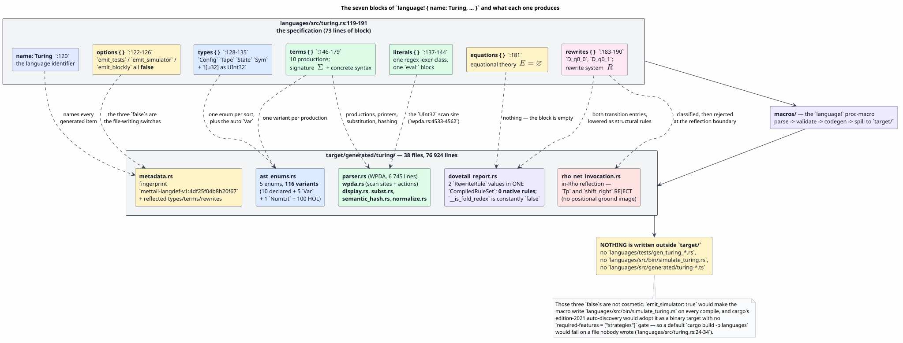
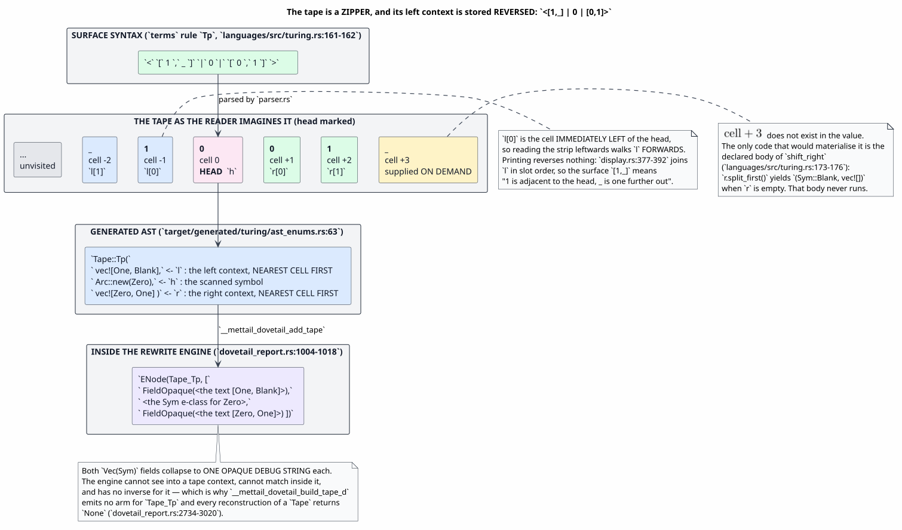
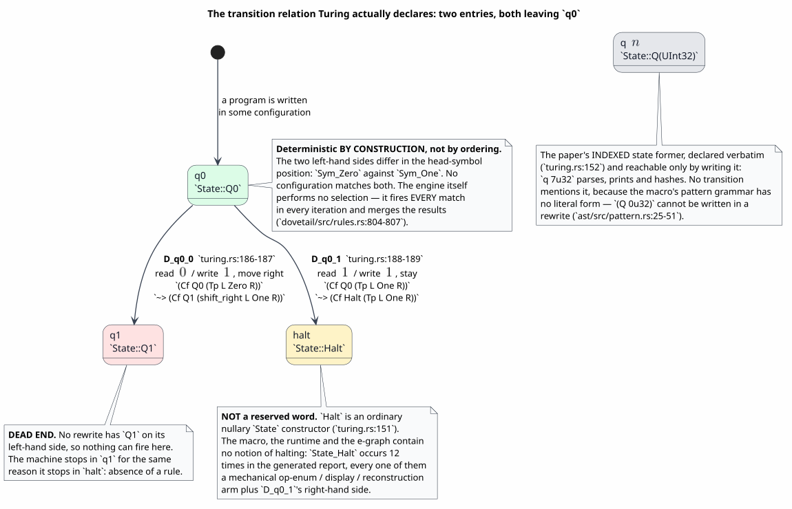
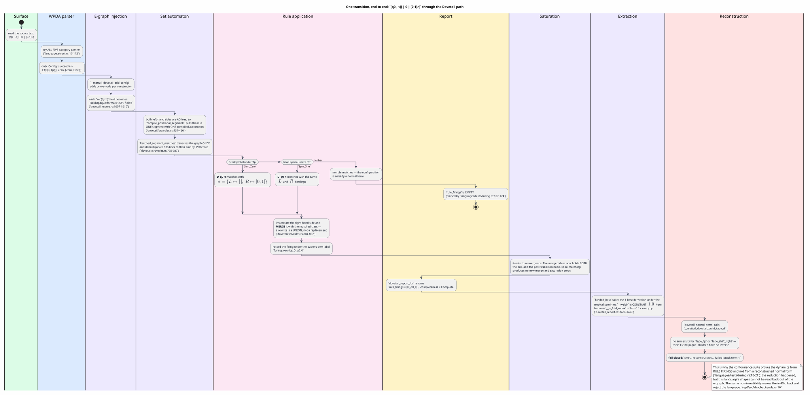

# Turing — the `language!` specification for a single-tape machine, component by component

Last updated: 2026-07-28 · part of the [Language Specification References](README.md) suite

**Subject:** `languages/src/turing.rs`
**Audience:** anyone reading this block to learn what a Turing machine looks like *as a
GSLT (Greg's Structured Labelled Transition system)*, and anyone deciding whether to imitate its
tape encoding in a new specification
**Method:** every claim below was checked against the DSL (domain-specific language) parser
(`ast/`), the code generator
(`macros/`), the rewrite engine (`dovetail/`), the *actual generated output* in
`target/generated/turing/`, and the hand-written conformance suite
`languages/tests/turing.rs`. [§15](#15-provenance-where-each-claim-comes-from) gives the
file-and-line provenance for each one.

**Read [lambda.md](lambda.md) first if you have never read a `language!` block.** This page assumes
you know what `types`, `terms`, `equations` and `rewrites` do; it spends its length on the three
things Lambda does not have — a `literals` block, a collection-valued field, and a native `fold`
helper — and on the gap between what this specification *says* and what the generated system
*does*.

> ### The one-paragraph summary
>
> `Turing` transcribes the GSLT omnibus paper's **L9** listing: a single-tape machine presented as
> a $`(\Sigma, E, R)`$ triple. Its tape is a **zipper** — a left context, a scanned symbol, and a
> right context — and its transition relation is a two-entry rewrite family. Both entries leave
> state `q0`; nothing leaves `q1`; `halt` is an ordinary constructor with no special meaning to any
> engine. **The declared right-move helper `shift_right` never executes**, because both fold lanes
> in the code generator reject it, so the machine performs at most one recorded transition and its
> tape never actually changes. Every one of those statements is anchored to a file and a line
> below. The omnibus paper uses L9 as its deliberate *non*-example of interactivity; this
> implementation is a sharper non-example than the paper's, and understanding exactly why is the
> point of the page.

---

## Table of contents

1. [The specification under discussion](#1-the-specification-under-discussion)
2. [Notation, symbols, and key terms](#2-notation-symbols-and-key-terms)
3. [What the block produces](#3-what-the-block-produces)
4. [`name: Turing` — the language identifier](#4-name-turing--the-language-identifier)
5. [`options { … }` — the three file-writing switches](#5-options-----the-three-file-writing-switches)
6. [`types { … }` — the sorts, and the alphabet's carrier](#6-types-----the-sorts-and-the-alphabets-carrier)
7. [`literals { … }` — the `UInt32` lexer class](#7-literals-----the-uint32-lexer-class)
8. [`terms { … }` — the signature Σ and the concrete syntax](#8-terms-----the-signature-σ-and-the-concrete-syntax)
9. [`equations { }` — the empty equational theory](#9-equations----the-empty-equational-theory)
10. [`rewrites { … }` — the transition relation](#10-rewrites-----the-transition-relation)
11. [Executing a configuration, end to end](#11-executing-a-configuration-end-to-end)
12. [The specification as a whole](#12-the-specification-as-a-whole)
13. [Security, resource, and operational considerations](#13-security-resource-and-operational-considerations)
14. [What this machine is not: the classical model, restriction by restriction](#14-what-this-machine-is-not-the-classical-model-restriction-by-restriction)
15. [Provenance: where each claim comes from](#15-provenance-where-each-claim-comes-from)
16. [Gotchas](#16-gotchas)
17. [References](#17-references)

---

## 1. The specification under discussion

`languages/src/turing.rs` is 191 lines. Lines 1–106 are a module header — a clause-by-clause
containment table against the source paper, the notation notes, and two design records. Lines
119–191 are the specification proper, reproduced here verbatim:

```rust
language! {
    name: Turing,

    options {
        emit_tests: false,
        emit_simulator: false,
        emit_blockly: false,
    },

    types {
        Config
        Tape
        State
        Sym
        // Carrier for the paper's `n:UInt32` state index.
        ![u32] as UInt32
    },

    literals {
        UInt32 {
            // The regex is elided HERE ONLY, and decomposed in full in §7. Its text
            // contains a substring that Markdown link checkers read as a link target;
            // §7 reproduces every character of it in a link-safe decomposition.
            pattern: r"…";
            eval: ![ {
                mettail_prattail::parse_int_lit(text, None).map_err(|_| ())
            } ]
        }
    },

    terms {
        Blank . Sym ::= "_" ;
        Zero . Sym ::= "0" ;
        One . Sym ::= "1" ;

        Halt . State ::= "halt" ;
        Q . n:UInt32 |- "q" n : State ;

        // ➕ (ours) The two machine states of the paper's transition table as
        // nullary constants, so the table entries below can name them in a
        // pattern (no literal pattern form exists — see the module header).
        Q0 . State ::= "q0" ;
        Q1 . State ::= "q1" ;

        // tape as a zipper: reversed left context, head symbol, right context
        Tp . l:Vec(Sym), h:Sym, r:Vec(Sym)
            |- "<" "[" l.*sep(",") "]" "|" h "|" "[" r.*sep(",") "]" ">" : Tape ;

        Cf . q:State, t:Tape |- "(" q "," t ")" : Config ;

        // ➕ (ours) the paper's theory-supplied helper, given a home:
        // write `h` at the head cell, then move right.
        shift_right . l:Vec(Sym), h:Sym, r:Vec(Sym)
            |- "shift_right" "(" "[" l.*sep(",") "]" "," h "," "[" r.*sep(",") "]" ")" : Tape ![{
                let mut left: Vec<Sym> = Vec::with_capacity(l.len());
                left.push(h.clone());
                left.extend(l.iter().cloned());
                let (head, rest): (Sym, Vec<Sym>) = match r.split_first() {
                    Some((s, tail)) => (s.clone(), tail.to_vec()),
                    None => (Sym::Blank, Vec::new()),
                };
                Tape::Tp(left, std::sync::Arc::new(head), rest)
            }] fold;
    },

    equations { },

    rewrites {
        // one entry of the transition table, written out
        // q0 reading 0: write 1, move right, go to q1
        D_q0_0 . |- (Cf Q0 (Tp L Zero R))
                    ~> (Cf Q1 (shift_right L One R));
        D_q0_1 . |- (Cf Q0 (Tp L One R))
                    ~> (Cf Halt (Tp L One R));
    },
}
```

Seventy-three lines of specification. They compile to **38 generated files totalling 76 924
lines**, and — uniquely among the bundled languages — to *no* files outside `target/`.

### 1.1 Provenance of the specification itself

The block is a transcription of listing **L9** of the GSLT omnibus paper (`omnibus.tex:1900-1936`,
cited from the module header at `languages/src/turing.rs:1-3`). The paper's own use of L9 is as a
*non*-example: it is the rung of its conformance ladder that demonstrates what a GSLT presentation
looks like when the object being presented has no interactive content
(`omnibus.tex:692-720`, `:1938-1942`). The transcription is a **semantic superset**: every `types`
entry, `terms` production, `equations` clause and `rewrites` rule of the paper's version is present
with the same meaning, and three clauses are added (`Q0`, `Q1`, `shift_right`). The module header
tabulates every deviation clause by clause at `languages/src/turing.rs:36-51`.

Two deviations matter enough to restate here, because both are *forced* by the toolchain rather
than chosen:

| Paper writes | This file writes | Why |
|---|---|---|
| `(Cf (Q 0u32) (Tp L Zero R))` in a rewrite | `(Cf Q0 (Tp L Zero R))` | the macro's pattern grammar has **no literal form** — see [§10.4](#104-the-forced-delta-a-pattern-cannot-contain-a-literal) |
| `(shift_right L One R)` on a right-hand side, undeclared | `shift_right` declared as a `Tape`-valued term former | only `eval` is a builtin right-hand-side head; everything else must resolve to a declared label — see [§8.6](#86-shift_right--the-theory-supplied-helper-given-a-home) |

---

## 2. Notation, symbols, and key terms

Every symbol, acronym and term used later, defined before first use. Terms marked ★ are specific to
this toolchain rather than standard computability vocabulary.

| Symbol / term | Meaning |
|---|---|
| $`\Sigma`$ | **signature** — the set of constructors (term formers) with their arities and sorts. Written `terms` in the DSL |
| $`E`$ | **equational theory** — a set of *undirected* equations identifying terms. Written `equations` |
| $`R`$ | **rewrite system** — a set of *directed* reduction rules. Written `rewrites` |
| $`\rightsquigarrow`$ | the one-step reduction relation, written `~>` in the DSL |
| $`\varnothing`$ | the empty set |
| $`\vdash`$ | the **turnstile**, written `\|-`: in `terms` it separates metasyntax from object syntax; in a rule it separates the contexts from the rule proper |
| **sort** / **category** | a syntactic class of terms. Turing has five: `Config`, `Tape`, `State`, `Sym`, `UInt32` |
| **GSLT** | ★ Greg's Structured Labelled Transition system — the $`(\Sigma, E, R)`$ presentation MeTTaIL compiles. The same acronym is expanded *graph-structured lambda theory* in the categorical literature this repository also cites; both name the same object from the syntactic and the categorical side |
| **OSLF** | ★ Operational Semantics in Logical Form, the theory the toolchain implements ([OSLF-2017](#17-references)) |
| **AST** | abstract syntax tree |
| **DSL** | domain-specific language — here, the `language!` block syntax itself |
| **BNFC** | the Backus–Naur Form Converter, whose `Label . Cat ::= item …` production style the legacy `terms` form imitates |
| **LHS** | left-hand side of a rule — the pattern that is matched |
| **RHS** | right-hand side of a rule — the term the matched redex is rewritten to |
| **REPL** | read-eval-print loop — this repository's interactive front end, `repl/` |
| **WPDA** | ★ weighted pushdown automaton — the parser architecture the macro generates |
| **configuration** | for a Turing machine, the triple $`\langle \text{tape},\ \text{head},\ \text{state}\rangle`$. Here it is the constructor `Cf` |
| **zipper** | a representation of a sequence with a distinguished focus, as (context-before, focus, context-after), so that local movement is cheap ([HUET-1997](#17-references)) |
| **redex** | *reducible expression* — a subterm matching some rule's left-hand side |
| **contractum** | the term a redex is rewritten *to* |
| **normal form** | a term containing no redex |
| $`\sigma`$ | the **substitution** (here: variable-to-subterm binding map) produced by a successful match |
| **e-graph** ★ | a data structure holding many equivalent terms compactly: **e-nodes** (operator plus child classes) grouped into **e-classes** (sets of provably equal terms) |
| **saturation** ★ | applying every rule to every match repeatedly until no new equalities are produced ([EQUALITY-SATURATION-2009](#17-references)) |
| **set automaton** ★ | a matching automaton that inspects each symbol of the subject at most once while testing many patterns simultaneously ([SET-AUTOMATON-LOCATE-2021](#17-references)) |
| **extraction** ★ | choosing one concrete term out of an e-class, by minimising a cost |
| **tropical semiring** | the min-plus semiring $`(\mathbb{R}\cup\{\infty\},\min,+)`$; "best" means least total cost |
| **fold** ★ | a `terms` annotation declaring that the production is *computed* by a native Rust body rather than left as a constructor |
| **native payload** ★ | a sort declared `![T] as C`, whose values wrap a Rust value of type `T` |
| **HOL** | ★ higher-order logic. Here, specifically, the *HOL plumbing*: the auto-injected `Lam{D}` / `MLam{D}` / `Apply{D}` / `MApply{D}` variants the engine uses for *specification-level* abstraction. They are meta-level and never appear in surface syntax |
| `FieldOpaque` ★ | the e-graph operator used for a constructor field the engine cannot model structurally. It carries the field's `Debug` rendering as a string |
| **fail closed** ★ | refusing with a typed error rather than producing a partial or guessed result |

---

## 3. What the block produces



*Figure 1. Each block feeds specific generated artifacts. Note the two outcomes that distinguish
this language from Lambda: the `options` block suppresses every file the macro would otherwise
write outside `target/`, and the `rewrites` block's two rules end up as the entire compiled rule
set, with **zero** native rules beside them. Source:
[figures/turing-spec-to-artifacts.puml](figures/turing-spec-to-artifacts.puml).*

An inventory of `target/generated/turing/`, by role:

| Module(s) | Role | Size |
|---|---|---|
| `ast_enums.rs` | the Rust `enum` for each sort | 5 enums, 116 variants |
| `parser.rs`, `wpda.rs`, `parse_alt_filter.rs` | the WPDA parser, its scan sites and semantic actions | 6 745 + 11 163 + 774 lines |
| `display.rs`, `debug.rs` | printers; `Display` is the inverse of the parser | 1 905 + 1 265 lines |
| `subst.rs`, `env_subst.rs`, `normalize.rs` | iterative, pooled, stack-safe term transformation | 10 636 + 1 785 + 8 650 lines |
| `iterative_cmp.rs`, `iterative_hash.rs`, `semantic_hash.rs`, `iterative_drop.rs` | deterministic identity and comparison without recursion | — |
| `dovetail_report.rs` | the e-graph op enum, injection, compiled rule set, extraction and reconstruction | 11 449 lines |
| `rho_net_invocation.rs`, `rho_scalar_invocation.rs`, `rho_fold_dataflow.rs` | the in-Rho lowering — all three decline for this language ([§14](#14-what-this-machine-is-not-the-classical-model-restriction-by-restriction)) | — |
| `metadata.rs` | reflected description of the whole specification plus its fingerprint | 214 lines |
| `strategies.rs`, `term_generation.rs`, `random_generation.rs` | proptest strategies and term generators | — |
| `binder_congruence.rs`, `flatten.rs`, `numeric_cast_adapter.rs` | **empty** — this language has no binders, no flattening and no numeric casts | 0 bytes each |

Three empty files are themselves informative: they are the macro's honest statement that Turing
declares no binder, no associative-commutative collection needing flattening, and no numeric
coercion.

---

## 4. `name: Turing` — the language identifier

**Syntax.** `name: Ident,` — a *field*, comma-terminated, not a block.

**Semantics.** It becomes the identifier prefix of every generated item and the string returned by
`Language::name()`.

| Generated item | Name for this specification |
|---|---|
| marker struct | `TuringLanguage` |
| metadata implementation | `TuringMetadata` |
| e-graph operator enum | `TuringDovetailOp` |
| module path | `mettail_languages::turing::*` |
| REPL key | `turing` (the lower-cased name, per `LanguageRegistry::register`) |
| cargo feature | `turing`, a member of `all-languages` and therefore on by default |

**It also seeds the language fingerprint.** `metadata.rs` records

```rust
fn definition_fingerprint(&self) -> Option<&'static str> {
    Some("mettail-langdef-v1:4df25f04b8b20f67")
}
```

together with a normalised rendering of the whole block in `definition_source`. The pair is the
memo key for cached in-Rho artifacts; change one character of the specification and the fingerprint
changes. The fingerprint is not decorative here — it is embedded in the location channel the
generated in-Rho injection would use, `loc:mettail-langdef-v1:4df25f04b8b20f67/term/9/shift_right/value`.

---

## 5. `options { … }` — the three file-writing switches

```text
options {
    emit_tests: false,
    emit_simulator: false,
    emit_blockly: false,
},
```

**Syntax.** A brace-delimited list of `key: value` pairs. `parse_options` validates each key
against a closed set — `beam_width`, `log_semiring_model_path`, `dispatch`, `emit_tests`,
`emit_blockly`, `emit_simulator`, `hosted_in`, `case_insensitive`, `unicode_normalization`,
`reserved_keywords`, `parse_only` — and rejects anything else at macro-parse time. The three used
here must be booleans.

**Semantics.** These are the macro's **file-writing switches**, and they all default to `true`.
With them on, expanding the macro writes, into the *source tree*:

| Option | Would write |
|---|---|
| `emit_tests` | `languages/tests/gen_turing_{unit,rewrite,prop,analytical}.rs` |
| `emit_simulator` | `languages/src/bin/simulate_turing.rs` |
| `emit_blockly` | `languages/src/generated/turing-*.ts` |

With them off, the specification's behavioural statements are the hand-written ones next door in
`languages/tests/turing.rs`.

**Why they must stay off — a build-integrity hazard, not a style preference.** Every hand-declared
`[[bin]]` in `languages/Cargo.toml` carries `required-features = ["strategies"]`, because a
generated simulator names `mettail_languages::turing::strategies::arb_*`, which exists only under
the `strategies` feature. A file *written* into `languages/src/bin/` is instead adopted by cargo's
edition-2021 target auto-discovery, with **no** feature gate. A default `cargo build -p languages`
would then try to compile a binary nobody declared, against symbols that are not compiled, and
fail. The module header records this reasoning at `languages/src/turing.rs:24-34`. Flipping these
on is a change to the macro's emission contract, not a per-language switch.

---

## 6. `types { … }` — the sorts, and the alphabet's carrier

```text
types {
    Config
    Tape
    State
    Sym
    // Carrier for the paper's `n:UInt32` state index.
    ![u32] as UInt32
},
```

**Syntax.** Whitespace-separated declarations, parsed by `parse_types`. Three forms exist:

| Form | Declares |
|---|---|
| `Config` | a **pure algebraic sort** — an AST category with no Rust payload |
| `![u32] as UInt32` | a sort whose values carry a **native Rust payload**, here a `u32` |
| `![HashBag<Proc>] as Bag { open_parts: … }` (unused here) | a **collection sort** — a native payload plus the surface delimiters and separator its literal is printed and parsed with (`languages/src/rholang.rs:83-87`) |

**Semantics, sort by sort.**

| Sort | Role in the machine | Native carrier |
|---|---|---|
| `Config` | the configuration $`\langle \text{tape}, \text{head}, \text{state}\rangle`$. Declared **first**, which makes it the *primary* type (`metadata.rs:17-21`) | none |
| `Tape` | tape-plus-head-position, as a zipper | none |
| `State` | the machine's control state | none |
| `Sym` | the tape alphabet | none |
| `UInt32` | the index carrier for the paper's `q n` state former | `u32` |

**The alphabet is a sort, not a payload.** `Sym` has `native_type: None`. Its inhabitants are
exactly the three nullary constructors declared in `terms`; there is no way to write a fourth
symbol, and no Rust value hiding behind a symbol. This is the first place the implementation
narrows the classical model, where the alphabet is any finite set fixed per machine.

**The `UInt32` carrier is an addition, not a transcription.** The paper's `types` block lists four
sorts; the fifth exists because the paper's `Q . n:UInt32 |- "q" n : State ;` production needs
something for `n` to range over.

### 6.1 What the block generates

One Rust `enum` per sort, plus two families of *auto-injected* variants. Abbreviated from
`ast_enums.rs` (paths shortened):

```rust
pub enum Config { Cf(Arc<State>, Arc<Tape>), CVar(OrdVar), /* + 20 HOL variants */ }
pub enum Tape   { Tp(Vec<Sym>, Arc<Sym>, Vec<Sym>),
                  shift_right(Vec<Sym>, Arc<Sym>, Vec<Sym>),
                  TVar(OrdVar), /* + 20 HOL variants */ }
pub enum State  { Halt, Q(Arc<UInt32>), Q0, Q1, SVar(OrdVar), /* + 20 HOL variants */ }
pub enum Sym    { Blank, Zero, One, SVar(OrdVar), /* + 20 HOL variants */ }
pub enum UInt32 { NumLit(u32), UVar(OrdVar), /* + 20 HOL variants */ }
```

Counting: 10 declared constructors, 5 auto-injected `Var` variants, 1 auto-injected `NumLit`, and
100 auto-injected HOL variants, for **116** in total.

#### The `Var` variants, and a name collision worth knowing about

`generate_var_label` builds the variable-variant name as *the first letter of the sort name,
upper-cased, followed by* `Var`. So `Config` yields `CVar`, `Tape` yields `TVar`, `UInt32` yields
`UVar` — and **both `State` and `Sym` yield `SVar`**. They do not clash, because they are variants
of different enums, but `State::SVar` and `Sym::SVar` are distinct types with the same spelling,
and a reader skimming a match arm can easily mistake one for the other.

#### The 100 HOL variants

`compute_hol_domain_pairs` currently returns the **full Cartesian product** of the declared sorts:
five sorts give 25 pairs, and each pair contributes four variants. Turing declares no binder
anywhere — there is not a single `^x.` in the file — and gets the plumbing regardless. They are
inert here in the strongest sense: **no surface syntax produces them.** `LamConfig` occurs zero
times in the generated `parser.rs` and zero times in `wpda.rs`, and ten times in `display.rs` — the
printer must handle every variant of an enum, but nothing a programmer can type ever builds one.
They exist for the engine's own specification-level abstraction, which this language never uses.

#### Representation notes

- Children are `Arc<_>`, so derived `Clone` is $`O(1)`$ pointer sharing rather than a deep copy.
- `PartialEq`, `Ord`, `Hash` and `Debug` are emitted as *iterative work-stack* implementations, so
  a deep term cannot overflow the stack.
- A `Vec(Sym)` field becomes a plain `Vec<Sym>` — **not** an `Arc`, and not a persistent structure.
  Every operation that rebuilds a tape therefore copies its contexts.

---

## 7. `literals { … }` — the `UInt32` lexer class

```text
literals {
    UInt32 {
        pattern: r"…";          // decomposed exactly, below
        eval: ![ {
            mettail_prattail::parse_int_lit(text, None).map_err(|_| ())
        } ]
    }
},
```

**Syntax.** One brace-delimited entry per native sort, each carrying a `pattern:` (a regex, as a
string or raw string, semicolon-terminated) and an `eval: ![ … ]` block. The block's free variable
`text` is bound to the matched lexeme.

**Semantics.** The pattern becomes a **scan site** in the generated lexer, and the `eval` block is
the semantic action that turns the matched text into the sort's payload.

### 7.1 The pattern, decomposed exactly

The literal pattern lives at `languages/src/turing.rs:139`. It is reproduced here by decomposition
rather than by quotation, for a mundane reason worth stating once: the regex contains the character
sequence `]` immediately followed by `(`, which every Markdown link checker — including this
suite's `validate.sh` — reads as a link. The decomposition below is exact; concatenating it
reconstructs the pattern character for character.

Write `⟨d⟩` for a radix's **digit class** and `⟨d-run⟩` for the sequence `⟨d⟩(_?⟨d⟩)*` — *one
digit, then any number of further digits, each optionally preceded by a single underscore
separator*. The pattern is then

```text
( ⟨alt-bin⟩ | ⟨alt-oct⟩ | ⟨alt-hex⟩ | ⟨alt-dec⟩ ) u32
```

with the four alternatives being a literal radix prefix followed by a `⟨d-run⟩` over that radix's
digit class:

| Alternative | Radix prefix | Digit class `⟨d⟩` | Example lexeme |
|---|---|---|---|
| `⟨alt-bin⟩` | `0b` | `[01]` | `0b1010_0110u32` |
| `⟨alt-oct⟩` | `0o` | `[0-7]` | `0o755u32` |
| `⟨alt-hex⟩` | `0x` | `[0-9A-Fa-f]` | `0xDEAD_BEEFu32` |
| `⟨alt-dec⟩` | *(none)* | `[0-9]` | `7u32` |

Four properties of this grammar follow, and they are worth reading off explicitly:

1. **The `u32` suffix is mandatory in every alternative.** It sits outside the alternation group.
2. **A separator may not lead or trail.** `⟨d-run⟩` begins with a bare digit and every `_` must be
   followed by a digit, so `_1u32` and `1_u32` are not lexemes.
3. **Consecutive separators are excluded.** Each `_` is optional-and-singular within one repetition.
4. **A bare `0` is not a `UInt32` literal.** This is the load-bearing consequence: the surface `q0`
   can only be the nullary constructor `Q0`, never the indexed former `Q` applied to a literal `0`.
   The grammar is unambiguous at that point *by construction*, not by precedence.


*Figure 2. A regular expression is an automaton, and reading it as one makes the separator rules
obvious: no underscore edge ever lands in an accepting state, so a lexeme can neither begin nor end
with a separator nor carry two in a row. Source:
[figures/turing-uint32-literal-automaton.puml](figures/turing-uint32-literal-automaton.puml).*

### 7.2 What the `eval` block compiles into

The generated action is not a bare splice of the user body. It wraps it in a fallible conversion
(`wpda.rs:4533-4562`):

```rust
let __result: Result<u32, ()> = (|| -> Result<u32, ()> {
    let __intermediate = { { mettail_prattail::parse_int_lit(text, None).map_err(|_| ()) } }?;
    __intermediate.as_i64().and_then(|v| u32::try_from(v).ok()).ok_or(())
})();
if let Ok(__v) = __result { b.push_term::<UInt32>(UInt32::NumLit(__v)); } else {}
```

Three properties follow, and all three are security-relevant:

1. `parse_int_lit` parses into an arbitrary-precision `BigInt` first, so an enormous literal cannot
   overflow during lexing.
2. The narrowing to `u32` goes through `i64` and `u32::try_from`, so an out-of-range index is
   **rejected**, never wrapped.
3. On rejection the action pushes *nothing*; the parse then fails for want of a term rather than
   proceeding with a fabricated value. This is the fail-closed discipline applied at the lexer.

---

## 8. `terms { … }` — the signature Σ and the concrete syntax

Every rule in `terms` is a typing judgement. The full production the parser accepts is

```text
Label . term_context |- concrete_syntax : Category [ ![rust_expr] ] [ fold | step ] [ right ] [ prefix(N) ] [ canonical ] ;
```

and a legacy BNFC-style alternative

```text
Label . Category ::= item item … ;
```

is also accepted. `parse_grammar_rule` chooses between them by forking the token stream after the
label's dot and checking whether the next identifier is followed by `::` (legacy) or `:`
(judgement). **This file uses both**, deliberately: the legacy form for nullary constants, where a
judgement would be pure ceremony, and the judgement form wherever there are parameters. The module
header states the convention at `languages/src/turing.rs:53-64`.

> **Two different syntaxes coexist in this one block.** `terms` uses *concrete* syntax — quoted
> literals interleaved with parameter references. `rewrites` uses *abstract* prefix patterns over
> constructor labels. `(Cf Q0 (Tp L Zero R))` in a rewrite is not the same notation as
> `(q0 , <[1] | 0 | [1]>)` in source text, even though they denote the same node.

### 8.1 `Blank`, `Zero`, `One` — the tape alphabet

```text
Blank . Sym ::= "_" ;
Zero . Sym ::= "0" ;
One . Sym ::= "1" ;
```

| Fragment | What it is / does |
|---|---|
| `Blank` | the **label**; becomes `Sym::Blank` |
| `.` | the mandatory separator after every rule label, in all four blocks |
| `Sym` | the **result category** — in the legacy form the category comes first |
| `::=` | the legacy production operator, parsed as `Token![::]` then `Token![=]` |
| `"_"` | a **terminal**: quoted strings are always literals |
| `;` | terminator |

Each generates a nullary enum variant and a one-token production. `Display` writes the literal back
unchanged, so `Sym::parse("_")` round-trips to `"_"`; the conformance suite pins all three at
`languages/tests/turing.rs:93-100`.

**The blank symbol is an ordinary constructor.** Nothing in the generated code treats `Blank` as
"the default cell content". The only place a blank is ever *manufactured* is the declared body of
`shift_right` ([§8.6](#86-shift_right--the-theory-supplied-helper-given-a-home)), and that body
never runs.

### 8.2 `Halt` and `Q` — the state sort, transcribed

```text
Halt . State ::= "halt" ;
Q . n:UInt32 |- "q" n : State ;
```

`Q` is the paper's indexed state former, transcribed verbatim in judgement form:

| Fragment | Name | What it is / does |
|---|---|---|
| `Q` | label | becomes `State::Q(Arc<UInt32>)` |
| `n:UInt32` | **simple parameter** | `name:Type` form (`TermParam::Simple`) — a plain subterm of sort `UInt32` |
| `\|-` | turnstile | end of context, start of surface grammar |
| `"q"` | terminal | the literal `q` |
| `n` | parameter reference | unquoted identifiers reference context parameters |
| `: State` | result sort | the category this production yields |

`Display` renders it as `"q "` followed by the index, and `UInt32::NumLit` renders with its
suffix — so `State::Q(NumLit(7))` prints `q 7u32`, which re-parses. `languages/tests/turing.rs:106-110`
pins both `halt` and `q 7u32`.

### 8.3 `Q0` and `Q1` — added so the table can name its states

```text
Q0 . State ::= "q0" ;
Q1 . State ::= "q1" ;
```

These two clauses are **not** in the paper. They exist because a rewrite pattern cannot contain a
literal ([§10.4](#104-the-forced-delta-a-pattern-cannot-contain-a-literal)), so `(Q 0u32)` — which
is what the paper writes inside its transition entries — does not parse. Naming the two machine
states with nullary constructors preserves the transition *semantics* exactly while giving the
pattern language something it can refer to. The surface spellings `q0` and `q1` are the very ones
the paper's own example program uses (`omnibus.tex:1949`).

The mechanism that makes this work is worth naming, because it is invisible in the source: **a bare
identifier in a pattern that resolves to a declared constructor is read as that constructor, not as
a metavariable.** `pattern_term_to_dovetail` looks the identifier up with
`language.get_constructor` and, on a hit, emits `Pattern::leaf(op)` instead of `Pattern::var(name)`.
You can see the outcome in the generated rule set: `Q0`, `Q1`, `Zero`, `One` and `Halt` are all
`Pattern::leaf(...)`, while `L` and `R` are `Pattern::var("L")` and `Pattern::var("R")`.

### 8.4 `Tp` — the tape, as a zipper

```text
Tp . l:Vec(Sym), h:Sym, r:Vec(Sym)
    |- "<" "[" l.*sep(",") "]" "|" h "|" "[" r.*sep(",") "]" ">" : Tape ;
```

This is the single most consequential clause in the file, so it gets a fragment-by-fragment
treatment and a figure.

| Fragment | Name | What it is / does |
|---|---|---|
| `Tp` | label | becomes `Tape::Tp(Vec<Sym>, Arc<Sym>, Vec<Sym>)` |
| `l:Vec(Sym)` | **collection parameter** | parsed as `TypeExpr::Collection { coll_type: Vec, element: Sym }` — *not* `TypeExpr::Base`. That distinction decides everything in [§8.6](#86-shift_right--the-theory-supplied-helper-given-a-home) |
| `h:Sym` | simple parameter | the scanned symbol |
| `r:Vec(Sym)` | collection parameter | the right context |
| `"<"`, `"["`, `"]"`, `"\|"`, `">"` | terminals | the surface delimiters |
| `l.*sep(",")` | **pattern operation** | the receiver form: parsed when an identifier is followed by `.` then `*`; `*sep` generates the production `(elem ",")* elem?` |
| `: Tape` | result sort | — |

**The representation, stated precisely.** A tape value is a triple $`(l, h, r)`$ where

```math
l \;=\; [\,c_{-1},\, c_{-2},\, \dots,\, c_{-m}\,], \qquad
h \;=\; c_{0}, \qquad
r \;=\; [\,c_{+1},\, c_{+2},\, \dots,\, c_{+n}\,]
```

and $`c_i`$ is the content of the cell $`i`$ steps from the head. **The left context is stored
nearest-cell-first** — that is what "reversed" means in the source comment at
`languages/src/turing.rs:160` — so `l[0]` is the cell immediately left of the head and reading the
tape leftwards walks `l` forwards. The printer does not reverse anything: it joins `l` in slot
order, so the surface `<[1,_] | 0 | [0,1]>` says *"the head reads 0; immediately left is 1 and then
`_`; immediately right is 0 and then 1"*.



*Figure 3. The surface form, the reader's mental strip, the generated AST, and what the rewrite
engine actually sees. The last row is the one that surprises people: both contexts collapse to an
opaque debug string inside the e-graph. Source:
[figures/turing-tape-zipper.puml](figures/turing-tape-zipper.puml).*

**Why a zipper, and what it costs.** The zipper is the standard functional representation of a
sequence with a focus ([HUET-1997](#17-references)); it is the right choice for a Turing tape
because a head move is a constant-time operation on the *ends* of two lists rather than an index
update into one long array, and because it needs no absolute addressing. That is the theory. The
concrete cost here is different, because the contexts are `Vec<Sym>` rather than cons-lists:
pushing onto the front of `l` is $`O(m)`$, and taking the tail of `r` is $`O(n)`$. The declared
`shift_right` body does exactly both, so a *declared* head move costs $`O(m + n)`$, not $`O(1)`$.
Choosing `Vec` buys cheap surface printing and cheap random inspection at the price of the very
operation a tape exists to support. A cons-list, an `Arc`-shared persistent list, or a `VecDeque`
would each restore the constant-time move.

**The empty-tape surface.** With both contexts empty, the surface is `<[]|_|[]>`. There is no
special syntax for an infinite tape, and no way to write "and blanks forever" — a tape value is
always a finite triple.

### 8.5 `Cf` — the configuration

```text
Cf . q:State, t:Tape |- "(" q "," t ")" : Config ;
```

| Fragment | What it is / does |
|---|---|
| `q:State, t:Tape` | two simple parameters, comma-separated |
| `"(" q "," t ")"` | mixfix syntax: literal, param, literal, param, literal |
| `: Config` | the category; `Config` is the *primary* sort because it is declared first |

`Display` emits `(`, the state, `" , "`, the tape, `)`. So the configuration parsed from
`(q0 , <[] | 0 | [0,1]>)` prints as `(q0 , <[]|0|[0 , 1]>)` — the printer's spacing differs from
the input's, which is harmless because lexing is whitespace-insensitive. The conformance suite
asserts the stronger property that actually matters: `parse(display(c)) == c`, at
`languages/tests/turing.rs:132-140`.

### 8.6 `shift_right` — the theory-supplied helper, given a home

```text
shift_right . l:Vec(Sym), h:Sym, r:Vec(Sym)
    |- "shift_right" "(" "[" l.*sep(",") "]" "," h "," "[" r.*sep(",") "]" ")" : Tape ![{
        let mut left: Vec<Sym> = Vec::with_capacity(l.len());
        left.push(h.clone());
        left.extend(l.iter().cloned());
        let (head, rest): (Sym, Vec<Sym>) = match r.split_first() {
            Some((s, tail)) => (s.clone(), tail.to_vec()),
            None => (Sym::Blank, Vec::new()),
        };
        Tape::Tp(left, std::sync::Arc::new(head), rest)
    }] fold;
```

**Why it exists at all.** The paper's right-hand side `(shift_right L One R)` names a helper it
never declares — a "theory-supplied" operation in the paper's presentation. The macro special-cases
exactly one builtin right-hand-side head, `eval` (the substitution operator); every other head must
resolve to a declared rule label or the validator rejects the specification with
`ValidationError::UnknownConstructor`. So the helper had to be given a home, and it was given one
that preserves the paper's spelling character for character.

**What the two annotations mean.**

| Annotation | Meaning |
|---|---|
| `![{ … }]` | a **native body**: a Rust expression computing the production's value from its parameters. The parameters are in scope by name |
| `fold` | **eager reduction**: reduce this node as soon as its subterms are values, rather than leaving it as a constructor |

**What the body says.** In the notation of [§8.4](#84-tp--the-tape-as-a-zipper), writing
$`x \mathbin{::} xs`$ for prepending:

```math
\mathrm{shift\text{-}right}\bigl(l,\; h,\; r\bigr) \;=\;
\begin{cases}
  \mathrm{Tp}\bigl(h \mathbin{::} l,\; c,\; r'\bigr) & \text{if } r = c \mathbin{::} r' \\[4pt]
  \mathrm{Tp}\bigl(h \mathbin{::} l,\; \texttt{Blank},\; [\,]\bigr) & \text{if } r = [\,]
\end{cases}
```

Read: *write `h` at the head cell, then move right* — pushing the just-written symbol onto the left
context and taking the next cell from the right context, **or a fresh blank if the right context is
exhausted**. That second case is the tape's entire "extend on demand" behaviour, and it exists on
the right end only, because no left-moving helper is declared anywhere in the block.

The declared Rust body implements exactly that equation, and it is short enough to read as an
algorithm in its own right:

**Algorithm 1 (The declared head move, `shift_right`).**

```pseudocode
⟨shift_right(l, h, r)⟩ ≡
    left ← a new vector with capacity |l|          -- one element short: see below
    append h to left                               -- the symbol just WRITTEN
    append every element of l to left, in order    -- l stays nearest-cell-first
    if r is non-empty:
        (head, rest) ← (first element of r, the remainder of r)
    else:
        (head, rest) ← (Blank, the empty vector)   -- extend the tape ON DEMAND
    return Tp(left, head, rest)
```

Two implementation details, for anyone tempted to copy this body:

- `Vec::with_capacity(l.len())` is one element short. The code then pushes `1 + l.len()` elements,
  which forces exactly one reallocation on every call. `l.len() + 1` is the correct capacity.
- `tail.to_vec()` copies the whole right context. Combined with the `extend` over `l`, one move
  costs $`O(m + n)`$ time and allocates two fresh vectors — see the cost discussion in
  [§8.4](#84-tp--the-tape-as-a-zipper).

**And now the finding this page exists for: the body never runs.**


*Figure 4. A `fold` body reaches execution through one of two lanes. `shift_right` is rejected by
both, for two independent reasons. Source: [figures/turing-fold-gate.puml](figures/turing-fold-gate.puml).*

**Lane 1 — the native `.eval()` path.** `generate_eval_method` iterates the declared sorts and
skips any sort without a native payload:

```rust
let native_type = match lang_type.native_type.as_ref() {
    Some(ty) => ty,
    None => continue,          // macros/src/gen/native/eval.rs:343-346
};
```

`shift_right` produces a `Tape`, and `Tape` has `native_type: None`. The whole category is skipped,
so no `eval`, `try_eval` or `try_fold_to_literal` is generated for it, and the `![{ … }]` body is
not emitted into `eval.rs`. The generated `eval.rs` contains implementations for `UInt32` only, and
`Language::try_direct_eval` correspondingly matches `UInt32` and returns `None` for everything else.

**Lane 2 — the Dovetail native-rule lane.** `collect_fold_rules` accepts a fold only when every
parameter is a simple parameter at a *base* type:

```text
TermParam::Simple { name, ty: TypeExpr::Base(category) } => { /* classify */ },
_ => { all_simple = false; break; },     // typed_report.rs:103-107
…
if !all_simple { continue; }             // typed_report.rs:129-131
```

`l:Vec(Sym)` and `r:Vec(Sym)` parse to `TypeExpr::Collection`, not `TypeExpr::Base`, so
`all_simple` goes false and the rule is skipped. The consequence is visible in three places in the
generated output at once:

| Generated evidence | What it shows |
|---|---|
| `CompiledRuleSet::new(vec![ …2 rules… ], vec![])` | the native-rule list is **empty** |
| `let __dispatch = \|…\| match __op { _ => None };` | the native dispatcher has no arms |
| `fn __is_fold_redex(__op: &TuringDovetailOp) -> bool { false }` | **no operator is a redex head** |

That third line is the mechanical proof. `__is_fold_redex` is built from the union
$`\mathit{folds} \cup \mathit{substitution\text{-}rule\ heads}`$; it is emitted as the constant
`false` precisely when both sets are empty. Since
`__is_value_op = !__is_fold_redex && !__is_var_op`, a `shift_right` node counts as a *value*, and
`__weigh` — which penalises redexes by a factor of 100 — assigns it the same cost 1.0 as everything
else. Extraction therefore has no preference for a moved tape over an unmoved one.

**Summary of the finding.** `Tape::shift_right` is a three-field constructor with a printer, a
hasher, a comparator and a parser, and with **no reduction rule anywhere in the generated system**.
Its declared body survives only inside the normalised `definition_source` string in `metadata.rs`.
Nothing about this is silently wrong — no rule fires that should not, and the report never claims a
firing that did not happen — but the machine's one tape-moving transition produces a term that
cannot move.

---

## 9. `equations { }` — the empty equational theory

**Syntax.**

```text
Name . type_context | premises |- lhs_pattern = rhs_pattern ;
```

**Semantics.** An equation asserts that two terms are interchangeable. The lowering emits *two*
Dovetail rewrite rules per equation, labelled `…::forward` and `…::reverse`, so the e-graph merges
the two classes in both directions.

**Turing declares none**, matching the paper's own `equations { }` at `omnibus.tex:1925`. The
generated metadata confirms it: `fn equations(&self) -> &'static [EquationDef] { &[] }`, and the
conformance suite asserts it at `languages/tests/turing.rs:89`.

**Why the emptiness is the right transcription, and what it costs.** A Turing machine has no
structural congruence: two configurations are equal exactly when their states, head symbols and
contexts are equal. There is nothing to quotient by — no commutative parallel composition, no scope
extrusion, no unit law. Compare `Monoid` (L2 of the same ladder), whose entire content is three
equations. What Turing loses by having none is the ability to state any tape identity as an
equation — for example, that a tape with trailing blanks on the right is the same tape as one
without them. In the classical model that identity is definitional, because the tape is infinite
and almost everywhere blank. Here it is not stated, so `<[]|0|[]>` and `<[]|0|[_]>` are two
distinct, unrelated terms with different semantic hashes.

---

## 10. `rewrites { … }` — the transition relation

**Syntax.**

```text
Name . type_context | premises |- lhs_pattern ~> rhs_pattern ;
```

- `type_context` — optional, comma-separated `name:Type` bindings.
- `|` — separates the type context from the premise list; present only when there are premises.
- `premises` — comma-separated side conditions: congruence (`S ~> T`), freshness (`x # P`),
  relation queries, universals, behavioural guards.
- `|-` — the turnstile: end of contexts, start of the rule proper.
- `~>` — the directed reduction arrow.

Both of Turing's rules are written `Name . |- lhs ~> rhs;`, with the turnstile immediately after the
dot. That form means **both** the type context and the premise list are empty: the rule fires on
shape alone, with no side condition. Neither rule is a congruence rule.



*Figure 5. The state-machine reading of the two entries. Two edges leave `q0`; nothing leaves `q1`
or `halt`; the indexed state former `q n` is declared but unreachable by any transition. Source:
[figures/turing-transition-machine.puml](figures/turing-transition-machine.puml).*

### 10.1 `D_q0_0` — write 1, move right, go to q1

```text
D_q0_0 . |- (Cf Q0 (Tp L Zero R)) ~> (Cf Q1 (shift_right L One R));
```

| Fragment | What it is / does |
|---|---|
| `D_q0_0` | the rule name. `D` for the transition function $`\delta`$, then the state and the symbol read |
| `\|-` | turnstile with nothing before it — no type context, no premises |
| `(Cf Q0 (Tp L Zero R))` | **LHS pattern**: a `Cf` whose child 0 is the leaf `Q0` and whose child 1 is a `Tp` whose middle child is the leaf `Zero` |
| `L`, `R` | **metavariables** — they bind the two contexts, whatever they are |
| `(Cf Q1 (shift_right L One R))` | **RHS**: state becomes `Q1`; the tape becomes an application of the helper |

Read as an inference rule with no premises:

```math
\frac{}{\;\bigl(q_0,\; \langle L \mid 0 \mid R \rangle\bigr) \;\rightsquigarrow\;
        \bigl(q_1,\; \mathrm{shift\text{-}right}(L,\, 1,\, R)\bigr)\;}
```

The generated metadata renders it as `lhs: "(Q0,<[L]|Zero|[R]>)"`, `rhs: "(Q1,shift_right([L],One,[R]))"`.

### 10.2 `D_q0_1` — read 1, halt

```text
D_q0_1 . |- (Cf Q0 (Tp L One R)) ~> (Cf Halt (Tp L One R));
```

```math
\frac{}{\;\bigl(q_0,\; \langle L \mid 1 \mid R \rangle\bigr) \;\rightsquigarrow\;
        \bigl(\mathtt{halt},\; \langle L \mid 1 \mid R \rangle\bigr)\;}
```

The tape is reproduced unchanged: same `L`, same head symbol `One`, same `R`. Only the state
changes. This entry is the only one that ever reaches `halt`.

### 10.3 How a transition is selected

This is where a reader's classical intuition is most likely to mislead, so the mechanism is worth
spelling out as an algorithm. Knuth's literate style fits it well, because the top-level loop is
short and every interesting decision hides in a named chunk. Angle brackets mark a chunk that is
refined below; $`\equiv`$ reads "is defined as".

**Algorithm 2 (Saturate a configuration).**

```pseudocode
⟨Saturate a configuration⟩ ≡
    ⟨Inject the parsed term into an empty e-graph⟩
    repeat up to max_iters times:
        ⟨Match every rule in one traversal⟩
        ⟨Apply every match⟩
        if no class was merged this pass:
            stop — CONVERGED
    ⟨Extract one representative⟩
    ⟨Reconstruct a typed term⟩        -- fails for Turing; see §11
```

The shape is the standard equality-saturation loop: grow the graph with every consequence of every
rule until nothing new can be derived, and only then choose an answer. Two properties of that shape
matter more here than the loop itself. First, the loop is **budgeted** — `max_iters`, and a node
budget inside the matcher — so a machine that would run forever surfaces as a limit outcome rather
than as a hung process. Second, *choosing an answer is a separate phase from deriving one*, which is
why "what did this configuration reduce to" is answered by extraction and not by the rewriter.

**Algorithm 3 (Match every rule in one traversal).**

```pseudocode
⟨Match every rule in one traversal⟩ ≡
    -- Compile time, once:
    --   the rules are grouped into POSITIONAL SEGMENTS. A segment is a maximal
    --   run of consecutive rules whose LHS contains no associative-commutative
    --   pattern, and ONE set automaton is compiled for the whole segment.
    --   Turing's two rules are both AC-free and adjacent, so there is exactly
    --   ONE segment, holding BOTH transition entries.
    run the segment's set automaton over the e-graph      -- a single pass
    for each reported hit (pattern_id, root_class, σ):
        file the hit under rules[pattern_id]              -- demultiplex by rule
```

This is the "symbol-once" discipline: one traversal tests every pattern in the segment at once, and
the automaton reports which pattern matched by index, so the caller can put each hit back with its
rule. The cost is therefore proportional to the subject, not to the subject times the number of
rules. With two rules the saving is negligible; the same code path carries Rholang's hundreds.

**Algorithm 4 (Apply every match).**

```pseudocode
⟨Apply every match⟩ ≡
    for each rule in the segment, in declaration order:
        for each (root_class, σ) filed under it:
            if some RHS variable is unbound by σ:
                skip this match                           -- ill-formed; fail closed
            rhs_class ← instantiate(rule.rhs, σ)
            if find(root_class) ≠ find(rhs_class):
                MERGE root_class with rhs_class            -- a rewrite is a UNION
                record a firing under rule.label
```

Every filed match is applied; none is discarded for being second. The `find` calls are union-find
representatives, so the guard means "only merge classes that are not already equal" — that is what
makes the loop terminate on a machine whose contractum is already present. The recorded firing, not
the resulting term, is the evidence this page and the conformance suite rely on.

Three consequences follow directly, and each one contradicts a classical expectation:

1. **The engine performs no selection.** Every rule with a match fires, in the same pass. There is
   no first-match rule, no priority order, no cut.
2. **A rewrite is a union, not a replacement.** After `D_q0_0` fires, the root e-class contains
   *both* $`(q_0, \langle L \mid 0 \mid R\rangle)`$ and $`(q_1, \mathrm{shift\text{-}right}(L,1,R))`$.
   Which of the two you *see* is decided later, by extraction, using the cost function.
3. **Determinism here is a property of the rule set, not of the engine.** `D_q0_0` and `D_q0_1`
   differ in the head-symbol position — `Sym_Zero` against `Sym_One` — so no configuration matches
   both. Had the paper's table contained two entries with overlapping left-hand sides, both would
   fire and both contracta would land in one e-class; the machine would be nondeterministic, and
   the *reported* answer would be whichever the extractor found cheaper. Nothing in this
   specification declares determinism, and nothing checks it.

The set automaton deserves its name here: it is the "symbol-once" matcher of
[SET-AUTOMATON-LOCATE-2021](#17-references), which tests all patterns of a segment against a
subject while inspecting each subject symbol at most once, rather than running one traversal per
rule. With two rules the saving is small; the architecture is the same one that makes Rholang's
hundreds of rules tractable.

### 10.4 The forced delta: a pattern cannot contain a literal

The paper writes its transition entries with the typed literals `(Q 0u32)` and `(Q 1u32)` **inside
the rewrite patterns**. That does not parse, and the reason is structural rather than incidental.
`parse_pattern` accepts exactly five shapes:

| Shape | Example |
|---|---|
| metasyntax | `*zip(…)`, `*map(…)` |
| a collection metapattern | `{P, Q, ...rest}` |
| a parenthesised constructor application | `(Cf Q0 T)` |
| a binder | `^x.body` |
| a bare identifier | `L` |

and `PatternTerm` has exactly six variants — `Var`, `Apply`, `Lambda`, `MultiLambda`, `Subst`,
`MultiSubst` — with **no literal variant**. `0u32` is not an identifier, so `(Q 0u32)` fails at
macro-parse time. This is a genuine expressiveness limit of the pattern language, reported here
rather than papered over. The workaround preserves semantics exactly, because `Q0` and `Q1` are
*constants*: the two entries fire on precisely the configurations the paper specifies. What is lost
is the ability to write a *schematic* entry — say, "in any state `q n`, reading 0, go to `q (n+1)`"
— which would require both literals and arithmetic in patterns.

### 10.5 Halting

**What represents a halt state?** The nullary constructor `Halt`, surface `halt`. Nothing more.

**What does the reducer do when it reaches one?** Nothing special — and that is the finding. Search
the generated report for `State_Halt` and there are twelve occurrences: the op-enum declaration, the
key-writing arm, the `Display` arm, three e-graph injection arms, three reconstruction arms, and
three copies of `D_q0_1`'s right-hand side. Search the macro crate, the runtime crate and the
rewrite engine for any notion of halting and there is **nothing at all** — no `halt` keyword, no
`is_halt` predicate, no terminal-state concept.

The machine stops for exactly one reason: **no rule's left-hand side matches**. That makes `halt`
and `q1` equally terminal, which is worth stating in full:

| Configuration | Matches | Outcome |
|---|---|---|
| `(q0 , <L\|0\|R>)` | `D_q0_0` | one firing, then stuck in `q1` |
| `(q0 , <L\|1\|R>)` | `D_q0_1` | one firing, then stuck in `halt` |
| `(q0 , <L\|_\|R>)` | nothing | already a normal form |
| `(q1 , …)` | nothing | already a normal form |
| `(halt , …)` | nothing | already a normal form |
| `(q n , …)` for any `n` | nothing | already a normal form |

The conformance suite pins the third-from-last row explicitly with `(halt , <[] | _ | []>)` and the
assertion that `rule_firings` is empty (`languages/tests/turing.rs:167-174`).

**Therefore: every derivation in this system has length at most one.** From any configuration, at
most one rule matches; its contractum is in state `q1` or `halt`, and no rule mentions either state
on its left-hand side, so no second step is possible. The rewrite relation is trivially terminating
and trivially confluent — not because the machine was designed to halt, but because its table has
two entries and no cycle. A machine that *cannot* run for two steps is a page-worthy finding, and it
is the sharpest possible version of the omnibus paper's point about L9.

---

## 11. Executing a configuration, end to end



*Figure 6. Surface text to typed result, across seven stages, including the fail-closed branch at
the end. Source: [figures/turing-step-pipeline.puml](figures/turing-step-pipeline.puml).*

Take the paper's own example configuration, `(q0 , <[] | 0 | [0,1]>)`.

**1. Parse.** `TuringLanguage::parse` tries *all five* category parsers and collects every success.
Only `Config` accepts this text, so the result is unambiguous:

```text
Cf( Q0, Tp( [], Zero, [Zero, One] ) )
```

**2. Inject.** `__mettail_dovetail_add_config` walks the AST adding one e-node per constructor. The
scalar children (`Q0`, `Zero`) become e-classes of their own; the two `Vec(Sym)` fields become
`FieldOpaque` leaves carrying their `Debug` renderings.

**3. Match.** The single positional segment's set automaton traverses the graph once and reports one
hit for `D_q0_0` with $`\sigma = \{\,L \mapsto [\,],\ R \mapsto [0,1]\,\}`$.

**4. Fire.** The right-hand side is instantiated and merged with the matched class. A firing is
recorded under the label `Turing::rewrite::D_q0_0`.

**5. Saturate.** The next pass finds the same match, produces no new merge, and saturation reports
`Converged`.

**6. Extract.** `funded_best` returns the 1-best derivation under the tropical semiring. Because
`__weigh` is constant here, "best" means "smallest derivation", and the pre- and post-transition
nodes cost the same.

**7. Reconstruct — and fail closed.** `dovetail_normal_term` calls
`__mettail_dovetail_build_tape_d`, whose match has arms for `Tape_TVar` and the HOL variants and
then falls through to `_ => None`. **There is no arm for `Tape_Tp` or `Tape_shift_right`**, because
their `FieldOpaque` children have no inverse. The call returns
`Err("generated Dovetail normal-form reconstruction for language Turing failed (stuck term)")`.

This failure is *not* a consequence of the reduction. It happens for a configuration with no redex
at all — `(halt , <[] | _ | []>)` fails to reconstruct just as surely — because the obstacle is
non-invertibility of the `Tape` encoding, not the rewrite. That is exactly why the conformance suite
proves the dynamics from **rule-firing evidence** rather than from a reconstructed normal form, and
says so in its header at `languages/tests/turing.rs:10-21`.

### 11.1 Using the language

The language is registered in the REPL under the key `turing`:

```sh
repl turing
```

`repl/tests/omnibus_repl_reachability.rs` pins three beats for it — that `repl turing` **loads**
the language (`:81-93`), that the `languages` command **lists** `Turing` (`:100-113`), and that
`(q0 , <[] | 0 | [0,1]>)` is **accepted** at the prompt and rendered back (`:124-137`). The
subject table those three share, including that exact program text, is at `:69-74`.

From Rust, the whole surface is:

```rust
use mettail_languages::turing::*;
use mettail_runtime::Language;

let lang = TuringLanguage;
assert_eq!(lang.name(), "Turing");

// per-category parsing
let tape = Tape::parse("<[1,_] | 0 | [0,1]>").expect("tape");
let config = Config::parse("(q0 , <[] | 0 | [0,1]>)").expect("config");

// the dynamics, as firing evidence
let report = TuringLanguage::dovetail_report_for(&*lang.parse_term("(q0 , <[] | 0 | [0,1]>)")
        .expect("parse"), 32, 200_000)
    .expect("report");
assert!(report.rule_firings.iter()
    .any(|f| f.label.as_deref() == Some("Turing::rewrite::D_q0_0")));
```

Those calls, and the budgets, mirror `languages/tests/turing.rs:30-60`.

### 11.2 Backends, and what `exec` does

| Stage | Behaviour for Turing |
|---|---|
| parse / introspection / `env` | work |
| REPL `step` | works — Turing is on the typed path, so `dovetail_step_graph` is generated and drives the one-step rewrite graph |
| `exec` | **fails closed** with a typed deferral error |

The reason `exec` declines is the same non-invertibility: `Tp` carries a field with no positional
ground image, so neither the report-free match nor the report-driven match reflects it, and the
σ-replay driver rejects it too. `repl/src/rho_backends.rs:1046-1059` registers the language with
`fallback: match_then_typed_error` precisely so the real reason surfaces instead of being buried
under a replay driver's message. The generated in-Rho reflection is where the refusal is
implemented:

```text
Tape::Tp(..) => Err(String::from(
    "in-Rho match reflection: constructor Tp has a non-structural field with no positional ground image",
)),
```

There is no second, non-Rho execution path that would quietly succeed. The refusal is total and
typed — the universal-runtime discipline of this repository, applied here.

---

## 12. The specification as a whole

```math
\Sigma \;=\;
\left\{
\begin{array}{ll}
\texttt{Blank}, \texttt{Zero}, \texttt{One} : \mathrm{Sym}, &
\texttt{Halt}, \texttt{Q0}, \texttt{Q1} : \mathrm{State}, \\[2pt]
\texttt{Q} : \mathrm{UInt32} \rightarrow \mathrm{State}, &
\texttt{Tp} : \mathrm{Sym}^{*} \times \mathrm{Sym} \times \mathrm{Sym}^{*} \rightarrow \mathrm{Tape}, \\[2pt]
\texttt{Cf} : \mathrm{State} \times \mathrm{Tape} \rightarrow \mathrm{Config}, &
\texttt{shift\_right} : \mathrm{Sym}^{*} \times \mathrm{Sym} \times \mathrm{Sym}^{*} \rightarrow \mathrm{Tape}
\end{array}
\right\}
```

```math
E \;=\; \varnothing
\qquad\qquad
R \;=\; \{\, D_{q_0,0},\ \ D_{q_0,1} \,\}
```

That is a single-tape machine over the three-symbol alphabet $`\{\texttt{\_}, 0, 1\}`$ with three
reachable control states, presented as a GSLT, with a two-entry transition table and no equational
theory.

### 12.1 Concrete-syntax cheat-sheet

Every row below is drawn from a test-pinned corpus — `languages/tests/turing.rs` or
`repl/tests/omnibus_repl_reachability.rs` — never invented.

| Source text | Sort | AST | Note |
|---|---|---|---|
| `_` | `Sym` | `Sym::Blank` | the blank symbol |
| `0` | `Sym` | `Sym::Zero` | |
| `1` | `Sym` | `Sym::One` | |
| `halt` | `State` | `State::Halt` | not reserved; an ordinary constructor |
| `q0` | `State` | `State::Q0` | added clause; the table's start state |
| `q1` | `State` | `State::Q1` | added clause; a dead end |
| `q 7u32` | `State` | `State::Q(NumLit(7))` | the paper's indexed former; the `u32` suffix is required |
| `<[] \| 0 \| [0,1]>` | `Tape` | `Tp([], Zero, [Zero, One])` | empty left context |
| `<[1,_] \| 1 \| []>` | `Tape` | `Tp([One, Blank], One, [])` | empty right context |
| `shift_right([0],1,[1,0])` | `Tape` | `shift_right([Zero], One, [One, Zero])` | parses and prints, but never reduces |
| `(q0 , <[] \| 0 \| [0,1]>)` | `Config` | `Cf(Q0, Tp(…))` | the paper's own example program |
| `(halt , <[] \| _ \| []>)` | `Config` | `Cf(Halt, Tp([], Blank, []))` | a normal form |

Whitespace is insignificant, so `(q0,<[]|0|[0,1]>)` and `(q0 , <[] | 0 | [0,1]>)` parse identically;
the printer emits `(q0 , <[]|0|[0 , 1]>)`.

### 12.2 A reduction, step by step

Subject: `(q0 , <[0] | 1 | [1]>)` — state `q0`, reading `1`, one cell of context on each side.

1. **Parse.** `Cf( Q0, Tp( [Zero], One, [One] ) )`.
2. **Match.** The segment automaton descends: head `Cf`, arity 2; child 0 is the leaf `Q0`; child 1
   is a `Tp` whose middle child is the leaf `One`. `D_q0_1` matches at the root with
   $`\sigma = \{\,L \mapsto [0],\ R \mapsto [1]\,\}`$. `D_q0_0` does not match, because the middle
   child is `One` and its pattern requires the leaf `Zero`.
3. **Fire.** The right-hand side `(Cf Halt (Tp L One R))` is instantiated to
   `Cf( Halt, Tp( [Zero], One, [One] ) )` and merged with the root class. A firing is recorded under
   `Turing::rewrite::D_q0_1`.
4. **Saturate.** No further match produces a new merge. Converged.
5. **Result.** The root class now holds both `(q0 , <[0]|1|[1]>)` and `(halt , <[0]|1|[1]>)`; the
   *evidence* that the transition happened is the recorded firing, which
   `languages/tests/turing.rs:154-162` asserts by label. Reconstruction to a typed configuration
   fails, as it does for every `Turing` term, for the reason in
   [§11](#11-executing-a-configuration-end-to-end).

Now try the other entry, `(q0 , <[] | 0 | [0,1]>)`. `D_q0_0` fires and the contractum is
`(q1 , shift_right([], 1, [0,1]))`. **That is the end of the derivation.** No rule has `Q1` on its
left-hand side, and `shift_right` has no reduction rule, so the intended next configuration —
`(q1 , <[1] | 0 | [1]>)` — is never reached, never represented, and never reported. The machine's
one "computational" step produces a term that names the answer without computing it.

---

## 13. Security, resource, and operational considerations

A language specification is *input to a compiler that runs on your machine and emits code into your
binary*, so it has a threat surface, a resource profile, and an operational contract. Turing is small
enough that all three can be stated exhaustively.

### 13.1 The macro executes what the specification says

**A `![{ … }]` body is host Rust.** It is spliced into generated code and compiled into the binary,
with the privileges of whatever links that binary. A `language!` block is therefore **trusted
input**, in the same sense a `build.rs` is: reviewing a specification means reviewing its native
bodies, not only its grammar.

For Turing specifically the exposure is nil, and that is checkable rather than assumed: the body's
distinctive tokens (`split_first`, `with_capacity(l.len())`, `left.push`) occur in exactly one
generated file, `metadata.rs`, and there only inside the normalised `definition_source` *string*.
No generated module contains executable code derived from the body, for the two reasons in
[§8.6](#86-shift_right--the-theory-supplied-helper-given-a-home). This specification contributes
zero host code to the build.

**The three `emit_*` switches write files into the source tree**, not into `target/`. A macro that
emits compilable files which cargo then auto-discovers as targets is a build-integrity hazard, and
[§5](#5-options-----the-three-file-writing-switches) records the concrete failure it causes here.
Turning them off is what makes expansion of this specification a *pure* function of its input.

### 13.2 Bounded work: the engine cannot hang on a non-terminating machine

Saturation is budgeted in two dimensions, and both budgets are supplied by the caller:

| Caller | Iteration budget | Node budget | Source |
|---|---:|---:|---|
| the conformance suite | 32 | 200 000 | `languages/tests/turing.rs:30-31` |
| the installed compiler stage | 64 | 1 000 000 | `target/generated/turing/dovetail_report.rs:4224` |

When a budget is exhausted, `saturate_compiled_with_native` returns
`SaturationOutcome::NodeLimit` and the generated wrapper converts that into an `Err` naming
non-convergence. Nothing loops forever, and nothing reports a partial saturation as a complete one.

This is worth pausing on, because it is the *one* place where this implementation is strictly
better behaved than the classical model. Turing's own result is that no procedure decides whether a
machine halts ([TURING-1936](#17-references)). A budgeted engine sidesteps the question rather than
answering it: a machine that would run forever produces a **typed limit error** instead of a hang,
which is exactly the property an interactive tool needs. The price is that a long-but-terminating
computation is indistinguishable from a non-terminating one at the budget boundary — the report says
"not converged", not "diverges".

### 13.3 Input validation at the lexer

The one place this language ingests unbounded user input as a *value* is the `UInt32` literal, and
that path is fail-closed end to end ([§7.2](#72-what-the-eval-block-compiles-into)): arbitrary
precision during parsing, an explicit `u32::try_from` narrowing, and **no term pushed at all** when
the value does not fit. An out-of-range state index is a parse failure, never a silently wrapped
index.

### 13.4 An identity caveat worth knowing before you copy the pattern

The `FieldOpaque` encoding stores a field's `Debug` rendering as an e-graph leaf, so **two values
are congruent in the engine exactly when their `Debug` output is equal**. For this language that is
sound: the generated `Debug` prints `Blank` / `Zero` / `One` for the three symbols, so the rendering
of a `Vec<Sym>` is injective. It stops being sound the moment a `FieldOpaque` field carries a type
whose `Debug` is lossy — a floating-point payload printed with limited precision, a hash-ordered
map, anything eliding contents with `..`. Two distinct tapes would then be *identified* by the
rewrite engine, which is a soundness bug rather than a performance one. If you adopt this tape
encoding, check that every collection element type has an injective `Debug`.

### 13.5 The resource profile of the tape

Three costs follow from `Vec<Sym>` contexts, all linear in tape length $`m + n`$:

1. **Every rebuild copies.** `normalize` and `subst` reassemble a `Tp` by materialising both context
   vectors, so a pass over a long tape allocates proportionally to its length.
2. **Every declared move copies twice.** [Algorithm 1](#86-shift_right--the-theory-supplied-helper-given-a-home)
   allocates a fresh left vector and a fresh right vector per call — and, because
   `Vec::with_capacity(l.len())` is one short, reallocates the left one as well.
3. **E-graph keys grow with the tape.** A `FieldOpaque` leaf holds the whole rendered context, so
   distinct tapes cost memory proportional to their length in the matcher, and comparing two of them
   is a string comparison rather than a pointer comparison.

None of this matters at the two-cell scale the conformance suite exercises. All of it matters if
anyone tries to run a real computation on this encoding, which is the practical form of the
recommendation in [§14](#14-what-this-machine-is-not-the-classical-model-restriction-by-restriction).

### 13.6 Operational contract

| Property | Guarantee | Where it is enforced |
|---|---|---|
| `exec` never runs a partial or alternative host path | fails closed with a typed deferral error | `repl/src/rho_backends.rs:1046-1059` |
| in-Rho reflection never fabricates a ground image for `Tp` | returns `Err` naming the non-structural field | `target/generated/turing/rho_net_invocation.rs:427-441` |
| reconstruction never returns a guessed term | returns `Err(… stuck term)` | `target/generated/turing/dovetail_report.rs:7686-7730` |
| a report is never labelled complete after a budget cut | `SaturationOutcome::NodeLimit` propagates to `Err` | `dovetail/src/rules.rs:1011-1018` |
| **determinism of the transition table** | **not enforced** | — |

The last row is the only gap, and it is a real one. Nothing validates that two rewrite rules have
disjoint left-hand sides. Turing is deterministic today because its two entries differ on the head
symbol; add a third entry that overlaps an existing one and the machine becomes nondeterministic
*silently*, with the reported answer decided by extraction cost rather than by the specification.
If you extend this table, check disjointness by hand.

---

## 14. What this machine is not: the classical model, restriction by restriction

Turing's 1936 machine is an unbounded tape, an arbitrary finite alphabet, an arbitrary finite state
set, and a transition function that may move in either direction
([TURING-1936](#17-references)). Post's independent formulation of the same year describes a
two-way infinite "symbol space" worked on by a worker who may move right or left
([POST-1936](#17-references)). Nine things separate that model from what this block implements.
Each is stated with the file and line that imposes it, so a reader can check — and, where the
restriction is fixable, knows where to look.

| # | Classical model | This implementation | Imposed at |
|---|---|---|---|
| 1 | The tape is infinite in at least one direction, blank almost everywhere | A tape value is a finite triple. Only one code path ever manufactures a blank, and only when the *right* context is exhausted | `languages/src/turing.rs:173-176` |
| 2 | The head moves left or right | Only a right-moving helper is declared. There is no `shift_left` anywhere in `terms` | `languages/src/turing.rs:146-179` |
| 3 | Each step rewrites the scanned cell and moves the head | The head **never moves**: the declared right-move helper is inert, rejected independently by both fold lanes | `macros/src/gen/native/eval.rs:343-346` and `macros/src/gen/runtime/dovetail_report/typed_report.rs:86`, `:103-107`, `:129-131`; witnessed at `target/generated/turing/dovetail_report.rs:3923-3925` and `:4055-4063` |
| 4 | $`\delta`$ is a total function on (state, symbol) pairs | The table has **two entries**, both leaving `q0`. Nothing leaves `q1`, so every derivation has length at most 1 | `languages/src/turing.rs:186-189`; reflected at `target/generated/turing/metadata.rs:170-188` |
| 5 | The alphabet is any finite set fixed per machine | Exactly three symbols, declared as nullary constructors. `Sym` has no native carrier, so it cannot be widened by a payload either | `languages/src/turing.rs:147-149`; `target/generated/turing/metadata.rs:32-36` |
| 6 | States may be indexed, and $`\delta`$ may be schematic in the index | The indexed former `Q` is declared and usable in *terms*, but **not in patterns**: the pattern grammar has no literal form, so no transition can mention `q 0u32` | `ast/src/pattern.rs:25-51`; `ast/src/language/parse.rs:2953-3007` |
| 7 | A machine halts by entering a designated halting state | `Halt` is an ordinary nullary constructor with no engine meaning. Halting is *absence of a matching rule*, which makes `q1` exactly as terminal as `halt` | `languages/src/turing.rs:151`; twelve mechanical occurrences of `State_Halt` in `target/generated/turing/dovetail_report.rs`, and no `halt` concept in `macros/`, `runtime/` or `dovetail/` |
| 8 | A deterministic machine is one whose $`\delta`$ is single-valued | The engine performs no selection: it fires every match and merges. Determinism here holds only because the two left-hand sides are disjoint on the head symbol, and nothing checks that | `dovetail/src/rules.rs:988-1082`, especially `:804-807` |
| 9 | A configuration is a first-class object one can inspect after a step | The tape contexts are injected as opaque debug strings, so no configuration can be reconstructed from the e-graph and `exec` refuses in-Rho | `target/generated/turing/dovetail_report.rs:1004-1018`, `:2734-3020`; `target/generated/turing/rho_net_invocation.rs:427-441`; `repl/src/rho_backends.rs:1046-1059` |

**What the paper's L9 claims, and what this adds.** The omnibus paper uses L9 to argue that a
Turing machine, presented as a GSLT, is *unsatisfying* — its transition relation is a lookup table
transcribed into rules, with no compositional or interactive content
(`omnibus.tex:692-720`, `:1938-1942`). This implementation supplies a second, independent argument
the paper does not make: even the tabular content does not survive the encoding, because the one
operation that distinguishes a Turing machine from a finite-state acceptor — moving the head — is
not expressible as a `fold` over collection-typed parameters on either of the toolchain's two fold
lanes.

**What would have to change to fix it.** Item 3 is the only *bug*-shaped restriction, and it has two
principled fixes, neither of which is a local edit:

1. **Widen the fold lane.** Teach `collect_fold_rules` to bind collection-typed parameters, the way
   `BindKind::Collection` already anticipates for native collection sorts. This is the general fix
   and it would benefit every specification with a collection-valued helper.
2. **Express the move as rewrite rules instead of a fold.** A head move over a zipper can be written
   as ordinary structural rewrites if the contexts are declared as a *collection sort* with a
   cons/nil surface, so that patterns can destructure them. That trades the native body for
   pattern-level list surgery, and would additionally make the tape structurally visible to the
   e-graph — fixing item 9 at the same time.

Neither is attempted here; both are recorded so the next person does not rediscover the problem.

---

## 15. Provenance: where each claim comes from

| Claim in this document | Source |
|---|---|
| the specification text, clause line numbers | `languages/src/turing.rs:119-191` |
| clause-by-clause containment against the paper; the forced deltas | `languages/src/turing.rs:36-106` |
| block order and per-block role | `readme_dev.md` §"Guide: defining a language theory" |
| `options` key set and boolean validation | `ast/src/language/parse.rs:2006` (`parse_options`), `:2106-2148`, `:2254` |
| `emit_tests` / `emit_simulator` / `emit_blockly` gating the file writes | `macros/src/lib.rs:173-210`, `:259-264`; `macros/src/gen/test_gen/mod.rs:595-603` |
| the `emit_simulator` build-integrity hazard | `languages/src/turing.rs:24-34`; `languages/Cargo.toml` `[[bin]]` stanzas |
| `types` block forms (plain / `![T] as C` / collections) | `ast/src/language/parse.rs:462` (`parse_types`), `:474-484` |
| reflected sorts, `native_type`, `is_primary` | `target/generated/turing/metadata.rs:15-43` |
| auto-injected `Var` variant and its naming rule | `macros/src/gen/mod.rs:2162-2171` (`generate_var_label`) |
| HOL pairs are the full Cartesian product of the sorts | `macros/src/logic/common.rs:36-45` (`compute_hol_domain_pairs`); consumed at `macros/src/gen/types/enums.rs:131-136` |
| the generated enums and their 116 variants | `target/generated/turing/ast_enums.rs` |
| `literals` block production (`pattern:` + `eval: ![…]`) | `ast/src/language/parse.rs:1449-1510` (`parse_literals`) |
| the generated `UInt32` scan-site action, and its `u32::try_from` narrowing | `target/generated/turing/wpda.rs:4533-4562` |
| arbitrary-precision literal parsing | `prattail/src/int_lit.rs:421-446` (`parse_int_lit`) |
| judgement vs. legacy `::=` rule dispatch | `ast/src/grammar.rs:618` (`parse_grammar_rule`), `:638-649`, `:665` (`parse_grammar_rule_old`), `:726` (`parse_grammar_rule_new`) |
| `name:Type` parameters; quoted string is a literal, bare identifier is a parameter reference | `ast/src/grammar.rs:871` (`parse_term_param`), `:985-1071` (`parse_syntax_pattern`) |
| `l.*sep(",")` receiver form and the `*sep` operation | `ast/src/grammar.rs:1052-1056`, `:1080-1091`, `:1174` (`parse_sep_op`) |
| `Vec(X)` parses to `TypeExpr::Collection`, not `TypeExpr::Base` | `ast/src/types.rs:43-47`, `:121-147` |
| `Display` for `Tp`, `Cf`, `Q`, `Q0`, `Q1`, `Sym`, `NumLit` | `target/generated/turing/display.rs:72-89`, `:351-392`, `:700-715`, `:977-985`, `:1264-1266` |
| `shift_right`'s native body and `fold` annotation | `languages/src/turing.rs:168-178` |
| only `eval` is a builtin RHS head; every other head must be declared | `ast/src/validation/error.rs:12` (`UnknownConstructor`), `ast/src/validation/validator.rs:444` |
| Lane 1: `.eval()` is generated only for native-payload sorts | `macros/src/gen/native/eval.rs:336-346` |
| Lane 1 outcome: `try_direct_eval` handles `UInt32` only | `target/generated/turing/language_trait_impl.rs:22-35`; `target/generated/turing/eval.rs` |
| Lane 2: a fold needs every parameter `Simple` at a `Base` type | `macros/src/gen/runtime/dovetail_report/typed_report.rs:69-135`, esp. `:86`, `:103-107`, `:129-131` |
| Lane 2 outcome: empty native-rule list and empty dispatcher | `target/generated/turing/dovetail_report.rs:4055-4063`, `:4067-4102` |
| `__is_fold_redex` is constantly `false`; `__weigh` is uniform | `target/generated/turing/dovetail_report.rs:3923-3940`; construction at `macros/src/gen/runtime/dovetail_report/typed_report.rs:338-449` |
| the native body survives only in the normalised source echo | `target/generated/turing/metadata.rs:10-13` |
| a bare identifier naming a constructor lowers to `Pattern::leaf` | `macros/src/gen/runtime/dovetail_report.rs:1354-1363`; also `ast/src/pattern.rs:1944-1962` |
| the pattern grammar's five shapes and six `PatternTerm` variants | `ast/src/language/parse.rs:2953-3007`; `ast/src/pattern.rs:25-51` |
| the compiled rule set: two structural rules, zero native rules | `target/generated/turing/dovetail_report.rs:4067-4102` |
| reflected rewrite metadata (`lhs` / `rhs` strings, no premises) | `target/generated/turing/metadata.rs:170-188` |
| empty `equations` reflected as `&[]` | `target/generated/turing/metadata.rs:167-169` |
| positional segmentation and one automaton per segment | `dovetail/src/rules.rs:390-401` (`CompiledRuleSet::new`), `:437-466` (`compile_positional_segments`) |
| one traversal per segment, demultiplexed by `PatternId` | `dovetail/src/rules.rs:775-787` (`batched_segment_matches`) |
| every match fires; a rewrite is a merge; firings are recorded | `dovetail/src/rules.rs:789-830` (`apply_structural_matches`), esp. `:799-812` |
| the saturation loop and its budget outcomes | `dovetail/src/rules.rs:975-1082` |
| 1-best extraction under the tropical semiring | `dovetail/src/extract.rs:256-296` (`funded_best`, `kth_raw`) |
| `Vec(Sym)` fields injected as `FieldOpaque` debug strings | `target/generated/turing/dovetail_report.rs:1004-1018` |
| no reconstruction arm for `Tape_Tp` / `Tape_shift_right`; `_ => None` | `target/generated/turing/dovetail_report.rs:2734-3020` |
| `Config` reconstruction exists but depends on `Tape` reconstruction | `target/generated/turing/dovetail_report.rs:2422-2442` |
| the "stuck term" error text | `target/generated/turing/dovetail_report.rs:7686-7730` |
| the installed compiler stage's budget (64 / 1 000 000) | `target/generated/turing/dovetail_report.rs:4224` |
| `parse` tries all five categories and reports `Ambiguous` on ties | `target/generated/turing/language_struct.rs:5-112` |
| in-Rho reflection rejects `Tp` and `shift_right` | `target/generated/turing/rho_net_invocation.rs:420-441` |
| no scalar-invocation plan; fold dataflow defers | `target/generated/turing/rho_scalar_invocation.rs:11-23`; `target/generated/turing/rho_fold_dataflow.rs:3-14` |
| REPL registration, `step` shape, and the fail-closed `exec` fallback | `repl/src/rho_backends.rs:16`, `:1046-1059`, `:964-1000`; `repl/src/registry.rs:223-233`, `:264-282` |
| REPL reachability, discoverability and usability beats | `repl/tests/omnibus_repl_reachability.rs:69-74`, `:81-93`, `:100-113`, `:124-137` |
| the conformance suite: firing evidence, budgets, per-clause coverage | `languages/tests/turing.rs:1-21`, `:30-31`, `:66-189` |
| the feature gate and default membership | `languages/Cargo.toml:23-33`, `:114`; `languages/src/lib.rs:158-159` |

---

## 16. Gotchas

1. **`shift_right` parses, prints, hashes — and never reduces.** If you write
   `shift_right([0],1,[1,0])` at the prompt you get a term back, not a tape. Two independent gates
   reject the fold ([§8.6](#86-shift_right--the-theory-supplied-helper-given-a-home)); the
   generated `__is_fold_redex` being constantly `false` is the mechanical tell.
2. **`languages/tests/turing.rs:179-189` is named `turing_shift_right_folds`, but it does not
   witness a fold.** Read its assertions: it checks that the report is `complete` and that no
   `D_q0` transition fired. Both hold whether or not the helper reduces. The name over-promises;
   the assertions are honest.
3. **The left context is stored nearest-cell-first.** `<[1,_] | 0 | …>` means "1 is adjacent to the
   head". Reading it as "the tape says 1 then `_` then 0, left to right" reverses the left half.
4. **`Halt` is not a keyword.** It has no meaning to the macro, the runtime or the e-graph. The
   machine stops when nothing matches, which makes `q1` just as final as `halt`.
5. **`q0` is not `Q` applied to `0`.** They are different constructors. The `UInt32` regex requires
   an explicit `u32` suffix, which is what keeps the two from colliding.
6. **`(Q 0u32)` cannot appear in a rewrite.** Patterns have no literal form at all
   ([§10.4](#104-the-forced-delta-a-pattern-cannot-contain-a-literal)). If you add a state index to
   a transition, expect a macro-parse error, not a runtime surprise.
7. **A rewrite is a merge, not a replacement.** After a firing, the class holds the configuration
   *before* and *after* the step. "What did it reduce to" is a question for the extractor, not the
   rewriter.
8. **Do not expect `dovetail_normal_term` to work.** It returns `Err(… stuck term)` for *every*
   `Turing` term, including redex-free ones, because `Tape` is not invertible out of the e-graph.
   Prove dynamics from `rule_firings`.
9. **`exec` fails closed at the REPL.** That is the designed outcome, not a missing feature; `step`
   and parsing work. See [§11.2](#112-backends-and-what-exec-does).
10. **A bare identifier is ambiguous across all five sorts.** Every sort has an auto-injected `Var`,
    so `x` parses as `CVar`, `TVar`, two different `SVar`s and `UVar`. The
    `is_uniformly_auto_injected` filter only removes spurious parses when a non-spurious one exists,
    which is not the case for a lone variable; the result is an `Ambiguous` term.
11. **`State::SVar` and `Sym::SVar` share a spelling.** Both sorts begin with `S`. They are
    different types; a match arm that looks familiar may not be the one you think.
12. **The three zero-byte generated files are meaningful.** `binder_congruence.rs`, `flatten.rs` and
    `numeric_cast_adapter.rs` are empty because this language declares no binder, no
    *associative-commutative* collection to flatten (its `Vec(Sym)` contexts are ordered, so nothing
    normalises), and no numeric cast — not because generation failed.
13. **Turning `emit_simulator` on breaks the default build.** See
    [§5](#5-options-----the-three-file-writing-switches). It is an emission-contract change, not a
    per-language switch.

---

## 17. References

Bibliographic entries marked with a key in SMALL CAPS style (e.g. **OSLF-2017**) are maintained in
this repository's shared bibliography,
[`../architecture/rho-native-integration/references.md`](../architecture/rho-native-integration/references.md),
where each carries its verified DOI and a "used for" note.

**Primary sources for the model being encoded.**

- <a id="turing-1936"></a>**TURING-1936** — Turing, A. M. "On Computable Numbers, with an
  Application to the Entscheidungsproblem." *Proceedings of the London Mathematical Society*,
  s2-42(1):230–265, 1937 (read 1936).
  [DOI: 10.1112/plms/s2-42.1.230](https://doi.org/10.1112/plms/s2-42.1.230). The machine model,
  the universal machine, and the unsolvability of the halting problem. Corrected by Turing, A. M.
  "On Computable Numbers … A Correction." *Proceedings of the London Mathematical
  Society*, s2-43(1):544–546, 1938.
  [DOI: 10.1112/plms/s2-43.6.544](https://doi.org/10.1112/plms/s2-43.6.544).
- <a id="post-1936"></a>**POST-1936** — Post, E. L. "Finite Combinatory Processes—Formulation 1."
  *Journal of Symbolic Logic*, 1(3):103–105, 1936.
  [DOI: 10.2307/2269031](https://doi.org/10.2307/2269031). The independent formulation whose
  two-way-infinite symbol space and right/left worker moves are the baseline for
  [§14](#14-what-this-machine-is-not-the-classical-model-restriction-by-restriction) items 1 and 2.
- <a id="wang-1957"></a>**WANG-1957** — Wang, H. "A Variant to Turing's Theory of Computing
  Machines." *Journal of the ACM (Association for Computing Machinery)*, 4(1):63–92, 1957.
  [DOI: 10.1145/320856.320867](https://doi.org/10.1145/320856.320867). The classical study of how
  far a machine's instruction repertoire can be cut down while remaining universal — the right
  reference for asking what a *two-entry* table can and cannot do.

**Sources for the representation and the machinery.**

- <a id="huet-1997"></a>**HUET-1997** — Huet, G. "The Zipper." *Journal of Functional Programming*,
  7(5):549–554, 1997.
  [DOI: 10.1017/S0956796897002864](https://doi.org/10.1017/S0956796897002864). The
  context-focus-context representation `Tp` uses, and the source of the constant-time-local-move
  property that this implementation's `Vec` contexts give up.
- <a id="equality-saturation-2009"></a>**EQUALITY-SATURATION-2009** — Tate, Stepp, Tatlock and
  Lerner, "Equality Saturation: A New Approach to Optimization," ACM Symposium on Principles of
  Programming Languages (POPL 2009).
  [DOI: 10.1145/1480881.1480915](https://doi.org/10.1145/1480881.1480915). Why a rewrite is a merge
  and why many equivalent forms are retained until extraction.
- <a id="egg-2021"></a>**EGG-2021** — Willsey, Nandi, Wang, Flatt, Tatlock and Panchekha, "egg:
  Fast and Extensible Equality Saturation," *Proceedings of the ACM on Programming Languages (PACMPL)* 5(POPL):1–29, 2021.
  [DOI: 10.1145/3434304](https://doi.org/10.1145/3434304). The modern e-graph engineering — rebuild
  discipline and e-class analyses — that Dovetail's `rebuild` / merge loop follows.
- <a id="set-automaton-locate-2021"></a>**SET-AUTOMATON-LOCATE-2021** and
  **SET-AUTOMATON-MATCHING-2022** — the symbol-once positional set automaton used to locate redexes.
  See [`../architecture/rho-native-integration/references.md`](../architecture/rho-native-integration/references.md)
  for full entries and DOIs.
- <a id="huang-chiang-2005"></a>**HUANG-CHIANG-2005** — Huang, L. and Chiang, D. "Better k-best
  Parsing," Ninth International Workshop on Parsing Technologies (IWPT 2005), pages 53–64,
  Association for Computational Linguistics (ACL). **(no DOI registered)** — the ACL Anthology
  record W05-1506 carries none; the full entry is in
  [`../architecture/rho-native-integration/references.md`](../architecture/rho-native-integration/references.md).
  The lazy best-first extraction that `funded_best` and `kth_raw` implement.
- <a id="oslf-2017"></a>**OSLF-2017** — Stay, M. and Meredith, L. G. "Representing Operational
  Semantics with Enriched Lawvere Theories," arXiv:1704.03080, 2017.
  [DOI: 10.48550/arXiv.1704.03080](https://doi.org/10.48550/arXiv.1704.03080). The theory the
  toolchain implements, and the source of the $`(\Sigma, E, R)`$ presentation this block is
  written in.

**In-repo companions.**

- [`README.md`](README.md) — the suite index and its conventions.
- [`lambda.md`](lambda.md) — the same treatment for the smallest specification in the tree; read it
  first for `terms` and `rewrites` fundamentals.
- [`../../readme_dev.md`](../../readme_dev.md) — the DSL reference, block by block.
- [`../architecture/dovetail/README.md`](../architecture/dovetail/README.md) — the rewrite engine:
  e-graphs, saturation, extraction, reports.
- [`../architecture/rho-native-integration/27-oslf-language-to-rholang-compilation.md`](../architecture/rho-native-integration/27-oslf-language-to-rholang-compilation.md)
  — how a `language!` specification becomes an installed Rholang program, and what a language must
  satisfy to be admitted.
- [`../architecture/rho-native-integration/21-set-automata-optimization-theory.md`](../architecture/rho-native-integration/21-set-automata-optimization-theory.md)
  — the size-optimality theory behind the matcher used in
  [§10.3](#103-how-a-transition-is-selected).
