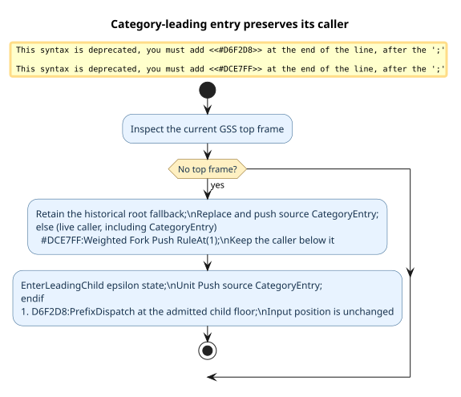

# Preserving callers in category-leading WPDA rules

The weighted pushdown automaton (WPDA) uses a grammar rule's first category-valued operand to choose a prefix transition. That operand can be requested at a category-entry seed or inside another rule's live continuation. These are different stack situations even when the same token and production are selected.



Let `CE(C)` mean a category-entry frame for category `C`, `R(r,1)` the real continuation of rule `r` after its first operand, `K` any live caller frame, and `S` the remaining stack. A category entry is itself a live Pratt continuation: after one leading rule closes, it may need to recognize a lower-precedence infix operator. The original replacement route discarded it:

```math
\mathrm{CE}(C)\cdot S
\longrightarrow
\mathrm{CE}(A)\cdot R(r,1)\cdot S.
```

At every present caller, including `CE(C)`, replacement would discard `K`. The preserving route uses two existing push operations:

```math
K\cdot S
\xrightarrow{\;w_r\;}
R(r,1)\cdot K\cdot S
\xrightarrow{\;1\;}
\mathrm{CE}(A)\cdot R(r,1)\cdot K\cdot S.
```

Here `A` is the source category, `w_r` is the authored rule weight, and `1` is the semiring identity. Neither transition consumes a token. The child's Pratt floor is the floor admitted by the original dispatch policy: generated grammars retain their existing zero-floor behavior, while installed grammars retain the checked explicit floor. The existing `RuleAt(1)` continuation resumes the rule after its child returns; the preserved `CE(C)` can then continue the Pratt loop. A fabricated `RuleAt(0)` cannot stage this call: the walker treats that slot as a receiver-scope reset.

The transition is a small continuation protocol. In the pseudocode, `top` is the current graph-structured-stack (GSS) frame, `r` is the selected production, and `floor` has already passed the existing admission check:

```text
leading_entry(top, r, source, floor, position):
    if top is absent:
        replace top with RuleAt(r, 1) and push CategoryEntry(source)
    else:
        fork-push RuleAt(r, 1) with authored weight of r
        enter EnterLeadingChild(source, floor)
        push CategoryEntry(source) with unit weight
    dispatch Prefix(source, floor, position)
```

The implementation is deliberately a shared transition, not a Regex-specific recognizer. `prefix::leading_category_branch_with_weight` preserves any present frame. Generated singleton/fork emission, owned singleton/fork routing, and both lexical-alternative branches call it. If a root/recovery call has no top frame, it retains the prior direct action shape; that fallback is not treated as a live caller. The preserving branch uses the walker's weighted `ForkActionKind::Push`, whose canonical-GLL path carries the rule factor into the shared packed parse forest. `prefix::enter_leading_child` then issues the unit-weight `WpdaStepAction::Push`. The walker gives the intermediate state an identity containing source category and floor; recovery rebases no embedded position because the state contains none. Both steps use the existing iterative GSS/SPPF descent and resource checks.

The local Rocq model, [`LeadingCategoryContinuation.v`](../../../formal/rocq/prattail_wpda_runtime/theories/LeadingCategoryContinuation.v), proves stack restoration for arbitrary callers, the category-entry continuation counterexample to the old route, receiver and boundary behavior, unchanged position, ordered single occurrence of the authored weight, and preservation of each enumerated predecessor. The existing [`OwnedExplicitPrattLevels.v`](../../../formal/rocq/runtime_grammar/theories/OwnedExplicitPrattLevels.v) proves the installed binding-power representation and admission law; this transition consumes its checked floor rather than deriving a second precedence rule. The caller-preservation lemmas are kernel-checked but do not by themselves verify Rust, first-parent GSS summaries, SPPF packing, recovery replay, or resource exhaustion. Exact-family generated/owned parity and installed-parser tests are separate executable obligations; accepting one parse alone is insufficient.

The ranked Regex witnesses are `a|aa`, whose intended tree is `PAlt(a, PConcat(a,a))`, and `aa|a`, whose intended tree is `PAlt(PConcat(a,a),a)`. The old `ReplaceAndPush` at the right operand of `PAlt` overwrote a `Return`; at the root of `aa|a` it overwrote the category entry before the trailing `|` could be considered. The same transition family must also retain `a|ab` and all previously valid generated readings, including their weights. A result cap or successful best parse is not evidence of that property.
