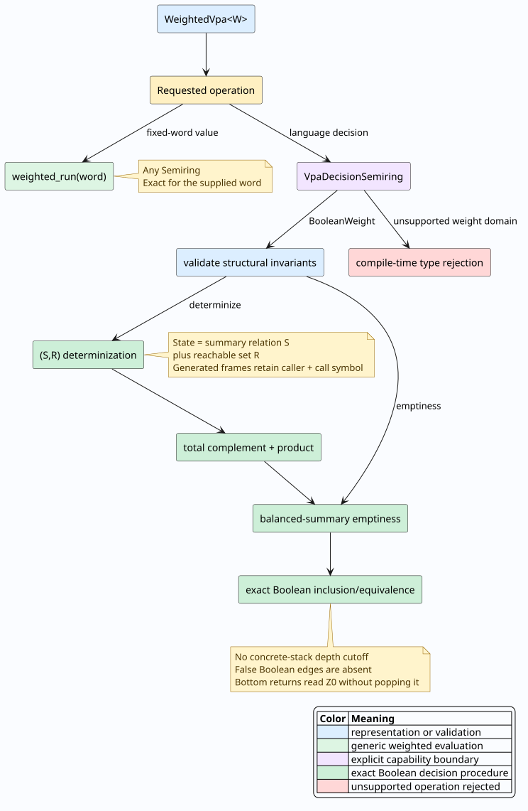

# Weighted visibly pushdown automata

## Purpose and supported boundary

PraTTaIL represents nested-word behavior with `WeightedVpa<W>`. The input
alphabet is partitioned into call, return, and internal symbols. Calls push,
returns inspect the top stack symbol and normally pop it, and internal symbols
leave the stack unchanged.

The module deliberately separates two capabilities:

- `weighted_run` evaluates a fixed word over every implemented `Semiring`.
- Exact determinization, emptiness, complement, equivalence, and inclusion are
  support-language operations. They are exposed through
  `VpaDecisionSemiring`, whose implemented decision domain is
  `BooleanWeight`.

Idempotence alone is not a sufficient theorem for quantitative weighted-VPA
determinization or inclusion. Tropical, counting, log, and other weights remain
valid for run evaluation, but their quantitative languages are not silently
projected or compared by the decision API.



## Vocabulary and semantics

Let the visibly pushdown alphabet be the disjoint triple
$`\widetilde{\Sigma}=(\Sigma_c,\Sigma_r,\Sigma_i)`$. A weighted VPA is
$`M=(Q,\widetilde{\Sigma},\Gamma,\delta,Q_0,Z_0,F)`$, where:

- $`Q`$ is a finite state set;
- $`\Gamma`$ is the stack alphabet;
- $`Z_0`$ is the permanent bottom marker;
- $`Q_0`$ and $`F`$ are the initial and final states;
- $`\delta_c`$, $`\delta_r`$, and $`\delta_i`$ are call,
  return, and internal transitions.

PraTTaIL uses final-state acceptance: a run accepts when it finishes in
$`F`$, regardless of residual frames above $`Z_0`$. This admits
pending calls, as standard VPA semantics may do.

A return has two cases:

1. Above the bottom, it reads the top frame and pops that frame.
2. At the bottom, it reads $`Z_0`$ and leaves $`Z_0`$ in place.

Consequently, any number of declared bottom-return transitions may run in
sequence. An unknown input symbol has no classification, so every current
configuration dies. A transition whose Boolean weight is false is absent from
the support language.

## Representation invariants

`validate()` checks the invariants required by exact decision procedures:

- the three alphabet partitions are pairwise disjoint;
- each public state ID equals its vector index;
- all state references exist;
- every transition key uses a symbol of the corresponding class;
- a nonzero call transition never pushes the reserved bottom marker.

`try_is_language_empty()` returns `VpaValidationError` for invalid public
representations. Convenience operations that return a plain automaton or
`bool` panic with an explanatory message rather than compute from malformed
input.

## Exact emptiness without a depth cap

The number of VPA states does not bound nesting depth. A three-state VPA can
accept arbitrarily deep balanced words. Concrete-stack breadth-first search
with a cutoff such as $`4|Q|+2`$ is therefore incomplete.

PraTTaIL computes the least balanced summary relation
$`B\subseteq Q\times Q`$. A fact $`B(p,q)`$ means that some
well-matched word moves from $`p`$ to $`q`$ without changing the
surrounding stack. Saturation closes $`B`$ under:

- identity;
- nonzero internal edges;
- relational composition;
- a call and same-stack-symbol return wrapped around an existing summary.

The finite relation then supports two reachability phases:

- **ground reachability** uses balanced summaries and bottom returns;
- **above-bottom reachability** additionally uses unmatched calls.

The language is nonempty exactly when an active accepting state is reachable
in the second phase. The algorithm never enumerates a concrete stack.

```text
EXACT-EMPTY(M)
  validate M
  B <- least relation containing identity and active internal edges
  saturate B under composition and same-gamma call/B/return wrapping

  G <- active initial states
  close G under B and active returns that read Z0

  P <- G
  close P under B and active calls whose frames may remain unmatched

  return no active final state occurs in P
```

## Exact determinization

Ordinary powerset construction is unsound for VPAs: two call branches can push
different stack symbols, and a later return must be correlated with the branch
that actually pushed its symbol.

Each deterministic state is a pair $`(S,R)`$:

- $`S\subseteq Q\times Q`$ records well-matched summaries since the
  current unmatched call;
- $`R\subseteq Q`$ records currently reachable source states.

The initial state uses the identity relation and active initial states.
Internal input advances both components. A call pushes an encoding of the
caller deterministic-state ID together with the call symbol, resets $`S`$
to identity, and advances $`R`$. A matched return pops that generated frame
and constructs a bridge with one shared stack-symbol witness:

```math
U(p,q) \iff
\exists c,e,\gamma.\;
  \delta_c(p,a,\gamma,c)
  \land S_{nested}(c,e)
  \land \delta_r(e,b,\gamma,q).
```

The successor is
$`(S_{caller}\circ U,\;R_{caller}\circ U)`$. Reusing the same
$`\gamma`$ in both transition predicates prevents cross-branch false
acceptance. A bottom return instead advances the current pair through
$`Z_0`$ transitions and keeps the generated bottom marker.

Every declared symbol receives one successor. Empty reachability is interned
as a canonical nonaccepting dead state, so the output is total as well as
deterministic. With $`n=|Q|`$, the classical worst-case state bound is
$`2^{n^2+n}`$, not $`2^n`$.

## Inclusion, equivalence, and complement

For Boolean support languages:

```math
L(A)\subseteq L(B)
\iff
L(A)\cap\overline{L(B)}=\varnothing.
```

PraTTaIL first aligns both automata to the union alphabet. This must happen
before complementing $`B`$; otherwise a symbol absent from $`B`$ would
not be routed to its deterministic dead state. Complement determinizes and
flips final states. Intersection uses product states and length-prefixed product
stack symbols, avoiding collisions between arbitrary user stack-symbol names.
Equivalence is mutual inclusion.

## Weighted execution versus language decisions

| Operation | Weight domain | Meaning |
|---|---|---|
| `weighted_run(word)` | any `Semiring` | Semiring sum of accepting-run products |
| `validate()` | any `Semiring` | Structural representation validation |
| `determinize()` | `VpaDecisionSemiring` | Exact support-language determinization |
| `weighted_determinize()` | `VpaDecisionSemiring` | Compatibility name for the same exact support construction |
| `weighted_inclusion()` | `VpaDecisionSemiring` | Exact support-language inclusion |
| `try_is_language_empty()` | `BooleanWeight` | Validated exact Boolean emptiness |
| `check_inclusion()` | `BooleanWeight` | Exact Boolean language inclusion |
| `check_equivalence()` | `BooleanWeight` | Exact Boolean language equivalence |

`is_deterministic()` checks partial determinism: one initial state and at most
one target for every stored key. It does not claim totality. Automata returned
by `determinize()` are total by construction.

## Valid Rust example

```rust
use std::collections::HashSet;

use mettail_prattail::automata::semiring::{BooleanWeight, Semiring};
use mettail_prattail::vpa::{check_equivalence, Vpa, VpaAlphabet};

let alphabet = VpaAlphabet::new(
    HashSet::from(["(".to_string()]),
    HashSet::from([")".to_string()]),
    HashSet::from(["x".to_string()]),
);
let mut vpa = Vpa::new(alphabet);
let start = vpa.add_state(Some("start".into()));
let nested = vpa.add_state(Some("nested".into()));
vpa.initial_states.insert(start);
vpa.accepting_states.insert(start);
vpa.call_transitions.insert(
    (start, "(".into()),
    vec![(nested, "paren".into(), BooleanWeight::one())],
);
vpa.internal_transitions.insert(
    (nested, "x".into()),
    vec![(nested, BooleanWeight::one())],
);
vpa.return_transitions.insert(
    (nested, ")".into(), "paren".into()),
    vec![(start, BooleanWeight::one())],
);

assert!(vpa.weighted_run(&["(", "x", ")"]).0);
let deterministic = vpa.determinize();
assert!(deterministic.is_deterministic());
assert!(check_equivalence(&vpa, &deterministic));
```

## Diagnostics and operational limits

V05 reports an invalid/conflicting visible alphabet classification. V06 is a
complexity advisory for a large VPA that cannot enter the exact Boolean
decision pipeline; it is not evidence that inclusion was attempted or failed.
Neither diagnostic authorizes approximate language decisions.

Determinization is exponential in the worst case and may require memory
proportional to the reachable subset of the $`2^{n^2+n}`$ state space.
Exact emptiness avoids that determinization when used directly, but summary
saturation is still polynomial in the finite transition/state relations.
Callers should validate and trim structural overapproximations before
determinizing large models.

## Verification evidence

- `VpaClosureProperties.v` models final-state acceptance, complement, and
  product intersection.
- `VpaReachability.v` defines the least balanced summaries, normalizes every
  concrete run into ground reachability plus unmatched frames, and proves
  summary nonemptiness equivalent to operational final-state nonemptiness.
- `VpaDeterminization.v` proves the transition equations, same-stack-symbol
  witness invariant, cross-gamma exclusion, bottom-return equation, and update
  totality.
- `vpa_decision_soundness.rs` converts these invariants into adversarial
  examples and property checks against independent bounded oracles.

The Rocq files contain no axioms or admissions. Executable array/work-queue
refinement is additionally checked by property tests; the mathematical
emptiness abstraction itself is proved sound and complete.

## References

- Rajeev Alur and P. Madhusudan, “Visibly Pushdown Languages,” STOC 2004,
  pp. 202–211. [DOI: 10.1145/1007352.1007390](https://doi.org/10.1145/1007352.1007390).
- Rajeev Alur and P. Madhusudan, “Adding Nesting Structure to Words,”
  *Journal of the ACM* 56(3), 2009.
  [DOI: 10.1145/1516512.1516518](https://doi.org/10.1145/1516512.1516518).
