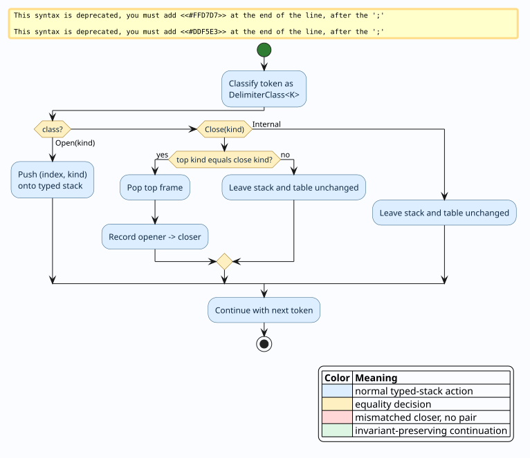

# VPA Nesting and Explicit Recovery Policy

## Status and correction

A visibly pushdown automaton (VPA) does **not** acquire a finite nesting-depth
bound from its number of control states. An earlier version of this document
claimed otherwise and used a pigeonhole argument to derive a recovery ceiling.
That claim was false. The implementation no longer exposes
`VpaAnalysis.max_nesting_bound`, and `PipelineAnalysis` no longer carries or
forwards such a value.

`RecoveryConfig::vpa_nesting_ceiling` remains available, but it is an explicit
application or resource policy. It defaults to `None`; it is not inferred from
a VPA and it is not a theorem about the grammar.

## 1. Why state count does not bound nesting

A VPA configuration contains both a finite control state and an unbounded
stack. Repeating a control state at two call positions does not repeat the
configuration because the stacks can differ.

The three-state VPA returned by `construct_vpa()` gives a direct counterexample.
For every natural number $`n`$, it accepts the well-matched word
$`\texttt{(}^{n}\texttt{)}^{n}`$, whose maximum delimiter depth is $`n`$.
Consequently, for every proposed bound $`B`$, choosing $`n = B + 1`$ produces
an accepted word deeper than $`B`$.

```math
\forall B \in \mathbb{N}.\; \exists w.\;
w \in L(A_{\mathrm{balanced}}) \land \operatorname{depth}(w) > B
```

The old pigeonhole proof failed at two steps:

1. Equal control states were treated as equal configurations, discarding the
   stack.
2. The input between two call positions was assumed to be well matched. It can
   instead add stack frames. Pumping such a segment demonstrates unbounded
   depth; it does not establish a maximum depth.

This distinction is central to VPA theory: visibly controlled stack actions
recover closure and decidability properties without making the stack bounded.

## 2. Explicit recovery ceiling

A caller may still impose a ceiling $`C`$ for operational reasons such as an
interactive latency budget, an application-specific syntax restriction, or a
defensive resource limit. Such a ceiling belongs to policy:

```rust
let mut config = RecoveryConfig::default();
config.vpa_nesting_ceiling = Some(64); // explicit application policy
```

The recovery cost calculation applies the existing factor only when the caller
sets a ceiling and the current depth exceeds it:

```math
m_{\mathrm{policy}}(d, C) =
\begin{cases}
0.3 & \text{if } C \text{ is configured and } d > C,\\
1.0 & \text{otherwise.}
\end{cases}
```

This factor changes recovery ranking; it does not reject input and does not
claim that a deeper input is outside the VPA language.

### Literate pseudocode

```text
procedure APPLY-EXPLICIT-DEPTH-POLICY(base_multiplier, depth, configured_ceiling)
  multiplier := base_multiplier

  if configured_ceiling is Some(ceiling) and depth > ceiling then
    multiplier := multiplier * 0.3
  end if

  return multiplier
end procedure
```

The procedure is constant time and preserves the pre-existing multiplier when
the policy is absent.

## 3. Typed delimiter pairing is a separate guarantee

`build_skip_table()` does establish exact local structural guarantees. Its
classifier returns `DelimiterClass<K>`, where $`K`$ identifies a delimiter
pair. The runtime stack stores `(index, kind)` frames. A closer pops and records
a pair only when its kind equals the top frame's kind.

For example, `(]` yields no pair. In `([)])`, the premature `)` does not destroy
the `[` frame: `[` pairs with `]`, and the final `)` can then pair with `(`.
This policy keeps all recorded pairs same-kind, ordered, unique in their closer,
and laminar.



## 4. Verification and executable invariants

The Rocq artifact
`formal/rocq/mathematical_analyses/theories/VpaDelimiterSoundness.v` proves:

- a mismatched closer preserves the stack and emits no pair;
- a matched closer emits a same-kind pair;
- an emitted pair is ordered when the stored opener index precedes the closer;
- well-matched words have unbounded possible leading-call depth.

The executable test suite converts those obligations into unit and property
tests. It compares `build_skip_table()` with an independent typed-stack oracle
and checks same-kind pairing, order, closer uniqueness, and laminarity over
arbitrary token streams.

## 5. Implementation map

| Concern | Source | Semantics |
|---|---|---|
| VPA analysis | `prattail/src/vpa.rs` | Reports determinism, alphabet mismatches, and state count; no depth bound |
| Typed pairing | `build_skip_table()` in `prattail/src/vpa.rs` | Pairs only equal delimiter kinds in one linear pass |
| Explicit policy | `prattail/src/recovery/config.rs` | Stores an optional caller-selected ceiling; default `None` |
| Cost application | `prattail/src/recovery/context.rs` | Applies the `0.3` factor only when the explicit ceiling is exceeded |
| Properties | `prattail/tests/vpa_delimiter_soundness.rs` | Checks the executable invariants against an independent oracle |

## References

1. Rajeev Alur and P. Madhusudan, “Visibly Pushdown Languages,” *STOC
   2004*, pp. 202–211. [doi:10.1145/1007352.1007390](https://doi.org/10.1145/1007352.1007390).
2. Rajeev Alur and P. Madhusudan, “Adding Nesting Structure to Words,”
   *Journal of the ACM* 56(3), 2009.
