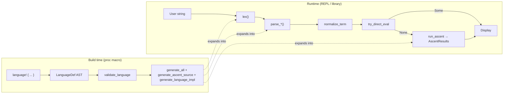

# MeTTaIL Developer README

This file explains the project for people who need to **change** the framework or **add** languages—not only use them.  
Think of this project as a **language factory** + **language runner**:

- **Build-time pipeline** = factory: turns your `language! { ... }` definition into Rust code (expanded at compile time).
- **Runtime pipeline** = runner: takes user text and computes results using parser + normalization + optional direct eval + Ascent (rewrites/equations).

---

## Table of contents

1. [End-to-end picture](#end-to-end-picture)
2. [Background technologies](#background-technologies)
3. [Part 1: Build-time pipeline](#part-1-build-time-pipeline-compile-language-dsl-into-rust-code)
4. [Part 2: Runtime pipeline](#part-2-runtime-pipeline-user-input--parseevaluate--results)
5. [Guide: defining a language theory](#guide-defining-a-language-theory)
6. [Where to change what (cookbook)](#where-to-change-what-cookbook)
7. [Adding a new language to the REPL](#adding-a-new-language-to-the-repl)
8. [Generated artifacts on disk](#generated-artifacts-on-disk)
9. [Project map](#project-map-one-line-purpose-per-crate)
10. [Glossary](#glossary-quick-newbie-terms)

---

## End-to-end picture




The macro crate (`mettail-macros`) parses and validates the DSL, then **quotes** large chunks of Rust (AST types, `Display`, substitution, parser functions, and an `ascent!` program). The `languages` crate contains modules that invoke `language!`; compiling that crate is what runs the factory.

**Deeper:** Expanding `language!` happens while compiling the crate that contains it (e.g. `mettail-languages`). `cargo expand` (or `rustc` with the right flags) can show the expanded Rust for debugging. Generated names follow predictable patterns (`{Name}Language`, `parse_{Category}`, relations from `macros/src/logic/relations.rs`), so you can search the expansion for a substring from your theory when something fails late in codegen.

---

## Background technologies

This section is for developers who know Rust but may not know **Datalog**, **trampoline parsing**, or **why** the repo is split into `macros`, `prattail`, `runtime`, and generated glue.

### Rust procedural macros (`language!`), `syn`, and `quote`

A **procedural macro** is a Rust function that runs at **compile time** on a stream of tokens and returns a new token stream. The `language! { ... }` block is not interpreted by the normal Rust compiler; it is handed to `macros/src/lib.rs`, which:

1. Parses the inside of the macro with the **syn** crate (Rust token trees + custom `Parse` implementations for the DSL in `macros/src/ast/`).
2. Builds an in-memory **LanguageDef** AST.
3. Emits Rust source using **quote!** and **proc_macro2**, often as very large `TokenStream` fragments spliced together.

You never “run” the macro at runtime; you **compile** a crate that uses it, and the output is ordinary Rust types and functions inlined at the call site. That is why navigation can feel odd: the “implementation” of a language often exists only **after** macro expansion.

**Deeper:** `proc_macro2` lets the macro crate build tokens before they are converted to the compiler’s `proc_macro::TokenStream`. That matters because parser generator output is sometimes built as strings and then re-parsed. Errors in generated code show up as rustc errors in the **caller’s** crate, with spans sometimes pointing at the `language!` invocation; read the error chain to see which generated fragment failed.

---

### Ascent (Datalog-in-Rust)

**[Ascent](https://github.com/s-arash/ascent)** is a library for writing **logic programs** in Rust. You declare **relations** (like database tables) and **rules** (Horn clauses) that say when new rows should exist. The engine repeatedly applies rules until **no new tuples** appear—a **least fixpoint** (in the standard stratified / safe fragment).

**Conceptual vocabulary:**


| Idea         | Meaning                                                                                          |
| ------------ | ------------------------------------------------------------------------------------------------ |
| Relation     | Named predicate, e.g. `rw_proc(Proc, Proc)` — “second `Proc` is a one-step rewrite of the first” |
| Fact / tuple | One row in that relation                                                                         |
| Rule body    | Conditions (joins, negation as supported) that must hold                                         |
| Rule head    | New facts derived when the body holds                                                            |
| Fixpoint     | Saturation: run rules to closure                                                                 |


MeTTaIL **generates** an Ascent program from your `equations`, `rewrites`, and optional `logic { }` block. Category exploration, equality, and rewrite relations are all expressed in the same fixpoint so rewrites and equations can interact under congruence.

**Why Ascent here?** Rewriting and equality closure are **relational**: “find all pairs `(t, t')` such that…” matches Datalog’s sweet spot (joins on subterms, indexed matching). The alternative would be hand-written graph exploration in Rust; Ascent gives a declarative layer and a mature incremental engine.

**Inspection:** when you build `mettail-languages`, see `languages/src/generated/<language>-datalog.rs` for a readable dump of the generated theory (not used for compilation).

**Deeper:** Stratified negation means “not” is only allowed in layers where the engine can prove the program has a unique least fixpoint. MeTTaIL-generated theories are usually positive recursions over term structure plus user rewrites; if you add negation in `logic { }`, stay within patterns Ascent accepts. Performance is dominated by join size—large languages produce many `proc(t)`/`rw_*(…)` tuples. The “core” Ascent split (when enabled) trims rules for inputs that only use a subset of categories to shorten fixpoint time.

---

### Datalog-style queries (`mettail-query`)

The **`query/`** crate is a **small query layer on top of materialized `AscentResults`**, not a second Ascent instance. After `run_ascent`, relations and tuples are copied into `AscentResults` (including **custom relations** from your `logic { }`). A rule string is parsed, planned, and executed as joins/filters over that snapshot.

If you know SQL: think “read-only analytics on tables populated by Ascent.” If you know Datalog: same spirit, with a schema inferred from `custom_relations` (`query/src/run.rs`, `query/src/data_source.rs`).

**Deeper:** Queries see **stringified** term representations in relation rows (what was extracted for the REPL), not raw Rust AST pointers. That keeps the query engine language-agnostic but means you reason about **display** equality, not pointer identity. Custom relations you want to query must be listed for extraction (see relation declarations in `logic { }` and `list_all_relations_for_extraction` in `macros/src/logic/relations.rs`).

---

### PraTTaIL (parser + lexer codegen in this repo)

**PraTTaIL** is the **MeTTaIL parser generator**: the `prattail/` crate. The name reflects the design: **Pratt** parsing (precedence climbing / binding powers for mixfix operators) combined with **generated lexers**, **recursive-descent** pieces for binders and awkward syntax, and supporting infrastructure.

**Pratt parsing (very short):** Each token has **binding powers** (left/right). The parser reads a **prefix** (operand or prefix operator), then while the next operator “binds tighter” than the caller’s minimum, it consumes **infix** operators and right-hand sides. That yields correct precedence without a separate precedence table phase for every expression shape.

**LanguageSpec:** The macro AST (`LanguageDef`) is **lowered** in `prattail_bridge.rs` to a flatter `LanguageSpec`: categories, syntax items, and rule inputs. PraTTaIL classifies rules (infix, cast, etc.) and runs the **pipeline** in `prattail/src/pipeline.rs` (lexer bundle → parser bundle → Rust source strings → `TokenStream`).

**What PraTTaIL does *not* do:** It does not implement your rewriting semantics; it only produces **lex**, **parse_<Category>**, and helpers. Equations and `~>` are entirely in Ascent codegen (`macros/src/logic/`).

**Deeper:** The bridge injects **synthetic** rules (bare identifiers as variables, collection literals, etc.) so user-written `terms { }` do not have to repeat boilerplate. Changing **only** PraTTaIL cannot add a new `language!` keyword—the DSL is defined in `macros/src/ast/`. Conversely, changing **only** `terms { }` often suffices to fix parse errors because it reshapes `LanguageSpec` and thus the whole lexer/parser product.

---

### Trampoline parsers (`prattail/src/trampoline.rs`)

Naive **mutual recursion** (`parse_A` calls `parse_B` calls `parse_A` …) uses the **call stack**. For very deep or pathological inputs, that can **overflow the stack**.

A **trampoline** parser **replaces recursion with an explicit stack of continuations** (frames) on the **heap**. The generated `parse_Cat` loops: alternate “parse a prefix / push frame” with “infix loop and unwind.” Tail-like situations avoid redundant frames. Deeply nested terms then consume heap, not fixed stack depth—see the module docs in `trampoline.rs` (“Stack-safe trampolined parser generation”).

MeTTaIL’s generated parsers use this codegen path so the REPL and tests are robust on large nestings. **Recovery** variants (`*_recovering`) extend the same idea for partial error recovery.

**Deeper:** Each category gets a generated `Frame_Cat` enum that records “what to do next” instead of nesting calls. The tradeoff is more generated code size and a more complex generator, but predictable memory behavior for adversarial depths. Very complex collection rules (e.g. certain ZipMapSep+binder shapes) may still use standalone recursive-descent helpers rather than the full trampoline split—see `is_simple_collection` / `has_zipmapsep` logic in `trampoline.rs`.

---

### Lexer generation (`prattail/src/automata`, `lexer.rs`)

The lexer is **generated** from the terminals implied by the grammar (literals, keywords, punctuation). Conceptually: extract character classes and patterns, build automata, emit a function in the family `lex(input) -> Vec<(Token, Range)>`. You do not hand-write token kinds for each language; they fall out of `LanguageSpec` plus literal configuration from the DSL (`literals { ... }`, bridge).

**Deeper:** Literal token definitions in `literals { }` supply **regex-like patterns** and Rust `eval` blocks; the lexer generator merges these with punctuators and keywords derived from quoted `"..."` fragments in `terms { }`. Ambiguity between two literal classes (overlapping regexes) shows up as wrong tokens first—narrow patterns or reordering may be needed. The bridge may add collection delimiters as terminals when you declare `List`/`Bag`/`Map` with `[ open, close, sep ]`-style syntax in `types { }`.

---

### FIRST/FOLLOW, dispatch, and prediction (`prattail/src/prediction.rs`, `dispatch.rs`)

**LL-style parsing** needs to decide **which rule** to try from the **next tokens**. **FIRST** sets approximate “what token can start this construct”; **FOLLOW** sets help with error recovery and conflict reporting. PraTTaIL computes these to:

- Choose between ambiguous prefix alternatives where possible  
- Emit **warnings** for risky grammars  
- Support optional **WFST / beam** features (feature-gated) for disambiguation

You rarely edit this when adding a language; you feel it when the grammar is ambiguous and the generator warns or picks a disambiguation.

**Deeper:** Cross-category dispatch (`dispatch.rs`) matters when the **same** token sequence could start multiple categories; FIRST/FOLLOW overlap diagnostics tell you “reduce/reduce” risk before runtime. The optional WFST path uses weights to rank parses—see `language!` `options { beam_width: ... }` and feature flags in the workspace `Cargo.toml`.

---

### `moniker` and binding-aware terms

**[moniker](https://github.com/brendanzab/moniker)** is a Rust library for **names, binding, and α-equivalence**. Generated AST nodes use moniker-style variables for **bound** names (lambdas, pattern binders).

MeTTaIL’s **substitution** codegen (`macros/src/gen/term_ops/subst.rs`) must **avoid capture**: substituting `N` into `^x.M` must not let free variables in `N` become accidentally bound by `x`. Moniker-style abstractions make that implementable in generated code.

If you have only used `String` for variable names in interpreters, think of moniker as the difference between “rename symbols” and “respect binder scope.”

**Deeper:** Generated `subst`/`open`/`close` operations follow the shape of each AST variant. If you add a binder form in `terms { }`, codegen must know how substitution walks under it—most binder shapes come from the `^x.body:[Dom -> Cod]` family already handled in `macros/src/gen/term_ops/subst.rs`. Getting this wrong shows up as “variable not captured” bugs in the REPL, not parse errors.

---

### Runtime glue: `Term`, `Language`, and `AscentResults`

**Runtime glue** is the **interface layer** between:

- **User-facing code** (REPL, tests, binaries) that wants to treat languages uniformly, and  
- **Generated per-language code** (concrete AST enums, Ascent structs, parse functions).

The shared **`runtime/`** crate defines:

- **Term:** `dyn`-compatible trait (`clone_box`, `term_id`, `Display`, …) so the REPL can hold `Box<dyn Term>` without knowing `RhoCalc` vs `Calculator`.
- **Language:** parse, normalize, `try_direct_eval`, `run_ascent`, environment APIs, type inference hooks—all implemented by **generated** `{Name}Language` in `macros/src/gen/runtime/language.rs`.
- **AscentResults:** a **portable snapshot** (terms as display strings + IDs, rewrite edges, equivalence classes, custom relation tables) so Ascent internals do not leak into the REPL.

**Why glue?** Without it, every tool would depend on every `languages::rhocalc::*` type. The traits make **one** REPL and **one** query engine possible; new languages register behind `Box<dyn Language>` (`repl/src/registry.rs`).

**Deeper:** `term_id` is typically a hash of the term’s structure (see generated `impl Term`), so logically equal terms might get different IDs across runs if hashing includes allocation details—treat IDs as **session-local** handles into `AscentResults`. Multi-category languages wrap values in `{Name}TermInner` enums; `parse_term` picks the primary category or uses the language’s entry points as implemented in `generate_language_impl`.

---

### Blockly and visual blocks

**Blockly** output (`macros/src/gen/blockly/*`) generates **TypeScript** block definitions for a visual editor. It is independent of Ascent and parsing semantics: it mirrors the language surface for another UI.

**Deeper:** Blockly generation walks the same `LanguageDef` as the rest of codegen but emits `.ts` for a different consumer. Failures to write block files are usually non-fatal (`eprintln!` in `macros/src/lib.rs`). If blocks drift from real parseable syntax, fix the block generator templates in `macros/src/gen/blockly/`, not the PraTTaIL grammar, unless the surface form itself changed.

---

### Other names you may see


| Name                              | What it is                                                                                                                                       |
| --------------------------------- | ------------------------------------------------------------------------------------------------------------------------------------------------ |
| **Stratification**                | Datalog concept: negation layered so fixpoint is well-defined; Ascent enforces sensible fragments.                                               |
| **Congruence**                    | Rules that lift rewrites/equalities **under** constructors (if inner changes, outer does too).                                                   |
| **WFST**                          | Weighted finite-state transducer; optional feature in PraTTaIL for weighted lexing / disambiguation (`wfst` feature).                            |
| `ascent_source!` vs `ascent!` | MeTTaIL uses both shapes: string/source forms for debugging/export; the generated language embeds a compiled `ascent!` program for `run_ascent`. |


---

## Part 1: Build-time pipeline (compile `language!` DSL into Rust code)

### 0) Orchestrator: what runs, in what order

The procedural macro entry point is `macros/src/lib.rs`. For each `language!` invocation it does, in order:

1. **Parse** the token stream into `LanguageDef` (`syn` custom parser in `macros/src/ast/language.rs`).
2. **Validate** (`macros/src/ast/validation/validator.rs` and related) — well-formedness of types, terms, patterns, binding, etc.
3. **`generate_all`** (`macros/src/gen/mod.rs`) — AST enums, term ops, display, env, eval, **inline PraTTaIL parser** (see below).
4. **`generate_freshness_functions`** (`macros/src/logic/rules.rs` and friends) — helpers used by generated Ascent clauses.
5. **`generate_ascent_source`** (`macros/src/logic/mod.rs`) — relations + category + equation + rewrite rules + optional `logic { ... }` body; also writes a debug `.rs` file (see [Generated artifacts](#generated-artifacts-on-disk)).
6. **`generate_metadata`** (`macros/src/gen/runtime/metadata.rs`) — static descriptions for REPL/help.
7. **`generate_language_impl`** (`macros/src/gen/runtime/language.rs`) — `{Name}Term`, `{Name}Language`, `impl Language for ...`, wiring Ascent run + extraction into `AscentResults`.
8. **Blockly** (`macros/src/gen/blockly/`) — optional TS emit to `languages/src/generated/`.

Everything is concatenated into one `TokenStream` returned from the macro (except Blockly files, which are written explicitly).

**Deeper:** Failures in step 3 often look like Rust type errors in generated parsers (PraTTaIL). Failures in step 5–7 often look like Ascent compile errors (“stratification”, missing relation) or mismatches between extracted relations and the `AscentResults` packer—use `*-datalog.rs` to read the actual rules the engine sees.

---

### 1) Starting point: you write a language

Typical locations:

- `languages/src/rhocalc.rs`
- `languages/src/calculator.rs`
- `languages/src/lambda.rs`
- `languages/src/ambient.rs`

Each file uses:

```rust
language! {
  name: MyLang,
  types { ... },
  terms { ... },
  equations { ... },
  rewrites { ... },
  logic { ... }   // optional: extra Ascent relations/rules (verbatim)
}
```

**Mental model:** you declare algebraic sorts (`types`), constructors and concrete syntax (`terms`), when two terms are equal (`equations`), and directed rewrite steps (`rewrites`). Optional `logic { }` injects raw Ascent into the same fixpoint program.

Section-by-section syntax and semantics are in [Guide: defining a language theory](#guide-defining-a-language-theory).

---

### 2) Macro entry point


| Item                            | Location            |
| ------------------------------- | ------------------- |
| `#[proc_macro] pub fn language` | `macros/src/lib.rs` |


This is the only procedural macro exported for defining languages. Submodules: `ast`, `gen`, `logic`.

---

### 3) DSL parsing and AST (`LanguageDef`)


| Concern                                                                                 | Primary files                                                                 |
| --------------------------------------------------------------------------------------- | ----------------------------------------------------------------------------- |
| Top-level `language!` parse (`LanguageDef`, `Equation`, `RewriteRule`, `LogicBlock`, …) | `macros/src/ast/language.rs`                                                  |
| Grammar rules (`terms { ... }`)                                                         | `macros/src/ast/grammar.rs`                                                   |
| Patterns on LHS/RHS of equations and rewrites                                           | `macros/src/ast/pattern.rs`                                                   |
| Types, collections, native types                                                        | `macros/src/ast/types.rs` (and references from `language.rs`)                 |
| Validation errors                                                                       | `macros/src/ast/validation/validator.rs` (+ sibling modules in `validation/`) |


**Flow:** TokenStream → `LanguageDef` struct graph in memory. No code generation here—only structure.

**To extend DSL syntax:** you usually add/extend `Parse` implementations and structs in `macros/src/ast/`, then teach `gen/` and `logic/` about the new constructs.

---

### 4) Bridge to PraTTaIL (`LanguageSpec`)


| Item                                                | Location                                                                             |
| --------------------------------------------------- | ------------------------------------------------------------------------------------ |
| `LanguageDef` → `LanguageSpec` (structural mapping) | `macros/src/gen/syntax/parser/prattail_bridge.rs` (`language_def_to_spec`)           |
| Parser codegen from spec                            | `prattail/src/lib.rs` — `pub fn generate_parser(spec: &LanguageSpec) -> TokenStream` |
| Spec construction + classification                  | `LanguageSpec::new` and related in `prattail/`                                       |


The bridge adds **synthetic** rules (variable rules, collection literals, etc.) so that identifiers and list/bag/map syntax behave consistently with the rest of codegen.

**PraTTaIL** (`prattail/` crate) is the **lexer + Pratt/recursive-descent parser generator**. It does not know about equations or Ascent; it only consumes `LanguageSpec`.

---

### 5) Parser + lexer code generation (PraTTaIL pipeline)


| Stage                 | Role                                                                                              | Main locations                                           |
| --------------------- | ------------------------------------------------------------------------------------------------- | -------------------------------------------------------- |
| Orchestration         | Extract `LanguageSpec` → bundles → generate lexer string + parser string → parse to `TokenStream` | `prattail/src/pipeline.rs`                               |
| Lexer                 | Terminals, regex/NFA/DFA-style tables, `lex()`                                                    | `prattail/src/automata/`*, `prattail/src/lexer.rs`       |
| Pratt / mixfix        | Binding power, infix/prefix dispatch                                                              | `prattail/src/pratt.rs`, `prattail/src/binding_power.rs` |
| Recursive descent     | Lambdas, `$name`, collection-heavy constructs                                                     | `prattail/src/recursive.rs`                              |
| Trampoline / recovery | Stack-safe parsing, error recovery entrypoints                                                    | `prattail/src/trampoline.rs`                             |
| Dispatch / prediction | FIRST/FOLLOW, warnings, optional WFST-related paths                                               | `prattail/src/dispatch.rs`, `prattail/src/prediction.rs` |


**Emitted in the expanded crate (per language):** functions such as `lex`, `parse_<Category>`, `parse_<Category>_recovering`, and category `impl` methods wired in `macros/src/gen/mod.rs` (`generate_prattail_category_parse_impls`).

**To change how text becomes tokens:** work in `prattail` lexer paths or literal patterns (also influenced by `literals { ... }` in the DSL and bridge mapping).

**To change how tokens become AST:** work in PraTTaIL parser generation, or adjust grammar rules in `terms { }` so the spec changes (often the first lever).

---

### 6) Rewrite / equation engine codegen (Ascent)


| Concern                                                           | Location                                                         |
| ----------------------------------------------------------------- | ---------------------------------------------------------------- |
| Orchestrator                                                      | `macros/src/logic/mod.rs` — `generate_ascent_source`             |
| Relation declarations (`proc`, `eq_proc`, `rw_proc`, `fold_`*, …) | `macros/src/logic/relations.rs`                                  |
| “Explore” category facts, deconstruct terms                       | `macros/src/logic/categories.rs`                                 |
| Equations + congruence for `=`                                    | `macros/src/logic/equations.rs`, `macros/src/logic/congruence/*` |
| Rewrites `~>` + congruence                                        | `macros/src/logic/rules.rs`, `macros/src/logic/congruence/*`     |
| Shared naming / filters                                           | `macros/src/logic/common.rs`                                     |
| Debug file writer                                                 | `macros/src/logic/writer.rs`                                     |


**Generated model (per category, roughly):**

- **Membership:** relation `proc(Proc)`, `name(Name)`, …
- **Equality:** `eq_proc(Proc, Proc)` (equivalence closure from equations + congruence)
- **Rewrites:** `rw_proc(Proc, Proc)` (directed edges; user rewrites + congruence)
- **Custom:** anything you declare in `logic { relation r(...); ... }` plus rules using those predicates

Ascent runs to **fixpoint**: new tuples until saturation (subject to Ascent’s stratification/semantics).

**Multi-category / SCC:** for some languages, `macros/src/logic/mod.rs` also builds a **core** rule set (`core_raw_content`) for a smaller `ascent!` struct to optimize cases where only “core” categories appear (`macros/src/logic/common.rs` — `compute_core_categories`). The runtime language impl chooses how to run this (see generated `{Name}Language`).

**To change rewrite behavior:** edit `rewrites { }` / `equations { }` in the language `.rs` file. If the generator cannot express what you need, use `logic { ... }` for hand-written Ascent, or extend the codegen in `macros/src/logic/`*.

---

### 7) Types, term operations, runtime glue


| Concern                                    | Location                                                  |
| ------------------------------------------ | --------------------------------------------------------- |
| Codegen umbrella                           | `macros/src/gen/mod.rs` — `generate_all`                  |
| AST enums / variants                       | `macros/src/gen/types/enums.rs`                           |
| `Display` / pretty concrete syntax         | `macros/src/gen/syntax/display.rs`                        |
| Variable inference for parsing             | `macros/src/gen/syntax/var_inference.rs`                  |
| Substitution (including binders)           | `macros/src/gen/term_ops/subst.rs`                        |
| Normalization (beta, flatten, etc.)        | `macros/src/gen/term_ops/normalize.rs`, `flatten` helpers |
| “Ground” checks                            | `macros/src/gen/term_ops/ground.rs`                       |
| Native eval (`try_eval`, constant folding) | `macros/src/gen/native/eval.rs`                           |
| Environments (`name = term` in REPL)       | `macros/src/gen/runtime/environment.rs`                   |
| `Language` + `Term` impls, Ascent runner   | `macros/src/gen/runtime/language.rs`                      |
| Metadata                                   | `macros/src/gen/runtime/metadata.rs`                      |
| Random/exhaustive term generation (tests)  | `macros/src/gen/term_gen/*`                               |


**To change how terms print:** `macros/src/gen/syntax/display.rs` (generator), not hand-editing output.

**To change substitution or normalization:** `term_ops/`* generators.

**To change direct numeric/bool evaluation:** native types in the DSL + `macros/src/gen/native/`*.

---

### 8) Where generated files go


| Artifact                                           | When                                              | Path pattern                                                                                                      |
| -------------------------------------------------- | ------------------------------------------------- | ----------------------------------------------------------------------------------------------------------------- |
| Rust code (types, parser, Ascent, `Language` impl) | Every build                                       | **TokenStream expansion** — not a standalone `.rs` you edit; it lives inside the expanded `language!` module.     |
| Ascent source (debug / inspection)                 | When compiling the crate that invokes `language!` | `languages/src/generated/<languagename>-datalog.rs` (from `CARGO_MANIFEST_DIR`; see `macros/src/logic/writer.rs`) |
| Blockly                                            | If Blockly codegen runs                           | `languages/src/generated/<language>-blocks.ts`, `...-categories.ts` (`macros/src/gen/blockly/writer.rs`)          |


---

### Build-time mini sample (mental model)

You write:

```text
Add . a "+" b : Proc ![a + b] fold;
```

The factory tends to produce (conceptually):

- Lexer acceptance for `+`
- A Pratt rule for infix `Add` with correct binding power
- An AST variant `Proc::Add(...)` (names depend on your rule label)
- Fold/eval wiring and Ascent relations so ground arithmetic can reduce

Exact names are determined by your `terms` declaration and type names.

---

## Part 2: Runtime pipeline (user input → parse / evaluate / rewrite → results)

### 1) Runtime entry point


| Item                       | Location                                                                           |
| -------------------------- | ---------------------------------------------------------------------------------- |
| CLI / binary               | Workspace root `Cargo.toml` — `default-run = "mettail"`, binary `repl/src/main.rs` |
| Interactive loop, commands | `repl/src/repl.rs`                                                                 |
| Which languages exist      | `repl/src/registry.rs` — `build_registry()`                                        |
| Language modules           | `languages/src/lib.rs` exports `ambient`, `calculator`, `lambda`, `rhocalc`        |


Run from workspace root:

```bash
cargo run
# equivalent: cargo run --bin mettail
```

The package `mettail-repl` also declares the `mettail` binary (`repl/Cargo.toml`); the root crate delegates to it.

In the REPL:

```text
lang rhocalc
exec 3 + 4
```

---

### 2) Core runtime interfaces


| Item                                                   | Location                  |
| ------------------------------------------------------ | ------------------------- |
| `Term`, `Language`, `AscentResults`, `RelationData`, … | `runtime/src/language.rs` |


Generated `{Name}Language` implements `Language`. Key methods:

- `parse_term` / `parse_term_for_env` — parse string to `Box<dyn Term>` (env variant avoids clearing the var cache; used when building environments).
- `normalize_term` — generated normalization (beta / structure).
- `try_direct_eval` — fast path for ground native evaluation when implemented.
- `run_ascent` — runs the generated Ascent program and packs results into `AscentResults`.
- Environment APIs — backing store for `name = term` and substitution.

---

### 3) Runtime stages (`exec` / `step`) — concrete order

The implementation lives in `repl/src/repl.rs`, `exec_or_step_term`. Order:

1. **Resolve language** from `ReplState` via `LanguageRegistry`.
2. **Obtain AST**
  - If input is a single identifier-like token and `get_env_term` finds a binding, use that term (avoids misparsing env names as variables).
  - Else **`parse_term_for_env`** (still runs lexer + parser inside the generated code).
3. **Environment substitution** — if an environment is active: `substitute_env` or `substitute_env_preserve_structure` (step mode preserves shape for interactive rewriting).
4. **`normalize_term`** — generated beta / flatten behavior.
5. **Direct eval (exec only)** — if `try_direct_eval` returns `Some`, the REPL short-circuits: builds `AscentResults::from_single_term` and **does not** run Ascent.
6. **`run_ascent`** — full rewrite/equation closure; builds `AscentResults` (terms, rewrites, equivalences, `custom_relations`).
7. **Display / state**
  - **Exec:** prefers a **normal form** reachable from the start term via BFS on the rewrite graph (`AscentResults::normal_form_reachable_from`); may reparse displayed normal form back to `Box<dyn Term>` for state.
  - **Step:** keeps the **initial** term as “current” and exposes `rewrites_from` for `apply N`.

Auxiliary REPL behavior:

- **`pre_substitute_env`** — before parse, can substitute env binding **display strings** for whole identifiers so surface syntax matches grammar (e.g. boolean literals).

**Deeper:** Direct eval is a **staged** optimization: it only applies when `Language::try_direct_eval` returns `Some`, which requires native/fold support in your theory. Step mode **never** uses it so you always get a rewrite graph from the post-substitution term. Normal-form selection in exec mode is **breadth-first on rewrite IDs**, not “shortest rewrite count” or semantic cost—see `AscentResults::normal_form_reachable_from` in `runtime/src/language.rs`.

---

### 4) Runtime sample A: arithmetic

Input:

```text
exec 3 + 4
```

Typical path:

- Lexer emits literal / operator tokens.
- Parser builds an `Add(...)`-style AST (exact variant names depend on the language).
- If the language defines native fold/eval, **`try_direct_eval`** may return `7` immediately.
- Otherwise Ascent applies fold/rewrite rules until fixpoint.

---

### 5) Runtime sample B: process rewrite

Input (rho-style):

```text
{ @({}) ! ({}) | *(@({})) }
```

Typical path:

- Parse to process constructors (`PPar`, `POutput`, …).
- Normalization may simplify functional structure.
- Ascent applies `rw_*` / `eq_*` rules; congruence rules allow rewriting **inside** contexts.
- REPL reports counts from `AscentResults` and (in exec mode) picks a displayed normal form when reachable.

---

### 6) Query layer


| Item                                  | Location           |
| ------------------------------------- | ------------------ |
| Public API                            | `query/src/lib.rs` |
| `run_query(rule_str, &AscentResults)` | `query/src/run.rs` |


**Pipeline:** parse rule → plan → execute against a **data source** built from `AscentResults`, including `custom_relations` (see `query/src/data_source.rs`). The schema for queries is derived from relation signatures in those results.

**Use case:** after a big `run_ascent`, ask questions like “all terms reachable with property X” in a Datalog-like syntax (see REPL handling for lines containing `<--` in `repl/src/repl.rs`).

**Deeper:** The query engine does not re-execute your language’s Ascent rules; it only reads **what was already materialized** into `custom_relations` and the standard rewrite/equality views exposed in `AscentResults`. If a relation is missing from results, fix extraction in `generate_language_impl` / relation listing, or ensure your `logic { }` rules actually populate those tuples.

---

## Guide: defining a language theory

This guide walks through **each block** of a `language!` definition: the syntax you write, what it **means** semantically, what **goal** it serves, and how the **factory** uses it. The canonical parse order of blocks is fixed (`macros/src/ast/language.rs`, `impl Parse for LanguageDef`).

### Top-level shape and block order

```text
language! {
    name: YourLanguage,
    options { ... },       /* optional */
    types { ... },
    literals { ... },      /* optional; requires types before it */
    terms { ... },
    equations { ... },
    rewrites { ... },
    logic { ... },         /* optional */
}
```

Comma separation between major clauses follows normal Rust macro parsing (trailing commas are fine where Rust allows). If you omit optional blocks, the parser still expects `types` and typically `terms`; empty `equations { }` / `rewrites { }` are valid when you only need parsing.

**How it fits together:** `types` fixes the sorting discipline (what kinds of AST nodes exist). `terms` determines **concrete syntax** and **constructors** (and injects native/code blocks for evaluation). `literals` customizes lexer tokens for those types. `equations` and `rewrites` define **Ascent’s** equality and directed steps on those ASTs. `logic` extends Ascent with your own relations when codegen is not enough.

---

### `name:` — language identifier

**Syntax:** `name: Ident,`

**Semantics:** Becomes the Rust identifier prefix for generated items: `YourLanguage`, `YourLanguageLanguage`, `parse_Proc`, etc., and the string returned by `Language::name()`.

**Goal:** Stable human- and machine-readable label; used in REPL prompts and metadata.

**How it works:** Referenced throughout `macros/src/gen/*` and `macros/src/logic/*` for naming; Ascent debug output is written as `languages/src/generated/<lowercase>-datalog.rs`.

---

### `options { }` — rare configuration

**Syntax:** `options { key: value, ... }` where `value` is a float, integer, bool, string literal, or keyword identifier (`none`, `auto`, … depending on key).

**Semantics:** Key–value map (`AttributeValue` in `macros/src/ast/language.rs`). Known keys include PraTTaIL-related settings such as **`beam_width`** (float or `none` / `disabled` / `auto`) and **`log_semiring_model_path`** (string); **`dispatch`** controls dispatch strategy when using WFST-related features.

**Goal:** Tune parser disambiguation without forking the DSL; most small languages omit `options`.

**How it works:** Parsed into `LanguageDef.options` and read by codegen paths that care (e.g. PraTTaIL when the `wfst` feature is on). Unused keys may be accepted with less validation—extend validation if you add a new option.

---

### `types { }` — sorts, native payload types, collections

**Syntax (examples):**

```text
types {
    Proc                                    /* algebraic sort, carried in AST enum */
    ![i32] as Int                           /* sort Int with runtime payload i32 */
    ![Vec<Proc>] as List                    /* collection sort; element type in Vec<...> */
    Bag [ "{", "}", "|" ]                   /* multiset with delimiter triple for surface syntax */
}
```

- Plain `Name;` declares a **category** with no built-in Rust payload (pure algebraic).
- `![RustType] as Category` declares that AST values of `Category` carry a **native** `RustType` (integers, `bool`, `str`, custom Newtypes, etc.). This enables **`try_direct_eval`**, `fold`/`step` codegen, and native printers.
- **`List` / `Bag` / `Map`** entries can use bracket delimiter specs; internally bound to `CollectionCategory` (`macros/src/ast/language.rs`). The **native** type is usually `Vec<Elem>`, `HashBag<Elem>`, `HashMap<K,V>`.

**Semantics:** Defines the set of generated **enum variants per category**, variable forms (`IVar`, `PVar`, … from naming conventions), and what PraTTaIL treats as a **category** in `LanguageSpec`.

**Goal:** Separates “what kinds of things exist in my language” from “how to parse them” (`terms`).

**How it works:** `macros/src/gen/types/enums.rs` emits the AST; `prattail_bridge.rs` emits `CategorySpec` rows (primary category, `has_var`, optional `native_type` string); `macros/src/logic/relations.rs` emits `category(...)`, `eq_*`, `rw_*`, and optionally `fold_*` relations.

---

### `literals { }` — lexer classes for literals

**Syntax:**

```text
literals {
    Int {
        pattern: r"[0-9]+";
        eval: ![ { /* expression using `text: &str` */ } ]
    }
}
```

**Semantics:** Each entry names a **type** (must correspond to a `types` entry), provides a **regex-style pattern** string for the generated lexer, and an **`eval`** block `![ ... ]` that returns `Result<NativeValue, ()>` (or compatible) given implicit `text: &str`.

**Goal:** Let you control how numeric/string/bool literals look **without** encoding every digit as a separate `terms` rule.

**How it works:** Wired into PraTTaIL literal patterns (`LiteralSpec` → lexer codegen). See `languages/src/calculator.rs` for rich examples (BigInt, rationals, floats, strings).

---

### `terms { }` — constructors, grammar, evaluation hooks

MeTTaIL supports two styles (see `GrammarRule` in `macros/src/ast/grammar.rs`):

1. **Judgement style (preferred):**  
   `Label . context |- concrete_syntax : Category [rust_code] [eval_mode] [right] [prefix(N)] ;`
2. **Legacy BNFC style:**  
   `Label . Category ::= item item ... ;`

#### Judgement rule anatomy

- **`Label`** — constructor / variant name (becomes `Category::Label(...)` in the generated enum).
- **Context** — comma-separated binders, e.g. `n:Name, ^x.p:[Name -> Proc]`
  - Simple `x:Ty` — subtree parameter.
  - **`^x.p:[Dom -> Cod]`** — higher-order binder: `x` bound in `p` (generates moniker `Lam`/`Apply` plumbing).
  - **`^[xs].p:[Dom* -> Cod]`** — multi-binder form.
- **`|-`** — separates metasyntax (binders) from object syntax.
- **Concrete syntax** — quoted literals (`"+"`), parameter references (`a`, `p`), binders (`<Name>` in old style; in judgements abstraction is in context), collections with `ps.*sep("|")`-flavored metasyntax (`#sep`, `#map`, `#zip`, `#opt` in `SyntaxExpr`).
- **`: Category`** — sort of the whole form.
- **Optional `![expr]`** — Rust expression constructing the native or algebraic value (often refers to parameters by name). Used for **constant folding** and injections.
- **Optional `fold` or `step`** (`EvalMode` in `macros/src/ast/types.rs`)
  - **`fold`** — eager reduction via generated `![...]` when subterms are values; also ties into Ascent **`fold_*`** relations when codegen detects fold-shaped rules.
  - **`step`** — mark rules for **congruence / small-step** plumbing (useful when you must not collapse everything to a single big_fold).
- **`right`** — right-associative infix for this rule.
- **`prefix(N)`** — explicit binding power for prefix operators.

**Semantics:** Each rule contributes **both** a parser production **and** an AST constructor. Infix/nfix rules get Pratt binding powers from PraTTaIL classification.

**Goal:** Single source of truth for “what the program looks like” and “what its tree is.”

**How it works:** `prattail_bridge` lowers rules to `RuleSpecInput`; PraTTaIL emits parse functions; `macros/src/gen/types` + `display` + `subst` + `normalize` read the same `GrammarRule` list. Native `![...]` blocks feed **`macros/src/gen/native/eval.rs`** and Ascent fold generation.

---

### `equations { }` — undirected equality

**Syntax (judgement style):**

```text
RuleName . optional_type_context | optional_premises |- lhs_pattern = rhs_pattern ;
```

- **Premises** (after `|`) can include **freshness** `x # P` (“`x` not free in `P`”), **relation queries**, and **`forall`**-style iteration over collections (`Premise` in `macros/src/ast/language.rs`).
- **Patterns** on LHS/RHS use the same pattern language as rewrites (`macros/src/ast/pattern.rs`).

**Semantics:** **Equivalence** up to congruence: generated **`eq_<category>`** facts in Ascent, closed under structural rules.

**Goal:** Algebraic laws, type identifications, undefined behavior collapse—anything **symmetric** in intent.

**How it works:** `macros/src/logic/equations.rs` + `congruence` emit Ascent rules that populate `eq_*` and interact with category exploration (`categories.rs`). Equations do **not** add directed `rw_*` edges unless a rewrite also exists.

---

### `rewrites { }` — directed reduction

**Syntax:**

```text
RuleName . optional_type_context | optional_premises |- lhs_pattern ~> rhs_pattern ;
```

- **Congruence-style conditional rewrites:** premises may include **`S ~> T`** (if inner rewrites, outer can rewrite)—see `Premise::Congruence` and examples like `if S ~> T then (...)` in `README.md` / `rhocalc.rs`.

**Semantics:** **Directed** edges in **`rw_<category>`**. Congruence lifts rewrites under contexts (parsing / pattern shape determines which congruence rules are generated).

**Goal:** Operational semantics, reduction, commutations, COMM-like rules in the ρ-calculus style.

**How it works:** `macros/src/logic/rules.rs` + `congruence` generate base and lifted rules. Freshness side conditions become helper calls from `generate_freshness_functions`.

---

### `logic { }` — hand-written Ascent

**Syntax:** Inside the braces you write **Ascent** surface syntax (relations + rules) as the engine expects, plus optional **relation declarations** parsed by MeTTaIL for extraction metadata:

```text
logic { 
    relation path(Proc, Proc);
    path(x, y) <-- rw_proc(x, y);
    path(x, z) <-- rw_proc(x, y), path(y, z);
}
```

**Semantics:** Extends the **same** fixpoint program as generated equations/rewrites. Use when you need custom transitive closure, instrumentation, or relations that do not map cleanly to `~>` / `=`.

**Goal:** Escape hatch without patching `macros/src/logic/*`.

**How it works:** `RelationDecl` tuples feed `list_all_relations_for_extraction`; verbatim rule bodies are spliced into `generate_ascent_source` (`macros/src/logic/mod.rs`). Relations you query in `mettail-query` must appear in the extracted snapshot—check `macros/src/gen/runtime/language.rs` extraction if a relation is missing client-side.

---

### Minimal skeleton (new language starting point)

```rust
use mettail_macros::language;

language! {
    name: Tiny,
    types {
        ![i32] as Int
        Expr
    },
    literals {
        Int {
            pattern: r"[0-9]+";
            eval: ![ { text.parse::<i32>().map_err(|_| ()) } ]
        }
    },
    terms {
        Lit . n:Int |- n : Expr ;
        Add . a:Expr, b:Expr |- a "+" b : Expr ;
    },
    equations { },
    rewrites { },
}
```

Grow this toward full examples: `languages/src/calculator.rs` (many sorts, `fold`/`step`, rationals) and `languages/src/rhocalc.rs` (binding, collections, rich rewrite/equation theory).

---

## Where to change what (cookbook)


| Goal                                    | First place to look                                | Notes                                                                                           |
| --------------------------------------- | -------------------------------------------------- | ----------------------------------------------------------------------------------------------- |
| Add / rename sorts                      | `types { }` in language file                       | Drives AST enums, relations, and parser entry points.                                           |
| Add syntax for a construct              | `terms { }`                                        | Changes both AST and PraTTaIL spec via the bridge.                                              |
| Change precedence / fixity              | Grammar in `terms { }` and PraTTaIL classification | If the grammar is ambiguous or wrong classified, `prattail/src/*.rs` (binding power, dispatch). |
| Change pretty-printing                  | `macros/src/gen/syntax/display.rs`                 | Generated `Display` for variants.                                                               |
| Change capture-avoiding substitution    | `macros/src/gen/term_ops/subst.rs`                 | Works with `moniker`-style binding in generated code.                                           |
| Change normalization / beta             | `macros/src/gen/term_ops/normalize.rs`             | Wired into `Language::normalize_term`.                                                          |
| Add equality reasoning                  | `equations { }`                                    | codegen → `macros/src/logic/equations.rs` output.                                               |
| Add rewrite rules                       | `rewrites { }`                                     | codegen → `macros/src/logic/rules.rs` + congruence.                                             |
| Add custom relations / rules            | `logic { ... }` in language file                   | Verbatim Ascent mixed into generated program; declare relations for extraction if needed.       |
| Change how Ascent results are collected | `macros/src/gen/runtime/language.rs`               | Extraction from Ascent relations into `AscentResults`.                                          |
| REPL commands / UX                      | `repl/src/repl.rs`                                 | Orchestration only; keep language-agnostic.                                                     |
| Register a new language in CLI          | `repl/src/registry.rs`                             | Insert `Box::new(YourLanguage)`.                                                                |


---

## Adding a new language to the REPL

For what each block in `language!` does, see [Guide: defining a language theory](#guide-defining-a-language-theory).

1. Create `languages/src/my_lang.rs` with `language! { name: MyLang, ... }`.
2. Add `pub mod my_lang;` to `languages/src/lib.rs` and re-export any `*_source` or types you need (follow existing modules).
3. Register **`MyLangLanguage`** in `repl/src/registry.rs` (`build_registry`).
4. Run `cargo build -p mettail-languages` and inspect `languages/src/generated/my_lang-datalog.rs` if Ascent behavior is wrong.
5. Optional: add example snippets under `repl/src/examples/` and wire them in the examples module if you use that pattern.

If something fails at compile time, errors usually point at the macro span in your `language!` block; for parser issues, compare generated parse functions conceptually with `LanguageSpec` from the bridge.

---

## Generated artifacts on disk

- **`languages/src/generated/<name>-datalog.rs`** — pretty-printed Ascent program for inspection (not compiled). Regenerated when the language crate is built; **do not edit** for real fixes—change the `language!` or the codegen.
- **Blockly `.ts`** — visual block exports when that path runs successfully.

---

## Project map (one-line purpose per crate)


| Crate                   | Role                                                                      |
| ----------------------- | ------------------------------------------------------------------------- |
| `languages/`            | Concrete `language!` theories and generated artifacts folder              |
| `macros/`               | Compiler from DSL to expanded Rust (AST, parser, Ascent, `Language` impl) |
| `prattail/`             | Lexer + parser generator used by `macros`                                 |
| `runtime/`              | Shared traits and `AscentResults` shape                                   |
| `repl/`                 | CLI / `mettail` binary frontend                                           |
| `query/`                | Query engine over `AscentResults`                                         |
| `ascent_syntax_export/` | Supporting tooling for Ascent-related workflows (see crate docs)          |


---

## Glossary (quick newbie terms)

Longer treatment of Ascent, PraTTaIL, trampoline parsing, runtime traits, and related ideas: [Background technologies](#background-technologies).  
Syntax and semantics of each `language!` block (`types`, `terms`, `equations`, …): [Guide: defining a language theory](#guide-defining-a-language-theory).

- **DSL:** the `language! { ... }` syntax you author.
- **Token:** lexer output (`+`, integer literal, identifier, …).
- **AST:** typed tree of language terms (generated enums).
- **Rewrite:** directed step `~>` between terms.
- **Equation / equivalence:** undirected equality `=` generating `eq_`* facts + congruence.
- **Fixpoint:** repeat rule application until no new tuples.
- **Ascent:** Rust Datalog engine; generated code uses `ascent!` / `ascent_source!`.
- **Congruence:** if a subterm rewrites (or equals), the whole term may rewrite (or equal) consistently.
- **PraTTaIL:** **Pratt** + **Ta**il-recursive / **I**nline **L**exer-style pipeline — this project’s parser generator crate name.

---

## TL;DR

- **Build-time:** `language!` → validate → `generate_all` (types, ops, PraTTaIL parser) + `generate_ascent_source` (Datalog) + `generate_language_impl` (runner).
- **Runtime:** parse → env subst → normalize → optional `try_direct_eval` → else `run_ascent` → `AscentResults` → REPL picks display / stepping.
- **Tech context:** [Background technologies](#background-technologies) explains Ascent (Datalog), PraTTaIL, trampolines, `moniker`, query layer, and runtime glue.
- **Defining a theory:** [Guide: defining a language theory](#guide-defining-a-language-theory) documents each DSL block (`types`, `terms`, `equations`, `rewrites`, `logic`, …).
- **Navigation anchors:** `languages/src/<your_lang>.rs`, `macros/src/lib.rs`, `macros/src/gen/mod.rs`, `macros/src/logic/mod.rs`, `macros/src/gen/syntax/parser/prattail_bridge.rs`, `prattail/src/pipeline.rs`, `runtime/src/language.rs`, `repl/src/repl.rs`, `repl/src/registry.rs`.

