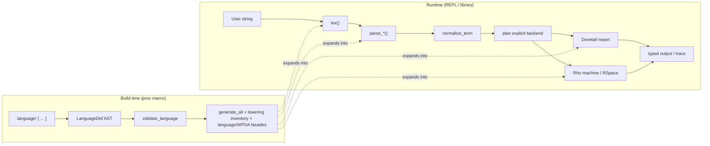

# MeTTaIL Developer README

This file explains the project for people who need to **change** the framework or **add** languages—not only use them.  
Think of this project as a **language factory** + **language runner**:

- **Build-time pipeline** = factory: turns your `language! { ... }` definition into Rust code (expanded at compile time).
- **Runtime pipeline** = runner: takes user text through the stack-safe parser and normalizer, then an explicitly planned Dovetail or Rho-machine backend.

---

## Table of contents

1. [End-to-end picture](#end-to-end-picture)
2. [Background technologies](#background-technologies)
3. [Part 1: Build-time pipeline](#part-1-build-time-pipeline-compile-language-dsl-into-rust-code)
4. [Part 2: Runtime pipeline](#part-2-runtime-pipeline-user-input--parseevaluate--results)
5. [Guide: defining a language theory](#guide-defining-a-language-theory)
6. [Where to change what (cookbook)](#where-to-change-what-cookbook)
7. [Adding a new language to the REPL](#adding-a-new-language-to-the-repl)
8. [Generated artifacts on disk](#generated-artifacts-on-disk)
9. [Project map](#project-map-one-line-purpose-per-crate)
10. [Glossary](#glossary-quick-newbie-terms)

---

## End-to-end picture


```mermaid
flowchart LR
  subgraph build["Build time (proc macro)"]
    DSL["language! { ... }"]
    AST["LanguageDef AST"]
    VAL["validate_language"]
    GEN["generate_all + lowering inventory + language/WPDA facades"]
    DSL --> AST --> VAL --> GEN
  end
  subgraph rt["Runtime (REPL / library)"]
    TXT["User string"]
    LEX["lex()"]
    PAR["parse_*()"]
    NORM["normalize_term"]
    PLAN["plan explicit backend"]
    DOV["Dovetail report"]
    RHO["Rho machine / RSpace"]
    TXT --> LEX --> PAR --> NORM --> PLAN
    PLAN --> DOV --> OUT["typed output / trace"]
    PLAN --> RHO --> OUT
  end
  GEN -.->|expands into| LEX
  GEN -.->|expands into| PAR
  GEN -.->|expands into| DOV
  GEN -.->|expands into| RHO
```


The macro crate (`mettail-macros`) parses and validates the DSL, then emits Rust AST types,
stack-safe term operations, parser/display code, lowering-disposition evidence, and Dovetail/Rho
contracts. The `languages` crate contains modules that invoke `language!`; compiling that crate is
what runs the factory. The legacy Ascent backend is retired and its trait hook fails closed.

**Deeper:** Expanding `language!` happens while compiling the crate that contains it (e.g. `mettail-languages`). `cargo expand` (or `rustc` with the right flags) can show the expanded Rust for debugging. Generated names follow predictable patterns (`{Name}Language`, `parse_{Category}`, relations from `macros/src/logic/relations.rs`), so you can search the expansion for a substring from your theory when something fails late in codegen.

---

## Background technologies

This section is for developers who know Rust but may not know **Datalog**, **trampoline parsing**, or **why** the repo is split into `macros`, `prattail`, `runtime`, and generated glue.

### Rust procedural macros (`language!`), `syn`, and `quote`

A **procedural macro** is a Rust function that runs at **compile time** on a stream of tokens and returns a new token stream. The `language! { ... }` block is not interpreted by the normal Rust compiler; it is handed to `macros/src/lib.rs`, which:

1. Parses the inside of the macro with the **syn** crate (Rust token trees + custom `Parse` implementations for the DSL in `macros/src/ast/`).
2. Builds an in-memory **LanguageDef** AST.
3. Emits Rust source using **quote!** and **proc_macro2**, often as very large `TokenStream` fragments spliced together.

You never “run” the macro at runtime; you **compile** a crate that uses it, and the output is ordinary Rust types and functions inlined at the call site. That is why navigation can feel odd: the “implementation” of a language often exists only **after** macro expansion.

**Deeper:** `proc_macro2` lets the macro crate build tokens before they are converted to the compiler’s `proc_macro::TokenStream`. That matters because parser generator output is sometimes built as strings and then re-parsed. Errors in generated code show up as rustc errors in the **caller’s** crate, with spans sometimes pointing at the `language!` invocation; read the error chain to see which generated fragment failed.

---

### Dovetail and Rho-machine backends

**Dovetail** is the checked term-rewrite/e-graph lane. Generated reports carry exact term keys,
derivation edges, rule-firing justifications, and an explicit completeness status. Typed lowering and
reconstruction preserve AST structure instead of round-tripping through display strings.

The **Rho-machine** lane lowers supported language constructs to normalized `rhoapi::Par` and
executes communication on RSpace. Its reactive stepper reports committed COMM events and the native
fold/substitution steps interleaved with them. Backend planning is explicit: a language cannot
silently fall back from a required Rho artifact to an unrelated evaluator.

**Ascent is legacy context only.** `RuntimeBackend::Ascent`, `AscentResults`, and `run_ascent` remain
for compatibility/reference surfaces, but generated production languages do not embed an Ascent
program and the default `run_ascent` hook fails closed. Old `*-datalog.rs` files and Ascent-oriented
documents are historical evidence, not generated runtime inputs.

---

### Datalog-style queries (`mettail-query`)

The **`query/`** crate is a compatibility query layer over an explicitly supplied
`AscentResults`-shaped snapshot; it is not a production rewrite backend. A rule string is parsed,
planned, and executed as joins/filters over that snapshot.

If you know SQL, think “read-only analytics over a materialized compatibility snapshot.”

**Deeper:** Queries see **stringified** term representations, not raw Rust AST pointers. That keeps
the query engine language-agnostic but means it reasons about display equality. Do not route new
runtime semantics through this legacy snapshot format.

---

### PraTTaIL (parser + lexer codegen in this repo)

**PraTTaIL** is the **MeTTaIL parser generator**: the `prattail/` crate. The name reflects the design: **Pratt** parsing (precedence climbing / binding powers for mixfix operators) combined with **generated lexers**, **recursive-descent** pieces for binders and awkward syntax, and supporting infrastructure.

**Pratt parsing (very short):** Each token has **binding powers** (left/right). The parser reads a **prefix** (operand or prefix operator), then while the next operator “binds tighter” than the caller’s minimum, it consumes **infix** operators and right-hand sides. That yields correct precedence without a separate precedence table phase for every expression shape.

**LanguageSpec:** The macro AST (`LanguageDef`) is **lowered** in `prattail_bridge.rs` to a flatter `LanguageSpec`: categories, syntax items, and rule inputs. PraTTaIL classifies rules (infix, cast, etc.) and runs the **pipeline** in `prattail/src/pipeline.rs` (lexer bundle → parser bundle → Rust source strings → `TokenStream`).

**What PraTTaIL does *not* do:** It does not implement rewriting semantics; it produces lexing,
stack-safe `parse_<Category>` entry points, and recovery helpers. Equations and `~>` are classified
by the lowering-disposition/Dovetail/Rho codegen paths.

**Deeper:** The bridge injects **synthetic** rules (bare identifiers as variables, collection literals, etc.) so user-written `terms { }` do not have to repeat boilerplate. Changing **only** PraTTaIL cannot add a new `language!` keyword—the DSL is defined in `macros/src/ast/`. Conversely, changing **only** `terms { }` often suffices to fix parse errors because it reshapes `LanguageSpec` and thus the whole lexer/parser product.

---

### Trampoline parsers (`prattail/src/trampoline.rs`)

Naive **mutual recursion** (`parse_A` calls `parse_B` calls `parse_A` …) uses the **call stack**. For very deep or pathological inputs, that can **overflow the stack**.

A **trampoline** parser **replaces recursion with an explicit stack of continuations** (frames) on the **heap**. The generated `parse_Cat` loops: alternate “parse a prefix / push frame” with “infix loop and unwind.” Tail-like situations avoid redundant frames. Deeply nested terms then consume heap, not fixed stack depth—see the module docs in `trampoline.rs` (“Stack-safe trampolined parser generation”).

MeTTaIL’s generated parsers use this codegen path so the REPL and tests are robust on large nestings. **Recovery** variants (`*_recovering`) extend the same idea for partial error recovery.

**Deeper:** Each category gets a generated `Frame_Cat` enum that records “what to do next” instead of nesting calls. The tradeoff is more generated code size and a more complex generator, but predictable memory behavior for adversarial depths. Very complex collection rules (e.g. certain ZipMapSep+binder shapes) may still use standalone recursive-descent helpers rather than the full trampoline split—see `is_simple_collection` / `has_zipmapsep` logic in `trampoline.rs`.

---

### Lexer generation (`prattail/src/automata`, `lexer.rs`)

The lexer is **generated** from the terminals implied by the grammar (literals, keywords, punctuation). Conceptually: extract character classes and patterns, build automata, emit a function in the family `lex(input) -> Vec<(Token, Range)>`. You do not hand-write token kinds for each language; they fall out of `LanguageSpec` plus literal configuration from the DSL (`literals { ... }`, bridge).

**Deeper:** Literal token definitions in `literals { }` supply **regex-like patterns** and Rust `eval` blocks; the lexer generator merges these with punctuators and keywords derived from quoted `"..."` fragments in `terms { }`. Ambiguity between two literal classes (overlapping regexes) shows up as wrong tokens first—narrow patterns or reordering may be needed. The bridge may add collection delimiters as terminals when you declare `List`/`Bag`/`Map`/`Set` with `[ open, close, sep ]`-style syntax in `types { }`.

---

### FIRST/FOLLOW, dispatch, and prediction (`prattail/src/prediction.rs`, `dispatch.rs`)

**LL-style parsing** needs to decide **which rule** to try from the **next tokens**. **FIRST** sets approximate “what token can start this construct”; **FOLLOW** sets help with error recovery and conflict reporting. PraTTaIL computes these to:

- Choose between ambiguous prefix alternatives where possible  
- Emit **warnings** for risky grammars  
- Support optional **WFST / beam** features (feature-gated) for disambiguation

You rarely edit this when adding a language; you feel it when the grammar is ambiguous and the generator warns or picks a disambiguation.

**Deeper:** Cross-category dispatch (`dispatch.rs`) matters when the **same** token sequence could start multiple categories; FIRST/FOLLOW overlap diagnostics tell you “reduce/reduce” risk before runtime. The optional WFST path uses weights to rank parses—see `language!` `options { beam_width: ... }` and feature flags in the workspace `Cargo.toml`.

---

### `moniker` and binding-aware terms

**[moniker](https://github.com/brendanzab/moniker)** is a Rust library for **names, binding, and α-equivalence**. Generated AST nodes use moniker-style variables for **bound** names (lambdas, pattern binders).

MeTTaIL’s **substitution** codegen (`macros/src/gen/term_ops/subst.rs`) must **avoid capture**: substituting `N` into `^x.M` must not let free variables in `N` become accidentally bound by `x`. Moniker-style abstractions make that implementable in generated code.

If you have only used `String` for variable names in interpreters, think of moniker as the difference between “rename symbols” and “respect binder scope.”

**Deeper:** Generated `subst`/`open`/`close` operations follow the shape of each AST variant. If you add a binder form in `terms { }`, codegen must know how substitution walks under it—most binder shapes come from the `^x.body:[Dom -> Cod]` family already handled in `macros/src/gen/term_ops/subst.rs`. Getting this wrong shows up as “variable not captured” bugs in the REPL, not parse errors.

---

### Runtime glue: `Term`, `Language`, and backend reports

**Runtime glue** is the **interface layer** between:

- **User-facing code** (REPL, tests, binaries) that wants to treat languages uniformly, and  
- **Generated per-language code** (concrete AST enums, stack-safe operations, parser functions, and backend contracts).

The shared **`runtime/`** crate defines:

- **Term:** `dyn`-compatible trait (`clone_box`, `term_id`, `Display`, …) so the REPL can hold `Box<dyn Term>` without knowing `Rholang` vs `Calculator`.
- **Language:** parse, normalize, environment APIs, type inference hooks, backend requirements, and substrate-neutral execution reports—all implemented by generated `{Name}Language` code and runtime bridges.
- **RuntimeBackendReport:** identifies the selected backend/artifact and carries either a checked Dovetail report, Rho observations, or a live Rho reduction trace.
- **AscentResults:** retained only as a compatibility/reference snapshot; production backend selection must not depend on it.

**Why glue?** Without it, every tool would depend on every `languages::rholang::*` type. The traits make **one** REPL and **one** query engine possible; new languages register behind `Box<dyn Language>` (`repl/src/registry.rs`).

**Deeper:** compatibility `term_id` values are session-local handles. Consensus-sensitive identity
uses generated semantic/exact keys, not allocation identity or display text. Multi-category
languages wrap values in `{Name}TermInner` enums; `parse_term` selects the configured primary
category or its generated entry point.

---

### Blockly and visual blocks

**Blockly** output (`macros/src/gen/blockly/*`) generates **TypeScript** block definitions for a visual editor. It is independent of runtime-backend semantics: it mirrors the language surface for another UI.

**Deeper:** Blockly generation walks the same `LanguageDef` as the rest of codegen but emits `.ts` for a different consumer. Failures to write block files are usually non-fatal (`eprintln!` in `macros/src/lib.rs`). If blocks drift from real parseable syntax, fix the block generator templates in `macros/src/gen/blockly/`, not the PraTTaIL grammar, unless the surface form itself changed.

---

### Other names you may see


| Name                              | What it is                                                                                                                                       |
| --------------------------------- | ------------------------------------------------------------------------------------------------------------------------------------------------ |
| **Stratification**                | Logical negation layered so guard/rule semantics remain well-defined; invalid cycles are compile-time errors.                                   |
| **Congruence**                    | Rules that lift rewrites/equalities **under** constructors (if inner changes, outer does too).                                                   |
| **WFST**                          | Weighted finite-state transducer; optional feature in PraTTaIL for weighted lexing / disambiguation (`wfst` feature).                            |
| `AscentResults` / `run_ascent` | Compatibility/reference surfaces from the retired backend; generated production languages fail closed here.                                    |


---

## Part 1: Build-time pipeline (compile `language!` DSL into Rust code)

### 0) Orchestrator: what runs, in what order

The procedural macro entry point is `macros/src/lib.rs`. For each `language!` invocation it does, in order:

1. **Parse** the token stream into `LanguageDef` (`syn` custom parser in `macros/src/ast/language.rs`).
2. **Compose and validate** (`ast/src/merge.rs`, `ast/src/validation/`) — apply fragments/includes/mixins, enforce grammar and binding invariants, auto-inject required rules, and reject non-stratified logical guards.
3. **`generate_all`** (`macros/src/gen/mod.rs`) — AST enums, stack-safe term operations, display, environments, Dovetail/Rho lowering support, and the **inline PraTTaIL/WPDA parser**.
4. **Build the lowering-disposition inventory** (`macros/src/gen/runtime/dovetail_report.rs`) — every equation orientation, rewrite, and fold is delivered, delegated, suppressed by a named decision, or rejected at compile time.
5. **Generate metadata, the language facade, and the WPDA engine** (`macros/src/gen/runtime/{metadata,language,wpda_codegen}.rs`). The legacy Ascent backend is retired; its trait entry point fails closed.
6. **Generate opt-in tests, simulators, strategies, and Blockly output** (`macros/src/gen/test_gen/`, `macros/src/gen/blockly/`).
7. **Spill large modules** to `target/generated/<language>/` and return compact `include!` wrappers. The migration step also removes known retired artifacts such as the former uncalled `freshness.rs` module (#95).

Everything is concatenated into one `TokenStream` returned from the macro (except Blockly files, which are written explicitly).

**Deeper:** Failures in step 3 often look like Rust type errors in generated parser or term-operation modules. Lowering failures should instead surface as named compile-time disposition diagnostics; inspect `target/generated/<language>/dovetail_report.rs`, `rho_net_invocation.rs`, and `metadata.rs` to see the materialized runtime contract.

---

### 1) Starting point: you write a language

Typical locations:

- `languages/src/rholang.rs`
- `languages/src/calculator.rs`
- `languages/src/lambda.rs`
- `languages/src/ambient.rs`

Each file uses:

```rust
language! {
  name: MyLang,
  types { ... },
  terms { ... },
  equations { ... },
  rewrites { ... },
  logic { ... }   // optional: reflected logical relations and guarded rules
}
```

**Mental model:** you declare algebraic sorts (`types`), constructors and concrete syntax (`terms`),
when two terms are equal (`equations`), and directed rewrite steps (`rewrites`). Optional `logic { }`
adds reflected logical vocabulary and guarded rules; it does not install a separate evaluator.

Section-by-section syntax and semantics are in [Guide: defining a language theory](#guide-defining-a-language-theory).

---

### 2) Macro entry point


| Item                            | Location            |
| ------------------------------- | ------------------- |
| `#[proc_macro] pub fn language` | `macros/src/lib.rs` |


This is the only procedural macro exported for defining languages. Submodules: `ast`, `gen`, `logic`.

---

### 3) DSL parsing and AST (`LanguageDef`)


| Concern                                                                                 | Primary files                                                                 |
| --------------------------------------------------------------------------------------- | ----------------------------------------------------------------------------- |
| Top-level `language!` parse (`LanguageDef`, `Equation`, `RewriteRule`, `LogicBlock`, …) | `macros/src/ast/language.rs`                                                  |
| Grammar rules (`terms { ... }`)                                                         | `macros/src/ast/grammar.rs`                                                   |
| Patterns on LHS/RHS of equations and rewrites                                           | `macros/src/ast/pattern.rs`                                                   |
| Types, collections, native types                                                        | `macros/src/ast/types.rs` (and references from `language.rs`)                 |
| Validation errors                                                                       | `macros/src/ast/validation/validator.rs` (+ sibling modules in `validation/`) |


**Flow:** TokenStream → `LanguageDef` struct graph in memory. No code generation here—only structure.

**To extend DSL syntax:** you usually add/extend `Parse` implementations and structs in `macros/src/ast/`, then teach `gen/` and `logic/` about the new constructs.

---

### 4) Bridge to PraTTaIL (`LanguageSpec`)


| Item                                                | Location                                                                             |
| --------------------------------------------------- | ------------------------------------------------------------------------------------ |
| `LanguageDef` → `LanguageSpec` (structural mapping) | `macros/src/gen/syntax/parser/prattail_bridge.rs` (`language_def_to_spec`)           |
| Parser codegen from spec                            | `prattail/src/lib.rs` — `pub fn generate_parser(spec: &LanguageSpec) -> TokenStream` |
| Spec construction + classification                  | `LanguageSpec::new` and related in `prattail/`                                       |


The bridge adds **synthetic** rules (variable rules, collection literals, etc.) so that identifiers and list/bag/map syntax behave consistently with the rest of codegen.

**PraTTaIL** (`prattail/` crate) is the **lexer + Pratt/recursive-descent parser generator**. It does not know about equations or Ascent; it only consumes `LanguageSpec`.

---

### 5) Parser + lexer code generation (PraTTaIL pipeline)


| Stage                 | Role                                                                                              | Main locations                                           |
| --------------------- | ------------------------------------------------------------------------------------------------- | -------------------------------------------------------- |
| Orchestration         | Extract `LanguageSpec` → bundles → generate lexer string + parser string → parse to `TokenStream` | `prattail/src/pipeline.rs`                               |
| Lexer                 | Terminals, regex/NFA/DFA-style tables, `lex()`                                                    | `prattail/src/automata/`*, `prattail/src/lexer.rs`       |
| Pratt / mixfix        | Binding power, infix/prefix dispatch                                                              | `prattail/src/pratt.rs`, `prattail/src/binding_power.rs` |
| Recursive descent     | Lambdas, `$name`, collection-heavy constructs                                                     | `prattail/src/recursive.rs`                              |
| Trampoline / recovery | Stack-safe parsing, error recovery entrypoints                                                    | `prattail/src/trampoline.rs`                             |
| Dispatch / prediction | FIRST/FOLLOW, warnings, optional WFST-related paths                                               | `prattail/src/dispatch.rs`, `prattail/src/prediction.rs` |


**Emitted in the expanded crate (per language):** functions such as `lex`, `parse_<Category>`, `parse_<Category>_recovering`, and category `impl` methods wired in `macros/src/gen/mod.rs` (`generate_prattail_category_parse_impls`).

**To change how text becomes tokens:** work in `prattail` lexer paths or literal patterns (also influenced by `literals { ... }` in the DSL and bridge mapping).

**To change how tokens become AST:** work in PraTTaIL parser generation, or adjust grammar rules in `terms { }` so the spec changes (often the first lever).

---

### 6) Rewrite / equation lowering (Dovetail and in-Rho)


| Concern | Location |
| --- | --- |
| Lowering census and Dovetail report | `macros/src/gen/runtime/dovetail_report.rs` and its submodules |
| Typed reconstruction and withholding | `macros/src/gen/runtime/dovetail_report/{typed_lowering,typed_report,withholding,reconstruct}.rs` |
| Binder structural congruence | `macros/src/gen/runtime/binder_congruence.rs` |
| In-Rho net/scalar contracts | `macros/src/gen/runtime/{rho_invocation,rho_dataflow}.rs`, `rholang-codegen/` |
| Predicated-type stratification | `macros/src/logic/stratification.rs` |
| Generated-module writer and retirement migrations | `macros/src/logic/writer.rs` |


**Generated model (per language):** typed AST constructors and operations feed a lowering-disposition
inventory, Dovetail rewrite descriptions, and Rho set-automaton/native-invocation contracts. Structural
equations may be absorbed by the carrier, discharged by a generated pass (for example binder
freshen-then-float), or lowered into the in-Rho lane. Unsupported shapes fail closed by name instead
of silently disappearing. The old generated Ascent relation graph (`eq_*`, `rw_*`, `fold_*`) is not a
runtime backend.

**To change rewrite behavior:** edit `rewrites { }` / `equations { }` in the language `.rs` file,
then verify its lowering disposition. Extend the typed Dovetail or Rho lowering when a shape is not
representable; do not bypass the inventory through a second evaluator.

---

### 7) Types, term operations, runtime glue


| Concern                                    | Location                                                  |
| ------------------------------------------ | --------------------------------------------------------- |
| Codegen umbrella                           | `macros/src/gen/mod.rs` — `generate_all`                  |
| AST enums / variants                       | `macros/src/gen/types/enums.rs`                           |
| `Display` / pretty concrete syntax         | `macros/src/gen/syntax/display.rs`                        |
| Variable inference for parsing             | `macros/src/gen/syntax/var_inference.rs`                  |
| Substitution (including binders)           | `macros/src/gen/term_ops/subst.rs`                        |
| Normalization (beta, flatten, etc.)        | `macros/src/gen/term_ops/normalize.rs`, `flatten` helpers |
| “Ground” checks                            | `macros/src/gen/term_ops/ground.rs`                       |
| Native eval (`try_eval`, constant folding) | `macros/src/gen/native/eval.rs`                           |
| Environments (`name = term` in REPL)       | `macros/src/gen/runtime/environment.rs`                   |
| `Language` + `Term` impls, fail-closed legacy hook | `macros/src/gen/runtime/language.rs`                |
| Metadata                                   | `macros/src/gen/runtime/metadata.rs`                      |
| Random/exhaustive term generation (tests)  | `macros/src/gen/term_gen/*`                               |


**To change how terms print:** `macros/src/gen/syntax/display.rs` (generator), not hand-editing output.

**To change substitution or normalization:** `term_ops/`* generators.

**To change direct numeric/bool evaluation:** native types in the DSL + `macros/src/gen/native/`*.

---

### 8) Where generated files go


| Artifact                                           | When                                              | Path pattern                                                                                                      |
| -------------------------------------------------- | ------------------------------------------------- | ----------------------------------------------------------------------------------------------------------------- |
| Rust modules (types, parser, operations, backend contracts, `Language` impl) | Every build | `target/generated/<language>/*.rs`, included by compact macro-expansion wrappers; generated files are inspection artifacts, not edit targets. |
| Retired generated module cleanup                   | During expansion                                  | `retire_lang_module` removes exact known stale outputs such as `freshness.rs`; it never deletes a language directory. |
| Blockly                                            | If Blockly codegen runs                           | `languages/src/generated/<language>-blocks.ts`, `...-categories.ts` (`macros/src/gen/blockly/writer.rs`)          |


---

### Build-time mini sample (mental model)

You write:

```text
Add . a "+" b : Proc ![a + b] fold;
```

The factory tends to produce (conceptually):

- Lexer acceptance for `+`
- A Pratt rule for infix `Add` with correct binding power
- An AST variant `Proc::Add(...)` (names depend on your rule label)
- Fold/eval wiring and typed lowering metadata so ground arithmetic can reduce on its declared lane

Exact names are determined by your `terms` declaration and type names.

---

## Part 2: Runtime pipeline (user input → parse / evaluate / rewrite → results)

### 1) Entry points and shared interfaces

| Item | Location |
| --- | --- |
| Interactive shell and registry | `repl/src/repl.rs`, `repl/src/registry.rs` |
| Substrate-neutral traits/reports | `runtime/src/language.rs` |
| Production Rho/RSpace bridge | `rholang-runtime/` |
| Dovetail engine and reports | `dovetail/` |

Generated `{Name}Language` implements `Language`: parsing and normalization stay language-local,
while backend requirements and outputs use runtime-neutral types. A production execution result is a
`RuntimeBackendReport`, not an implicit evaluator fallback.

### 2) Production execution order

1. Resolve the language and parse with its generated WPDA/trampoline entry point.
2. Apply environment substitution and generated stack-safe normalization.
3. Validate the language's lowering-disposition inventory and backend requirements.
4. Plan an explicit backend/artifact pair:
   - Dovetail produces a checked `RuntimeDovetailRunReport`; or
   - the Rho path injects normalized `rhoapi::Par` and executes on RSpace.
5. Return a typed report: Dovetail derivation/firing evidence, resting Rho observations, or a live
   Rho reduction trace whose principled reduction unit is a committed COMM.

The legacy `run_ascent` hook is deliberately not step 4: generated implementations inherit a
fail-closed default. Likewise, production Rho integration does not serialize a term to display text
and parse it again.

### 3) Arithmetic and native folds

A ground fold such as `3 + 4` is represented by its typed constructor and lowering disposition.
The generated native dispatcher may reduce it in the Dovetail pre-phase or the declared Rho-native
lane. Its contractum and justification remain typed; neither path requires an Ascent relation or a
display-string identity.

### 4) Process communication

A Rholang process parses to generated constructors and lowers to normalized `rhoapi::Par`.
Communication is performed by the Rho machine against RSpace. The reactive stepper exposes committed
COMM events and associated native/substitution steps so callers can stop, inspect, or continue
without inventing a traversal-depth limit.

### 5) Compatibility query snapshots

`query/` can still analyze an explicitly materialized `AscentResults`-shaped snapshot. This is a
read-only compatibility facility, not a route for new language execution or backend integration.

---

## Guide: defining a language theory

This guide walks through **each block** of a `language!` definition: the syntax you write, what it **means** semantically, what **goal** it serves, and how the **factory** uses it. The canonical parse order of blocks is fixed (`macros/src/ast/language.rs`, `impl Parse for LanguageDef`).

### Top-level shape and block order

```text
language! {
    name: YourLanguage,
    options { ... },       /* optional */
    types { ... },
    literals { ... },      /* optional; requires types before it */
    terms { ... },
    equations { ... },
    rewrites { ... },
    logic { ... },         /* optional */
}
```

Comma separation between major clauses follows normal Rust macro parsing (trailing commas are fine where Rust allows). If you omit optional blocks, the parser still expects `types` and typically `terms`; empty `equations { }` / `rewrites { }` are valid when you only need parsing.

**How it fits together:** `types` fixes the sorting discipline (what kinds of AST nodes exist).
`terms` determines concrete syntax and constructors (plus native fold bodies). `literals` customizes
lexer tokens. `equations` and `rewrites` declare semantics that must receive an explicit lowering
disposition. `logic` contributes reflected logical relations and guarded rules.

---

### `name:` — language identifier

**Syntax:** `name: Ident,`

**Semantics:** Becomes the Rust identifier prefix for generated items: `YourLanguage`, `YourLanguageLanguage`, `parse_Proc`, etc., and the string returned by `Language::name()`.

**Goal:** Stable human- and machine-readable label; used in REPL prompts and metadata.

**How it works:** Referenced throughout `macros/src/gen/*`, metadata, and backend lowering for stable
generated identifiers, artifact directories, fingerprints, and diagnostics.

---

### `options { }` — rare configuration

**Syntax:** `options { key: value, ... }` where `value` is a float, integer, bool, string literal, or keyword identifier (`none`, `auto`, … depending on key).

**Semantics:** Key–value map (`AttributeValue` in `macros/src/ast/language.rs`). Known keys include PraTTaIL-related settings such as **`beam_width`** (float or `none` / `disabled` / `auto`) and **`log_semiring_model_path`** (string); **`dispatch`** controls dispatch strategy when using WFST-related features.

**Goal:** Tune parser disambiguation without forking the DSL; most small languages omit `options`.

**How it works:** Parsed into `LanguageDef.options` and read by codegen paths that care (e.g. PraTTaIL when the `wfst` feature is on). Unused keys may be accepted with less validation—extend validation if you add a new option.

---

### `types { }` — sorts, native payload types, collections

**Syntax (examples):**

```text
types {
    Proc                                    /* algebraic sort, carried in AST enum */
    ![i32] as Int                           /* sort Int with runtime payload i32 */
    ![Vec<Proc>] as List                    /* collection sort; element type in Vec<...> */
    Bag [ "{", "}", "|" ]                   /* multiset with delimiter triple for surface syntax */
}
```

- Plain `Name;` declares a **category** with no built-in Rust payload (pure algebraic).
- `![RustType] as Category` declares that AST values of `Category` carry a **native** `RustType` (integers, `bool`, `str`, custom Newtypes, etc.). This enables **`try_direct_eval`**, `fold`/`step` codegen, and native printers.
- **`List` / `Bag` / `Map` / `Set`** entries can use bracket delimiter specs; internally bound to `CollectionCategory` (`macros/src/ast/language.rs`). The **native** type is usually `Vec<Elem>`, `HashBag<Elem>`, `HashMapLit<K,V>`, or `HashSetLit<Elem>`.

**Semantics:** Defines the set of generated **enum variants per category**, variable forms (`IVar`, `PVar`, … from naming conventions), and what PraTTaIL treats as a **category** in `LanguageSpec`.

**Goal:** Separates “what kinds of things exist in my language” from “how to parse them” (`terms`).

**How it works:** `macros/src/gen/types/enums.rs` emits the AST; `prattail_bridge.rs` emits `CategorySpec` rows (primary category, `has_var`, optional `native_type` string); `macros/src/logic/relations.rs` emits `category(...)`, `eq_*`, `rw_*`, and optionally `fold_*` relations.

---

### `literals { }` — lexer classes for literals

**Syntax:**

```text
literals {
    Int {
        pattern: r"[0-9]+";
        eval: ![ { /* expression using `text: &str` */ } ]
    }
}
```

**Semantics:** Each entry names a **type** (must correspond to a `types` entry), provides a **regex-style pattern** string for the generated lexer, and an **`eval`** block `![ ... ]` that returns `Result<NativeValue, ()>` (or compatible) given implicit `text: &str`.

**Goal:** Let you control how numeric/string/bool literals look **without** encoding every digit as a separate `terms` rule.

**How it works:** Wired into PraTTaIL literal patterns (`LiteralSpec` → lexer codegen). See `languages/src/calculator.rs` for rich examples (BigInt, rationals, floats, strings).

---

### `terms { }` — constructors, grammar, evaluation hooks

MeTTaIL supports two styles (see `GrammarRule` in `macros/src/ast/grammar.rs`):

1. **Judgement style (preferred):**  
   `Label . context |- concrete_syntax : Category [rust_code] [eval_mode] [right] [prefix(N)] ;`
2. **Legacy BNFC style:**  
   `Label . Category ::= item item ... ;`

#### Judgement rule anatomy

- **`Label`** — constructor / variant name (becomes `Category::Label(...)` in the generated enum).
- **Context** — comma-separated binders, e.g. `n:Name, ^x.p:[Name -> Proc]`
  - Simple `x:Ty` — subtree parameter.
  - **`^x.p:[Dom -> Cod]`** — higher-order binder: `x` bound in `p` (generates moniker `Lam`/`Apply` plumbing).
  - **`^[xs].p:[Dom* -> Cod]`** — multi-binder form.
- **`|-`** — separates metasyntax (binders) from object syntax.
- **Concrete syntax** — quoted literals (`"+"`), parameter references (`a`, `p`), binders (`<Name>` in old style; in judgements abstraction is in context), collections with `ps.*sep("|")`-flavored metasyntax (`#sep`, `#map`, `#zip`, `#opt` in `SyntaxExpr`).
- **`: Category`** — sort of the whole form.
- **Optional `![expr]`** — Rust expression constructing the native or algebraic value (often refers to parameters by name). Used for **constant folding** and injections.
- **Optional `fold` or `step`** (`EvalMode` in `macros/src/ast/types.rs`)
  - **`fold`** — a native reduction whose generated dispatcher and lowering disposition determine whether it runs in Dovetail or a supported Rho-native lane.
  - **`step`** — mark rules for **congruence / small-step** plumbing (useful when you must not collapse everything to a single big_fold).
- **`right`** — right-associative infix for this rule.
- **`prefix(N)`** — explicit binding power for prefix operators.

**Semantics:** Each rule contributes **both** a parser production **and** an AST constructor. Infix/nfix rules get Pratt binding powers from PraTTaIL classification.

**Goal:** Single source of truth for “what the program looks like” and “what its tree is.”

**How it works:** `prattail_bridge` lowers rules to `RuleSpecInput`; PraTTaIL emits parse functions;
`macros/src/gen/types` plus display/substitution/normalization generators read the same `GrammarRule`
list. Native `![...]` blocks feed `macros/src/gen/native/eval.rs` and the typed fold dispatchers.

---

### `equations { }` — undirected equality

**Syntax (judgement style):**

```text
RuleName . optional_type_context | optional_premises |- lhs_pattern = rhs_pattern ;
```

- **Premises** (after `|`) can include **freshness** `x # P` (“`x` not free in `P`”), **relation queries**, and **`forall`**-style iteration over collections (`Premise` in `macros/src/ast/language.rs`).
- **Patterns** on LHS/RHS use the same pattern language as rewrites (`macros/src/ast/pattern.rs`).

**Semantics:** **Equivalence** up to congruence. The declaration enters the lowering-disposition
inventory; its delivered representation depends on the carrier and runtime lane rather than a
generated `eq_<category>` relation.

**Goal:** Algebraic laws, type identifications, undefined behavior collapse—anything **symmetric** in intent.

**How it works:** `macros/src/gen/runtime/dovetail_report.rs` and the in-Rho lowering classify each
orientation. Carrier-native laws are absorbed, binder laws may use generated structural passes,
and materialized rules are emitted as typed Dovetail/Rho contracts. Any unhandled declaration is a
named refusal.

---

### `rewrites { }` — directed reduction

**Syntax:**

```text
RuleName . optional_type_context | optional_premises |- lhs_pattern ~> rhs_pattern ;
```

- **Congruence-style conditional rewrites:** premises may include **`S ~> T`** (if inner rewrites, outer can rewrite)—see `Premise::Congruence` and examples like `if S ~> T then (...)` in `README.md` / `rholang.rs`.

**Semantics:** **Directed** reduction rules. Dovetail congruence and in-Rho set-automaton contracts
materialize the contexts that each lowering lane can represent.

**Goal:** Operational semantics, reduction, commutations, COMM-like rules in the ρ-calculus style.

**How it works:** `macros/src/gen/runtime/dovetail_report.rs` generates typed/base/contextual
Dovetail descriptions, while `rholang-codegen/` plans in-Rho matching and native invocations.
Freshness-sensitive binder float is freshen-then-float and therefore needs no generated
`is_fresh` helper (#95).

---

### `logic { }` — reflected logical relations and guards

**Syntax:** The block declares logical relations and rules that MeTTaIL reflects in metadata and
uses for predicated-type guard analysis. Older specifications may contain Ascent-shaped rule text;
the retired Ascent runtime no longer executes it.

```text
logic { 
    relation path(Proc, Proc);
    path(x, y) <-- rw_proc(x, y);
    path(x, z) <-- rw_proc(x, y), path(y, z);
}
```

**Semantics:** Relation declarations participate in validation, fingerprints, metadata, and LogicT
guard planning. They do not splice a custom program into an Ascent runtime.

**Goal:** Declare logical vocabulary and guarded semantics without coupling the language surface to
a retired engine.

**How it works:** `RelationDecl` and rule bodies feed validation, stratification
(`macros/src/logic/stratification.rs`), metadata generation, and the language fingerprint. Runtime
guard evaluation is routed through LogicT/guard codegen where supported.

---

### Minimal skeleton (new language starting point)

```rust
use mettail_macros::language;

language! {
    name: Tiny,
    types {
        ![i32] as Int
        Expr
    },
    literals {
        Int {
            pattern: r"[0-9]+";
            eval: ![ { text.parse::<i32>().map_err(|_| ()) } ]
        }
    },
    terms {
        Lit . n:Int |- n : Expr ;
        Add . a:Expr, b:Expr |- a "+" b : Expr ;
    },
    equations { },
    rewrites { },
}
```

Grow this toward full examples: `languages/src/calculator.rs` (many sorts, `fold`/`step`, rationals) and `languages/src/rholang.rs` (binding, collections, rich rewrite/equation theory).

---

## Where to change what (cookbook)


| Goal                                    | First place to look                                | Notes                                                                                           |
| --------------------------------------- | -------------------------------------------------- | ----------------------------------------------------------------------------------------------- |
| Add / rename sorts                      | `types { }` in language file                       | Drives AST enums, relations, and parser entry points.                                           |
| Add syntax for a construct              | `terms { }`                                        | Changes both AST and PraTTaIL spec via the bridge.                                              |
| Change precedence / fixity              | Grammar in `terms { }` and PraTTaIL classification | If the grammar is ambiguous or wrong classified, `prattail/src/*.rs` (binding power, dispatch). |
| Change pretty-printing                  | `macros/src/gen/syntax/display.rs`                 | Generated `Display` for variants.                                                               |
| Change capture-avoiding substitution    | `macros/src/gen/term_ops/subst.rs`                 | Works with `moniker`-style binding in generated code.                                           |
| Change normalization / beta             | `macros/src/gen/term_ops/normalize.rs`             | Wired into `Language::normalize_term`.                                                          |
| Add equality reasoning                  | `equations { }`                                    | Inspect the lowering-disposition inventory and Dovetail/in-Rho outputs.                          |
| Add rewrite rules                       | `rewrites { }`                                     | Lowered by `dovetail_report` and `rholang-codegen`; unsupported shapes fail closed.              |
| Add logical relations / guards          | `logic { ... }` in language file                   | Reflected, stratified, and routed through supported LogicT guard paths.                           |
| Change runtime result handling          | `macros/src/gen/runtime/language.rs`               | Language facade; the legacy Ascent entry point remains fail-closed.                              |
| REPL commands / UX                      | `repl/src/repl.rs`                                 | Orchestration only; keep language-agnostic.                                                     |
| Register a new language in CLI          | `repl/src/registry.rs`                             | Insert `Box::new(YourLanguage)`.                                                                |


---

## Adding a new language to the REPL

For what each block in `language!` does, see [Guide: defining a language theory](#guide-defining-a-language-theory).

1. Create `languages/src/my_lang.rs` with `language! { name: MyLang, ... }`.
2. Add `pub mod my_lang;` to `languages/src/lib.rs` and re-export any `*_source` or types you need (follow existing modules).
3. Register **`MyLangLanguage`** in `repl/src/registry.rs` (`build_registry`).
4. Run `cargo build -p languages` and inspect `target/generated/my_lang/`, especially metadata,
   Dovetail reports, Rho invocation modules, and the lowering-disposition inventory.
5. Optional: add example snippets under `repl/src/examples/` and wire them in the examples module if you use that pattern.

If something fails at compile time, errors usually point at the macro span in your `language!` block; for parser issues, compare generated parse functions conceptually with `LanguageSpec` from the bridge.

---

## Generated artifacts on disk

- **`target/generated/<name>/*.rs`** — generated Rust modules included by macro wrappers. They are
  readable evidence, but never edit them; change the specification or generator.
- **Blockly `.ts`** — visual block exports when that path runs successfully.
- **Legacy `*-datalog.rs`** — historical artifacts from the retired Ascent backend; they are not
  production inputs and should not be regenerated as a substitute for a lowering disposition.

---

## Project map (one-line purpose per crate)


| Crate                   | Role                                                                      |
| ----------------------- | ------------------------------------------------------------------------- |
| `languages/`            | Concrete `language!` theories and generated artifacts folder              |
| `macros/`               | Compiler from DSL to generated AST/parser/operations/backend contracts    |
| `prattail/`             | Lexer + parser generator used by `macros`                                 |
| `runtime/`              | Shared traits, backend plans, and substrate-neutral reports               |
| `dovetail/`             | Typed e-graph rewrite engine and checked derivation reports               |
| `rholang-codegen/`      | In-Rho set-automaton and native-invocation planning                       |
| `rholang-runtime/`      | RhoRuntime/RSpace execution bridge and reactive COMM stepping             |
| `repl/`                 | CLI / `mettail` binary frontend                                           |
| `query/`                | Compatibility query engine over materialized legacy snapshots             |
| `ascent_syntax_export/` | Legacy Ascent-oriented tooling retained for historical workflows           |


---

## Glossary (quick newbie terms)

Longer treatment of Dovetail, the Rho backend, PraTTaIL, trampoline parsing, and runtime traits:
[Background technologies](#background-technologies).
Syntax and semantics of each `language!` block (`types`, `terms`, `equations`, …): [Guide: defining a language theory](#guide-defining-a-language-theory).

- **DSL:** the `language! { ... }` syntax you author.
- **Token:** lexer output (`+`, integer literal, identifier, …).
- **AST:** typed tree of language terms (generated enums).
- **Rewrite:** directed step `~>` between terms.
- **Equation / equivalence:** undirected equality `=` with a declared, auditable lowering disposition.
- **Dovetail:** typed e-graph/rewrite lane with checked derivation and firing evidence.
- **Rho machine:** production process-calculus lane; committed COMM is its principled reduction unit.
- **Ascent:** retired compatibility/reference backend; generated production languages fail closed.
- **Congruence:** if a subterm rewrites (or equals), the whole term may rewrite (or equal) consistently.
- **PraTTaIL:** **Pratt** + **Ta**il-recursive / **I**nline **L**exer-style pipeline — this project’s parser generator crate name.

---

## TL;DR

- **Build-time:** `language!` → compose/validate → generate stack-safe AST/parser/operations → census every lowering disposition → emit Dovetail/Rho contracts and compact include wrappers.
- **Runtime:** parse → environment substitution → normalize → explicit Dovetail or Rho backend plan → typed report/observations/COMM trace.
- **Tech context:** [Background technologies](#background-technologies) explains the current backends, PraTTaIL, trampolines, `moniker`, and runtime glue.
- **Defining a theory:** [Guide: defining a language theory](#guide-defining-a-language-theory) documents each DSL block (`types`, `terms`, `equations`, `rewrites`, `logic`, …).
- **Navigation anchors:** `languages/src/<your_lang>.rs`, `macros/src/lib.rs`, `macros/src/gen/mod.rs`, `macros/src/gen/runtime/dovetail_report.rs`, `macros/src/gen/syntax/parser/prattail_bridge.rs`, `prattail/src/pipeline.rs`, `runtime/src/language.rs`, `rholang-codegen/`, and `rholang-runtime/`.
